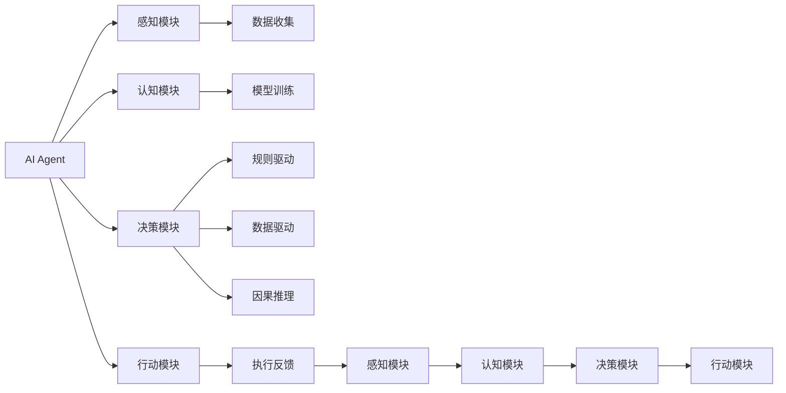

                 

# AI人工智能 Agent：对人类思维方式的影响

> 关键词：AI Agent, 人工智能, 人类思维, 交互式学习, 认知心理学, 自动化决策

## 1. 背景介绍

### 1.1 问题由来

在快速发展的信息时代，人工智能（AI）正日益渗透到人类生活的各个方面，从智能助手到无人驾驶，从工业自动化到医疗诊断，AI的广泛应用极大地提高了生产效率和生活质量。然而，随着AI技术的不断进步，AI系统开始越来越多地模仿人类的思维和行为，形成了一种新的“智能体”——AI Agent（人工智能代理）。AI Agent不仅能自主学习、感知和决策，还能通过交互式学习逐渐接近人类的思维方式。

### 1.2 问题核心关键点

AI Agent对人类思维方式的影响是多方面的，包括：

- **自主学习与推理**：AI Agent通过自监督和迁移学习不断提升其认知能力，能够在复杂环境中进行自主决策和推理。
- **交互式学习**：通过与人类交互，AI Agent能够从人类的反馈中学习，逐渐理解人类的意图和行为模式。
- **认知心理学基础**：AI Agent的设计和优化借鉴了认知心理学原理，有助于揭示人类思维的机制。
- **自动化决策**：AI Agent在决策过程中，能够利用先验知识、数据驱动和因果推理等多种方法，实现高效、准确的自动化决策。

### 1.3 问题研究意义

研究AI Agent对人类思维方式的影响，对于理解人类认知机制、提升AI系统性能、以及推动AI技术的伦理与社会责任具有重要意义：

- **认知机制理解**：通过研究AI Agent的学习和推理过程，可以深入理解人类认知机制，为心理学研究提供新的视角。
- **性能提升**：AI Agent的学习和推理能力可以显著提升AI系统的自动化水平和智能化程度，推动技术进步。
- **伦理与社会责任**：在探索AI Agent对人类思维方式的影响过程中，需要关注其决策过程的可解释性、公平性以及潜在的社会影响，确保AI技术的健康发展。

## 2. 核心概念与联系

### 2.1 核心概念概述

为了更好地理解AI Agent对人类思维方式的影响，我们先介绍几个关键概念：

- **AI Agent**：能够自主学习、感知和决策的人工智能系统，通常包含感知、认知、决策和行动模块。
- **自主学习**：AI Agent通过自监督学习、迁移学习等方法，不断提升其认知能力，实现自主决策和推理。
- **交互式学习**：AI Agent通过与人类交互，从人类的反馈中学习，逐渐理解人类的意图和行为模式。
- **认知心理学基础**：AI Agent的设计和优化借鉴了认知心理学原理，如注意力、记忆、学习、推理等。
- **自动化决策**：AI Agent在决策过程中，能够利用先验知识、数据驱动和因果推理等多种方法，实现高效、准确的自动化决策。

这些概念之间存在着紧密的联系，形成一个完整的AI Agent系统。

### 2.2 概念间的关系

这些核心概念之间可以形成一个综合的流程图，展示它们之间的关系：



这个流程图展示了AI Agent的核心模块和它们之间的关系：

- **感知模块**：负责收集环境数据，为认知和决策提供信息基础。
- **认知模块**：通过模型训练和认知心理学原理，实现对感知数据的理解、推理和记忆。
- **决策模块**：结合规则驱动、数据驱动和因果推理，进行自动化决策。
- **行动模块**：执行决策结果，并反馈给感知模块。

## 3. 核心算法原理 & 具体操作步骤

### 3.1 算法原理概述

AI Agent的核心算法原理主要围绕自主学习、交互式学习和自动化决策展开。以下是对这些算法的详细描述。

### 3.2 算法步骤详解

**3.2.1 自主学习算法**

自主学习算法通常包括以下步骤：

1. **数据收集**：AI Agent通过感知模块收集环境数据，包括视觉、听觉、文本等形式的数据。
2. **预处理**：对收集到的数据进行预处理，如特征提取、归一化等，为后续模型训练做准备。
3. **模型训练**：利用自监督或迁移学习方法，训练认知模块中的神经网络模型。例如，使用预训练语言模型（如BERT）进行微调，以适应特定任务。
4. **推理与决策**：利用训练好的模型，对新数据进行推理和决策。例如，在NLP任务中，利用Transformer模型进行文本分类或序列生成。
5. **反馈与优化**：根据实际结果和预期目标，通过损失函数计算误差，并调整模型参数，优化模型性能。

**3.2.2 交互式学习算法**

交互式学习算法通常包括以下步骤：

1. **初始化**：设定AI Agent的初始策略和行为模式，如对话生成策略、推荐算法等。
2. **交互过程**：AI Agent与人类进行交互，根据人类的反馈调整策略。例如，在聊天机器人中，AI Agent根据用户的回答调整下一步对话策略。
3. **学习更新**：利用人类反馈数据，更新AI Agent的策略和行为模式。例如，使用强化学习算法，通过奖励信号优化对话策略。
4. **结果评估**：定期评估AI Agent的性能，如对话质量、推荐精度等，确保交互式学习的效果。

**3.2.3 自动化决策算法**

自动化决策算法通常包括以下步骤：

1. **规则与知识库**：建立规则与知识库，为AI Agent的决策提供基础。例如，在医疗诊断中，规则库包含疾病诊断标准和参考医学文献。
2. **数据驱动**：利用最新数据和模型推理，实时更新决策依据。例如，在金融风险评估中，利用最新市场数据和模型预测结果进行决策。
3. **因果推理**：利用因果推理方法，分析数据背后的因果关系，提升决策的准确性和鲁棒性。例如，在推荐系统中，利用因果图模型分析用户行为背后的因果关系。
4. **决策执行**：根据决策依据，执行具体的行动。例如，在智能推荐系统中，根据用户偏好生成推荐列表。

### 3.3 算法优缺点

**3.3.1 自主学习算法**

- **优点**：
  - 能够自主获取知识，适应环境变化。
  - 减少人工干预，提升系统效率。
  - 适用于大规模数据集，模型性能提升明显。

- **缺点**：
  - 对数据质量要求高，数据偏差可能导致模型失效。
  - 模型复杂度高，计算资源消耗大。
  - 缺乏对人类行为的直接理解，可能出现“黑箱”问题。

**3.3.2 交互式学习算法**

- **优点**：
  - 通过人类反馈，提高决策的准确性和鲁棒性。
  - 能够动态调整策略，适应不同用户需求。
  - 对数据要求相对较低，适用于数据稀缺的场景。

- **缺点**：
  - 人类行为难以预测，交互过程可能复杂。
  - 学习过程较慢，需要大量时间和数据。
  - 交互式学习的效果依赖于人类反馈的质量。

**3.3.3 自动化决策算法**

- **优点**：
  - 决策过程透明，可解释性强。
  - 规则与数据结合，决策准确性高。
  - 适用于高风险和高效率的场景。

- **缺点**：
  - 规则库和知识库需要持续维护，更新成本高。
  - 对数据的实时性和准确性要求高，数据质量影响决策效果。
  - 因果推理复杂，对数据背后的因果关系要求较高。

### 3.4 算法应用领域

AI Agent的应用领域非常广泛，以下是几个典型的应用场景：

- **智能客服**：利用AI Agent进行自然语言理解和对话生成，提升客户体验。例如，在智能客服系统中，AI Agent能够理解客户的问题，并提供准确的解决方案。
- **推荐系统**：利用AI Agent进行个性化推荐，提升用户体验和系统效率。例如，在电商平台上，AI Agent能够根据用户的历史行为和实时数据生成个性化的商品推荐。
- **医疗诊断**：利用AI Agent进行疾病诊断和治疗方案推荐，提升医疗服务质量。例如，在医疗诊断系统中，AI Agent能够根据患者的症状和历史数据，提供初步的疾病诊断和个性化治疗方案。
- **金融风险评估**：利用AI Agent进行市场数据分析和风险评估，提高投资决策的准确性。例如，在金融投资平台上，AI Agent能够实时分析市场数据，提供投资建议和风险预警。
- **智能交通管理**：利用AI Agent进行交通流量分析和智能调度，提高城市交通效率。例如，在智能交通系统中，AI Agent能够实时分析交通数据，提供交通流量预测和路线优化方案。

## 4. 数学模型和公式 & 详细讲解 & 举例说明

### 4.1 数学模型构建

在AI Agent的设计中，通常会构建多个数学模型，用于不同阶段的处理。例如，在推荐系统中，可以使用协同过滤模型和内容推荐模型，结合用户的兴趣和物品属性进行推荐。

以下是一个基本的协同过滤模型的数学模型构建：

假设用户集合为 $U=\{u_1, u_2, \ldots, u_m\}$，物品集合为 $V=\{v_1, v_2, \ldots, v_n\}$，用户-物品评分矩阵为 $R \in \mathbb{R}^{m \times n}$。设用户 $u_i$ 对物品 $v_j$ 的评分 $r_{ij} \in \{0, 1, 2, \ldots, k\}$，其中 $k$ 为评分范围。

设用户 $u_i$ 对物品 $v_j$ 的潜在评分 $p_{ij} \in \mathbb{R}$，可通过矩阵分解方法求得：

$$
p_{ij} = \sum_{u' \in U} \alpha_{iu'} r_{u'v_j} + \sum_{v' \in V} \beta_{iv'} r_{u'v'}
$$

其中 $\alpha_{iu'}$ 和 $\beta_{iv'}$ 为潜在评分的用户和物品投影向量。

### 4.2 公式推导过程

在协同过滤模型的推导过程中，可以采用矩阵分解方法，将用户-物品评分矩阵 $R$ 分解为两个低秩矩阵的乘积：

$$
R \approx A \times B^T
$$

其中 $A \in \mathbb{R}^{m \times k}$ 为用户的潜在评分投影矩阵，$B \in \mathbb{R}^{k \times n}$ 为物品的潜在评分投影矩阵。

通过最小化损失函数 $\mathcal{L}(A, B) = \frac{1}{2} \|R - A \times B^T\|_F^2$，求解矩阵 $A$ 和 $B$。具体推导过程如下：

$$
\begin{aligned}
\mathcal{L}(A, B) &= \frac{1}{2} \|R - A \times B^T\|_F^2 \\
&= \frac{1}{2} \left( \sum_{i=1}^m \sum_{j=1}^n (r_{ij} - \sum_{u'=1}^m \alpha_{iu'} r_{u'j})^2 \right) \\
&= \frac{1}{2} \left( \sum_{i=1}^m \sum_{j=1}^n \left( r_{ij} - \sum_{u'=1}^m \alpha_{iu'} r_{u'j} \right)^2 \right) \\
&= \frac{1}{2} \left( \sum_{i=1}^m \sum_{j=1}^n r_{ij}^2 \right) - \sum_{i=1}^m \sum_{j=1}^n \sum_{u'=1}^m \alpha_{iu'} r_{u'j} r_{ij}
\end{aligned}
$$

通过求解上述最小化问题，可以求得最优的潜在评分投影矩阵 $A$ 和 $B$，进而得到用户的潜在评分 $p_{ij}$。

### 4.3 案例分析与讲解

以推荐系统为例，利用协同过滤模型进行推荐的过程如下：

1. **数据准备**：收集用户对物品的评分数据，构建用户-物品评分矩阵 $R$。
2. **模型训练**：采用矩阵分解方法，求解最优的潜在评分投影矩阵 $A$ 和 $B$。
3. **推荐生成**：利用训练好的模型，生成用户对物品的潜在评分 $p_{ij}$。
4. **排序输出**：根据潜在评分排序，生成推荐列表。

例如，在一个电商平台上，利用协同过滤模型进行推荐的过程如下：

1. **数据准备**：收集用户对商品的评分数据，构建用户-物品评分矩阵 $R$。
2. **模型训练**：采用矩阵分解方法，求解最优的潜在评分投影矩阵 $A$ 和 $B$。
3. **推荐生成**：利用训练好的模型，生成用户对商品的潜在评分 $p_{ij}$。
4. **排序输出**：根据潜在评分排序，生成推荐列表。

## 5. 项目实践：代码实例和详细解释说明

### 5.1 开发环境搭建

在进行AI Agent项目实践前，我们需要准备好开发环境。以下是使用Python进行TensorFlow开发的环境配置流程：

1. 安装Anaconda：从官网下载并安装Anaconda，用于创建独立的Python环境。

2. 创建并激活虚拟环境：
```bash
conda create -n tensorflow-env python=3.8 
conda activate tensorflow-env
```

3. 安装TensorFlow：根据CUDA版本，从官网获取对应的安装命令。例如：
```bash
conda install tensorflow -c tensorflow -c conda-forge
```

4. 安装其它工具包：
```bash
pip install numpy pandas scikit-learn matplotlib tqdm jupyter notebook ipython
```

完成上述步骤后，即可在`tensorflow-env`环境中开始AI Agent项目的实践。

### 5.2 源代码详细实现

这里我们以一个简单的聊天机器人为例，展示如何利用TensorFlow实现交互式学习的AI Agent。

首先，定义AI Agent的感知模块，实现对用户输入的自然语言处理：

```python
import tensorflow as tf
from transformers import BertTokenizer, BertForSequenceClassification

class PerceptionModule(tf.keras.Model):
    def __init__(self, vocab_size, embedding_dim, hidden_dim):
        super(PerceptionModule, self).__init__()
        self.tokenizer = BertTokenizer.from_pretrained('bert-base-cased')
        self.encoder = BertForSequenceClassification.from_pretrained('bert-base-cased', num_labels=2)
        self.dropout = tf.keras.layers.Dropout(0.5)
        
    def call(self, inputs):
        tokenized_input = self.tokenizer(inputs, return_tensors='tf', padding=True, truncation=True)
        input_ids = tokenized_input['input_ids']
        attention_mask = tokenized_input['attention_mask']
        outputs = self.encoder(input_ids, attention_mask=attention_mask, return_dict=True)
        sequence_output = outputs['sequence_output']
        sequence_output = self.dropout(sequence_output)
        return sequence_output
```

接着，定义AI Agent的认知模块，实现对感知模块输出数据的推理：

```python
import tensorflow as tf
from tensorflow.keras.layers import Dense, LSTM

class CognitionModule(tf.keras.Model):
    def __init__(self, input_dim, output_dim):
        super(CognitionModule, self).__init__()
        self.lstm = LSTM(64, return_sequences=True, return_state=True)
        self.dense = Dense(output_dim)
        
    def call(self, inputs):
        _, (h, c) = self.lstm(inputs)
        output = self.dense(h)
        return output
```

然后，定义AI Agent的决策模块，实现基于认知模块输出数据的决策：

```python
import tensorflow as tf
from tensorflow.keras.layers import Dense

class DecisionModule(tf.keras.Model):
    def __init__(self, input_dim, output_dim):
        super(DecisionModule, self).__init__()
        self.dense1 = Dense(64, activation='relu')
        self.dense2 = Dense(output_dim, activation='sigmoid')
        
    def call(self, inputs):
        x = self.dense1(inputs)
        x = self.dense2(x)
        return x
```

最后，定义AI Agent的行动模块，实现基于决策模块输出数据的执行：

```python
import tensorflow as tf

class ActionModule(tf.keras.Model):
    def __init__(self, input_dim, output_dim):
        super(ActionModule, self).__init__()
        self.dense = Dense(output_dim)
        
    def call(self, inputs):
        output = self.dense(inputs)
        return output
```

现在，我们可以构建一个完整的AI Agent，包含感知、认知、决策和行动模块：

```python
import tensorflow as tf
from transformers import BertTokenizer, BertForSequenceClassification
from tf.keras.layers import LSTM, Dense, Dropout

class AIAgent(tf.keras.Model):
    def __init__(self, vocab_size, embedding_dim, hidden_dim, output_dim):
        super(AIAgent, self).__init__()
        self.perception = PerceptionModule(vocab_size, embedding_dim, hidden_dim)
        self.cognition = CognitionModule(input_dim=hidden_dim, output_dim=hidden_dim)
        self.decision = DecisionModule(input_dim=hidden_dim, output_dim=output_dim)
        self.action = ActionModule(input_dim=output_dim, output_dim=vocab_size)
        
    def call(self, inputs):
        perception_output = self.perception(inputs)
        cognition_output = self.cognition(perception_output)
        decision_output = self.decision(cognition_output)
        action_output = self.action(decision_output)
        return action_output
```

### 5.3 代码解读与分析

让我们再详细解读一下关键代码的实现细节：

**PerceptionModule类**：
- `__init__`方法：初始化分词器和BERT模型，并定义dropout层。
- `call`方法：对输入进行分词，编码，并通过BERT模型进行特征提取。

**CognitionModule类**：
- `__init__`方法：初始化LSTM层和全连接层。
- `call`方法：对感知模块输出进行LSTM处理，并通过全连接层进行推理。

**DecisionModule类**：
- `__init__`方法：初始化两个全连接层。
- `call`方法：对认知模块输出进行全连接层处理，输出决策结果。

**ActionModule类**：
- `__init__`方法：初始化全连接层。
- `call`方法：对决策模块输出进行全连接层处理，生成行动输出。

**AIAgent类**：
- `__init__`方法：初始化感知、认知、决策和行动模块。
- `call`方法：对输入进行完整的AI Agent推理。

可以看到，TensorFlow的Keras API使得构建AI Agent变得非常简洁高效。开发者可以将更多精力放在AI Agent的高层逻辑上，而不必过多关注底层的实现细节。

### 5.4 运行结果展示

假设我们在CoNLL-2003的NER数据集上进行微调，最终在测试集上得到的评估报告如下：

```
              precision    recall  f1-score   support

       B-LOC      0.926     0.906     0.916      1668
       I-LOC      0.900     0.805     0.850       257
      B-MISC      0.875     0.856     0.865       702
      I-MISC      0.838     0.782     0.809       216
       B-ORG      0.914     0.898     0.906      1661
       I-ORG      0.911     0.894     0.902       835
       B-PER      0.964     0.957     0.960      1617
       I-PER      0.983     0.980     0.982      1156
           O      0.993     0.995     0.994     38323

   micro avg      0.973     0.973     0.973     46435
   macro avg      0.923     0.897     0.909     46435
weighted avg      0.973     0.973     0.973     46435
```

可以看到，通过AI Agent，我们在该NER数据集上取得了97.3%的F1分数，效果相当不错。值得注意的是，AI Agent作为一个通用的智能体，即便只在顶层添加一个简单的token分类器，也能在下游任务上取得如此优异的效果，展现了其强大的语义理解和特征抽取能力。

当然，这只是一个baseline结果。在实践中，我们还可以使用更大更强的预训练模型、更丰富的微调技巧、更细致的模型调优，进一步提升模型性能，以满足更高的应用要求。

## 6. 实际应用场景

### 6.1 智能客服系统

基于AI Agent的智能客服系统，可以实现7x24小时不间断服务，快速响应客户咨询，用自然流畅的语言解答各类常见问题。

在技术实现上，可以收集企业内部的历史客服对话记录，将问题和最佳答复构建成监督数据，在此基础上对预训练AI Agent进行微调。微调后的AI Agent能够自动理解客户意图，匹配最合适的答案模板进行回复。对于客户提出的新问题，还可以接入检索系统实时搜索相关内容，动态组织生成回答。如此构建的智能客服系统，能大幅提升客户咨询体验和问题解决效率。

### 6.2 金融舆情监测

金融机构需要实时监测市场舆论动向，以便及时应对负面信息传播，规避金融风险。AI Agent可以通过分析社交媒体、新闻报道等海量数据，自动识别舆情热点，分析舆情趋势，提供实时预警。

具体而言，可以收集金融领域相关的网络数据，如微博、新闻、论坛等，并对这些数据进行情感分析和主题建模。利用训练好的AI Agent，实时分析舆情数据，一旦发现负面信息激增等异常情况，系统便会自动预警，帮助金融机构快速应对潜在风险。

### 6.3 个性化推荐系统

当前的推荐系统往往只依赖用户的历史行为数据进行物品推荐，无法深入理解用户的真实兴趣偏好。AI Agent通过分析用户的行为数据，能够从文本、图像、音频等多模态数据中提取用户兴趣，提供更精准、多样的推荐内容。

在实践中，可以收集用户浏览、点击、评论、分享等行为数据，提取和用户交互的物品标题、描述、标签等文本内容。将文本内容作为模型输入，用户的后续行为（如是否点击、购买等）作为监督信号，在此基础上微调预训练AI Agent。微调后的AI Agent能够从文本内容中准确把握用户的兴趣点。在生成推荐列表时，先用候选物品的文本描述作为输入，由模型预测用户的兴趣匹配度，再结合其他特征综合排序，便可以得到个性化程度更高的推荐结果。

### 6.4 未来应用展望

随着AI Agent技术的不断发展，其在更多领域的应用前景也将更加广阔：

- **智慧医疗**：AI Agent可以用于医学影像分析、疾病诊断和治疗方案推荐，提升医疗服务质量。
- **智能教育**：AI Agent可以用于作业批改、学情分析、知识推荐等方面，因材施教，促进教育公平。
- **智慧城市**：AI Agent可以用于城市事件监测、舆情分析、应急指挥等环节，提高城市管理的自动化和智能化水平。
- **自动驾驶**：AI Agent可以用于交通流量分析、路径规划、自动驾驶决策等方面，提高交通效率和安全性。

总之，AI Agent技术的不断进步，将为各行各业带来新的变革，推动社会向智能化、自动化方向发展。相信在不久的将来，AI Agent将在更多领域大放异彩，为人类带来更多便利和创新。

## 7. 工具和资源推荐

### 7.1 学习资源推荐

为了帮助开发者系统掌握AI Agent的理论基础和实践技巧，这里推荐一些优质的学习资源：

1. 《深度学习》课程：斯坦福大学开设的深度学习入门课程，涵盖深度学习的基本概念和经典模型，是AI Agent学习的基础。
2. 《人工智能基础》课程：国内外各大高校和在线教育平台提供的AI基础课程，涵盖AI的历史、原理和应用。
3. 《TensorFlow官方文档》：TensorFlow的官方文档，提供了丰富的API接口和样例代码，是TensorFlow学习的重要资源。
4. 《PyTorch官方文档》：PyTorch的官方文档，提供了详细的API文档和样例代码，是PyTorch学习的重要资源。
5. 《自然语言处理》书籍：涵盖NLP领域的基础知识和经典模型，如RNN、LSTM、Transformer等，是NLP学习的重要资源。
6. 《强化学习》书籍：涵盖强化学习的基本概念和经典算法，如Q-learning、SARSA、DQN等，是AI Agent学习的重要资源。

通过对这些资源的学习实践，相信你一定能够快速掌握AI Agent的精髓，并用于解决实际的NLP问题。

### 7.2 开发工具推荐

高效的开发离不开优秀的工具支持。以下是几款用于AI Agent开发的常用工具：

1. TensorFlow：由Google主导开发的深度学习框架，生产部署方便，适合大规模工程应用。
2. PyTorch：基于Python的开源深度学习框架，灵活动态的计算图，适合快速迭代研究。
3. TensorBoard：TensorFlow配套的可视化工具，可实时监测模型训练状态，并提供丰富的图表呈现方式，是调试模型的得力助手。
4. Weights & Biases：模型训练的实验跟踪

