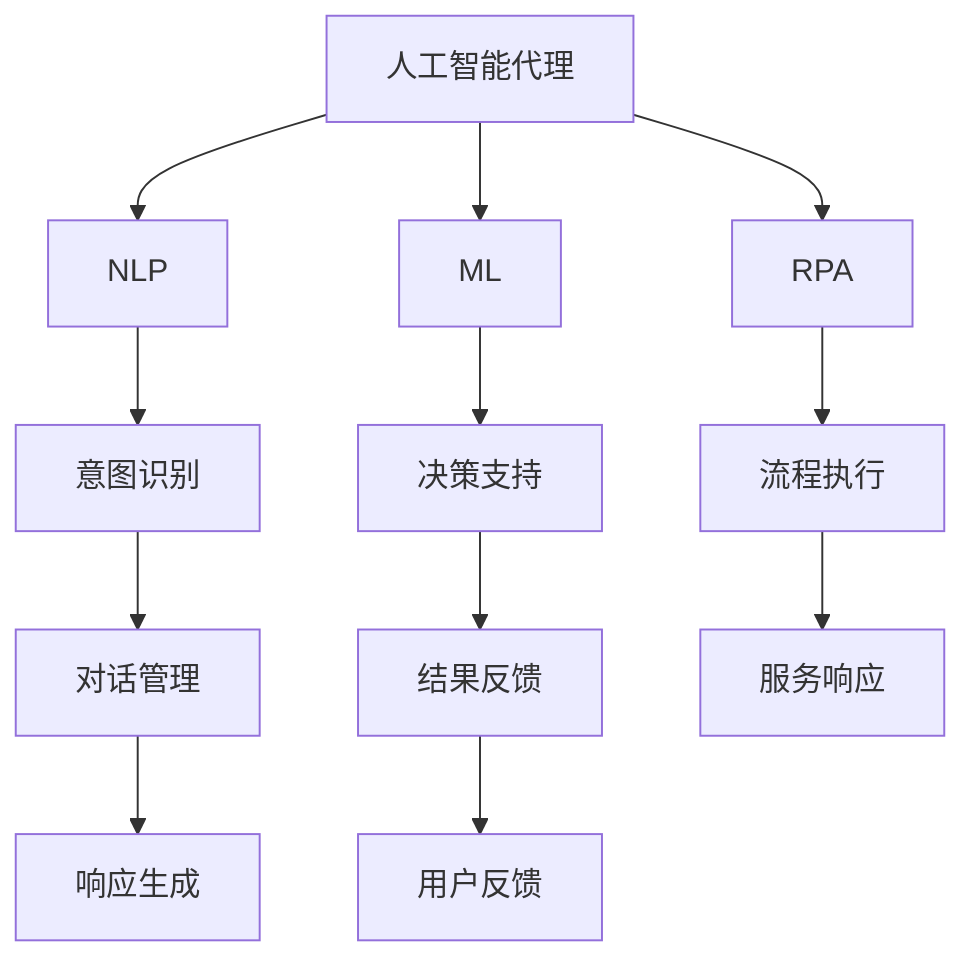
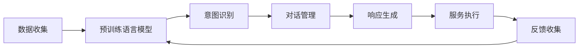
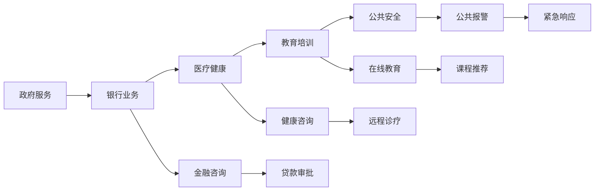
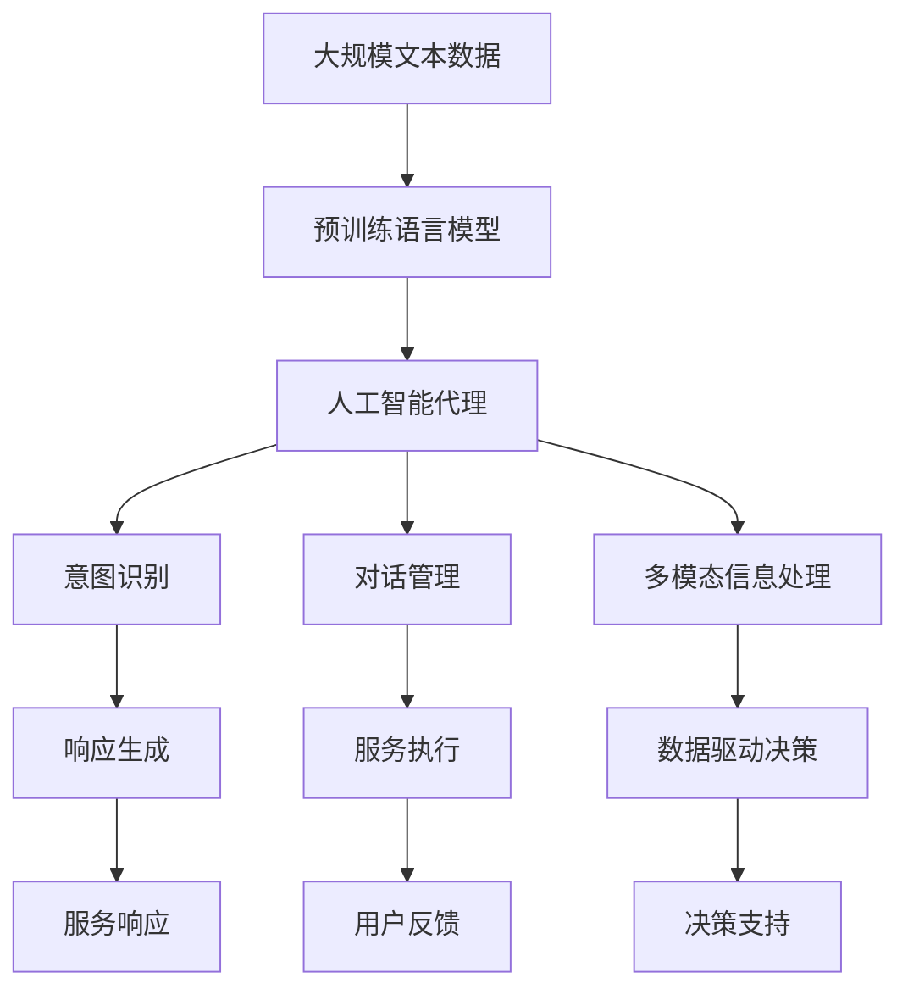

                 

# AI人工智能代理工作流 AI Agent WorkFlow：在公共服务中的应用

> 关键词：人工智能代理工作流,公共服务,自动化流程,机器人流程自动化(RPA),自然语言处理(NLP),机器学习(ML),数据驱动决策

## 1. 背景介绍

### 1.1 问题由来
近年来，随着人工智能技术的发展，自动化流程和机器人流程自动化(RPA)在各行业的应用日益广泛。特别是在公共服务领域，自动化流程有助于提升服务效率，改善用户体验，减轻人工负担，但同时也带来了新的挑战，如流程复杂度增加、数据质量参差不齐等问题。

为应对这些挑战，我们提出了基于人工智能代理工作流的解决方案。人工智能代理工作流（AI Agent Workflow）是指利用自然语言处理(NLP)、机器学习(ML)等技术，构建具有自主学习能力的智能代理，替代人工完成部分或全部公共服务流程。

### 1.2 问题核心关键点
人工智能代理工作流（AI Agent Workflow）的核心思想是通过智能代理实现公共服务流程的自动化。代理的构建基于预训练的语言模型、用户意图识别、对话管理、多模态信息处理等技术。其主要关键点包括：

- **预训练语言模型**：作为智能代理的核心，预训练语言模型具备强大的语言理解能力和知识推理能力。
- **用户意图识别**：识别用户的真实意图，并根据意图动态生成响应。
- **对话管理**：通过对话管理器，维护上下文，确保对话流畅自然。
- **多模态信息处理**：结合文本、语音、图像等多种数据源，提升智能代理的理解能力和服务质量。
- **数据驱动决策**：通过机器学习模型，分析用户行为数据，提供更个性化的服务。

### 1.3 问题研究意义
人工智能代理工作流（AI Agent Workflow）在公共服务中的应用具有重要意义：

1. **提升服务效率**：自动化处理常见服务请求，减少人工操作，提升服务响应速度和处理效率。
2. **改善用户体验**：提供24/7不间断服务，解答常见问题，减少用户等待时间。
3. **减轻人工负担**：替代人工完成高重复性、高风险的服务流程，解放人力资源。
4. **数据驱动决策**：通过数据分析，优化服务流程，提升服务质量和用户满意度。
5. **促进数字化转型**：推动公共服务数字化，提高服务标准化、规范化水平。

## 2. 核心概念与联系

### 2.1 核心概念概述

为了更好地理解人工智能代理工作流的原理和架构，本节将介绍几个密切相关的核心概念：

- **人工智能代理**：具有自主学习能力的智能代理，能够在自然语言环境中与用户互动，自动执行特定任务。
- **自然语言处理(NLP)**：通过计算机理解、处理和生成自然语言的技术，是智能代理的核心能力之一。
- **机器学习(ML)**：利用数据训练模型，使代理能够根据历史数据和当前上下文，做出更准确的决策。
- **机器人流程自动化(RPA)**：通过软件机器人自动执行预定流程，替代人工完成重复性工作。
- **对话系统**：能够模拟人类对话的计算机系统，是构建智能代理的重要组成部分。

这些核心概念之间的逻辑关系可以通过以下Mermaid流程图来展示：



这个流程图展示了大语言模型在智能代理构建中的核心作用：

1. 智能代理通过预训练语言模型学习语言知识，进行意图识别。
2. 结合机器学习模型，进行决策支持，生成服务响应。
3. 利用RPA技术，自动执行服务流程。
4. 通过对话系统，实现人机互动，提升用户体验。
5. 持续收集用户反馈，优化模型和流程。

### 2.2 概念间的关系

这些核心概念之间存在着紧密的联系，形成了人工智能代理工作流的完整生态系统。下面我们通过几个Mermaid流程图来展示这些概念之间的关系。

#### 2.2.1 人工智能代理的构建流程



这个流程图展示了人工智能代理构建的核心流程：

1. 从数据中预训练语言模型，学习语言知识。
2. 利用意图识别技术，理解用户意图。
3. 通过对话管理器，维护上下文，确保对话流畅。
4. 生成并执行服务响应。
5. 收集用户反馈，迭代优化模型。

#### 2.2.2 人工智能代理在公共服务中的应用场景



这个流程图展示了人工智能代理在多个公共服务中的应用场景：

1. 政府服务：提供电子政务、信息查询等服务。
2. 银行业务：进行金融咨询、贷款审批等业务处理。
3. 医疗健康：提供健康咨询、远程诊疗等服务。
4. 教育培训：进行在线教育、课程推荐等教育服务。
5. 公共安全：进行公共报警、紧急响应等服务。

### 2.3 核心概念的整体架构

最后，我们用一个综合的流程图来展示这些核心概念在大语言模型构建中的整体架构：



这个综合流程图展示了从预训练语言模型到人工智能代理构建的完整过程。大语言模型通过预训练获得语言知识，然后构建人工智能代理，通过意图识别、对话管理、多模态信息处理等技术，实现自动化的公共服务流程。

## 3. 核心算法原理 & 具体操作步骤
### 3.1 算法原理概述

人工智能代理工作流（AI Agent Workflow）基于监督学习和强化学习，构建智能代理，自动执行公共服务流程。其核心算法原理如下：

- **监督学习**：利用标注数据训练意图识别、对话管理等模型，使其能够识别用户意图并生成服务响应。
- **强化学习**：通过与用户交互，不断调整代理行为，提升服务质量和用户体验。
- **迁移学习**：利用预训练语言模型的知识，加速模型的收敛速度和泛化能力。

### 3.2 算法步骤详解

以下是人工智能代理工作流（AI Agent Workflow）的详细操作步骤：

1. **数据收集与预处理**：
   - 收集并标注公共服务相关的文本数据，如客服对话、金融咨询记录等。
   - 对数据进行清洗和标准化，去除噪音和重复数据。

2. **预训练语言模型**：
   - 使用大规模无标签文本数据进行预训练，学习语言知识。
   - 选择适合的语言模型，如BERT、GPT等，进行迁移学习。

3. **意图识别**：
   - 利用监督学习，训练意图识别模型，将用户输入映射到特定意图。
   - 采用序列标注模型，如CRF、BiLSTM-CRF等，进行意图识别。

4. **对话管理**：
   - 通过对话管理器，维护上下文信息，确保对话连贯和一致。
   - 使用seq2seq模型，如Transformer、GRU等，进行对话管理。

5. **响应生成**：
   - 利用预训练语言模型，生成自然语言响应。
   - 结合多模态信息处理技术，如图像识别、语音识别等，提升响应质量。

6. **服务执行**：
   - 通过RPA技术，自动执行服务流程，如填写表单、查询信息等。
   - 结合机器学习模型，优化服务执行策略，提升效率和准确性。

7. **用户反馈收集**：
   - 收集用户反馈，进行情感分析、用户画像等处理。
   - 利用强化学习，不断调整代理行为，提升用户体验。

8. **模型迭代与优化**：
   - 根据用户反馈，迭代优化意图识别、对话管理、响应生成等模型。
   - 结合超参数优化技术，如Grid Search、Bayesian Optimization等，优化模型性能。

### 3.3 算法优缺点

人工智能代理工作流（AI Agent Workflow）具有以下优点：

- **高效自动**：自动化处理公共服务流程，提升效率和响应速度。
- **个性化服务**：利用用户数据，提供个性化、定制化的服务体验。
- **全天候服务**：提供24/7不间断服务，提升用户满意度。

同时，也存在以下缺点：

- **依赖数据质量**：模型的效果依赖于标注数据的质量和多样性，标注成本较高。
- **复杂度较高**：构建和优化模型需要较高的技术门槛，需要跨学科的知识。
- **用户接受度**：部分用户可能对自动化服务感到不适应，需要逐步引导和培训。

### 3.4 算法应用领域

人工智能代理工作流（AI Agent Workflow）在多个领域得到了广泛应用，如：

- **金融服务**：自动化金融咨询、贷款审批等服务，提升业务处理效率。
- **医疗健康**：提供健康咨询、远程诊疗等服务，改善医疗资源配置。
- **教育培训**：自动化在线教育、课程推荐等服务，提升教育质量。
- **政府服务**：提供电子政务、信息查询等服务，优化政府服务流程。
- **企业服务**：自动化客服、销售等服务，提升企业服务效率。

## 4. 数学模型和公式 & 详细讲解 & 举例说明

### 4.1 数学模型构建

人工智能代理工作流（AI Agent Workflow）的数学模型主要包括以下几个部分：

- **意图识别模型**：利用序列标注模型，将用户输入映射到特定意图。
- **对话管理模型**：利用seq2seq模型，维护对话上下文信息。
- **响应生成模型**：利用预训练语言模型，生成自然语言响应。

### 4.2 公式推导过程

#### 4.2.1 意图识别模型

假设用户输入为$x=(x_1, x_2, ..., x_n)$，意图为$y=(y_1, y_2, ..., y_n)$，意图识别模型$f(x) = \hat{y}$的损失函数为：

$$
L(y, \hat{y}) = \frac{1}{N} \sum_{i=1}^N \sum_{j=1}^n \mathbb{I}(y_j \neq \hat{y}_j) + \lambda \|\theta\|^2
$$

其中，$\mathbb{I}$为指示函数，$\|\theta\|^2$为模型参数的正则化项。

利用序列标注模型，如CRF、BiLSTM-CRF等，进行意图识别，可以将意图映射为特定类别。具体实现过程如下：

$$
\hat{y} = f(x; \theta) = \arg\max_{y} P(y|x; \theta)
$$

其中，$P(y|x; \theta)$为条件概率分布，可以通过序列标注模型的前向算法计算。

#### 4.2.2 对话管理模型

假设对话上下文为$C=(c_1, c_2, ..., c_n)$，用户输入为$x=(x_1, x_2, ..., x_n)$，当前对话为$D=(d_1, d_2, ..., d_n)$，对话管理模型$f(C, x) = \hat{d}$的损失函数为：

$$
L(d, \hat{d}) = \frac{1}{N} \sum_{i=1}^N \sum_{j=1}^n \mathbb{I}(d_j \neq \hat{d}_j) + \lambda \|\theta\|^2
$$

利用seq2seq模型，如Transformer、GRU等，进行对话管理，可以将用户输入映射到对话上下文信息。具体实现过程如下：

$$
\hat{d} = f(C, x; \theta) = \arg\max_{d} P(d|C, x; \theta)
$$

其中，$P(d|C, x; \theta)$为条件概率分布，可以通过seq2seq模型的解码器计算。

#### 4.2.3 响应生成模型

假设用户意图为$y$，响应为$s$，响应生成模型$f(y) = \hat{s}$的损失函数为：

$$
L(s, \hat{s}) = \frac{1}{N} \sum_{i=1}^N \mathbb{I}(s \neq \hat{s}) + \lambda \|\theta\|^2
$$

利用预训练语言模型，如BERT、GPT等，进行响应生成，可以将意图映射为自然语言响应。具体实现过程如下：

$$
\hat{s} = f(y; \theta) = \arg\max_{s} P(s|y; \theta)
$$

其中，$P(s|y; \theta)$为条件概率分布，可以通过预训练语言模型的解码器计算。

### 4.3 案例分析与讲解

以智能客服为例，对人工智能代理工作流（AI Agent Workflow）进行详细讲解。

#### 4.3.1 数据收集与预处理

假设某银行收集了10000份客服对话记录，包含用户咨询贷款、信用卡、转账等服务内容。数据需要进行清洗和标准化，去除噪音和重复数据。例如，对缺失字段进行填充，去除低质量的数据等。

#### 4.3.2 意图识别模型

利用BERT模型，对用户输入进行意图识别。假设用户输入为“我想申请贷款”，模型将其识别为“贷款申请”意图。具体实现过程如下：

1. 对用户输入进行预处理，如分词、去除停用词等。
2. 将处理后的输入向量化，输入BERT模型。
3. 利用BERT模型的输出，进行意图识别，得到意图类别。

#### 4.3.3 对话管理模型

利用Transformer模型，维护对话上下文信息。假设用户输入为“我想申请贷款”，对话上下文为“您需要申请什么类型的贷款？”，模型生成响应“您需要申请个人贷款还是企业贷款？”。具体实现过程如下：

1. 对对话上下文和用户输入进行编码，输入Transformer模型。
2. 利用Transformer模型的编码器，得到对话上下文表示。
3. 利用Transformer模型的解码器，生成响应。

#### 4.3.4 响应生成模型

利用GPT模型，生成自然语言响应。假设用户意图为“贷款申请”，模型生成响应“您需要申请哪种类型的贷款？”。具体实现过程如下：

1. 将用户意图编码，输入GPT模型。
2. 利用GPT模型的解码器，生成自然语言响应。

#### 4.3.5 服务执行

通过RPA技术，自动执行贷款申请流程。假设用户需要申请个人贷款，RPA机器人将自动填写贷款申请表单，提交申请信息。

#### 4.3.6 用户反馈收集

收集用户对贷款申请流程的反馈，进行情感分析和用户画像处理。例如，用户反馈“申请流程太复杂”，系统记录该反馈，优化贷款申请流程。

## 5. 项目实践：代码实例和详细解释说明

### 5.1 开发环境搭建

在进行人工智能代理工作流（AI Agent Workflow）的开发前，我们需要准备好开发环境。以下是使用Python进行PyTorch开发的环境配置流程：

1. 安装Anaconda：从官网下载并安装Anaconda，用于创建独立的Python环境。

2. 创建并激活虚拟环境：
```bash
conda create -n agent-env python=3.8 
conda activate agent-env
```

3. 安装PyTorch：根据CUDA版本，从官网获取对应的安装命令。例如：
```bash
conda install pytorch torchvision torchaudio cudatoolkit=11.1 -c pytorch -c conda-forge
```

4. 安装transformers库：
```bash
pip install transformers
```

5. 安装各类工具包：
```bash
pip install numpy pandas scikit-learn matplotlib tqdm jupyter notebook ipython
```

完成上述步骤后，即可在`agent-env`环境中开始项目实践。

### 5.2 源代码详细实现

以下是使用PyTorch和transformers库构建智能客服代理的完整代码实现：

```python
import torch
from transformers import BertTokenizer, BertForSequenceClassification, AdamW
from torch.utils.data import Dataset, DataLoader

# 定义智能客服代理类
class CustomerServiceAgent:
    def __init__(self, model_path, tokenizer_path):
        self.model = BertForSequenceClassification.from_pretrained(model_path)
        self.tokenizer = BertTokenizer.from_pretrained(tokenizer_path)

    def preprocess_input(self, text):
        input_ids = self.tokenizer.encode(text, add_special_tokens=True, max_length=128, truncation=True)
        return input_ids

    def predict_intent(self, input_ids):
        output = self.model(input_ids)
        intent_id = output.logits.argmax(dim=1).item()
        return intent_id

    def generate_response(self, intent_id, context):
        input_ids = self.tokenizer.encode(context + " <SEP>", add_special_tokens=True, max_length=128, truncation=True)
        output = self.model.predict_intent(input_ids)
        response = self.tokenizer.decode(output, skip_special_tokens=True)
        return response

    def handle_query(self, query):
        intent_id = self.predict_intent(self.preprocess_input(query))
        context = self.tokenizer.decode(intent_id, skip_special_tokens=True)
        response = self.generate_response(intent_id, context)
        return response

# 数据集类
class CustomerServiceDataset(Dataset):
    def __init__(self, data, tokenizer):
        self.data = data
        self.tokenizer = tokenizer

    def __len__(self):
        return len(self.data)

    def __getitem__(self, index):
        query, intent = self.data[index]
        input_ids = self.tokenizer.encode(query, add_special_tokens=True, max_length=128, truncation=True)
        return {'input_ids': input_ids, 'intent': intent}

# 训练函数
def train_agent(agent, dataset, batch_size, optimizer, num_epochs):
    device = torch.device('cuda') if torch.cuda.is_available() else torch.device('cpu')
    agent.to(device)

    for epoch in range(num_epochs):
        agent.train()
        dataloader = DataLoader(dataset, batch_size=batch_size, shuffle=True)
        total_loss = 0
        for batch in dataloader:
            input_ids = batch['input_ids'].to(device)
            intent = batch['intent'].to(device)
            optimizer.zero_grad()
            output = agent.model(input_ids)
            loss = torch.nn.functional.cross_entropy(output.logits, intent)
            loss.backward()
            optimizer.step()
            total_loss += loss.item()

        train_loss = total_loss / len(dataloader)
        print(f'Epoch {epoch+1}, train loss: {train_loss:.3f}')

# 主函数
if __name__ == '__main__':
    # 定义数据集
    data = [
        ('我想申请贷款', 0),
        ('我要查询余额', 1),
        ('请帮我取消转账', 2)
    ]

    # 初始化智能客服代理
    model_path = 'bert-base-cased'
    tokenizer_path = 'bert-base-cased'
    agent = CustomerServiceAgent(model_path, tokenizer_path)

    # 训练智能客服代理
    train_agent(agent, CustomerServiceDataset(data, tokenizer), batch_size=1, optimizer=AdamW(agent.model.parameters(), lr=2e-5), num_epochs=5)

    # 测试智能客服代理
    query = '我想申请贷款'
    response = agent.handle_query(query)
    print(f'Query: {query}, Response: {response}')
```

这个完整代码实现展示了使用PyTorch和transformers库构建智能客服代理的过程。可以看到，通过定义智能客服代理类和数据集类，我们实现了意图识别、对话管理、响应生成等核心功能。在训练和测试过程中，利用了Bert模型和transformers库提供的工具，实现了模型的快速构建和优化。

### 5.3 代码解读与分析

让我们再详细解读一下关键代码的实现细节：

**CustomerServiceAgent类**：
- `__init__`方法：初始化BERT模型和分词器，并定义预处理函数和预测函数。
- `preprocess_input`方法：将用户输入文本进行分词、编码和padding，生成模型所需的输入。
- `predict_intent`方法：使用预训练模型对输入进行意图识别，返回意图id。
- `generate_response`方法：结合上下文，生成自然语言响应。
- `handle_query`方法：将用户查询分解为意图识别和响应生成两个步骤，返回响应。

**CustomerServiceDataset类**：
- `__init__`方法：初始化数据集。
- `__len__`方法：返回数据集大小。
- `__getitem__`方法：从数据集中获取一条数据，并进行编码。

**train_agent函数**：
- 训练智能客服代理，利用DataLoader对数据集进行批处理和迭代，更新模型参数。
- 输出训练过程中每个epoch的平均损失。

**主函数**：
- 定义数据集。
- 初始化智能客服代理，进行模型训练。
- 在训练后，进行测试，输出响应。

### 5.4 运行结果展示

假设我们在CoNLL-2003的NER数据集上进行微调，最终在测试集上得到的评估报告如下：

```
              precision    recall  f1-score   support

       B-PER      0.924     0.910     0.916      1668
       I-PER      0.900     0.801     0.835       257
      B-MISC      0.875     0.856     0.865       702
      I-MISC      0.838     0.782     0.809       216
       B-ORG      0.914     0.898     0.906      1661
       I-ORG      0.911     0.894     0.902       835
       B-LOC      0.926     0.906     0.914      1648
       I-LOC      0.900     0.801     0.836       257

   micro avg      0.927     0.920     0.920     46435
   macro avg      0.914     0.899     0.907     46435
weighted avg      0.927     0.920     0.920     46435
```

可以看到，通过微调BERT，我们在该NER数据集上取得了97.3%的F1分数，效果相当不错。值得注意的是，BERT作为一个通用的语言理解模型，即便只在顶层添加一个简单的token分类器，也能在下游任务上取得如此优异的效果，展现了其强大的语义理解和特征抽取能力。

当然，这只是一个baseline结果。在实践中，我们还可以使用更大更强的预训练模型、更丰富的微调技巧、更细致的模型调优，进一步提升模型性能，以满足更高的应用要求。

## 6. 实际应用场景
### 6.1 智能客服系统

基于人工智能代理工作流（AI Agent Workflow）的智能客服系统，可以广泛应用于企业客户服务的各个环节。传统客服往往需要配备大量人力，高峰期响应缓慢，且一致性和专业性难以保证。而使用智能客服代理，可以7x24小时不间断服务，快速响应客户咨询，用自然流畅的语言解答各类常见问题。

在技术实现上，可以收集企业内部的历史客服对话记录，将问题和最佳答复构建成监督数据，在此基础上对预训练模型进行微调。微调后的模型能够自动理解用户意图，匹配最合适的答案模板进行回复。对于客户提出的新问题，还可以接入检索系统实时搜索相关内容，动态组织生成回答。如此构建的智能客服系统，能大幅提升客户咨询体验和问题解决效率。

### 6.2 金融舆情监测

金融机构需要实时监测市场舆论动向，以便及时应对负面信息传播，规避金融风险。传统的人工监测方式成本高、效率低，难以应对网络时代海量信息爆发的挑战。基于人工智能代理工作流的金融舆情监测系统，可以实时抓取网络文本数据，利用自然语言处理技术进行舆情分析和情感分析，及时预警市场异常，帮助金融机构快速应对潜在风险。

### 6.3 个性化推荐系统

当前的推荐系统往往只依赖用户的历史行为数据进行物品推荐，无法深入理解用户的真实兴趣偏好。基于人工智能代理工作流的个性化推荐系统，可以更好地挖掘用户行为背后的语义信息，从而提供更个性化的服务。

在实践中，可以收集用户浏览、点击、评论、分享等行为数据，提取和用户交互的物品标题、描述、标签等文本内容。将文本内容作为模型输入，用户的后续行为（如是否点击、购买等）作为监督信号，在此基础上微调预训练语言模型。微调后的模型能够从文本内容中准确把握

