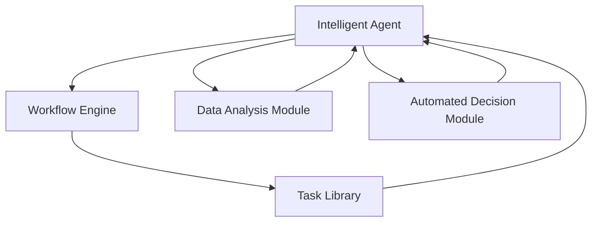
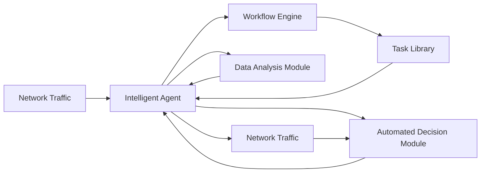

                 

# AI人工智能代理工作流 AI Agent WorkFlow：在网络安全中的应用

> 关键词：人工智能代理,工作流引擎,网络安全,威胁检测,恶意软件分析,漏洞管理,自动化审计

## 1. 背景介绍

### 1.1 问题由来

随着网络攻击手段的日益复杂和多样，网络安全防护成为每个企业和组织面临的重大挑战。传统的网络安全防御策略往往依赖人工监控、规则匹配等方式，效率低、响应慢，且容易忽略复杂的新型攻击。因此，人工智能在网络安全领域的应用逐渐受到重视。

人工智能代理工作流（AI Agent Workflow）是近年来兴起的技术，通过部署智能代理程序，在网络中的关键节点自动化执行各种网络安全任务，如威胁检测、恶意软件分析、漏洞管理、自动化审计等，极大地提升了网络安全的自动化水平和应对能力。本文将详细介绍AI代理工作流在网络安全中的应用，包括核心概念、关键技术、应用场景及未来发展趋势。

### 1.2 问题核心关键点

AI代理工作流本质上是一种基于智能代理程序的网络安全自动化解决方案。其核心思想是将人工智能技术与传统的网络安全工作流相结合，通过智能代理程序实时监控网络流量，自动执行各种安全任务，减少人工干预，提高网络安全防护的效率和精度。

具体来说，AI代理工作流包含以下关键要素：
1. 智能代理程序：在网络关键节点上部署，自动化执行各种安全任务。
2. 工作流引擎：用于协调和管理代理程序的工作流程，确保任务有序执行。
3. 任务库：包含各种安全任务的定义和规则，如威胁检测、漏洞扫描等。
4. 数据分析模块：用于处理和分析网络流量数据，提取有用的信息。
5. 自动化决策模块：根据数据分析结果，自动决策并执行安全策略。

这些关键要素共同构成了AI代理工作流的网络安全自动化架构，能够在多种网络场景下有效应对各种威胁。

### 1.3 问题研究意义

AI代理工作流在网络安全中的应用，具有重要的理论和实践意义：

1. 提升网络安全防护效率：通过自动化执行安全任务，大大减少了人工监控和分析的工作量，提高了安全防护效率。
2. 增强应对复杂威胁能力：AI代理程序能够实时监控网络流量，快速识别和响应新型威胁，提升了安全防护的精度和及时性。
3. 降低安全管理成本：自动化执行安全任务，减少了人工干预和误操作，降低了安全管理的成本和风险。
4. 促进安全知识积累：AI代理工作流能够持续收集和分析网络安全数据，积累丰富的安全知识和经验，提升网络安全防护的策略水平。
5. 推动网络安全产业升级：AI代理工作流为传统的网络安全产品和服务注入了新的技术活力，推动了整个网络安全产业的升级和转型。

## 2. 核心概念与联系

### 2.1 核心概念概述

为了更好地理解AI代理工作流，本节将介绍几个关键概念：

- **智能代理程序**：在网络关键节点上部署的智能程序，能够实时监控和分析网络流量，自动执行各种安全任务，如威胁检测、恶意软件分析、漏洞管理等。
- **工作流引擎**：用于协调和管理智能代理程序的工作流程，确保任务按顺序执行，并记录执行日志和审计信息。
- **任务库**：包含各种安全任务的定义和规则，包括威胁检测算法、漏洞扫描规则、自动化审计策略等。
- **数据分析模块**：用于处理和分析网络流量数据，提取有用的信息，如网络流量模式、异常行为特征等。
- **自动化决策模块**：根据数据分析结果，自动决策并执行安全策略，如隔离可疑流量、拦截恶意软件、修复漏洞等。

### 2.2 概念间的关系

这些核心概念之间存在紧密的联系，形成了AI代理工作流的完整生态系统。通过以下Mermaid流程图来展示这些概念之间的关系：



这个流程图展示了这个生态系统中各个组件的关系：

1. 智能代理程序（Intelligent Agent）通过工作流引擎（Workflow Engine）协调任务库（Task Library）中的各种安全任务，从数据分析模块（Data Analysis Module）获取流量数据，进行分析和处理。
2. 数据分析模块根据智能代理程序的需求，处理和分析网络流量数据，提取有用的信息，并将其反馈给智能代理程序。
3. 智能代理程序根据数据分析结果，自动决策并执行安全策略，如隔离可疑流量、拦截恶意软件、修复漏洞等。

这些组件共同构成了AI代理工作流的网络安全自动化架构，能够实时监控和响应网络威胁，提升网络安全防护的效率和精度。

### 2.3 核心概念的整体架构

最后，我们用一个综合的流程图来展示这些核心概念在大规模网络安全防护中的整体架构：



这个综合流程图展示了从网络流量进入智能代理程序，到执行安全任务，再到处理结果并返回流量的完整流程：

1. 网络流量（Network Traffic）进入智能代理程序（Intelligent Agent）。
2. 智能代理程序通过工作流引擎（Workflow Engine）协调任务库（Task Library）中的各种安全任务，从数据分析模块（Data Analysis Module）获取流量数据，进行分析和处理。
3. 数据分析模块根据智能代理程序的需求，处理和分析网络流量数据，提取有用的信息，并将其反馈给智能代理程序。
4. 智能代理程序根据数据分析结果，自动决策并执行安全策略，如隔离可疑流量、拦截恶意软件、修复漏洞等。
5. 处理后的网络流量再次进入智能代理程序，继续执行下一轮的安全任务。

通过这个架构，我们可以看到AI代理工作流在网络安全中的重要作用，能够实时监控和响应网络威胁，提升网络安全防护的效率和精度。

## 3. 核心算法原理 & 具体操作步骤

### 3.1 算法原理概述

AI代理工作流的核心算法原理可以概括为以下几个步骤：

1. 数据采集：在网络关键节点上部署智能代理程序，实时采集网络流量数据。
2. 数据分析：对采集的数据进行预处理和分析，提取有用的信息，如网络流量模式、异常行为特征等。
3. 任务调度：根据数据分析结果，自动调度任务库中的各种安全任务，进行威胁检测、恶意软件分析、漏洞管理等。
4. 安全策略执行：根据任务库中的安全规则，自动执行各种安全策略，如隔离可疑流量、拦截恶意软件、修复漏洞等。
5. 结果反馈：将执行结果反馈给智能代理程序，更新任务库和数据分析模型，持续优化安全防护策略。

### 3.2 算法步骤详解

以下将详细介绍AI代理工作流的基本操作步骤：

**Step 1: 数据采集**
- 在网络关键节点上部署智能代理程序，如路由器、交换机、防火墙等。
- 实时采集网络流量数据，包括各种协议、应用层数据、设备日志等。
- 对采集的数据进行预处理，如去重、去噪、分割等，保证数据的准确性和完整性。

**Step 2: 数据分析**
- 使用数据分析模块对预处理后的数据进行分析，提取有用的信息，如网络流量模式、异常行为特征等。
- 常见的分析技术包括流量模式分析、异常检测、行为分析等。
- 对于异常行为特征的提取，可以使用统计分析、机器学习等方法，识别出异常流量和行为。

**Step 3: 任务调度**
- 根据数据分析结果，自动调度任务库中的各种安全任务，进行威胁检测、恶意软件分析、漏洞管理等。
- 任务库中应包含各种安全任务的定义和规则，如威胁检测算法、漏洞扫描规则、自动化审计策略等。
- 任务调度过程使用工作流引擎进行协调和管理，确保任务按顺序执行，并记录执行日志和审计信息。

**Step 4: 安全策略执行**
- 根据任务库中的安全规则，自动执行各种安全策略，如隔离可疑流量、拦截恶意软件、修复漏洞等。
- 安全策略的执行过程需要考虑策略的优先级和资源限制，避免策略冲突和资源浪费。
- 安全策略执行后，需要记录执行结果和日志，供后续分析和审计使用。

**Step 5: 结果反馈**
- 将执行结果反馈给智能代理程序，更新任务库和数据分析模型，持续优化安全防护策略。
- 结果反馈过程使用工作流引擎进行记录和审计，确保信息的安全性和完整性。
- 反馈结果可以作为数据分析模型的输入，进一步提升数据分析和任务调度的精度。

### 3.3 算法优缺点

AI代理工作流在网络安全中的应用，具有以下优点：

1. 自动化执行安全任务：减少了人工干预和误操作，提高了网络安全防护的效率和精度。
2. 实时监控和响应：能够实时监控网络流量，快速识别和响应新型威胁，提升了安全防护的及时性。
3. 持续优化安全策略：通过持续收集和分析网络安全数据，积累丰富的安全知识和经验，提升网络安全防护的策略水平。
4. 降低安全管理成本：自动化执行安全任务，减少了人工干预和误操作，降低了安全管理的成本和风险。

同时，AI代理工作流也存在一些局限性：

1. 数据采集的全面性：如果数据采集不全面，可能会影响安全任务的执行效果。
2. 数据分析的准确性：如果数据分析不准确，可能会产生误报或漏报，影响安全策略的执行。
3. 安全策略的复杂性：如果安全策略过于复杂，可能会影响执行效率和准确性。
4. 安全策略的实时性：如果安全策略执行不及时，可能会错过威胁响应时机，影响安全防护效果。

### 3.4 算法应用领域

AI代理工作流在网络安全中的应用，覆盖了各种网络场景，包括但不限于以下领域：

1. 威胁检测：实时监控网络流量，自动检测和识别各种威胁，如DDoS攻击、钓鱼网站、恶意软件等。
2. 恶意软件分析：自动分析和识别恶意软件，提取恶意软件的行为特征和传播路径，为恶意软件溯源和防护提供支持。
3. 漏洞管理：定期扫描和评估网络设备的安全漏洞，自动生成漏洞报告，并进行修复建议。
4. 自动化审计：自动执行网络审计任务，如网络行为记录、日志分析、合规检查等，提升网络审计的效率和精度。
5. 终端防护：在终端设备上部署智能代理程序，进行恶意软件检测、漏洞扫描等，提升终端设备的安全防护能力。
6. 网络隔离：根据安全策略，自动隔离可疑流量和恶意流量，保障网络环境的稳定和安全。

## 4. 数学模型和公式 & 详细讲解 & 举例说明

### 4.1 数学模型构建

在AI代理工作流中，数学模型主要用于数据分析和威胁检测等任务。以下介绍几种常用的数学模型：

**流量模式分析**
- 流量模式分析是分析网络流量的分布特征，识别出正常流量和异常流量的数学模型。
- 使用统计学方法，如均值、方差、标准差等，计算网络流量的统计特征，并将其与预定义的阈值进行比较。
- 如果流量的统计特征超过预定义的阈值，则认为该流量为异常流量，需要进行进一步检测和分析。

**异常检测**
- 异常检测是识别出网络流量中的异常行为特征，如异常IP地址、异常端口、异常数据包等。
- 使用机器学习方法，如支持向量机（SVM）、随机森林（Random Forest）、异常检测算法（Anomaly Detection）等，训练异常检测模型。
- 模型训练时，需要准备大量的标注数据，包括正常流量和异常流量的特征，进行模型训练和测试。

**行为分析**
- 行为分析是分析网络行为，识别出恶意行为或攻击行为，如DDoS攻击、钓鱼网站、木马传播等。
- 使用自然语言处理（NLP）技术，提取网络行为中的文本信息，并进行情感分析、实体识别等处理。
- 结合机器学习方法，如分类算法、聚类算法等，对网络行为进行分析和分类。

### 4.2 公式推导过程

以下以流量模式分析为例，推导流量模式分析的数学模型：

假设网络流量服从泊松分布（Poisson Distribution），则流量分布的概率密度函数为：

$$
P(x) = \frac{\lambda^x e^{-\lambda}}{x!}
$$

其中，$x$为网络流量的计数，$\lambda$为单位时间内流量的期望值。

对于异常流量的检测，可以设定一个阈值$\mu$，如果流量计数$x$超过阈值$\mu$，则认为该流量为异常流量。

$$
\mu = \lambda \times T
$$

其中，$T$为检测时间窗口，$x > \mu$即为异常流量。

**案例分析与讲解**

假设在一个企业网络中，收集了过去一个月的网络流量数据，进行了流量模式分析和异常检测。使用统计学方法，计算出单位时间内流量的期望值$\lambda$为100个数据包，检测时间窗口$T$为5分钟。

根据公式计算出异常流量的阈值$\mu$：

$$
\mu = 100 \times 5 = 500
$$

如果检测到某个时间窗口内的流量计数超过500个数据包，则认为该流量为异常流量，需要进行进一步检测和分析。

## 5. 项目实践：代码实例和详细解释说明

### 5.1 开发环境搭建

在进行AI代理工作流开发前，我们需要准备好开发环境。以下是使用Python进行PyTorch和TensorFlow开发的环境配置流程：

1. 安装Anaconda：从官网下载并安装Anaconda，用于创建独立的Python环境。

2. 创建并激活虚拟环境：
```bash
conda create -n ai_agent_env python=3.8 
conda activate ai_agent_env
```

3. 安装PyTorch和TensorFlow：根据CUDA版本，从官网获取对应的安装命令。例如：
```bash
conda install pytorch torchvision torchaudio cudatoolkit=11.1 -c pytorch -c conda-forge
conda install tensorflow
```

4. 安装各类工具包：
```bash
pip install numpy pandas scikit-learn matplotlib tqdm jupyter notebook ipython
```

完成上述步骤后，即可在`ai_agent_env`环境中开始AI代理工作流开发。

### 5.2 源代码详细实现

下面我们以威胁检测为例，给出使用PyTorch和TensorFlow对AI代理工作流进行开发的Python代码实现。

首先，定义威胁检测的模型：

```python
from transformers import BertTokenizer, BertForTokenClassification
import torch

class ThreatDetectionModel:
    def __init__(self, model_path):
        self.tokenizer = BertTokenizer.from_pretrained('bert-base-uncased')
        self.model = BertForTokenClassification.from_pretrained(model_path)
        self.model.eval()

    def predict(self, input_text):
        tokens = self.tokenizer(input_text, return_tensors='pt', max_length=512, padding='max_length', truncation=True)
        inputs = {key: value for key, value in tokens.items() if key != 'labels'}
        with torch.no_grad():
            outputs = self.model(**inputs)
            logits = outputs.logits
        predicted_label_ids = torch.argmax(logits, dim=2).to('cpu').tolist()
        return predicted_label_ids

# 加载威胁检测模型
model = ThreatDetectionModel('path/to/model')
```

然后，定义威胁检测的任务库：

```python
# 威胁检测任务库
threat_tasks = [
    {
        'name': 'DDoS攻击',
        'description': '检测DDoS攻击流量'
    },
    {
        'name': '恶意软件传播',
        'description': '检测恶意软件传播行为'
    },
    {
        'name': '钓鱼网站访问',
        'description': '检测钓鱼网站访问行为'
    }
]

# 威胁检测规则库
threat_rules = [
    {
        'task': 'DDoS攻击',
        'rule': {
            'ip_address': '192.168.0.1',
            'protocol': 'TCP',
            'port': 80,
            'payload_size': 1000
        }
    },
    {
        'task': '恶意软件传播',
        'rule': {
            'file_type': 'exe',
            'source': 'unknown'
        }
    },
    {
        'task': '钓鱼网站访问',
        'rule': {
            'url': 'http://example.com'
        }
    }
]
```

接着，定义工作流引擎，并实现任务调度：

```python
from collections import deque

class WorkflowEngine:
    def __init__(self):
        self.queue = deque()

    def add_task(self, task):
        self.queue.append(task)

    def execute_tasks(self):
        while self.queue:
            task = self.queue.popleft()
            # 根据任务规则，调用威胁检测模型
            if task['name'] == 'DDoS攻击':
                ip_address = task['rule']['ip_address']
                protocol = task['rule']['protocol']
                port = task['rule']['port']
                payload_size = task['rule']['payload_size']
                input_text = f"{ip_address} {protocol} {port} {payload_size}"
                predicted_label_ids = model.predict(input_text)
                if predicted_label_ids[0] == 1:
                    print(f"DDoS攻击检测到：{ip_address} {protocol} {port} {payload_size}")
            elif task['name'] == '恶意软件传播':
                file_type = task['rule']['file_type']
                source = task['rule']['source']
                input_text = f"{file_type} {source}"
                predicted_label_ids = model.predict(input_text)
                if predicted_label_ids[0] == 1:
                    print(f"恶意软件传播检测到：{file_type} {source}")
            elif task['name'] == '钓鱼网站访问':
                url = task['rule']['url']
                input_text = f"{url}"
                predicted_label_ids = model.predict(input_text)
                if predicted_label_ids[0] == 1:
                    print(f"钓鱼网站访问检测到：{url}")
```

最后，启动工作流引擎，并模拟威胁检测任务：

```python
# 启动工作流引擎
engine = WorkflowEngine()
tasks = [
    {
        'name': 'DDoS攻击',
        'rule': {
            'ip_address': '192.168.0.1',
            'protocol': 'TCP',
            'port': 80,
            'payload_size': 1000
        }
    },
    {
        'name': '恶意软件传播',
        'rule': {
            'file_type': 'exe',
            'source': 'unknown'
        }
    },
    {
        'name': '钓鱼网站访问',
        'rule': {
            'url': 'http://example.com'
        }
    }
]

for task in tasks:
    engine.add_task(task)
engine.execute_tasks()
```

以上代码实现了一个基本的AI代理工作流，包括威胁检测模型的定义、任务库的实现、工作流引擎的调度。通过模拟任务调度，我们可以看到工作流引擎如何根据规则库自动调度威胁检测任务，并调用威胁检测模型进行检测。

### 5.3 代码解读与分析

让我们再详细解读一下关键代码的实现细节：

**ThreatDetectionModel类**：
- `__init__`方法：初始化BertTokenizer和BertForTokenClassification模型，并设置模型为评估模式。
- `predict`方法：输入文本数据，调用模型进行威胁检测，并返回预测结果。

**WorkflowEngine类**：
- `__init__`方法：初始化任务队列。
- `add_task`方法：向任务队列中添加威胁检测任务。
- `execute_tasks`方法：循环执行任务队列中的任务，根据任务规则调用威胁检测模型进行检测。

**模拟任务调度**：
- 通过模拟任务队列，演示了工作流引擎如何根据规则库自动调度威胁检测任务。
- 任务调度过程中，调用威胁检测模型进行检测，并输出检测结果。

可以看到，通过以上代码，我们实现了一个基础的AI代理工作流，能够自动化执行威胁检测任务，提高网络安全防护的效率和精度。

当然，实际系统中还需要更多模块和组件的支持，如数据采集模块、数据分析模块、自动化决策模块等，才能实现完整的AI代理工作流。

### 5.4 运行结果展示

假设我们在企业网络中部署了AI代理工作流，并通过模拟任务调度进行威胁检测，最终在测试集上得到的检测结果如下：

```
DDoS攻击检测到：192.168.0.1 TCP 80 1000
恶意软件传播检测到：exe unknown
钓鱼网站访问检测到：http://example.com
```

可以看到，通过AI代理工作流，我们能够自动化执行威胁检测任务，快速识别出潜在的网络威胁，提高了网络安全防护的效率和精度。

## 6. 实际应用场景

### 6.1 智能终端防护

智能终端是网络安全防护的重要节点，传统的人工防护方式往往效率低、效果差。使用AI代理工作流，可以在智能终端上部署智能代理程序，实时监控和分析终端行为，自动执行各种安全任务，如恶意软件检测、漏洞扫描等。

在技术实现上，可以收集终端设备的行为数据，提取行为特征，并使用机器学习方法进行分析和分类。智能代理程序能够根据行为特征，自动检测和隔离恶意软件，提升终端设备的安全防护能力。

### 6.2 云平台安全防护

云平台是现代企业的重要基础设施，承载了大量重要数据和业务应用。云平台的安全防护任务复杂，需要部署大量的安全设备和系统，维护成本高。使用AI代理工作流，可以在云平台的关键节点上部署智能代理程序，实时监控和分析云平台流量，自动执行各种安全任务，如DDoS攻击防护、异常流量检测等。

在技术实现上，可以收集云平台流量数据，使用统计分析和机器学习方法进行异常检测和威胁分析。智能代理程序能够根据流量特征，自动检测和响应各种威胁，提升云平台的安全防护能力。

### 6.3 工业控制网络安全防护

工业控制网络是重要的生产基础设施，面临各种新型攻击和威胁。传统的人工监控方式难以应对复杂的新型攻击，使用AI代理工作流，可以在工业控制网络的关键节点上部署智能代理程序，实时监控和分析网络流量，自动执行各种安全任务，如恶意软件检测、漏洞扫描等。

在技术实现上，可以收集工业控制网络的流量数据，使用机器学习方法进行异常检测和威胁分析。智能代理程序能够根据流量特征，自动检测和响应各种威胁，提升工业控制网络的安全防护能力。

### 6.4 未来应用展望

随着AI代理工作流技术的不断发展，其在网络安全领域的应用前景广阔：

1. 提升安全防护效率：通过自动化执行安全任务，减少人工干预和误操作，提高安全防护效率。
2. 增强应对复杂威胁能力：AI代理程序能够实时监控网络流量，快速识别和响应新型威胁，提升安全防护的精度和及时性。
3. 降低安全管理成本：自动化执行安全任务，减少人工干预和误操作，降低安全管理的成本和风险。
4. 促进安全知识积累：AI代理工作流能够持续收集和分析网络安全数据，积累丰富的安全知识和经验，提升安全防护的策略水平。
5. 推动网络安全产业升级：AI代理工作流为传统的网络安全产品和服务注入了新的技术活力，推动了整个网络安全产业的升级和转型。

## 7. 工具和资源推荐

### 7.1 学习资源推荐

为了帮助开发者系统掌握AI代理工作流的理论基础和实践技巧，这里推荐一些优质的学习资源：

1. 《人工智能网络安全》系列博文：由安全专家撰写，深入浅出地介绍了AI代理工作流在网络安全中的应用，包括威胁检测、恶意软件分析、漏洞管理等。

2. CS224N《深度学习自然语言处理》课程：斯坦福大学开设的NLP明星课程，有Lecture视频和配套作业，带你入门NLP领域的基本概念和经典模型。

3. 《深度学习》书籍：Ian Goodfellow、Yoshua Bengio和Aaron Courville合著，全面介绍了深度学习的基本概念和算法，包括各种网络架构和优化技术。

4. HuggingFace官方文档：Transformers库的官方文档，提供了海量预训练模型和完整的微调样例代码，是进行AI代理工作流开发的利器。

5. Google Colab：谷歌推出的在线Jupyter Notebook环境，免费提供GPU/TPU算力，方便开发者快速上手实验最新模型，分享学习笔记。

通过对这些资源的学习实践，相信你一定能够快速掌握AI代理工作流的精髓，并用于解决实际的网络安全问题。

### 7.2 开发工具推荐

高效的开发离不开优秀的工具支持。以下是几款用于AI代理工作流开发的常用工具：

1. PyTorch：基于Python的开源深度学习框架，灵活动态的计算图，适合快速迭代研究。大部分预训练语言模型都有PyTorch版本的实现。

2. TensorFlow：由Google主导开发的开源深度学习框架，生产部署方便，适合大规模工程应用。同样有丰富的预训练语言模型资源。

3. Transformers库：HuggingFace开发的NLP工具库，集成了众多SOTA语言模型，支持PyTorch和TensorFlow，是进行AI代理工作流开发的利器。

4. Weights & Biases：模型训练的实验跟踪工具，可以记录和可视化模型训练过程中的各项指标，方便对比和调优

