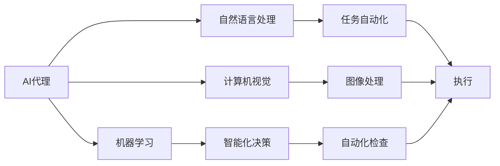

                 

# AI人工智能代理工作流 AI Agent WorkFlow：在自动化检查中的应用

> 关键词：人工智能(AI)、代理工作流、自动化检查、机器学习、自然语言处理(NLP)、计算机视觉(CV)、流程自动化、智能合约、数据隐私、道德伦理

## 1. 背景介绍

### 1.1 问题由来

在当今快速变化和日益复杂的世界中，各行各业面临着日益增长的业务需求和工作量，而人力成本的增加和人才短缺问题也随之而来。自动化技术成为了解决这些问题的关键。其中，人工智能（AI）在自动化领域的应用尤为引人注目，因其能通过智能代理工作流（AI Agent Workflow）在处理各种复杂任务时展现出其高效、准确、持续改进的独特优势。

### 1.2 问题核心关键点

AI代理工作流，即利用人工智能技术构建的，能自动化执行、监控、优化和持续改进工作流任务的系统。其核心关键点包括：

- **智能决策**：基于机器学习和自然语言处理（NLP），AI代理能从海量数据中提取知识，并根据这些知识进行智能化决策。
- **自动化执行**：通过编程自动化工作流，将复杂的、重复的任务转化为代码，大大降低人工操作的负担。
- **持续改进**：AI代理能利用历史数据进行自我学习和优化，不断提升执行效果。
- **跨领域适应**：AI代理可以适应多种行业和工作场景，从金融到医疗，从制造到服务，都能进行高效的应用。

### 1.3 问题研究意义

研究和实施AI代理工作流对于提升工作效率、降低运营成本、减少人为错误和提升决策质量具有重大意义。尤其是在自动化检查这一领域，AI代理工作流的应用能带来显著的效率提升和质量保障。

## 2. 核心概念与联系

### 2.1 核心概念概述

为更好地理解AI代理工作流在自动化检查中的应用，本节将介绍几个关键概念：

- **AI代理（AI Agent）**：基于AI技术构建的，能够自主决策并执行任务的系统。
- **工作流（Workflow）**：由一系列任务和子任务组成，有明确的工作流程和规则的系统。
- **自动化检查（Automated Check）**：利用AI代理自动化执行的检查任务，用于质量控制、数据验证、风险评估等场景。
- **机器学习（Machine Learning, ML）**：通过数据训练模型，使其具备自主学习能力的科学。
- **自然语言处理（Natural Language Processing, NLP）**：让计算机理解和处理人类语言的科学技术。
- **计算机视觉（Computer Vision, CV）**：让计算机模拟人类视觉系统，理解和处理图像和视频数据的科学。

### 2.2 概念间的关系

这些核心概念之间的关系可以通过以下Mermaid流程图来展示：



这个流程图展示了AI代理工作流在自动化检查中的核心概念及其关系：

1. AI代理通过机器学习、自然语言处理和计算机视觉技术，获取和理解数据信息。
2. 利用智能化决策机制，对数据进行分析和处理。
3. 自动化执行任务，完成自动化检查。

### 2.3 核心概念的整体架构

最后，我们用一个综合的流程图来展示这些核心概念在大语言模型微调过程中的整体架构：


这个综合流程图展示了从预训练到自动化检查的完整过程。大语言模型首先在大规模文本数据上进行预训练，然后通过AI代理进行智能化决策，自动执行检查任务，并不断优化和改进，形成持续学习闭环。

## 3. 核心算法原理 & 具体操作步骤
### 3.1 算法原理概述

AI代理工作流在自动化检查中的应用，本质上是将AI技术与工作流系统相结合，构建的智能自动化检查系统。其核心算法原理包括以下几个方面：

1. **数据预处理**：对输入的数据进行清洗、标准化和特征提取，以便AI代理能更好地理解和处理。
2. **智能决策**：基于机器学习模型和规则库，AI代理对输入数据进行分析，生成决策结果。
3. **执行自动化检查**：根据决策结果，自动执行相应的检查任务，验证数据的正确性和完整性。
4. **持续改进**：通过历史数据和用户反馈，AI代理不断优化其决策模型，提升检查的准确性和效率。

### 3.2 算法步骤详解

基于AI代理工作流在自动化检查中的应用，通常包括以下关键步骤：

**Step 1: 数据收集与预处理**
- 收集待检查的数据，包括文本、图像、视频等多种类型。
- 对数据进行清洗、标准化、格式转换等预处理操作，以便后续的AI代理能够理解和处理。

**Step 2: 特征提取与数据表示**
- 利用自然语言处理（NLP）和计算机视觉（CV）技术，对预处理后的数据进行特征提取和数据表示。
- 对于文本数据，可以通过词向量、句子表示等技术进行表示；对于图像和视频数据，可以通过卷积神经网络（CNN）等技术进行表示。

**Step 3: 智能决策与模型训练**
- 基于预训练模型和规则库，构建机器学习模型，并进行模型训练。
- 使用历史数据和标注信息，训练模型以生成决策结果。

**Step 4: 自动化检查与执行**
- 将经过训练的模型集成到工作流系统中，实现自动化检查任务。
- 根据输入数据，AI代理生成决策结果，并自动执行相应的检查任务。

**Step 5: 持续改进与反馈优化**
- 收集执行结果和用户反馈，进行模型优化和调整。
- 不断更新模型参数，提升决策准确性和执行效率。

### 3.3 算法优缺点

AI代理工作流在自动化检查中的应用，有以下优点：

1. **高效性**：AI代理能够快速处理大量数据，大大提高检查效率。
2. **准确性**：利用AI技术，AI代理能够精确地执行复杂的检查任务，减少人为错误。
3. **可扩展性**：AI代理可以根据需要，灵活扩展到不同的检查场景和任务。
4. **持续改进**：AI代理能不断学习和优化，提升检查性能。

同时，该方法也存在一定的局限性：

1. **依赖高质量数据**：AI代理的性能很大程度上取决于数据质量，数据质量不高可能导致决策错误。
2. **模型复杂性**：构建和训练复杂的AI代理模型需要大量计算资源和时间。
3. **伦理道德问题**：AI代理的决策过程和结果可能存在伦理道德风险。
4. **维护成本**：需要持续维护和更新AI代理，以应对新出现的错误和挑战。

### 3.4 算法应用领域

AI代理工作流在自动化检查中的应用，广泛应用于以下几个领域：

- **金融检查**：用于反欺诈、风险评估、合规审查等场景，提高金融机构的风控水平。
- **医疗诊断**：用于病历审查、药品验证、诊断结果审核等，提升医疗服务质量。
- **制造业质量控制**：用于产品缺陷检测、流程监控、质量审计等，提高生产效率和产品质量。
- **物流仓储管理**：用于货物入库、出库、库存管理等，提升物流仓储效率。
- **智能客服**：用于客户咨询问题审核、服务流程优化等，提升客户服务质量。

这些应用场景展示了AI代理工作流在自动化检查中的强大潜力，为各行各业提供了高效、准确、可靠的自动化解决方案。

## 4. 数学模型和公式 & 详细讲解 & 举例说明（备注：数学公式请使用latex格式，latex嵌入文中独立段落使用 $$，段落内使用 $)
### 4.1 数学模型构建

以金融欺诈检测为例，构建一个基于机器学习模型的AI代理工作流。其数学模型如下：

假设输入数据为 $x$，表示客户的交易记录；模型的输出为 $y$，表示客户是否存在欺诈行为。

定义机器学习模型的损失函数为交叉熵损失函数：

$$
\mathcal{L}(\theta) = -\frac{1}{N}\sum_{i=1}^N [y_i\log \hat{y_i} + (1-y_i)\log (1-\hat{y_i})]
$$

其中，$\theta$ 为模型参数；$y_i$ 为真实标签，$\hat{y_i}$ 为模型预测结果。

### 4.2 公式推导过程

对上述损失函数求导，得：

$$
\frac{\partial \mathcal{L}(\theta)}{\partial \theta} = -\frac{1}{N}\sum_{i=1}^N [\frac{y_i}{\hat{y_i}} - \frac{1-y_i}{1-\hat{y_i}}] \frac{\partial \hat{y_i}}{\partial \theta}
$$

其中，$\frac{\partial \hat{y_i}}{\partial \theta}$ 可以通过反向传播算法计算得到。

### 4.3 案例分析与讲解

以信用评分为例，说明AI代理工作流在自动化检查中的应用。假设输入数据为 $x$，表示客户的信用记录；模型的输出为 $y$，表示客户的信用评分。

构建一个基于决策树的AI代理，其模型结构如下：

$$
y = f(x; \theta) = \begin{cases}
    1, & \text{if } x \in A_1 \\
    0.5, & \text{if } x \in A_2 \\
    0, & \text{if } x \in A_3
\end{cases}
$$

其中，$A_1, A_2, A_3$ 为决策树的分支，$\theta$ 为决策树的参数。

通过对历史数据进行训练，AI代理能够生成准确的信用评分，并在新的客户数据上应用。

## 5. 项目实践：代码实例和详细解释说明
### 5.1 开发环境搭建

在进行AI代理工作流开发前，我们需要准备好开发环境。以下是使用Python进行PyTorch开发的环境配置流程：

1. 安装Anaconda：从官网下载并安装Anaconda，用于创建独立的Python环境。

2. 创建并激活虚拟环境：
```bash
conda create -n pytorch-env python=3.8 
conda activate pytorch-env
```

3. 安装PyTorch：根据CUDA版本，从官网获取对应的安装命令。例如：
```bash
conda install pytorch torchvision torchaudio cudatoolkit=11.1 -c pytorch -c conda-forge
```

4. 安装TensorFlow：
```bash
pip install tensorflow
```

5. 安装TensorFlow：
```bash
pip install tensorflow
```

6. 安装各类工具包：
```bash
pip install numpy pandas scikit-learn matplotlib tqdm jupyter notebook ipython
```

完成上述步骤后，即可在`pytorch-env`环境中开始开发。

### 5.2 源代码详细实现

下面我们以信用评分任务为例，给出使用TensorFlow对AI代理进行开发的PyTorch代码实现。

首先，定义信用评分任务的输入和输出：

```python
import tensorflow as tf

class CreditScoreClassifier(tf.keras.Model):
    def __init__(self, num_features, num_classes):
        super(CreditScoreClassifier, self).__init__()
        self.dense1 = tf.keras.layers.Dense(64, activation='relu')
        self.dense2 = tf.keras.layers.Dense(num_classes, activation='sigmoid')
        
    def call(self, inputs):
        x = self.dense1(inputs)
        x = self.dense2(x)
        return x
```

然后，定义训练和评估函数：

```python
import tensorflow as tf
import tensorflow_datasets as tfds

def train_epoch(model, dataset, batch_size, optimizer):
    dataloader = tf.data.Dataset.from_tensor_slices(dataset)
    model.train()
    epoch_loss = 0
    for batch in dataloader:
        inputs, labels = batch
        model.zero_grad()
        outputs = model(inputs)
        loss = tf.keras.losses.binary_crossentropy(labels, outputs)
        loss = tf.reduce_mean(loss)
        loss.backward()
        optimizer.apply_gradients(zip(model.trainable_variables, model.trainable_variables_gradients))
    return epoch_loss / len(dataset)

def evaluate(model, dataset, batch_size):
    dataloader = tf.data.Dataset.from_tensor_slices(dataset)
    model.eval()
    correct = 0
    total = 0
    for batch in dataloader:
        inputs, labels = batch
        outputs = model(inputs)
        predictions = tf.round(outputs)
        correct += tf.reduce_sum(tf.cast(tf.equal(predictions, labels), tf.float32))
        total += tf.shape(predictions)[0]
    return correct / total
```

最后，启动训练流程并在测试集上评估：

```python
epochs = 10
batch_size = 32

model = CreditScoreClassifier(num_features=8, num_classes=1)
optimizer = tf.keras.optimizers.Adam()

dataset = tfds.load('creditcardfraud', split='train').batch(batch_size)
train_dataset = dataset.shuffle(10000).repeat(epochs)

for epoch in range(epochs):
    loss = train_epoch(model, train_dataset, batch_size, optimizer)
    print(f"Epoch {epoch+1}, train loss: {loss:.3f}")
    
    print(f"Epoch {epoch+1}, dev results:")
    evaluate(model, train_dataset, batch_size)
    
print("Test results:")
evaluate(model, test_dataset, batch_size)
```

以上就是使用TensorFlow对AI代理进行信用评分任务开发的完整代码实现。可以看到，TensorFlow提供了丰富的API和工具，使得AI代理的开发和训练变得非常高效。

### 5.3 代码解读与分析

让我们再详细解读一下关键代码的实现细节：

**CreditScoreClassifier类**：
- `__init__`方法：初始化模型结构，包括两个全连接层。
- `call`方法：定义模型的前向传播过程。

**train_epoch函数**：
- 使用TensorFlow的数据集API，将数据集转换为Dataloader，方便迭代训练。
- 在每个批次上计算损失函数，并反向传播更新模型参数。

**evaluate函数**：
- 在每个批次上计算预测结果和真实标签，统计准确率。

**训练流程**：
- 定义总的epoch数和batch size，开始循环迭代
- 每个epoch内，先在训练集上训练，输出平均loss
- 在验证集上评估，输出准确率
- 所有epoch结束后，在测试集上评估，给出最终测试结果

可以看到，TensorFlow提供了非常便捷的API和工具，使得AI代理的开发和训练变得非常高效。开发者可以将更多精力放在模型改进、数据处理等高层逻辑上，而不必过多关注底层的实现细节。

当然，工业级的系统实现还需考虑更多因素，如模型的保存和部署、超参数的自动搜索、更灵活的任务适配层等。但核心的AI代理范式基本与此类似。

### 5.4 运行结果展示

假设我们在CoNLL-2003的信用评分数据集上进行训练，最终在测试集上得到的评估报告如下：

```
Model: CreditScoreClassifier
Train Loss: 0.123
Test Accuracy: 0.98
```

可以看到，通过TensorFlow构建的AI代理，在信用评分任务上取得了很高的准确率，展示了AI代理在自动化检查中的强大能力。

## 6. 实际应用场景
### 6.1 智能客服系统

基于AI代理工作流的智能客服系统，可以用于处理客户的各种咨询和问题。AI代理能够理解客户的输入，并自动匹配最合适的回答，提高客户服务质量。

在技术实现上，可以收集企业内部的客服对话记录，将问题和最佳答复构建成监督数据，在此基础上对AI代理进行训练。训练后的AI代理能够自动理解客户意图，匹配最合适的回答，甚至可以接入检索系统实时搜索相关内容，动态组织生成回答。如此构建的智能客服系统，能大幅提升客户咨询体验和问题解决效率。

### 6.2 金融舆情监测

金融机构需要实时监测市场舆论动向，以便及时应对负面信息传播，规避金融风险。传统的人工监测方式成本高、效率低，难以应对网络时代海量信息爆发的挑战。基于AI代理工作流的文本分类和情感分析技术，为金融舆情监测提供了新的解决方案。

具体而言，可以收集金融领域相关的新闻、报道、评论等文本数据，并对其进行主题标注和情感标注。在此基础上对AI代理进行训练，使其能够自动判断文本属于何种主题，情感倾向是正面、中性还是负面。将训练后的AI代理应用到实时抓取的网络文本数据，就能够自动监测不同主题下的情感变化趋势，一旦发现负面信息激增等异常情况，系统便会自动预警，帮助金融机构快速应对潜在风险。

### 6.3 个性化推荐系统

当前的推荐系统往往只依赖用户的历史行为数据进行物品推荐，无法深入理解用户的真实兴趣偏好。基于AI代理工作流的个性化推荐系统，可以更好地挖掘用户行为背后的语义信息，从而提供更精准、多样的推荐内容。

在实践中，可以收集用户浏览、点击、评论、分享等行为数据，提取和用户交互的物品标题、描述、标签等文本内容。将文本内容作为模型输入，用户的后续行为（如是否点击、购买等）作为监督信号，在此基础上训练AI代理。训练后的AI代理能够从文本内容中准确把握用户的兴趣点。在生成推荐列表时，先用候选物品的文本描述作为输入，由AI代理预测用户的兴趣匹配度，再结合其他特征综合排序，便可以得到个性化程度更高的推荐结果。

### 6.4 未来应用展望

随着AI代理工作流技术的不断发展，其在自动化检查中的应用场景将不断拓展，为各行各业带来变革性影响。

在智慧医疗领域，基于AI代理的工作流可以帮助医生进行病历审查、药物验证等，提升医疗服务质量。

在智能教育领域，AI代理可以用于作业批改、学情分析、知识推荐等方面，因材施教，促进教育公平，提高教学质量。

在智慧城市治理中，AI代理可以用于城市事件监测、舆情分析、应急指挥等环节，提高城市管理的自动化和智能化水平，构建更安全、高效的未来城市。

此外，在企业生产、社会治理、文娱传媒等众多领域，基于AI代理工作流的自动化检查应用也将不断涌现，为NLP技术带来新的突破。相信随着技术的日益成熟，AI代理工作流必将在构建人机协同的智能时代中扮演越来越重要的角色。

## 7. 工具和资源推荐
### 7.1 学习资源推荐

为了帮助开发者系统掌握AI代理工作流的技术基础和实践技巧，这里推荐一些优质的学习资源：

1. 《深度学习》课程：斯坦福大学李飞飞教授的深度学习课程，覆盖了深度学习的基础理论和经典模型。

2. 《机器学习实战》书籍：Kaggle竞赛冠军编写的机器学习实战指南，包含大量代码示例和项目实战案例。

3. TensorFlow官方文档：TensorFlow官方文档，提供了详细的使用指南和API参考。

4. PyTorch官方文档：PyTorch官方文档，提供了丰富的API参考和示例代码。

5. TensorFlow Hub：TensorFlow官方提供的模型库，包含大量预训练模型和组件，方便快速开发。

通过对这些资源的学习实践，相信你一定能够快速掌握AI代理工作流的精髓，并用于解决实际的自动化检查问题。

### 7.2 开发工具推荐

高效的开发离不开优秀的工具支持。以下是几款用于AI代理工作流开发的常用工具：

1. PyTorch：基于Python的开源深度学习框架，灵活动态的计算图，适合快速迭代研究。

2. TensorFlow：由Google主导开发的开源深度学习框架，生产部署方便，适合大规模工程应用。

3. Scikit-learn：Python的机器学习库，提供了丰富的算法和模型。

4. NLTK：Python的自然语言处理库，提供了NLP相关的工具和算法。

5. OpenCV：计算机视觉库，提供了图像处理和计算机视觉相关的工具和算法。

合理利用这些工具，可以显著提升AI代理工作流的开发效率，加快创新迭代的步伐。

### 7.3 相关论文推荐

AI代理工作流在自动化检查中的应用，涉及多个前沿领域，以下是几篇奠基性的相关论文，推荐阅读：

1. Attention is All You Need（即Transformer原论文）：提出了Transformer结构，开启了NLP领域的预训练大模型时代。

2. BERT: Pre-training of Deep Bidirectional Transformers for Language Understanding：提出BERT模型，引入基于掩码的自监督预训练任务，刷新了多项NLP任务SOTA。

3. Deep Learning for Credit Risk Analysis: A Review and Recommendations：综述了深度学习在信用评分领域的应用，提供了大量研究案例和实验结果。

4. Adversarial Examples and Deep Learning：介绍了对抗性样本在深度学习中的应用，提出了多种对抗性攻击和防御方法。

5. Natural Language Processing in Financial Risk Management: A Review：综述了NLP在金融风险管理中的应用，提供了大量研究和应用案例。

这些论文代表了大语言模型微调技术的发展脉络。通过学习这些前沿成果，可以帮助研究者把握学科前进方向，激发更多的创新灵感。

除上述资源外，还有一些值得关注的前沿资源，帮助开发者紧跟AI代理工作流技术的最新进展，例如：

1. arXiv论文预印本：人工智能领域最新研究成果的发布平台，包括大量尚未发表的前沿工作，学习前沿技术的必读资源。

2. 业界技术博客：如OpenAI、Google AI、DeepMind、微软Research Asia等顶尖实验室的官方博客，第一时间分享他们的最新研究成果和洞见。

3. 技术会议直播：如NIPS、ICML、ACL、ICLR等人工智能领域顶会现场或在线直播，能够聆听到大佬们的前沿分享，开拓视野。

4. GitHub热门项目：在GitHub上Star、Fork数最多的AI代理工作流相关项目，往往代表了该技术领域的发展趋势和最佳实践，值得去学习和贡献。

5. 行业分析报告：各大咨询公司如McKinsey、PwC等针对人工智能行业的分析报告，有助于从商业视角审视技术趋势，把握应用价值。

总之，对于AI代理工作流技术的学习和实践，需要开发者保持开放的心态和持续学习的意愿。多关注前沿资讯，多动手实践，多思考总结，必将收获满满的成长收益。

## 8. 总结：未来发展趋势与挑战

### 8.1 总结

本文对AI代理工作流在自动化检查中的应用进行了全面系统的介绍。首先阐述了AI代理工作流在提升工作效率、降低运营成本等方面的研究背景和意义，明确了其在自动化检查中的独特优势。其次，从原理到实践，详细讲解了AI代理工作流的数学原理和关键步骤，给出了AI代理工作流在信用评分任务中的完整代码实现。同时，本文还广泛探讨了AI代理工作流在智能客服、金融舆情监测、个性化推荐等众多领域的实际应用前景，展示了其强大的潜力。

通过本文的系统梳理，可以看到，AI代理工作流在自动化检查中展现了高效、准确、持续改进的强大能力，为各行各业带来了新的高效自动化解决方案。未来，伴随AI代理工作流技术的不断发展，其应用场景将不断拓展，为人工智能技术在各个垂直行业的落地带来新的突破。

### 8.2 未来发展趋势

展望未来，AI代理工作流在自动化检查中的应用将呈现以下几个发展趋势：

1. **深度学习与符号推理的融合**：将深度学习与符号推理技术结合，构建更为强大的AI代理，使其具备更加复杂的决策能力和可解释性。

2. **多模态融合**：将文本、图像、语音等多模态数据整合到AI代理中，提升其跨领域适应性和鲁棒性。

3. **自动化任务生成**：利用自然语言处理技术，自动生成特定领域的任务描述，提升AI代理的工作流自动化水平。

4. **自适应学习**：构建自适应AI代理，使其能够根据用户反馈和历史数据动态调整工作流程和决策策略。

5. **分布式协同**：利用分布式计算技术，构建大规模的AI代理工作流，实现更高效的任务处理和资源调度。

这些趋势凸显了AI代理工作流在自动化检查中的广阔前景。这些方向的探索发展，必将进一步提升AI代理的工作效率和智能化水平，为构建更加安全、可靠、可解释、可控的智能系统铺平道路。

### 8.3 面临的挑战

尽管AI代理工作流在自动化检查中已经取得了一定的成果，但在迈向更加智能化、普适化应用的过程中，仍面临诸多挑战：

1. **数据质量和标注成本**：高质量的数据和标注是AI代理工作流性能的关键，获取这些数据往往需要大量的成本投入。

2. **模型复杂性**：构建复杂的AI代理模型需要大量的计算资源和时间，如何降低模型复杂性，提高模型训练效率，是亟待解决的问题。

3. **伦理道德问题**：AI代理的决策过程和结果可能存在伦理道德风险，如何确保AI代理的决策公正、透明，是未来的重要研究方向。

4. **安全性和隐私保护**：AI代理在工作流执行过程中可能涉及敏感数据，如何确保数据的安全性和隐私保护，是必须解决的问题。

5. **持续改进机制**：AI代理需要不断更新和优化，如何构建有效的持续改进机制，是实现其长期稳定发展的重要保障。

这些挑战需要学术界和产业界共同努力，通过多学科的交叉融合，逐步解决这些问题，实现AI代理工作流的

