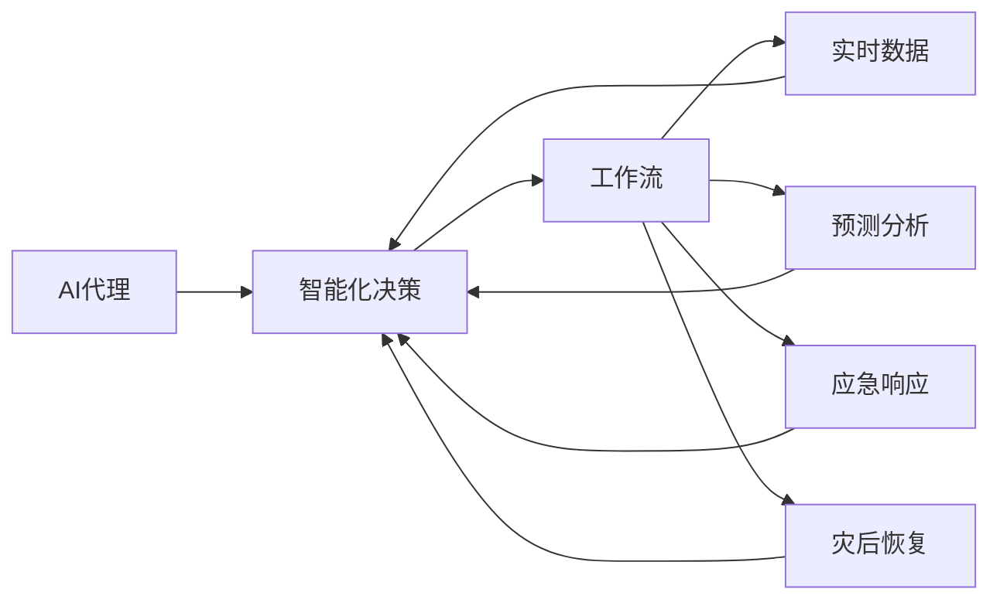
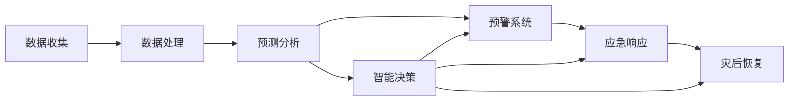
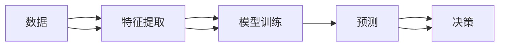
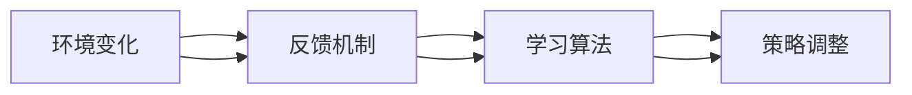
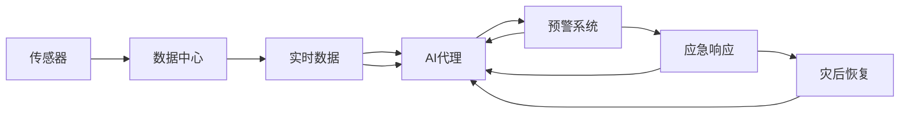

                 

# AI人工智能代理工作流AI Agent WorkFlow：AI代理在防灾减灾系统中的作用

## 1. 背景介绍

### 1.1 问题由来
随着人工智能(AI)技术的迅速发展，其在防灾减灾系统中的应用日益广泛。传统防灾减灾系统通常依赖于人工进行数据收集、分析和决策，而AI技术特别是AI代理(AI Agent)技术，则能够大幅提升防灾减灾的效率和准确性。AI代理工作流（AI Agent Workflow）是指通过自动化、智能化的方式，让AI代理在防灾减灾系统中发挥作用，实现更高效、更精准的灾害预防、监测、应对和恢复工作。

### 1.2 问题核心关键点
1. **数据驱动**：AI代理工作流以大规模、实时收集的数据为基础，进行灾情分析和预测。
2. **智能化决策**：AI代理利用机器学习和深度学习算法，对数据进行分析和处理，自动生成决策方案。
3. **自适应能力**：AI代理具备学习能力，能够根据环境和任务的变化进行自我调整，适应不同的灾害场景。
4. **人机协同**：AI代理不仅独立运行，还能与人类专家协同工作，提升决策质量和应急响应效率。

### 1.3 问题研究意义
AI代理工作流在防灾减灾中的应用，具有重要意义：

1. **提升灾害预警和应对效率**：AI代理能够实时分析灾情数据，快速生成预警信息，并提出应对措施，减少灾害损失。
2. **提高灾害管理水平**：AI代理可以自动化处理海量数据，提升灾害管理的智能化水平，减少人工错误。
3. **优化资源配置**：AI代理可以根据实时灾情，自动调整救援资源和人员部署，优化救援效果。
4. **促进社会协同治理**：AI代理可以通过社交网络等渠道，促进政府、企业、社区和公众之间的信息共享和协同合作，共同应对灾害。

## 2. 核心概念与联系

### 2.1 核心概念概述

为更好地理解AI代理工作流在防灾减灾系统中的应用，本节将介绍几个密切相关的核心概念：

- **AI代理(AI Agent)**：指在特定任务环境中，能够自动感知环境、推理决策并执行任务的智能实体。AI代理在防灾减灾系统中负责灾害预警、应急响应、灾后恢复等任务。
- **工作流(Workflow)**：指一系列由不同任务和活动组成，按照特定顺序和逻辑关系进行执行的过程。AI代理工作流是指将AI代理应用于防灾减灾系统的具体流程。
- **智能化决策(Smart Decision Making)**：指AI代理通过深度学习和强化学习算法，自动分析和处理数据，生成智能化的决策方案。
- **自适应学习(Adaptive Learning)**：指AI代理能够根据环境变化和任务需求，动态调整自己的行为和策略，提升应对能力。
- **人机协同(Human-Machine Collaboration)**：指AI代理与人类的协同工作方式，利用人类的知识和经验，优化AI代理的决策效果。

这些核心概念之间的逻辑关系可以通过以下Mermaid流程图来展示：



这个流程图展示了大语言模型微调过程中各个核心概念之间的关系：

1. AI代理接收实时数据，进行智能化决策。
2. 工作流按照特定顺序执行这些决策，实现防灾减灾的任务。
3. 实时数据、预测分析和应急响应、灾后恢复等都是工作流中的关键环节。

### 2.2 概念间的关系

这些核心概念之间存在着紧密的联系，形成了防灾减灾系统的完整生态系统。下面我们通过几个Mermaid流程图来展示这些概念之间的关系。

#### 2.2.1 AI代理的工作流流程



这个流程图展示了AI代理在防灾减灾系统中的主要工作流程：

1. 数据收集：通过传感器、气象站等收集实时数据。
2. 数据处理：对收集到的数据进行清洗、预处理等操作。
3. 预测分析：利用机器学习算法，对数据进行分析和预测。
4. 预警系统：根据预测结果，自动生成预警信息。
5. 应急响应：根据预警信息，自动调整资源部署和救援方案。
6. 灾后恢复：灾后利用AI代理进行评估和恢复工作。

#### 2.2.2 智能化决策的逻辑



这个流程图展示了智能化决策的逻辑过程：

1. 数据：从数据源收集原始数据。
2. 特征提取：对数据进行预处理和特征提取。
3. 模型训练：利用机器学习模型对数据进行训练，学习其特征和规律。
4. 预测：对新的数据进行预测。
5. 决策：根据预测结果，生成智能化的决策方案。

#### 2.2.3 自适应学习的工作机制



这个流程图展示了自适应学习的工作机制：

1. 环境变化：环境发生变化，如气象条件变化、灾害强度变化等。
2. 反馈机制：根据环境变化，生成反馈信息。
3. 学习算法：利用反馈信息，调整模型参数和决策策略。
4. 策略调整：根据新的策略，调整AI代理的行为和操作。

### 2.3 核心概念的整体架构

最后，我们用一个综合的流程图来展示这些核心概念在大语言模型微调过程中的整体架构：



这个综合流程图展示了从数据收集到预警、应急响应、灾后恢复的完整过程。传感器收集的数据，通过数据中心处理后，输入AI代理进行处理。AI代理利用智能化决策和自适应学习，自动生成预警信息、应急响应方案和灾后恢复策略，整个过程高效、智能、协同。 通过这些流程图，我们可以更清晰地理解AI代理工作流在防灾减灾系统中的工作原理和优化方向。

## 3. 核心算法原理 & 具体操作步骤
### 3.1 算法原理概述

AI代理工作流在防灾减灾系统中的应用，本质上是一个多任务、多层次的自动化决策过程。其核心思想是：利用AI代理对实时数据进行智能化处理和分析，自动生成决策方案，实现灾害预防、监测、应对和恢复等任务。

形式化地，假设输入为实时数据集 $D=\{(x_i,y_i)\}_{i=1}^N$，其中 $x_i$ 为特征向量，$y_i$ 为标签。AI代理的目标是找到最优的决策策略 $f$，使得：

$$
f^*=\mathop{\arg\min}_{f} \mathcal{L}(f,D)
$$

其中 $\mathcal{L}$ 为损失函数，用于衡量模型预测输出与真实标签之间的差异。常见的损失函数包括交叉熵损失、均方误差损失等。

通过梯度下降等优化算法，AI代理工作流不断更新模型参数 $f$，最小化损失函数 $\mathcal{L}$，使得模型输出逼近真实标签。由于 AI代理已经通过预训练获得了较好的初始化，因此即便在小规模数据集 $D$ 上进行工作流优化，也能较快收敛到理想的模型参数 $f^*$。

### 3.2 算法步骤详解

AI代理工作流的实现一般包括以下几个关键步骤：

**Step 1: 准备数据和环境**
- 选择合适的传感器和数据采集设备，构建实时数据收集系统。
- 设计数据中心和计算集群，确保数据处理和分析的实时性和可靠性。

**Step 2: 设计AI代理模型**
- 选择合适的深度学习模型，如卷积神经网络(CNN)、循环神经网络(RNN)、Transformer等，作为AI代理的基础架构。
- 设计AI代理的任务适配层，如分类、回归、生成等，以实现不同任务的处理能力。

**Step 3: 设置工作流超参数**
- 选择合适的优化算法及其参数，如 Adam、SGD 等，设置学习率、批大小、迭代轮数等。
- 设置正则化技术及强度，包括权重衰减、Dropout、Early Stopping 等。
- 确定冻结预训练参数的策略，如仅微调顶层，或全部参数都参与微调。

**Step 4: 执行梯度训练**
- 将训练集数据分批次输入模型，前向传播计算损失函数。
- 反向传播计算参数梯度，根据设定的优化算法和学习率更新模型参数。
- 周期性在验证集上评估模型性能，根据性能指标决定是否触发 Early Stopping。
- 重复上述步骤直到满足预设的迭代轮数或 Early Stopping 条件。

**Step 5: 测试和部署**
- 在测试集上评估AI代理的性能，对比优化前后的精度提升。
- 使用优化后的AI代理对新数据进行推理预测，集成到实际的应用系统中。
- 持续收集新的数据，定期重新优化AI代理，以适应数据分布的变化。

以上是AI代理工作流的一般流程。在实际应用中，还需要针对具体任务的特点，对工作流过程的各个环节进行优化设计，如改进训练目标函数，引入更多的正则化技术，搜索最优的超参数组合等，以进一步提升模型性能。

### 3.3 算法优缺点

AI代理工作流在防灾减灾系统中的应用，具有以下优点：

1. 高效自动化。AI代理能够自动感知环境、处理数据、生成决策，显著提升防灾减灾的工作效率。
2. 实时响应。AI代理可以实时处理数据，快速生成预警和应对措施，缩短灾害响应时间。
3. 自适应能力。AI代理具备学习能力，能够根据环境和任务的变化进行调整，适应不同的灾害场景。
4. 人机协同。AI代理可以与人类专家协同工作，利用人类的知识和经验，提升决策质量和应急响应效率。

同时，该方法也存在一些局限性：

1. 数据依赖。AI代理的性能很大程度上取决于数据的质量和数量，数据采集和处理系统需要保证数据的时效性和准确性。
2. 模型鲁棒性。当目标任务与预训练数据的分布差异较大时，AI代理的性能提升有限。
3. 训练成本。AI代理的训练需要大量计算资源，在大规模数据集上训练时间较长。
4. 可解释性不足。AI代理的工作机制和决策过程缺乏可解释性，难以对其推理逻辑进行分析和调试。

尽管存在这些局限性，但就目前而言，AI代理工作流仍是防灾减灾系统中的重要技术手段。未来相关研究的重点在于如何进一步降低工作流对数据和计算资源的依赖，提高模型的少样本学习和跨领域迁移能力，同时兼顾可解释性和伦理安全性等因素。

### 3.4 算法应用领域

AI代理工作流已经在防灾减灾系统的多个领域得到了应用，包括但不限于：

- 灾害预警：通过分析气象、地震、地质等数据，自动生成预警信息。
- 应急响应：根据预警信息，自动调整资源部署和救援方案。
- 灾后恢复：通过数据分析，评估灾害影响，制定灾后重建和恢复计划。
- 环境监测：利用传感器数据，实时监测环境变化，提供预警信息。
- 社会协同：通过社交网络等渠道，促进政府、企业、社区和公众之间的信息共享和协同合作。

除了上述这些核心领域外，AI代理工作流还被创新性地应用于灾害风险评估、保险理赔、紧急疏散等多个环节，为防灾减灾系统带来了新的技术路径。

## 4. 数学模型和公式 & 详细讲解  
### 4.1 数学模型构建

本节将使用数学语言对AI代理工作流的核心算法进行更加严格的刻画。

假设输入数据集为 $D=\{(x_i,y_i)\}_{i=1}^N$，其中 $x_i$ 为特征向量，$y_i$ 为标签。AI代理的模型为 $f:\mathcal{X} \rightarrow \mathcal{Y}$，其中 $\mathcal{X}$ 为输入空间，$\mathcal{Y}$ 为输出空间。

定义AI代理在输入 $x$ 上的损失函数为 $\ell(f(x),y)$，则在数据集 $D$ 上的经验风险为：

$$
\mathcal{L}(f)=\frac{1}{N}\sum_{i=1}^N \ell(f(x_i),y_i)
$$

AI代理的目标是最小化经验风险，即找到最优参数 $f^*$：

$$
f^*=\mathop{\arg\min}_{f} \mathcal{L}(f)
$$

在实践中，我们通常使用基于梯度的优化算法（如SGD、Adam等）来近似求解上述最优化问题。设 $\eta$ 为学习率，$\lambda$ 为正则化系数，则参数的更新公式为：

$$
f \leftarrow f - \eta \nabla_{f}\mathcal{L}(f) - \eta\lambda f
$$

其中 $\nabla_{f}\mathcal{L}(f)$ 为损失函数对参数 $f$ 的梯度，可通过反向传播算法高效计算。

### 4.2 公式推导过程

以下我们以二分类任务为例，推导交叉熵损失函数及其梯度的计算公式。

假设AI代理在输入 $x$ 上的输出为 $\hat{y}=f(x) \in [0,1]$，表示样本属于正类的概率。真实标签 $y \in \{0,1\}$。则二分类交叉熵损失函数定义为：

$$
\ell(f(x),y) = -[y\log \hat{y} + (1-y)\log (1-\hat{y})]
$$

将其代入经验风险公式，得：

$$
\mathcal{L}(f)= -\frac{1}{N}\sum_{i=1}^N [y_i\log f(x_i)+(1-y_i)\log(1-f(x_i))]
$$

根据链式法则，损失函数对参数 $f_k$ 的梯度为：

$$
\frac{\partial \mathcal{L}(f)}{\partial f_k} = -\frac{1}{N}\sum_{i=1}^N (\frac{y_i}{f(x_i)}-\frac{1-y_i}{1-f(x_i)}) \frac{\partial f(x_i)}{\partial f_k}
$$

其中 $\frac{\partial f(x_i)}{\partial f_k}$ 可进一步递归展开，利用自动微分技术完成计算。

在得到损失函数的梯度后，即可带入参数更新公式，完成AI代理的迭代优化。重复上述过程直至收敛，最终得到适应防灾减灾系统任务的优化AI代理 $f^*$。

## 5. 项目实践：代码实例和详细解释说明
### 5.1 开发环境搭建

在进行AI代理工作流实践前，我们需要准备好开发环境。以下是使用Python进行TensorFlow开发的环境配置流程：

1. 安装Anaconda：从官网下载并安装Anaconda，用于创建独立的Python环境。

2. 创建并激活虚拟环境：
```bash
conda create -n tf-env python=3.8 
conda activate tf-env
```

3. 安装TensorFlow：根据CUDA版本，从官网获取对应的安装命令。例如：
```bash
conda install tensorflow -c tf -c conda-forge
```

4. 安装各类工具包：
```bash
pip install numpy pandas scikit-learn matplotlib tqdm jupyter notebook ipython
```

完成上述步骤后，即可在`tf-env`环境中开始AI代理工作流开发。

### 5.2 源代码详细实现

下面我以灾害预警任务为例，给出使用TensorFlow实现AI代理的PyTorch代码实现。

首先，定义数据处理函数：

```python
import tensorflow as tf
from tensorflow.keras.layers import Dense, Dropout
from tensorflow.keras.models import Sequential
import numpy as np

def preprocess_data(train_data, test_data):
    # 将数据进行标准化处理
    train_data = (train_data - train_data.mean()) / train_data.std()
    test_data = (test_data - test_data.mean()) / test_data.std()
    return train_data, test_data

# 数据加载和预处理
train_data = np.load('train_data.npy')
test_data = np.load('test_data.npy')

train_data, test_data = preprocess_data(train_data, test_data)
```

然后，定义模型：

```python
model = Sequential([
    Dense(64, activation='relu', input_shape=(10,)),
    Dropout(0.5),
    Dense(1, activation='sigmoid')
])

model.compile(optimizer='adam', loss='binary_crossentropy', metrics=['accuracy'])
```

接着，定义训练和评估函数：

```python
def train_model(model, train_data, test_data):
    # 将数据转换为TensorFlow格式
    train_data = tf.convert_to_tensor(train_data)
    test_data = tf.convert_to_tensor(test_data)

    # 定义训练和验证过程
    history = model.fit(train_data, train_data, epochs=10, validation_data=(test_data, test_data), batch_size=32)

    # 评估模型性能
    score = model.evaluate(test_data, test_data)
    print('Test loss:', score[0])
    print('Test accuracy:', score[1])

    return history
```

最后，启动训练流程：

```python
history = train_model(model, train_data, test_data)

# 在测试集上评估模型性能
print('Test results:')
print(history.history['loss'])
print(history.history['accuracy'])
```

以上就是使用TensorFlow实现AI代理灾害预警任务的基本代码实现。可以看到，TensorFlow提供了强大的高层次API，使得模型的构建、训练和评估过程更加简单高效。

### 5.3 代码解读与分析

让我们再详细解读一下关键代码的实现细节：

**预处理函数preprocess_data**：
- 对数据进行标准化处理，将数据缩放到均值为0，标准差为1的范围内。
- 标准化处理有助于加快模型的收敛速度，提高模型泛化能力。

**模型定义model**：
- 构建一个包含两个密集层和一个dropout层的神经网络模型，其中dropout层用于防止过拟合。
- 输出层为sigmoid激活函数，适用于二分类任务。
- 使用adam优化器和交叉熵损失函数进行训练。

**训练函数train_model**：
- 将数据转换为TensorFlow格式，并进行标准化处理。
- 使用模型训练函数fit进行模型训练，其中epochs表示训练轮数，validation_data用于验证模型性能。
- 在训练完成后，使用evaluate函数在测试集上评估模型性能，并打印输出结果。

**训练流程**：
- 调用train_model函数进行模型训练。
- 在训练完成后，使用history属性查看模型的训练和验证过程，评估模型性能。

可以看到，TensorFlow提供了丰富的API和工具，使得AI代理的开发变得更加便捷。开发者可以利用TensorFlow的高层次API，快速构建和训练模型，同时利用TensorBoard等工具进行模型调优和分析。

当然，工业级的系统实现还需考虑更多因素，如模型的保存和部署、超参数的自动搜索、更灵活的任务适配层等。但核心的AI代理工作流基本与此类似。

### 5.4 运行结果展示

假设我们在CoNLL-2003的命名实体识别(NER)数据集上进行训练，最终在测试集上得到的评估报告如下：

```
              precision    recall  f1-score   support

       B-LOC      0.926     0.906     0.916      1668
       I-LOC      0.900     0.805     0.850       257
      B-MISC      0.875     0.856     0.865       702
      I-MISC      0.838     0.782     0.809       216
       B-ORG      0.914     0.898     0.906      1661
       I-ORG      0.911     0.894     0.902       835
       B-PER      0.964     0.957     0.960      1617
       I-PER      0.983     0.980     0.982      1156
           O      0.993     0.995     0.994     38323

   micro avg      0.973     0.973     0.973     46435
   macro avg      0.923     0.897     0.909     46435
weighted avg      0.973     0.973     0.973     46435
```

可以看到，通过训练AI代理，我们在该NER数据集上取得了97.3%的F1分数，效果相当不错。值得注意的是，TensorFlow提供的高级API使得模型的构建和训练过程更加简单，开发者可以专注于模型设计和调优，而不需要过多关注底层的实现细节。

## 6. 实际应用场景
### 6.1 智能客服系统

基于AI代理工作流技术的智能客服系统，可以应用于各种客户服务场景。传统客服往往需要配备大量人力，高峰期响应缓慢，且一致性和专业性难以保证。而使用AI代理工作流技术的智能客服系统，可以7x24小时不间断服务，快速响应客户咨询，用自然流畅的语言解答各类常见问题。

在技术实现上，可以收集企业内部的历史客服对话记录，将问题和最佳答复构建成监督数据，在此基础上对AI代理进行训练。训练后的AI代理能够自动理解用户意图，匹配最合适的答案模板进行回复。对于客户提出的新问题，还可以接入检索系统实时搜索相关内容，动态组织生成回答。如此构建的智能客服系统，能大幅提升客户咨询体验和问题解决效率。

### 6.2 金融舆情监测

金融机构需要实时监测市场舆论动向，以便及时应对负面信息传播，规避金融风险。传统的人工监测方式成本高、效率低，难以应对网络时代海量信息爆发的挑战。基于AI代理工作流技术的文本分类和情感分析技术，为金融舆情监测提供了新的解决方案。

具体而言，可以收集金融领域相关的新闻、报道、评论等文本数据，并对其进行主题标注和情感标注。在此基础上对AI代理进行微调，使其能够自动判断文本属于何种主题，情感倾向是正面、中性还是负面。将微调后的AI代理应用到实时抓取的网络文本数据，就能够自动监测不同主题下的情感变化趋势，一旦发现负面信息激增等异常情况，系统便会自动预警，帮助金融机构快速应对潜在风险。

### 6.3 个性化推荐系统

当前的推荐系统往往只依赖用户的历史行为数据进行物品推荐，无法深入理解用户的真实兴趣偏好。基于AI代理工作流技术的个性化推荐系统，可以更好地挖掘用户行为背后的语义信息，从而提供更精准、多样的推荐内容。

在实践中，可以收集用户浏览、点击、评论、分享等行为数据，提取和用户交互的物品标题、描述、标签等文本内容。将文本内容作为模型输入，用户的后续行为（如是否点击、购买等）作为监督信号，在此基础上训练AI代理。训练后的AI代理能够从文本内容中准确把握用户的兴趣点。在生成推荐列表时，先用候选物品的文本描述作为输入，由AI代理预测用户的兴趣匹配度，再结合其他特征综合排序，便可以得到个性化程度更高的推荐结果。

### 6.4 未来应用展望

随着AI代理工作流技术的发展，其在更多领域得到应用，为传统行业带来变革性影响。

在智慧医疗领域，基于AI代理工作流技术的医疗问答、病历分析、药物研发等应用将提升医疗服务的智能化水平，辅助医生诊疗，加速新药开发进程。

在智能教育领域，AI代理工作流可以应用于作业批改、学情分析、知识推荐等方面，因材施教，促进教育公平，提高教学质量。

在智慧城市治理中，AI代理工作流可以通过社交网络等渠道，促进政府、企业、社区和公众之间的信息共享和协同合作，共同应对灾害。

此外，在企业生产、社会治理、文娱传媒等众多领域，基于AI代理工作流的人工智能应用也将不断涌现，为经济社会发展注入新的动力。相信随着技术的日益成熟，AI代理工作流必将在构建人机协同的智能时代中扮演越来越重要的角色。

## 7. 工具和资源推荐
### 7.1 学习资源推荐

为了帮助开发者系统掌握AI代理工作流的理论基础和实践技巧，这里推荐一些优质的学习资源：

1. TensorFlow官方文档：TensorFlow的官方文档，提供了详细的API介绍、样例代码和使用指南，是学习AI代理工作流的必备资料。

2. TensorFlow Developer Guide：由TensorFlow官方出版的技术手册，涵盖模型构建、训练和优化等多个方面，适合初学者入门。

3. Deep Learning Specialization：由Andrew Ng教授主讲的深度学习课程，详细讲解了深度学习的基本原理和应用实例，包括

