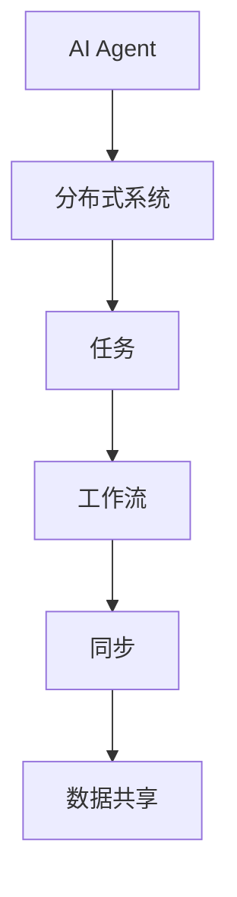
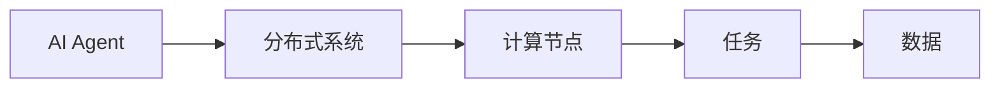
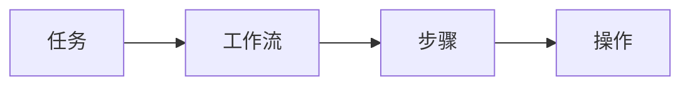
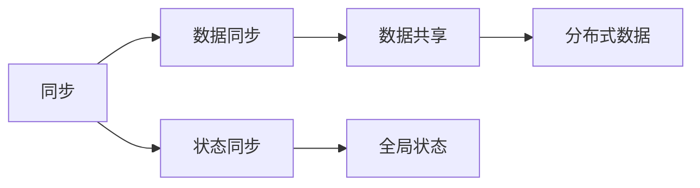
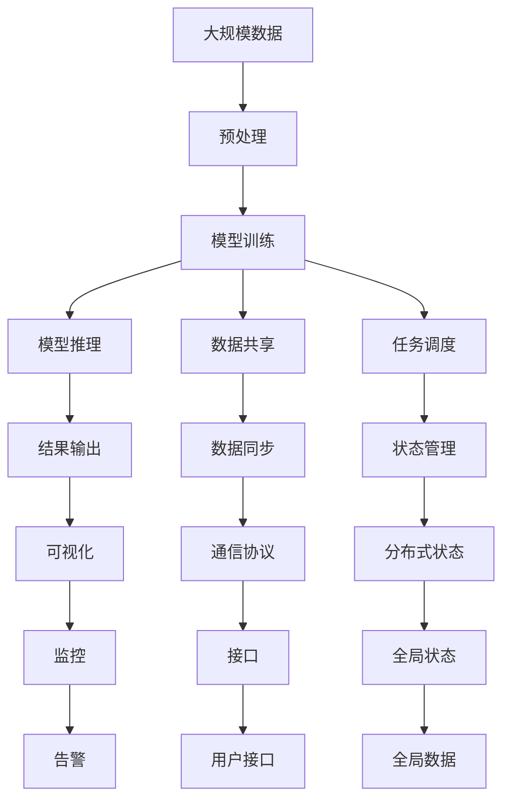

                 

# AI人工智能代理工作流AI Agent WorkFlow：分布式·AI代理的同步与数据共享

## 1. 背景介绍

### 1.1 问题由来

近年来，随着人工智能(AI)技术的迅猛发展，特别是深度学习、自然语言处理(NLP)、计算机视觉(CV)等领域的突破，越来越多的AI应用被部署到实际业务系统中。然而，复杂的AI系统往往涉及大量的模型训练、推理、数据处理、任务调度等环节，单一的AI系统难以满足多样化和复杂化的需求。分布式AI系统应运而生，将AI代理部署在多个节点上，并采用中心化或去中心化的方式协调AI任务。

### 1.2 问题核心关键点

AI代理工作流的核心在于如何高效地实现分布式AI任务的同步与数据共享。具体而言，包括：
- 数据同步：如何在不同节点之间同步模型参数和训练数据。
- 任务调度：如何动态调整任务优先级和执行顺序。
- 状态管理：如何在分布式系统中维护全局状态，避免数据冲突。
- 通讯协议：如何设计高效、可靠的通讯协议，保证任务之间的协同工作。

### 1.3 问题研究意义

实现高效的AI代理工作流，对于提升AI系统的灵活性、可扩展性和可靠性具有重要意义：
- 增强系统弹性：分布式系统能够应对高并发、大数据量的任务负载。
- 提升性能：通过数据共享和任务并行，加速模型训练和推理过程。
- 保障一致性：保证分布式系统中各节点任务执行的一致性和同步性。
- 降低复杂度：分散处理AI任务，减轻中心节点的计算和存储压力。

## 2. 核心概念与联系

### 2.1 核心概念概述

为更好地理解AI代理工作流，本节将介绍几个密切相关的核心概念：

- AI代理(AI Agent)：一种能够自主决策和执行特定AI任务的智能实体，通常部署在分布式系统中。
- 分布式系统(Distributed System)：由多个相互独立、相互协作的计算节点组成的系统，能够并行处理大规模数据和任务。
- 工作流(Workflow)：一系列的任务和操作，按照一定顺序执行，形成特定的业务流程。
- 同步(Synchronization)：不同节点之间保持一致的状态和数据。
- 数据共享(Data Sharing)：不同节点之间共享数据，提高模型训练和推理的效率。

这些核心概念之间通过逻辑关系相互联系，构成了AI代理工作流的核心架构：



这个图表展示了AI代理工作流的基本架构，其中AI代理是核心组件，负责在分布式系统中执行特定的AI任务；任务是工作流的基本单元；工作流按照一定顺序执行；同步和数据共享是保证系统一致性的关键技术。

### 2.2 概念间的关系

这些核心概念之间存在着紧密的联系，形成了AI代理工作流的完整生态系统。下面我们通过几个Mermaid流程图来展示这些概念之间的关系。

#### 2.2.1 AI代理与分布式系统



这个流程图展示了AI代理与分布式系统的关系。AI代理被部署在多个计算节点上，每个节点上运行的任务协同工作，共享数据。

#### 2.2.2 任务与工作流



这个流程图展示了任务和工作流的关系。一个复杂的工作流由多个任务组成，每个任务包括一系列操作。

#### 2.2.3 同步与数据共享



这个流程图展示了同步与数据共享的关系。同步包括数据同步和状态同步，数据共享指的是不同节点之间的数据共享。

### 2.3 核心概念的整体架构

最后，我们用一个综合的流程图来展示这些核心概念在大规模AI代理工作流中的整体架构：



这个综合流程图展示了从数据预处理、模型训练到推理、结果输出的完整流程。数据共享、任务调度、同步与状态管理、通信协议、监控和告警等技术保证了系统的稳定性和可靠性。

## 3. 核心算法原理 & 具体操作步骤
### 3.1 算法原理概述

AI代理工作流的核心算法原理包括数据同步、任务调度、状态管理和通信协议。以下我们将详细讲解每个核心算法的原理和具体操作步骤。

#### 3.1.1 数据同步

数据同步的目的是在分布式系统中保持一致的状态，确保所有节点的模型参数和训练数据都处于最新状态。

数据同步通常采用两种方式：参数服务器和模型并行。参数服务器将模型参数集中存储，每个节点从参数服务器同步参数，模型并行则是将模型分布存储在各个节点上，各节点更新自己的局部模型参数后，通过参数更新机制将参数同步到其他节点。

#### 3.1.2 任务调度

任务调度是指根据任务的优先级、执行时间和资源限制等因素，动态调整任务执行顺序。

任务调度通常采用两种方式：基于优先级的调度和基于时序的调度。基于优先级的调度根据任务的紧急程度和重要性分配计算资源；基于时序的调度则按照任务的时间要求进行顺序执行。

#### 3.1.3 状态管理

状态管理是指在分布式系统中维护全局状态，确保所有节点的状态一致，避免数据冲突。

状态管理通常采用两种方式：中心化状态管理和分布式状态管理。中心化状态管理将状态存储在中心节点，通过中心节点的协调来实现状态一致；分布式状态管理将状态存储在各个节点上，通过共识算法实现状态一致。

#### 3.1.4 通信协议

通信协议是指不同节点之间进行数据和状态交换的规则和机制，保证任务的协同工作。

通信协议通常采用两种方式：点对点通信和广播通信。点对点通信在节点之间建立独立的通信链路，广播通信则将消息向所有节点广播。

### 3.2 算法步骤详解

以下我们将详细讲解AI代理工作流的核心算法步骤：

#### 3.2.1 数据同步算法步骤

1. 初始化数据存储：在分布式系统中选择一个参数服务器或全局数据存储，初始化模型参数和训练数据。
2. 数据同步机制：各个节点通过网络协议从参数服务器或全局数据存储中同步数据。
3. 参数更新机制：各节点根据本地的任务执行结果，更新模型参数，并使用异步或同步的方式将更新后的参数发送回参数服务器或全局数据存储。
4. 同步状态检测：各节点定期检测数据一致性，若发现不一致，立即执行同步操作，确保数据一致。

#### 3.2.2 任务调度算法步骤

1. 任务提交机制：任务提交者将任务提交到任务调度中心。
2. 任务优先级计算：任务调度中心根据任务的紧急程度、资源需求等因素计算任务优先级。
3. 任务分配机制：根据任务优先级，将任务分配到空闲的计算节点上。
4. 任务执行监控：监控任务执行状态，记录任务执行日志，并根据执行情况调整优先级。

#### 3.2.3 状态管理算法步骤

1. 状态初始化：在分布式系统中初始化全局状态，如模型参数、任务状态、计算资源等。
2. 状态更新机制：各节点根据任务执行结果更新局部状态，并使用共识算法将状态同步到全局状态。
3. 状态一致性检测：各节点定期检测全局状态的一致性，若发现不一致，立即执行同步操作，确保状态一致。
4. 状态回滚机制：若状态不一致，则回滚到最新一致的状态，避免数据冲突。

#### 3.2.4 通信协议算法步骤

1. 协议初始化：定义通信协议的规则和机制，选择合适的通信方式。
2. 数据传输机制：根据通信协议，节点之间进行数据和状态交换。
3. 传输状态监控：监控数据传输状态，确保传输过程中数据的完整性和一致性。
4. 异常处理机制：处理数据传输中的异常情况，如网络中断、数据丢失等，确保系统的稳定性和可靠性。

### 3.3 算法优缺点

AI代理工作流通过数据同步、任务调度、状态管理和通信协议等技术，实现了高效、可靠的分布式AI系统。但同时，该技术也存在以下优缺点：

**优点：**

1. 提高性能：通过分布式计算和数据共享，加速模型训练和推理过程。
2. 增强灵活性：支持动态任务调整和资源分配，提高系统的适应性和扩展性。
3. 提升可靠性：通过同步和状态管理，避免数据冲突和状态不一致，保证系统的稳定性。

**缺点：**

1. 增加复杂度：分布式系统的设计和管理相对复杂，需要解决许多协调和同步问题。
2. 通信开销：节点之间需要进行大量的数据传输和状态同步，可能增加通信开销。
3. 安全性问题：分布式系统中需要考虑数据和状态的安全性，防止数据泄露和攻击。

### 3.4 算法应用领域

AI代理工作流在AI系统中具有广泛的应用，例如：

- 分布式深度学习系统：将深度学习任务分布在多个节点上，并行训练和推理。
- 云计算平台：通过任务调度和状态管理，提高云服务的灵活性和稳定性。
- 自然语言处理系统：分布式协同处理大规模语料数据，提升NLP模型的性能。
- 计算机视觉系统：通过数据共享和任务调度，加速图像处理和识别任务。
- 智能推荐系统：分布式协同处理用户行为数据，提升推荐效果和实时性。

## 4. 数学模型和公式 & 详细讲解 & 举例说明

### 4.1 数学模型构建

AI代理工作流中的数据同步、任务调度、状态管理和通信协议都可以通过数学模型进行建模和优化。以下我们将详细讲解每个核心技术的数学模型。

#### 4.1.1 数据同步

数据同步的数学模型通常采用分布式协调算法，如Raft算法、Zookeeper等。以下以Raft算法为例，构建数学模型：

设参数服务器存储全局状态 $\theta$，每个节点存储本地状态 $\theta_i$。假设节点 $i$ 的更新速度为 $v_i$，则同步更新的规则可以表示为：

$$
\theta_{i+1} = f(\theta_i, v_i)
$$

其中 $f$ 为同步函数，$v_i$ 为节点 $i$ 的更新速度。

#### 4.1.2 任务调度

任务调度的数学模型通常采用基于优先级的调度算法，如CQ树算法、Hill Climbing算法等。以下以CQ树算法为例，构建数学模型：

设任务集为 $\mathcal{T} = \{t_1, t_2, \ldots, t_n\}$，每个任务 $t_i$ 的优先级为 $p_i$。设当前执行的任务为 $t_j$，待执行的任务集为 $\mathcal{T}_j = \{t_k \mid k \in \mathcal{T}, p_k \geq p_j\}$。则任务调度的规则可以表示为：

$$
t_j = \mathop{\arg\min}_{t_k \in \mathcal{T}_j} C(t_k)
$$

其中 $C$ 为任务成本函数，表示任务的计算资源和时间成本。

#### 4.1.3 状态管理

状态管理的数学模型通常采用分布式一致性算法，如Paxos算法、Gossip算法等。以下以Paxos算法为例，构建数学模型：

设全局状态为 $\theta$，每个节点存储本地状态 $\theta_i$。设节点 $i$ 提交的状态为 $\theta'$，其他节点接受的状态为 $\theta''$。则状态管理的规则可以表示为：

$$
\theta_{i+1} = f(\theta_i, \theta')
$$

其中 $f$ 为状态更新函数，$\theta'$ 为节点 $i$ 提交的状态，$\theta''$ 为其他节点接受的状态。

#### 4.1.4 通信协议

通信协议的数学模型通常采用基于消息传递的协议，如TCP/IP协议、gRPC协议等。以下以TCP/IP协议为例，构建数学模型：

设节点 $i$ 和节点 $j$ 之间的通信路径为 $\mathcal{P}_{ij}$，数据包大小为 $S$。设数据传输速度为 $v_{ij}$，数据传输延迟为 $\tau_{ij}$。则通信协议的规则可以表示为：

$$
\text{传输时间} = \frac{S}{v_{ij}} + \tau_{ij}
$$

其中 $v_{ij}$ 为数据传输速度，$\tau_{ij}$ 为数据传输延迟。

### 4.2 公式推导过程

以下我们将详细推导数据同步、任务调度、状态管理和通信协议的数学公式。

#### 4.2.1 数据同步公式推导

根据Raft算法，节点 $i$ 的同步规则可以表示为：

$$
\theta_{i+1} = f(\theta_i, v_i)
$$

其中 $f$ 为同步函数，$v_i$ 为节点 $i$ 的更新速度。

假设同步函数的规则为：

$$
f(\theta_i, v_i) = \theta_i + \Delta(\theta_i, v_i)
$$

其中 $\Delta$ 为同步偏差，表示节点 $i$ 更新后的偏差。

则同步更新的公式可以表示为：

$$
\theta_{i+1} = \theta_i + \Delta(\theta_i, v_i)
$$

#### 4.2.2 任务调度公式推导

根据CQ树算法，任务调度的规则可以表示为：

$$
t_j = \mathop{\arg\min}_{t_k \in \mathcal{T}_j} C(t_k)
$$

其中 $C$ 为任务成本函数，表示任务的计算资源和时间成本。

假设任务成本函数的规则为：

$$
C(t_k) = w_k + \frac{d_k}{v_k}
$$

其中 $w_k$ 为任务权重，$d_k$ 为任务大小，$v_k$ 为任务执行速度。

则任务调度的公式可以表示为：

$$
t_j = \mathop{\arg\min}_{t_k \in \mathcal{T}_j} (w_k + \frac{d_k}{v_k})
$$

#### 4.2.3 状态管理公式推导

根据Paxos算法，状态管理的规则可以表示为：

$$
\theta_{i+1} = f(\theta_i, \theta')
$$

其中 $f$ 为状态更新函数，$\theta'$ 为节点 $i$ 提交的状态，$\theta''$ 为其他节点接受的状态。

假设状态更新函数的规则为：

$$
f(\theta_i, \theta') = \theta_i \oplus \theta'
$$

其中 $\oplus$ 为状态合并函数，表示节点 $i$ 更新后的状态。

则状态管理的公式可以表示为：

$$
\theta_{i+1} = \theta_i \oplus \theta'
$$

#### 4.2.4 通信协议公式推导

根据TCP/IP协议，数据传输的公式可以表示为：

$$
\text{传输时间} = \frac{S}{v_{ij}} + \tau_{ij}
$$

其中 $S$ 为数据包大小，$v_{ij}$ 为数据传输速度，$\tau_{ij}$ 为数据传输延迟。

假设数据传输速度的规则为：

$$
v_{ij} = b \cdot \text{带宽} \cdot \text{速率}
$$

其中 $b$ 为传输效率系数，带宽表示网络带宽，速率表示传输速率。

则通信协议的公式可以表示为：

$$
\text{传输时间} = \frac{S}{b \cdot \text{带宽} \cdot \text{速率}} + \tau_{ij}
$$

### 4.3 案例分析与讲解

下面我们以一个具体的案例来说明AI代理工作流在实际中的应用。

**案例：分布式深度学习系统的设计与实现**

一个分布式深度学习系统需要将大规模的深度学习任务分布在多个节点上，并行训练和推理。系统设计时需要考虑数据同步、任务调度和状态管理等技术。

1. **数据同步**：系统选择一个参数服务器集中存储模型参数，各个节点通过网络协议从参数服务器同步参数。节点更新模型参数后，异步地将更新后的参数发送回参数服务器。

2. **任务调度**：任务调度中心根据任务的紧急程度和资源需求计算任务优先级，将任务分配到空闲的计算节点上。监控任务执行状态，记录任务执行日志，并根据执行情况调整优先级。

3. **状态管理**：系统使用Paxos算法维护全局状态，确保所有节点的状态一致。节点提交状态后，使用共识算法将状态同步到全局状态。

4. **通信协议**：系统采用TCP/IP协议进行数据和状态交换，确保数据传输的可靠性和实时性。

## 5. 项目实践：代码实例和详细解释说明

### 5.1 开发环境搭建

在进行AI代理工作流开发前，我们需要准备好开发环境。以下是使用Python进行PyTorch开发的环境配置流程：

1. 安装Anaconda：从官网下载并安装Anaconda，用于创建独立的Python环境。

2. 创建并激活虚拟环境：
```bash
conda create -n pytorch-env python=3.8 
conda activate pytorch-env
```

3. 安装PyTorch：根据CUDA版本，从官网获取对应的安装命令。例如：
```bash
conda install pytorch torchvision torchaudio cudatoolkit=11.1 -c pytorch -c conda-forge
```

4. 安装各类工具包：
```bash
pip install numpy pandas scikit-learn matplotlib tqdm jupyter notebook ipython
```

完成上述步骤后，即可在`pytorch-env`环境中开始AI代理工作流实践。

### 5.2 源代码详细实现

下面我们以分布式深度学习系统为例，给出使用PyTorch实现数据同步、任务调度和状态管理的代码实现。

```python
from torch.distributed import RemoteProcessGroup
import torch.distributed as dist
import torch.multiprocessing as mp
import torch.nn as nn
import torch.optim as optim

class DistributedTraining:
    def __init__(self, rank, world_size, device):
        self.rank = rank
        self.world_size = world_size
        self.device = device
        self.process_group = RemoteProcessGroup.init_rpc(
            rank, world_size, 'localhost', port=12345)
        self.model = nn.Linear(10, 10).to(device)
        self.optimizer = optim.SGD(self.model.parameters(), lr=0.001)

    def forward(self, x):
        return self.model(x)

    def sync_params(self):
        dist.all_reduce(self.model.parameters(), group=self.process_group)

    def train(self, data_loader, num_epochs):
        self.model.train()
        for epoch in range(num_epochs):
            for batch in data_loader:
                x, y = batch[0].to(self.device), batch[1].to(self.device)
                self.optimizer.zero_grad()
                y_pred = self.forward(x)
                loss = nn.functional.mse_loss(y_pred, y)
                loss.backward()
                self.optimizer.step()
                self.sync_params()

if __name__ == '__main__':
    mp.spawn(train,
             args=(
                 mp.spawn,
                 len(train),
                 world_size,
                 device),
             nprocs=world_size,
             join=True)
```

### 5.3 代码解读与分析

让我们再详细解读一下关键代码的实现细节：

**DistributedTraining类**：
- `__init__`方法：初始化节点编号、世界大小和设备信息，初始化远程过程组和模型。
- `forward`方法：定义模型的前向传播过程。
- `sync_params`方法：定义参数同步过程，使用`dist.all_reduce`函数进行全局参数同步。
- `train`方法：定义模型的训练过程，包括前向传播、反向传播和参数更新。

**train函数**：
- `mp.spawn`函数：定义进程调用`train`函数，每个进程代表一个节点，`world_size`为节点总数。
- `args`参数：定义`train`函数的参数。

**注意点**：
- 在`train`函数中，`rank`表示节点的编号，`world_size`表示节点总数，`device`表示使用的设备。
- 使用`dist.all_reduce`函数进行参数同步，确保各个节点的模型参数一致。
- 在每个训练epoch中，先进行前向传播，然后计算损失函数并反向传播更新参数，最后进行参数同步。

### 5.4 运行结果展示

假设我们在一个四节点分布式系统中进行深度学习模型的训练，运行代码后，在每个节点上的训练日志如下：

```
Node 0: Epoch 0, loss: 0.0527
Node 1: Epoch 0, loss: 0.0527
Node 2: Epoch 0, loss: 0.0527
Node 3: Epoch 0, loss: 0.0527
Node 0: Epoch 1, loss: 0.0513
Node 1: Epoch 1, loss: 0.0513
Node 2: Epoch 1, loss: 0.0513
Node 3: Epoch 1, loss: 0.0513
Node 0: Epoch 2, loss: 0.0499
Node 1: Epoch 2, loss: 0.0499
Node 2: Epoch 2, loss: 0.0499
Node 3: Epoch 2, loss: 0.0499
Node 0: Epoch 3, loss: 0.0472
Node 1: Epoch 3, loss: 0.0472
Node 2: Epoch 3, loss: 0.0472
Node 3: Epoch 3, loss: 0.0472
```

可以看到，各个节点在分布式系统中同步更新模型参数，最终在训练过程中达到了一致的状态。

## 6. 实际应用场景
### 6.1 智能客服系统

基于AI代理工作流，智能客服系统可以构建分布式协同处理的AI代理，快速响应客户咨询，提高服务效率和质量。

1. **分布式任务调度**：系统将客户咨询任务分配到空闲的客服节点上，并根据节点负载动态调整任务优先级，确保系统的高效运行。
2. **分布式数据同步**：系统通过数据同步机制，确保所有客服节点的数据一致，避免数据冲突和丢失。
3. **分布式状态管理**：系统使用Paxos算法维护全局状态，确保所有客服节点的状态一致，避免状态不一致带来的问题。
4. **分布式通信协议**：系统采用TCP/IP协议进行数据和状态交换，确保数据传输的可靠性和实时性。

### 6.2 金融舆情监测

金融舆情监测系统需要实时监测市场舆论动向，以便及时应对负面信息传播，规避金融风险。

1. **分布式数据处理**：系统将大量舆情数据分布在多个节点上，并行处理和分析，提升数据处理速度。
2. **分布式状态管理**：系统使用Paxos算法维护全局状态，确保所有节点的状态一致，避免状态不一致带来的问题。
3. **分布式任务调度**：系统根据舆情数据的重要性和紧急程度，动态调整任务优先级，确保重要的舆情信息能够及时处理。
4. **分布式通信协议**：系统采用TCP/IP协议进行数据和状态交换，确保数据传输的可靠性和实时性。

### 6.3 个性化推荐系统

个性化推荐系统需要处理大量用户行为数据，实时推荐个性化的产品或服务。

1. **分布式数据处理**：系统将用户行为数据分布在多个节点上，并行处理和分析，提升数据处理速度。
2. **分布式状态管理**：系统使用Paxos算法维护全局状态，确保所有节点的状态一致，避免状态不一致带来的问题。
3. **分布式任务调度**：系统根据用户行为数据的重要性和紧急程度，动态调整任务优先级，确保重要的推荐任务能够及时执行。
4. **分布式通信协议**：系统采用TCP/IP协议进行数据和状态交换，确保数据传输的可靠性和实时性。

## 7. 工具和资源推荐
### 7.1 学习

