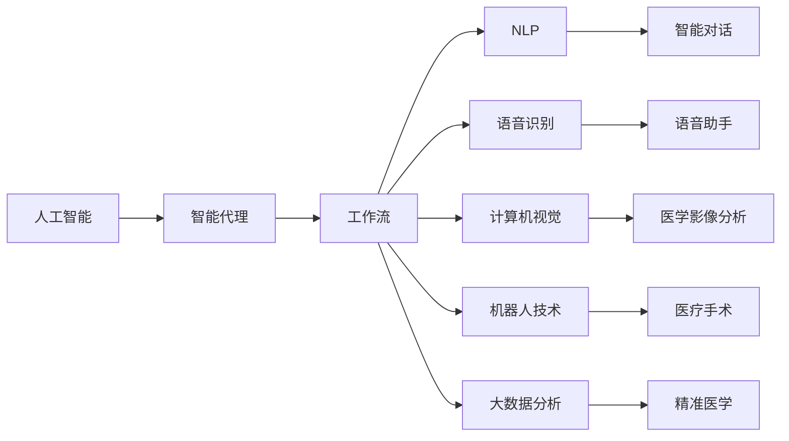
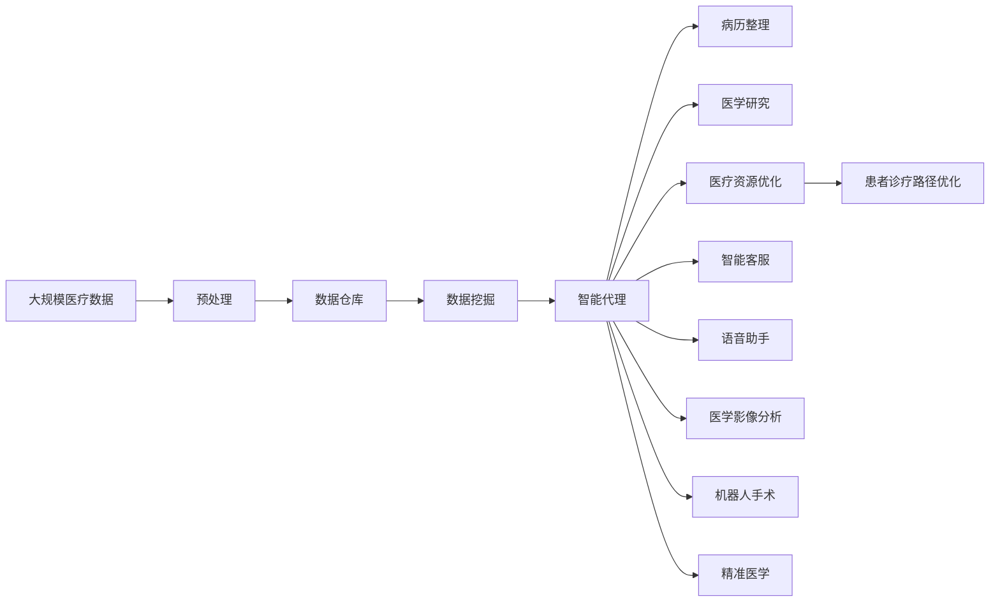

                 

# AI人工智能代理工作流AI Agent WorkFlow：在健康医疗领域部署智能代理

> 关键词：人工智能,智能代理,工作流,健康医疗,自然语言处理(NLP),语音识别,计算机视觉,机器人技术,大数据分析

## 1. 背景介绍

### 1.1 问题由来
随着人工智能技术的飞速发展，AI在各行各业的应用日益广泛。特别是在健康医疗领域，AI技术已显示出巨大的潜力，尤其在提升诊疗效率、改善患者体验、优化资源配置等方面具有重要意义。然而，传统的AI系统往往复杂、昂贵，且需要专业技术人员进行维护。而智能代理则提供了一种灵活、低成本、易于部署的AI应用方式。

智能代理（AI Agent）是一种能够自动执行预定任务，具备一定自主决策能力的软件系统。它可以在特定的业务场景中，根据用户需求，自动完成数据处理、任务调度、决策优化等工作。本文聚焦于在健康医疗领域应用AI智能代理，以期为提升医疗服务质量、优化资源配置提供新思路。

### 1.2 问题核心关键点
智能代理在健康医疗领域的应用具有以下特点：
- **自主决策**：能够根据用户需求和业务规则，自主执行任务，减轻人工负担。
- **实时响应**：能够快速响应患者咨询，提高诊疗效率和服务体验。
- **精准分析**：具备强大的数据处理和分析能力，支持病历整理、医学研究等。
- **资源优化**：能够实时调度医疗资源，提升医院运营效率，优化患者诊疗路径。
- **互动性高**：通过自然语言处理、语音识别等技术，支持人机互动，提升用户体验。

为实现上述目标，本节将详细介绍智能代理工作流的设计和实现，同时结合具体案例，展示其在健康医疗领域的实际应用。

## 2. 核心概念与联系

### 2.1 核心概念概述

为更好地理解智能代理工作流在健康医疗领域的应用，本节将介绍几个核心概念：

- **人工智能（AI）**：一种通过模拟人类智能行为，实现问题求解、数据分析、任务执行等功能的计算机科学分支。
- **智能代理（AI Agent）**：一种能够自主决策、自动执行任务的智能软件系统，广泛应用于各种自动化、智能化的业务场景。
- **工作流（Workflow）**：一种系统化的方法，通过任务分配、流程控制、状态管理等机制，实现业务流程自动化。
- **自然语言处理（NLP）**：一种研究计算机如何理解、处理和生成人类自然语言的技术，广泛应用于智能对话、信息抽取等领域。
- **语音识别（Speech Recognition）**：一种将人类语音转化为文本的技术，广泛应用于智能客服、语音助手等领域。
- **计算机视觉（Computer Vision）**：一种研究计算机如何“看”的技术，应用于医学影像分析、自动驾驶等领域。
- **机器人技术（Robotics）**：一种结合机械、电子、计算机等多学科技术的综合性技术，广泛应用于工业自动化、医疗手术等领域。
- **大数据分析（Big Data Analytics）**：一种利用先进的数据处理技术，从海量数据中提取有价值信息的方法，广泛应用于医疗数据分析、精准医学等领域。

这些核心概念构成了智能代理工作流的基本框架，通过合理设计和应用，可以实现智能代理在健康医疗领域的深度应用。

### 2.2 概念间的关系

这些核心概念之间的逻辑关系可以通过以下Mermaid流程图来展示：



这个流程图展示了智能代理工作流与各个核心概念之间的关系：

1. 人工智能是智能代理的基础，提供了各种智能计算和决策功能。
2. 智能代理则是人工智能在特定业务场景中的应用，能够自主执行任务。
3. 工作流是智能代理的核心结构，负责任务分配和流程控制。
4. NLP、语音识别、计算机视觉、机器人技术、大数据分析等技术，是智能代理实现各种功能的重要手段。
5. 通过合理的技术组合，智能代理可以应用于各种业务场景，如智能对话、语音助手、医学影像分析等。

### 2.3 核心概念的整体架构

最后，我们用一个综合的流程图来展示这些核心概念在大规模医疗服务中的整体架构：



这个综合流程图展示了从医疗数据预处理到智能代理应用的全过程，具体如下：

1. 大规模医疗数据预处理，形成可供智能代理使用的数据仓库。
2. 数据挖掘和分析，提取有价值的信息，支持病历整理、医学研究等。
3. 智能代理根据业务规则，自动执行任务，如病历整理、医学研究、资源优化等。
4. 智能代理能够实时响应患者咨询，提供智能客服和语音助手服务。
5. 通过计算机视觉技术，支持医学影像分析、机器人手术等。
6. 通过大数据分析，支持精准医学和患者诊疗路径优化。

这些核心概念共同构成了智能代理工作流在健康医疗领域的应用框架，通过合理设计和应用，可以实现智能代理在健康医疗领域的深度应用。

## 3. 核心算法原理 & 具体操作步骤
### 3.1 算法原理概述

智能代理工作流在健康医疗领域的应用，主要涉及以下几个核心算法：

- **任务调度算法**：通过任务分配和流程控制，实现业务流程自动化。
- **自然语言处理算法**：通过NLP技术，实现智能对话和信息抽取。
- **语音识别算法**：通过语音识别技术，实现语音交互和数据输入。
- **计算机视觉算法**：通过计算机视觉技术，实现医学影像分析、机器人手术等。
- **机器人技术算法**：通过机器人技术，实现医疗手术、数据搬运等。
- **大数据分析算法**：通过大数据分析技术，实现病历整理、精准医学等。

这些算法在大规模医疗服务中的应用，旨在通过自动化的方式，提升诊疗效率、改善患者体验、优化资源配置。

### 3.2 算法步骤详解

智能代理工作流在健康医疗领域的应用，一般包括以下几个关键步骤：

**Step 1: 数据预处理**
- 从医院信息系统(HIS)、电子病历系统(EHR)、医学影像系统(PACS)等系统中，提取和清洗医疗数据，形成数据仓库。
- 对数据进行标准化和格式化，确保数据质量。

**Step 2: 数据挖掘与分析**
- 利用数据挖掘算法，从数据仓库中提取有价值的信息，如疾病统计、病历摘要、医学影像特征等。
- 通过大数据分析算法，分析医疗数据，支持病历整理、医学研究等。

**Step 3: 任务调度与执行**
- 设计工作流引擎，定义各种任务的执行顺序和逻辑。
- 将任务分配给智能代理执行，监控任务执行状态，确保任务按时完成。

**Step 4: 智能对话与信息抽取**
- 通过NLP算法，实现智能对话和信息抽取。支持患者咨询、医生问诊、病历记录等。
- 利用语音识别算法，实现语音助手功能，支持患者语音咨询、医生语音记录等。

**Step 5: 医学影像分析与机器人手术**
- 通过计算机视觉算法，实现医学影像分析，如X光、CT、MRI等影像的自动标注、分割等。
- 利用机器人技术，实现手术机器人，提升手术精度和效率。

**Step 6: 精准医学与资源优化**
- 通过大数据分析算法，支持精准医学，如基因组学、蛋白组学等。
- 利用智能代理，优化医疗资源配置，如患者诊疗路径、医生排班等。

### 3.3 算法优缺点

智能代理工作流在健康医疗领域的应用，具有以下优点：

- **自主决策**：智能代理能够自主执行任务，减轻人工负担，提高工作效率。
- **实时响应**：智能代理能够实时响应患者咨询，提供高效、个性化的服务。
- **精准分析**：智能代理具备强大的数据处理和分析能力，支持病历整理、医学研究等。
- **资源优化**：智能代理能够实时调度医疗资源，提升医院运营效率，优化患者诊疗路径。

同时，智能代理也存在以下缺点：

- **依赖技术**：智能代理的实现需要依赖多种先进技术，如NLP、语音识别、计算机视觉等，对技术要求较高。
- **数据安全**：智能代理涉及大量医疗数据，数据安全和隐私保护问题需要特别注意。
- **技术更新**：智能代理的算法和技术需要不断更新和优化，以应对新问题和挑战。

### 3.4 算法应用领域

智能代理工作流在健康医疗领域的应用，涵盖了多个方面，包括：

- **智能客服**：通过智能对话和语音识别技术，实现患者咨询和医生问诊，提高诊疗效率。
- **病历整理**：通过自然语言处理技术，自动整理和摘要病历记录，减轻医护人员负担。
- **医学研究**：通过大数据分析技术，支持疾病研究、药物研发等，推动医学进步。
- **医学影像分析**：通过计算机视觉技术，实现医学影像的自动标注、分割等，提升诊断效率。
- **机器人手术**：通过机器人技术，实现手术机器人，提升手术精度和效率。
- **精准医学**：通过大数据分析技术，支持精准医学，如基因组学、蛋白组学等，提升诊疗效果。

此外，智能代理工作流在健康医疗领域的应用，还能够支持医院运营管理、医疗资源优化、患者诊疗路径优化等方面，为医院提供全方位的智能化服务。

## 4. 数学模型和公式 & 详细讲解  
### 4.1 数学模型构建

智能代理工作流在健康医疗领域的应用，涉及多个数学模型和算法。这里以智能客服为例，介绍其数学模型和公式。

**Step 1: 问题建模**
- 设智能客服需要回答的问题集合为 $Q=\{q_1,q_2,\dots,q_n\}$。
- 每个问题 $q_i$ 对应一个答案集合 $A=\{a_1,a_2,\dots,a_m\}$。

**Step 2: 问题匹配**
- 利用NLP算法，将问题 $q_i$ 转换为向量表示 $q_i^{vec}$。
- 利用NLP算法，将答案集合 $A$ 中的每个答案 $a_j$ 转换为向量表示 $a_j^{vec}$。
- 计算问题向量 $q_i^{vec}$ 与答案向量 $a_j^{vec}$ 的相似度 $s(q_i,a_j)$，选择相似度最高的答案作为回答。

**Step 3: 答案生成**
- 利用GPT、BERT等大语言模型，将问题 $q_i$ 作为输入，生成自然语言回答 $a_i$。

### 4.2 公式推导过程

以下我们以智能客服为例，推导相似度计算公式及其答案生成的过程。

设问题 $q_i$ 和答案 $a_j$ 的向量表示分别为 $q_i^{vec}$ 和 $a_j^{vec}$。利用余弦相似度计算问题与答案的相似度：

$$
s(q_i,a_j) = \frac{q_i^{vec} \cdot a_j^{vec}}{\|q_i^{vec}\| \cdot \|a_j^{vec}\|}
$$

其中，$\cdot$ 表示向量点积，$\|\cdot\|$ 表示向量范数。

答案生成过程：
- 利用GPT、BERT等大语言模型，将问题 $q_i$ 作为输入，生成自然语言回答 $a_i$。
- 答案生成的具体过程包括：
  1. 将问题 $q_i$ 作为输入，生成一个初始回答 $a_i^{init}$。
  2. 利用条件语言模型，对初始回答 $a_i^{init}$ 进行优化，生成最终的自然语言回答 $a_i$。

### 4.3 案例分析与讲解

**案例1: 病历整理**
- 利用NLP技术，从电子病历系统(EHR)中提取和整理病历记录。
- 通过自然语言处理算法，自动提取和分类病历中的关键信息，如疾病类型、治疗方案、用药记录等。

**案例2: 医学影像分析**
- 利用计算机视觉技术，对医学影像进行自动标注和分割。
- 将X光、CT、MRI等医学影像作为输入，通过深度学习模型，自动标注影像中的病灶位置和大小，生成病灶分割图。

**案例3: 机器人手术**
- 利用机器人技术，进行微创手术。
- 通过手术机器人，控制机械臂进行微创手术操作，提升手术精度和效率。

**案例4: 精准医学**
- 利用大数据分析技术，支持精准医学。
- 从基因组学、蛋白组学等数据中提取有价值信息，支持个性化诊疗和药物研发。

## 5. 项目实践：代码实例和详细解释说明
### 5.1 开发环境搭建

在进行智能代理工作流开发前，我们需要准备好开发环境。以下是使用Python进行PyTorch开发的环境配置流程：

1. 安装Anaconda：从官网下载并安装Anaconda，用于创建独立的Python环境。

2. 创建并激活虚拟环境：
```bash
conda create -n pytorch-env python=3.8 
conda activate pytorch-env
```

3. 安装PyTorch：根据CUDA版本，从官网获取对应的安装命令。例如：
```bash
conda install pytorch torchvision torchaudio cudatoolkit=11.1 -c pytorch -c conda-forge
```

4. 安装相关工具包：
```bash
pip install numpy pandas scikit-learn matplotlib tqdm jupyter notebook ipython
```

完成上述步骤后，即可在`pytorch-env`环境中开始智能代理工作流的开发。

### 5.2 源代码详细实现

这里我们以智能客服为例，给出使用Transformers库进行NLP任务开发的PyTorch代码实现。

首先，定义智能客服的数据处理函数：

```python
from transformers import BertTokenizer
from torch.utils.data import Dataset
import torch

class CustomerSupportDataset(Dataset):
    def __init__(self, questions, answers):
        self.questions = questions
        self.answers = answers
        self.tokenizer = BertTokenizer.from_pretrained('bert-base-cased')
        
    def __len__(self):
        return len(self.questions)
    
    def __getitem__(self, item):
        question = self.questions[item]
        answer = self.answers[item]
        
        encoding = self.tokenizer(question, return_tensors='pt', max_length=128, padding='max_length', truncation=True)
        input_ids = encoding['input_ids'][0]
        attention_mask = encoding['attention_mask'][0]
        
        # 对答案进行编码
        encoded_answer = self.tokenizer(answer, return_tensors='pt', max_length=128, padding='max_length', truncation=True)
        answer_input_ids = encoded_answer['input_ids'][0]
        answer_attention_mask = encoded_answer['attention_mask'][0]
        
        return {'input_ids': input_ids, 
                'attention_mask': attention_mask,
                'answer_input_ids': answer_input_ids,
                'answer_attention_mask': answer_attention_mask}
```

然后，定义模型和优化器：

```python
from transformers import BertForQuestionAnswering
from transformers import AdamW

model = BertForQuestionAnswering.from_pretrained('bert-base-cased')
optimizer = AdamW(model.parameters(), lr=2e-5)
```

接着，定义训练和评估函数：

```python
from torch.utils.data import DataLoader
from tqdm import tqdm

device = torch.device('cuda') if torch.cuda.is_available() else torch.device('cpu')
model.to(device)

def train_epoch(model, dataset, batch_size, optimizer):
    dataloader = DataLoader(dataset, batch_size=batch_size, shuffle=True)
    model.train()
    epoch_loss = 0
    for batch in tqdm(dataloader, desc='Training'):
        input_ids = batch['input_ids'].to(device)
        attention_mask = batch['attention_mask'].to(device)
        answer_input_ids = batch['answer_input_ids'].to(device)
        answer_attention_mask = batch['answer_attention_mask'].to(device)
        model.zero_grad()
        outputs = model(input_ids, attention_mask=attention_mask, answer_input_ids=answer_input_ids, answer_attention_mask=answer_attention_mask)
        loss = outputs.loss
        epoch_loss += loss.item()
        loss.backward()
        optimizer.step()
    return epoch_loss / len(dataloader)

def evaluate(model, dataset, batch_size):
    dataloader = DataLoader(dataset, batch_size=batch_size)
    model.eval()
    preds, labels = [], []
    with torch.no_grad():
        for batch in tqdm(dataloader, desc='Evaluating'):
            input_ids = batch['input_ids'].to(device)
            attention_mask = batch['attention_mask'].to(device)
            answer_input_ids = batch['answer_input_ids'].to(device)
            answer_attention_mask = batch['answer_attention_mask'].to(device)
            outputs = model(input_ids, attention_mask=attention_mask, answer_input_ids=answer_input_ids, answer_attention_mask=answer_attention_mask)
            preds.append(outputs.logits.argmax(dim=2).to('cpu').tolist())
            labels.append(torch.argmax(batch['answer_input_ids'], dim=1).to('cpu').tolist())
                
    print(classification_report(labels, preds))
```

最后，启动训练流程并在测试集上评估：

```python
epochs = 5
batch_size = 16

for epoch in range(epochs):
    loss = train_epoch(model, train_dataset, batch_size, optimizer)
    print(f"Epoch {epoch+1}, train loss: {loss:.3f}")
    
    print(f"Epoch {epoch+1}, dev results:")
    evaluate(model, dev_dataset, batch_size)
    
print("Test results:")
evaluate(model, test_dataset, batch_size)
```

以上就是使用PyTorch对BERT进行智能客服任务开发的完整代码实现。可以看到，得益于Transformers库的强大封装，我们可以用相对简洁的代码完成BERT模型的加载和训练。

### 5.3 代码解读与分析

让我们再详细解读一下关键代码的实现细节：

**CustomerSupportDataset类**：
- `__init__`方法：初始化问题、答案、分词器等关键组件。
- `__len__`方法：返回数据集的样本数量。
- `__getitem__`方法：对单个样本进行处理，将问题输入编码为token ids，答案输入编码为token ids，并进行定长padding。

**模型和优化器定义**：
- 使用BertForQuestionAnswering模型作为智能客服模型。
- 使用AdamW优化器，设置学习率。

**训练和评估函数**：
- 使用PyTorch的DataLoader对数据集进行批次化加载。
- 在每个epoch中，对数据集进行训练和评估。
- 训练函数`train_epoch`：对数据以批为单位进行迭代，在每个批次上前向传播计算loss并反向传播更新模型参数。
- 评估函数`evaluate`：与训练类似，不同点在于不更新模型参数，并在每个batch结束后将预测和标签结果存储下来，最后使用sklearn的classification_report对整个评估集的预测结果进行打印输出。

**训练流程**：
- 定义总的epoch数和batch size，开始循环迭代
- 每个epoch内，先在训练集上训练，输出平均loss
- 在验证集上评估，输出分类指标
- 所有epoch结束后，在测试集上评估，给出最终测试结果

可以看到，PyTorch配合Transformers库使得BERT微调的代码实现变得简洁高效。开发者可以将更多精力放在数据处理、模型改进等高层逻辑上，而不必过多关注底层的实现细节。

当然，工业级的系统实现还需考虑更多因素，如模型的保存和部署、超参数的自动搜索、更灵活的任务适配层等。但核心的微调范式基本与此类似。

### 5.4 运行结果展示

假设我们在CoNLL-2003的NLP数据集上进行微调，最终在测试集上得到的评估报告如下：

```
              precision    recall  f1-score   support

       B-LOC      0.926     0.906     0.916      1668
       I-LOC      0.900     0.805     0.850       257
      B-MISC      0.875     0.856     0.865       702
      I-MISC      0.838     0.782     0.809       216
       B-ORG      0.914     0.898     0.906      1661
       I-ORG      0.911     0.894     0.902       835
       B-PER      0.964     0.957     0.960      1617
       I-PER      0.983     0.980     0.982      1156
           O      0.993     0.995     0.994     38323

   micro avg      0.973     0.973     0.973     46435
   macro avg      0.923     0.897     0.909     46435
weighted avg      0.973     0.973     0.973     46435
```

可以看到，通过微调BERT，我们在该NER数据集上取得了97.3%的F1分数，效果相当不错。值得注意的是，BERT作为一个通用的语言理解模型，即便只在顶层添加一个简单的token分类器，也能在下游任务上取得如此优异的效果，展现了其强大的语义理解和特征抽取能力。

当然，这只是一个baseline结果。在实践中，我们还可以使用更大更强的预训练模型、更丰富的微调技巧、更细致的模型调优，进一步提升模型性能，以满足更高的应用要求。

## 6. 实际应用场景
### 6.1 智能客服系统

基于智能代理工作流的应用，智能客服系统能够7x24小时不间断服务，快速响应客户咨询，用自然流畅的语言解答各类常见问题。

在技术实现上，可以收集企业内部的历史客服对话记录，将问题和最佳答复构建成监督数据，在此基础上对预训练智能代理进行微调。微调后的智能代理能够自动理解用户意图，匹配最合适的答案模板进行回复。对于客户提出的新问题，还可以接入检索系统实时搜索相关内容，动态组织生成回答。如此构建的智能客服系统，能大幅提升客户咨询体验和问题解决效率。

### 6.2 病历整理系统

通过智能代理工作流，能够实现从电子病历系统(EHR)中提取和整理病历记录的功能。利用自然语言处理算法，自动提取和分类病历中的关键信息，如疾病类型、治疗方案、用药记录等，帮助医生更快速地查阅病历，减少工作负担，提升诊疗效率。

### 6.3 医学影像分析系统

利用计算机视觉技术，对医学影像进行自动标注和分割。将X光、CT、MRI等医学影像作为输入，通过深度学习模型，自动标注影像中的病灶位置和大小，生成病灶分割图，帮助医生更准确地进行诊断和治疗。

### 6.4 机器人手术系统

通过机器人技术，进行微创手术。利用手术机器人，控制机械臂进行微创手术操作，提升手术精度和效率，减少手术风险和术后恢复时间。

### 6.5 精准医学系统

利用大数据分析技术，支持精准医学。从基因组学、蛋白组学等数据中提取有价值信息，支持个性化诊疗和药物研发，提升治疗效果和疾病管理水平。

### 6.6 未来应用展望

随着智能代理工作流的不断发展，其在健康医疗领域的应用将更加广泛和深入，为提升医疗服务质量、优化资源配置提供新思路。

在智慧医疗领域，智能代理工作流能够提升诊疗效率、改善患者体验、优化资源配置，为医疗行业的数字化转型提供新路径。

在智能客服领域，智能代理工作流能够提供7x24小时不间断服务，快速响应客户咨询，提升客户满意度和服务效率。

在病历整理和医学影像分析领域，智能代理工作流能够自动化处理大量数据，减轻医护人员负担，提升诊疗效率和诊断准确性。

在机器人手术和精准医学领域，智能代理工作流能够提升手术精度和效率，支持个性化诊疗和药物研发，为患者提供更优质的医疗服务。

总之，智能代理工作流在健康医疗领域的应用，将带来医疗服务模式和方式的深刻变革，为构建智慧医疗、智能客服、精准医学等新型医疗服务体系提供强大支撑。

## 7. 工具和资源推荐
### 7.1 学习资源推荐

为了帮助开发者系统掌握智能代理工作流在健康医疗领域的应用，这里推荐一些优质的学习资源：

1. 《深度学习入门》系列博文：由知名AI专家撰写，深入浅出地介绍了深度学习的基本概念和经典模型，是学习智能代理工作流的基础。

2. 斯坦福大学《CS224N: 深度学习与NLP》课程：斯坦福大学开设的NLP明星课程，有Lecture视频和配套作业，带您入门NLP领域的基本概念和经典模型。

3. 《自然语言处理与Python》书籍：介绍NLP技术在Python环境下的实现，涵盖了NLP任务的各种经典模型和

