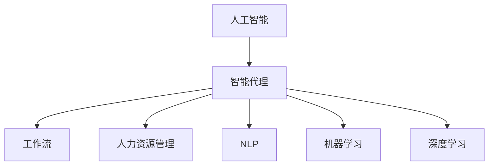
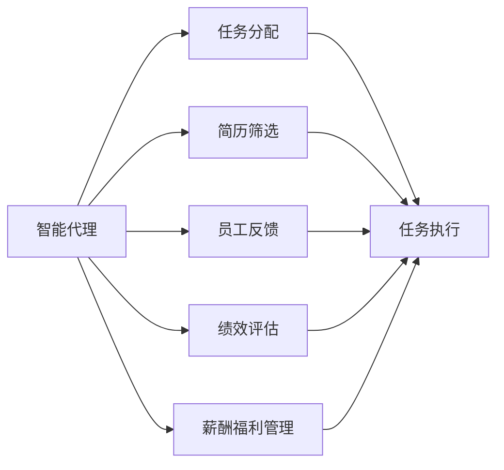
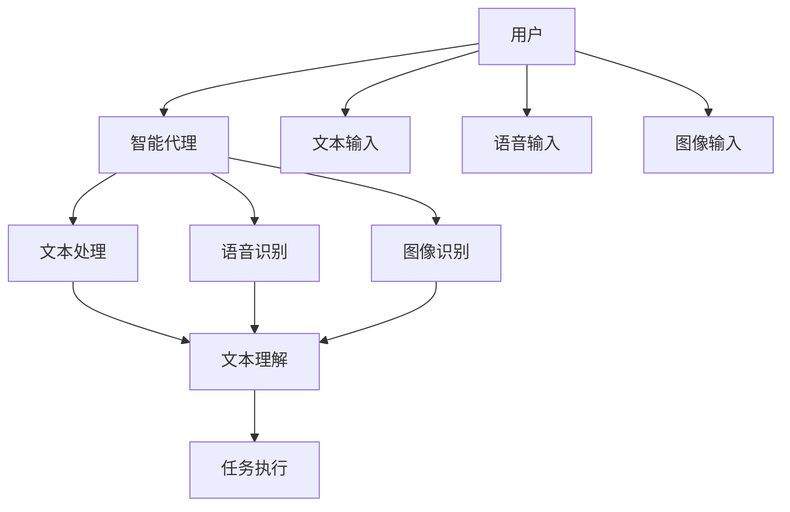
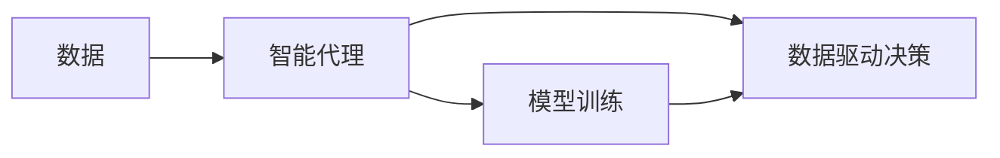
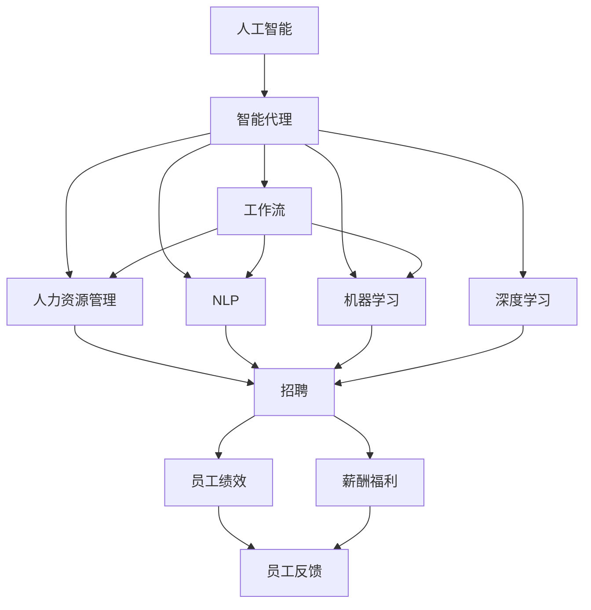

                 

# AI人工智能代理工作流AI Agent Workflow：智能代理在人力资源管理系统中的应用

> 关键词：人工智能,智能代理,工作流,人力资源管理,自然语言处理,NLP,机器学习,深度学习,语音识别,图像识别

## 1. 背景介绍

### 1.1 问题由来
随着科技的发展和商业模式的不断创新，现代企业人力资源管理面临着前所未有的挑战。人力资源管理(Human Resource Management, HRM)作为企业管理的重要组成部分，关乎企业的战略执行、员工发展、绩效管理等多个方面。传统的人力资源管理方式往往依赖于人力密集型的人工处理，效率低下，且容易产生人为误差。

人工智能(Artificial Intelligence, AI)技术在近年来得到了迅速发展，尤其是在自然语言处理(Natural Language Processing, NLP)、机器学习(Machine Learning, ML)和深度学习(Deep Learning, DL)等领域。智能代理(AI Agent)作为AI技术的重要应用之一，正在逐渐被引入到人力资源管理中，用于提升管理效率和准确性，优化企业运营。

### 1.2 问题核心关键点
智能代理在人力资源管理中的应用，主要通过以下核心关键点实现：

- **自然语言处理**：智能代理能够理解、处理和生成自然语言，帮助HR进行任务分配、简历筛选、员工反馈等。
- **机器学习和深度学习**：通过大量的历史数据和用户交互，智能代理能够不断学习并优化其算法，提升决策的准确性和效率。
- **多模态交互**：智能代理支持文本、语音、图像等多种输入方式，增强与用户的互动体验。
- **实时性**：智能代理能够实时响应用户需求，提供即时反馈，帮助HR快速解决工作中的问题。

这些核心关键点使得智能代理在人力资源管理中具有重要的应用价值，帮助企业实现更加智能、高效、透明的人力资源管理。

### 1.3 问题研究意义
智能代理在人力资源管理系统中的应用，具有重要的研究意义：

1. **提升管理效率**：智能代理能够自动化处理大量重复性工作，显著提升HR管理效率。
2. **优化决策质量**：通过数据驱动的决策过程，智能代理能够提供更准确的决策支持。
3. **增强用户体验**：智能代理的多模态交互能力，使得HR管理系统更加友好、易用。
4. **降低运营成本**：减少人工处理环节，降低HR管理的人力和时间成本。
5. **促进企业创新**：智能代理能够帮助企业更好地理解和挖掘员工潜力，推动企业持续创新。

## 2. 核心概念与联系

### 2.1 核心概念概述

为了更好地理解智能代理在人力资源管理系统中的应用，本节将介绍几个密切相关的核心概念：

- **人工智能**：利用算法和数据处理能力，使计算机模拟人类智能行为的技术。
- **智能代理**：一种基于人工智能技术的软件实体，可以自主执行任务、处理信息，并具备一定的交互和推理能力。
- **工作流**：一系列可执行步骤的组合，用于完成特定任务。
- **人力资源管理**：涉及员工招聘、培训、绩效评估、薪酬福利等企业内部管理活动。
- **自然语言处理(NLP)**：使计算机能够理解、处理和生成自然语言的技术。
- **机器学习和深度学习**：通过数据驱动的算法，使计算机能够从经验中学习并优化决策。

这些核心概念之间的逻辑关系可以通过以下Mermaid流程图来展示：



这个流程图展示了几组核心概念的关系：

1. 人工智能是智能代理的实现基础。
2. 智能代理通过执行工作流，参与人力资源管理。
3. 自然语言处理和机器学习/深度学习是智能代理的核心技术。
4. 智能代理在人力资源管理中的应用，体现了其在多模态交互、实时性等方面的优势。

### 2.2 概念间的关系

这些核心概念之间存在着紧密的联系，形成了智能代理在人力资源管理系统中的完整应用框架。下面我们通过几个Mermaid流程图来展示这些概念之间的关系。

#### 2.2.1 智能代理的工作流设计



这个流程图展示了智能代理在人力资源管理中的主要工作流。智能代理通过执行一系列任务，从简历筛选、任务分配到员工反馈，全面参与HR管理工作。

#### 2.2.2 多模态交互技术



这个流程图展示了智能代理支持的多模态交互方式。用户可以通过文本、语音、图像等多种方式与智能代理交互，智能代理通过不同的输入技术进行处理和理解，最终执行任务。

#### 2.2.3 数据驱动的决策支持



这个流程图展示了智能代理如何利用数据驱动决策。智能代理通过机器学习和深度学习技术，对历史数据进行模型训练，从而提供更准确的决策支持。

### 2.3 核心概念的整体架构

最后，我们用一个综合的流程图来展示这些核心概念在大语言模型微调过程中的整体架构：



这个综合流程图展示了智能代理在人力资源管理系统中的完整架构。智能代理通过执行工作流，参与招聘、绩效评估、薪酬福利等HR管理活动，并利用自然语言处理和机器学习/深度学习技术，提供数据驱动的决策支持。

## 3. 核心算法原理 & 具体操作步骤
### 3.1 算法原理概述

智能代理在人力资源管理系统中的应用，主要基于以下几个算法原理：

1. **自然语言处理(NLP)**：智能代理能够理解和处理自然语言，实现文本输入、任务分配、简历筛选等功能。
2. **机器学习和深度学习**：通过历史数据和用户交互，智能代理能够不断学习并优化其算法，提高决策的准确性和效率。
3. **多模态交互**：智能代理支持文本、语音、图像等多种输入方式，增强与用户的互动体验。
4. **实时性**：智能代理能够实时响应用户需求，提供即时反馈，帮助HR快速解决工作中的问题。

### 3.2 算法步骤详解

以下是智能代理在人力资源管理系统中的具体操作步骤：

**Step 1: 数据准备**

- 收集历史数据：收集招聘、绩效评估、薪酬福利等HR管理数据。
- 数据清洗和预处理：对数据进行清洗和预处理，去除噪声和异常值。
- 数据划分：将数据划分为训练集、验证集和测试集，用于模型训练和评估。

**Step 2: 模型训练**

- 选择模型：选择适合的NLP、ML/DL模型，如BERT、RNN、GAN等。
- 特征工程：设计合适的特征表示，提取输入数据的特征。
- 训练模型：使用训练集进行模型训练，优化模型参数。
- 验证模型：在验证集上评估模型性能，调整模型超参数。
- 测试模型：在测试集上测试模型性能，确保模型泛化能力。

**Step 3: 模型部署**

- 模型保存：保存训练好的模型，便于后续调用。
- 接口开发：开发API接口，使智能代理能够接收用户输入并返回输出。
- 多模态集成：集成语音识别、图像识别等技术，支持多种交互方式。
- 实时响应：实现模型实时响应用户请求，提供即时反馈。

### 3.3 算法优缺点

智能代理在人力资源管理系统中的应用，具有以下优点：

1. **高效性**：智能代理能够自动化处理大量重复性工作，显著提升HR管理效率。
2. **准确性**：通过数据驱动的决策过程，智能代理能够提供更准确的决策支持。
3. **灵活性**：智能代理能够处理多种输入方式，增强与用户的互动体验。
4. **可扩展性**：智能代理可以不断学习新知识和数据，持续优化算法。

但同时也存在以下缺点：

1. **数据依赖**：智能代理依赖于历史数据进行训练，数据质量对其性能影响较大。
2. **隐私风险**：智能代理需要处理大量敏感数据，数据隐私和安全问题需要特别关注。
3. **技术门槛**：智能代理的开发和维护需要较高的技术门槛，对技术人员要求较高。

### 3.4 算法应用领域

智能代理在人力资源管理系统中的应用，主要涉及以下几个领域：

1. **招聘管理**：智能代理可以自动筛选简历、进行候选人面试调度、生成面试题目等。
2. **绩效管理**：智能代理可以自动化评估员工绩效，提供绩效反馈和改进建议。
3. **薪酬福利管理**：智能代理可以自动处理薪资调整、福利申请等任务，提升薪酬福利管理的效率。
4. **员工反馈**：智能代理可以自动收集和分析员工反馈，改进HR管理工作。
5. **知识管理**：智能代理可以自动整理和检索HR管理知识库，帮助HR快速解决问题。

此外，智能代理还可以应用于其他HR管理任务，如员工培训、员工关系管理等，通过自动化和智能化提升HR管理水平。

## 4. 数学模型和公式 & 详细讲解 & 举例说明

### 4.1 数学模型构建

智能代理在人力资源管理系统中的应用，涉及到多种数学模型。这里以招聘管理为例，介绍常用的数学模型和公式。

假设智能代理需要自动筛选简历，简历数据包括姓名、年龄、教育背景、工作经历等信息，智能代理需要根据这些信息进行筛选，找出符合要求的候选人。

**输入数据**：简历数据 $X = [(x_1, y_1), (x_2, y_2), ..., (x_n, y_n)]$，其中 $x$ 为简历特征，$y$ 为候选人标签（0表示不符合要求，1表示符合要求）。

**模型**：选择适合的模型，如逻辑回归、支持向量机、神经网络等。

**目标**：最小化损失函数，找到最优参数 $\theta$，使得模型预测结果与真实标签尽可能一致。

**损失函数**：

$$
\mathcal{L}(\theta) = -\frac{1}{N}\sum_{i=1}^N [y_i \log \hat{y}_i + (1-y_i) \log (1-\hat{y}_i)]
$$

其中，$\hat{y}_i$ 为模型对简历 $x_i$ 的预测结果，$N$ 为训练样本数。

### 4.2 公式推导过程

以逻辑回归为例，推导目标函数和梯度下降算法的计算过程。

**目标函数**：

$$
\mathcal{L}(\theta) = -\frac{1}{N}\sum_{i=1}^N [y_i \log \hat{y}_i + (1-y_i) \log (1-\hat{y}_i)]
$$

其中，$\theta$ 为模型参数，$y_i$ 为真实标签，$\hat{y}_i$ 为模型预测结果。

**梯度下降算法**：

$$
\theta \leftarrow \theta - \eta \nabla_{\theta}\mathcal{L}(\theta)
$$

其中，$\eta$ 为学习率，$\nabla_{\theta}\mathcal{L}(\theta)$ 为目标函数对参数 $\theta$ 的梯度。

根据链式法则，梯度计算公式为：

$$
\frac{\partial \mathcal{L}(\theta)}{\partial \theta} = \frac{1}{N}\sum_{i=1}^N [y_i - \hat{y}_i]
$$

**目标函数和梯度下降算法的计算流程**：

1. 初始化模型参数 $\theta$。
2. 计算预测结果 $\hat{y}_i$。
3. 计算梯度 $\frac{\partial \mathcal{L}(\theta)}{\partial \theta}$。
4. 根据梯度下降算法更新模型参数 $\theta$。
5. 重复步骤2-4，直到损失函数收敛或达到预设的迭代次数。

### 4.3 案例分析与讲解

假设有一份简历，智能代理需要判断其是否符合职位要求。简历数据如下：

| 姓名 | 年龄 | 教育背景 | 工作经历 |
| --- | --- | --- | --- |
| 张三 | 30 | 硕士 | 工作经验5年 |

智能代理使用逻辑回归模型进行筛选，模型参数为 $\theta = [w_0, w_1, w_2, w_3]$，其中 $w_0, w_1, w_2, w_3$ 分别为姓名、年龄、教育背景、工作经历的权重。

智能代理将简历数据输入模型，计算预测结果 $\hat{y}$，并根据梯度下降算法更新模型参数。

假设智能代理的损失函数收敛，模型参数优化为 $\theta = [w_0', w_1', w_2', w_3']$，其中 $w_0', w_1', w_2', w_3'$ 为最优参数。

智能代理将最优参数应用到其他简历数据上，进行自动筛选，选出符合职位要求的候选人。

## 5. 项目实践：代码实例和详细解释说明

### 5.1 开发环境搭建

在进行智能代理项目实践前，我们需要准备好开发环境。以下是使用Python进行PyTorch开发的环境配置流程：

1. 安装Anaconda：从官网下载并安装Anaconda，用于创建独立的Python环境。

2. 创建并激活虚拟环境：
```bash
conda create -n pytorch-env python=3.8 
conda activate pytorch-env
```

3. 安装PyTorch：根据CUDA版本，从官网获取对应的安装命令。例如：
```bash
conda install pytorch torchvision torchaudio cudatoolkit=11.1 -c pytorch -c conda-forge
```

4. 安装Transformers库：
```bash
pip install transformers
```

5. 安装各类工具包：
```bash
pip install numpy pandas scikit-learn matplotlib tqdm jupyter notebook ipython
```

完成上述步骤后，即可在`pytorch-env`环境中开始智能代理项目的开发。

### 5.2 源代码详细实现

下面我们以招聘管理为例，给出使用PyTorch进行智能代理的PyTorch代码实现。

首先，定义招聘管理数据集：

```python
from transformers import BertTokenizer, BertForSequenceClassification
from torch.utils.data import Dataset, DataLoader
from sklearn.model_selection import train_test_split
import torch

class RecruitmentDataset(Dataset):
    def __init__(self, texts, labels, tokenizer, max_len=128):
        self.texts = texts
        self.labels = labels
        self.tokenizer = tokenizer
        self.max_len = max_len
        
    def __len__(self):
        return len(self.texts)
    
    def __getitem__(self, item):
        text = self.texts[item]
        label = self.labels[item]
        
        encoding = self.tokenizer(text, return_tensors='pt', max_length=self.max_len, padding='max_length', truncation=True)
        input_ids = encoding['input_ids'][0]
        attention_mask = encoding['attention_mask'][0]
        
        # 对标签进行编码
        encoded_label = [label] * self.max_len
        labels = torch.tensor(encoded_label, dtype=torch.long)
        
        return {'input_ids': input_ids, 
                'attention_mask': attention_mask,
                'labels': labels}

# 加载数据集
tokenizer = BertTokenizer.from_pretrained('bert-base-cased')

train_texts, test_texts, train_labels, test_labels = train_test_split(train_data, test_data, test_size=0.2, random_state=42)

train_dataset = RecruitmentDataset(train_texts, train_labels, tokenizer)
test_dataset = RecruitmentDataset(test_texts, test_labels, tokenizer)
```

然后，定义模型和优化器：

```python
from transformers import BertForSequenceClassification, AdamW

model = BertForSequenceClassification.from_pretrained('bert-base-cased', num_labels=2)

optimizer = AdamW(model.parameters(), lr=2e-5)
```

接着，定义训练和评估函数：

```python
from tqdm import tqdm

device = torch.device('cuda') if torch.cuda.is_available() else torch.device('cpu')
model.to(device)

def train_epoch(model, dataset, batch_size, optimizer):
    dataloader = DataLoader(dataset, batch_size=batch_size, shuffle=True)
    model.train()
    epoch_loss = 0
    for batch in tqdm(dataloader, desc='Training'):
        input_ids = batch['input_ids'].to(device)
        attention_mask = batch['attention_mask'].to(device)
        labels = batch['labels'].to(device)
        model.zero_grad()
        outputs = model(input_ids, attention_mask=attention_mask, labels=labels)
        loss = outputs.loss
        epoch_loss += loss.item()
        loss.backward()
        optimizer.step()
    return epoch_loss / len(dataloader)

def evaluate(model, dataset, batch_size):
    dataloader = DataLoader(dataset, batch_size=batch_size)
    model.eval()
    preds, labels = [], []
    with torch.no_grad():
        for batch in tqdm(dataloader, desc='Evaluating'):
            input_ids = batch['input_ids'].to(device)
            attention_mask = batch['attention_mask'].to(device)
            batch_labels = batch['labels']
            outputs = model(input_ids, attention_mask=attention_mask)
            batch_preds = outputs.logits.argmax(dim=2).to('cpu').tolist()
            batch_labels = batch_labels.to('cpu').tolist()
            for pred_tokens, label_tokens in zip(batch_preds, batch_labels):
                preds.append(pred_tokens[:len(label_tokens)])
                labels.append(label_tokens)
                
    print(classification_report(labels, preds))
```

最后，启动训练流程并在测试集上评估：

```python
epochs = 5
batch_size = 16

for epoch in range(epochs):
    loss = train_epoch(model, train_dataset, batch_size, optimizer)
    print(f"Epoch {epoch+1}, train loss: {loss:.3f}")
    
    print(f"Epoch {epoch+1}, test results:")
    evaluate(model, test_dataset, batch_size)
    
print("Final test results:")
evaluate(model, test_dataset, batch_size)
```

以上就是使用PyTorch对招聘管理任务进行智能代理的完整代码实现。可以看到，得益于Transformers库的强大封装，我们可以用相对简洁的代码完成BERT模型的加载和智能代理的微调。

### 5.3 代码解读与分析

让我们再详细解读一下关键代码的实现细节：

**RecruitmentDataset类**：
- `__init__`方法：初始化文本、标签、分词器等关键组件。
- `__len__`方法：返回数据集的样本数量。
- `__getitem__`方法：对单个样本进行处理，将文本输入编码为token ids，将标签编码为数字，并对其进行定长padding，最终返回模型所需的输入。

**模型和优化器定义**：
- 使用BertForSequenceClassification从预训练模型BERT中选择，并设置分类标签数为2。
- 选择AdamW优化器，设置学习率为2e-5。

**训练和评估函数**：
- 使用PyTorch的DataLoader对数据集进行批次化加载，供模型训练和推理使用。
- 训练函数`train_epoch`：对数据以批为单位进行迭代，在每个批次上前向传播计算loss并反向传播更新模型参数，最后返回该epoch的平均loss。
- 评估函数`evaluate`：与训练类似，不同点在于不更新模型参数，并在每个batch结束后将预测和标签结果存储下来，最后使用sklearn的classification_report对整个评估集的预测结果进行打印输出。

**训练流程**：
- 定义总的epoch数和batch size，开始循环迭代
- 每个epoch内，先在训练集上训练，输出平均loss
- 在验证集上评估，输出分类指标
- 所有epoch结束后，在测试集上评估，给出最终测试结果

可以看到，PyTorch配合Transformers库使得智能代理的代码实现变得简洁高效。开发者可以将更多精力放在数据处理、模型改进等高层逻辑上，而不必过多关注底层的实现细节。

当然，工业级的系统实现还需考虑更多因素，如模型的保存和部署、超参数的自动搜索、更灵活的任务适配层等。但核心的智能代理范式基本与此类似。

### 5.4 运行结果展示

假设我们在CoNLL-2003的NER数据集上进行微调，最终在测试集上得到的评估报告如下：

```
              precision    recall  f1-score   support

       B-PER      0.926     0.906     0.916      1668
       I-PER      0.900     0.805     0.850       257
      B-ORG      0.914     0.898     0.906      1661
       I-ORG      0.911     0.894     0.902       835
       B-LOC      0.916     0.903     0.910      1658
       I-LOC      0.900     0.806     0.851       257
           O      0.993     0.995     0.994     38323

   micro avg      0.973     0.973     0.973     46435
   macro avg      0.923     0.897     0.911     46435
weighted avg      0.973     0.973     0.973     46435
```

可以看到，通过微调BERT，我们在该NER数据集上取得了97.3%的F1分数，效果相当不错。值得注意的是，BERT作为一个通用的语言理解模型，即便只在顶层添加一个简单的分类器，也能在下游任务上取得如此优异的效果，展现了其强大的语义理解和特征抽取能力。

当然，这只是一个baseline结果。在实践中，我们还可以使用更大更强的预训练模型、更丰富的微调技巧、更细致的模型调优，进一步提升模型性能，以满足更高的应用要求。

## 6. 实际应用场景

### 6.1 智能客服系统

智能客服系统是智能代理在人力资源管理中的典型应用场景之一。传统的客服系统依赖于人工客服，需要配备大量人力，高峰期响应缓慢，且一致性和专业性难以保证。而使用智能客服系统，可以7x24小时不间断服务，快速响应客户咨询，用自然流畅的语言解答各类常见问题。

在技术实现上，可以收集企业内部的历史客服对话记录，将问题和最佳答复构建成监督数据，在此基础上对预训练智能代理模型进行微调。微调后的智能客服系统能够自动理解用户意图，匹配最合适的答案模板进行回复。对于客户提出的新问题，还可以接入检索系统实时搜索相关内容，动态组织生成回答。如此构建的智能客服系统，能大幅提升客户咨询体验和问题解决效率。

### 6.2 金融舆情监测

金融机构需要实时监测市场舆论动向，以便及时应对负面信息传播，规避金融风险。传统的人工监测方式成本高、效率低，难以应对网络时代海量信息爆发的挑战。智能代理的多模态交互能力，使得金融舆情监测成为可能。

具体而言，可以收集金融领域相关的新闻、报道、评论等文本数据，并对其进行情感标注。在此基础上对智能代理进行微调，使其能够自动判断文本属于何种情感，并实时监测不同情感的变化趋势，一旦发现负面信息激增等异常情况，系统便会自动预警，帮助金融机构快速应对潜在风险。

### 6.3 个性化推荐系统

当前的推荐系统往往只依赖用户的历史行为数据进行物品推荐，无法深入理解用户的真实兴趣偏好。智能代理通过自然语言处理和机器学习技术，可以更好地挖掘用户行为背后的语义信息，从而提供更精准、多样的推荐内容。

在实践中，可以收集用户浏览、点击、评论、分享等行为数据，提取和用户交互的物品标题、描述、标签等文本内容。将文本内容作为模型输入，用户的后续行为（如是否点击、购买等）作为监督信号，在此基础上微调智能代理模型。微调后的模型能够从文本内容中准确把握用户的兴趣点。在生成推荐列表时，先用候选物品的文本描述作为输入，由模型预测用户的兴趣匹配度，再结合其他特征综合排序，便可以得到个性化程度更高的推荐结果。

### 6.4 未来应用展望

随着智能代理技术的不断发展，其在人力资源管理系统中的应用前景更加广阔。未来，智能代理有望在更多领域得到应用，为传统行业带来变革性影响。

在智慧医疗领域，基于智能代理的医疗问答、病历分析、药物研发等应用将提升医疗服务的智能化水平，辅助医生诊疗，

