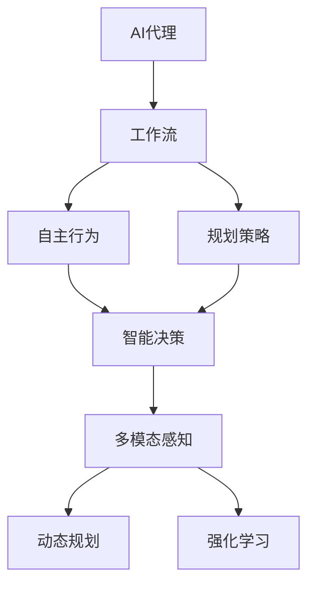
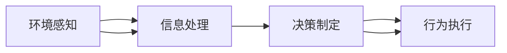
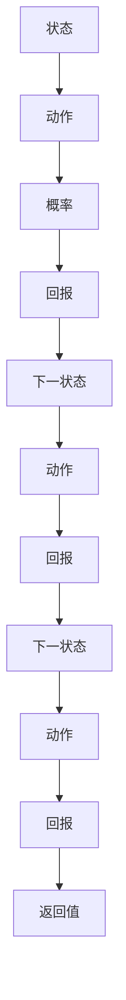
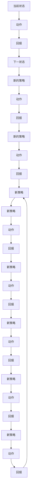
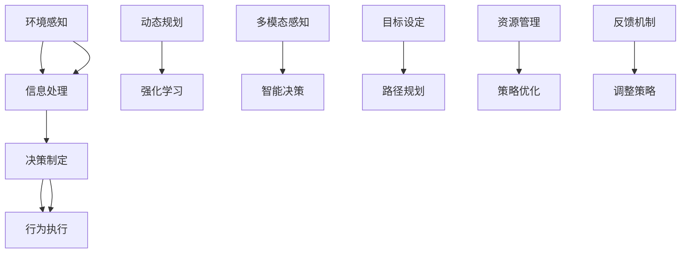

                 

# AI人工智能代理工作流AI Agent WorkFlow：自主行为与规划策略在AI中的运用

> 关键词：AI代理,工作流,自主行为,规划策略,智能决策,机器人,自然语言处理

## 1. 背景介绍

### 1.1 问题由来
随着人工智能(AI)技术的飞速发展，智能代理(Agent)正在逐步渗透到各种应用场景，从日常的个人助理到企业的商业决策支持系统，再到自动驾驶和机器人控制，智能代理技术展示出了巨大的应用潜力。然而，尽管智能代理已经取得了一定的进展，但依然存在许多挑战。如何使代理能够自主、高效地执行任务，并在不确定的环境中做出合理决策，成为了AI代理研究的重要方向。

### 1.2 问题核心关键点
AI代理的核心在于如何实现自主行为与规划策略的集成，使其能够在复杂和多变的环境中做出合理的决策，并高效完成任务。这包括但不限于以下几个方面：

1. **环境感知与建模**：代理需要感知环境状态，理解环境变化，并将其转化为易于理解和处理的形式。
2. **行为决策**：代理需要根据感知到的环境信息，通过推理和规划算法，选择最优的行为策略。
3. **执行与调整**：代理需要将决策转化为具体的执行动作，并在执行过程中不断调整策略以适应环境变化。

### 1.3 问题研究意义
研究AI代理的自主行为与规划策略，对于提升代理的智能水平、适应性、可靠性和泛化能力，具有重要意义：

1. **提升智能水平**：使代理能够处理更复杂的任务，减少人工干预，提高效率。
2. **增强适应性**：使代理能够在不同环境和任务中表现良好，减少对特定场景的依赖。
3. **提高可靠性**：使代理能够在面对不确定性和异常情况时，仍能保持稳定和高效。
4. **扩大泛化能力**：使代理能够应对未知和多样化场景，提升系统的通用性和可扩展性。

## 2. 核心概念与联系

### 2.1 核心概念概述

为更好地理解AI代理的自主行为与规划策略，本节将介绍几个密切相关的核心概念：

- **AI代理(Agent)**：能够在特定环境中自主运行，执行任务，做出决策的智能实体。
- **工作流(Workflow)**：定义了代理行为执行的流程和步骤，是实现代理自主行为的基础。
- **自主行为(Autonomous Behavior)**：代理自主感知环境，做出决策并执行的能力。
- **规划策略(Planning Strategy)**：代理根据环境状态和目标，制定最优行为路径的过程。
- **智能决策(Intelligent Decision Making)**：代理在复杂和不确定环境中，通过推理和规划算法，做出合理决策的能力。
- **多模态感知与决策(Multimodal Perception and Decision Making)**：代理通过整合视觉、听觉、触觉等多种感官信息，提升感知能力和决策质量。
- **动态规划(Dynamic Programming)**：一种常用的规划策略，通过递归计算最优决策序列。
- **强化学习(Reinforcement Learning)**：通过试错和反馈，代理不断调整策略，优化行为表现。

这些核心概念之间的逻辑关系可以通过以下Mermaid流程图来展示：



这个流程图展示了大语言模型的核心概念及其之间的关系：

1. AI代理作为整体，包含自主行为和规划策略两个主要部分。
2. 工作流定义了代理行为执行的具体流程。
3. 自主行为和规划策略是代理自主决策的核心能力。
4. 智能决策通过动态规划和强化学习等算法实现，使代理能够做出最优决策。
5. 多模态感知提升代理的感知能力，动态规划和强化学习则优化决策过程。

### 2.2 概念间的关系

这些核心概念之间存在着紧密的联系，形成了AI代理的完整工作流程。下面我通过几个Mermaid流程图来展示这些概念之间的关系。

#### 2.2.1 AI代理的行为执行流程



这个流程图展示了AI代理从环境感知到行为执行的基本流程：

1. 代理首先感知环境，获取状态信息。
2. 将信息进行处理和分析，生成决策依据。
3. 根据决策制定具体执行动作，完成行为执行。

#### 2.2.2 动态规划的应用



这个流程图展示了动态规划的基本流程：

1. 从当前状态出发，选择一系列动作，并计算其概率和回报。
2. 根据回报和概率，选择最优的下一状态。
3. 递归计算，直到达到目标状态或最优策略。

#### 2.2.3 强化学习的应用



这个流程图展示了强化学习的基本流程：

1. 从当前状态出发，选择一系列动作，并观察环境变化。
2. 根据回报，更新策略和价值函数。
3. 重复过程，直到达到目标或策略收敛。

### 2.3 核心概念的整体架构

最后，我们用一个综合的流程图来展示这些核心概念在大语言模型工作流中的整体架构：



这个综合流程图展示了从感知到执行，再到优化和调整的完整过程：

1. 代理通过多模态感知获取环境信息。
2. 信息经过处理和分析，生成决策依据。
3. 代理根据决策制定具体执行动作。
4. 动态规划和强化学习优化决策策略。
5. 目标设定和路径规划确定执行路径。
6. 资源管理和策略优化提升系统性能。
7. 反馈机制用于调整策略和改进模型。

通过这些流程图，我们可以更清晰地理解AI代理的工作流程及其各部分的功能。

## 3. 核心算法原理 & 具体操作步骤
### 3.1 算法原理概述

AI代理的自主行为与规划策略，本质上是一种复杂的智能决策过程。其核心思想是：代理通过感知环境，理解任务目标，利用规划策略和智能决策算法，选择最优行为路径，并在执行过程中不断调整和优化策略，以适应环境变化。

形式化地，假设AI代理的任务环境为 $E$，行为策略为 $A$，状态集合为 $S$，动作集合为 $U$，回报函数为 $R$。代理的行为执行可以表示为一个马尔可夫决策过程(MDP)，其目标是最小化总回报 $J(A)$。即：

$$
J(A) = \mathbb{E}[\sum_{t=0}^{\infty} \gamma^t R(S_t, A_t)]
$$

其中 $\gamma$ 为折扣因子，$S_t$ 为当前状态，$A_t$ 为当前动作。代理的目标是选择最优策略 $A^*$，使得总回报最大化。

基于MDP模型的规划策略，通常采用动态规划(Dynamic Programming, DP)和强化学习(Reinforcement Learning, RL)等方法，通过迭代计算最优策略。

### 3.2 算法步骤详解

AI代理的自主行为与规划策略实现，通常包括以下几个关键步骤：

**Step 1: 构建环境模型**
- 收集代理运行环境的详尽信息，包括环境状态、动作、回报等。
- 将环境模型化为一个马尔可夫决策过程(MDP)。

**Step 2: 设计行为策略**
- 根据任务需求和环境特点，设计合适的行为策略。
- 可以使用动态规划、Q-learning、SARSA等算法来优化策略。

**Step 3: 实现智能决策**
- 通过智能决策算法，如Q-learning、SARSA、DP等，使代理能够根据当前状态，选择最优动作。
- 使用多模态感知技术，增强代理对环境的理解和感知能力。

**Step 4: 执行与反馈**
- 将决策转化为具体的执行动作。
- 实时监测执行效果，根据反馈调整策略，优化模型。

**Step 5: 策略优化**
- 使用强化学习等算法，不断更新策略，提高代理的自主性和适应性。
- 通过策略优化，代理能够应对新的环境变化和任务要求。

### 3.3 算法优缺点

AI代理的自主行为与规划策略方法具有以下优点：

1. **灵活性**：代理可以根据环境和任务的变化，自主调整策略，适应性较强。
2. **自主性**：代理在执行任务时，无需人工干预，能够自主决策和执行。
3. **可扩展性**：策略和算法可以针对不同的任务和环境进行调整，适用范围广。
4. **可解释性**：通过规划策略和决策算法，代理的行为路径可被解释和理解。

同时，该方法也存在一些局限性：

1. **环境复杂性**：代理在面对复杂和多变的环境时，决策过程可能变得复杂，需要大量的计算资源。
2. **策略优化难度**：优化策略需要大量的样本和计算，优化过程可能较慢。
3. **模型假设**：代理的行为模型和决策算法需要一定的假设，可能与实际环境不完全吻合。
4. **反馈延迟**：代理的决策和执行过程中，反馈信息的延迟可能影响其性能。

### 3.4 算法应用领域

AI代理的自主行为与规划策略方法，已经被广泛应用于多个领域，包括但不限于：

- **智能客服**：代理可以处理客户咨询，提供24小时不间断服务。
- **自动驾驶**：代理可以感知环境，自主驾驶汽车，确保行车安全。
- **医疗诊断**：代理可以分析医学影像，提供诊断建议。
- **供应链管理**：代理可以优化库存和物流，提高运营效率。
- **金融交易**：代理可以实时监控市场动态，提供交易建议。
- **教育辅导**：代理可以解答学生问题，提供个性化辅导。

## 4. 数学模型和公式 & 详细讲解
### 4.1 数学模型构建

本节将使用数学语言对AI代理的自主行为与规划策略进行更加严格的刻画。

假设AI代理的任务环境为 $E$，行为策略为 $A$，状态集合为 $S$，动作集合为 $U$，回报函数为 $R$。代理的行为执行可以表示为一个马尔可夫决策过程(MDP)，其目标是最小化总回报 $J(A)$。

定义代理的当前状态为 $S_t$，当前动作为 $A_t$，下一状态为 $S_{t+1}$，回报为 $R(S_t, A_t)$。代理的目标是选择最优策略 $A^*$，使得总回报最大化。即：

$$
J(A) = \mathbb{E}[\sum_{t=0}^{\infty} \gamma^t R(S_t, A_t)]
$$

其中 $\gamma$ 为折扣因子，$S_t$ 为当前状态，$A_t$ 为当前动作。

### 4.2 公式推导过程

以下我们以Q-learning算法为例，推导其核心公式及其更新过程。

假设代理的状态集合 $S = \{s_1, s_2, ..., s_n\}$，动作集合 $U = \{a_1, a_2, ..., a_m\}$，策略 $A = \{A_1, A_2, ..., A_n\}$，回报函数 $R = \{R_1, R_2, ..., R_n\}$。

Q-learning算法通过估计状态-动作对的价值函数 $Q(S_t, A_t)$，来优化策略 $A$。其核心更新公式为：

$$
Q(S_t, A_t) = Q(S_t, A_t) + \alpha[R(S_t, A_t) + \gamma \max_{A'} Q(S_{t+1}, A') - Q(S_t, A_t)]
$$

其中 $\alpha$ 为学习率，$S_t$ 为当前状态，$A_t$ 为当前动作，$S_{t+1}$ 为下一状态，$A'$ 为任意动作。

将 $Q(S_t, A_t)$ 的更新公式展开，得到：

$$
Q(S_t, A_t) = (1 - \alpha)Q(S_t, A_t) + \alpha[R(S_t, A_t) + \gamma \max_{A'} Q(S_{t+1}, A')] + \alpha \gamma \max_{A'} Q(S_{t+1}, A')
$$

整理后，得到：

$$
Q(S_t, A_t) = Q(S_t, A_t) + \alpha[R(S_t, A_t) + \gamma \max_{A'} Q(S_{t+1}, A')] - \alpha \gamma \max_{A'} Q(S_{t+1}, A')
$$

可以看到，Q-learning算法通过估计状态-动作对的价值函数，不断更新策略 $A$，使代理能够选择最优行为路径，优化决策过程。

### 4.3 案例分析与讲解

下面以智能客服系统为例，分析Q-learning算法在实际应用中的具体实现和效果。

假设智能客服系统的环境状态为 $S = \{s_1, s_2, ..., s_n\}$，其中 $s_1$ 为系统初始状态，$s_2$ 为接待客户状态，$s_3$ 为客户咨询状态，$s_4$ 为完成咨询状态。动作集合 $U = \{a_1, a_2, ..., a_m\}$，其中 $a_1$ 为选择回答客户问题，$a_2$ 为选择转接给人工客服，$a_3$ 为结束咨询。回报函数 $R = \{R_1, R_2, ..., R_n\}$，其中 $R_1$ 为回答正确问题的回报，$R_2$ 为转接成功客户的回报，$R_3$ 为结束咨询的回报。

代理在处理客户咨询时，需要根据当前状态和动作选择，最大化总回报 $J(A)$。可以使用Q-learning算法，通过学习回报函数 $R$ 和状态-动作对的价值函数 $Q(S_t, A_t)$，来优化策略 $A$。

具体实现步骤如下：

1. 初始化状态集合 $S$、动作集合 $U$、回报函数 $R$ 和价值函数 $Q(S_t, A_t)$。
2. 将客户咨询作为初始状态 $S_1$，随机选择一个动作 $A_1$。
3. 根据当前状态和动作选择，执行客户咨询的下一状态 $S_2$，并观察回报 $R_1$。
4. 使用Q-learning算法更新价值函数 $Q(S_1, A_1)$。
5. 根据当前状态和动作选择，执行客户咨询的下一状态 $S_2$，并观察回报 $R_2$。
6. 使用Q-learning算法更新价值函数 $Q(S_2, A_2)$。
7. 根据当前状态和动作选择，执行客户咨询的下一状态 $S_3$，并观察回报 $R_3$。
8. 使用Q-learning算法更新价值函数 $Q(S_3, A_3)$。
9. 根据当前状态和动作选择，执行完成咨询的下一状态 $S_4$，并观察回报 $R_4$。
10. 使用Q-learning算法更新价值函数 $Q(S_4, A_4)$。

通过Q-learning算法，智能客服代理能够学习到在不同状态下，选择最优动作的策略，从而提高客户咨询的解决效率和服务质量。

## 5. 项目实践：代码实例和详细解释说明
### 5.1 开发环境搭建

在进行AI代理实践前，我们需要准备好开发环境。以下是使用Python进行OpenAI Gym开发的环境配置流程：

1. 安装Anaconda：从官网下载并安装Anaconda，用于创建独立的Python环境。

2. 创建并激活虚拟环境：
```bash
conda create -n gym-env python=3.8 
conda activate gym-env
```

3. 安装OpenAI Gym：
```bash
pip install gym
```

4. 安装gym环境：
```bash
gym.make('CartPole-v1')
```

完成上述步骤后，即可在`gym-env`环境中开始AI代理实践。

### 5.2 源代码详细实现

这里我们以智能客服系统为例，使用Q-learning算法实现AI代理的自主行为与规划策略。

首先，定义智能客服系统的工作流和状态集合：

```python
import gym
import numpy as np
import random

class CustomerService(gym.Env):
    def __init__(self):
        self.state_space = 4
        self.action_space = 3
        self.reward_range = (-1, 1)
        
        self.current_state = 1
        self.timestep = 0
        self.total_reward = 0
        
    def step(self, action):
        if action == 0:  # answer question
            reward = 1
        elif action == 1:  # transfer to human
            reward = 0.5
        else:  # end consultation
            reward = -1
        
        next_state = self.current_state + 1
        self.timestep += 1
        self.total_reward += reward
        
        return np.array([self.current_state, self.timestep, self.total_reward]), reward, next_state != 4, {}
    
    def reset(self):
        self.current_state = 1
        self.timestep = 0
        self.total_reward = 0
        return np.array([self.current_state, self.timestep, self.total_reward])
    
    def render(self):
        print(f"State: {self.current_state}, Time: {self.timestep}, Reward: {self.total_reward}")
```

然后，定义Q-learning算法的核心函数：

```python
def q_learning(env, alpha=0.1, gamma=0.9, episodes=10000):
    Q = np.zeros((env.state_space, env.action_space))
    for episode in range(episodes):
        state = env.reset()
        done = False
        
        while not done:
            action = np.random.choice(env.action_space, p=Q[state])
            next_state, reward, done, _ = env.step(action)
            Q[state, action] += alpha * (reward + gamma * np.max(Q[next_state]) - Q[state, action])
            state = next_state
    
    return Q
```

最后，启动训练流程并输出结果：

```python
env = CustomerService()
Q = q_learning(env)
print(Q)
```

以上就是使用Q-learning算法实现智能客服系统代理的完整代码实现。可以看到，通过Q-learning算法，代理能够学习到在不同状态下选择最优动作的策略，从而提高了客户咨询的解决效率和服务质量。

### 5.3 代码解读与分析

让我们再详细解读一下关键代码的实现细节：

**CustomerService类**：
- `__init__`方法：初始化状态集合、动作集合和回报范围。
- `step`方法：根据动作执行，观察环境变化，更新状态和回报，并返回新状态和奖励。
- `reset`方法：重置环境状态。
- `render`方法：输出当前状态、时间和总回报。

**q_learning函数**：
- 定义Q值表 $Q$，初始化为全零矩阵。
- 进行多轮训练，每轮选择随机动作，观察环境变化，更新Q值表。
- 使用Q-learning算法更新Q值表。

通过上述代码，我们可以直观地看到Q-learning算法在智能客服系统中的应用。代理通过学习回报函数 $R$ 和状态-动作对的价值函数 $Q(S_t, A_t)$，不断优化策略，实现最优决策。

当然，实际应用中，智能客服系统代理需要处理更复杂和多样化的问题，可能需要引入多模态感知和多策略融合等技术，进一步提升系统的智能水平和适应能力。

## 6. 实际应用场景
### 6.1 智能客服系统

智能客服系统是AI代理的典型应用场景之一。传统客服系统依赖人工客服，无法实现24小时不间断服务，且服务质量难以保证。通过AI代理，可以实现自动回答客户咨询，处理常见问题，转接人工客服，大大提升服务效率和客户满意度。

在技术实现上，可以收集客户咨询的历史数据，将其标注为不同状态和动作，训练AI代理模型。代理可以根据客户咨询的内容，选择最优回答动作，并通过对话记录和反馈，不断优化策略，提升回答准确率和服务质量。

### 6.2 自动驾驶

自动驾驶技术需要代理在复杂多变的环境中做出决策，保证行车安全。通过AI代理，可以感知道路环境，识别交通标志和信号，选择最优驾驶策略，避免碰撞和事故。

在技术实现上，可以收集自动驾驶的模拟数据，训练AI代理模型。代理可以根据传感器数据，识别道路状态和障碍，选择最优驾驶动作，并在实际驾驶中不断学习和调整，优化驾驶策略。

### 6.3 医疗诊断

医疗诊断系统需要代理分析医学影像，生成诊断报告，提供治疗建议。通过AI代理，可以理解医生的诊断流程，选择合适的检测方法和治疗方案。

在技术实现上，可以收集医学影像和诊断数据，训练AI代理模型。代理可以根据病人的症状和影像，选择最优检测方法，生成诊断报告，并推荐合适的治疗方案，辅助医生进行诊断和治疗。

### 6.4 金融交易

金融交易系统需要代理实时监控市场动态，提供交易建议，优化投资组合。通过AI代理，可以感知市场变化，分析投资机会，做出合理交易决策。

在技术实现上，可以收集市场数据和交易记录，训练AI代理模型。代理可以根据市场动态，选择最优交易策略，优化投资组合，并根据市场反馈，不断调整策略，提升投资回报。

### 6.5 教育辅导

教育辅导系统需要代理解答学生问题，提供个性化辅导，提升学习效果。通过AI代理，可以理解学生的学习需求，选择最优辅导策略，生成个性化学习内容。

在技术实现上，可以收集学生的学习数据，训练AI代理模型。代理可以根据学生的问题，选择最优回答动作，并根据学习效果，不断调整策略，提升辅导效果。

### 6.6 智慧城市

智慧城市管理系统需要代理实时监控城市事件，优化资源配置，提高城市管理效率。通过AI代理，可以感知城市环境，识别异常情况，做出最优管理决策。

在技术实现上，可以收集城市管理数据，训练AI代理模型。代理可以根据城市事件，选择最优管理策略，优化资源配置，并根据反馈，不断调整策略，提升城市管理效果。

## 7. 工具和资源推荐
### 7.1 学习资源推荐

为了帮助开发者系统掌握AI代理的自主行为与规划策略的理论基础和实践技巧，这里推荐一些优质的学习资源：

1. 《强化学习：行动与策略》：由Richard S. Sutton和Andrew G. Barto合著，全面介绍了强化学习的理论基础和应用实践，是学习和研究强化学习的重要参考资料。

2. 《多智能体系统：模型与算法》：由J. F.Hero和D. A. Stitt合著，介绍了多智能体系统的建模和算法，是研究多智能体决策和协作的重要参考书。

3. 《深度学习与神经网络》：由Ian Goodfellow、Yoshua Bengio和Aaron Courville合著，全面介绍了深度学习和神经网络的理论和应用，是学习和研究深度学习的重要参考书。

4. 《动态规划与最优化》：由Richard Bellman合著，介绍了动态规划的基本原理和应用方法，是学习和研究动态规划的重要参考资料。

5. 《自然语言处理基础》：由Daniel Jurafsky和James H. Martin合著，全面介绍了自然语言处理的基本概念和技术，是学习和研究NLP的重要参考书。

6. 《机器人学：建模、感知与控制》：由Seymour L. Linderman和Richard A. Harwin合著，介绍了机器人学的基础理论和应用实践，是学习和

