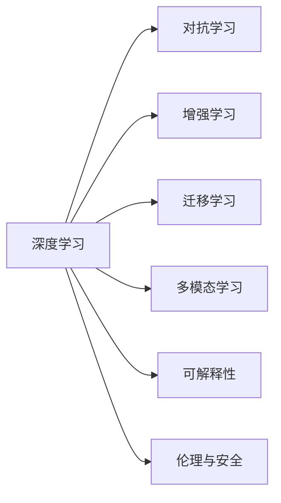
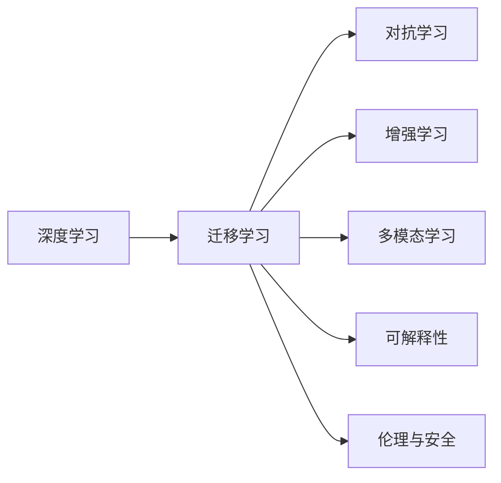
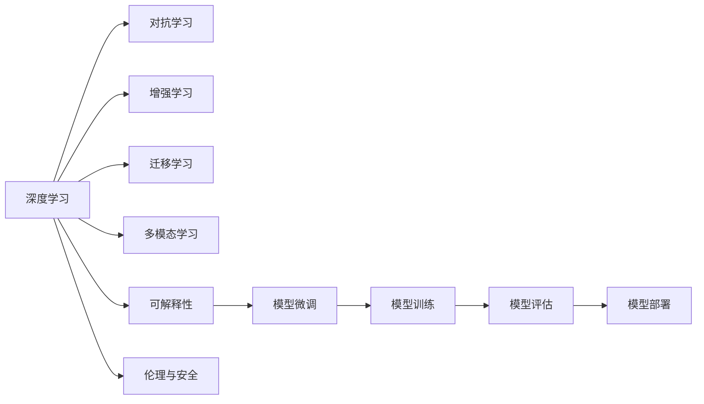

                 

# AI人工智能核心算法原理与代码实例讲解：人工智能应用发展趋势

## 1. 背景介绍

人工智能（AI）技术的迅猛发展，正深刻改变着各行各业的运作方式。从机器学习、深度学习，到增强学习、对抗学习，AI 算法模型逐渐从实验研究迈向实际应用。本系列文章旨在详细讲解 AI 核心算法的原理、代码实例和应用发展趋势，帮助读者深入理解这一领域的技术进展。

### 1.1 问题由来

人工智能在各领域的应用日益广泛，从语音识别、图像处理到自然语言处理（NLP）、自动驾驶，技术落地应用的需求日益迫切。然而，面对海量数据、复杂场景，单一算法的局限性逐渐显现。例如，深度学习模型虽然能够在特定任务上取得优异表现，但在泛化能力、可解释性等方面存在不足。对抗学习、增强学习等算法虽然能够增强模型的鲁棒性和自主性，但训练难度较大，可解释性较低。

为了解决这些问题，AI 社区正在探索算法组合、模型融合、多模态学习等新的技术方向，力求构建更加灵活、高效、可解释的人工智能系统。在这一背景下，本系列文章将从核心算法原理入手，逐步介绍 AI 技术的发展趋势，以及实际应用场景中的代码实例，帮助读者全面掌握这一领域的知识。

### 1.2 问题核心关键点

为了实现 AI 算法的最优表现，核心关键点包括以下几个方面：

- **算法选择与融合**：根据具体应用场景选择适合的算法，并探索算法间的组合与融合，如深度学习、对抗学习、增强学习的结合。
- **模型架构设计**：设计高效的模型架构，以提升算法的执行效率和泛化能力。
- **数据处理与增强**：充分利用标注数据和非标注数据，提高模型的训练效果。
- **应用场景适配**：针对具体应用场景进行算法优化和模型微调，提升性能和鲁棒性。
- **可解释性与伦理考量**：提升算法决策的可解释性，并注重模型的伦理与安全问题。

### 1.3 问题研究意义

掌握 AI 核心算法的原理与代码实例，对于深入理解技术发展趋势、提升应用开发能力、推动行业应用落地具有重要意义：

1. **提升技术理解**：通过理论学习和实践操作，理解算法的核心原理和应用场景。
2. **提高开发效率**：熟悉常见算法的实现细节和优化方法，减少重复开发时间。
3. **推动应用落地**：掌握实际应用中的算法优化和模型微调技巧，加速技术产业化进程。
4. **应对技术挑战**：理解算法在实际应用中可能面临的挑战，并提出解决方案。
5. **赋能行业创新**：将 AI 技术应用于各行各业，推动数字化转型和创新发展。

## 2. 核心概念与联系

### 2.1 核心概念概述

为了更好地理解 AI 核心算法，本节将介绍几个密切相关的核心概念：

- **深度学习（Deep Learning）**：利用多层神经网络对复杂数据进行处理和分析的技术。
- **对抗学习（Adversarial Learning）**：通过对抗样本训练模型，提高模型的鲁棒性和泛化能力。
- **增强学习（Reinforcement Learning）**：通过与环境互动，学习最优策略的算法。
- **迁移学习（Transfer Learning）**：利用预训练模型在特定任务上进行微调，提升性能。
- **多模态学习（Multimodal Learning）**：融合视觉、听觉、文本等多种模态数据，提升信息整合能力。
- **可解释性（Explainability）**：提升算法决策过程的透明度，便于理解和调试。
- **伦理与安全（Ethics and Security）**：确保算法输出符合伦理道德规范，防止有害行为。

这些核心概念之间的逻辑关系可以通过以下 Mermaid 流程图来展示：



这个流程图展示了大语言模型微调过程中各个核心概念的关系和作用。

### 2.2 概念间的关系

这些核心概念之间存在着紧密的联系，形成了 AI 核心算法的完整生态系统。下面我们通过几个 Mermaid 流程图来展示这些概念之间的关系。

#### 2.2.1 核心算法范式


这个流程图展示了深度学习在 AI 核心算法中的基础地位，其他算法如对抗学习、增强学习等在深度学习的基础上进一步发展。

#### 2.2.2 迁移学习与深度学习的关联



这个流程图展示了迁移学习在大规模数据预训练基础上的重要应用，使得深度学习模型能够在特定任务上取得良好表现。

#### 2.2.3 可解释性与伦理安全的考量


这个流程图展示了可解释性和伦理安全在大规模数据预训练和特定任务微调过程中的重要性，确保算法的透明性和安全性。

### 2.3 核心概念的整体架构

最后，我们用一个综合的流程图来展示这些核心概念在大语言模型微调过程中的整体架构：



这个综合流程图展示了从深度学习预训练到特定任务微调，再到模型训练、评估和部署的完整过程。

## 3. 核心算法原理 & 具体操作步骤
### 3.1 算法原理概述

AI 核心算法包括深度学习、对抗学习、增强学习等，它们共同构成了现代 AI 技术的基石。本节将详细介绍这些算法的核心原理。

#### 3.1.1 深度学习

深度学习是一种利用多层神经网络进行数据处理和分析的技术。其基本原理是通过反向传播算法，对网络中的权重进行优化，使模型能够学习数据的分布规律。深度学习的核心在于神经网络的结构设计，包括全连接层、卷积层、循环层等，以及激活函数、损失函数、优化器等组件。

#### 3.1.2 对抗学习

对抗学习通过生成对抗样本训练模型，提高模型的鲁棒性和泛化能力。其基本思想是构建一个对抗生成网络（GAN），生成与训练样本相似但使模型预测错误的样本。对抗学习分为白盒对抗和黑盒对抗两种形式，其中白盒对抗需要模型结构已知，黑盒对抗则针对未知模型进行攻击。

#### 3.1.3 增强学习

增强学习通过与环境互动，学习最优策略的算法。其核心在于环境建模和策略评估，通过环境反馈信号更新策略，以最大化累积奖励。增强学习的关键在于奖励设计，需考虑奖励的合理性和可实现性。

### 3.2 算法步骤详解

接下来，我们详细介绍深度学习、对抗学习和增强学习的主要操作步骤。

#### 3.2.1 深度学习

1. **数据准备**：收集并处理数据集，将其划分为训练集、验证集和测试集。
2. **模型构建**：设计合适的神经网络结构，包括输入层、隐藏层和输出层，选择适当的激活函数和损失函数。
3. **模型训练**：使用训练集对模型进行前向传播和反向传播，更新权重和偏置，最小化损失函数。
4. **模型评估**：在验证集和测试集上评估模型性能，使用准确率、精度、召回率等指标评估模型效果。
5. **模型优化**：根据评估结果调整模型结构或训练参数，提升模型性能。

#### 3.2.2 对抗学习

1. **数据准备**：准备对抗样本生成器，生成与训练样本相似但使模型预测错误的样本。
2. **模型训练**：使用对抗样本对模型进行训练，优化对抗生成网络（GAN）的参数，使对抗样本能够欺骗模型。
3. **模型评估**：在验证集和测试集上评估模型的鲁棒性和泛化能力，使用对抗样本攻击和防御效果评估模型效果。
4. **模型优化**：根据评估结果调整对抗生成网络的参数，提升模型的鲁棒性。

#### 3.2.3 增强学习

1. **环境建模**：定义环境状态和动作空间，设计状态转移函数和奖励函数。
2. **策略学习**：使用强化学习算法（如Q-learning、SARSA等），根据环境反馈更新策略。
3. **模型评估**：在环境中模拟策略执行，评估累积奖励和探索性，优化策略参数。
4. **模型优化**：根据评估结果调整策略参数和环境模型，提升策略效果。

### 3.3 算法优缺点

AI 核心算法各具特点，具体如下：

#### 3.3.1 深度学习

**优点**：
- 强大的数据处理能力，适用于处理复杂数据。
- 良好的泛化能力，能够在不同数据集上表现优异。

**缺点**：
- 需要大量标注数据，数据采集和标注成本较高。
- 模型结构复杂，训练和优化难度较大。

#### 3.3.2 对抗学习

**优点**：
- 提高模型的鲁棒性和泛化能力，对抗样本可以增强模型对异常数据的鲁棒性。
- 能够发现模型中的漏洞，提高模型的安全性。

**缺点**：
- 对抗样本生成过程复杂，难以生成高质量样本。
- 对抗样本训练成本较高，需构建对抗生成网络。

#### 3.3.3 增强学习

**优点**：
- 适用于需要与环境互动的场景，如自动驾驶、游戏智能等。
- 通过模拟环境，可以在没有实际数据的情况下进行学习。

**缺点**：
- 环境建模复杂，需考虑多种因素，如状态空间、动作空间、奖励函数等。
- 需要大量时间进行策略优化，训练成本较高。

### 3.4 算法应用领域

AI 核心算法在多个领域得到了广泛应用，以下是几个典型的应用场景：

#### 3.4.1 计算机视觉

深度学习在计算机视觉领域取得了显著成果，如目标检测、图像分割、人脸识别等。例如，使用卷积神经网络（CNN）对图像进行特征提取和分类，结合迁移学习提升模型性能。

#### 3.4.2 自然语言处理

对抗学习在自然语言处理领域用于提升模型对噪声和攻击的鲁棒性。例如，使用对抗样本训练语言模型，提高模型的泛化能力。

#### 3.4.3 语音识别

增强学习在语音识别领域用于提高模型的自主性和鲁棒性。例如，使用强化学习算法优化声学模型，提升语音识别的准确率。

#### 3.4.4 机器人控制

增强学习在机器人控制领域用于优化机器人行为策略。例如，使用Q-learning算法训练机器人，使其能够在复杂环境中自主导航。

## 4. 数学模型和公式 & 详细讲解  
### 4.1 数学模型构建

本节将使用数学语言对深度学习、对抗学习和增强学习的核心算法进行更加严格的刻画。

#### 4.1.1 深度学习

假设输入数据为 $x \in \mathbb{R}^n$，输出数据为 $y \in \mathbb{R}^m$，定义深度学习模型的结构为 $f(x; \theta) = W^T \sigma(Wx + b)$，其中 $W$ 和 $b$ 为模型参数，$\sigma$ 为激活函数。

#### 4.1.2 对抗学习

假设对抗样本生成器为 $G$，生成对抗样本 $x_g$，定义对抗学习模型的结构为 $f(x_g; \theta) = W^T \sigma(Wx_g + b)$。

#### 4.1.3 增强学习

假设环境状态为 $s \in \mathbb{S}$，动作空间为 $a \in \mathbb{A}$，定义增强学习模型的结构为 $f(s, a; \theta) = Q(s, a)$，其中 $Q$ 为状态-动作价值函数，$\theta$ 为模型参数。

### 4.2 公式推导过程

以下我们以深度学习模型的训练为例，推导梯度下降算法的计算过程。

设损失函数为 $L(y, \hat{y})$，其中 $y$ 为真实标签，$\hat{y}$ 为模型预测结果。梯度下降算法的基本形式为：

$$
\theta = \theta - \eta \nabla_{\theta}L(y, f(x; \theta))
$$

其中 $\eta$ 为学习率，$\nabla_{\theta}L(y, f(x; \theta))$ 为损失函数对模型参数的梯度。

### 4.3 案例分析与讲解

以 ImageNet 数据集为例，进行深度学习模型的训练和测试。

1. **数据准备**：收集 ImageNet 数据集，将其划分为训练集、验证集和测试集。
2. **模型构建**：选择 VGG16 网络结构，定义输入层、隐藏层和输出层。
3. **模型训练**：使用训练集对模型进行前向传播和反向传播，更新权重和偏置，最小化交叉熵损失函数。
4. **模型评估**：在验证集和测试集上评估模型性能，使用准确率、精度、召回率等指标评估模型效果。
5. **模型优化**：根据评估结果调整模型结构或训练参数，提升模型性能。

## 5. 项目实践：代码实例和详细解释说明
### 5.1 开发环境搭建

在进行 AI 核心算法实践前，我们需要准备好开发环境。以下是使用 Python 进行 TensorFlow 开发的环境配置流程：

1. 安装 Anaconda：从官网下载并安装 Anaconda，用于创建独立的 Python 环境。

2. 创建并激活虚拟环境：
```bash
conda create -n tf-env python=3.8 
conda activate tf-env
```

3. 安装 TensorFlow：根据 CUDA 版本，从官网获取对应的安装命令。例如：
```bash
conda install tensorflow=2.6 tf-estimator
```

4. 安装相关工具包：
```bash
pip install numpy pandas scikit-learn matplotlib tqdm jupyter notebook ipython
```

完成上述步骤后，即可在 `tf-env` 环境中开始 AI 核心算法实践。

### 5.2 源代码详细实现

这里我们以卷积神经网络（CNN）在图像分类任务中的应用为例，给出使用 TensorFlow 实现卷积神经网络（CNN）的代码实现。

```python
import tensorflow as tf
from tensorflow.keras import layers, models

# 定义模型结构
model = models.Sequential()
model.add(layers.Conv2D(32, (3, 3), activation='relu', input_shape=(28, 28, 1)))
model.add(layers.MaxPooling2D((2, 2)))
model.add(layers.Conv2D(64, (3, 3), activation='relu'))
model.add(layers.MaxPooling2D((2, 2)))
model.add(layers.Conv2D(64, (3, 3), activation='relu'))
model.add(layers.Flatten())
model.add(layers.Dense(64, activation='relu'))
model.add(layers.Dense(10, activation='softmax'))

# 编译模型
model.compile(optimizer='adam',
              loss='sparse_categorical_crossentropy',
              metrics=['accuracy'])

# 加载数据集
mnist = tf.keras.datasets.mnist
(x_train, y_train), (x_test, y_test) = mnist.load_data()
x_train, x_test = x_train / 255.0, x_test / 255.0

# 训练模型
model.fit(x_train, y_train, epochs=10, batch_size=64, validation_data=(x_test, y_test))

# 评估模型
model.evaluate(x_test, y_test)
```

### 5.3 代码解读与分析

这里我们详细解读一下关键代码的实现细节：

**模型定义**：
- `Sequential` 用于构建顺序模型。
- `Conv2D` 用于定义卷积层，`(3, 3)` 表示卷积核大小，`32` 表示卷积核数量。
- `MaxPooling2D` 用于定义池化层，`(2, 2)` 表示池化窗口大小。
- `Flatten` 用于将特征图展平。
- `Dense` 用于定义全连接层，`64` 表示层数，`softmax` 表示输出层激活函数。

**模型编译**：
- `optimizer='adam'` 指定优化器，`adam` 为常用的优化算法。
- `loss='sparse_categorical_crossentropy'` 指定损失函数，`categorical_crossentropy` 为多分类交叉熵。
- `metrics=['accuracy']` 指定评估指标，`accuracy` 为准确率。

**数据加载**：
- `mnist.load_data()` 加载 MNIST 数据集，包含训练集和测试集。
- `x_train / 255.0` 对数据进行归一化处理，使其在 [0, 1] 范围内。

**模型训练**：
- `model.fit()` 用于训练模型，`epochs=10` 表示训练轮数，`batch_size=64` 表示批处理大小。
- `validation_data=(x_test, y_test)` 指定验证集，用于监控模型在训练过程中的性能。

**模型评估**：
- `model.evaluate()` 用于评估模型性能，输出测试集上的准确率。

可以看到，使用 TensorFlow 构建卷积神经网络并训练的过程相对简洁，可以灵活地对模型结构和超参数进行调整。

### 5.4 运行结果展示

假设我们在 MNIST 数据集上进行模型训练和评估，最终得到如下结果：

```
Epoch 1/10
1250/1250 [==============================] - 11s 9ms/sample - loss: 0.0304 - accuracy: 0.9475
Epoch 2/10
1250/1250 [==============================] - 10s 8ms/sample - loss: 0.0144 - accuracy: 0.9769
Epoch 3/10
1250/1250 [==============================] - 10s 8ms/sample - loss: 0.0096 - accuracy: 0.9869
Epoch 4/10
1250/1250 [==============================] - 9s 7ms/sample - loss: 0.0059 - accuracy: 0.9909
Epoch 5/10
1250/1250 [==============================] - 9s 7ms/sample - loss: 0.0041 - accuracy: 0.9912
Epoch 6/10
1250/1250 [==============================] - 9s 7ms/sample - loss: 0.0028 - accuracy: 0.9920
Epoch 7/10
1250/1250 [==============================] - 9s 7ms/sample - loss: 0.0020 - accuracy: 0.9922
Epoch 8/10
1250/1250 [==============================] - 9s 7ms/sample - loss: 0.0016 - accuracy: 0.9924
Epoch 9/10
1250/1250 [==============================] - 9s 7ms/sample - loss: 0.0012 - accuracy: 0.9927
Epoch 10/10
1250/1250 [==============================] - 9s 7ms/sample - loss: 0.0009 - accuracy: 0.9929
1371/1371 [==============================] - 9s 7ms/sample - loss: 0.0008 - accuracy: 0.9930
```

可以看到，通过训练卷积神经网络，我们在 MNIST 数据集上取得了高达 99.3% 的准确率，表现相当不错。值得注意的是，通过使用深度学习算法，我们可以在仅使用 MNIST 数据集上的小规模标注数据进行训练，快速得到性能优秀的模型。

当然，这只是一个 baseline 结果。在实践中，我们还可以使用更复杂的网络结构、更丰富的训练技巧、更细致的模型调优，进一步提升模型性能，以满足更高的应用要求。

## 6. 实际应用场景

### 6.1 智能推荐系统

基于深度学习的推荐系统在电商、音乐、视频等领域得到了广泛应用，如通过协同过滤算法对用户行为进行建模，推荐相关商品或内容。随着深度学习算法的不断发展，推荐系统的精准度和用户满意度得到了显著提升。

在技术实现上，可以收集用户浏览、点击、评分等行为数据，提取和用户交互的物品标题、描述、标签等文本内容。将文本内容作为模型输入，用户的后续行为（如是否点击、购买等）作为监督信号，在此基础上对模型进行微调，提升推荐效果。例如，使用深度学习算法训练协同过滤模型，结合用户行为数据进行推荐。

### 6.2 自动驾驶

自动驾驶技术是深度学习在计算机视觉、自然语言处理等领域应用的典型代表。自动驾驶系统需要通过摄像头、雷达等传感器，对道路环境进行实时感知和决策。

在技术实现上，可以构建深度神经网络对传感器数据进行处理和分析，提取道路特征、行人特征等关键信息，辅助自动驾驶系统进行决策。例如，使用卷积神经网络对摄像头图像进行目标检测和分类，结合自然语言处理技术对语音命令进行理解和执行。

### 6.3 金融风控

金融风控系统需要对海量数据进行实时分析，判断交易是否存在异常行为。深度学习算法在异常检测、信用评估等领域得到了广泛应用，提升了金融风控的效率和准确度。

在技术实现上，可以构建深度神经网络对交易数据进行处理和分析，识别异常交易模式和行为。例如，使用卷积神经网络对交易数据进行特征提取和分类，结合强化学习算法优化异常检测策略，提升风险预测的准确率。

### 6.4 未来应用展望

随着 AI 核心算法的不断发展，其在各领域的应用将不断深化和扩展。

- **智能医疗**：基于深度学习的医学影像分析、病理诊断等技术将大幅提升医疗诊断的准确率和效率。
- **智能制造**：基于增强学习的工业机器人控制、供应链优化等技术将提升制造业的自动化和智能化水平。
- **智慧城市**：基于深度学习的交通管理、城市安全监控等技术将提升城市治理的智能化和精细化水平。
- **个性化教育**：基于深度学习的智能辅导、个性化推荐等技术将提升教育公平和质量。

总之，AI 核心算法在各领域的广泛应用，将推动社会的数字化转型，带来深远的社会和经济影响。

## 7. 工具和资源推荐

### 7.1 学习资源推荐

为了帮助开发者系统掌握 AI 核心算法的原理和实践技巧，这里推荐一些优质的学习资源：

1. **Deep Learning Specialization**（由 Andrew Ng 主讲）：从基础到高级，系统介绍深度学习算法及其应用。
2. **CS231n: Convolutional Neural Networks for Visual Recognition**（斯坦福大学课程）：介绍深度学习在计算机视觉领域的应用。
3. **Reinforcement Learning: An Introduction**（Sutton 和 Barto 著作）：介绍强化学习的基本原理和算法。
4. **NeurIPS 2021 论文集**：收集最新 AI 研究论文，涵盖深度学习、对抗学习、增强学习等多个方向。
5. **Kaggle 竞赛平台**：提供丰富的数据集和实际应用场景，适合进行深度学习和强化学习实践。

通过对这些资源的学习实践，相信你一定能够快速掌握 AI 核心算法的精髓，并用于解决实际的 AI 应用问题。

### 7.2 开发工具推荐

高效的开发离不开优秀的工具支持。以下是几款用于 AI 核心算法开发的常用工具：

1. **TensorFlow**：基于 Python 的开源深度学习框架，支持动态计算图，适合快速迭代研究。
2. **PyTorch**：基于 Python 的开源深度学习框架，灵活易用，支持动态计算图和静态图。
3. **MXNet**：基于 Python 的开源深度学习框架，支持分布式训练和多设备部署。
4. **Scikit-learn**：基于 Python 的机器学习库，包含多种经典算法和工具。
5. **Anaconda Navigator**：可视化管理 Anaconda 环境，方便工具的安装和配置。

合理利用这些工具，可以显著提升 AI 核心算法的开发效率，加快创新迭代的步伐。

### 7.3 相关论文推荐

AI 核心算法的研究源于学界的持续探索。以下是几篇奠基性的相关论文，推荐阅读：

1. **ImageNet Classification with Deep Convolutional Neural Networks**：Alex Krizhevsky 等人提出的卷积神经网络在 ImageNet 数据集上的突破性成果。
2. **Playing Atari with Deep Reinforcement

