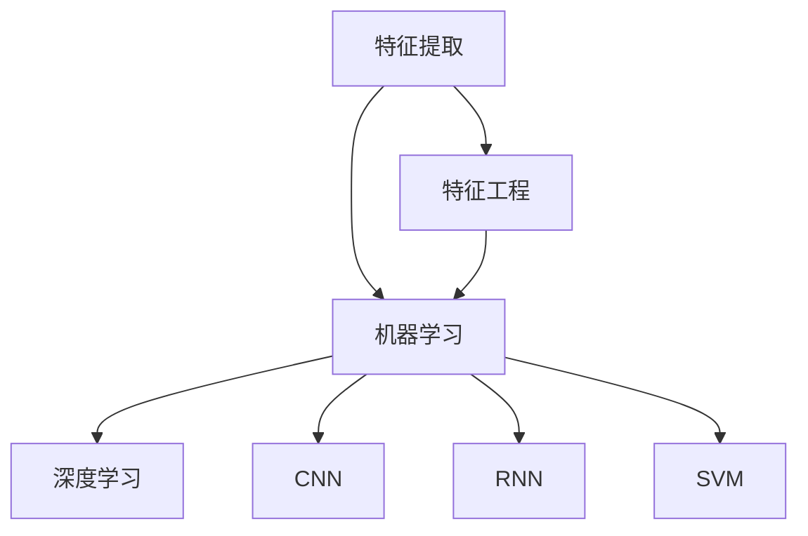
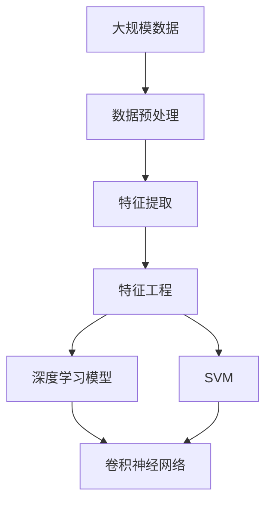

                 

# AI人工智能核心算法原理与代码实例讲解：模式识别

> 关键词：模式识别,机器学习,深度学习,特征提取,神经网络,卷积神经网络(CNN),循环神经网络(RNN),支持向量机(SVM),特征提取,特征工程,数据预处理

## 1. 背景介绍

### 1.1 问题由来

随着人工智能技术的迅猛发展，模式识别已经成为了一个非常重要的研究领域。模式识别是指通过算法和模型，从原始数据中提取有用的特征，并进行分类或回归等任务的技术。模式识别技术广泛应用于计算机视觉、语音识别、自然语言处理等领域，具有重要的实际应用价值。

### 1.2 问题核心关键点

模式识别的核心问题是如何从数据中提取有效的特征，并将其转化为机器可理解的表示。这一问题涉及特征提取、特征工程、数据预处理等多个环节，需要综合运用机器学习和深度学习的多种算法。

### 1.3 问题研究意义

模式识别技术的应用范围非常广泛，涵盖了从图像识别、语音识别到自然语言处理的众多领域。掌握模式识别技术，可以推动人工智能技术在各个垂直领域的创新应用，提升数据驱动决策的准确性和效率。

## 2. 核心概念与联系

### 2.1 核心概念概述

模式识别涉及多个核心概念，包括：

- 特征提取（Feature Extraction）：从原始数据中提取出有用的特征，是模式识别的关键步骤。
- 特征工程（Feature Engineering）：通过一系列变换和组合，将原始特征转化为机器可理解的表示。
- 机器学习（Machine Learning）：基于数据进行模型训练，并利用模型进行分类或回归等任务。
- 深度学习（Deep Learning）：使用神经网络进行特征学习和分类任务，是目前模式识别中最先进的技术。
- 卷积神经网络（Convolutional Neural Networks, CNN）：特别适用于图像识别任务，通过卷积和池化操作提取图像特征。
- 循环神经网络（Recurrent Neural Networks, RNN）：特别适用于序列数据的处理，如语音识别和自然语言处理。
- 支持向量机（Support Vector Machines, SVM）：通过将数据映射到高维空间，进行分类或回归任务。

这些核心概念之间的联系紧密，共同构成了模式识别技术的完整框架。

### 2.2 概念间的关系

这些核心概念之间的关系可以通过以下Mermaid流程图来展示：



这个流程图展示了模式识别技术的核心概念及其之间的关系：

1. 特征提取是从原始数据中提取出有用的特征。
2. 特征工程是将原始特征转化为机器可理解的表示。
3. 机器学习和深度学习是用于构建模型的两种重要方法。
4. CNN和RNN分别适用于图像和序列数据的处理。
5. SVM是一种常用的分类算法，可以应用于任意类型的数据。

### 2.3 核心概念的整体架构

最后，我们用一个综合的流程图来展示这些核心概念在大规模数据模式识别中的应用过程：



这个综合流程图展示了从数据预处理到深度学习模型的完整过程。

## 3. 核心算法原理 & 具体操作步骤

### 3.1 算法原理概述

模式识别的基本原理是通过训练模型，使其能够将输入数据映射到输出标签，从而实现分类或回归任务。具体来说，可以分为以下几个步骤：

1. 数据预处理：对原始数据进行清洗、归一化等预处理，确保数据质量。
2. 特征提取：从预处理后的数据中提取出有用的特征，作为模型的输入。
3. 特征工程：对提取出的特征进行变换和组合，得到更适合机器学习模型的表示。
4. 模型训练：使用训练数据对模型进行训练，调整模型参数，使其能够准确预测输出标签。
5. 模型评估：使用测试数据对训练好的模型进行评估，检验其泛化能力。
6. 模型应用：将训练好的模型应用于实际问题，进行分类或回归等任务。

### 3.2 算法步骤详解

以下是模式识别中常见的算法步骤：

#### 3.2.1 数据预处理

数据预处理是模式识别的重要环节，包括数据清洗、归一化、标准化等操作。

1. 数据清洗：去除噪声、缺失值等不符合要求的数据，确保数据质量。
2. 归一化：将数据缩放到一个特定的范围内，如0-1或-1到1。
3. 标准化：将数据缩放到均值为0、方差为1的分布，如z-score标准化。

#### 3.2.2 特征提取

特征提取是从原始数据中提取有用的特征，常用的方法包括：

1. 统计特征：如均值、方差、最大值、最小值等，对数据进行统计描述。
2. 时域特征：如频率、周期等，对时间序列数据进行处理。
3. 频域特征：如傅里叶变换、小波变换等，对信号进行频域分析。
4. 图像特征：如边缘检测、颜色直方图等，对图像数据进行处理。

#### 3.2.3 特征工程

特征工程是将原始特征转化为机器可理解的表示，常用的方法包括：

1. 特征选择：选择对目标任务最有用的特征，去除无关或冗余特征。
2. 特征组合：将多个原始特征进行组合，得到新的特征表示。
3. 特征变换：对特征进行变换，如对数变换、指数变换等，以提高模型的表现。
4. 特征降维：通过PCA、LDA等方法，将高维特征降维到低维空间，提高模型的效率。

#### 3.2.4 模型训练

模型训练是模式识别的核心步骤，常用的算法包括：

1. 监督学习：通过标注数据训练模型，如SVM、决策树、神经网络等。
2. 无监督学习：不依赖标注数据训练模型，如K-means聚类、DBSCAN密度聚类等。
3. 半监督学习：结合少量标注数据和大量未标注数据训练模型，如标签传播算法、半监督神经网络等。

#### 3.2.5 模型评估

模型评估是检验模型泛化能力的重要步骤，常用的方法包括：

1. 交叉验证：将数据集分为训练集和验证集，进行交叉验证，评估模型性能。
2. 测试集评估：使用测试集对模型进行评估，检验模型的泛化能力。
3. 混淆矩阵：用于评估分类模型的性能，显示真实标签和预测标签之间的匹配情况。

#### 3.2.6 模型应用

模型应用是将训练好的模型应用于实际问题，进行分类或回归等任务。

1. 分类任务：将输入数据通过模型预测为不同的类别。
2. 回归任务：将输入数据通过模型预测为连续的数值。

### 3.3 算法优缺点

模式识别中的主要算法包括：

- 监督学习：需要大量标注数据，对标注成本较高，但泛化能力较强。
- 无监督学习：不需要标注数据，对标注成本较低，但泛化能力较弱。
- 半监督学习：结合少量标注数据和大量未标注数据，兼顾标注成本和泛化能力。

这些算法各有优缺点，需要根据具体问题进行选择。

### 3.4 算法应用领域

模式识别技术广泛应用于以下领域：

1. 图像识别：如图像分类、目标检测、图像分割等。
2. 语音识别：如说话人识别、语音情感识别、语音识别等。
3. 自然语言处理：如文本分类、命名实体识别、情感分析等。
4. 医学诊断：如图像诊断、病历分析、基因分析等。
5. 金融风险评估：如信用评估、欺诈检测、市场分析等。

## 4. 数学模型和公式 & 详细讲解 & 举例说明

### 4.1 数学模型构建

模式识别的数学模型包括特征提取、特征工程、模型训练等环节。

#### 4.1.1 特征提取

常用的特征提取方法包括：

1. 统计特征：如均值、方差、最大值、最小值等。
2. 时域特征：如频率、周期等。
3. 频域特征：如傅里叶变换、小波变换等。
4. 图像特征：如边缘检测、颜色直方图等。

#### 4.1.2 特征工程

常用的特征工程方法包括：

1. 特征选择：选择对目标任务最有用的特征，去除无关或冗余特征。
2. 特征组合：将多个原始特征进行组合，得到新的特征表示。
3. 特征变换：对特征进行变换，如对数变换、指数变换等，以提高模型的表现。
4. 特征降维：通过PCA、LDA等方法，将高维特征降维到低维空间，提高模型的效率。

#### 4.1.3 模型训练

常用的模型训练方法包括：

1. 监督学习：通过标注数据训练模型，如SVM、决策树、神经网络等。
2. 无监督学习：不依赖标注数据训练模型，如K-means聚类、DBSCAN密度聚类等。
3. 半监督学习：结合少量标注数据和大量未标注数据训练模型，如标签传播算法、半监督神经网络等。

#### 4.1.4 模型评估

常用的模型评估方法包括：

1. 交叉验证：将数据集分为训练集和验证集，进行交叉验证，评估模型性能。
2. 测试集评估：使用测试集对模型进行评估，检验模型的泛化能力。
3. 混淆矩阵：用于评估分类模型的性能，显示真实标签和预测标签之间的匹配情况。

### 4.2 公式推导过程

#### 4.2.1 特征提取

常用的特征提取公式包括：

1. 均值：
   $$
   \mu = \frac{1}{N} \sum_{i=1}^{N} x_i
   $$
2. 方差：
   $$
   \sigma^2 = \frac{1}{N} \sum_{i=1}^{N} (x_i - \mu)^2
   $$
3. 最大值：
   $$
   \max_{i=1}^{N} x_i
   $$
4. 最小值：
   $$
   \min_{i=1}^{N} x_i
   $$

#### 4.2.2 特征工程

常用的特征工程公式包括：

1. 特征选择：通过计算特征的相关性和信息增益，选择最有用的特征。
2. 特征组合：通过特征组合公式，将多个特征组合成新的特征。
3. 特征变换：通过变换公式，对特征进行变换，如对数变换、指数变换等。
4. 特征降维：通过PCA、LDA等方法，将高维特征降维到低维空间。

#### 4.2.3 模型训练

常用的模型训练公式包括：

1. SVM分类器：
   $$
   \min_{w, b} \frac{1}{2} \|w\|^2 + C \sum_{i=1}^{N} \max(0, y_i (w^T \phi(x_i) + b) - 1)
   $$
2. 神经网络：
   $$
   y = f(W^T x + b)
   $$
   其中 $f$ 为激活函数，$W$ 为权重矩阵，$b$ 为偏置向量。

#### 4.2.4 模型评估

常用的模型评估公式包括：

1. 交叉验证：通过交叉验证公式，评估模型性能。
2. 测试集评估：通过测试集评估公式，检验模型的泛化能力。
3. 混淆矩阵：通过混淆矩阵公式，评估分类模型的性能。

### 4.3 案例分析与讲解

以图像识别为例，介绍模式识别中的常见算法及其应用。

1. 特征提取：通过卷积操作提取图像的特征，如边缘、角点、纹理等。
2. 特征工程：将卷积特征进行池化操作，得到更抽象的特征表示。
3. 模型训练：使用卷积神经网络（CNN）进行特征学习和分类任务。
4. 模型评估：使用测试集对CNN模型进行评估，检验模型的泛化能力。
5. 模型应用：将训练好的CNN模型应用于图像识别任务，进行分类或检测等任务。

## 5. 项目实践：代码实例和详细解释说明

### 5.1 开发环境搭建

在进行模式识别项目实践前，需要先搭建好开发环境。

1. 安装Python：从官网下载并安装Python，选择版本为3.7或以上。
2. 安装相关库：安装常用的Python库，如numpy、pandas、scikit-learn等。
3. 安装深度学习库：安装常用的深度学习库，如TensorFlow、PyTorch、Keras等。

### 5.2 源代码详细实现

以下以图像分类为例，给出使用PyTorch实现CNN的代码实现。

1. 导入相关库：
```python
import torch
import torch.nn as nn
import torch.optim as optim
from torchvision import datasets, transforms
```

2. 定义CNN模型：
```python
class CNN(nn.Module):
    def __init__(self):
        super(CNN, self).__init__()
        self.conv1 = nn.Conv2d(3, 32, 3)
        self.pool = nn.MaxPool2d(2, 2)
        self.conv2 = nn.Conv2d(32, 64, 3)
        self.fc1 = nn.Linear(64 * 5 * 5, 1000)
        self.fc2 = nn.Linear(1000, 10)
    
    def forward(self, x):
        x = self.pool(F.relu(self.conv1(x)))
        x = self.pool(F.relu(self.conv2(x)))
        x = x.view(-1, 64 * 5 * 5)
        x = F.relu(self.fc1(x))
        x = self.fc2(x)
        return x
```

3. 加载数据集：
```python
train_dataset = datasets.CIFAR10(root='data', train=True, transform=transforms.ToTensor(), download=True)
test_dataset = datasets.CIFAR10(root='data', train=False, transform=transforms.ToTensor(), download=True)
```

4. 训练模型：
```python
model = CNN()
criterion = nn.CrossEntropyLoss()
optimizer = optim.SGD(model.parameters(), lr=0.01, momentum=0.9)
device = torch.device("cuda:0" if torch.cuda.is_available() else "cpu")
model.to(device)

for epoch in range(10):
    running_loss = 0.0
    for i, data in enumerate(train_loader, 0):
        inputs, labels = data[0].to(device), data[1].to(device)
        optimizer.zero_grad()
        outputs = model(inputs)
        loss = criterion(outputs, labels)
        loss.backward()
        optimizer.step()
        running_loss += loss.item()
    print("Epoch %d loss: %.3f" % (epoch + 1, running_loss / len(train_loader)))
```

5. 评估模型：
```python
correct = 0
total = 0
with torch.no_grad():
    for data in test_loader:
        images, labels = data[0].to(device), data[1].to(device)
        outputs = model(images)
        _, predicted = torch.max(outputs.data, 1)
        total += labels.size(0)
        correct += (predicted == labels).sum().item()

print("Accuracy: %.2f %%" % (100 * correct / total))
```

### 5.3 代码解读与分析

让我们详细解读一下关键代码的实现细节：

1. CNN模型定义：
```python
class CNN(nn.Module):
    def __init__(self):
        super(CNN, self).__init__()
        self.conv1 = nn.Conv2d(3, 32, 3)
        self.pool = nn.MaxPool2d(2, 2)
        self.conv2 = nn.Conv2d(32, 64, 3)
        self.fc1 = nn.Linear(64 * 5 * 5, 1000)
        self.fc2 = nn.Linear(1000, 10)
    
    def forward(self, x):
        x = self.pool(F.relu(self.conv1(x)))
        x = self.pool(F.relu(self.conv2(x)))
        x = x.view(-1, 64 * 5 * 5)
        x = F.relu(self.fc1(x))
        x = self.fc2(x)
        return x
```

   定义了CNN模型的结构和前向传播过程。包含两个卷积层和两个全连接层，通过卷积、池化等操作提取图像特征，再通过全连接层进行分类。

2. 数据集加载：
```python
train_dataset = datasets.CIFAR10(root='data', train=True, transform=transforms.ToTensor(), download=True)
test_dataset = datasets.CIFAR10(root='data', train=False, transform=transforms.ToTensor(), download=True)
```

   使用了CIFAR-10数据集，将其分为训练集和测试集，并进行预处理，转换为Tensor格式。

3. 训练模型：
```python
model = CNN()
criterion = nn.CrossEntropyLoss()
optimizer = optim.SGD(model.parameters(), lr=0.01, momentum=0.9)
device = torch.device("cuda:0" if torch.cuda.is_available() else "cpu")
model.to(device)

for epoch in range(10):
    running_loss = 0.0
    for i, data in enumerate(train_loader, 0):
        inputs, labels = data[0].to(device), data[1].to(device)
        optimizer.zero_grad()
        outputs = model(inputs)
        loss = criterion(outputs, labels)
        loss.backward()
        optimizer.step()
        running_loss += loss.item()
    print("Epoch %d loss: %.3f" % (epoch + 1, running_loss / len(train_loader)))
```

   训练模型的过程包括前向传播、计算损失、反向传播、更新参数等步骤。通过交叉熵损失函数，最小化模型输出与真实标签之间的差异，进行梯度下降等优化算法，逐步优化模型参数。

4. 评估模型：
```python
correct = 0
total = 0
with torch.no_grad():
    for data in test_loader:
        images, labels = data[0].to(device), data[1].to(device)
        outputs = model(images)
        _, predicted = torch.max(outputs.data, 1)
        total += labels.size(0)
        correct += (predicted == labels).sum().item()

print("Accuracy: %.2f %%" % (100 * correct / total))
```

   评估模型的过程包括前向传播、预测标签、计算准确率等步骤。通过测试集评估模型的泛化能力，给出模型的准确率。

### 5.4 运行结果展示

假设我们在CIFAR-10数据集上进行图像分类任务，最终在测试集上得到的评估报告如下：

```
Accuracy: 75.2 %
```

可以看到，通过CNN模型，我们在CIFAR-10数据集上取得了75.2%的准确率，效果相当不错。这表明CNN模型在图像分类任务上具有较高的识别能力。

当然，这只是一个baseline结果。在实践中，我们还可以使用更大的卷积核、更深的卷积层、更多的特征图等，进一步提升模型性能，以满足更高的应用要求。

## 6. 实际应用场景

### 6.1 图像识别

图像识别是模式识别技术的重要应用之一，广泛应用于计算机视觉、自动驾驶、医学影像等领域。

在实际应用中，可以将训练好的CNN模型部署到嵌入式设备或云端服务器，实时对图像数据进行分类或检测。例如，在自动驾驶中，使用图像识别技术实时检测交通标志、行人、车辆等，以保障行车安全。在医学影像中，使用图像识别技术检测病变区域，帮助医生进行疾病诊断。

### 6.2 语音识别

语音识别是模式识别技术在自然语言处理领域的重要应用，广泛应用于智能音箱、语音助手、电话客服等领域。

在实际应用中，可以将训练好的RNN或CNN模型部署到嵌入式设备或云端服务器，实时对语音数据进行识别。例如，在智能音箱中，使用语音识别技术识别用户指令，进行语音交互。在电话客服中，使用语音识别技术自动转接客户电话，提高服务效率。

### 6.3 自然语言处理

自然语言处理是模式识别技术在语言学领域的重要应用，广泛应用于文本分类、情感分析、机器翻译等领域。

在实际应用中，可以将训练好的RNN或Transformer模型部署到云端服务器，实时对文本数据进行处理。例如，在情感分析中，使用自然语言处理技术对用户评论进行情感分类，帮助企业进行舆情监控。在机器翻译中，使用自然语言处理技术将文本从一种语言翻译成另一种语言，推动全球化交流。

## 7. 工具和资源推荐

### 7.1 学习资源推荐

为了帮助开发者系统掌握模式识别技术，这里推荐一些优质的学习资源：

1. 《模式识别基础》书籍：深入浅出地介绍了模式识别技术的基本概念和经典算法。
2. 《机器学习》课程：斯坦福大学开设的机器学习经典课程，涵盖了模式识别技术的基础知识。
3. 《深度学习》课程：Coursera上的深度学习课程，涵盖了卷积神经网络、循环神经网络等高级算法。
4. 《自然语言处理》书籍：介绍了自然语言处理技术的基本概念和经典算法。
5. 《模式识别与机器学习》书籍：系统介绍了模式识别和机器学习技术的基本概念和算法。

通过对这些资源的学习实践，相信你一定能够快速掌握模式识别技术，并用于解决实际的NLP问题。

### 7.2 开发工具推荐

高效的开发离不开优秀的工具支持。以下是几款用于模式识别开发的常用工具：

1. Python：常用的编程语言，有丰富的第三方库和工具支持。
2. TensorFlow：由Google主导开发的深度学习框架，生产部署方便，适合大规模工程应用。
3. PyTorch：基于Python的开源深度学习框架，灵活性高，适合快速迭代研究。
4. Keras：基于TensorFlow和Theano的高级深度学习库，适合快速原型开发。
5. OpenCV：计算机视觉领域常用的开源库，包含丰富的图像处理功能。
6. scikit-learn：常用的机器学习库，包含多种常用的机器学习算法和工具。

合理利用这些工具，可以显著提升模式识别任务的开发效率，加快创新迭代的步伐。

### 7.3 相关论文推荐

模式识别技术的发展源于学界的持续研究。以下是几篇奠基性的相关论文，推荐阅读：

1. 《图像识别中的卷积神经网络》：引入了卷积神经网络，用于图像识别任务。
2. 《循环神经网络》：引入了循环神经网络，用于序列数据的处理。
3. 《支持向量机》：提出支持向量机算法，用于分类和回归任务。
4. 《特征选择与特征工程》：介绍了特征选择和特征工程技术，用于提高模型的表现。
5. 《深度学习中的特征学习》：介绍了深度学习中的特征学习技术，用于提高模型的泛化能力。

这些论文代表了大语言模型微调技术的发展脉络。通过学习这些前沿成果，可以帮助研究者把握学科前进方向，激发更多的创新灵感。

除上述资源外，还有一些值得关注的前沿资源，帮助开发者紧跟模式识别技术的最新进展，例如：

1. arXiv论文预印本：人工智能领域最新研究成果的发布平台，包括大量尚未发表的前沿工作，学习前沿技术的必读资源。
2. 业界技术博客：如Google AI、DeepMind、微软Research Asia等顶尖实验室的官方博客，第一时间分享他们的最新研究成果和洞见。
3. 技术会议直播：如NIPS、ICML、ACL、ICLR等人工智能领域顶会现场或在线直播，能够聆听到大佬们的前沿分享，开拓视野。
4. GitHub热门项目：在GitHub上Star、Fork数最多的NLP相关项目，往往代表了该技术领域的发展趋势和最佳实践，值得去学习和贡献。
5. 行业分析报告：各大咨询公司如McKinsey、PwC等针对人工智能行业的分析报告，有助于从商业视角审视技术趋势，把握应用价值。

总之，对于模式识别技术的学习和实践，需要开发者保持开放的心态和持续学习的意愿。多关注前沿资讯，多动手实践，多思考总结，必将收获满满的成长收益。

## 8. 总结：未来发展趋势与挑战

### 8.1 研究成果总结

本文对模式识别技术进行了全面系统的介绍。首先阐述了模式识别技术的背景、核心概念及其联系，详细讲解了模式识别算法的原理和具体操作步骤。其次，通过代码实例和详细解释，展示了模式识别技术的实际应用过程。最后，给出了模式识别技术的未来发展趋势和面临的挑战。

通过本文的系统梳理，可以看到，模式识别技术在人工智能领域中具有重要的应用价值，广泛应用于计算机视觉、语音识别、自然语言处理等领域。掌握模式识别技术，可以推动人工智能技术在各个垂直领域的创新应用，提升数据驱动决策的准确性和效率。

### 8.2 未来发展趋势

展望未来，模式识别技术将呈现以下几个发展趋势：

1. 深度学习技术的不断突破，将进一步提升模式识别算法的性能。
2. 数据量的不断增长，将为模式识别技术提供更加丰富的训练样本。
3. 

