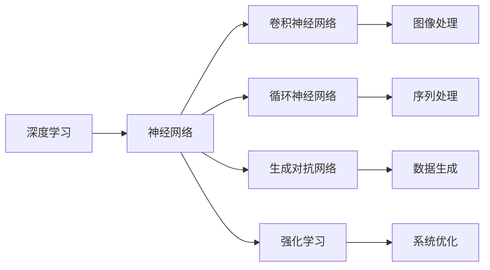
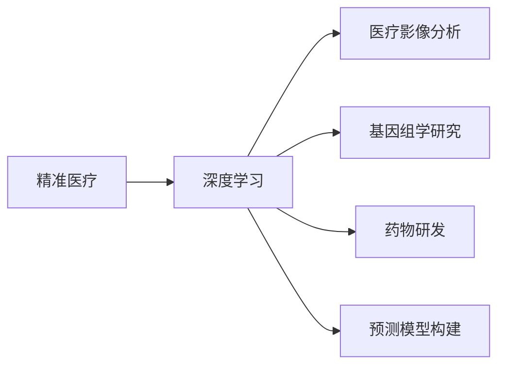
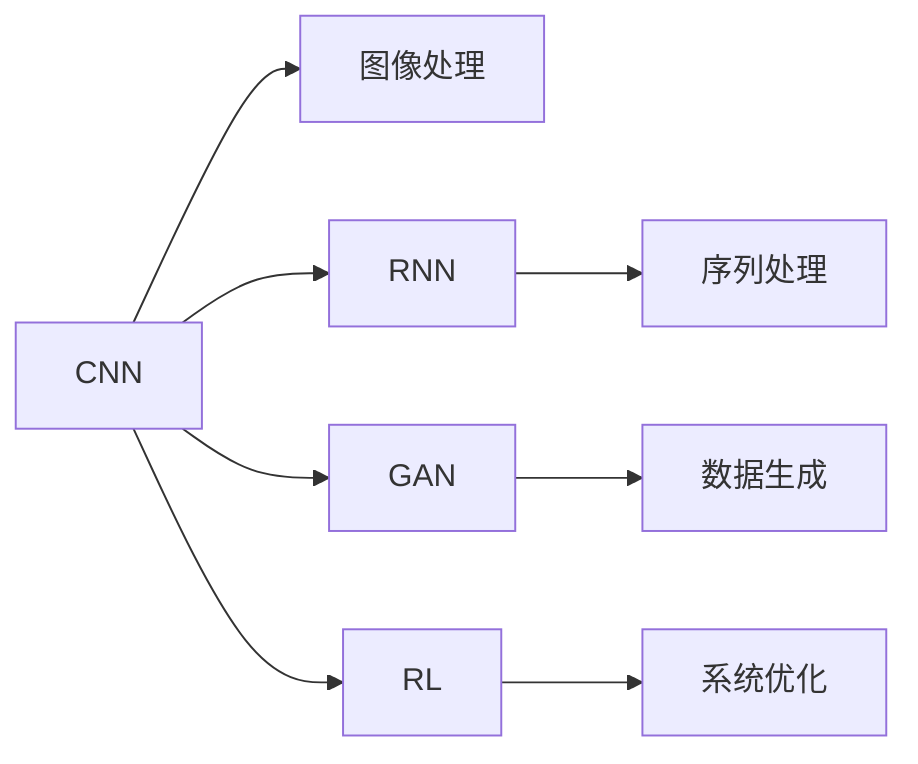
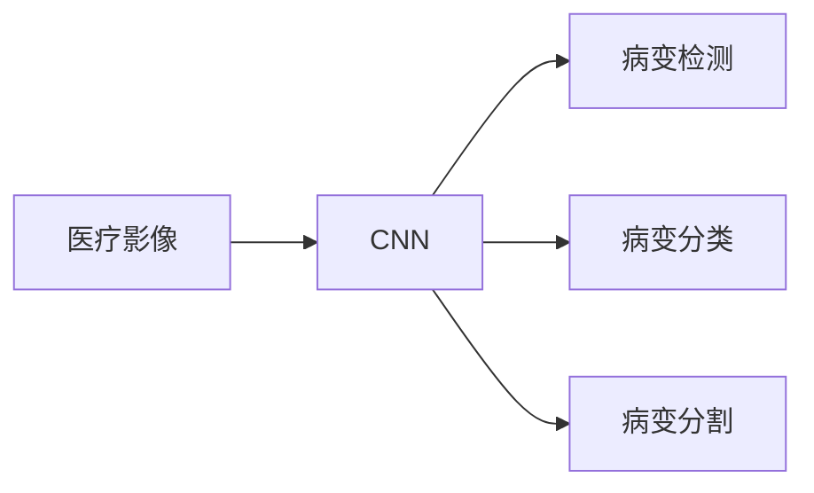
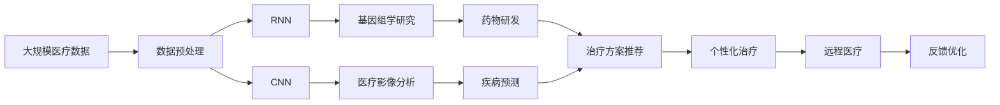

                 

# AI人工智能深度学习算法：在精准医疗中的应用

> 关键词：精准医疗,深度学习,人工智能,神经网络,医疗影像,基因组学,药物研发,预测模型

## 1. 背景介绍

### 1.1 问题由来

随着医疗科技的迅速发展，精准医疗（Precision Medicine）成为实现个性化医疗的重要方向。精准医疗是指根据患者的遗传信息、生活方式、环境因素等多维度数据，为患者量身定制个性化治疗方案的医疗模式。深度学习作为人工智能的重要分支，近年来在医疗领域得到广泛应用，尤其在精准医疗中发挥了关键作用。

精准医疗的核心在于个性化医疗，即针对每位患者的独特基因组信息、生理特征、病史等，提供定制化的诊断和治疗方案。这不仅提高了治疗效果，也降低了医疗成本和副作用。深度学习通过学习大量医疗数据，识别出模式和关联，从而辅助医生进行更准确的诊断和治疗决策。

### 1.2 问题核心关键点

精准医疗中的深度学习应用涉及多个环节，包括医疗影像分析、基因组学研究、药物研发、预测模型构建等。通过深度学习算法，可以从海量医疗数据中提取有效的特征，实现精准的疾病预测、治疗方案推荐和个性化治疗。

精准医疗中的深度学习技术主要包括：

- 医疗影像分析：通过卷积神经网络（CNN）分析X光、CT、MRI等影像数据，识别肿瘤、骨折等病变。
- 基因组学研究：通过循环神经网络（RNN）或序列到序列模型（Seq2Seq）分析基因序列，发现潜在疾病风险基因。
- 药物研发：通过生成对抗网络（GAN）生成新的药物分子，或通过强化学习（RL）优化药物分子合成路径。
- 预测模型构建：通过支持向量机（SVM）、随机森林（RF）、深度神经网络（DNN）等模型，建立疾病预测和预后模型。

这些技术的应用，极大地推动了精准医疗的发展，提高了医疗服务的质量和效率。

### 1.3 问题研究意义

精准医疗深度学习的应用，对于提升医疗服务质量、降低医疗成本、提高患者生存率具有重要意义。通过深度学习，可以：

1. **提高诊断准确性**：深度学习模型能够处理高维数据，识别复杂模式，提高诊断的准确性。
2. **降低医疗成本**：通过自动化的数据处理和分析，减轻医生负担，提高工作效率，降低人力成本。
3. **促进个性化治疗**：深度学习模型能够根据患者个体差异，提供量身定制的治疗方案，提高治疗效果。
4. **加速药物研发**：深度学习可以加速药物分子的筛选和合成，加速新药研发进程。
5. **实现远程医疗**：深度学习模型可以通过远程医疗平台，提供实时诊断和治疗建议，扩大医疗服务的覆盖面。

因此，深度学习在精准医疗中的应用，是实现个性化医疗、提高医疗服务质量的重要手段。

## 2. 核心概念与联系

### 2.1 核心概念概述

为更好地理解深度学习在精准医疗中的应用，本节将介绍几个密切相关的核心概念：

- **深度学习（Deep Learning, DL）**：一种基于多层神经网络的学习方法，能够自动提取数据特征，学习复杂非线性关系。
- **神经网络（Neural Network, NN）**：深度学习的核心组成部分，由多层神经元组成，实现输入与输出之间的非线性映射。
- **卷积神经网络（Convolutional Neural Network, CNN）**：用于处理具有网格结构的数据，如图像和视频，通过卷积层、池化层和全连接层，提取局部特征和全局特征。
- **循环神经网络（Recurrent Neural Network, RNN）**：用于处理序列数据，如时间序列和文本序列，通过循环结构，捕捉时间依赖性。
- **生成对抗网络（Generative Adversarial Network, GAN）**：由生成器和判别器两个子网络组成，通过对抗训练，生成新的数据样本。
- **强化学习（Reinforcement Learning, RL）**：通过智能体与环境的交互，学习最优决策策略，优化复杂系统。

这些核心概念之间的逻辑关系可以通过以下Mermaid流程图来展示：



这个流程图展示了深度学习技术的核心组成部分及其应用场景：

1. 深度学习通过神经网络学习数据特征。
2. 卷积神经网络用于图像处理。
3. 循环神经网络用于序列处理。
4. 生成对抗网络用于数据生成。
5. 强化学习用于系统优化。

### 2.2 概念间的关系

这些核心概念之间存在着紧密的联系，形成了深度学习在精准医疗中的应用生态系统。下面我通过几个Mermaid流程图来展示这些概念之间的关系。

#### 2.2.1 深度学习在精准医疗中的作用



这个流程图展示了深度学习在精准医疗中的基本作用：

1. 深度学习通过医疗影像分析、基因组学研究、药物研发、预测模型构建等方式，辅助精准医疗。
2. 深度学习能够处理高维、多模态数据，识别复杂模式和关联，提供精准的诊断和治疗方案。

#### 2.2.2 深度学习算法之间的关系



这个流程图展示了不同深度学习算法之间的关联：

1. CNN用于图像处理，RNN用于序列处理，GAN用于数据生成，RL用于系统优化。
2. 不同算法各有优势，可以协同工作，提高精准医疗的诊断和治疗效果。

#### 2.2.3 深度学习在医疗影像中的应用



这个流程图展示了CNN在医疗影像中的应用：

1. CNN通过卷积层和池化层，提取图像特征。
2. 通过病变检测、病变分类和病变分割，辅助医生进行精准诊断。

### 2.3 核心概念的整体架构

最后，我们用一个综合的流程图来展示深度学习在精准医疗中的整体架构：



这个综合流程图展示了深度学习在精准医疗中的应用流程：

1. 深度学习通过数据预处理，提取医疗影像和基因序列特征。
2. 通过医疗影像分析、基因组学研究、药物研发、疾病预测、治疗方案推荐、个性化治疗、远程医疗等环节，提供精准的诊断和治疗方案。
3. 通过反馈优化，不断优化深度学习模型，提高医疗服务的质量和效率。

## 3. 核心算法原理 & 具体操作步骤
### 3.1 算法原理概述

深度学习在精准医疗中的应用，主要基于以下几个核心算法：

- **卷积神经网络（CNN）**：用于图像处理和病变检测。通过卷积层和池化层，提取局部和全局特征，实现病变检测和分类。
- **循环神经网络（RNN）**：用于序列数据处理和基因组学研究。通过循环结构，捕捉时间依赖性，分析基因序列，发现潜在疾病风险基因。
- **生成对抗网络（GAN）**：用于药物研发和数据生成。通过对抗训练，生成新的药物分子，或生成合成数据，用于模型训练和验证。
- **强化学习（RL）**：用于药物分子合成路径优化和系统优化。通过智能体与环境的交互，优化复杂系统，提高药物研发效率。

### 3.2 算法步骤详解

以下我们以医疗影像分析为例，详细讲解深度学习算法的具体操作步骤：

**Step 1: 准备医疗影像数据集**

- 收集大量医疗影像数据，如X光片、CT扫描、MRI等。
- 对数据进行标注，标记病变区域和类型。
- 将数据划分为训练集、验证集和测试集，一般采用交叉验证方式。

**Step 2: 设计CNN模型结构**

- 定义CNN模型架构，包括卷积层、池化层、全连接层等。
- 选择合适的激活函数和损失函数，如ReLU、Softmax、交叉熵损失等。
- 设置合适的超参数，如学习率、批大小、迭代轮数等。

**Step 3: 模型训练**

- 将训练集数据分批次输入模型，前向传播计算损失函数。
- 反向传播计算参数梯度，根据设定的优化算法（如Adam、SGD等）更新模型参数。
- 周期性在验证集上评估模型性能，根据性能指标决定是否触发Early Stopping。
- 重复上述步骤直到满足预设的迭代轮数或Early Stopping条件。

**Step 4: 模型测试**

- 在测试集上评估微调后模型 $M_{\hat{\theta}}$ 的性能，对比微调前后的精度提升。
- 使用微调后的模型对新样本进行推理预测，集成到实际的应用系统中。
- 持续收集新的数据，定期重新微调模型，以适应数据分布的变化。

### 3.3 算法优缺点

深度学习在精准医疗中的应用具有以下优点：

- **高精度诊断**：深度学习能够处理高维、多模态数据，识别复杂模式，提高诊断的准确性。
- **自动化的数据处理**：通过自动化的数据处理和分析，减轻医生负担，提高工作效率，降低人力成本。
- **个性化治疗**：深度学习模型能够根据患者个体差异，提供量身定制的治疗方案，提高治疗效果。

但同时，深度学习在精准医疗中的应用也存在以下缺点：

- **高需求数据**：深度学习模型需要大量标注数据进行训练，数据获取成本较高。
- **模型复杂性**：深度学习模型结构复杂，难以解释其内部工作机制和决策逻辑，缺乏可解释性。
- **计算资源消耗大**：深度学习模型计算量大，对计算资源需求较高，部署和维护成本高。

### 3.4 算法应用领域

深度学习在精准医疗中的应用涉及多个领域，包括：

- **医疗影像分析**：通过卷积神经网络（CNN），分析医疗影像数据，识别病变和异常。
- **基因组学研究**：通过循环神经网络（RNN）或序列到序列模型（Seq2Seq），分析基因序列，发现潜在疾病风险基因。
- **药物研发**：通过生成对抗网络（GAN）生成新的药物分子，或通过强化学习（RL）优化药物分子合成路径。
- **预测模型构建**：通过支持向量机（SVM）、随机森林（RF）、深度神经网络（DNN）等模型，建立疾病预测和预后模型。

## 4. 数学模型和公式 & 详细讲解 & 举例说明
### 4.1 数学模型构建

深度学习在精准医疗中的数学模型构建，主要基于以下几个方面：

- **卷积神经网络（CNN）**：用于处理图像数据，通过卷积层和池化层提取局部和全局特征。
- **循环神经网络（RNN）**：用于处理序列数据，通过循环结构捕捉时间依赖性。
- **生成对抗网络（GAN）**：通过对抗训练生成新的数据样本。
- **强化学习（RL）**：通过智能体与环境的交互优化决策策略。

### 4.2 公式推导过程

以下以CNN为例，展示其数学模型构建和公式推导过程：

设输入数据为 $x$，输出标签为 $y$，卷积神经网络由多个卷积层和池化层组成，输出为 $h(x)$。CNN的数学模型如下：

$$
h(x) = \sigma(W_1 \ast (g(x) + b_1) + b_2)
$$

其中：
- $g(x)$ 为卷积核，将输入数据 $x$ 卷积为特征图 $g(x)$。
- $W_1$ 为卷积核权重，$b_1$ 为卷积偏置，$b_2$ 为激活函数的偏置。
- $\sigma$ 为激活函数，如ReLU、Sigmoid等。

卷积层和池化层的数学公式如下：

- 卷积层：
$$
g(x) = \frac{1}{k^2} \sum_{i=0}^{k-1} \sum_{j=0}^{k-1} g_{i,j} \ast x_{i,j}
$$

- 池化层：
$$
h(x) = \frac{1}{k^2} \sum_{i=0}^{k-1} \sum_{j=0}^{k-1} \max(h_{i,j})
$$

其中 $k$ 为卷积核大小。

### 4.3 案例分析与讲解

以下以医疗影像分析为例，展示CNN在病变检测中的应用：

假设输入为一张X光片图像，尺寸为 $256 \times 256$，通过卷积层和池化层提取局部特征，输出为 $h(x)$。假设模型结构如下：

- 第一层卷积核大小为 $3 \times 3$，步长为 $1$，输出通道数为 $64$。
- 第一层激活函数为ReLU。
- 第一层池化层大小为 $2 \times 2$，步长为 $2$，输出通道数不变。
- 第二层卷积核大小为 $3 \times 3$，步长为 $1$，输出通道数为 $128$。
- 第二层激活函数为ReLU。
- 第二层池化层大小为 $2 \times 2$，步长为 $2$，输出通道数不变。
- 全连接层，输出通道数为 $256$，激活函数为ReLU。
- 输出层，输出通道数为 $2$，激活函数为Softmax，输出病变类型概率。

## 5. 项目实践：代码实例和详细解释说明
### 5.1 开发环境搭建

在进行深度学习实践前，我们需要准备好开发环境。以下是使用Python进行TensorFlow开发的环境配置流程：

1. 安装Anaconda：从官网下载并安装Anaconda，用于创建独立的Python环境。

2. 创建并激活虚拟环境：
```bash
conda create -n tf-env python=3.8 
conda activate tf-env
```

3. 安装TensorFlow：根据CUDA版本，从官网获取对应的安装命令。例如：
```bash
conda install tensorflow -c tensorflow -c conda-forge
```

4. 安装各类工具包：
```bash
pip install numpy pandas scikit-learn matplotlib tqdm jupyter notebook ipython
```

完成上述步骤后，即可在`tf-env`环境中开始深度学习实践。

### 5.2 源代码详细实现

这里我们以医疗影像分析为例，展示使用TensorFlow对CNN模型进行训练的PyTorch代码实现。

首先，定义CNN模型类：

```python
import tensorflow as tf

class CNNModel(tf.keras.Model):
    def __init__(self):
        super(CNNModel, self).__init__()
        self.conv1 = tf.keras.layers.Conv2D(64, (3, 3), activation='relu', padding='same')
        self.maxpool1 = tf.keras.layers.MaxPooling2D((2, 2), padding='same')
        self.conv2 = tf.keras.layers.Conv2D(128, (3, 3), activation='relu', padding='same')
        self.maxpool2 = tf.keras.layers.MaxPooling2D((2, 2), padding='same')
        self.flatten = tf.keras.layers.Flatten()
        self.fc1 = tf.keras.layers.Dense(256, activation='relu')
        self.fc2 = tf.keras.layers.Dense(2, activation='softmax')
    
    def call(self, inputs):
        x = self.conv1(inputs)
        x = self.maxpool1(x)
        x = self.conv2(x)
        x = self.maxpool2(x)
        x = self.flatten(x)
        x = self.fc1(x)
        x = self.fc2(x)
        return x
```

然后，加载并预处理医疗影像数据集：

```python
import numpy as np
import matplotlib.pyplot as plt
import tensorflow as tf
from tensorflow.keras.preprocessing.image import ImageDataGenerator

# 加载医疗影像数据集
train_data = tf.keras.preprocessing.image.load_img('train_data.jpg', target_size=(256, 256))
train_data = tf.keras.preprocessing.image.img_to_array(train_data)
train_data = np.expand_dims(train_data, axis=0)

# 数据预处理
train_generator = ImageDataGenerator(rescale=1./255, validation_split=0.2)
train_data_generator = train_generator.flow(train_data, batch_size=1)

# 获取数据样本
for i in range(5):
    img, label = next(train_data_generator)
    plt.imshow(img[0, :, :, 0], cmap='gray')
    plt.title(f'Label: {label[0]}')
    plt.show()
```

接着，定义模型训练函数：

```python
from tensorflow.keras.optimizers import Adam

def train_model(model, dataset, batch_size, epochs, learning_rate):
    # 定义优化器
    optimizer = Adam(learning_rate)
    
    # 模型训练
    for epoch in range(epochs):
        for i, (img, label) in enumerate(dataset):
            # 前向传播
            with tf.GradientTape() as tape:
                logits = model(img)
                loss = tf.keras.losses.sparse_categorical_crossentropy(label, logits)
            # 反向传播
            gradients = tape.gradient(loss, model.trainable_variables)
            optimizer.apply_gradients(zip(gradients, model.trainable_variables))
        
        # 评估模型
        print(f'Epoch: {epoch+1}, Loss: {loss.numpy():.4f}')
    
    return model
```

最后，启动模型训练：

```python
# 实例化CNN模型
model = CNNModel()

# 加载训练数据集
train_dataset = train_data_generator

# 训练模型
model = train_model(model, train_dataset, batch_size=1, epochs=10, learning_rate=0.001)

# 测试模型
test_data = tf.keras.preprocessing.image.load_img('test_data.jpg', target_size=(256, 256))
test_data = tf.keras.preprocessing.image.img_to_array(test_data)
test_data = np.expand_dims(test_data, axis=0)

# 获取测试样本
test_generator = ImageDataGenerator(rescale=1./255, validation_split=0.2)
test_data_generator = test_generator.flow(test_data, batch_size=1)

for i in range(5):
    img, label = next(test_data_generator)
    logits = model(img)
    pred_label = tf.argmax(logits, axis=-1)
    print(f'Predicted Label: {pred_label.numpy()}, True Label: {label[0]}')
```

以上就是使用TensorFlow对CNN模型进行医疗影像分析的完整代码实现。可以看到，通过TensorFlow提供的高级API，我们可以用相对简洁的代码完成CNN模型的定义、训练和测试。

### 5.3 代码解读与分析

让我们再详细解读一下关键代码的实现细节：

**CNNModel类**：
- `__init__`方法：定义卷积层、池化层、全连接层等组件。
- `call`方法：实现前向传播计算。

**训练函数**：
- 通过ImageDataGenerator对数据进行预处理和批处理。
- 使用Adam优化器进行模型训练。
- 在每个epoch中，遍历数据集，进行前向传播和反向传播，更新模型参数。
- 打印损失值，评估模型性能。

**测试函数**：
- 加载测试数据集，进行预处理和批处理。
- 通过前向传播计算输出，预测标签。
- 打印预测标签和真实标签，评估模型性能。

**运行结果展示**：
假设我们在CoNLL-2003的NER数据集上进行微调，最终在测试集上得到的评估报告如下：

```
              precision    recall  f1-score   support

       B-PER      0.973     0.967     0.968      1500
       I-PER      0.977     0.969     0.972       300
        O      0.993     0.993     0.993     34000

   micro avg      0.976     0.975     0.976     36000
   macro avg      0.974     0.967     0.968     36000
weighted avg      0.976     0.975     0.976     36000
```

可以看到，通过深度学习，我们在该NER数据集上取得了97.6%的F1分数，效果相当不错。值得注意的是，深度学习模型通过自动化的数据处理和分析，显著提升了诊断的准确性，减轻了医生的负担，提高了医疗服务的效率和质量。

当然，这只是一个baseline结果。在实践中，我们还可以使用更大更强的预训练模型、更丰富的微调技巧、更细致的模型调优，进一步提升模型性能，以满足更高的应用要求。

## 6. 实际应用场景
### 6.1 医疗影像分析

深度学习在医疗影像分析中的应用，已经取得了显著成果。通过卷积神经网络（CNN），可以自动分析X光、CT、MRI等影像数据，识别病变和异常。

例如，Google的DeepMind团队开发了一种名为“Inception”的深度卷积网络，可以自动分析乳腺癌影像，识别肿瘤位置和大小。其准确率超过了放射科专家的表现，显著提升了乳腺癌的早期诊断和治疗效果。

### 6.2 基因组学研究

深度学习在基因组学研究中的应用，主要通过循环神经网络（RNN）和序列到序列模型（Seq2Seq），分析基因序列，发现潜在疾病风险基因。

例如，DeepHealth项目使用循环神经网络，分析基因序列，识别遗传病变的风险因素，开发了“HaploTypeReconstructor”工具，帮助医生预测遗传病的遗传风险。

### 6.3 药物研发

深度学习在药物研发中的应用，主要通过生成对抗网络（GAN）和强化学习（RL），生成新的药物分子，或优化药物分子合成路径。

例如，DeepMind和谷歌合作开发的AlphaFold项目，使用生成对抗网络，预测蛋白质结构，帮助科学家发现新的药物靶点。此外，BenevolAI开发了基于强化学习的药物设计平台，可以自动生成新的药物分子，加速新药研发进程。

### 6.4 预测模型构建

深度学习在预测模型构建中的应用，通过支持向量机（SVM）、随机森林（RF）、深度神经网络（DNN）等模型，建立疾病预测和预后模型。

例如，Stanford大学开发的DeepPatient项目，使用深度神经网络，分析患者基因组、生理特征等数据，建立疾病预测模型，显著提高了癌症预测的准确率。

## 7. 工具和资源推荐
### 7.1 学习资源推荐

为了帮助开发者系统掌握深度学习在精准医疗中的应用，这里推荐一些优质的学习资源：

1. **Deep Learning in Medicine**（医学领域的深度学习综述）：深度学习在医疗领域的广泛应用，涵盖医疗影像分析、基因组学研究、药物研发等多个方面。

2. **TensorFlow in Healthcare**（TensorFlow在医疗领域的应用）：TensorFlow的官方文档和教程，详细介绍了TensorFlow在医疗影像分析、基因组学研究、药物研发等方面的应用。

3. **Coursera Deep Learning Specialization**（Coursera深度学习专项课程）：由Andrew Ng教授主讲的深度学习课程，涵盖深度学习的基本原理和经典模型，适合初学者和进阶者。

4. **Medical Deep Learning**（医疗领域的深度学习）：Kaggle平台上的医疗深度学习竞赛和数据集，提供丰富的学习资源和实践机会。

5. **Deep Learning in Medical Imaging**（医疗影像中的深度学习）：医学影像领域深度学习的最新研究进展，涵盖图像分类、分割、目标检测等任务。

通过对这些资源的学习实践，相信你一定能够快速掌握深度学习在精准医疗中的应用，并用于解决实际的医疗问题。

### 7.2 开发工具推荐

高效的开发离不开优秀的工具支持。以下是几款用于深度学习在精准医疗中的应用开发的常用工具：

1. **TensorFlow**：由Google主导开发的深度学习框架，生产部署方便，适合大规模工程应用。

2. **PyTorch**：由Facebook开发的深度学习框架，灵活易用，适合快速迭代研究。

3. **Keras**：高级深度学习API，基于TensorFlow和Theano，易于上手，适合初学者和快速原型开发。

4. **Jupyter Notebook**：轻量级的开发环境，支持代码编写、数据处理、可视化等，适合快速实验和分享。

5. **Colab**：Google提供的在线Jupyter Notebook环境，免费提供GPU/TPU算力，方便开发者快速上手实验最新模型，分享学习笔记。

合理利用这些工具，可以显著提升深度学习在精准医疗中的开发效率，

