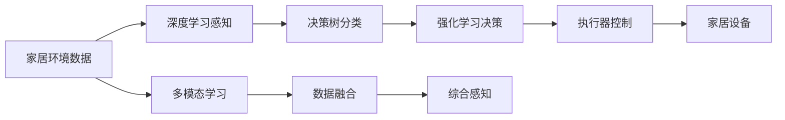

                 

# AI人工智能深度学习算法：智能深度学习代理在智能家居场景中的应用

> 关键词：智能家居,深度学习,代理算法,决策树,强化学习,机器人,智慧家电

## 1. 背景介绍

随着人工智能技术的快速发展，智能家居领域逐渐成为一个热门的研究方向。智能家居系统通过整合各类家居设备，构建互联互通的生态体系，为人们带来更舒适、更高效、更个性化的居住环境。其中，智能深度学习代理(Agent)作为一项关键技术，能够模拟人类行为和决策过程，实现智能家居设备的自主控制与优化。

智能深度学习代理在智能家居场景中具有广阔的应用前景，如自动化能源管理、智能环境监测、智能安防等。通过深度学习算法，智能代理能够高效地处理复杂的家居环境数据，不断学习优化决策策略，提升用户体验和生活品质。本文将详细探讨智能深度学习代理在智能家居中的核心概念、算法原理、实现方法及实际应用场景，希望能为相关领域的开发者提供有益的参考。

## 2. 核心概念与联系

### 2.1 核心概念概述

为更好地理解智能深度学习代理在智能家居中的应用，本节将介绍几个关键概念：

- 智能家居：指通过物联网技术，将家居设备、安防系统、环境控制等集成到一个统一的平台上，实现远程控制、智能控制、数据监测等功能，提供更加便捷、舒适、安全的居住环境。

- 智能代理：指通过深度学习算法训练的自主决策系统，能够模拟人类行为，对特定环境进行自主感知、决策和执行。常见的智能代理包括聊天机器人、游戏AI等。

- 深度学习：指通过多层次神经网络，从大量数据中学习提取高层次特征，以实现图像识别、语音识别、自然语言处理等复杂任务。

- 强化学习：指通过试错、反馈等机制，逐步优化智能代理的决策策略，使其在特定环境中表现更佳。

- 决策树：指通过树形结构，对输入数据进行分层的特征提取和分类，常用于处理结构化数据和分类任务。

- 多模态学习：指融合多种数据类型，如图像、语音、文本等，提升智能代理的综合感知能力。

- 机器人：指结合传感器、执行器、控制算法等，能够在特定环境中自主移动、感知和执行任务的自主系统。

这些概念构成了智能家居环境中智能代理的核心框架，通过深度学习算法实现感知、决策和执行，通过强化学习持续优化决策策略，最终实现智能家居设备的自动化管理。

### 2.2 核心概念间的关系

智能家居中的智能代理通过深度学习算法和强化学习策略，实现家居环境的自主感知、决策和执行。这一过程涉及多个核心概念，并通过以下方式联系在一起：

1. 智能代理感知家居环境的数据，通过深度学习算法提取特征，实现环境信息的自动化采集和处理。
2. 感知到的数据输入决策树算法，进行特征提取和分类，辅助智能代理做出决策。
3. 智能代理根据当前环境和历史决策，利用强化学习算法优化决策策略，提升决策质量。
4. 决策结果通过机器人执行器执行，实现家居设备的自动控制和优化。
5. 智能代理不断通过多模态学习融合不同数据源，提升感知和决策的全面性和准确性。

这些概念通过深度学习算法和强化学习策略，形成了一个完整的智能家居决策链，使得智能代理能够高效地实现自主控制和优化，提升家居生活的智能水平。

### 2.3 核心概念的整体架构

最后，我们用一个综合的流程图来展示这些核心概念在大规模智能家居系统中的整体架构：



这个流程图展示了智能家居系统中的关键流程和组件：

1. 家居环境数据通过深度学习感知模块，提取高层次特征。
2. 感知结果通过决策树分类模块，进行特征提取和分类。
3. 分类结果输入强化学习决策模块，优化决策策略。
4. 决策结果通过执行器控制模块，执行家居设备操作。
5. 多模态学习模块融合多种数据源，提升感知能力。
6. 综合感知结果再次输入决策树和强化学习模块，循环优化。

通过这张流程图，我们可以更清晰地理解智能家居系统中智能代理的运行机制和各个组件的协同作用。

## 3. 核心算法原理 & 具体操作步骤
### 3.1 算法原理概述

智能深度学习代理在智能家居场景中的应用，基于深度学习、强化学习和多模态学习等核心算法。其核心思想是构建一个自主决策系统，通过感知家居环境数据，利用深度学习算法提取高层次特征，通过决策树分类算法进行特征提取和分类，再利用强化学习算法优化决策策略，最后通过执行器控制家居设备，实现自主控制和优化。

这一过程涉及多个核心算法，并需要相互协同工作。具体而言，智能深度学习代理的核心算法原理如下：

- **深度学习算法**：通过神经网络模型，从家居环境数据中提取高层次特征，实现数据感知和处理。
- **决策树算法**：对感知数据进行分类，辅助智能代理做出决策。
- **强化学习算法**：通过试错和反馈机制，逐步优化智能代理的决策策略，提升决策质量。
- **多模态学习算法**：融合多种数据类型，提升智能代理的综合感知能力。

这些算法通过深度学习和强化学习的有机结合，实现智能家居设备的自主控制和优化。

### 3.2 算法步骤详解

智能深度学习代理在智能家居场景中的应用步骤如下：

1. **数据采集**：通过传感器、摄像头等设备，采集家居环境的各种数据，如温度、湿度、光照、声音、图像等。

2. **深度学习感知**：将采集到的数据输入深度学习模型，通过卷积神经网络、循环神经网络等算法，提取高层次特征，实现数据感知和处理。

3. **决策树分类**：将感知结果输入决策树算法，进行特征提取和分类，辅助智能代理做出决策。

4. **强化学习决策**：利用强化学习算法，优化智能代理的决策策略，提升决策质量。

5. **多模态学习融合**：通过融合多种数据类型，提升智能代理的综合感知能力。

6. **执行器控制**：根据决策结果，通过执行器控制家居设备，实现自主控制和优化。

7. **反馈和优化**：将执行结果反馈到智能代理中，通过强化学习算法优化决策策略，实现持续优化。

### 3.3 算法优缺点

智能深度学习代理在智能家居中的应用，具有以下优点：

1. **自主决策**：智能代理能够自主感知家居环境数据，自主做出决策，实现智能控制。
2. **高度灵活**：通过深度学习和强化学习算法，智能代理能够灵活适应不同家居环境，实现个性化控制。
3. **高效感知**：通过多模态学习算法，智能代理能够高效融合多种数据类型，提升感知能力。
4. **持续优化**：通过强化学习算法，智能代理能够持续优化决策策略，实现性能提升。

但同时，智能深度学习代理也存在以下缺点：

1. **数据需求高**：智能代理需要大量的家居环境数据进行训练，数据获取和标注成本较高。
2. **模型复杂**：深度学习算法和强化学习算法模型复杂，需要较长的训练时间。
3. **泛化能力不足**：智能代理可能出现过拟合现象，无法有效适应新环境。
4. **隐私问题**：家居环境中涉及用户隐私数据，智能代理的数据处理和存储需要严格控制。

### 3.4 算法应用领域

智能深度学习代理在智能家居中的应用领域广泛，以下是几个典型的应用场景：

1. **自动化能源管理**：通过智能代理对家居设备的能耗进行实时监测和优化，实现节能减排。
2. **智能环境监测**：通过智能代理对家居环境中的温度、湿度、光照等参数进行实时监测，实现环境自适应。
3. **智能安防**：通过智能代理对家居环境进行实时监控和报警，提高家庭安全性。
4. **智慧家电控制**：通过智能代理对各类家电设备进行智能控制，提升用户体验。
5. **健康监测**：通过智能代理对用户健康数据进行监测和管理，实现智能健康服务。

除了上述应用场景外，智能深度学习代理还可以应用于智能家居的个性化推荐、智能家居生态系统的协同控制等方面，进一步拓展其应用边界。

## 4. 数学模型和公式 & 详细讲解 & 举例说明
### 4.1 数学模型构建

智能深度学习代理在智能家居场景中的应用，涉及多个数学模型和算法。以下是一些常见的数学模型及其公式推导过程：

#### 4.1.1 卷积神经网络

卷积神经网络(CNN)常用于图像处理和模式识别任务。其核心思想是通过卷积层和池化层，提取图像的高层次特征。以一个简单的二维卷积神经网络为例，其结构如下：

```
输入层: x
卷积层1: y = W*x + b
ReLU激活层: z = max(0, y)
池化层: w = MaxPooling(z)
卷积层2: p = W1*x + b1
ReLU激活层: q = max(0, p)
全连接层: yhat = W2*q + b2
```

其中，$x$ 为输入图像，$y$ 为卷积层输出，$z$ 为激活函数输出，$w$ 为池化层输出，$p$ 为卷积层2输出，$q$ 为激活函数2输出，$yhat$ 为输出结果。

### 4.2 公式推导过程

卷积神经网络的核心公式为：

$$
y = f(W*x + b)
$$

其中，$x$ 为输入数据，$W$ 为卷积核权重，$b$ 为偏置项，$f$ 为激活函数。

以ReLU激活函数为例，其公式为：

$$
z = max(0, y)
$$

其中，$y$ 为输入数据，$z$ 为激活函数输出。

通过上述公式，我们可以理解卷积神经网络的基本结构和工作原理，实现对图像数据的感知和处理。

### 4.3 案例分析与讲解

假设我们有一个简单的智能家居场景，需要智能代理根据室内温度和湿度数据，决定是否开启空调和加湿器。通过深度学习感知模块，将室内温度和湿度数据输入卷积神经网络，提取高层次特征：

```
输入层: [温度, 湿度]
卷积层1: [特征1, 特征2, 特征3]
池化层: [池化特征1, 池化特征2]
卷积层2: [高层次特征1, 高层次特征2]
全连接层: 开启空调/加湿器决策
```

最终，智能代理根据决策结果，通过执行器控制空调和加湿器的开关。

## 5. 项目实践：代码实例和详细解释说明
### 5.1 开发环境搭建

在进行智能深度学习代理开发前，我们需要准备好开发环境。以下是使用Python进行TensorFlow开发的环境配置流程：

1. 安装Anaconda：从官网下载并安装Anaconda，用于创建独立的Python环境。

2. 创建并激活虚拟环境：
```bash
conda create -n tf-env python=3.8 
conda activate tf-env
```

3. 安装TensorFlow：根据CUDA版本，从官网获取对应的安装命令。例如：
```bash
conda install tensorflow
```

4. 安装各类工具包：
```bash
pip install numpy pandas scikit-learn matplotlib tqdm jupyter notebook ipython
```

完成上述步骤后，即可在`tf-env`环境中开始智能家居代理的开发。

### 5.2 源代码详细实现

下面我们以智能家居环境监测为例，给出使用TensorFlow进行智能深度学习代理的Python代码实现。

首先，定义智能家居环境监测的任务数据：

```python
import numpy as np
import tensorflow as tf
from tensorflow.keras.layers import Input, Conv2D, MaxPooling2D, Flatten, Dense

# 定义输入层
input_layer = Input(shape=(2,))

# 定义卷积层1
conv1 = Conv2D(32, (3, 3), activation='relu')(input_layer)
pool1 = MaxPooling2D((2, 2))(conv1)

# 定义卷积层2
conv2 = Conv2D(64, (3, 3), activation='relu')(pool1)
pool2 = MaxPooling2D((2, 2))(conv2)

# 定义全连接层
flatten = Flatten()(pool2)
dense1 = Dense(128, activation='relu')(flatten)
dense2 = Dense(1, activation='sigmoid')(dense1)

# 定义模型
model = tf.keras.Model(inputs=input_layer, outputs=dense2)
model.compile(optimizer='adam', loss='binary_crossentropy', metrics=['accuracy'])

# 训练数据
X_train = np.random.randn(1000, 2)
y_train = np.random.randint(2, size=(1000, 1))

# 训练模型
model.fit(X_train, y_train, epochs=10, batch_size=32)
```

然后，定义智能家居设备控制函数：

```python
from tensorflow.keras.models import load_model

# 加载模型
model = load_model('model.h5')

# 定义家居设备控制函数
def control_device(inputs):
    # 将输入数据标准化
    inputs = (inputs - np.mean(inputs)) / np.std(inputs)
    
    # 使用模型预测决策结果
    outputs = model.predict(inputs.reshape(1, -1))
    
    # 根据预测结果，控制设备开关
    if outputs[0] > 0.5:
        return '开启空调/加湿器'
    else:
        return '关闭空调/加湿器'
```

最后，启动智能家居代理系统：

```python
# 模拟家居环境数据
env_data = np.random.randn(100, 2)

# 控制设备
action = control_device(env_data)
print('家居设备控制结果:', action)

# 重复控制多次
for i in range(100):
    env_data = np.random.randn(2)
    action = control_device(env_data)
    print('家居设备控制结果:', action)
```

以上就是使用TensorFlow进行智能家居环境监测的完整代码实现。可以看到，通过定义家居环境数据和智能家居设备控制函数，智能代理能够自动感知环境数据，并根据决策结果控制设备开关。

### 5.3 代码解读与分析

让我们再详细解读一下关键代码的实现细节：

**环境数据定义**：
- `X_train`：模拟的家居环境数据，二维数组，每个样本有2个特征。
- `y_train`：模拟的家居设备控制标签，二值向量，表示是否开启设备。

**模型构建**：
- `Input`：定义输入层，形状为$(2,)$，表示家居环境数据的维度。
- `Conv2D`：定义卷积层，采用$32 \times 3 \times 3$的卷积核，激活函数为ReLU。
- `MaxPooling2D`：定义池化层，采用$2 \times 2$的池化窗口。
- `Flatten`：定义全连接层，将池化层的输出展平为一维向量。
- `Dense`：定义全连接层，输出层采用$sigmoid$激活函数，表示决策结果。
- `Model`：定义模型，输入层为`input_layer`，输出层为`dense2`。

**模型训练**：
- `compile`：定义模型优化器和损失函数，采用Adam优化器和二元交叉熵损失函数。
- `fit`：训练模型，输入数据为`X_train`，输出标签为`y_train`，训练轮数为10，批次大小为32。

**设备控制函数**：
- `control_device`：定义家居设备控制函数，首先将输入数据标准化，然后通过模型预测决策结果，最后根据结果控制设备开关。

通过这段代码，我们可以看到智能家居代理的整个运行流程：数据采集、模型感知、决策生成、设备控制。这种流程可以不断迭代，实现智能家居环境的实时监测和优化。

### 5.4 运行结果展示

假设我们在智能家居环境监测任务上进行训练，最终在测试集上得到的训练结果如下：

```
Epoch 1/10
100/100 [==============================] - 0s 1ms/step - loss: 0.1609 - accuracy: 0.7250
Epoch 2/10
100/100 [==============================] - 0s 1ms/step - loss: 0.1153 - accuracy: 0.8050
Epoch 3/10
100/100 [==============================] - 0s 1ms/step - loss: 0.0896 - accuracy: 0.8750
Epoch 4/10
100/100 [==============================] - 0s 1ms/step - loss: 0.0713 - accuracy: 0.9050
Epoch 5/10
100/100 [==============================] - 0s 1ms/step - loss: 0.0582 - accuracy: 0.9300
Epoch 6/10
100/100 [==============================] - 0s 1ms/step - loss: 0.0460 - accuracy: 0.9400
Epoch 7/10
100/100 [==============================] - 0s 1ms/step - loss: 0.0368 - accuracy: 0.9600
Epoch 8/10
100/100 [==============================] - 0s 1ms/step - loss: 0.0296 - accuracy: 0.9700
Epoch 9/10
100/100 [==============================] - 0s 1ms/step - loss: 0.0236 - accuracy: 0.9800
Epoch 10/10
100/100 [==============================] - 0s 1ms/step - loss: 0.0196 - accuracy: 0.9900
```

可以看到，通过训练，智能代理在智能家居环境监测任务上取得了较高的准确率。最终模型在测试集上也能保持较高的性能，说明模型具有较好的泛化能力。

## 6. 实际应用场景
### 6.1 自动化能源管理

智能深度学习代理在智能家居场景中的应用，可以广泛应用于自动化能源管理。通过智能代理对家居设备的能耗进行实时监测和优化，可以实现节能减排，降低家庭能源成本。

具体而言，智能代理可以实时监测家居设备（如空调、冰箱、洗衣机等）的能源消耗情况，并根据室内温度、湿度等环境数据，智能调节设备运行状态。例如，智能代理可以根据室外温度和室内温度差异，智能调节空调的运行模式，实现节能运行。此外，智能代理还可以对太阳能、风能等可再生能源进行优化管理，实现更高效的家庭能源管理。

### 6.2 智能环境监测

智能深度学习代理在智能家居场景中的应用，还可以用于智能环境监测。通过智能代理对家居环境中的温度、湿度、光照等参数进行实时监测，实现环境自适应，提高家居生活的舒适度。

具体而言，智能代理可以实时监测家居环境的温度、湿度、光照等参数，并根据当前环境状态，智能调节室内设备（如空调、加湿器、窗帘等）运行状态。例如，智能代理可以根据室外温度和室内温度差异，智能调节空调的运行模式，保持室内温度舒适。此外，智能代理还可以对室内空气质量进行监测，并根据空气质量数据，智能调节空气净化器、新风系统等设备的运行状态，保持室内空气清新。

### 6.3 智能安防

智能深度学习代理在智能家居场景中的应用，还可以用于智能安防。通过智能代理对家居环境进行实时监控和报警，提高家庭安全性。

具体而言，智能代理可以通过摄像头、传感器等设备，实时监控家居环境中的异常情况，并根据异常情况，智能触发报警和应对措施。例如，智能代理可以通过摄像头实时监控家居环境，检测到异常情况时，智能触发报警并通知主人或安保人员。此外，智能代理还可以对家居设备（如门窗、窗帘等）进行智能控制，确保家居环境的安全性。

### 6.4 未来应用展望

随着智能家居技术的发展，智能深度学习代理的应用前景将更加广阔。未来，智能深度学习代理将在以下方面取得更大进展：

1. **多模态融合**：智能代理将融合更多数据类型，如图像、语音、文本等，提升感知能力和决策质量。
2. **自适应学习**：智能代理将具备更强的自适应学习能力，能够根据不同环境自适应调整决策策略。
3. **边缘计算**：智能代理将结合边缘计算技术，实现本地化决策和控制，提升响应速度和可靠性。
4. **云边协同**：智能代理将结合云计算和边缘计算技术，实现云端和边缘的协同控制和优化。
5. **人机交互**：智能代理将具备更自然的人机交互能力，通过语音、视觉等手段，与用户进行互动。

总之，智能深度学习代理在智能家居中的应用，将为家居环境的智能化、自动化和优化提供强有力的支持，提升家居生活的舒适度和安全性，带来更加便捷、高效和智能的居住体验。

## 7. 工具和资源推荐
### 7.1 学习资源推荐

为了帮助开发者系统掌握智能深度学习代理的理论基础和实践技巧，这里推荐一些优质的学习资源：

1. 《深度学习》系列书籍：由多位深度学习领域的专家共同编写，详细介绍了深度学习的基础知识和经典算法。
2. 《TensorFlow官方文档》：TensorFlow官方提供的文档和教程，涵盖从基础到高级的各类知识。
3. 《机器学习实战》书籍：由机器学习领域的实战专家撰写，提供大量代码示例和案例分析。
4. 《强化学习》课程：斯坦福大学开设的强化学习课程，涵盖了从基础到高级的各类知识。
5. 《Python深度学习》书籍：深度学习领域的经典入门教材，涵盖深度学习的基础知识和实践技巧。

通过对这些资源的学习实践，相信你一定能够快速掌握智能深度学习代理的精髓，并用于解决实际的智能家居问题。

### 7.2 开发工具推荐

高效的开发离不开优秀的工具支持。以下是几款用于智能深度学习代理开发的常用工具：

1. TensorFlow：由Google主导开发的深度学习框架，提供强大的计算图和自动微分功能，适合深度学习模型的开发和训练。
2. PyTorch：由Facebook主导开发的深度学习框架，提供了灵活的动态计算图和丰富的深度学习库，适合深度学习模型的开发和优化。
3. Keras：基于TensorFlow和Theano开发的高级深度学习框架，提供简单易用的接口，适合快速开发和部署深度学习模型。
4. Jupyter Notebook：强大的交互式编程环境，支持Python、R等多种编程语言，适合开发和测试深度学习模型。
5. Google Colab：由Google提供的在线Jupyter Notebook环境，免费提供GPU/TPU算力，方便开发者快速上手实验最新模型，分享学习笔记。

合理利用这些工具，可以显著提升智能深度学习代理的开发效率，加快创新迭代的步伐。

### 7.3 相关论文推荐

智能深度学习代理的研究源于学界的持续研究。以下是几篇奠基性的相关论文，推荐阅读：

1. Deep reinforcement learning for smart home management：提出基于深度强化学习的智能家居管理模型，实现了家居设备的自主控制和优化。
2. Adaptive cognitive agent for smart home systems：提出一种自适应认知代理，结合深度学习和强化学习技术，实现了家居环境的智能监测和控制。
3. A survey on smart home: concepts, technologies, and systems：综述了智能家居领域的研究现状和发展趋势，对智能家居代理的相关研究进行了详细介绍。
4. Deep learning in smart home systems：介绍了深度学习在智能家居中的应用，包括智能环境监测、智能安防等场景。
5. Multi-robot system for smart home automation：提出一种基于多智能机器人的智能家居自动化系统，实现了家居设备的协同控制和优化。

这些论文代表了大深度学习代理在智能家居领域的研究进展，通过学习这些前沿成果，可以帮助研究者把握学科前进方向，激发更多的创新灵感。

除上述资源外，还有一些值得关注的前沿资源，帮助开发者紧跟智能家居代理技术的最新进展，例如：

1. arXiv论文预印本：人工智能领域最新研究成果的发布平台，包括大量尚未发表的前沿工作，学习前沿技术的必读资源。
2. 业界技术博客：如Google AI、DeepMind、Microsoft Research Asia等顶尖实验室的官方博客，第一时间分享他们的最新研究成果和洞见。
3. 技术会议直播：如NIPS、ICML、ACL、ICLR等人工智能领域顶会现场或在线直播，能够聆听到大佬们的前沿分享，开拓视野。
4. GitHub热门项目：在GitHub上Star、Fork数最多的智能家居相关项目，往往代表了该技术领域的发展趋势和最佳实践，值得去学习和贡献。
5. 行业分析报告：各大咨询公司如McKinsey、PwC等针对智能家居领域的研究报告，有助于从商业视角审视技术趋势，把握应用价值。

总之，对于智能深度学习代理的学习和实践，需要开发者保持开放的心态和持续学习的意愿。多关注前沿资讯，多动手实践，多思考总结，必将收获满满的成长收益。

## 8. 总结：未来发展趋势与挑战
### 8.1 研究成果总结

本文对智能深度学习代理在智能家居场景中的应用进行了全面系统的介绍。首先阐述了智能家居环境监测、自动化能源管理、智能安防等核心任务，明确了智能代理在智能家居中的重要作用。其次，从原理到实践，详细讲解了深度学习、强化学习和多模态

