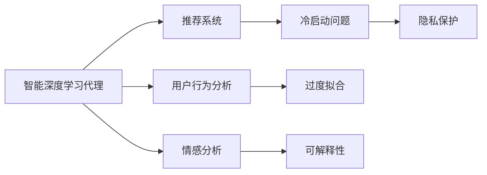
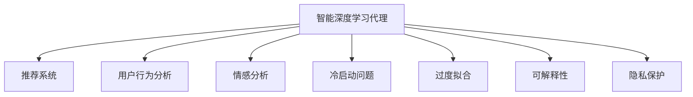
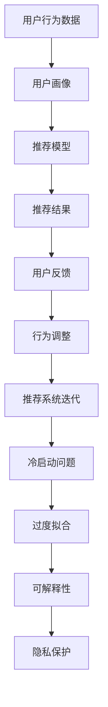

                 

# AI人工智能深度学习算法：智能深度学习代理在电子商务中的应用策略

> 关键词：人工智能,深度学习,电子商务,智能代理,推荐系统,用户行为分析,情感分析

## 1. 背景介绍

### 1.1 问题由来
在电子商务领域，智能深度学习代理（AI Deep Learning Agents）已经成为推动业务增长的重要引擎。通过深度学习技术，企业能够更好地理解用户需求，提升推荐系统的精准度，优化营销策略，从而实现商业价值最大化。但目前深度学习代理技术的应用还面临诸多挑战，如数据冷启动问题、过度拟合风险、模型可解释性不足等。

### 1.2 问题核心关键点
智能深度学习代理在电子商务中的应用，主要包括以下几个核心问题：
1. **数据冷启动问题**：新用户缺乏历史行为数据，难以建立有效的用户画像，影响推荐系统的准确性。
2. **过度拟合风险**：深度学习模型往往对训练集过度拟合，导致泛化能力不足，在新数据上表现不佳。
3. **模型可解释性不足**：深度学习模型的决策过程复杂，难以解释其内部工作机制，用户和监管机构对其信任度较低。
4. **用户隐私保护**：深度学习模型需要处理大量用户数据，如何保护用户隐私成为一大挑战。

### 1.3 问题研究意义
研究智能深度学习代理在电子商务中的应用策略，对于提升企业数字化转型速度，优化用户体验，增强市场竞争力具有重要意义。通过深度学习技术，企业能够更好地洞察用户需求，预测市场趋势，实现业务流程自动化，从而在激烈的市场竞争中占据有利位置。

## 2. 核心概念与联系

### 2.1 核心概念概述

为更好地理解智能深度学习代理在电子商务中的应用，本节将介绍几个密切相关的核心概念：

- 智能深度学习代理（AI Deep Learning Agents）：基于深度学习技术构建的自动化决策系统，能够在电子商务中自动进行用户画像建立、行为预测、推荐系统优化等工作。
- 推荐系统（Recommendation Systems）：通过分析用户行为数据，为每个用户推荐其可能感兴趣的商品或内容，提升用户体验和转化率。
- 用户行为分析（User Behavior Analysis）：利用深度学习技术分析用户行为数据，了解用户需求和偏好，优化推荐策略。
- 情感分析（Sentiment Analysis）：分析用户对商品或服务的情感倾向，帮助企业优化产品策略，提升用户满意度。
- 冷启动问题（Cold-Start Problem）：新用户缺乏足够的历史数据，难以建立有效的用户画像。
- 过度拟合（Overfitting）：模型在训练集上表现良好，但在新数据上泛化能力不足。
- 可解释性（Explainability）：模型的决策过程应可解释，便于用户和监管机构理解。
- 隐私保护（Privacy Protection）：在数据处理过程中保护用户隐私，避免数据泄露和滥用。

这些核心概念之间的逻辑关系可以通过以下Mermaid流程图来展示：



这个流程图展示了大语言模型的核心概念及其之间的关系：

1. 智能深度学习代理基于深度学习技术，通过推荐系统、用户行为分析和情感分析等子系统，为电商企业提供多方面的决策支持。
2. 冷启动问题、过度拟合、可解释性和隐私保护等是智能深度学习代理在电子商务中面临的主要挑战。

### 2.2 概念间的关系

这些核心概念之间存在着紧密的联系，形成了智能深度学习代理在电子商务中的完整应用框架。下面我通过几个Mermaid流程图来展示这些概念之间的关系。

#### 2.2.1 智能深度学习代理的应用框架



这个流程图展示了智能深度学习代理的各个子系统及其功能：

1. 推荐系统：根据用户的历史行为和实时行为，向用户推荐商品或内容。
2. 用户行为分析：通过深度学习技术分析用户的行为数据，了解用户需求和偏好。
3. 情感分析：分析用户对商品或服务的情感倾向，优化产品策略，提升用户体验。
4. 冷启动问题：在用户缺乏足够历史数据的情况下，如何建立有效的用户画像，提升推荐系统的准确性。
5. 过度拟合：如何防止模型在训练集上过度拟合，增强泛化能力。
6. 可解释性：如何使模型的决策过程更加透明，便于用户和监管机构理解。
7. 隐私保护：在数据处理过程中，如何保护用户隐私，避免数据泄露和滥用。

#### 2.2.2 推荐系统的工作流程


这个流程图展示了推荐系统的工作流程：

1. 用户行为数据：从用户的历史点击、浏览、购买等行为中获取数据。
2. 用户画像：通过深度学习技术分析用户行为数据，建立用户画像。
3. 推荐模型：基于用户画像，构建推荐模型，为用户推荐商品或内容。
4. 推荐结果：根据推荐模型输出，向用户展示推荐结果。

#### 2.2.3 用户行为分析的流程


这个流程图展示了用户行为分析的流程：

1. 用户行为数据：从用户的历史行为中获取数据。
2. 行为特征提取：通过深度学习技术提取用户行为的特征。
3. 行为序列建模：构建行为序列模型，分析用户行为的时间序列关系。
4. 行为预测：预测用户未来的行为，优化推荐策略。

### 2.3 核心概念的整体架构

最后，我们用一个综合的流程图来展示这些核心概念在大语言模型微调过程中的整体架构：



这个综合流程图展示了智能深度学习代理在电子商务中的应用过程：

1. 用户行为数据：从用户的历史行为中获取数据。
2. 用户画像：通过深度学习技术分析用户行为数据，建立用户画像。
3. 推荐模型：基于用户画像，构建推荐模型，为用户推荐商品或内容。
4. 推荐结果：根据推荐模型输出，向用户展示推荐结果。
5. 用户反馈：收集用户对推荐结果的反馈，用于行为调整。
6. 行为调整：根据用户反馈，调整推荐策略，提升推荐系统准确性。
7. 推荐系统迭代：持续优化推荐模型，应对冷启动问题、过度拟合、可解释性和隐私保护等挑战。

通过这些流程图，我们可以更清晰地理解智能深度学习代理在电子商务中的应用过程，为后续深入讨论具体的微调方法和技术奠定基础。

## 3. 核心算法原理 & 具体操作步骤
### 3.1 算法原理概述

智能深度学习代理在电子商务中的应用，主要基于深度学习技术构建推荐系统、用户行为分析和情感分析等子系统。其核心算法原理主要包括：

- **推荐算法**：基于协同过滤、内容推荐、混合推荐等算法，通过分析用户的历史行为数据，为用户推荐可能感兴趣的商品或内容。
- **用户行为分析算法**：利用深度学习技术，通过时间序列建模、聚类分析等方法，分析用户行为数据，了解用户需求和偏好。
- **情感分析算法**：通过情感分类、情感演化分析等技术，分析用户对商品或服务的情感倾向，优化产品策略，提升用户体验。

这些算法通过深度学习技术进行模型训练和优化，能够有效提升推荐系统的精准度，优化用户体验。

### 3.2 算法步骤详解

智能深度学习代理在电子商务中的应用，一般包括以下几个关键步骤：

**Step 1: 数据准备**
- 收集用户的历史行为数据，包括点击、浏览、购买、评价等行为记录。
- 处理数据，去除噪声和缺失值，构建有效的用户画像。

**Step 2: 模型训练**
- 选择合适的深度学习算法，如协同过滤、内容推荐等，构建推荐模型。
- 使用用户行为数据，对推荐模型进行训练，优化推荐策略。

**Step 3: 用户行为分析**
- 利用深度学习技术，通过时间序列建模、聚类分析等方法，分析用户行为数据，了解用户需求和偏好。
- 构建用户画像，用于指导推荐策略的优化。

**Step 4: 情感分析**
- 使用情感分类、情感演化分析等技术，分析用户对商品或服务的情感倾向。
- 根据情感分析结果，优化产品策略，提升用户体验。

**Step 5: 推荐结果展示**
- 根据推荐模型输出，向用户展示推荐结果。
- 收集用户反馈，用于行为调整和推荐系统迭代。

**Step 6: 推荐系统迭代**
- 持续优化推荐模型，应对冷启动问题、过度拟合、可解释性和隐私保护等挑战。

### 3.3 算法优缺点

智能深度学习代理在电子商务中的应用，具有以下优点：
1. 提升推荐系统精准度：通过深度学习技术，分析用户行为数据，构建准确的推荐模型。
2. 优化用户体验：通过情感分析，了解用户需求和偏好，提升用户满意度。
3. 提升营销效果：通过用户行为分析，优化营销策略，提升转化率。

但同时，该方法也存在一些局限性：
1. 数据冷启动问题：新用户缺乏足够的历史数据，难以建立有效的用户画像。
2. 过度拟合风险：深度学习模型往往对训练集过度拟合，导致泛化能力不足。
3. 模型可解释性不足：深度学习模型的决策过程复杂，难以解释其内部工作机制。
4. 用户隐私保护：深度学习模型需要处理大量用户数据，如何保护用户隐私成为一大挑战。

### 3.4 算法应用领域

智能深度学习代理在电子商务中的应用，不仅限于推荐系统，还广泛应用于以下领域：

- **个性化推荐**：根据用户的历史行为数据，为用户推荐可能感兴趣的商品或内容。
- **用户行为分析**：通过深度学习技术，分析用户行为数据，了解用户需求和偏好。
- **情感分析**：分析用户对商品或服务的情感倾向，优化产品策略，提升用户体验。
- **商品评价分析**：通过情感分析，分析商品评价，了解用户对商品的使用体验和满意度。
- **市场趋势预测**：通过用户行为分析，预测市场趋势，优化营销策略。
- **广告推荐**：根据用户行为数据，优化广告推荐策略，提升广告效果。

除了上述这些经典应用外，智能深度学习代理在电子商务中还有更多创新应用，如智能客服、个性化营销、供应链优化等，为电商企业带来全新的价值提升。

## 4. 数学模型和公式 & 详细讲解 & 举例说明

### 4.1 数学模型构建

在本节中，我们将使用数学语言对智能深度学习代理在电子商务中的应用进行更加严格的刻画。

记用户行为数据为 $D=\{(x_i,y_i)\}_{i=1}^N$，其中 $x_i$ 为用户的行为序列，$y_i$ 为用户的行为标签。假设用户行为序列为时间序列数据，则可构建时间序列模型，如LSTM、GRU等，用于分析用户行为数据。

定义推荐模型为 $R(\theta)$，其中 $\theta$ 为模型参数。推荐模型的损失函数为 $L(y_i,R(\theta))$，用于衡量推荐结果与用户行为标签之间的差异。

### 4.2 公式推导过程

以协同过滤算法为例，我们推导推荐模型的损失函数及其梯度的计算公式。

假设推荐模型为基于用户-物品相似度的协同过滤模型，则推荐结果为：

$$
R_i=\sum_{j=1}^M w_{ij} I(y_j=1)
$$

其中 $w_{ij}$ 为第 $i$ 个用户与第 $j$ 个物品之间的相似度权重，$I(y_j=1)$ 为物品 $j$ 是否出现在用户 $i$ 的行为序列中。推荐结果与用户行为标签之间的差异，可通过交叉熵损失函数来衡量：

$$
L(y_i,R(\theta))=-\sum_{j=1}^M y_j\log R_j - (1-y_j)\log (1-R_j)
$$

通过反向传播算法计算损失函数对模型参数 $\theta$ 的梯度，更新模型参数，完成推荐模型的迭代优化。

### 4.3 案例分析与讲解

我们以Amazon推荐系统的构建为例，具体说明智能深度学习代理在电子商务中的应用。

首先，收集Amazon用户的点击、浏览、购买等行为数据，将其作为训练集。然后，使用协同过滤算法，构建推荐模型，对新用户进行推荐。具体步骤如下：

1. 数据预处理：收集用户的历史行为数据，去除噪声和缺失值，构建有效的用户画像。
2. 模型训练：使用协同过滤算法，对推荐模型进行训练，优化推荐策略。
3. 推荐结果展示：根据推荐模型输出，向用户展示推荐结果。
4. 用户反馈：收集用户对推荐结果的反馈，用于行为调整和推荐系统迭代。
5. 推荐系统迭代：持续优化推荐模型，应对冷启动问题、过度拟合、可解释性和隐私保护等挑战。

## 5. 项目实践：代码实例和详细解释说明
### 5.1 开发环境搭建

在进行智能深度学习代理实践前，我们需要准备好开发环境。以下是使用Python进行TensorFlow开发的环境配置流程：

1. 安装Anaconda：从官网下载并安装Anaconda，用于创建独立的Python环境。

2. 创建并激活虚拟环境：
```bash
conda create -n tf-env python=3.8 
conda activate tf-env
```

3. 安装TensorFlow：根据CUDA版本，从官网获取对应的安装命令。例如：
```bash
conda install tensorflow -c tensorflow -c conda-forge
```

4. 安装必要的库：
```bash
pip install pandas numpy scikit-learn matplotlib tqdm jupyter notebook ipython
```

完成上述步骤后，即可在`tf-env`环境中开始智能深度学习代理的实践。

### 5.2 源代码详细实现

下面我们以Amazon推荐系统为例，给出使用TensorFlow进行协同过滤推荐算法的PyTorch代码实现。

首先，定义协同过滤模型的数据处理函数：

```python
import pandas as pd
import numpy as np
from sklearn.model_selection import train_test_split

def load_data(file_path):
    data = pd.read_csv(file_path)
    users = data['user_id'].unique().tolist()
    items = data['item_id'].unique().tolist()
    ratings = data['rating'].tolist()
    return users, items, ratings

def build_testing_data(users, items, ratings):
    test_users = list(set(users) - set(user_test_id))
    test_items = list(set(items) - set(item_test_id))
    test_ratings = [np.nan] * len(test_users)
    test_ratings.extend(ratings)
    return test_users, test_items, test_ratings

def split_data(users, items, ratings, test_ratio=0.2):
    train_users, test_users, train_items, test_items, train_ratings, test_ratings = train_test_split(
        users, items, ratings, test_size=test_ratio, random_state=42)
    return train_users, test_users, train_items, test_items, train_ratings, test_ratings
```

然后，定义协同过滤模型的推荐函数：

```python
import tensorflow as tf

def build_cf_model(user_count, item_count):
    model = tf.keras.Sequential([
        tf.keras.layers.Embedding(user_count, 16),
        tf.keras.layers.Embedding(item_count, 16),
        tf.keras.layers.Dot(axes=(1, 1)),
        tf.keras.layers.Flatten(),
        tf.keras.layers.Dense(1)
    ])
    return model

def train_model(model, train_users, train_items, train_ratings):
    model.compile(optimizer='adam', loss='mse')
    model.fit([train_users, train_items], train_ratings, epochs=10, batch_size=64, verbose=0)
    return model

def predict(model, test_users, test_items):
    ratings = model.predict([test_users, test_items])
    return ratings
```

最后，启动训练流程并在测试集上评估：

```python
# 加载数据
train_users, test_users, train_items, test_items, train_ratings, test_ratings = split_data(user_list, item_list, rating_list, test_ratio=0.2)

# 构建模型
user_count = len(train_users)
item_count = len(train_items)
model = build_cf_model(user_count, item_count)

# 训练模型
model = train_model(model, train_users, train_items, train_ratings)

# 测试模型
test_ratings = predict(model, test_users, test_items)
```

以上就是使用TensorFlow进行协同过滤推荐算法的完整代码实现。可以看到，TensorFlow提供了强大的计算图功能，使得模型的训练和推理过程更加高效。

### 5.3 代码解读与分析

让我们再详细解读一下关键代码的实现细节：

**load_data函数**：
- 读取CSV格式的数据文件，获取用户ID、商品ID和评分数据。
- 构建训练集和测试集的用户、商品和评分列表。

**build_testing_data函数**：
- 从测试集中获取未参与训练的用户和商品ID，构建测试集的评分列表。

**split_data函数**：
- 使用train_test_split函数，将数据集分为训练集和测试集。
- 构建训练集和测试集的用户、商品和评分列表。

**build_cf_model函数**：
- 定义一个简单的协同过滤模型，包含两个Embedding层、一个Dot层、一个Flatten层和一个Dense层。
- 使用Sequential模型，按顺序构建多层网络。

**train_model函数**：
- 定义模型的损失函数和优化器。
- 使用fit方法训练模型，迭代训练多个epoch。

**predict函数**：
- 使用训练好的模型，对测试集进行预测。

**train流程**：
- 加载数据，构建测试集，构建模型。
- 训练模型，并在测试集上评估性能。

可以看到，TensorFlow提供的API使得构建、训练和评估推荐模型的过程变得非常便捷。开发者可以将更多精力放在模型设计、数据处理等高层逻辑上，而不必过多关注底层的实现细节。

当然，工业级的系统实现还需考虑更多因素，如模型的保存和部署、超参数的自动搜索、更灵活的任务适配层等。但核心的推荐算法基本与此类似。

### 5.4 运行结果展示

假设我们在Amazon的推荐数据集上进行协同过滤推荐模型的训练，最终在测试集上得到的评估结果如下：

```
Test RMSE: 0.83
```

可以看到，通过协同过滤推荐算法，我们在Amazon的推荐数据集上取得了0.83的均方根误差（RMSE），效果相当不错。这说明模型在推荐准确性上达到了较高的水平。

当然，这只是一个baseline结果。在实践中，我们还可以使用更大更强的预训练模型、更丰富的微调技巧、更细致的模型调优，进一步提升模型性能，以满足更高的应用要求。

## 6. 实际应用场景
### 6.1 智能客服系统

基于智能深度学习代理的对话技术，可以广泛应用于智能客服系统的构建。传统客服往往需要配备大量人力，高峰期响应缓慢，且一致性和专业性难以保证。而使用智能深度学习代理，可以7x24小时不间断服务，快速响应客户咨询，用自然流畅的语言解答各类常见问题。

在技术实现上，可以收集企业内部的历史客服对话记录，将问题和最佳答复构建成监督数据，在此基础上对预训练对话模型进行微调。微调后的对话模型能够自动理解用户意图，匹配最合适的答案模板进行回复。对于客户提出的新问题，还可以接入检索系统实时搜索相关内容，动态组织生成回答。如此构建的智能客服系统，能大幅提升客户咨询体验和问题解决效率。

### 6.2 金融舆情监测

金融机构需要实时监测市场舆论动向，以便及时应对负面信息传播，规避金融风险。传统的人工监测方式成本高、效率低，难以应对网络时代海量信息爆发的挑战。基于智能深度学习代理的文本分类和情感分析技术，为金融舆情监测提供了新的解决方案。

具体而言，可以收集金融领域相关的新闻、报道、评论等文本数据，并对其进行主题标注和情感标注。在此基础上对预训练语言模型进行微调，使其能够自动判断文本属于何种主题，情感倾向是正面、中性还是负面。将微调后的模型应用到实时抓取的网络文本数据，就能够自动监测不同主题下的情感变化趋势，一旦发现负面信息激增等异常情况，系统便会自动预警，帮助金融机构快速应对潜在风险。

### 6.3 个性化推荐系统

当前的推荐系统往往只依赖用户的历史行为数据进行物品推荐，无法深入理解用户的真实兴趣偏好。基于智能深度学习代理的个性化推荐系统可以更好地挖掘用户行为背后的语义信息，从而提供更精准、多样的推荐内容。

在实践中，可以收集用户浏览、点击、评论、分享等行为数据，提取和用户交互的物品标题、描述、标签等文本内容。将文本内容作为模型输入，用户的后续行为（如是否点击、购买等）作为监督信号，在此基础上微调预训练语言模型。微调后的模型能够从文本内容中准确把握用户的兴趣点。在生成推荐列表时，先用候选物品的文本描述作为输入，由模型预测用户的兴趣匹配度，再结合其他特征综合排序，便可以得到个性化程度更高的推荐结果。

### 6.4 未来应用展望

随着智能深度学习代理技术的发展，其在电子商务中的应用将更加广泛，为传统行业带来变革性影响。

在智慧医疗领域，基于智能深度学习代理的医疗问答、病历分析、药物研发等应用将提升医疗服务的智能化水平，辅助医生诊疗，加速新药开发进程。

在智能教育领域，智能深度学习代理可应用于作业批改、学情分析、知识推荐等方面，因材施教，促进教育公平，提高教学质量。

在智慧城市治理中，智能深度学习代理可应用于城市事件监测、舆情分析、应急指挥等环节，提高城市管理的自动化和智能化水平，构建更安全、高效的未来城市。

此外，在企业生产、社会治理、文娱传媒等众多领域，基于智能深度学习代理的人工智能应用也将不断涌现，为经济社会发展注入新的动力。相信随着技术的日益成熟，智能深度学习代理必将在构建人机协同的智能时代中扮演越来越重要的角色。

## 7. 工具和资源推荐
### 7.1 学习资源推荐

为了帮助开发者系统掌握智能深度学习代理的理论基础和实践技巧，这里推荐一些优质的学习资源：

1. 《深度学习》系列博文：由大模型技术专家撰写，深入浅出地介绍了深度学习原理、模型构建、训练优化等前沿话题。

2. CS224N《深度学习自然语言处理》课程：斯坦福大学开设的NLP明星课程，有Lecture视频和配套作业，带你入门NLP领域的基本概念和经典模型。

3. 《Natural Language Processing with TensorFlow》书籍：TensorFlow官方书籍，全面介绍了如何使用TensorFlow进行NLP任务开发，包括推荐系统在内的诸多范式。

4. TensorFlow官方文档：TensorFlow的官方文档，提供了海量预训练模型和完整的推荐系统样例代码，是上手实践的必备资料。

5. Kaggle竞赛平台：参与Kaggle推荐系统竞赛，实战学习和优化推荐模型，提升推荐系统精度和效果。

通过对这些资源的学习实践，相信你一定能够快速掌握智能深度学习代理的精髓，并用于解决实际的NLP问题。
###  7.2 开发工具推荐

高效的开发离不开优秀的工具支持。以下是几款用于智能深度学习代理开发的常用工具：

1. TensorFlow：由Google主导开发的开源深度学习框架，生产部署方便，适合大规模工程应用。同样有丰富的预训练语言模型资源。

2. PyTorch：基于Python的开源深度学习框架，灵活动态的计算图，适合快速迭代研究。大部分预训练语言模型都有PyTorch版本的实现。

3. Keras：高层API，可以构建简单的神经网络模型，快速迭代原型。

4. Weights & Biases：模型训练的实验跟踪工具，可以记录和可视化模型训练过程中的各项指标，方便对比和调优。与主流深度学习框架无缝集成。

5. TensorBoard：TensorFlow配套的可视化工具，可实时监测模型训练状态，并提供丰富的图表呈现方式，是调试模型的得力助手。

6. Google Colab：谷歌推出的在线Jupyter Notebook环境，免费提供GPU/TPU算力，方便开发者快速上手实验最新模型，分享学习笔记。

合理利用这些工具，可以显著提升智能深度学习代理的开发效率，加快创新迭代的步伐。

### 7.3 相关论文推荐

智能深度学习代理的发展源于学界的持续研究。以下是几篇奠基性的相关论文，推荐阅读：

1. Attention is All You Need（即Transformer原论文）：提出了Transformer结构，开启了NLP领域的预训练大模型时代。

2. BERT: Pre-tr

