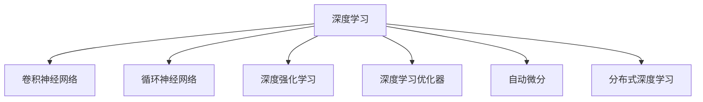
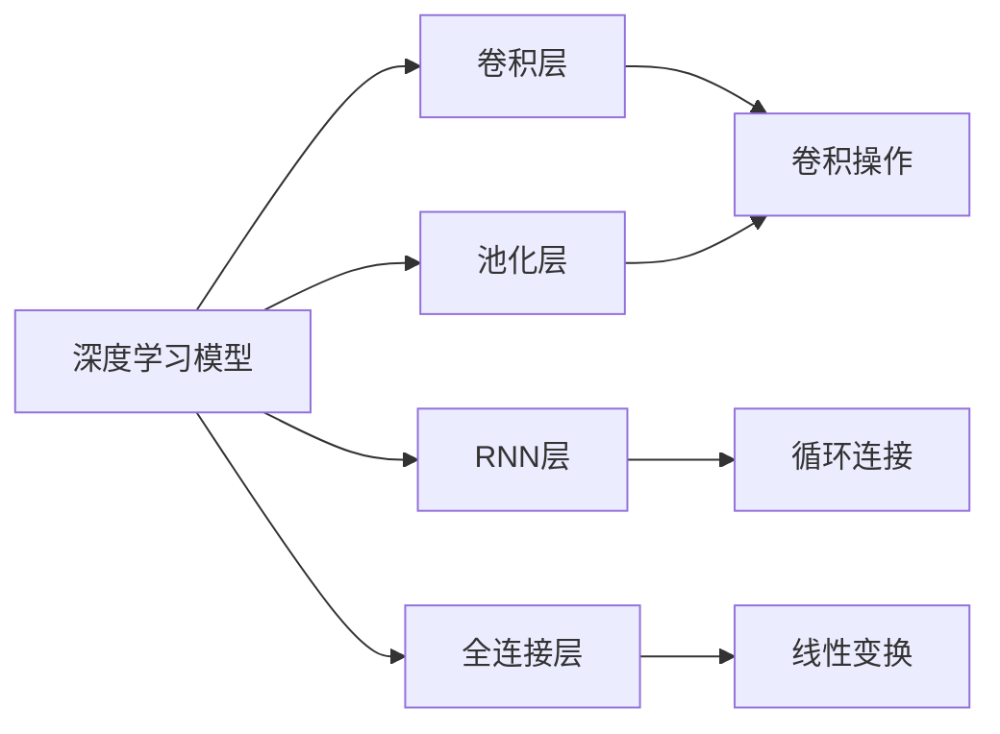
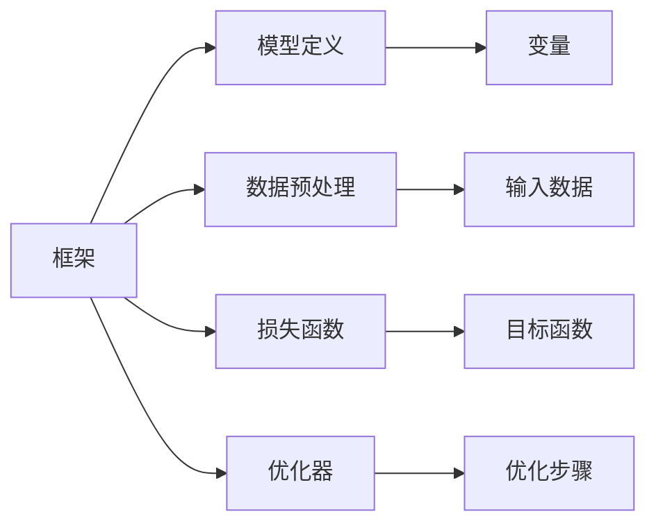
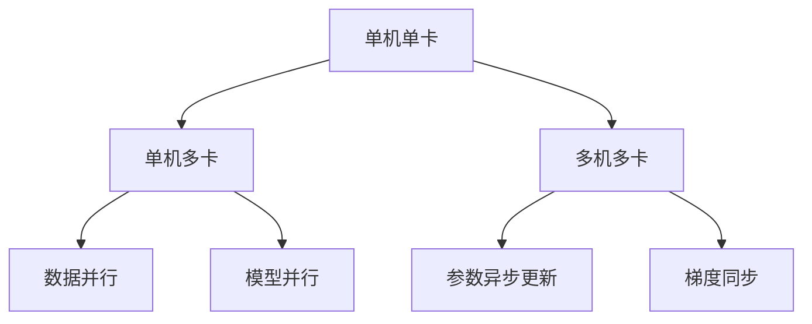
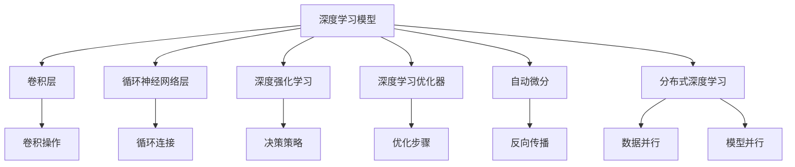

                 

# AI人工智能深度学习算法：深度学习软件框架的掌握与应用

> 关键词：深度学习, 软件框架, 神经网络, 卷积神经网络(CNN), 循环神经网络(RNN), 深度强化学习, 深度学习优化器, 自动微分, 分布式深度学习

## 1. 背景介绍

### 1.1 问题由来

近年来，深度学习技术的发展取得了显著成就，广泛应用于图像识别、自然语言处理、语音识别、推荐系统等多个领域，极大地推动了人工智能(AI)技术的发展。深度学习技术之所以能够在众多领域取得成功，离不开强大的深度学习软件框架的支持。

深度学习软件框架作为深度学习应用的底层基础设施，负责提供高效的计算引擎、灵活的模型定义接口、丰富的优化算法和调试工具，极大地方便了研究者、开发者对深度学习模型的开发、训练和部署。当前，市场上已经出现了多个优秀的深度学习框架，如TensorFlow、PyTorch、Caffe、MXNet等，极大地推动了深度学习技术的应用和普及。

然而，随着深度学习应用领域的不断扩大，模型的复杂度和规模不断增大，对深度学习软件框架的性能、易用性和可扩展性提出了更高的要求。因此，如何掌握和应用先进的深度学习软件框架，成为了当下AI技术人才必须面对的重要问题。

### 1.2 问题核心关键点

深度学习软件框架的核心关键点在于如何高效、灵活地构建和训练深度学习模型，以及如何优化模型的性能和可扩展性。具体而言，以下几个方面是关键：

1. **计算引擎和并行计算**：支持多核CPU、GPU、TPU等硬件资源的并行计算，最大化利用计算资源，提高训练速度和效率。
2. **自动微分与反向传播**：提供自动微分功能，自动计算梯度，简化模型的反向传播过程，减少手写梯度带来的错误。
3. **模型定义接口**：提供简洁、灵活的模型定义接口，方便研究者快速构建深度学习模型，支持自定义模型组件。
4. **优化算法和正则化**：提供丰富的优化算法（如SGD、Adam等）和正则化技术（如L1/L2正则、Dropout等），提高模型训练的稳定性和泛化性能。
5. **分布式训练和模型部署**：支持分布式深度学习，支持模型在多机多卡集群上的分布式训练，以及模型的推理部署和调优。
6. **调试工具和监控指标**：提供详细的调试工具和监控指标，帮助开发者快速定位问题，评估模型性能。

通过掌握这些关键点，开发者能够高效地构建、训练和部署深度学习模型，并进一步优化模型性能和可扩展性，以满足复杂的应用需求。

### 1.3 问题研究意义

掌握和应用深度学习软件框架，对于推动深度学习技术的发展和应用，具有重要意义：

1. **提升模型性能**：利用先进的计算引擎和优化算法，能够显著提升模型的训练速度和泛化性能。
2. **降低开发成本**：丰富的模型定义接口和调试工具，能够减少开发过程中的人力成本和时间成本。
3. **促进模型扩展**：支持分布式训练和模型部署，能够轻松应对大规模模型和高并发请求的挑战。
4. **加速应用落地**：简化的模型定义和推理部署，能够快速实现深度学习模型在实际应用场景中的部署和优化。
5. **推动技术创新**：先进的深度学习框架为前沿技术的研究提供了便利，促进了深度学习技术的不断创新。

## 2. 核心概念与联系

### 2.1 核心概念概述

为更好地理解深度学习软件框架的掌握与应用，本节将介绍几个密切相关的核心概念：

- **深度学习**：基于神经网络（Neural Network, NN）的机器学习技术，通过多层次的神经网络结构，实现对输入数据的复杂映射和模式识别。
- **卷积神经网络（Convolutional Neural Network, CNN）**：一种专门用于图像处理和计算机视觉任务的神经网络结构，通过卷积操作提取局部特征。
- **循环神经网络（Recurrent Neural Network, RNN）**：一种专门用于处理序列数据的神经网络结构，通过循环连接实现对序列数据的记忆和预测。
- **深度强化学习（Deep Reinforcement Learning, DRL）**：将深度学习和强化学习结合，用于解决复杂的决策和控制问题。
- **深度学习优化器（Optimizer）**：用于优化神经网络模型参数的算法，如SGD、Adam、Adagrad等。
- **自动微分（Automatic Differentiation）**：自动计算神经网络模型参数梯度的技术，支持链式法则和反向传播。
- **分布式深度学习（Distributed Deep Learning）**：将深度学习模型在多台机器上并行训练的技术，提高模型训练速度和效率。

这些核心概念之间的逻辑关系可以通过以下Mermaid流程图来展示：



这个流程图展示了几大核心概念之间的关系：

1. 深度学习是更高层次的抽象，包括卷积神经网络、循环神经网络和深度强化学习等多种子领域。
2. 深度学习优化器是深度学习模型的核心组件之一，用于优化模型参数。
3. 自动微分技术支持深度学习模型的训练过程，实现反向传播。
4. 分布式深度学习技术用于加速模型训练，提高效率。

### 2.2 概念间的关系

这些核心概念之间存在着紧密的联系，形成了深度学习软件框架的完整生态系统。下面我通过几个Mermaid流程图来展示这些概念之间的关系。

#### 2.2.1 深度学习模型的计算图



这个流程图展示了深度学习模型的基本组成单元，包括卷积层、池化层、RNN层和全连接层。

#### 2.2.2 深度学习框架的模型定义接口



这个流程图展示了深度学习框架的基本功能模块，包括模型定义、数据预处理、损失函数和优化器。

#### 2.2.3 深度学习框架的分布式训练



这个流程图展示了深度学习框架的分布式训练模式，包括单机单卡、单机多卡和多机多卡的分布式训练方式。

### 2.3 核心概念的整体架构

最后，我们用一个综合的流程图来展示这些核心概念在大语言模型微调过程中的整体架构：



这个综合流程图展示了从模型构建到分布式训练的完整过程。深度学习模型通过卷积层、循环神经网络层和深度强化学习等子模块，构建复杂的多层次网络结构。模型参数通过深度学习优化器优化，并利用自动微分进行反向传播。最终，模型在多机多卡集群上通过分布式深度学习技术进行并行训练，实现高效的计算加速。

## 3. 核心算法原理 & 具体操作步骤

### 3.1 算法原理概述

深度学习软件框架的核心算法原理主要包括自动微分、反向传播、优化算法和正则化技术。以下将详细介绍这些核心算法原理。

#### 3.1.1 自动微分与反向传播

自动微分技术是深度学习框架的核心功能之一，能够自动计算神经网络模型参数的梯度。具体而言，通过链式法则，深度学习框架可以自动推导复杂模型的梯度，实现高效的反向传播。这一过程通常包括以下几个步骤：

1. **正向传播**：将输入数据输入神经网络模型，计算模型的输出值。
2. **计算目标函数的梯度**：根据输出值和目标函数，计算梯度。
3. **反向传播**：将目标函数的梯度反向传播回神经网络的每个参数，计算参数的梯度。
4. **更新参数**：根据参数梯度，使用优化算法更新模型参数。

通过自动微分技术，深度学习框架能够简化神经网络模型的训练过程，减少手写梯度带来的错误。这一过程是深度学习框架实现深度学习模型的基础。

#### 3.1.2 深度学习优化算法

深度学习优化算法用于优化神经网络模型参数的梯度，通常包括以下几种：

1. **随机梯度下降（SGD）**：通过随机选择一个样本或小批量样本，计算梯度并更新模型参数。
2. **Adam（Adaptive Moment Estimation）**：结合动量梯度下降和自适应学习率，提高收敛速度和泛化性能。
3. **Adagrad（Adaptive Gradient Algorithm）**：根据历史梯度信息自适应调整学习率，适用于稀疏数据。
4. **RMSprop（Root Mean Square Propagation）**：对梯度平方进行平均，自适应调整学习率，提高收敛速度和稳定性。

不同的优化算法具有不同的特点和适用场景。选择适合的优化算法是深度学习模型训练的关键。

#### 3.1.3 正则化技术

正则化技术用于防止深度学习模型过拟合，提高模型的泛化性能。常用的正则化技术包括：

1. **L1正则化**：通过惩罚权重向量中的绝对值和，减小权重向量的规模，防止过拟合。
2. **L2正则化**：通过惩罚权重向量的平方和，减小权重向量的大小，防止过拟合。
3. **Dropout**：随机丢弃一部分神经元，减少神经元之间的依赖，提高模型的鲁棒性。
4. **Early Stopping**：在训练过程中监控验证集上的性能，一旦性能不再提升，则停止训练，防止过拟合。

这些正则化技术能够帮助深度学习模型更好地泛化到未见过的数据上，提高模型的性能和鲁棒性。

### 3.2 算法步骤详解

深度学习软件框架的核心算法步骤包括以下几个关键步骤：

**Step 1: 准备数据集**

- 收集训练数据和测试数据，并进行预处理。
- 将数据集划分为训练集、验证集和测试集，确保数据集的合理划分。
- 对数据进行归一化、标准化等预处理操作，以便于模型的训练。

**Step 2: 构建深度学习模型**

- 使用深度学习框架提供的模型定义接口，构建深度学习模型。
- 选择合适的神经网络结构（如卷积神经网络、循环神经网络等），设计网络层次结构。
- 定义损失函数，用于衡量模型输出与真实标签之间的差异。
- 选择优化算法，初始化模型参数。

**Step 3: 执行前向传播和反向传播**

- 将训练数据输入模型，进行前向传播，计算模型输出。
- 根据损失函数计算梯度，进行反向传播，更新模型参数。
- 在每个epoch中重复前向传播和反向传播过程，直到收敛。

**Step 4: 评估模型性能**

- 在测试集上评估模型性能，计算准确率、精度、召回率等指标。
- 使用混淆矩阵、ROC曲线等可视化工具，分析模型输出和真实标签之间的关系。
- 根据评估结果，调整模型参数和超参数，优化模型性能。

**Step 5: 模型部署**

- 将训练好的模型导出为可执行文件或可部署的模型库。
- 将模型部署到服务器或云平台上，进行实时推理和预测。
- 监控模型性能，进行调优和更新，保持模型的实时性和稳定性。

以上是深度学习软件框架的核心算法步骤，通过这些步骤，开发者能够高效地构建、训练和部署深度学习模型，实现高效、准确的深度学习应用。

### 3.3 算法优缺点

深度学习软件框架具有以下优点：

1. **高效计算**：支持并行计算，利用多核CPU、GPU、TPU等硬件资源，最大化利用计算资源，提高模型训练速度和效率。
2. **灵活建模**：提供简洁、灵活的模型定义接口，方便研究者快速构建深度学习模型，支持自定义模型组件。
3. **丰富算法**：提供丰富的优化算法和正则化技术，提高模型训练的稳定性和泛化性能。
4. **易于扩展**：支持分布式深度学习，支持模型在多机多卡集群上的分布式训练，以及模型的推理部署和调优。
5. **可视化工具**：提供详细的调试工具和监控指标，帮助开发者快速定位问题，评估模型性能。

然而，深度学习软件框架也存在以下缺点：

1. **学习曲线陡峭**：深度学习框架的学习曲线较陡峭，需要一定的时间和经验积累。
2. **模型复杂度高**：深度学习模型通常结构复杂，训练和推理过程较为复杂。
3. **资源需求高**：深度学习模型需要大量的计算资源和存储空间，对硬件设备的要求较高。
4. **调试难度大**：深度学习模型的调试过程较为复杂，需要一定的技巧和经验。

尽管存在这些缺点，但深度学习软件框架在深度学习领域的应用已经得到了广泛验证，极大地推动了深度学习技术的发展和应用。

### 3.4 算法应用领域

深度学习软件框架已经在多个领域得到了广泛的应用，以下是几个典型的应用场景：

**计算机视觉**

- **图像分类**：将图像数据输入卷积神经网络（CNN），通过多层次的卷积操作提取特征，进行图像分类。
- **目标检测**：利用卷积神经网络（CNN）进行图像分割和目标检测，识别图像中的物体和位置。
- **人脸识别**：利用卷积神经网络（CNN）和循环神经网络（RNN），提取人脸特征，进行人脸识别和验证。

**自然语言处理（NLP）**

- **文本分类**：将文本数据输入循环神经网络（RNN），通过多层次的循环连接提取特征，进行文本分类和情感分析。
- **机器翻译**：利用循环神经网络（RNN）和注意力机制，将源语言文本翻译成目标语言。
- **语音识别**：利用卷积神经网络（CNN）和循环神经网络（RNN），提取语音特征，进行语音识别和情感分析。

**推荐系统**

- **协同过滤**：利用深度学习模型进行用户和物品的嵌入表示，计算相似度，进行个性化推荐。
- **内容推荐**：利用深度学习模型提取文本和图像特征，进行内容推荐和个性化展示。

**医疗健康**

- **医学影像分析**：利用深度学习模型对医学影像进行分析和诊断，识别疾病和病变。
- **基因组分析**：利用深度学习模型对基因组数据进行分析和预测，进行基因诊断和疾病预测。

## 4. 数学模型和公式 & 详细讲解 & 举例说明

### 4.1 数学模型构建

在本节中，我们将使用数学语言对深度学习软件框架的核心算法进行更加严格的刻画。

记深度学习模型为 $f_{\theta}(x)$，其中 $\theta$ 为模型参数，$x$ 为输入数据。假设训练数据集为 $D=\{(x_i, y_i)\}_{i=1}^N$，其中 $x_i$ 为输入，$y_i$ 为标签。深度学习模型的目标是最小化经验风险，即：

$$
\mathcal{L}(\theta) = \frac{1}{N}\sum_{i=1}^N \ell(f_{\theta}(x_i), y_i)
$$

其中 $\ell$ 为损失函数，用于衡量模型输出与真实标签之间的差异。常见的损失函数包括交叉熵损失、均方误差损失等。

深度学习模型的优化目标是最小化损失函数，即找到最优参数：

$$
\theta^* = \mathop{\arg\min}_{\theta} \mathcal{L}(\theta)
$$

在实践中，我们通常使用基于梯度的优化算法（如SGD、Adam等）来近似求解上述最优化问题。设 $\eta$ 为学习率，$\lambda$ 为正则化系数，则参数的更新公式为：

$$
\theta \leftarrow \theta - \eta \nabla_{\theta}\mathcal{L}(\theta) - \eta\lambda\theta
$$

其中 $\nabla_{\theta}\mathcal{L}(\theta)$ 为损失函数对参数 $\theta$ 的梯度，可通过反向传播算法高效计算。

### 4.2 公式推导过程

以下我们以二分类任务为例，推导交叉熵损失函数及其梯度的计算公式。

假设模型 $f_{\theta}$ 在输入 $x$ 上的输出为 $\hat{y}=f_{\theta}(x) \in [0,1]$，表示样本属于正类的概率。真实标签 $y \in \{0,1\}$。则二分类交叉熵损失函数定义为：

$$
\ell(f_{\theta}(x),y) = -[y\log \hat{y} + (1-y)\log (1-\hat{y})]
$$

将其代入经验风险公式，得：

$$
\mathcal{L}(\theta) = -\frac{1}{N}\sum_{i=1}^N [y_i\log f_{\theta}(x_i)+(1-y_i)\log(1-f_{\theta}(x_i))]
$$

根据链式法则，损失函数对参数 $\theta_k$ 的梯度为：

$$
\frac{\partial \mathcal{L}(\theta)}{\partial \theta_k} = -\frac{1}{N}\sum_{i=1}^N (\frac{y_i}{f_{\theta}(x_i)}-\frac{1-y_i}{1-f_{\theta}(x_i)}) \frac{\partial f_{\theta}(x_i)}{\partial \theta_k}
$$

其中 $\frac{\partial f_{\theta}(x_i)}{\partial \theta_k}$ 可进一步递归展开，利用自动微分技术完成计算。

在得到损失函数的梯度后，即可带入参数更新公式，完成模型的迭代优化。重复上述过程直至收敛，最终得到适应下游任务的最优模型参数 $\theta^*$。

### 4.3 案例分析与讲解

我们以一个简单的图像分类任务为例，进行深度学习模型的构建和训练。

假设训练数据集为 MNIST 手写数字数据集，包含 60000 张 28x28 的灰度图像及其标签。首先，我们需要对数据集进行预处理，包括：

1. 加载数据集，并将数据转化为张量格式。
2. 对图像数据进行归一化，将像素值转换为 [0, 1] 的浮点数。
3. 将标签转换为独热编码，方便计算交叉熵损失。

接下来，我们将构建一个简单的卷积神经网络（CNN）模型，进行图像分类的训练和推理。

```python
import torch
import torch.nn as nn
import torch.optim as optim
from torchvision import datasets, transforms

# 加载数据集
train_data = datasets.MNIST(root='./data', train=True, download=True, transform=transforms.ToTensor())
test_data = datasets.MNIST(root='./data', train=False, download=True, transform=transforms.ToTensor())

# 数据预处理
train_loader = torch.utils.data.DataLoader(train_data, batch_size=64, shuffle=True)
test_loader = torch.utils.data.DataLoader(test_data, batch_size=64, shuffle=False)

# 构建模型
class Net(nn.Module):
    def __init__(self):
        super(Net, self).__init__()
        self.conv1 = nn.Conv2d(1, 32, 3, 1, 1)
        self.conv2 = nn.Conv2d(32, 64, 3, 1, 1)
        self.dropout1 = nn.Dropout2d(0.25)
        self.dropout2 = nn.Dropout2d(0.5)
        self.fc1 = nn.Linear(9216, 128)
        self.fc2 = nn.Linear(128, 10)

    def forward(self, x):
        x = self.conv1(x)
        x = nn.functional.relu(x)
        x = self.conv2(x)
        x = nn.functional.relu(x)
        x = nn.functional.max_pool2d(x, 2)
        x = self.dropout1(x)
        x = torch.flatten(x, 1)
        x = self.fc1(x)
        x = nn.functional.relu(x)
        x = self.dropout2(x)
        x = self.fc2(x)
        output = nn.functional.log_softmax(x, dim=1)
        return output

# 训练模型
model = Net()
criterion = nn.CrossEntropyLoss()
optimizer = optim.Adam(model.parameters(), lr=0.001)

for epoch in range(10):
    running_loss = 0.0
    for i, data in enumerate(train_loader, 0):
        inputs, labels = data
        optimizer.zero_grad()
        outputs = model(inputs)
        loss = criterion(outputs, labels)
        loss.backward()
        optimizer.step()

    print(f'Epoch {epoch+1}, loss: {running_loss/len(train_loader):.4f}')

# 评估模型
correct = 0
total = 0
with torch.no_grad():
    for data in test_loader:
        images, labels = data
        outputs = model(images)
        _, predicted = torch.max(outputs.data, 1)
        total += labels.size(0)
        correct += (predicted == labels).sum().item()

print(f'Accuracy: {(100 * correct / total):.2f}%')
```

通过上述代码，我们可以看到，利用深度学习框架，我们能够轻松地构建、训练和评估深度学习模型。深度学习框架提供的丰富的模型定义接口、优化算法和调试工具，大大简化了模型的开发过程，提高了模型的训练效率和性能。

## 5. 项目实践：代码实例和详细解释说明

### 5.1 开发环境搭建

在进行深度学习项目实践前，我们需要准备好开发环境。以下是使用Python进行TensorFlow开发的环境配置流程：

1. 安装Anaconda：从官网下载并安装Anaconda，用于创建独立的Python环境。

2. 创建并激活虚拟环境：
```bash
conda create -n tf-env python=3.8 
conda activate tf-env
```

3. 安装TensorFlow：根据CUDA版本，从官网获取对应的安装命令。例如：
```bash
conda install tensorflow=tensorflow-gpu=2.7.0 -c conda-forge
```

4. 安装TensorBoard：
```bash
pip install tensorboard
```

5. 安装PyTorch和相关工具包：
```bash
pip install torch torchvision torchaudio numpy pandas scikit-learn matplotlib tqdm jupyter notebook ipython
```

完成上述步骤后，即可在`tf-env`环境中开始深度学习项目实践。

### 5.2 源代码详细实现

这里我们以图像分类任务为例，给出使用TensorFlow构建和训练卷积神经网络的代码实现。

首先，定义数据集处理函数：

```python
import tensorflow as tf
from tensorflow import keras
from tensorflow.keras import layers

# 加载数据集
(x_train, y_train), (x_test, y_test) = keras.datasets.mnist.load_data()

# 数据预处理
x_train = x_train.astype('float32') / 255.0
x_test = x_test.astype('float32') / 255.0
y_train = keras.utils.to_categorical(y_train, 10)
y_test = keras.utils.to_categorical(y_test, 10)

# 定义数据集
train_dataset = tf.data.Dataset.from_tensor_slices((x_train, y_train))
train_dataset = train_dataset.shuffle(10000).batch(32)

test_dataset = tf.data.Dataset.from_tensor_slices((x_test, y_test))
test_dataset = test_dataset.batch(32)
```

然后，定义卷积神经网络模型：

```python
# 构建模型
model = keras.Sequential([
    keras.layers.Reshape(target_shape=(28, 28, 1), input_shape=(28, 28)),
    keras.layers.Conv2D(32, kernel_size=(3, 3), activation='relu'),
    keras.layers.MaxPooling2D(pool_size=(2, 2)),
    keras.layers.Conv2D(64, kernel_size=(3, 3), activation='relu'),
    keras.layers.MaxPooling2D(pool_size=(2, 2)),
    keras.layers.Flatten(),
    keras.layers.Dense(128, activation='relu'),
    keras.layers.Dropout(0.5),
    keras.layers.Dense(10, activation='softmax')
])
```

接着，定义训练和评估函数：

```python
# 训练函数
def train_epoch(model, dataset, batch_size, optimizer

