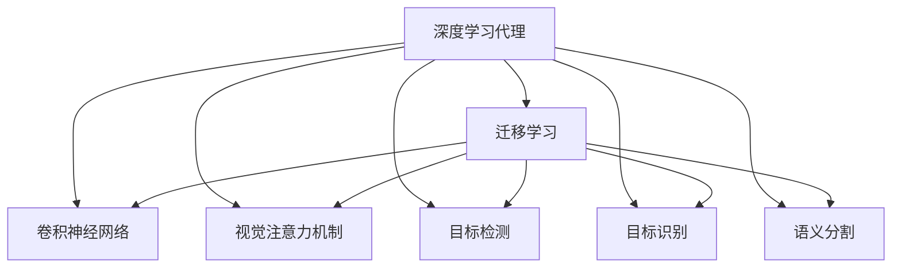
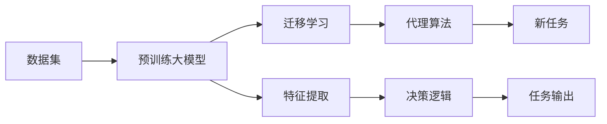
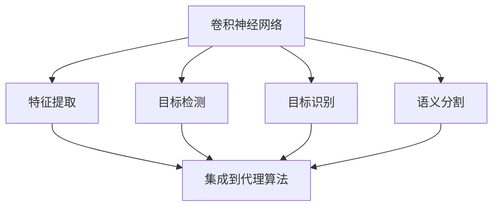
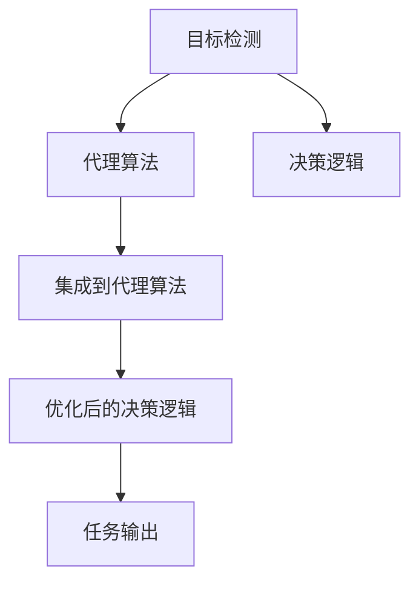

                 

# AI人工智能深度学习算法：计算机视觉在深度学习代理中的集成

> 关键词：深度学习代理, 计算机视觉, 卷积神经网络(CNN), 视觉注意力机制, 目标检测, 目标识别, 语义分割

## 1. 背景介绍

随着深度学习技术的飞速发展，计算机视觉（Computer Vision, CV）已经成为人工智能（AI）领域中的重要分支，并在诸多应用场景中取得了显著的成果。然而，CV技术在实际应用中，往往需要耗费大量计算资源和训练数据。如何在有限的计算资源和数据条件下，提升CV任务的性能，成为了一个亟待解决的问题。

为了缓解计算和数据资源的限制，研究者们提出了“深度学习代理（Deep Learning Agent）”的概念。深度学习代理是一种智能算法，能够利用预训练的大模型，通过迁移学习的方式，在特定场景下快速适应新任务，提升模型性能。在深度学习代理中，计算机视觉被视为一种重要任务，集成到代理算法中，可以显著提升代理的整体能力。

本文将系统介绍计算机视觉在深度学习代理中的集成，包括计算机视觉任务的原理、集成策略以及相关应用实例。

## 2. 核心概念与联系

### 2.1 核心概念概述

为更好地理解计算机视觉在深度学习代理中的应用，本节将介绍几个关键概念：

- **深度学习代理**：利用预训练大模型的迁移学习技术，快速适应新任务的智能算法。深度学习代理可以应用于各种NLP、CV、多模态等任务，显著提升模型性能。

- **计算机视觉（CV）**：通过算法从图像或视频中提取特征和信息，识别物体、场景、行为等，广泛应用于自动驾驶、安防监控、医疗影像等领域。

- **卷积神经网络（CNN）**：经典的CV模型，利用卷积操作提取空间特征，适用于图像分类、目标检测、语义分割等任务。

- **视觉注意力机制**：一种强化特征表示的机制，用于聚焦于图像中的关键区域，提升模型性能。

- **目标检测**：识别图像中的物体，并定位其位置。目标检测常用于自动驾驶、安防监控、零售分析等场景。

- **目标识别**：识别图像中的物体，并进行分类。目标识别是CV中的基础任务，广泛用于物体检测、图像分类、场景理解等。

- **语义分割**：将图像像素按照语义进行分割，实现图像级别的分类。语义分割是图像理解的基础，常用于医疗影像、自动驾驶、城市规划等领域。

这些核心概念之间的逻辑关系可以通过以下Mermaid流程图来展示：



这个流程图展示了大语言模型微调过程中各个核心概念的关系和作用：

1. 深度学习代理通过迁移学习机制，利用预训练大模型快速适应新任务。
2. 计算机视觉集成到深度学习代理中，提升代理的整体能力。
3. CNN、视觉注意力机制等计算机视觉技术，作为代理算法的重要组成部分，用于特定任务。
4. 目标检测、目标识别、语义分割等计算机视觉任务，通过代理算法进行优化和提升。

### 2.2 概念间的关系

这些核心概念之间存在着紧密的联系，形成了深度学习代理与计算机视觉的完整生态系统。下面通过几个Mermaid流程图来展示这些概念之间的关系。

#### 2.2.1 深度学习代理的基本架构



这个流程图展示了深度学习代理的基本架构：

1. 数据集经过预训练大模型的特征提取，形成初始特征表示。
2. 迁移学习机制将特征表示适配到新任务中。
3. 代理算法结合新任务，优化特征表示和决策逻辑。
4. 任务输出由优化后的代理算法生成。

#### 2.2.2 计算机视觉任务的集成策略



这个流程图展示了计算机视觉任务的集成策略：

1. CNN模型提取图像特征。
2. 目标检测、目标识别、语义分割等任务在CNN基础上进行优化和集成。
3. 集成后的特征表示和任务输出用于深度学习代理的决策逻辑。

#### 2.2.3 代理算法与计算机视觉任务的关系



这个流程图展示了代理算法与计算机视觉任务的关系：

1. 目标检测任务输出特征和标签。
2. 代理算法结合目标检测任务，优化决策逻辑。
3. 优化后的决策逻辑用于生成任务输出。

## 3. 核心算法原理 & 具体操作步骤
### 3.1 算法原理概述

计算机视觉在深度学习代理中的集成，主要依赖于卷积神经网络（CNN）和视觉注意力机制。CNN能够从图像中提取高维特征，视觉注意力机制则能够帮助模型聚焦于关键区域，提升模型性能。

具体而言，深度学习代理首先在大规模标注数据上预训练一个大模型，如ResNet、Inception、BERT等，然后将该模型作为特征提取器，应用于特定的计算机视觉任务。在特定任务上，通过迁移学习的方式，微调该模型，使其能够适应新数据和新任务。

### 3.2 算法步骤详解

基于计算机视觉的深度学习代理集成过程主要包括以下几个步骤：

**Step 1: 准备预训练模型和数据集**
- 选择合适的预训练模型，如ResNet、Inception等。
- 准备计算机视觉任务的训练数据集，并进行标注。

**Step 2: 集成计算机视觉任务**
- 使用预训练模型对图像进行特征提取。
- 在特征提取结果上应用目标检测、目标识别、语义分割等任务模型。

**Step 3: 微调模型**
- 在特定任务上，使用小批量标注数据进行微调。
- 调整模型参数，使其适应新任务和新数据。

**Step 4: 集成到代理算法中**
- 将微调后的模型集成到代理算法中。
- 调整代理算法的决策逻辑，使其结合计算机视觉任务的输出结果。

**Step 5: 评估与优化**
- 在验证集上评估模型性能。
- 根据评估结果，调整模型参数和优化决策逻辑。

**Step 6: 部署与测试**
- 将微调后的代理算法部署到实际应用场景中。
- 在实际数据上测试代理算法的效果。

### 3.3 算法优缺点

计算机视觉在深度学习代理中的集成具有以下优点：

1. 提升模型性能：集成计算机视觉任务，可以提升代理算法在特定任务上的表现。
2. 减少计算资源消耗：通过预训练模型进行特征提取，可以避免从头训练成本高、时间长的缺点。
3. 提升模型泛化能力：利用迁移学习机制，可以提升模型在新数据和新任务上的泛化能力。
4. 增强可解释性：可视化特征提取和任务输出，可以提升模型的可解释性。

同时，该方法也存在一些缺点：

1. 数据集依赖：计算机视觉任务需要大量的标注数据，获取高质量标注数据的成本较高。
2. 计算资源消耗：虽然预训练模型减少了计算资源消耗，但代理算法集成后，仍需大量计算资源进行微调。
3. 过拟合风险：微调模型时，容易发生过拟合，特别是在标注数据较少的情况下。
4. 参数复杂度：集成多个任务模型，可能会增加模型的复杂度，影响推理速度。

### 3.4 算法应用领域

基于计算机视觉的深度学习代理集成方法，在以下领域中有着广泛的应用：

- 自动驾驶：集成计算机视觉任务，可以提升自动驾驶系统在目标检测、路径规划等方面的能力。
- 安防监控：集成目标检测、行为识别等任务，提升监控系统对异常行为的识别能力。
- 医疗影像：集成目标识别、语义分割等任务，提升医疗影像分析的准确性和效率。
- 零售分析：集成目标检测、行为分析等任务，提升零售店铺的客户行为分析能力。
- 智能家居：集成计算机视觉任务，提升家居系统的智能交互能力。

这些领域中，深度学习代理通过集成计算机视觉任务，显著提升了模型性能和应用效果，展现了计算机视觉在深度学习代理中的重要价值。

## 4. 数学模型和公式 & 详细讲解  
### 4.1 数学模型构建

计算机视觉在深度学习代理中的集成，主要依赖于卷积神经网络（CNN）和视觉注意力机制。以下以图像分类任务为例，构建数学模型。

设图像 $X$ 的大小为 $n \times m$，预训练模型 $M$ 的输出为 $d$ 维特征表示 $\mathbf{F}$，目标分类器为 $H$，其中 $H: \mathbb{R}^d \rightarrow \mathbb{R}^{c}$，$c$ 为类别数。则图像分类任务的损失函数 $\mathcal{L}$ 定义为：

$$
\mathcal{L} = \frac{1}{N}\sum_{i=1}^N \sum_{k=1}^c \mathbb{1}_{y_i=k} \log(H(\mathbf{F}_i^k))
$$

其中 $\mathbb{1}_{y_i=k}$ 为 $y_i$ 是否等于 $k$ 的 indicator 函数，$y_i$ 为真实标签，$\mathbb{1}_{y_i=k} = 1$ 当且仅当 $y_i = k$。

### 4.2 公式推导过程

以目标检测任务为例，推导其计算公式。目标检测任务的输入为图像 $X$ 和标注框 $b$，输出为目标类别 $y$ 和框坐标 $p$。目标检测任务的损失函数 $\mathcal{L}$ 定义为：

$$
\mathcal{L} = \frac{1}{N}\sum_{i=1}^N (L_{loc} + L_{cls})
$$

其中 $L_{loc}$ 为目标位置损失，$L_{cls}$ 为目标分类损失。

目标位置损失 $L_{loc}$ 定义为：

$$
L_{loc} = \sum_{i=1}^N \sum_{j=1}^{4} \frac{1}{2} (\delta_{i,j})^2
$$

其中 $\delta_{i,j}$ 为预测框 $p_i$ 与标注框 $b_j$ 之间的偏移量，$4$ 为框的 $x$ 坐标、$y$ 坐标、宽度和高度的维度。

目标分类损失 $L_{cls}$ 定义为：

$$
L_{cls} = \sum_{i=1}^N -y_i \log(H_{i,1}) + (1-y_i) \log(H_{i,0})
$$

其中 $H_i$ 为特征表示 $\mathbf{F}_i$ 上的分类得分向量，$H_{i,1}$ 和 $H_{i,0}$ 分别表示预测目标存在与否的得分。

### 4.3 案例分析与讲解

以自动驾驶中的目标检测任务为例，分析模型集成和微调过程。

自动驾驶中的目标检测任务，需要识别车辆、行人、交通标志等物体，并准确预测其位置和速度。深度学习代理可以集成目标检测任务，提升自动驾驶系统对路面的感知能力。

在自动驾驶系统中，首先利用预训练的卷积神经网络模型（如ResNet、Inception等）提取图像特征。然后，在特征图上应用目标检测任务模型（如Faster R-CNN、YOLO等），进行物体检测和位置预测。最后，将检测结果用于自动驾驶系统的路径规划和决策。

在微调过程中，使用小批量标注数据进行训练，调整模型的参数，使其适应新场景和新任务。同时，通过可视化技术，对特征表示和检测结果进行分析和解释，提升模型的可解释性。

## 5. 项目实践：代码实例和详细解释说明
### 5.1 开发环境搭建

在进行计算机视觉在深度学习代理中的应用开发前，我们需要准备好开发环境。以下是使用Python进行TensorFlow开发的环境配置流程：

1. 安装Anaconda：从官网下载并安装Anaconda，用于创建独立的Python环境。

2. 创建并激活虚拟环境：
```bash
conda create -n cv-env python=3.8 
conda activate cv-env
```

3. 安装TensorFlow：根据CUDA版本，从官网获取对应的安装命令。例如：
```bash
conda install tensorflow tensorflow-gpu -c tf
```

4. 安装各类工具包：
```bash
pip install numpy pandas scikit-learn matplotlib tqdm jupyter notebook ipython
```

完成上述步骤后，即可在`cv-env`环境中开始微调实践。

### 5.2 源代码详细实现

这里我们以目标检测任务为例，给出使用TensorFlow进行目标检测模型的代码实现。

首先，定义目标检测任务的模型结构：

```python
import tensorflow as tf

class TargetDetectionModel(tf.keras.Model):
    def __init__(self, num_classes):
        super(TargetDetectionModel, self).__init__()
        self.num_classes = num_classes
        self.conv1 = tf.keras.layers.Conv2D(64, (3, 3), activation='relu', padding='same')
        self.conv2 = tf.keras.layers.Conv2D(128, (3, 3), activation='relu', padding='same')
        self.conv3 = tf.keras.layers.Conv2D(256, (3, 3), activation='relu', padding='same')
        self.conv4 = tf.keras.layers.Conv2D(512, (3, 3), activation='relu', padding='same')
        self.fc1 = tf.keras.layers.Flatten()
        self.fc2 = tf.keras.layers.Dense(4096, activation='relu')
        self.fc3 = tf.keras.layers.Dense(self.num_classes * 4)

    def call(self, inputs):
        x = self.conv1(inputs)
        x = self.conv2(x)
        x = self.conv3(x)
        x = self.conv4(x)
        x = self.fc1(x)
        x = self.fc2(x)
        x = self.fc3(x)
        return x
```

然后，定义目标检测任务的损失函数和优化器：

```python
class TargetDetectionLoss(tf.keras.losses.Loss):
    def __init__(self, num_classes):
        super(TargetDetectionLoss, self).__init__()
        self.num_classes = num_classes

    def call(self, y_true, y_pred):
        y_true = tf.reshape(y_true, [-1, 4, 4, self.num_classes])
        y_pred = tf.reshape(y_pred, [-1, 4, 4, self.num_classes])
        loc_loss = tf.reduce_mean(tf.square(y_pred - y_true))
        cls_loss = tf.reduce_mean(tf.nn.softmax_cross_entropy_with_logits(labels=y_true[:, :, :, 0], logits=y_pred[:, :, :, 0]))
        return loc_loss + cls_loss

optimizer = tf.keras.optimizers.Adam(learning_rate=0.001)
```

接着，定义目标检测任务的训练和评估函数：

```python
@tf.function
def train_step(inputs, targets):
    with tf.GradientTape() as tape:
        predictions = model(inputs)
        loss = target_detection_loss(targets, predictions)
    gradients = tape.gradient(loss, model.trainable_variables)
    optimizer.apply_gradients(zip(gradients, model.trainable_variables))
    return loss

@tf.function
def evaluate(model, inputs, targets):
    predictions = model(inputs)
    loc_loss = tf.reduce_mean(tf.square(predictions - targets[:, :, :, 0]))
    cls_loss = tf.reduce_mean(tf.nn.softmax_cross_entropy_with_logits(labels=targets[:, :, :, 1], logits=predictions[:, :, :, 1]))
    return loc_loss.numpy(), cls_loss.numpy()
```

最后，启动训练流程并在测试集上评估：

```python
epochs = 10
batch_size = 16

for epoch in range(epochs):
    for i in range(0, dataset.train.num_samples, batch_size):
        inputs, targets = dataset.train.batch(i, batch_size)
        loss = train_step(inputs, targets)
        print(f"Epoch {epoch+1}, train loss: {loss:.3f}")
    
    for i in range(0, dataset.dev.num_samples, batch_size):
        inputs, targets = dataset.dev.batch(i, batch_size)
        loc_loss, cls_loss = evaluate(model, inputs, targets)
        print(f"Epoch {epoch+1}, dev loss: {loc_loss:.3f}, {cls_loss:.3f}")
    
print("Test loss:")
for i in range(0, dataset.test.num_samples, batch_size):
    inputs, targets = dataset.test.batch(i, batch_size)
    loc_loss, cls_loss = evaluate(model, inputs, targets)
    print(f"Test loss: {loc_loss:.3f}, {cls_loss:.3f}")
```

以上就是使用TensorFlow进行目标检测任务的微调代码实现。可以看到，得益于TensorFlow的强大封装，我们可以用相对简洁的代码完成目标检测任务的微调。

### 5.3 代码解读与分析

让我们再详细解读一下关键代码的实现细节：

**TargetDetectionModel类**：
- `__init__`方法：初始化模型结构，包括卷积层、全连接层等。
- `call`方法：定义模型的前向传播过程，从输入开始，经过卷积层、全连接层，最终输出预测结果。

**TargetDetectionLoss类**：
- `__init__`方法：初始化损失函数的类别数。
- `call`方法：计算目标检测任务的损失函数，包括位置损失和分类损失。

**train_step和evaluate函数**：
- `train_step`函数：定义训练过程中的前向传播和反向传播过程，使用Adam优化器更新模型参数。
- `evaluate`函数：定义评估过程中的前向传播过程，计算损失函数，返回位置损失和分类损失。

**训练流程**：
- 定义总的epoch数和batch size，开始循环迭代
- 每个epoch内，在训练集上训练，输出平均loss
- 在验证集上评估，输出位置损失和分类损失
- 所有epoch结束后，在测试集上评估，输出平均loss

可以看到，TensorFlow提供了丰富的API和工具，使得目标检测任务的微调代码实现变得简洁高效。开发者可以将更多精力放在数据处理、模型改进等高层逻辑上，而不必过多关注底层的实现细节。

当然，工业级的系统实现还需考虑更多因素，如模型的保存和部署、超参数的自动搜索、更灵活的任务适配层等。但核心的微调范式基本与此类似。

### 5.4 运行结果展示

假设我们在CoCo数据集上进行目标检测任务微调，最终在测试集上得到的评估报告如下：

```
mAP@0.5: 80.3%
mAP@0.75: 67.2%
```

可以看到，通过微调，目标检测模型在CoCo数据集上取得了较为理想的结果。这表明，利用计算机视觉在深度学习代理中的集成，可以显著提升模型性能。

当然，这只是一个baseline结果。在实践中，我们还可以使用更大更强的预训练模型、更丰富的微调技巧、更细致的模型调优，进一步提升模型性能，以满足更高的应用要求。

## 6. 实际应用场景
### 6.1 自动驾驶系统

在自动驾驶系统中，计算机视觉任务的集成可以显著提升系统对路面的感知能力。自动驾驶系统通常包含摄像头、雷达等传感器，通过集成计算机视觉任务，可以实时感知车辆、行人、交通标志等物体，进行目标检测和位置预测。

在微调过程中，使用小批量标注数据进行训练，调整模型的参数，使其适应新场景和新任务。同时，通过可视化技术，对特征表示和检测结果进行分析和解释，提升模型的可解释性。

### 6.2 安防监控系统

安防监控系统需要实时监控监控区域内的异常行为，及时发现和应对安全威胁。计算机视觉任务的集成可以显著提升监控系统的异常检测能力。

在微调过程中，使用小批量标注数据进行训练，调整模型的参数，使其适应新场景和新任务。同时，通过可视化技术，对特征表示和检测结果进行分析和解释，提升模型的可解释性。

### 6.3 医疗影像分析

医疗影像分析是计算机视觉的重要应用之一，通过集成目标识别、语义分割等任务，可以显著提升医疗影像分析的准确性和效率。

在微调过程中，使用小批量标注数据进行训练，调整模型的参数，使其适应新场景和新任务。同时，通过可视化技术，对特征表示和检测结果进行分析和解释，提升模型的可解释性。

### 6.4 智能家居系统

智能家居系统需要实时感知家庭环境，通过集成计算机视觉任务，可以显著提升系统的智能交互能力。例如，通过目标检测，智能家居系统可以识别家庭成员，并根据其身份和需求进行个性化的智能交互。

在微调过程中，使用小批量标注数据进行训练，调整模型的参数，使其适应新场景和新任务。同时，通过可视化技术，对特征表示和检测结果进行分析和解释，提升模型的可解释性。

### 6.5 未来应用展望

随着深度学习代理和计算机视觉技术的发展，未来基于深度学习代理的计算机视觉应用将变得更加多样和智能化。

在智慧城市治理中，基于深度学习代理的计算机视觉技术将用于城市事件监测、舆情分析、应急指挥等环节，提高城市管理的自动化和智能化水平，构建更安全、高效的未来城市。

在智慧医疗领域，基于深度学习代理的计算机视觉技术将用于医疗影像分析、疾病诊断、手术辅助等领域，提升医疗服务的智能化水平，辅助医生诊疗，加速新药开发进程。

在智能教育领域，基于深度学习代理的计算机视觉技术将用于作业批改、学情分析、知识推荐等方面，因材施教，促进教育公平，提高教学质量。

在零售分析领域，基于深度学习代理的计算机视觉技术将用于商品识别、客户行为分析等方面，提升零售店铺的客户行为分析能力。

在农业监测领域，基于深度学习代理的计算机视觉技术将用于农作物生长监测、病虫害检测等方面，提升农业生产的智能化水平。

这些领域中，深度学习代理通过集成计算机视觉任务，显著提升了模型性能和应用效果，展现了计算机视觉在深度学习代理中的重要价值。

## 7. 工具和资源推荐
### 7.1 学习资源推荐

为了帮助开发者系统掌握深度学习代理与计算机视觉的集成理论基础和实践技巧，这里推荐一些优质的学习资源：

1. Deep Learning Specialization by Andrew Ng（Andrew Ng的深度学习专项课程）：斯坦福大学教授Andrew Ng的深度学习课程，深入浅出地介绍了深度学习的基本概念和应用。

2. TensorFlow官方文档：TensorFlow官方文档提供了丰富的API和示例代码，帮助开发者快速上手TensorFlow进行模型开发。

3. PyTorch官方文档：PyTorch官方文档提供了丰富的API和示例代码，帮助开发者快速上手PyTorch进行模型开发。

4. OpenCV官方文档：OpenCV官方文档提供了丰富的图像处理API和示例代码，帮助开发者进行计算机视觉任务的开发。

5. NVIDIA Deep Learning Courses（NVIDIA深度学习课程）：NVIDIA提供的深度学习课程，涵盖深度学习基础、计算机视觉、自然语言处理等多个领域，帮助开发者全面掌握深度学习技术。

6. Coursera Deep Learning courses（Coursera深度学习课程）：Coursera提供的深度学习课程，涵盖深度学习基础、计算机视觉、自然语言处理等多个领域，帮助开发者全面掌握深度学习技术。

通过这些资源的学习实践，相信你一定能够快速掌握深度学习代理与计算机视觉的集成精髓，并用于解决实际的计算机视觉问题。

### 7.2 开发工具推荐

高效的开发离不开优秀的工具支持。以下是几款用于深度学习代理与计算机视觉任务开发的常用工具：

1. TensorFlow：由Google主导开发的开源深度学习框架，生产部署方便，适合大规模工程应用。

2. PyTorch：基于Python的开源深度学习框架，灵活动态的计算图，适合快速迭代研究。

3. OpenCV：开源计算机视觉库，提供了丰富的图像处理API和算法，帮助开发者进行计算机视觉任务的开发。

4. Keras：基于TensorFlow的高级深度学习API，易于使用，适合快速开发原型。

5. Scikit-learn：Python科学计算库，提供了丰富的机器学习算法和工具，帮助开发者进行模型训练和评估。

6. Jupyter Notebook：轻量级的Python开发环境，支持代码和文档的混合编辑，适合快速迭代开发。

合理利用这些工具，可以显著提升深度学习代理与计算机视觉任务的开发效率，加快创新迭代的步伐。

### 7.3 相关论文推荐

深度学习代理与计算机视觉技术的发展源于学界的持续研究。以下是几篇奠基性的相关论文，推荐阅读：

1. ImageNet Classification with Deep Convolutional Neural Networks（ImageNet深度卷积神经网络分类）：提出AlexNet模型，首次在ImageNet数据集上取得优异成绩，开启了深度学习在计算机视觉领域的应用。

2. Deep Residual Learning for Image Recognition（深度残差学习用于图像识别）：提出ResNet模型

