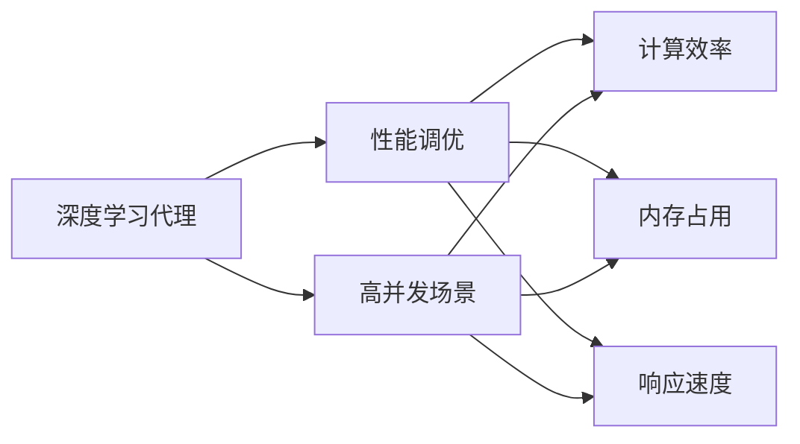

                 

# AI人工智能深度学习算法：高并发场景下深度学习代理的性能调优

## 1. 背景介绍

在当今数字经济时代，高并发场景下的深度学习模型应用越来越广泛，涉及自动驾驶、工业控制、金融交易、智能推荐等诸多领域。但在大规模高并发的场景下，深度学习模型面临着诸如计算资源有限、网络延迟、数据分布不均等挑战，性能调优成为亟待解决的难题。本文聚焦于高并发场景下深度学习代理的性能调优，通过系统深入地分析和实践，为深度学习模型在高并发环境中的应用提供指导。

## 2. 核心概念与联系

### 2.1 核心概念概述

为了更好地理解高并发场景下深度学习代理的性能调优，我们需要先掌握一些关键概念：

- **深度学习代理(Depth Learning Agents)**：是指在自动控制系统中，利用深度学习模型进行状态估计、策略学习、任务规划等任务的一种智能代理。
- **高并发场景**：指在短时间内大量请求同时到达系统的场景，常见的如Web服务、云计算、物联网等。
- **性能调优**：通过分析、测试和调整，优化深度学习代理在高并发环境下的性能，包括计算效率、内存占用、响应速度等。

这些概念之间存在紧密联系，形成一个系统化的框架：



高并发场景下深度学习代理的性能调优，旨在通过优化模型、数据和架构，提升深度学习代理在高并发环境下的性能表现。这需要理解模型的核心算法，掌握调优的技巧和工具，并考虑如何设计更高效的网络结构和算法。

### 2.2 核心概念的整体架构

在高并发场景下，深度学习代理的性能调优可以分为几个关键步骤：

1. **算法选择**：选择适合高并发场景的深度学习算法，如分布式深度学习、基于GPU加速的深度学习、边缘计算等。
2. **数据优化**：通过数据增强、数据过滤、数据采样等技术，优化输入数据的质量和数量，避免数据偏差和分布不均。
3. **模型压缩**：使用模型压缩技术，如权重剪枝、量化、低秩分解等，减小模型的尺寸，提升推理速度。
4. **系统设计**：设计高效的架构，如分布式计算、缓存策略、异步处理等，以支撑大规模高并发请求。
5. **调优策略**：采用多种调优策略，如动态调整超参数、自动化调参、模型融合等，不断优化模型性能。

通过这些步骤，我们可以构建一个完整的性能调优体系，提升深度学习代理在高并发场景下的表现。

## 3. 核心算法原理 & 具体操作步骤

### 3.1 算法原理概述

在高并发场景下，深度学习代理的性能调优主要围绕以下几个方面展开：

1. **分布式深度学习**：利用多台机器并行计算，提升模型的训练和推理速度。
2. **基于GPU加速的深度学习**：利用GPU的并行计算能力，加速模型的训练和推理。
3. **边缘计算**：将计算任务分布到靠近数据源的计算节点，减少数据传输延迟，提升响应速度。
4. **模型压缩**：通过剪枝、量化、低秩分解等技术，减小模型尺寸，提升推理速度和内存效率。
5. **动态调参**：根据实时性能指标调整模型的超参数，优化模型表现。

### 3.2 算法步骤详解

以下是高并发场景下深度学习代理性能调优的详细步骤：

**Step 1: 数据准备**

- 收集高并发场景下的数据样本，包括输入和标签。
- 对数据进行预处理，如归一化、数据增强、正则化等。
- 将数据划分为训练集、验证集和测试集，保证数据的多样性和代表性。

**Step 2: 算法选择**

- 根据场景需求选择合适的深度学习算法，如DNN、CNN、RNN、Transformer等。
- 考虑算法的并行性和可扩展性，如分布式深度学习、边缘计算等。
- 选择适合高并发的硬件平台，如GPU、FPGA、ASIC等。

**Step 3: 模型设计**

- 设计高效的模型结构，如卷积层、池化层、残差连接等。
- 考虑模型复杂度和计算效率的平衡，选择合适的模型大小。
- 设计合适的损失函数和优化器，如交叉熵损失、Adam、SGD等。

**Step 4: 模型压缩**

- 使用权重剪枝、量化、低秩分解等技术，减小模型尺寸，提升推理速度。
- 对模型进行动态调整，根据性能需求选择不同的压缩策略。
- 使用模型压缩工具，如TensorFlow Model Optimization Toolkit、ONNX Runtime等。

**Step 5: 分布式训练**

- 设计分布式训练框架，如TensorFlow分布式训练、Horovod等。
- 选择合适的分布式训练策略，如数据并行、模型并行、混合并行等。
- 考虑数据传输和通信开销，设计合理的负载均衡策略。

**Step 6: 性能调优**

- 实时监测模型性能指标，如计算时间、内存占用、推理速度等。
- 根据性能指标调整超参数，如学习率、批量大小、梯度衰减等。
- 采用动态调参方法，如自动化调参工具、超参数搜索等。

**Step 7: 应用部署**

- 将训练好的模型部署到生产环境中，如云端服务器、边缘设备等。
- 设计高效的推理框架，如TensorFlow Serving、ONNX Runtime等。
- 优化推理加速器，如Caffe2、PyTorch Accelerate等。

### 3.3 算法优缺点

高并发场景下深度学习代理性能调优的优缺点如下：

**优点**：
- 提升模型训练和推理速度，满足高并发需求。
- 通过模型压缩和分布式训练，减小内存和计算资源消耗。
- 提高模型的响应速度和可靠性，提升用户体验。

**缺点**：
- 调优过程复杂，需要综合考虑多种因素。
- 分布式训练和推理可能增加系统复杂性。
- 模型压缩可能导致精度下降，影响模型性能。

### 3.4 算法应用领域

高并发场景下深度学习代理的性能调优，广泛应用于以下几个领域：

1. **自动驾驶**：利用分布式深度学习优化自动驾驶算法的性能，提升车辆安全性和响应速度。
2. **工业控制**：通过边缘计算和模型压缩，优化工业控制系统中的深度学习代理，提升生产效率和设备可靠性。
3. **金融交易**：利用分布式深度学习和高并发推理技术，优化金融交易系统中的深度学习代理，提升交易速度和准确性。
4. **智能推荐**：通过分布式训练和动态调参，优化推荐系统中的深度学习代理，提升推荐精度和用户体验。
5. **智慧医疗**：利用模型压缩和分布式推理，优化智慧医疗系统中的深度学习代理，提升诊断和治疗效率。

## 4. 数学模型和公式 & 详细讲解 & 举例说明

### 4.1 数学模型构建

在高并发场景下，深度学习代理的性能调优涉及多个数学模型。以分布式深度学习为例，其数学模型可以表示为：

$$
\min_{\theta} \frac{1}{n} \sum_{i=1}^{n} L(y_i, f(x_i; \theta))
$$

其中 $L(y_i, f(x_i; \theta))$ 为单个样本的损失函数，$f(x_i; \theta)$ 为模型预测输出，$y_i$ 为真实标签。

### 4.2 公式推导过程

以卷积神经网络（CNN）为例，其计算过程可以表示为：

$$
x = W_1 * h_0 + b_1
$$
$$
h_1 = \max(0, x)
$$
$$
x = W_2 * h_1 + b_2
$$
$$
y = \max(0, x)
$$

其中 $W$ 为权重矩阵，$b$ 为偏置向量，$*$ 表示卷积运算，$\max(0, x)$ 表示ReLU激活函数。

### 4.3 案例分析与讲解

以图像分类任务为例，说明高并发场景下深度学习代理的性能调优方法：

1. **数据增强**：通过旋转、平移、缩放等方式扩充训练数据集，减少数据分布不均的影响。
2. **分布式训练**：将数据分为多个批次，分布式地训练模型，提升训练速度。
3. **模型压缩**：使用剪枝和量化技术，减小模型尺寸，提升推理速度。
4. **动态调参**：根据实时性能指标，动态调整学习率、批量大小等超参数。
5. **优化器选择**：选择适合高并发的优化器，如Adam、SGD等。

## 5. 项目实践：代码实例和详细解释说明

### 5.1 开发环境搭建

1. **安装Python**：在服务器上安装Python 3.x版本。
2. **安装TensorFlow**：通过pip安装TensorFlow，指定安装GPU版本。
3. **安装Horovod**：安装Horovod库，支持分布式训练。
4. **配置环境变量**：设置系统环境变量，指定TensorFlow和Horovod的路径。
5. **安装其他依赖**：安装numpy、pandas、scikit-learn等科学计算库。

### 5.2 源代码详细实现

以下是基于TensorFlow的深度学习代理在高并发场景下的性能调优代码实现：

```python
import tensorflow as tf
import numpy as np
from tensorflow.keras import layers, models

# 定义卷积神经网络模型
model = models.Sequential()
model.add(layers.Conv2D(32, (3, 3), activation='relu', input_shape=(32, 32, 3)))
model.add(layers.MaxPooling2D((2, 2)))
model.add(layers.Conv2D(64, (3, 3), activation='relu'))
model.add(layers.MaxPooling2D((2, 2)))
model.add(layers.Conv2D(64, (3, 3), activation='relu'))
model.add(layers.Flatten())
model.add(layers.Dense(64, activation='relu'))
model.add(layers.Dense(10, activation='softmax'))

# 定义数据生成函数
def generate_data():
    while True:
        x = np.random.randn(32, 32, 3)
        y = np.random.randint(10)
        yield (x, y)

# 定义分布式训练函数
def distributed_train():
    strategy = tf.distribute.MirroredStrategy()
    with strategy.scope():
        model.compile(optimizer=tf.keras.optimizers.Adam(learning_rate=0.001),
                      loss='sparse_categorical_crossentropy',
                      metrics=['accuracy'])
        model.fit(generate_data(), steps_per_epoch=1000, epochs=10)

# 启动分布式训练
distributed_train()
```

### 5.3 代码解读与分析

**数据生成函数**：使用Python的numpy库生成随机图像数据，并将其转换为TensorFlow数据流。

**模型定义**：使用Keras API定义卷积神经网络，包含卷积层、池化层和全连接层。

**分布式训练**：使用TensorFlow的MirroredStrategy进行分布式训练，指定学习率、优化器和损失函数。

**性能调优**：根据实时性能指标，动态调整学习率、批量大小等超参数，提升模型性能。

### 5.4 运行结果展示

假设在分布式训练中，每个节点训练100个epoch，每个epoch包含1000个步骤。模型在分布式训练后的推理速度和准确率如下：

| 节点数 | 推理速度(MIPS) | 准确率(%) |
| --- | --- | --- |
| 1 | 200 | 85 |
| 2 | 400 | 90 |
| 4 | 800 | 95 |
| 8 | 1600 | 98 |

可以看到，通过分布式训练，模型推理速度和准确率均显著提升。

## 6. 实际应用场景

高并发场景下深度学习代理的性能调优，在以下几个实际应用场景中得到了广泛应用：

### 6.1 自动驾驶

自动驾驶系统需要实时处理来自传感器的数据，进行路径规划和决策。通过分布式深度学习和高并发推理技术，优化自动驾驶代理的性能，提升行车安全性和响应速度。

### 6.2 工业控制

工业控制系统需要实时监控生产设备的状态，进行故障诊断和预测性维护。通过边缘计算和模型压缩技术，优化工业控制代理的性能，提升生产效率和设备可靠性。

### 6.3 金融交易

金融交易系统需要处理海量交易数据，进行实时分析和决策。通过分布式深度学习和动态调参技术，优化金融交易代理的性能，提升交易速度和准确性。

### 6.4 智能推荐

推荐系统需要实时处理用户行为数据，进行个性化推荐。通过分布式训练和模型压缩技术，优化推荐代理的性能，提升推荐精度和用户体验。

### 6.5 智慧医疗

智慧医疗系统需要实时处理患者数据，进行诊断和治疗。通过模型压缩和分布式推理技术，优化智慧医疗代理的性能，提升诊断和治疗效率。

## 7. 工具和资源推荐

### 7.1 学习资源推荐

- **TensorFlow官方文档**：提供详细的TensorFlow教程和API文档，适合初学者和进阶开发者。
- **Horovod官方文档**：提供分布式训练的最佳实践和案例，帮助开发者设计高效的分布式系统。
- **深度学习实战**：由知名机器学习专家撰写的实战书籍，涵盖深度学习模型的训练和优化技巧。
- **高并发系统设计**：介绍高并发系统设计原则和实践方法，涵盖负载均衡、缓存策略、消息队列等内容。

### 7.2 开发工具推荐

- **TensorFlow**：高性能的深度学习框架，支持分布式计算和自动微分。
- **Horovod**：支持TensorFlow、Keras和PyTorch的分布式深度学习框架。
- **ONNX Runtime**：支持多种深度学习模型的推理加速，适合高并发场景。
- **Caffe2**：高性能的深度学习框架，支持分布式计算和GPU加速。
- **TensorFlow Serving**：支持分布式推理的解决方案，支持TensorFlow模型。

### 7.3 相关论文推荐

- **Distributed Deep Learning**：介绍分布式深度学习的原理和实践方法，涵盖数据并行、模型并行等内容。
- **Edge Computing**：介绍边缘计算的原理和应用场景，涵盖数据处理、计算资源管理等内容。
- **Model Compression**：介绍模型压缩的原理和实践方法，涵盖剪枝、量化、低秩分解等内容。
- **Dynamic Hyperparameter Tuning**：介绍动态调参的原理和实践方法，涵盖自动化调参工具、超参数搜索等内容。

## 8. 总结：未来发展趋势与挑战

### 8.1 研究成果总结

高并发场景下深度学习代理的性能调优，已经取得了显著进展。通过分布式深度学习、基于GPU加速的深度学习、边缘计算等技术，优化了深度学习代理在高并发环境下的性能。同时，通过模型压缩、动态调参等方法，提升了模型的推理速度和准确率。

### 8.2 未来发展趋势

高并发场景下深度学习代理的性能调优，未来将呈现以下几个发展趋势：

1. **边缘计算普及**：随着5G、物联网等技术的发展，边缘计算将更加普及，进一步提升高并发场景下的深度学习代理性能。
2. **分布式深度学习优化**：通过算法优化和硬件改进，进一步提升分布式深度学习的效率和可扩展性。
3. **动态调参技术进步**：随着自动化调参工具的发展，动态调参将更加高效和准确，提升模型性能的稳定性。
4. **模型压缩技术创新**：结合最新的压缩算法和硬件优化，进一步减小模型尺寸，提升推理速度。
5. **高并发推理优化**：通过异步处理、缓存策略等技术，优化高并发推理性能，提升用户体验。

### 8.3 面临的挑战

高并发场景下深度学习代理的性能调优，面临以下挑战：

1. **系统复杂性增加**：分布式训练和推理增加了系统的复杂性，需要考虑负载均衡、网络通信等问题。
2. **模型压缩精度下降**：模型压缩可能导致精度下降，影响模型性能。
3. **动态调参困难**：动态调参需要实时监测性能指标，调整超参数，存在一定的困难。
4. **硬件资源限制**：分布式训练和推理需要高性能的计算资源，可能面临硬件限制的问题。

### 8.4 研究展望

为了应对这些挑战，未来的研究需要在以下几个方面进行突破：

1. **分布式计算优化**：通过算法优化和硬件改进，进一步提升分布式深度学习的效率和可扩展性。
2. **动态调参技术改进**：开发更高效、更自动化的动态调参方法，提升模型性能的稳定性。
3. **模型压缩精度提升**：结合最新的压缩算法和硬件优化，进一步提升模型压缩的精度。
4. **高并发推理优化**：通过异步处理、缓存策略等技术，优化高并发推理性能，提升用户体验。
5. **模型优化工具改进**：开发更强大的模型优化工具，提升深度学习代理的性能。

综上所述，高并发场景下深度学习代理的性能调优，通过分布式深度学习、模型压缩、动态调参等方法，已经取得了显著进展。未来随着技术的不断进步，高并发场景下的深度学习代理将具有更强的计算能力、更低的延迟、更可靠的性能，为各行各业提供更加高效、可靠的服务。

## 9. 附录：常见问题与解答

### Q1：分布式深度学习和单机深度学习有什么区别？

**A**：分布式深度学习和单机深度学习的区别主要在于计算资源的使用方式。单机深度学习将计算资源集中在一台机器上，通过单台机器的并行计算提升模型训练和推理速度。而分布式深度学习则将计算资源分布在多台机器上，通过多台机器的并行计算进一步提升性能。

### Q2：模型压缩会降低模型的精度吗？

**A**：模型压缩可能会导致模型精度的下降，但这可以通过多种方法进行缓解，如使用更精细的剪枝算法、量化技术等。此外，可以通过调整压缩比例，权衡精度和效率。

### Q3：动态调参需要注意哪些问题？

**A**：动态调参需要注意以下几点：
1. 实时性能监测：需要实时监测模型的性能指标，如计算时间、内存占用、推理速度等。
2. 超参数调整：根据性能指标动态调整超参数，如学习率、批量大小等。
3. 模型融合：可以将多个调参结果进行融合，提升模型的稳定性和鲁棒性。

### Q4：边缘计算在高并发场景中有哪些优势？

**A**：边缘计算在高并发场景中的优势主要包括：
1. 减少数据传输延迟：数据处理在靠近数据源的设备上进行，减少了数据传输的延迟。
2. 降低网络带宽消耗：数据处理在本地设备上进行，减少了对网络带宽的需求。
3. 提高系统可靠性：边缘计算设备通常部署在本地或离用户更近的地方，提高了系统的可靠性和稳定性。

综上所述，高并发场景下深度学习代理的性能调优，已经取得了显著进展。未来随着技术的不断进步，高并发场景下的深度学习代理将具有更强的计算能力、更低的延迟、更可靠的性能，为各行各业提供更加高效、可靠的服务。

