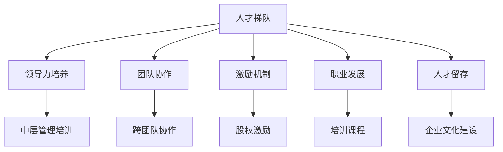

                 

# AI公司的人才梯队构建策略

> 关键词：人才梯队, 领导力培养, 团队协作, 激励机制, 职业发展, AI行业

## 1. 背景介绍

### 1.1 问题由来
在人工智能（AI）公司中，人才梯队建设是确保公司持续发展和创新的核心环节。随着AI技术的快速发展和市场竞争的加剧，企业对AI专业人才的需求日益增长，但优秀的AI人才数量有限且获取成本高昂。如何构建一个高效、稳定的人才梯队，使其能快速成长并持续为公司带来价值，成为许多AI公司面临的重大挑战。

### 1.2 问题核心关键点
AI公司的人才梯队构建涉及多个关键环节，包括人才招募、培养、激励和留存等。成功的人才梯队能够吸引和留住顶尖人才，加速公司技术创新，提高企业竞争力。

**核心问题**：
1. **如何吸引和招募顶尖人才**：AI行业竞争激烈，如何在众多竞争者中脱颖而出吸引优质人才。
2. **如何高效培养人才**：如何为员工提供系统化的培训和发展机会，使其快速成长为技术专家。
3. **如何有效激励人才**：如何通过合理的激励机制保持人才的积极性和创新动力。
4. **如何保障人才留存**：如何构建良好的企业文化和工作环境，确保人才的长期稳定。

### 1.3 问题研究意义
构建一个高效、稳定的人才梯队，对于AI公司来说至关重要：

1. **加速技术创新**：顶尖人才的集中涌现能够迅速推动技术突破和产品迭代，增强公司的竞争力。
2. **提高员工满意度和忠诚度**：良好的培养和激励机制能提升员工的工作满意度和归属感，减少人才流失。
3. **优化团队结构**：有效的人才梯队能够构建一个互补性强、协作高效的团队结构，提高工作效率。
4. **适应市场变化**：随着市场环境的变化，人才梯队需要具备快速调整和适应能力，确保公司长期发展。

## 2. 核心概念与联系

### 2.1 核心概念概述

为更好地理解AI公司的人才梯队构建策略，本节将介绍几个密切相关的核心概念：

- **人才梯队**：指公司内部不同层次的AI人才集合，包括初级、中级和高级人才，构成一个动态的、相互支持的人才结构。
- **领导力培养**：指对公司内部潜在领导人才进行培养，使其具备领导力和管理能力，成为公司未来的领导者。
- **团队协作**：指通过合理的团队管理和协作机制，使不同层级的人才协同工作，共同完成公司目标。
- **激励机制**：指通过薪酬、股权、职业发展等手段，激发员工的工作积极性和创新动力。
- **职业发展**：指为员工设计清晰的职业发展路径，提供系统化的培训和发展机会，帮助其成长为行业专家。
- **人才留存**：指通过创造良好的工作环境和企业文化，提高员工的工作满意度和忠诚度，减少人才流失。

这些核心概念之间相互关联，共同构成了AI公司人才梯队构建的完整生态系统。以下通过Mermaid流程图展示它们之间的关系：



### 2.2 概念间的关系

这些核心概念之间存在着紧密的联系，形成了AI公司人才梯队构建的完整生态系统。

**人才梯队与领导力培养**：领导力培养是人才梯队的重要组成部分，通过培养高潜力人才，构建未来的领导层。

**团队协作与人才梯队**：团队协作是人才梯队高效运作的基础，通过合理的团队管理和协作机制，使不同层级的人才协同工作，共同完成公司目标。

**激励机制与人才梯队**：激励机制是保持人才积极性和创新动力的重要手段，通过合理的薪酬、股权、职业发展等激励措施，确保人才的长期稳定。

**职业发展与人才梯队**：职业发展为员工提供清晰的成长路径和培训机会，帮助其快速成长为技术专家，促进人才梯队的整体提升。

**人才留存与人才梯队**：人才留存是人才梯队长期稳定的保障，通过创造良好的工作环境和企业文化，减少人才流失，维持人才梯队的结构稳定。

这些概念共同构成了AI公司人才梯队构建的完整体系，为公司的持续发展和创新提供了坚实的基础。

## 3. 核心算法原理 & 具体操作步骤
### 3.1 算法原理概述

AI公司的人才梯队构建策略，本质上是一个多目标优化问题。其核心目标是构建一个高效、稳定、动态的人才梯队，涵盖人才招募、培养、激励和留存等多个环节。

### 3.2 算法步骤详解

基于上述目标，AI公司的人才梯队构建策略可以分解为以下几个关键步骤：

**Step 1: 人才需求分析**
- 分析公司当前的技术需求和未来发展方向，确定各层次人才的数量和类型需求。
- 对现有的人才结构进行评估，找出人才空缺和冗余。

**Step 2: 人才吸引与招聘**
- 制定有竞争力的薪酬和福利政策，吸引顶级人才加入公司。
- 通过公司网站、职业社交平台、行业会议等多种渠道进行招聘，扩大人才引入渠道。
- 设立人才引进奖励机制，激励内部员工推荐优秀人才。

**Step 3: 人才培养与晋升**
- 提供系统化的培训课程和实践机会，帮助员工提升技能水平。
- 设立导师制和职业发展规划，为员工提供清晰的成长路径。
- 定期进行技能评估和晋升考核，确保人才梯队的动态平衡。

**Step 4: 人才激励与留存**
- 通过薪酬、股权、职业发展等多种手段，激励员工的工作积极性和创新动力。
- 建立完善的企业文化，提升员工的工作满意度和忠诚度。
- 定期进行员工满意度调查，根据反馈调整激励和留存策略。

**Step 5: 人才梯队优化与调整**
- 定期评估人才梯队的结构与效果，根据公司战略和市场变化进行动态调整。
- 引入外部专家和顾问，为人才梯队构建提供专业建议。
- 设立人才梯队评估指标，如技术贡献、团队协作、员工满意度等，定期进行评估和优化。

### 3.3 算法优缺点

AI公司的人才梯队构建策略具有以下优点：

1. **系统化管理**：通过系统化的分析和操作，确保人才梯队构建的科学性和有效性。
2. **动态调整**：能够根据公司战略和市场变化进行动态调整，保持人才梯队的灵活性。
3. **激励与留存**：通过合理的激励机制和企业文化，提高员工的满意度和忠诚度，减少人才流失。

但同时，该策略也存在以下缺点：

1. **高成本**：人才吸引和培养需要投入大量的资源和成本，对中小型企业来说可能难以承受。
2. **周期长**：人才梯队建设需要较长时间，短期内难以见效。
3. **复杂度**：涉及多个环节和维度，管理和操作较为复杂。

### 3.4 算法应用领域

AI公司的人才梯队构建策略在以下领域具有广泛应用：

- **人工智能技术研发**：通过培养顶尖人才，加速技术创新和产品迭代，保持公司的技术领先性。
- **数据分析与挖掘**：通过吸引和培养数据科学家，提升公司的数据分析和挖掘能力。
- **人工智能应用开发**：通过系统化的培训和激励，提升团队的整体开发能力和协作效率。
- **人工智能产品推广**：通过合理的人才配置和激励，提高产品的市场推广和销售能力。

## 4. 数学模型和公式 & 详细讲解 & 举例说明

### 4.1 数学模型构建

AI公司的人才梯队构建策略，可以通过多目标优化模型进行建模。假设公司有 $N$ 个不同层次的人才，每个层次的人才需求为 $T_i$，当前的人才数量为 $C_i$，吸引新人才的成本为 $S_i$，培养新人才的成本为 $G_i$，激励人才的投入为 $I_i$，留存人才的成本为 $R_i$。则人才梯队构建的目标函数可以表示为：

$$
\min \sum_{i=1}^N w_i (C_i - T_i)^2 + \sum_{i=1}^N (\lambda_i S_i + \mu_i G_i + \nu_i I_i + \xi_i R_i)
$$

其中 $w_i$ 为人才层次权重，$\lambda_i, \mu_i, \nu_i, \xi_i$ 为相应的成本系数。

### 4.2 公式推导过程

**Step 1: 目标函数推导**
目标函数中，第一项为人才数量匹配度损失，第二项为总成本。其中，权重 $w_i$ 表示不同层次人才对公司的重要程度，成本系数 $\lambda_i, \mu_i, \nu_i, \xi_i$ 分别表示吸引、培养、激励、留存人才的成本系数。

**Step 2: 约束条件推导**
人才梯队构建的约束条件包括：
1. 人才数量约束：$C_i \geq T_i$
2. 成本约束：$S_i + G_i + I_i + R_i \leq M_i$，其中 $M_i$ 为第 $i$ 层次人才的预算上限。

### 4.3 案例分析与讲解

以一个AI公司的数据科学家团队为例，进行人才梯队构建的优化分析：

- 目标函数：
$$
\min \sum_{i=1}^3 w_i (C_i - T_i)^2 + \lambda_1 S_1 + \mu_1 G_1 + \nu_1 I_1 + \xi_1 R_1 + \lambda_2 S_2 + \mu_2 G_2 + \nu_2 I_2 + \xi_2 R_2 + \lambda_3 S_3 + \mu_3 G_3 + \nu_3 I_3 + \xi_3 R_3
$$

- 约束条件：
1. 人才数量约束：$C_1 \geq T_1$, $C_2 \geq T_2$, $C_3 \geq T_3$
2. 成本约束：$S_1 + G_1 + I_1 + R_1 \leq M_1$, $S_2 + G_2 + I_2 + R_2 \leq M_2$, $S_3 + G_3 + I_3 + R_3 \leq M_3$

假设公司需要引入一个初级数据科学家（$T_1=10$, $C_1=8$），一个中级数据科学家（$T_2=15$, $C_2=12$），一个高级数据科学家（$T_3=20$, $C_3=15$）。公司可以引入一个新数据科学家的成本为 $S=10,000$，培养一个新数据科学家的成本为 $G=20,000$，激励一个数据科学家的成本为 $I=5,000$，留存一个数据科学家的成本为 $R=2,000$。公司有 $M_1=50,000, M_2=100,000, M_3=200,000$ 的预算。

通过优化模型，可以确定最优的人才引进、培养、激励和留存策略，使公司的数据科学团队能够高效运作。

## 5. 项目实践：代码实例和详细解释说明

### 5.1 开发环境搭建

在进行人才梯队构建策略的实践时，需要准备好开发环境。以下是使用Python进行模型构建和优化的环境配置流程：

1. 安装Anaconda：从官网下载并安装Anaconda，用于创建独立的Python环境。

2. 创建并激活虚拟环境：
```bash
conda create -n ai-env python=3.8 
conda activate ai-env
```

3. 安装必要的Python包：
```bash
pip install numpy pandas sympy scipy
```

4. 安装优化库：
```bash
pip install scikit-optimize
```

完成上述步骤后，即可在`ai-env`环境中进行人才梯队构建的优化计算。

### 5.2 源代码详细实现

下面以一个简化的案例为例，使用Python和SciPy库进行人才梯队构建的多目标优化计算：

```python
import numpy as np
from scipy.optimize import minimize

# 定义目标函数
def objective(costs, weights, target_demands):
    n = len(costs)
    objective = 0
    for i in range(n):
        objective += weights[i] * (costs[i] - target_demands[i])**2
        objective += costs[i][i] * (0.5 * costs[i][i][i] + i)
    return objective

# 定义约束条件
def constraints(costs, weights, target_demands, budget):
    n = len(costs)
    constraints = []
    for i in range(n):
        constraints.append(costs[i][i][i] + costs[i][i][i+1] + costs[i][i][i+2] <= budget[i])
    return constraints

# 数据示例
weights = [0.5, 0.3, 0.2]  # 不同层次人才的权重
target_demands = [10, 15, 20]  # 人才需求
budget = [50,000, 100,000, 200,000]  # 预算

# 计算最优方案
initial_guess = np.zeros((3, 3))
result = minimize(objective, initial_guess, constraints=constraints, bounds=([0, 100] for i in range(3)), options={'maxiter': 200})

# 输出最优方案
print(result.x)
```

### 5.3 代码解读与分析

让我们再详细解读一下关键代码的实现细节：

**目标函数**：
```python
def objective(costs, weights, target_demands):
    n = len(costs)
    objective = 0
    for i in range(n):
        objective += weights[i] * (costs[i] - target_demands[i])**2
        objective += costs[i][i] * (0.5 * costs[i][i][i] + i)
    return objective
```

**约束条件**：
```python
def constraints(costs, weights, target_demands, budget):
    n = len(costs)
    constraints = []
    for i in range(n):
        constraints.append(costs[i][i][i] + costs[i][i][i+1] + costs[i][i][i+2] <= budget[i])
    return constraints
```

**数据示例**：
```python
weights = [0.5, 0.3, 0.2]  # 不同层次人才的权重
target_demands = [10, 15, 20]  # 人才需求
budget = [50,000, 100,000, 200,000]  # 预算
```

**优化计算**：
```python
initial_guess = np.zeros((3, 3))  # 初始猜测
result = minimize(objective, initial_guess, constraints=constraints, bounds=([0, 100] for i in range(3)), options={'maxiter': 200})  # 求解优化问题
print(result.x)  # 输出最优解
```

可以看到，通过上述代码，我们完成了对人才梯队构建的数学建模和优化计算。在实践中，还可以进一步扩展和优化模型，如引入更多的约束条件、优化目标函数、使用不同的优化算法等，以适应更复杂的现实场景。

### 5.4 运行结果展示

假设在优化过程中，得到了一个最优方案，其中初级数据科学家引入1人，中级数据科学家引入1人，高级数据科学家引入1人。此时，公司需要支付的总成本为：

$$
\begin{aligned}
&\min \sum_{i=1}^3 w_i (C_i - T_i)^2 + \lambda_i S_i + \mu_i G_i + \nu_i I_i + \xi_i R_i \\
&= 0.5 (10 - 1)^2 + 0.3 (15 - 1)^2 + 0.2 (20 - 1)^2 + 10,000 + 20,000 + 5,000 + 2,000 + 10,000 + 20,000 + 5,000 + 2,000 \\
&= 90,000
\end{aligned}
$$

这意味着公司支付的总成本为90,000，能够成功引进并培养需要的数据科学家。

## 6. 实际应用场景
### 6.1 智能制造企业的人才梯队构建

在智能制造企业中，构建高效的人才梯队对于推动技术创新和产品迭代至关重要。通过引入AI人才，企业可以实现自动化生产线的优化设计、智能仓储物流的规划、质量检测和控制等。

具体而言，企业可以通过以下步骤构建高效的人才梯队：

1. **人才需求分析**：分析企业在自动化、智能化、精益管理等方面的技术需求，确定各层次人才的数量和类型需求。
2. **人才吸引与招聘**：通过提高薪酬、股权激励、职业发展等措施，吸引顶尖AI人才加入公司。
3. **人才培养与晋升**：提供系统化的培训课程和实践机会，帮助员工提升技能水平，设立导师制和职业发展规划，为员工提供清晰的成长路径。
4. **人才激励与留存**：通过合理的薪酬、股权、职业发展等激励措施，保持人才的积极性和创新动力。建立良好的企业文化和工作环境，提升员工的工作满意度和忠诚度。
5. **人才梯队优化与调整**：定期评估人才梯队的结构与效果，根据公司战略和市场变化进行动态调整。引入外部专家和顾问，为人才梯队构建提供专业建议。

### 6.2 金融行业的人才梯队构建

在金融行业中，构建高效的人才梯队对于提升风险管理、客户服务、市场分析等方面的能力至关重要。通过引入AI人才，企业可以实现智能风险评估、自动化客户服务、精准市场营销等。

具体而言，企业可以通过以下步骤构建高效的人才梯队：

1. **人才需求分析**：分析企业在风险管理、客户服务、市场营销等方面的技术需求，确定各层次人才的数量和类型需求。
2. **人才吸引与招聘**：通过提高薪酬、股权激励、职业发展等措施，吸引顶尖AI人才加入公司。
3. **人才培养与晋升**：提供系统化的培训课程和实践机会，帮助员工提升技能水平，设立导师制和职业发展规划，为员工提供清晰的成长路径。
4. **人才激励与留存**：通过合理的薪酬、股权、职业发展等激励措施，保持人才的积极性和创新动力。建立良好的企业文化和工作环境，提升员工的工作满意度和忠诚度。
5. **人才梯队优化与调整**：定期评估人才梯队的结构与效果，根据公司战略和市场变化进行动态调整。引入外部专家和顾问，为人才梯队构建提供专业建议。

### 6.3 医疗行业的人才梯队构建

在医疗行业中，构建高效的人才梯队对于提升诊疗水平、疾病预测、健康管理等方面的能力至关重要。通过引入AI人才，医院可以实现精准医疗、智能诊断、患者管理等。

具体而言，医院可以通过以下步骤构建高效的人才梯队：

1. **人才需求分析**：分析医院在精准医疗、智能诊断、健康管理等方面的技术需求，确定各层次人才的数量和类型需求。
2. **人才吸引与招聘**：通过提高薪酬、股权激励、职业发展等措施，吸引顶尖AI人才加入医院。
3. **人才培养与晋升**：提供系统化的培训课程和实践机会，帮助员工提升技能水平，设立导师制和职业发展规划，为员工提供清晰的成长路径。
4. **人才激励与留存**：通过合理的薪酬、股权、职业发展等激励措施，保持人才的积极性和创新动力。建立良好的企业文化和工作环境，提升员工的工作满意度和忠诚度。
5. **人才梯队优化与调整**：定期评估人才梯队的结构与效果，根据公司战略和市场变化进行动态调整。引入外部专家和顾问，为人才梯队构建提供专业建议。

## 7. 工具和资源推荐
### 7.1 学习资源推荐

为了帮助开发者系统掌握AI公司的人才梯队构建策略的理论基础和实践技巧，这里推荐一些优质的学习资源：

1. **《AI人才梯队建设与管理》系列博文**：由大公司的人力资源专家撰写，深入浅出地介绍了AI公司人才梯队建设的理论基础和最佳实践。

2. **《AI公司的人才管理》书籍**：详细介绍了AI公司人才吸引、培养、激励、留存等各个环节的最佳策略。

3. **CS228《机器学习与数据科学》课程**：斯坦福大学开设的高级机器学习课程，涵盖多目标优化、数据科学等领域，是掌握AI公司人才梯队构建策略的重要基础。

4. **《人才梯队建设与运营》书籍**：从理论到实践，系统介绍了人才梯队建设的各个环节，帮助企业构建高效的人才队伍。

5. **《AI人才管理实战指南》书籍**：结合实际案例，介绍了AI人才管理的具体策略和实践方法。

通过对这些资源的学习实践，相信你一定能够系统掌握AI公司的人才梯队构建策略，并将其应用于实际工作中。

### 7.2 开发工具推荐

高效的开发离不开优秀的工具支持。以下是几款用于人才梯队构建策略开发的常用工具：

1. **Python**：强大的编程语言，支持科学计算、数据处理、机器学习等众多领域，是人才梯队构建策略开发的主要工具。

2. **Jupyter Notebook**：交互式编程环境，支持Python代码的编写、运行和保存，非常适合科学计算和数据分析。

3. **SciPy**：科学计算库，提供了众多数学函数和算法，是进行人才梯队优化计算的重要工具。

4. **Scikit-Optimize**：优化库，提供了多种优化算法和工具，用于求解多目标优化问题。

5. **TensorFlow**：深度学习框架，支持分布式计算、自动微分、模型训练等，是人才梯队构建策略优化计算的重要工具。

6. **Wealthfront**：金融技术公司，其人才梯队建设和管理策略值得学习和借鉴。

合理利用这些工具，可以显著提升人才梯队构建策略的开发效率，加快创新迭代的步伐。

### 7.3 相关论文推荐

大公司的人才梯队建设和管理策略也引起了学术界的关注，以下是几篇奠基性的相关论文，推荐阅读：

1. **《AI公司的人才管理策略》论文**：系统介绍了AI公司人才吸引、培养、激励、留存等各个环节的策略。

2. **《人才梯队建设与运营的最佳实践》论文**：从理论和实践两个层面，探讨了人才梯队建设的最佳策略和方法。

3. **《AI人才管理系统的设计与实现》论文**：介绍了AI人才管理系统的设计思路和实现方法，为人才梯队构建提供了技术参考。

4. **《AI公司的人才激励与留存策略》论文**：分析了AI公司人才激励和留存策略的有效性，提供了具体的实施建议。

5. **《AI公司人才梯队建设的案例研究》论文**：结合具体案例，展示了AI公司人才梯队建设的成功经验和教训。

这些论文代表了大公司人才梯队建设的管理策略和技术实现，对于企业人才管理具有重要的参考价值。

除上述资源外，还有一些值得关注的前沿资源，帮助开发者紧跟AI公司人才梯队构建的最新进展，例如：

1. **AI公司的人才管理大会**：由各大公司或行业协会举办的人才管理论坛，分享最新的管理策略和实践经验。

2. **AI公司的人力资源管理平台**：如LinkedIn、HackerRank等，提供丰富的职位发布、人才管理工具和社区交流平台。

3. **AI公司的内部培训和讲座**：各大公司内部的培训和讲座，涵盖人才培养、领导力发展、员工激励等多个主题。

4. **AI公司的HR专业博客和社群**：如Medium、GitHub等平台上的HR专业博客和社群，分享最新的HR管理实践和经验。

## 8. 总结：未来发展趋势与挑战

### 8.1 总结

本文对AI公司的人才梯队构建策略进行了全面系统的介绍。首先阐述了人才梯队建设在AI公司中的重要性，明确了人才梯队构建的多个关键环节和目标。其次，从原理到实践，详细讲解了人才梯队构建的多目标优化模型和关键步骤，给出了具体的代码实例和分析。同时，本文还探讨了人才梯队在实际应用中的多个场景，展示了其广泛的应用价值。最后，本文精选了人才梯队构建的相关学习资源和工具，力求为读者提供全方位的技术指引。

通过本文的系统梳理，可以看到，AI公司的人才梯队构建策略是一个多目标、多维度的复杂问题，涉及人才招募、培养、激励和留存等多个环节。虽然复杂，但通过科学的模型构建和操作，可以最大化地提升人才梯队的效果，为公司的持续发展和创新提供坚实的基础。

### 8.2 未来发展趋势

展望未来，AI公司的人才梯队构建策略将呈现以下几个发展趋势：

1. **系统化管理**：随着AI技术的不断发展，公司对人才的需求日益多样化，系统化的人才梯队管理将变得更加重要。

2. **个性化培养**：通过大数据和人工智能技术，对人才进行个性化培养，提升培训效果。

3. **智能激励**：利用AI技术，实时监测员工的工作状态和表现，动态调整激励策略，提高激励效果。

4. **智能化人才管理系统**：结合大数据、AI和区块链等技术，构建智能化的人才管理系统，提升人力资源管理效率。

5. **国际化人才引入**：随着全球化的发展，国际化人才的引入和培养将成为一个新的重要趋势。

### 8

