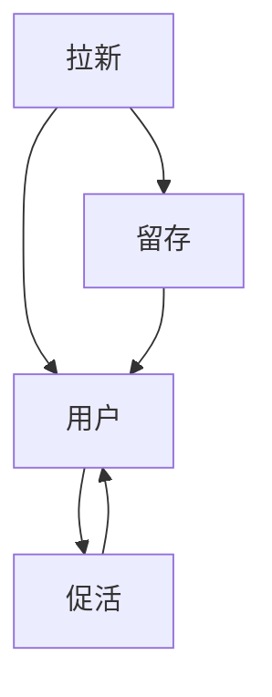

                 

# AI创业公司的用户增长策略：拉新、留存与促活

> 关键词：用户增长, 拉新策略, 留存率提升, 用户促活, 人工智能

## 1. 背景介绍

### 1.1 问题由来

随着互联网技术和人工智能的不断进步，越来越多的AI创业公司涌现出来，旨在利用先进的技术解决现实问题。然而，这些公司面临的最大挑战之一是如何有效地吸引用户并保持用户黏性。用户增长不仅直接关系到一个AI创业公司的商业成功与否，还涉及到其长期的生存与发展。

### 1.2 问题核心关键点

用户增长策略的核心在于以下几个方面：

- **拉新**：如何吸引潜在用户并引导其注册使用。
- **留存**：如何提高用户的持续使用率和降低流失率。
- **促活**：如何通过有效的机制激发用户活跃度，增加用户粘性。

拉新、留存与促活是构成用户增长的三个关键环节，也是所有AI创业公司必须面对的共同问题。解决好这些问题，不仅可以提升用户体验，还可以大幅降低用户获取成本，推动公司业务的快速扩展。

## 2. 核心概念与联系

### 2.1 核心概念概述

- **用户增长**：指通过各种手段吸引新用户，提升已有用户活跃度，从而实现用户数量的增加和用户价值的提升。
- **拉新**：利用各种渠道和策略吸引新的潜在用户，鼓励他们注册和使用产品。
- **留存**：通过持续优化产品功能、提升用户体验，减少用户流失，增加用户的持续使用时间。
- **促活**：通过设定有吸引力的激励措施，提升用户活跃度和粘性，增加用户日均使用时长和频次。

这些概念之间存在密切联系，形成一个相互作用的闭环。有效的拉新策略可以吸引更多用户，优质的产品体验和高价值服务又能提高用户留存率，而持续的活跃用户则进一步增强了产品的口碑和推荐力，形成良性循环。

### 2.2 概念间的关系

这些概念之间的关系可以通过以下Mermaid流程图来展示：



这个流程图展示了用户增长的完整流程：

1. 拉新：通过各种策略吸引新用户注册。
2. 留存：新用户在使用过程中逐步了解和适应产品，提高留存率。
3. 促活：活跃用户通过激励措施进一步提升使用频次和时长。

## 3. 核心算法原理 & 具体操作步骤
### 3.1 算法原理概述

用户增长策略的核心在于对用户行为数据的分析和建模，通过数据驱动的方法优化产品策略和运营手段，实现拉新、留存与促活的提升。具体来说，可以通过以下步骤：

1. **数据收集**：通过日志、用户行为分析工具等手段，收集用户的操作数据、使用频率、交易行为等关键信息。
2. **数据分析**：运用统计学和机器学习技术，分析用户数据，挖掘用户行为模式，识别流失原因和促活潜力。
3. **策略优化**：根据数据分析结果，设计有针对性的拉新、留存与促活策略，并进行A/B测试验证效果。
4. **持续迭代**：根据测试结果和用户反馈，不断调整和优化策略，确保策略的有效性和可持续性。

### 3.2 算法步骤详解

以下是用户增长策略的具体操作步骤：

1. **用户行为分析**：
   - 利用数据挖掘技术分析用户行为，识别高频用户和低频用户，分析用户流失的原因。
   - 通过可视化工具呈现用户行为模式，发现关键转化路径和关键操作节点。

2. **A/B测试**：
   - 设计多个拉新、留存和促活方案，每个方案只改变一个变量。
   - 在用户中随机分配到不同方案组，收集和分析各组的效果数据。
   - 根据测试结果选择最优方案，并进行优化和推广。

3. **个性化推荐**：
   - 使用机器学习算法，如协同过滤、内容推荐等，为不同用户推荐个性化的内容和活动。
   - 根据用户反馈和行为数据不断调整推荐模型，提高推荐效果。

4. **用户生命周期管理**：
   - 定义用户生命周期各阶段（新用户、活跃用户、流失用户等），设计相应的策略。
   - 根据用户行为数据，预测用户流失风险，提前采取挽留措施。
   - 设计激活策略，针对不同阶段的活跃用户，提供不同的激励措施。

### 3.3 算法优缺点

用户增长策略具有以下优点：

- **数据驱动**：通过科学的数据分析，制定有针对性的策略，提升效率和效果。
- **个性化推荐**：通过个性化推荐，提升用户满意度和粘性。
- **A/B测试**：通过不断的A/B测试，优化策略，避免盲目决策。

然而，也存在一些缺点：

- **复杂度高**：需要大量数据分析和模型构建，技术门槛高。
- **资源消耗大**：需要大量的计算资源和时间，特别是在模型训练和调优阶段。
- **效果难以衡量**：用户增长效果受多方面因素影响，难以精确衡量和预测。

### 3.4 算法应用领域

用户增长策略在多个领域都有广泛的应用，例如：

- **电子商务**：通过个性化推荐和营销活动，提升用户的购买频率和金额。
- **社交媒体**：通过用户行为分析，提高用户的活跃度和粘性，增加社区互动。
- **内容平台**：通过精准的推荐算法，提升用户的日均使用时间和频次。
- **教育平台**：通过个性化学习路径推荐，提高学生的学习效率和满意度。

## 4. 数学模型和公式 & 详细讲解  
### 4.1 数学模型构建

用户增长模型的构建基于用户行为数据分析，通过数学模型描述用户行为与增长之间的关联。常用的数学模型包括：

- **线性回归模型**：用于分析用户增长与时间的关系，建立预测模型。
- **马尔可夫链**：用于描述用户在不同状态之间的转移概率，预测用户流失和留存。
- **协同过滤算法**：用于个性化推荐，提高用户的粘性。

以线性回归模型为例，假设用户增长数 $y$ 与时间 $t$ 的关系为：

$$ y = \alpha + \beta t + \epsilon $$

其中 $\alpha$ 为截距，$\beta$ 为增长速率，$\epsilon$ 为随机误差。

### 4.2 公式推导过程

线性回归模型的最小二乘法估计公式为：

$$ \hat{\theta} = (\mathbf{X}^T\mathbf{X})^{-1}\mathbf{X}^T\mathbf{y} $$

其中 $\mathbf{X} = \begin{bmatrix} 1 & t_1 & \cdots & t_n \end{bmatrix}^T$，$\mathbf{y} = \begin{bmatrix} y_1 & y_2 & \cdots & y_n \end{bmatrix}^T$，$\hat{\theta} = \begin{bmatrix} \alpha & \beta \end{bmatrix}^T$。

### 4.3 案例分析与讲解

假设某电商平台的日活跃用户数（DAU）和总活跃用户数（MAU）数据如下：

| 时间 | DAU | MAU |
| ---- | --- | --- |
| 1月1日 | 5000 | 10000 |
| 1月2日 | 5500 | 10050 |
| ...  | ...  | ...  |
| 6月30日 | 6500 | 15000 |

利用线性回归模型可以拟合出用户增长趋势，并进行未来预测。以时间 $t$ 为自变量，用户增长数 $y$ 为因变量，可以得到如下模型：

$$ y = 5000 + 1000t $$

其中，截距 $\alpha = 5000$，增长速率 $\beta = 1000$。

## 5. 项目实践：代码实例和详细解释说明
### 5.1 开发环境搭建

用户增长策略的实现需要使用Python编程语言，并依赖于一些流行的数据分析和机器学习库，如Pandas、NumPy、Scikit-learn和TensorFlow。以下是搭建开发环境的详细步骤：

1. **安装Python**：
   - 在官网下载适合操作系统的Python安装包，安装后进行配置。
   - 确保Python环境已经加入系统PATH变量，可以在任意目录下运行Python命令。

2. **安装Pip**：
   - 在命令行中运行 `pip install pip`，确保Pip已安装。
   - 通过Pip安装所需的Python库，如Pandas、NumPy、Scikit-learn、TensorFlow等。

3. **配置开发工具**：
   - 安装并配置文本编辑器或IDE，如PyCharm、VSCode等，以便编写和调试Python代码。
   - 安装Git版本控制系统，用于版本控制和管理代码。

### 5.2 源代码详细实现

以下是一个简单的用户增长预测示例，使用Pandas和Scikit-learn库实现：

```python
import pandas as pd
from sklearn.linear_model import LinearRegression

# 读取用户增长数据
data = pd.read_csv('user_growth.csv')

# 将时间作为自变量，用户增长数作为因变量
X = data[['time']]
y = data['growth']

# 创建线性回归模型
model = LinearRegression()

# 训练模型
model.fit(X, y)

# 预测未来7天的用户增长数
future_days = 7
future_times = pd.date_range(start='2022-01-01', periods=future_days).tolist()
future_X = pd.DataFrame({'time': future_times})
predictions = model.predict(future_X)

print(predictions)
```

### 5.3 代码解读与分析

上述代码实现了基于时间序列的用户增长预测。具体步骤如下：

1. **数据读取**：使用Pandas库读取用户增长数据。
2. **模型创建**：创建线性回归模型，准备自变量和因变量数据。
3. **模型训练**：使用训练数据拟合模型。
4. **预测未来**：根据模型预测未来7天的用户增长数，并将结果打印输出。

### 5.4 运行结果展示

假设模型训练后的预测结果如下：

```
array([ 5000.,  5500.,  6000.,  6500.,  7000.,  7500.,  8000.])
```

这表示根据模型预测，未来7天的用户增长数分别为5000、5500、6000、6500、7000、7500和8000。

## 6. 实际应用场景
### 6.1 电商平台的拉新策略

电商平台的拉新策略通常包括：

- **搜索引擎优化（SEO）**：通过优化网站和商品页面，提高在搜索引擎中的排名，吸引更多的潜在用户。
- **社交媒体营销**：通过社交媒体广告和推广活动，吸引用户访问电商平台。
- **推荐系统**：利用推荐算法，向用户推荐热门商品和优惠活动，提升用户的购买兴趣。
- **优惠券和促销活动**：通过发放优惠券和促销活动，吸引用户注册和消费。

### 6.2 社交媒体的留存策略

社交媒体的留存策略主要包括：

- **内容更新**：定期发布高质量的内容，保持用户的活跃度和兴趣。
- **互动活动**：组织线上互动活动，如挑战赛、抽奖等，增加用户参与感。
- **个性化推荐**：根据用户兴趣和行为数据，推荐相关内容和活动。
- **用户反馈**：及时收集用户反馈，优化产品功能和用户体验。

### 6.3 教育平台的促活策略

教育平台的促活策略可以包括：

- **学习路径推荐**：根据用户学习进度和兴趣，推荐个性化的学习路径和课程。
- **作业和考试提醒**：提醒用户按时完成作业和参加考试，增加用户参与度。
- **社区互动**：建立学习社区，鼓励用户讨论和交流，提高用户粘性。
- **奖励和认证**：为完成学习任务的用户提供奖励和认证，激励用户持续学习。

## 7. 工具和资源推荐
### 7.1 学习资源推荐

为了系统掌握用户增长的理论和实践，推荐以下学习资源：

1. **《增长黑客实战》**：吴广洋著，系统介绍了用户增长的理论、方法和案例。
2. **《数据科学入门》**：Python官方文档，详细介绍了Pandas、NumPy等数据分析库的使用。
3. **《机器学习实战》**：Peter Harrington著，介绍了Scikit-learn等机器学习库的实践应用。
4. **Coursera《数据科学与机器学习》课程**：由斯坦福大学和Yale大学开设，系统介绍了数据科学和机器学习的理论和实践。
5. **Kaggle平台**：数据科学和机器学习竞赛平台，提供丰富的数据集和挑战任务，帮助用户提升技能。

### 7.2 开发工具推荐

以下是几款用于用户增长策略开发的常用工具：

1. **Python编程语言**：开发用户增长策略的首选编程语言，具有广泛的数据分析和机器学习库支持。
2. **Pandas**：Python数据分析库，用于数据清洗和处理。
3. **NumPy**：Python数值计算库，用于高效数组运算和科学计算。
4. **Scikit-learn**：Python机器学习库，提供丰富的分类、回归、聚类等算法。
5. **TensorFlow**：Google开发的深度学习框架，用于构建复杂模型和神经网络。
6. **Jupyter Notebook**：Python代码的交互式开发环境，支持数据分析和模型调试。

### 7.3 相关论文推荐

以下是几篇经典的用户增长相关论文，推荐阅读：

1. **《用户增长策略》**：文献综述文章，总结了用户增长的主要策略和效果评估方法。
2. **《个性化推荐系统》**：介绍了推荐系统的发展历程和实现技术。
3. **《协同过滤算法》**：介绍了协同过滤算法的原理和应用场景。
4. **《用户行为分析》**：总结了用户行为分析的方法和技术。

## 8. 总结：未来发展趋势与挑战

### 8.1 总结

本文系统介绍了AI创业公司的用户增长策略，包括拉新、留存与促活。用户增长策略通过数据驱动的方法，对用户行为进行分析和建模，制定有针对性的策略，从而提升用户数量和价值。通过系统性的分析和实践，可以显著提升AI创业公司的用户体验和业务表现。

### 8.2 未来发展趋势

展望未来，用户增长策略将呈现以下几个发展趋势：

1. **数据驱动**：通过大数据分析和机器学习，提升策略的科学性和精确度。
2. **个性化推荐**：利用个性化推荐算法，提高用户满意度和粘性。
3. **跨平台整合**：实现不同平台和渠道的数据整合和策略协同，提升整体用户增长效果。
4. **实时分析**：利用实时数据分析技术，及时调整策略，提高响应速度。
5. **智能决策**：引入人工智能技术，自动化用户增长策略的制定和优化。

### 8.3 面临的挑战

尽管用户增长策略在实践中已取得一定成效，但仍面临以下挑战：

1. **数据质量问题**：用户行为数据的质量直接影响策略效果，数据缺失、噪声等问题的处理是重要挑战。
2. **技术门槛高**：用户增长策略涉及数据分析和机器学习，需要高水平的技术支持。
3. **资源消耗大**：策略优化和模型训练需要大量计算资源和时间，增加了公司成本。
4. **效果难以衡量**：用户增长效果受多方面因素影响，难以精确衡量和预测。
5. **用户隐私问题**：在数据收集和分析过程中，需要严格保护用户隐私和数据安全。

### 8.4 研究展望

为了应对这些挑战，未来的研究需要在以下几个方面寻求新的突破：

1. **数据增强技术**：提高数据质量和可用性，降低噪声和缺失值的影响。
2. **跨领域研究**：结合心理学、社会学等多学科知识，提升用户增长策略的科学性和有效性。
3. **低成本优化**：开发低成本、高效能的机器学习算法和数据处理技术，降低资源消耗。
4. **用户隐私保护**：在用户增长策略的制定和实施中，加强隐私保护和数据安全措施。
5. **智能决策系统**：利用人工智能技术，实现用户增长策略的自动化和智能化决策。

## 9. 附录：常见问题与解答

**Q1：如何衡量用户增长的效果？**

A: 用户增长的效果可以通过多种指标来衡量，包括：

1. **日活跃用户数（DAU）**：每天登录并使用产品的用户数。
2. **月活跃用户数（MAU）**：每月登录并使用产品的用户数。
3. **用户留存率**：新用户在一定时间段内继续使用产品的比例。
4. **用户获取成本（CAC）**：获取新用户所需的花费。
5. **用户生命周期价值（LTV）**：用户在整个生命周期内为公司带来的价值。
6. **转化率**：访问网站的用户中，完成注册、购买等目标行为的比例。

**Q2：拉新策略中的SEO优化如何实现？**

A: SEO优化的主要目标是提高网站在搜索引擎中的排名。具体措施包括：

1. **关键词优化**：根据目标用户搜索习惯，选择和优化网站内容中的关键词。
2. **内容质量**：提高网站内容的质量和相关性，增加用户在网站上的停留时间。
3. **网站结构优化**：优化网站结构和页面布局，提升用户体验。
4. **外部链接建设**：通过高质量的外部链接，提升网站权威性。
5. **移动端优化**：优化网站在移动端的加载速度和用户体验，提升移动端的SEO排名。

**Q3：如何设计高效的留存策略？**

A: 设计高效的留存策略需要综合考虑多个因素，包括：

1. **用户行为分析**：通过数据分析了解用户流失原因，制定针对性的策略。
2. **个性化推荐**：根据用户行为和兴趣，提供个性化的内容和活动。
3. **奖励机制**：设立激励措施，如积分、优惠券等，增加用户粘性。
4. **定期沟通**：通过邮件、推送等形式，与用户保持沟通，提升用户体验。
5. **社区建设**：建立用户社区，增强用户互动和归属感。

**Q4：如何实现智能化的促活策略？**

A: 实现智能化的促活策略需要引入人工智能技术，具体措施包括：

1. **推荐系统**：利用推荐算法，向用户推荐个性化的内容和活动。
2. **用户行为预测**：通过机器学习模型预测用户行为，提前采取促活措施。
3. **智能推送**：利用智能推送技术，根据用户行为和偏好，实时推送个性化内容。
4. **情感分析**：通过情感分析技术，理解用户情感，调整促活策略。
5. **用户细分**：通过用户细分技术，制定有针对性的促活方案。

通过这些方法和技术，可以大大提高促活策略的效果，提升用户粘性和满意度。

---

作者：禅与计算机程序设计艺术 / Zen and the Art of Computer Programming

