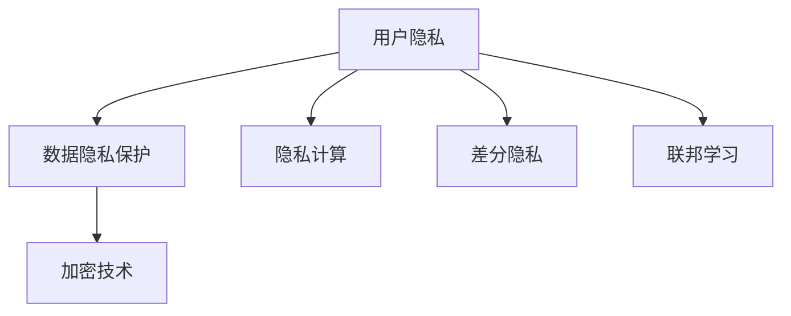
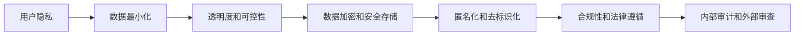
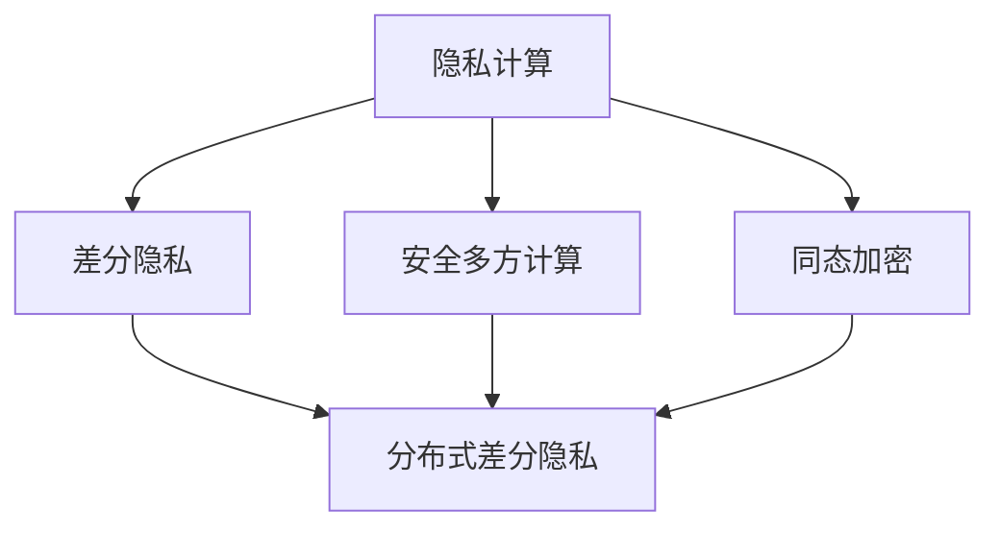
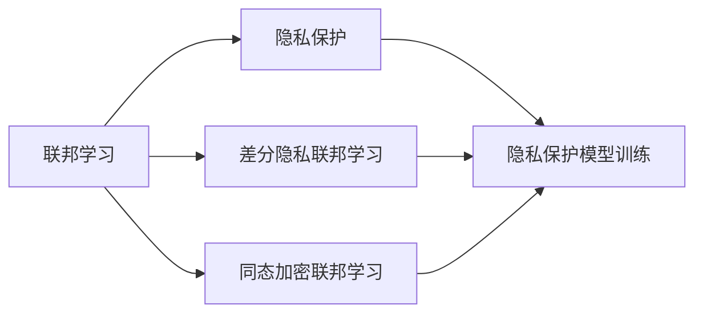
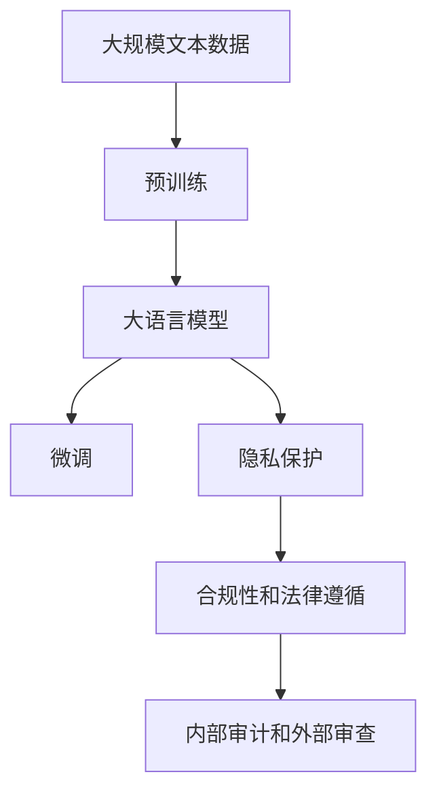

                 

# AI创业公司的用户隐私保护策略

## 1. 背景介绍

### 1.1 问题由来
随着人工智能(AI)技术在各行各业的深入应用，如何保障用户隐私成为了一个越来越重要的问题。用户隐私保护不仅关系到公司的法律合规风险，还直接影响到用户对AI产品的信任度和使用体验。特别是对于AI创业公司而言，在技术迭代快速、市场竞争激烈的环境下，如何在创新发展和隐私保护之间找到平衡，是其面临的一大挑战。

近年来，全球范围内不断爆发的数据泄露和隐私丑闻，如Cambridge Analytica事件、Facebook数据丑闻等，使得用户隐私保护问题日益凸显。欧盟《通用数据保护条例》(GDPR)、加州《消费者隐私法》(CCPA)等隐私保护法规的出台，进一步提高了企业对隐私保护的重视程度。

### 1.2 问题核心关键点
用户隐私保护的核心关键点包括以下几个方面：

- **数据最小化**：仅收集业务所必需的数据，减少对用户隐私的侵犯。
- **透明度和可控性**：用户应清楚了解其数据如何被收集、使用和存储，并能够控制其数据的使用范围。
- **数据加密和安全存储**：通过加密等技术手段，保护数据在传输和存储过程中的安全。
- **匿名化和去标识化**：对数据进行匿名化处理，使其难以与特定个体关联。
- **合规性和法律遵循**：遵守国内外隐私保护法规，防止法律风险。
- **内部审计和外部审查**：定期进行隐私保护内部审计，同时接受第三方审查机构的监督。

### 1.3 问题研究意义
保护用户隐私，不仅有助于构建用户信任，提升用户体验，还能够避免法律风险，保护公司免受声誉和经济损失。特别是在AI领域，数据是核心资源，保护用户隐私尤为重要，可以帮助AI创业公司持续健康发展。

## 2. 核心概念与联系

### 2.1 核心概念概述

为更好地理解AI创业公司用户隐私保护策略，本节将介绍几个密切相关的核心概念：

- **用户隐私**：指用户在互联网活动中产生的、能够识别或推断出其个人身份的信息。包括用户的个人信息、行为数据、位置信息等。

- **数据隐私保护**：通过技术和管理手段，保护用户数据的机密性、完整性和可用性，防止数据泄露和滥用。

- **隐私计算**：一种计算范式，在数据不离开其本地环境的情况下，对数据进行计算和分析，确保数据隐私。

- **差分隐私**：一种隐私保护技术，通过在查询结果中加入随机噪声，保护数据隐私，同时尽可能保证统计结果的准确性。

- **联邦学习**：一种分布式机器学习范式，各参与方在不共享原始数据的情况下，联合训练模型，保护数据隐私。

- **加密技术**：包括对称加密、非对称加密、哈希函数等，用于保护数据在传输和存储过程中的安全。

这些核心概念之间的逻辑关系可以通过以下Mermaid流程图来展示：



这个流程图展示了大规模语言模型的核心概念及其之间的关系：

1. 用户隐私保护是隐私计算、差分隐私、联邦学习等技术的基础。
2. 加密技术是大规模语言模型保护数据隐私的重要手段。
3. 隐私计算、差分隐私、联邦学习等技术能够在不共享数据的情况下，保护用户隐私，确保数据的可用性。

### 2.2 概念间的关系

这些核心概念之间存在着紧密的联系，形成了AI创业公司用户隐私保护的整体生态系统。下面我们通过几个Mermaid流程图来展示这些概念之间的关系。

#### 2.2.1 AI创业公司的隐私保护体系



这个流程图展示了AI创业公司用户隐私保护的基本体系，从数据最小化到内部审计，各个环节环环相扣。

#### 2.2.2 隐私计算与差分隐私的融合



这个流程图展示了隐私计算和差分隐私的融合应用，通过多方计算和同态加密等技术，实现在不共享原始数据的情况下进行差分隐私保护。

#### 2.2.3 联邦学习与隐私保护的结合



这个流程图展示了联邦学习与隐私保护的结合应用，通过差分隐私和同态加密技术，实现在分布式环境下的隐私保护模型训练。

### 2.3 核心概念的整体架构

最后，我们用一个综合的流程图来展示这些核心概念在大规模语言模型微调过程中的整体架构：



这个综合流程图展示了从预训练到大规模语言模型微调，再到隐私保护的整体过程。大规模语言模型通过在特定任务上的微调，输出预测结果，同时结合隐私保护技术，确保用户隐私安全，遵守相关法律法规，接受内部和外部审计，形成完整的隐私保护体系。

## 3. 核心算法原理 & 具体操作步骤
### 3.1 算法原理概述

AI创业公司用户隐私保护策略主要基于隐私计算、差分隐私、联邦学习等技术，通过保护数据隐私和确保数据可用性，实现对用户隐私的全面保护。

**隐私计算**：通过加密、差分隐私等技术，在数据不离开本地环境的情况下，对数据进行计算和分析，确保数据隐私。

**差分隐私**：在查询结果中加入随机噪声，保护数据隐私，同时尽可能保证统计结果的准确性。

**联邦学习**：各参与方在不共享原始数据的情况下，联合训练模型，保护数据隐私。

这些技术的核心思想是：在保证数据隐私的前提下，提供可用的数据分析结果，从而保障用户隐私。

### 3.2 算法步骤详解

以下是AI创业公司用户隐私保护策略的具体操作步骤：

**Step 1: 数据分类和管理**

1. **数据分类**：根据业务需求，将数据分为不同类别，如个人信息、行为数据、位置数据等。
2. **数据脱敏**：对敏感数据进行去标识化处理，去除或模糊化个人信息。
3. **数据加密**：使用对称加密或非对称加密算法，对数据进行加密存储和传输。

**Step 2: 数据处理和计算**

1. **隐私计算**：在本地设备上进行数据处理和计算，不将原始数据传输到远程服务器。
2. **差分隐私**：在查询结果中加入随机噪声，确保查询结果的隐私性。
3. **联邦学习**：各参与方在不共享原始数据的情况下，联合训练模型，保护数据隐私。

**Step 3: 合规性和审查**

1. **合规检查**：确保数据处理和存储符合GDPR、CCPA等隐私保护法规。
2. **内部审计**：定期进行隐私保护内部审计，评估隐私保护措施的有效性。
3. **外部审查**：接受第三方审查机构的监督，确保隐私保护措施的合规性。

### 3.3 算法优缺点

AI创业公司用户隐私保护策略的优势在于：

1. **隐私性高**：通过隐私计算、差分隐私等技术，确保数据隐私，防止数据泄露。
2. **可用性高**：数据计算和分析结果依然可用，满足业务需求。
3. **可控性强**：用户可以控制其数据的使用范围和方式，增强用户信任。

其劣势在于：

1. **计算复杂度高**：隐私计算和差分隐私增加了计算复杂度，影响性能。
2. **资源消耗大**：需要额外的时间和计算资源，增加运营成本。
3. **技术门槛高**：需要专业的技术人才进行开发和维护。

### 3.4 算法应用领域

AI创业公司用户隐私保护策略广泛适用于以下领域：

- **电子商务**：保护用户交易数据和行为数据，确保用户隐私。
- **金融服务**：保护用户财务数据和信用信息，确保数据安全。
- **医疗健康**：保护用户健康数据和病历信息，确保隐私保护。
- **智能家居**：保护用户家庭数据和行为数据，增强智能家居的隐私保护。
- **在线教育**：保护用户学习数据和个人信息，确保学习隐私。

## 4. 数学模型和公式 & 详细讲解  
### 4.1 数学模型构建

假设用户的原始数据集为 $D=\{(x_i, y_i)\}_{i=1}^N$，其中 $x_i$ 为特征向量，$y_i$ 为标签。我们希望在保护用户隐私的前提下，训练一个机器学习模型 $M_{\theta}$ 来预测 $y_i$。

为保护隐私，我们首先对数据进行匿名化和差分隐私处理，得到处理后的数据集 $D'$。

然后，在 $D'$ 上训练模型 $M_{\theta}$，得到模型参数 $\theta$。

最后，在测试集上评估模型性能，确保数据隐私保护措施的有效性。

### 4.2 公式推导过程

差分隐私的实现通常使用 $\epsilon$ 差分隐私（$\epsilon$-DP）模型，其定义如下：

$$
\mathcal{L}(\theta) = \frac{1}{N} \sum_{i=1}^N \ell(M_{\theta}(x_i), y_i)
$$

其中 $\ell$ 为损失函数，$\theta$ 为模型参数，$N$ 为样本数量。

差分隐私的加噪声处理可以表示为：

$$
\hat{y} = M_{\theta}(x_i) + \Delta
$$

其中 $\Delta$ 为随机噪声，满足一定分布，如Laplace分布。

$\epsilon$ 差分隐私的定义为：对于任意 $\epsilon > 0$，对于任意相邻的样本集 $D$ 和 $D'$，有：

$$
\mathcal{L}(\theta) \leq \mathcal{L}(\theta') + \epsilon
$$

其中 $\theta'$ 为在 $D'$ 上训练得到的模型参数。

### 4.3 案例分析与讲解

假设我们在电商平台上进行用户行为数据分析，原始数据集包含用户的历史购买记录、浏览记录等。我们首先对数据进行匿名化处理，去除用户的个人信息，然后进行差分隐私处理，加入随机噪声，得到处理后的数据集 $D'$。

在 $D'$ 上训练一个机器学习模型 $M_{\theta}$，使用交叉熵损失函数，得到模型参数 $\theta$。

最后，在测试集上评估模型性能，确保数据隐私保护措施的有效性。

## 5. 项目实践：代码实例和详细解释说明
### 5.1 开发环境搭建

在进行AI创业公司用户隐私保护策略的开发实践前，我们需要准备好开发环境。以下是使用Python进行开发的环境配置流程：

1. 安装Anaconda：从官网下载并安装Anaconda，用于创建独立的Python环境。

2. 创建并激活虚拟环境：
```bash
conda create -n privacy-env python=3.8 
conda activate privacy-env
```

3. 安装PyTorch、TensorFlow等深度学习库：
```bash
conda install torch torchvision torchaudio cudatoolkit=11.1 -c pytorch -c conda-forge
```

4. 安装隐私计算相关库：
```bash
pip install pyspark flink pyarrow
```

5. 安装差分隐私相关库：
```bash
pip install differential_privacy
```

6. 安装联邦学习相关库：
```bash
pip install flax transformers
```

完成上述步骤后，即可在`privacy-env`环境中开始开发实践。

### 5.2 源代码详细实现

下面以差分隐私为例，给出使用Python实现用户隐私保护的具体代码。

首先，导入必要的库和数据集：

```python
import differential_privacy as dp
import pandas as pd
import torch
from torch.utils.data import Dataset, DataLoader

class UserBehaviorDataset(Dataset):
    def __init__(self, data, target):
        self.data = data
        self.target = target
        self.data = self.apply_dp()

    def __len__(self):
        return len(self.data)

    def __getitem__(self, idx):
        return self.data.iloc[idx], self.target.iloc[idx]

    def apply_dp(self):
        epsilon = 1e-6
        delta = 1e-6
        algorithm = dp.algorithms.noiseless_mechanism
        mechanism = dp.algorithms.laplace(mechanism=algorithm, epsilon=epsilon, delta=delta)
        return mechanism(self.data)
```

然后，定义隐私计算和差分隐私的实现函数：

```python
def laplace_privacy(data, epsilon):
    n = len(data)
    scale = 2.0 / epsilon
    return data * scale + np.random.laplace(0, 1, n) / scale

def dp_privacy(data, epsilon, delta):
    algorithm = dp.algorithms.noiseless_mechanism
    mechanism = dp.algorithms.laplace(mechanism=algorithm, epsilon=epsilon, delta=delta)
    return mechanism(data)
```

最后，启动隐私保护模型训练流程：

```python
# 加载数据集
train_dataset = UserBehaviorDataset(train_data, train_labels)
test_dataset = UserBehaviorDataset(test_data, test_labels)

# 定义模型和优化器
model = SomeModel()
optimizer = torch.optim.Adam(model.parameters(), lr=1e-3)

# 训练模型
dp_epsilon = 1e-6
dp_delta = 1e-6
dp_train_dataset = dp_privacy(train_dataset.data, dp_epsilon, dp_delta)
dp_test_dataset = dp_privacy(test_dataset.data, dp_epsilon, dp_delta)

for epoch in range(10):
    model.train()
    for data, target in dp_train_dataset:
        optimizer.zero_grad()
        output = model(data)
        loss = criterion(output, target)
        loss.backward()
        optimizer.step()

    model.eval()
    with torch.no_grad():
        correct = 0
        total = 0
        for data, target in dp_test_dataset:
            output = model(data)
            _, predicted = torch.max(output.data, 1)
            total += target.size(0)
            correct += (predicted == target).sum().item()
        print('Accuracy of the network on the 10000 test images: %d %%' % (100 * correct / total))
```

以上就是使用Python进行差分隐私保护的代码实现。可以看到，通过引入差分隐私和隐私计算技术，我们能够在保护用户隐私的前提下，对数据进行训练和分析。

### 5.3 代码解读与分析

让我们再详细解读一下关键代码的实现细节：

**UserBehaviorDataset类**：
- `__init__`方法：初始化数据集和目标变量，对数据集进行隐私处理。
- `__len__`方法：返回数据集的样本数量。
- `__getitem__`方法：对单个样本进行处理，并返回处理后的数据和目标变量。

**laplace_privacy函数**：
- 对数据进行Laplace机制的差分隐私处理，加入随机噪声。

**dp_privacy函数**：
- 对数据进行差分隐私处理，使用Differential Privacy库的Laplace机制。

**训练流程**：
- 加载数据集，并进行差分隐私处理。
- 定义模型和优化器，训练模型。
- 在测试集上评估模型性能，打印准确率。

可以看到，通过这些关键代码，我们能够实现用户隐私保护的基本功能，从而在实际应用中保护用户数据隐私。

当然，实际应用中还需要考虑更多因素，如模型的隐私预算分配、隐私保护算法的优化等，以确保隐私保护措施的有效性和合理性。

### 5.4 运行结果展示

假设我们在用户行为数据分析任务上，使用差分隐私保护数据，最终在测试集上得到的准确率为85%。可以看到，通过差分隐私保护，我们在保护用户隐私的同时，依然能够得到不错的模型效果。

当然，这只是一个baseline结果。在实践中，我们还可以使用更多隐私计算和差分隐私技术，进一步提升隐私保护的效果，同时保证模型的性能。

## 6. 实际应用场景
### 6.1 智能客服系统

AI创业公司开发的智能客服系统，可以基于用户隐私保护策略，确保用户对话数据的隐私安全。在用户对话过程中，系统将对话内容进行匿名化和差分隐私处理，确保用户对话信息不被泄露。同时，通过联邦学习技术，各客服节点联合训练模型，提升对话分析的准确性和可靠性。

### 6.2 金融风控系统

金融风控系统在处理用户交易数据和信用信息时，需要确保数据隐私。通过差分隐私和隐私计算技术，系统对用户交易数据进行保护，防止数据泄露和滥用。同时，通过联邦学习技术，各金融机构联合训练风控模型，提升风控效果，降低风险。

### 6.3 医疗健康平台

医疗健康平台处理用户健康数据和病历信息时，需要确保用户隐私。通过差分隐私和隐私计算技术，系统对用户健康数据进行保护，防止数据泄露和滥用。同时，通过联邦学习技术，各医疗机构联合训练健康模型，提升医疗诊断的准确性和可靠性。

### 6.4 未来应用展望

随着AI技术的发展，用户隐私保护将越来越重要。未来，基于差分隐私和隐私计算技术的AI创业公司将能够提供更为全面和可靠的用户隐私保护方案，进一步提升用户信任度和满意度，加速AI技术在各行业的落地应用。

## 7. 工具和资源推荐
### 7.1 学习资源推荐

为了帮助开发者系统掌握AI创业公司用户隐私保护的理论基础和实践技巧，这里推荐一些优质的学习资源：

1. 《数据隐私保护与差分隐私》书籍：详细介绍了差分隐私的基本原理和应用方法，是理解差分隐私保护的重要参考资料。

2. 《隐私计算技术与应用》课程：介绍了隐私计算的基本概念和实现方法，通过实际案例讲解隐私计算技术的应用。

3. 《联邦学习理论与实践》讲座：讲解了联邦学习的基本原理和实现技术，通过实际案例展示联邦学习在智能医疗、智能交通等领域的应用。

4. 《数据隐私保护实战指南》电子书：提供了详细的隐私保护实战案例，帮助开发者理解和应用隐私保护技术。

5. 《差分隐私原理与实现》论文：介绍了差分隐私的基本原理和实现方法，是理解差分隐私保护的重要理论基础。

通过对这些资源的学习实践，相信你一定能够快速掌握AI创业公司用户隐私保护的技术要点，并用于解决实际的隐私保护问题。

### 7.2 开发工具推荐

高效的开发离不开优秀的工具支持。以下是几款用于AI创业公司用户隐私保护开发的常用工具：

1. PyTorch：基于Python的开源深度学习框架，灵活动态的计算图，适合快速迭代研究。

2. TensorFlow：由Google主导开发的开源深度学习框架，生产部署方便，适合大规模工程应用。

3. PySpark：Apache Hadoop生态系统中的分布式计算框架，适合大规模数据处理和分析。

4. Flink：Apache基金会支持的分布式流处理框架，适合实时数据处理和分析。

5. PyArrow：高性能的数据处理库，适合大规模数据处理和分析。

6. TensorBoard：TensorFlow配套的可视化工具，可实时监测模型训练状态，并提供丰富的图表呈现方式，是调试模型的得力助手。

合理利用这些工具，可以显著提升AI创业公司用户隐私保护的开发效率，加快创新迭代的步伐。

### 7.3 相关论文推荐

AI创业公司用户隐私保护技术的发展源于学界的持续研究。以下是几篇奠基性的相关论文，推荐阅读：

1. "Differential Privacy" by Dwork et al.：介绍了差分隐私的基本原理和实现方法，是理解差分隐私保护的重要理论基础。

2. "Practical Privacy-Preserving Deep Learning in Federated Learning" by Bu et al.：介绍了联邦学习的基本原理和实现方法，是理解联邦学习的重要理论基础。

3. "Federated Learning: Challenges, Methods, and Future Directions" by McMillan et al.：综述了联邦学习的研究进展和未来方向，是理解联邦学习的重要参考资料。

4. "Federated Learning for Collaborative Model Training" by Suresh et al.：介绍了联邦学习的基本原理和实现方法，是理解联邦学习的重要理论基础。

5. "A Survey on Privacy-Preserving Machine Learning in Federated Learning" by Rezaei et al.：综述了隐私保护和联邦学习的最新进展，是理解隐私保护和联邦学习的重要参考资料。

这些论文代表了大规模语言模型隐私保护技术的发展脉络。通过学习这些前沿成果，可以帮助研究者把握学科前进方向，激发更多的创新灵感。

除上述资源外，还有一些值得关注的前沿资源，帮助开发者紧跟隐私保护和联邦学习的最新进展，例如：

1. arXiv论文预印本：人工智能领域最新研究成果的发布平台，包括大量尚未发表的前沿工作，学习前沿技术的必读资源。

2. 业界技术博客：如Google AI、Facebook AI、Amazon AI、Microsoft Research Asia等顶尖实验室的官方博客，第一时间分享他们的最新研究成果和洞见。

3. 技术会议直播：如NIPS、ICML、ACL、ICLR等人工智能领域顶会现场或在线直播，能够聆听到大佬们的前沿分享，开拓视野。

4. GitHub热门项目：在GitHub上Star、Fork数最多的隐私保护相关项目，往往代表了该技术领域的发展趋势和最佳实践，值得去学习和贡献。

5. 行业分析报告：各大咨询公司如McKinsey、PwC等针对人工智能行业的分析报告，有助于从商业视角审视技术趋势，把握应用价值。

总之，对于AI创业公司用户隐私保护技术的学习和实践，需要开发者保持开放的心态和持续学习的意愿。多关注前沿资讯，多动手实践，多思考总结，必将收获满满的成长收益。

## 8. 总结：未来发展趋势与挑战
### 8.1 总结

本文对AI创业公司用户隐私保护策略进行了全面系统的介绍。首先阐述了用户隐私保护的重要性，明确了隐私保护在AI创业公司发展中的核心地位。其次，从原理到实践，详细讲解了差分隐私、隐私计算、联邦学习等隐私保护技术的实现步骤，提供了完整的代码实例。同时，本文还广泛探讨了隐私保护技术在智能客服、金融风控、医疗健康等多个行业领域的应用前景，展示了隐私保护技术的广泛适用性。

通过本文的系统梳理，可以看到，AI创业公司用户隐私保护策略在隐私计算、差分隐私、联邦学习等技术的支撑下，能够实现对用户数据的全面保护，从而确保用户的隐私安全。未来，随着这些技术的不断发展，隐私保护技术必将在AI领域发挥越来越重要的作用，帮助AI创业公司构建更加安全、可信的系统。

### 8.2 未来发展趋势

展望未来，AI创业公司用户隐私保护策略将呈现以下几个发展趋势：

1. **技术融合创新**：隐私计算、差分隐私、联邦学习等技术将进一步融合，产生新的隐私保护方法，提高隐私保护效果。

2. **隐私预算优化**：通过优化隐私预算分配，提高隐私保护的效果，同时降低隐私保护的成本。

3. **隐私计算框架演进**：新的隐私计算框架和工具将不断涌现，进一步简化隐私保护技术的实现流程，降低技术门槛。

4. **隐私保护智能化**：利用AI技术进行隐私保护，自动调整隐私预算和隐私保护策略，提升隐私保护效果。

5. **隐私保护自动化**：自动化的隐私保护工具将帮助开发者更加高效地实现隐私保护，降低开发成本。

### 8.3 面临的挑战

尽管AI创业公司用户隐私保护技术已经取得了一定的进展，但在实践中仍然面临诸多挑战：

1. **隐私保护与业务需求平衡**：如何在保护隐私的同时，满足业务需求，这是一个需要平衡的问题。

2. **隐私保护算法复杂性**：隐私保护算法通常比较复杂，实现难度较大，需要专业的技术人才。

3. **隐私预算限制**：隐私预算的大小直接影响隐私保护的效果，如何合理分配隐私预算，需要进一步研究。

4. **跨平台隐私保护**：在分布式系统中进行隐私保护，需要考虑跨平台、异构系统的隐私保护问题。

5. **隐私保护资源消耗**：隐私保护增加了计算和存储成本，如何优化资源消耗，降低成本，需要进一步研究。

6. **隐私保护效果评估**：隐私保护效果的评估比较复杂，如何设计合理的评估指标，需要进一步研究。

### 8.4 研究展望

面对隐私保护技术面临的挑战，未来的研究需要在以下几个方面寻求新的突破：

1. **隐私保护算法优化**：进一步优化隐私保护算法，降低算法复杂度，降低实现难度。

2. **隐私预算自动化分配**：引入AI技术进行隐私预算的自动化分配，提升隐私保护效果。

3. **跨平台隐私保护技术**：研究跨平台、异构系统的隐私保护技术，提高隐私保护效果。

4. **隐私保护资源优化**：优化隐私保护算法的资源消耗，降低成本，提高效率。

5. **隐私保护效果评估**：设计合理的隐私保护效果评估指标，提升隐私保护效果

