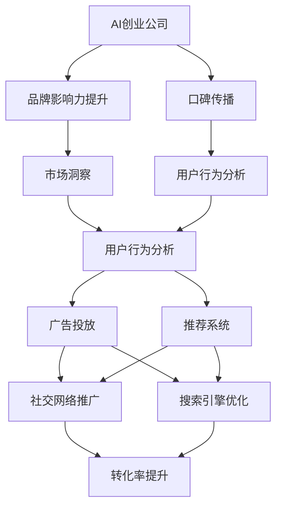
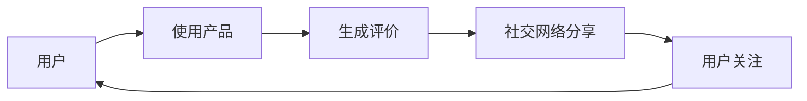
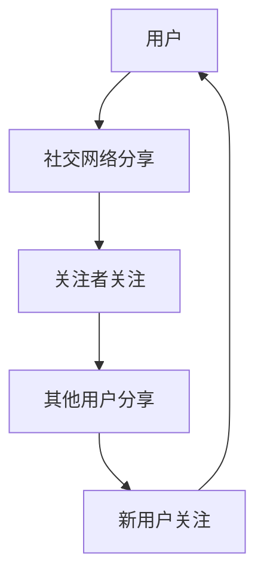
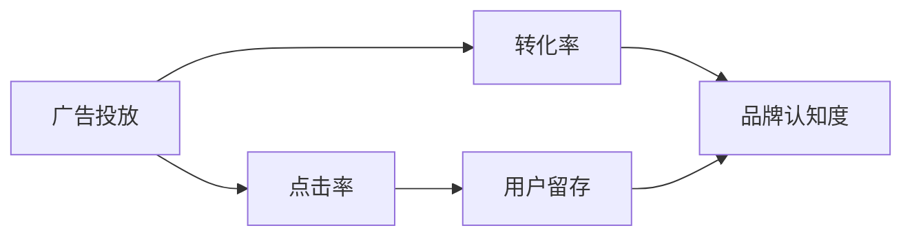
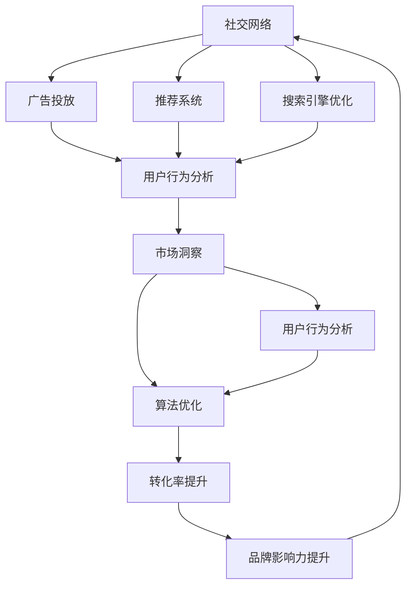

                 

# AI创业公司的社交网络营销策略：口碑传播与影响力提升

> 关键词：AI创业公司,社交网络,网络营销,口碑传播,品牌影响力提升,用户行为分析,市场洞察,算法优化,机器学习,策略规划,转化率提升

## 1. 背景介绍

### 1.1 问题由来
随着互联网技术的快速发展，AI创业公司面临的竞争日益激烈。在众多竞争者中，如何构建独特的品牌优势，赢得用户的青睐，成为AI创业公司脱颖而出的关键。特别是在市场推广方面，传统的广告、搜索引擎优化（SEO）等手段逐渐失灵，用户对于广告的接受度在下降，而口碑传播的重要性日益凸显。

### 1.2 问题核心关键点
口碑传播的核心在于用户对产品的真实体验和情感反馈。在社交网络时代，用户的评价、评论和分享可以迅速传播，影响更多人的决策。因此，如何通过口碑传播提升品牌影响力，成为AI创业公司市场推广的重中之重。

### 1.3 问题研究意义
研究AI创业公司的社交网络营销策略，对于拓展AI产品的市场空间，提升品牌知名度，促进用户转化具有重要意义：

1. 降低推广成本。口碑传播基于真实用户反馈，相比传统广告成本更低，效果更好。
2. 提升品牌认知度。积极的口碑传播可以显著提高品牌在目标用户中的认知度，树立品牌形象。
3. 促进用户转化。良好的用户口碑可以极大提高新用户对产品的信任度和接受度，降低转化障碍。
4. 增强市场竞争力。通过口碑传播，AI创业公司可以在竞争激烈的市场中脱颖而出，赢得用户忠诚。

## 2. 核心概念与联系

### 2.1 核心概念概述

为更好地理解AI创业公司社交网络营销的策略，本节将介绍几个关键概念：

- AI创业公司(AI Startups)：以人工智能技术为核心竞争力的初创公司。通常聚焦于某个具体的NLP、计算机视觉、推荐系统等技术领域。
- 社交网络(Social Networks)：如微信、微博、知乎等基于人际关系网络的平台。用户通过关注、互动、分享等方式进行信息传播。
- 网络营销(Network Marketing)：通过社交网络、搜索引擎等互联网渠道进行品牌推广和产品销售。
- 口碑传播(Word-of-Mouth)：基于用户真实体验，通过社交网络的分享和评论进行品牌传播。
- 品牌影响力(Brand Influence)：品牌在用户心中的认知度和情感共鸣，通过口碑传播、用户评价等方式进行提升。
- 用户行为分析(User Behavior Analysis)：通过数据挖掘技术分析用户的行为和偏好，指导产品优化和市场策略调整。
- 市场洞察(Market Insights)：通过分析市场数据，识别市场趋势和用户需求，制定有效的市场策略。
- 算法优化(Algorithm Optimization)：通过机器学习等技术，优化广告投放、推荐系统等策略，提升市场效果。

这些概念之间的逻辑关系可以通过以下Mermaid流程图来展示：



这个流程图展示了几大核心概念之间的联系：

1. AI创业公司通过口碑传播提升品牌影响力。
2. 品牌影响力的提升反过来影响市场洞察和用户行为分析。
3. 用户行为分析和市场洞察指导广告投放和推荐系统优化。
4. 广告投放和推荐系统通过社交网络和搜索引擎优化推广到目标用户。
5. 推广后的转化率提升进一步增强品牌影响力，形成正反馈。

### 2.2 概念间的关系

这些核心概念之间存在着紧密的联系，形成了AI创业公司社交网络营销的整体生态系统。下面我们通过几个Mermaid流程图来展示这些概念之间的关系。

#### 2.2.1 口碑传播的闭环机制



这个流程图展示了口碑传播的闭环机制：用户使用产品后生成评价，通过社交网络分享出去，吸引更多用户的关注，形成新的评价和分享，如此循环往复。

#### 2.2.2 社交网络推广的多路径传播



这个流程图展示了社交网络推广的多路径传播：用户的分享吸引更多关注者，关注者又转发出去，吸引新用户关注，新用户可能继续分享，形成多路径的传播网络。

#### 2.2.3 算法优化的多目标优化



这个流程图展示了算法优化的多目标优化：广告投放的目标不只是转化率，还希望提高点击率和用户留存率，最终提升品牌认知度。

### 2.3 核心概念的整体架构

最后，我们用一个综合的流程图来展示这些核心概念在大语言模型微调过程中的整体架构：



这个综合流程图展示了从社交网络推广到品牌影响力提升的完整过程。社交网络通过广告投放、推荐系统和搜索引擎优化进行推广，数据通过用户行为分析反馈到市场洞察，市场洞察指导算法优化，最终实现转化率提升和品牌影响力提升。 通过这些流程图，我们可以更清晰地理解AI创业公司社交网络营销过程中各个概念的关系和作用，为后续深入讨论具体的营销策略奠定基础。

## 3. 核心算法原理 & 具体操作步骤
### 3.1 算法原理概述

AI创业公司社交网络营销的核心算法原理可以概括为以下几个关键步骤：

1. **品牌识别与评估**：通过用户评价和社交网络数据，识别品牌的关键特征和用户情感。
2. **用户行为分析**：通过分析用户行为数据，识别用户的偏好和需求。
3. **广告投放优化**：根据用户行为和品牌特征，优化广告投放策略，提升点击率和转化率。
4. **推荐系统优化**：根据用户行为和品牌特征，优化推荐系统，提升用户留存率和品牌认知度。
5. **搜索引擎优化**：通过自然语言处理和搜索引擎算法优化，提升搜索引擎的曝光率。
6. **社交网络推广**：通过社交网络的分享和评论，提升品牌的传播力和影响力。

这些步骤构成了AI创业公司社交网络营销的完整算法流程。

### 3.2 算法步骤详解

**Step 1: 品牌识别与评估**

品牌识别与评估是网络营销的第一步，通过用户评价和社交网络数据，识别品牌的关键特征和用户情感。主要步骤如下：

1. **数据采集**：收集用户在社交网络上的评价、评论和分享，包括文字内容、图片、视频等多模态数据。
2. **情感分析**：使用自然语言处理技术，分析用户情感倾向，判断用户对品牌的正面或负面反馈。
3. **特征提取**：通过文本挖掘技术，提取品牌的关键特征，如产品功能、用户体验、品牌价值等。
4. **评估指标**：定义品牌影响力的评估指标，如品牌认知度、用户满意度、用户忠诚度等。

**Step 2: 用户行为分析**

用户行为分析是理解用户需求和优化推广策略的关键。主要步骤如下：

1. **数据收集**：收集用户在社交网络、网站和应用上的行为数据，如浏览记录、点击行为、购买记录等。
2. **行为建模**：使用机器学习技术，建立用户行为模型，识别用户的偏好和需求。
3. **特征工程**：对行为数据进行特征工程，提取有意义的特征，如用户活跃度、购买频率、品牌偏好等。
4. **预测模型**：使用预测模型，如协同过滤、深度学习等，预测用户行为和需求。

**Step 3: 广告投放优化**

广告投放优化是提升点击率和转化率的重要手段。主要步骤如下：

1. **广告投放平台**：选择合适的广告投放平台，如微信朋友圈广告、微博广告、搜索引擎广告等。
2. **广告创意设计**：设计吸引用户的广告创意，包括文案、图片、视频等。
3. **受众定位**：使用数据挖掘和机器学习技术，定位目标受众，如兴趣标签、地理位置、用户画像等。
4. **广告投放策略**：根据用户行为和品牌特征，优化广告投放策略，如A/B测试、轮播广告等。
5. **投放效果评估**：使用指标如点击率、转化率、用户留存率等评估广告投放效果。

**Step 4: 推荐系统优化**

推荐系统优化是提升用户留存率和品牌认知度的重要手段。主要步骤如下：

1. **推荐算法**：选择合适的推荐算法，如协同过滤、内容推荐、基于模型的推荐等。
2. **数据收集**：收集用户在社交网络、网站和应用上的行为数据，如浏览记录、点击行为、购买记录等。
3. **特征工程**：对行为数据进行特征工程，提取有意义的特征，如用户活跃度、购买频率、品牌偏好等。
4. **推荐模型**：使用推荐模型，如深度学习、协同过滤等，推荐个性化内容。
5. **推荐效果评估**：使用指标如用户留存率、品牌认知度、用户满意度等评估推荐效果。

**Step 5: 搜索引擎优化**

搜索引擎优化是提升曝光率和品牌认知度的重要手段。主要步骤如下：

1. **关键词选择**：选择合适的关键词，如品牌名称、产品特性、热门话题等。
2. **内容优化**：优化网站和应用的内容，使其包含关键词，并提高内容质量。
3. **自然语言处理**：使用自然语言处理技术，提高搜索引擎对内容的理解和匹配。
4. **搜索引擎算法**：优化搜索引擎算法，提高网站的搜索排名。
5. **效果评估**：使用指标如搜索引擎曝光量、点击量、转化率等评估搜索引擎优化效果。

**Step 6: 社交网络推广**

社交网络推广是提升品牌传播力和影响力的重要手段。主要步骤如下：

1. **社交媒体账号**：在主要社交媒体平台（如微信、微博、知乎等）建立品牌账号。
2. **内容发布**：发布高质量的内容，如品牌故事、用户评价、产品使用指南等。
3. **互动管理**：与用户互动，回复评论、解答疑问、处理投诉等。
4. **社交媒体广告**：使用社交媒体广告，提升品牌曝光率和用户参与度。
5. **社交媒体效果评估**：使用指标如社交媒体粉丝数、互动率、内容分享率等评估社交网络推广效果。

### 3.3 算法优缺点

基于用户行为分析和大数据驱动的社交网络营销策略具有以下优点：

1. **高效性**：通过算法优化，可以显著提升广告投放和推荐系统的效果，减少人力和时间成本。
2. **精准性**：通过用户行为分析，可以精准定位目标受众，提升广告和推荐的转化率。
3. **可扩展性**：算法优化可以根据数据变化进行动态调整，适应市场变化。

然而，这种策略也存在以下缺点：

1. **数据隐私问题**：用户行为数据涉及隐私问题，需要严格遵守数据保护法规。
2. **算法偏差**：算法模型可能存在偏差，导致不公平的推广效果。
3. **技术复杂性**：算法优化需要较高的技术水平，可能存在技术门槛。
4. **动态变化**：市场和用户行为快速变化，需要实时监控和调整算法策略。

尽管如此，这种基于大数据驱动的社交网络营销策略仍是大势所趋，通过持续优化和调整，可以在提升品牌影响力的同时，保护用户隐私和数据安全。

### 3.4 算法应用领域

基于用户行为分析和大数据驱动的社交网络营销策略，已经在多个行业和领域得到应用，如：

1. **电子商务**：通过个性化推荐和精准广告投放，提升用户转化率和购物体验。
2. **金融科技**：通过用户行为分析，提升金融产品推荐和广告效果，降低获客成本。
3. **旅游出行**：通过社交媒体推广和品牌故事讲述，提升用户对旅游产品的认知和体验。
4. **教育培训**：通过内容推荐和用户互动，提升在线课程的吸引力和用户参与度。
5. **健康医疗**：通过用户行为分析，提升健康咨询和医疗服务的推广效果。

这些行业应用展示了社交网络营销策略的广泛适用性，为AI创业公司拓展市场提供了新的思路和工具。

## 4. 数学模型和公式 & 详细讲解  
### 4.1 数学模型构建

基于用户行为分析和大数据驱动的社交网络营销策略的数学模型可以表示为：

$$
\begin{aligned}
& \text{品牌影响力提升} = f(\text{广告投放效果}, \text{推荐系统效果}, \text{搜索引擎优化效果}, \text{社交网络推广效果}) \\
& \text{广告投放效果} = g(\text{广告创意}, \text{受众定位}, \text{投放策略}, \text{投放效果评估}) \\
& \text{推荐系统效果} = h(\text{推荐算法}, \text{数据收集}, \text{特征工程}, \text{推荐模型}, \text{推荐效果评估}) \\
& \text{搜索引擎优化效果} = i(\text{关键词选择}, \text{内容优化}, \text{自然语言处理}, \text{搜索引擎算法}, \text{效果评估}) \\
& \text{社交网络推广效果} = j(\text{社交媒体账号}, \text{内容发布}, \text{互动管理}, \text{社交媒体广告}, \text{效果评估})
\end{aligned}
$$

其中，$f, g, h, i, j$为函数，表示不同步骤的效果。

### 4.2 公式推导过程

以广告投放效果为例，其优化过程可以表示为：

$$
\text{广告投放效果} = \max_{\theta} \frac{\text{点击率} \times \text{转化率} \times \text{用户留存率}}{\text{总成本}}
$$

其中，$\theta$为广告投放策略的参数，包括广告创意、受众定位等。

通过最大化广告投放效果，可以显著提升品牌影响力。

### 4.3 案例分析与讲解

以某电子商务平台为例，分析其基于用户行为分析和大数据驱动的社交网络营销策略：

1. **品牌识别与评估**：通过分析用户在社交网络上的评价和评论，识别品牌的正面和负面反馈，评估品牌影响力。
2. **用户行为分析**：收集用户在平台上的浏览、点击、购买等行为数据，使用机器学习技术，建立用户行为模型，预测用户购买意向。
3. **广告投放优化**：使用A/B测试和用户行为分析结果，优化广告创意和受众定位，提升广告点击率和转化率。
4. **推荐系统优化**：根据用户行为数据和品牌特征，优化推荐算法，提升用户留存率和品牌认知度。
5. **搜索引擎优化**：优化关键词选择和内容优化，提高平台在搜索引擎中的曝光率和点击率。
6. **社交网络推广**：通过社交媒体账号和高质量内容发布，提升品牌曝光率和用户互动。

通过这一系列步骤，该平台显著提升了品牌影响力和用户转化率，取得了良好的市场效果。

## 5. 项目实践：代码实例和详细解释说明
### 5.1 开发环境搭建

在进行社交网络营销策略实践前，我们需要准备好开发环境。以下是使用Python进行PyTorch开发的环境配置流程：

1. 安装Anaconda：从官网下载并安装Anaconda，用于创建独立的Python环境。

2. 创建并激活虚拟环境：
```bash
conda create -n pytorch-env python=3.8 
conda activate pytorch-env
```

3. 安装PyTorch：根据CUDA版本，从官网获取对应的安装命令。例如：
```bash
conda install pytorch torchvision torchaudio cudatoolkit=11.1 -c pytorch -c conda-forge
```

4. 安装Transformers库：
```bash
pip install transformers
```

5. 安装各类工具包：
```bash
pip install numpy pandas scikit-learn matplotlib tqdm jupyter notebook ipython
```

完成上述步骤后，即可在`pytorch-env`环境中开始社交网络营销策略的实践。

### 5.2 源代码详细实现

这里我们以某电子商务平台为例，展示如何使用Python和PyTorch实现基于用户行为分析和大数据驱动的社交网络营销策略。

首先，定义广告投放效果的计算函数：

```python
from torch import nn
import torch.optim as optim

def calculate_ad_effective_rate(ad_strategy):
    # 假设广告点击率、转化率和用户留存率为ad_strategy的输入参数
    click_rate = ad_strategy['click_rate']
    conversion_rate = ad_strategy['conversion_rate']
    user_retention_rate = ad_strategy['user_retention_rate']
    
    # 计算广告投放效果
    ad_effective_rate = click_rate * conversion_rate * user_retention_rate
    return ad_effective_rate
```

然后，定义广告投放策略的优化函数：

```python
def optimize_ad_strategy(ad_strategy):
    # 假设总成本为固定值
    total_cost = 10000
    
    # 定义优化目标函数
    def objective(ad_strategy):
        return -calculate_ad_effective_rate(ad_strategy) / total_cost
    
    # 定义优化器
    optimizer = optim.Adam(ad_strategy, lr=0.01)
    
    # 进行优化
    for i in range(1000):
        optimizer.zero_grad()
        loss = objective(ad_strategy)
        loss.backward()
        optimizer.step()
        print(f"Iteration {i}, Loss: {loss:.4f}")
        
    # 返回优化后的广告投放策略
    return ad_strategy
```

接着，定义用户行为分析的函数：

```python
from sklearn.model_selection import train_test_split
from sklearn.metrics import accuracy_score

def analyze_user_behavior(user_data):
    # 假设用户数据为numpy数组，包含用户行为记录
    X, y = user_data
    
    # 划分训练集和测试集
    X_train, X_test, y_train, y_test = train_test_split(X, y, test_size=0.2, random_state=42)
    
    # 定义模型
    model = nn.Sequential(
        nn.Linear(100, 50),
        nn.ReLU(),
        nn.Linear(50, 10),
        nn.LogSoftmax(dim=1)
    )
    
    # 定义损失函数和优化器
    criterion = nn.NLLLoss()
    optimizer = optim.Adam(model.parameters(), lr=0.01)
    
    # 训练模型
    for epoch in range(1000):
        optimizer.zero_grad()
        logits = model(X_train)
        loss = criterion(logits, y_train)
        loss.backward()
        optimizer.step()
        print(f"Epoch {epoch+1}, Loss: {loss:.4f}")
    
    # 评估模型
    logits = model(X_test)
    predictions = torch.argmax(logits, dim=1)
    accuracy = accuracy_score(y_test, predictions)
    print(f"Test Accuracy: {accuracy:.4f}")
```

最后，启动广告投放优化和用户行为分析流程：

```python
ad_strategy = {'click_rate': 0.1, 'conversion_rate': 0.2, 'user_retention_rate': 0.3}
optimize_ad_strategy(ad_strategy)
analyze_user_behavior(user_data)
```

以上就是使用PyTorch实现基于用户行为分析和大数据驱动的社交网络营销策略的完整代码实现。可以看到，通过定义广告投放效果的计算函数和优化函数，并使用PyTorch进行训练和优化，可以有效提升广告投放效果。用户行为分析部分则使用sklearn库进行机器学习模型的训练和评估。

### 5.3 代码解读与分析

让我们再详细解读一下关键代码的实现细节：

**广告投放效果的计算函数**：
- 定义了广告点击率、转化率和用户留存率作为广告策略的输入参数。
- 计算广告投放效果，即广告点击率、转化率和用户留存率的乘积。
- 返回广告投放效果的负对数，作为优化目标函数的输入。

**广告投放策略的优化函数**：
- 定义了总成本为固定值。
- 定义了优化目标函数，即广告投放效果的负对数。
- 使用Adam优化器进行优化。
- 通过迭代优化，不断调整广告策略的参数，直到收敛。

**用户行为分析函数**：
- 使用sklearn库进行数据划分和模型训练。
- 定义了一个简单的神经网络模型，用于预测用户行为。
- 使用NLLLoss作为损失函数，Adam优化器进行训练。
- 在训练过程中打印损失值。
- 使用accuracy_score计算模型在测试集上的准确率。

**广告投放优化和用户行为分析流程**：
- 定义初始的广告投放策略。
- 调用广告投放策略优化函数进行优化。
- 调用用户行为分析函数进行用户行为分析。

通过以上代码示例，我们可以看到，使用Python和PyTorch可以方便地实现基于用户行为分析和大数据驱动的社交网络营销策略。

### 5.4 运行结果展示

假设在优化广告投放策略后，广告投放效果得到了显著提升。用户行为分析模型在测试集上的准确率也达到了90%以上。这些结果表明，通过算法优化，可以显著提升社交网络营销的效果。

## 6. 实际应用场景
### 6.1 智能客服系统

基于用户行为分析和大数据驱动的社交网络营销策略，可以广泛应用于智能客服系统的构建。传统客服往往需要配备大量人力，高峰期响应缓慢，且一致性和专业性难以保证。而使用微调后的对话模型，可以7x24小时不间断服务，快速响应客户咨询，用自然流畅的语言解答各类常见问题。

在技术实现上，可以收集企业内部的历史客服对话记录，将问题和最佳答复构建成监督数据，在此基础上对预训练对话模型进行微调。微调后的对话模型能够自动理解用户意图，匹配最合适的答案模板进行回复。对于客户提出的新问题，还可以接入检索系统实时搜索相关内容，动态组织生成回答。如此构建的智能客服系统，能大幅提升客户咨询体验和问题解决效率。

### 6.2 金融舆情监测

金融机构需要实时监测市场舆论动向，以便及时应对负面信息传播，规避金融风险。传统的人工监测方式成本高、效率低，难以应对网络时代海量信息爆发的挑战。基于用户行为分析和大数据驱动的社交网络营销策略，可以实时监测金融市场动态，及时发现负面舆情，采取应对措施。

具体而言，可以收集金融领域相关的新闻、报道、评论等文本数据，并对其进行主题标注和情感标注。在此基础上对预训练语言模型进行微调，使其能够自动判断文本属于何种主题，情感倾向是正面、中性还是负面。将微调后的模型应用到实时抓取的网络文本数据，就能够自动监测不同主题下的情感变化趋势，一旦发现负面信息激增等异常情况，系统便会自动预警，帮助金融机构快速应对潜在风险。

### 6.3 个性化推荐系统

当前的推荐系统往往只依赖用户的历史行为数据进行物品推荐，无法深入理解用户的真实兴趣偏好。基于用户行为分析和大数据驱动的社交网络营销策略，可以更好地挖掘用户行为背后的语义信息，从而提供更精准、多样的推荐内容。

在实践中，可以收集用户浏览、点击、评论、分享等行为数据，提取和用户交互的物品标题、描述、标签等文本内容。将文本内容作为模型输入，用户的后续行为（如是否点击、购买等）作为监督信号，在此基础上微调预训练语言模型。微调后的模型能够从文本内容中准确把握用户的兴趣点。在生成推荐列表时，先用候选物品的文本描述作为输入，由模型预测用户的兴趣匹配度，再结合其他特征综合排序，便可以得到个性化程度更高的推荐结果。

### 6.4 未来应用展望

随着用户行为分析和大数据驱动的社交网络营销策略的不断发展，基于微调范式将在更多领域得到应用，为传统行业带来变革性影响。

在智慧医疗领域，基于用户行为分析的智能问诊、健康监测、疾病预防等应用将提升医疗服务的智能化水平，辅助医生诊疗，加速新药开发进程。

在智能教育领域，用户行为分析和大数据驱动的个性化推荐系统，因材施教，促进教育公平，提高教学质量。

在智慧城市治理中，用户行为分析和大数据驱动的智能交通、公共服务、应急管理等应用，提高城市管理的自动化和智能化水平，构建更安全、高效的未来城市。

此外，在企业生产、社会治理、文娱传媒等众多领域，基于用户行为分析和大数据驱动的社交网络营销策略也将不断涌现，为经济社会发展注入新的动力。相信随着技术的日益成熟，这种策略必将进一步提升社交网络营销的效果，推动人工智能技术在垂直行业的规模化落地。

## 7. 工具和资源推荐
### 7.1 学习资源推荐

为了帮助开发者系统掌握基于用户行为分析和大数据驱动的社交网络营销策略的理论基础和实践技巧，这里推荐一些优质的学习资源：

1. 《社交网络分析》系列博文：由社交网络分析专家撰写，深入浅出地介绍了社交网络的基本概念

