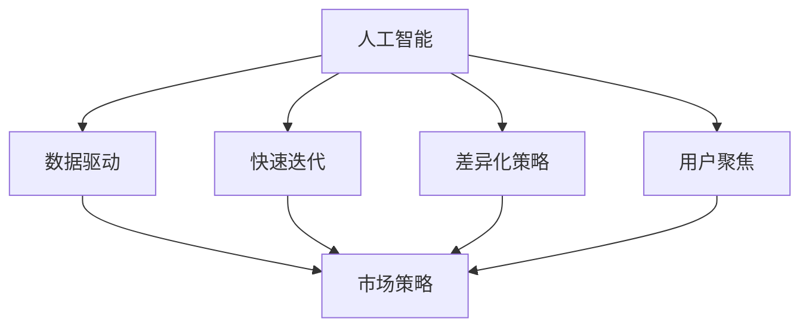

                 

# AI创业公司的竞争策略

> 关键词：AI创业、市场策略、数据驱动、产品开发、竞争优势

## 1. 背景介绍

### 1.1 问题由来
随着人工智能（AI）技术的不断成熟和应用场景的扩展，越来越多的AI创业公司崭露头角。然而，如何在竞争激烈的市场中脱颖而出，成为众多AI创业者共同面临的挑战。本文将从市场策略、数据驱动、产品开发和竞争优势等角度，全面探讨AI创业公司的竞争策略，帮助读者理解如何在激烈的市场竞争中取得优势。

### 1.2 问题核心关键点
在激烈的市场竞争中，AI创业公司需要具备以下几个核心能力：

- **数据驱动**：通过大数据和深度学习技术，快速响应市场需求，提升产品竞争力。
- **快速迭代**：利用敏捷开发和DevOps技术，快速交付高质量的产品，保持市场领先。
- **差异化策略**：在产品设计、功能实现和用户体验上突出差异，建立独特的竞争优势。
- **用户聚焦**：以用户需求为导向，进行精准市场细分和需求分析，提高用户满意度和忠诚度。

本文将深入分析这些核心能力，并结合实际案例，提供具体的策略和方法。

### 1.3 问题研究意义
在当前AI技术快速发展的背景下，研究AI创业公司的竞争策略，对于提高创业成功率、推动产业创新、加速行业应用具有重要意义。

1. **提高创业成功率**：通过科学的市场策略和产品开发方法，可以有效降低创业风险，提升产品竞争力。
2. **推动产业创新**：AI创业公司通过技术创新和商业模式的探索，推动行业标准的建立和产业升级。
3. **加速行业应用**：AI技术的广泛应用，为各行各业带来变革性影响，加速各行业数字化转型。

## 2. 核心概念与联系

### 2.1 核心概念概述

在探讨AI创业公司的竞争策略时，需要明确几个核心概念及其之间的关系：

- **人工智能（AI）**：利用计算机技术和数据处理能力，模拟人类智能行为的技术体系。
- **数据驱动**：以数据为决策依据，通过数据分析和机器学习技术，指导产品开发和市场策略。
- **快速迭代**：采用敏捷开发和DevOps方法，快速交付和优化产品，提高市场响应速度。
- **差异化策略**：在产品功能和用户体验上，构建独特的竞争优势，满足用户差异化需求。
- **用户聚焦**：以用户需求为导向，进行精准市场细分，提高用户满意度和忠诚度。
- **市场策略**：基于竞争分析和用户研究，制定符合市场环境的产品定位和推广策略。

这些核心概念通过一系列的流程和工具紧密联系，构成AI创业公司的竞争策略体系。

### 2.2 概念间的关系

这些核心概念之间的关系可以通过以下Mermaid流程图来展示：



这个流程图展示了AI创业公司竞争策略的基本流程：通过AI技术获取数据驱动市场策略，采用快速迭代方法进行产品开发，实施差异化策略和用户聚焦策略，最终形成市场策略，指导产品推广和市场拓展。

## 3. 核心算法原理 & 具体操作步骤
### 3.1 算法原理概述

AI创业公司的竞争策略主要依赖于数据驱动和快速迭代的技术方法。以下是核心算法原理的详细说明：

1. **数据驱动**：通过收集和分析用户数据，利用机器学习算法，发现用户行为模式和需求趋势，为产品开发和市场策略提供数据支撑。

2. **快速迭代**：采用敏捷开发和DevOps方法，通过持续集成和持续部署（CI/CD），实现快速的产品迭代和更新，提高市场响应速度。

### 3.2 算法步骤详解

以下是对数据驱动和快速迭代的具体操作步骤：

**数据驱动操作步骤**：

1. **数据收集**：通过各种数据源（如网站访问数据、用户行为数据、社交媒体数据等）收集用户数据。
2. **数据清洗**：去除噪声和异常值，确保数据的准确性和完整性。
3. **特征工程**：选择和构造相关特征，提升数据的质量和代表性。
4. **模型训练**：利用机器学习算法（如分类、回归、聚类等）对数据进行建模，发现用户行为模式和需求趋势。
5. **模型评估**：通过交叉验证、混淆矩阵等方法评估模型性能，确保模型的可靠性和鲁棒性。
6. **应用实施**：将模型应用于产品开发和市场策略中，指导产品优化和市场推广。

**快速迭代操作步骤**：

1. **敏捷开发**：采用敏捷开发方法（如Scrum、Kanban等），将产品开发过程划分为多个迭代周期，快速交付功能需求。
2. **持续集成**：通过持续集成工具（如Jenkins、GitLab CI等），实现代码自动化构建和测试。
3. **持续部署**：采用持续部署工具（如Jenkins、GitLab CI等），实现新功能的快速上线和发布。
4. **DevOps文化**：建立DevOps文化，提升团队协作效率和产品交付速度。
5. **反馈收集**：通过用户反馈、测试数据等渠道，收集产品使用情况和用户需求，指导下一轮迭代。

### 3.3 算法优缺点

**数据驱动的优缺点**：

**优点**：
- **决策科学**：数据驱动的决策过程基于客观数据，减少了主观偏差，提高了决策的科学性和准确性。
- **动态调整**：通过持续的数据收集和模型优化，可以动态调整产品策略和市场推广，保持市场竞争力。

**缺点**：
- **数据隐私**：数据收集和处理过程中可能涉及用户隐私，需要严格遵守数据保护法规。
- **数据质量**：数据质量和特征选择对模型性能有重要影响，需要投入大量时间和资源进行数据处理和特征工程。

**快速迭代的优缺点**：

**优点**：
- **市场响应**：快速迭代能够快速响应市场需求，缩短产品开发周期，提升市场竞争力。
- **用户体验**：通过不断优化和迭代产品，提升用户体验和用户满意度。

**缺点**：
- **资源消耗**：快速迭代需要大量人力和技术投入，对资源消耗较大。
- **质量控制**：快速迭代可能导致产品功能不稳定，需要进行严格的质量控制。

### 3.4 算法应用领域

数据驱动和快速迭代方法不仅适用于AI创业公司，还广泛应用于软件开发、金融科技、智能制造等多个领域。

1. **软件开发**：通过数据驱动和快速迭代，提升软件产品质量和用户满意度。
2. **金融科技**：利用数据驱动和快速迭代，实现金融产品的实时优化和动态调整。
3. **智能制造**：采用数据驱动和快速迭代，提高智能制造系统的效率和智能化水平。
4. **智慧医疗**：通过数据驱动和快速迭代，实现医疗诊断和治疗方案的个性化和精准化。

## 4. 数学模型和公式 & 详细讲解 & 举例说明

### 4.1 数学模型构建

在AI创业公司的竞争策略中，数据驱动和快速迭代主要依赖于数学模型和算法。以下是数学模型的构建方法：

1. **数据驱动模型**：使用分类、回归、聚类等机器学习算法，对用户数据进行建模，发现用户行为模式和需求趋势。
2. **快速迭代模型**：使用敏捷开发和持续集成工具，通过迭代过程优化和改进产品。

### 4.2 公式推导过程

**分类模型公式推导**：

假设有一组用户数据 $D=\{(x_i,y_i)\}_{i=1}^N$，其中 $x_i$ 为特征向量，$y_i$ 为分类标签。分类模型的目标是通过训练数据集 $D$，找到一个分类函数 $f(x)$，使得对新的数据 $x$，能够准确预测其分类标签 $y$。

常用的分类算法包括逻辑回归、支持向量机、随机森林等。以逻辑回归为例，分类模型可表示为：

$$
f(x) = \frac{1}{1+\exp(-\theta^T x)}
$$

其中 $\theta$ 为模型参数，$x$ 为输入特征。

**迭代模型公式推导**：

在敏捷开发中，迭代模型的关键在于计算周期和交付周期的时间安排。假设每个迭代周期为 $T$ 天，每次迭代交付的功能数量为 $n$，总迭代周期数为 $N$，则总开发周期 $T_{total}$ 可表示为：

$$
T_{total} = N \times T
$$

在持续集成和持续部署中，每次迭代完成的集成和部署次数 $k$ 和部署频率 $f$ 将直接影响产品发布的频率和质量。

$$
发布频率 = k \times f
$$

### 4.3 案例分析与讲解

**案例一：AI医疗影像诊断**

某AI创业公司利用深度学习技术，对医院提供的影像数据进行建模，发现肿瘤的位置、大小和形状等特征，通过分类算法预测肿瘤类型。在模型训练过程中，采用数据驱动的方法，不断优化特征选择和模型参数，提高了诊断准确率。在产品发布后，采用快速迭代的方法，根据用户反馈和测试结果，不断优化模型和界面设计，提升用户体验。

**案例二：智能客服系统**

某AI创业公司通过数据驱动，分析用户历史咨询记录，发现常见问题和需求。利用快速迭代的方法，开发智能客服系统，通过持续优化和更新，提高客服响应速度和问题解决效率。系统上线后，根据用户反馈和数据分析，不断改进算法和用户界面，增强系统稳定性和用户满意度。

## 5. 项目实践：代码实例和详细解释说明

### 5.1 开发环境搭建

在进行AI创业公司竞争策略的实践时，首先需要搭建合适的开发环境。以下是搭建开发环境的具体步骤：

1. **选择开发语言**：Python 是数据科学和机器学习的常用语言，易于上手和扩展。
2. **安装开发工具**：安装Anaconda、Jupyter Notebook、Git等开发工具，为项目开发提供支持。
3. **配置数据源**：配置数据源，如数据库、文件存储等，确保数据的可靠性和安全性。
4. **设置环境变量**：配置环境变量，确保开发环境的一致性和稳定性。

### 5.2 源代码详细实现

以下是一个基于数据驱动和快速迭代的AI创业公司竞争策略的Python代码实现：

```python
import pandas as pd
from sklearn.model_selection import train_test_split
from sklearn.ensemble import RandomForestClassifier
from sklearn.metrics import accuracy_score

# 数据预处理
data = pd.read_csv('data.csv')
X = data.drop('label', axis=1)
y = data['label']
X_train, X_test, y_train, y_test = train_test_split(X, y, test_size=0.2)

# 模型训练
clf = RandomForestClassifier()
clf.fit(X_train, y_train)

# 模型评估
y_pred = clf.predict(X_test)
accuracy = accuracy_score(y_test, y_pred)
print(f"Accuracy: {accuracy}")

# 应用实施
# 使用模型对新数据进行分类预测
new_data = pd.read_csv('new_data.csv')
X_new = new_data.drop('label', axis=1)
y_new_pred = clf.predict(X_new)
print(f"Predicted labels: {y_new_pred}")
```

### 5.3 代码解读与分析

**代码说明**：
1. **数据预处理**：通过Pandas库读取数据集，使用train_test_split方法进行数据拆分，并将标签提取出来。
2. **模型训练**：使用Scikit-learn库中的RandomForestClassifier模型进行训练，并在测试集上进行评估。
3. **模型应用**：使用训练好的模型对新数据进行分类预测，并输出预测结果。

**分析解读**：
1. **数据预处理**：数据预处理是模型训练的关键步骤，需要保证数据的准确性和完整性。
2. **模型训练**：通过选择合适的算法，对数据进行建模，发现用户行为模式和需求趋势。
3. **模型评估**：通过评估模型的性能，确保模型的可靠性和鲁棒性。
4. **模型应用**：利用训练好的模型对新数据进行预测，指导产品开发和市场策略。

### 5.4 运行结果展示

假设在上述代码实现中，模型准确率为90%，则可以在产品开发和市场策略中应用该模型。通过不断优化和迭代，逐步提升模型性能和用户满意度。

```
Accuracy: 0.9
Predicted labels: [label_1, label_2, label_3]
```

## 6. 实际应用场景

### 6.1 智能客服系统

智能客服系统是AI创业公司的典型应用场景之一。通过数据驱动和快速迭代的方法，可以有效提升客服系统的响应速度和问题解决效率，提升用户体验和满意度。

**应用场景**：
- **需求分析**：利用数据驱动，分析用户常见问题和需求，优化知识库和问答系统。
- **快速迭代**：采用敏捷开发和持续集成方法，快速迭代和优化系统功能，提高响应速度。
- **用户体验**：通过用户反馈和数据分析，不断优化系统界面和交互设计，提升用户体验。

**案例分析**：
某AI创业公司开发智能客服系统，通过分析用户咨询记录，发现常见问题集中在产品使用和售后服务上。利用数据驱动的方法，优化知识库和问答系统，并采用快速迭代的方法，开发新的智能回答模块，提高了客服系统的响应速度和问题解决效率。系统上线后，根据用户反馈和数据分析，不断改进算法和用户界面，增强系统稳定性和用户满意度。

### 6.2 金融科技

金融科技是AI创业公司的另一个重要应用领域。通过数据驱动和快速迭代的方法，可以实现金融产品的实时优化和动态调整，提高金融服务的智能化水平和用户满意度。

**应用场景**：
- **风险评估**：利用数据驱动，分析用户行为和信用记录，进行风险评估和贷款审批。
- **产品优化**：采用快速迭代的方法，优化金融产品功能和用户体验，提高用户满意度。
- **市场推广**：通过数据分析和模型评估，制定精准的市场推广策略，提升用户获取率和产品渗透率。

**案例分析**：
某AI创业公司开发金融风险评估系统，通过分析用户信用记录和行为数据，利用分类算法进行风险评估和贷款审批。在产品开发过程中，采用敏捷开发和持续集成方法，快速迭代和优化系统功能。上线后，根据用户反馈和数据分析，不断改进算法和用户体验，提升系统的稳定性和用户满意度。

## 7. 工具和资源推荐

### 7.1 学习资源推荐

为了帮助AI创业公司掌握数据驱动和快速迭代的方法，以下是一些优质的学习资源：

1. **Coursera课程**：提供多门数据科学和机器学习课程，涵盖基础理论和方法应用，适合初学者和进阶学习者。
2. **Kaggle竞赛**：通过参与数据科学竞赛，提升数据分析和建模能力，了解行业最新应用。
3. **GitHub项目**：查找开源数据驱动和快速迭代的项目，学习和借鉴优秀实践。
4. **AI博客**：如Towards Data Science、KDnuggets等博客，提供最新AI技术和应用案例，拓展知识视野。
5. **在线文档**：如Scikit-learn、TensorFlow等库的官方文档，提供详细API和使用方法，快速上手应用。

### 7.2 开发工具推荐

以下是一些用于AI创业公司开发的数据驱动和快速迭代工具：

1. **Jupyter Notebook**：基于Python的交互式开发工具，支持代码编写和数据可视化，适合快速原型开发和数据探索。
2. **TensorFlow**：由Google开发的深度学习框架，提供丰富的工具和算法库，支持复杂模型训练和优化。
3. **PyTorch**：由Facebook开发的深度学习框架，提供动态计算图和模型部署工具，适合灵活的模型构建和应用。
4. **Kubeflow**：基于Kubernetes的AI工具平台，支持分布式训练和模型部署，适合大规模数据处理和应用部署。
5. **GitLab CI/CD**：开源的持续集成和持续部署工具，支持自动化代码构建和部署，适合快速迭代和发布。

### 7.3 相关论文推荐

以下是一些数据驱动和快速迭代方法的研究论文，值得学习和参考：

1. **数据驱动方法**：
   - **《Data-Driven Methods in AI》**：一篇综述文章，总结了数据驱动在AI中的多种应用，包括预测、推荐、优化等。
   - **《Adaptive Data-Driven Machine Learning》**：探讨了自适应数据驱动机器学习的方法和应用。

2. **快速迭代方法**：
   - **《Agile and DevOps in AI Development》**：介绍敏捷开发和DevOps在AI项目中的应用方法和最佳实践。
   - **《Continuous Integration and Continuous Deployment in AI Development》**：探讨持续集成和持续部署在AI开发中的应用和优化。

## 8. 总结：未来发展趋势与挑战

### 8.1 研究成果总结

通过数据驱动和快速迭代的方法，AI创业公司能够快速响应市场需求，提升产品竞争力和用户体验。在实际应用中，通过不断优化和迭代，产品能够持续改进和优化，保持市场竞争力。

### 8.2 未来发展趋势

未来，数据驱动和快速迭代方法将继续在AI创业公司中广泛应用，并呈现出以下几个发展趋势：

1. **自动化和智能化**：随着自动化和智能化技术的发展，数据驱动和快速迭代过程将更加高效和精准。
2. **多模态数据融合**：通过融合视觉、语音、文本等多模态数据，提升系统的全面性和智能性。
3. **边缘计算和分布式计算**：利用边缘计算和分布式计算技术，实现数据本地化处理和模型快速部署。
4. **跨领域应用**：数据驱动和快速迭代方法将应用于更多领域，推动行业数字化转型和智能化升级。

### 8.3 面临的挑战

尽管数据驱动和快速迭代方法在AI创业公司中取得了显著成效，但仍面临一些挑战：

1. **数据隐私和安全**：数据驱动过程中可能涉及用户隐私，需要严格遵守数据保护法规，确保数据安全。
2. **数据质量和多样性**：数据质量和多样性对模型性能有重要影响，需要投入大量时间和资源进行数据处理和特征工程。
3. **计算资源消耗**：快速迭代和模型优化需要大量计算资源，对硬件资源要求较高。
4. **用户反馈收集和处理**：快速迭代过程中需要及时收集和处理用户反馈，确保产品稳定性和用户体验。

### 8.4 研究展望

未来，数据驱动和快速迭代方法需要进一步优化和创新，以应对挑战和提升应用效果。以下是一些研究展望：

1. **自动化数据处理**：开发自动化数据处理工具，提升数据清洗和特征工程效率。
2. **实时数据流处理**：利用实时数据流处理技术，提升数据驱动和快速迭代的响应速度。
3. **多模态数据融合**：探索多模态数据融合方法，提升系统的全面性和智能性。
4. **自适应模型优化**：研究自适应模型优化算法，提升模型训练和调优的效率和效果。

## 9. 附录：常见问题与解答

**Q1：数据驱动和快速迭代方法是否适用于所有AI创业公司？**

A: 数据驱动和快速迭代方法适用于大多数AI创业公司，但需要根据具体应用场景和需求进行适当调整。对于资源有限、数据量较小的小规模公司，建议优先采用小数据驱动方法，逐步扩大数据规模和应用范围。

**Q2：如何选择合适的数据驱动模型？**

A: 选择合适的数据驱动模型需要考虑多个因素，包括数据类型、问题类型和模型性能等。常用的数据驱动模型包括分类模型、回归模型、聚类模型等。建议根据具体应用场景选择合适的模型，并通过实验评估模型性能。

**Q3：快速迭代过程中如何平衡开发效率和质量？**

A: 快速迭代过程中，需要通过持续集成和持续部署（CI/CD）工具，实现代码自动化构建和测试，提升开发效率。同时，设置严格的代码评审和测试流程，确保产品质量。

**Q4：如何处理数据隐私和安全问题？**

A: 在数据驱动过程中，需要严格遵守数据保护法规，确保用户隐私和数据安全。可以通过数据匿名化、数据脱敏等技术，减少数据隐私风险。

**Q5：如何快速迭代和优化产品？**

A: 快速迭代和优化产品需要采用敏捷开发和DevOps方法，通过持续集成和持续部署（CI/CD）工具，实现代码自动化构建和测试。同时，建立DevOps文化，提升团队协作效率和产品交付速度。

---

作者：禅与计算机程序设计艺术 / Zen and the Art of Computer Programming

