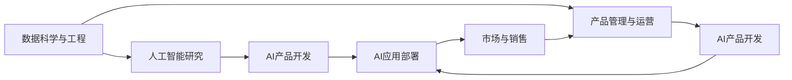

                 

# AI创业公司的组织架构优化设计

## 1. 背景介绍

随着人工智能技术的发展和普及，越来越多的初创企业加入到了AI创业的行列中。然而，构建一个高效的AI创业公司组织架构，并不是一件容易的事情。在AI技术不断迭代、市场需求日益多样化的背景下，合理的组织架构设计，不仅是企业生存和发展的关键，也是推动创新和提升竞争力的重要因素。本文旨在探讨如何优化AI创业公司的组织架构，通过系统性分析和实践经验分享，帮助创业者打造高效、灵活、具有竞争力的AI公司。

## 2. 核心概念与联系

### 2.1 核心概念概述

#### 2.1.1 AI创业公司

AI创业公司是指以人工智能技术为核心驱动力，致力于解决实际问题的初创企业。这些企业通常聚焦于机器学习、自然语言处理、计算机视觉等前沿技术领域，通过技术创新来解决特定行业问题，实现商业价值。

#### 2.1.2 组织架构

组织架构是指企业内部的结构安排，包括部门划分、岗位设置、职责分工、决策流程等方面。有效的组织架构设计，能够促进企业资源的高效利用，提升员工的工作效率和创造力，从而推动企业发展。

#### 2.1.3 数据科学与工程

数据科学与工程是大数据、机器学习等技术在实际问题中的应用，涉及数据的采集、处理、分析和应用。在AI创业公司中，数据科学与工程团队负责解决数据问题，为公司的AI产品提供坚实的基础。

#### 2.1.4 产品管理与运营

产品管理与运营负责产品的规划、设计、开发、测试和上线，确保产品能够满足市场需求，实现商业目标。在AI创业公司中，产品管理与运营团队不仅要理解技术，还要具备市场洞察力和业务思维。

#### 2.1.5 人工智能研究

人工智能研究聚焦于AI技术的研发，包括算法创新、模型优化、技术创新等。在AI创业公司中，AI研究团队负责前沿技术的研究和开发，为公司的产品和服务提供技术支持。

### 2.2 核心概念之间的联系

AI创业公司的组织架构设计，需要综合考虑上述核心概念的相互作用。一个合理的组织架构，应当能够：

- **促进技术创新**：数据科学与工程、人工智能研究团队应当紧密合作，共同推动技术突破。
- **满足市场需求**：产品管理与运营团队应当深入理解市场，确保AI产品能够解决实际问题，满足用户需求。
- **优化资源配置**：通过合理的部门划分和职责分工，提升资源利用效率，降低管理成本。
- **增强决策效率**：清晰的决策流程和职责分工，确保快速响应市场变化，及时调整产品策略。

这些核心概念之间的联系，通过一个简单的Mermaid流程图来展示：



## 3. 核心算法原理 & 具体操作步骤

### 3.1 算法原理概述

AI创业公司组织架构的优化设计，需要遵循以下几个核心原则：

1. **明确目标与愿景**：公司应当清晰定义其AI发展目标和愿景，这将指导组织架构的设计和调整。
2. **部门功能互补**：各部门应当功能互补，避免冗余和重复，提升整体效率。
3. **跨部门协作**：通过设立跨部门团队，促进不同领域之间的协作和知识共享，加速创新。
4. **灵活调整与适应**：组织架构应当具有一定的灵活性，能够快速适应市场和技术的变化。

### 3.2 算法步骤详解

#### 3.2.1 确定公司愿景与目标

首先需要明确公司的愿景和AI发展目标。这将指导后续的部门设置和职责分工。例如，如果公司的目标是成为行业领先的AI驱动解决方案提供商，那么组织架构设计应当围绕这个目标展开。

#### 3.2.2 部门划分与职责分工

根据公司愿景和目标，设计部门结构和职责分工。以下是一个典型的AI创业公司组织架构示例：

1. **数据科学与工程部**：负责数据的采集、清洗、处理和分析，提供数据支持。
2. **人工智能研究部**：负责AI技术的研究和开发，包括算法创新、模型优化等。
3. **产品管理与运营部**：负责产品的规划、设计、开发、测试和上线，确保产品满足市场需求。
4. **AI产品开发部**：负责AI产品的开发和部署，将技术转化为实际应用。
5. **市场与销售部**：负责市场分析和客户关系管理，推动产品销售和市场推广。

#### 3.2.3 跨部门协作机制

设立跨部门团队，促进不同领域之间的协作和知识共享。例如，可以设立“AI创新委员会”，由数据科学与工程部、人工智能研究部、产品管理与运营部共同组成，定期进行讨论和决策，确保各部门之间的协同工作。

#### 3.2.4 灵活调整与适应

组织架构应当具有一定的灵活性，能够快速适应市场和技术的变化。例如，设立“敏捷团队”，采用Scrum等敏捷开发方法，快速响应市场需求和变化。

### 3.3 算法优缺点

#### 3.3.1 优点

1. **提高效率**：通过明确目标、功能互补和跨部门协作，提升整体效率。
2. **促进创新**：跨部门团队和灵活调整机制，加速创新和知识共享。
3. **满足市场需求**：产品管理与运营团队深入理解市场，确保产品满足用户需求。

#### 3.3.2 缺点

1. **协调成本高**：跨部门协作需要较高的协调成本，特别是在数据科学与工程部与人工智能研究部之间。
2. **灵活性不足**：过度追求灵活性可能导致组织架构的稳定性不足。
3. **决策复杂化**：多部门参与决策可能导致决策效率降低。

### 3.4 算法应用领域

AI创业公司的组织架构优化设计，适用于各类AI驱动的创业公司，包括但不限于以下领域：

- **金融科技**：AI驱动的金融科技公司，如智能投顾、风险管理等。
- **医疗健康**：AI驱动的医疗健康公司，如智能诊断、患者管理等。
- **智能制造**：AI驱动的智能制造公司，如智能检测、生产优化等。
- **零售电商**：AI驱动的零售电商公司，如智能推荐、客户服务等。

## 4. 数学模型和公式 & 详细讲解 & 举例说明

### 4.1 数学模型构建

在AI创业公司的组织架构优化设计中，数学模型主要用于量化各部门之间的协作效率和资源利用率。以下是一个简化的数学模型示例：

1. **效率模型**：
   $$
   \text{Efficiency} = \frac{\text{完成任务的总时间}}{\text{各部门协作的时间}} \times 100\%
   $$

2. **资源利用率模型**：
   $$
   \text{Resource Utilization} = \frac{\text{实际使用的资源量}}{\text{总可用资源量}} \times 100\%
   $$

### 4.2 公式推导过程

1. **效率模型推导**：
   - 设部门A完成某任务所需时间为$t_A$，部门B完成该任务所需时间为$t_B$，协作完成该任务所需时间为$t_{AB}$。
   - 则：
     $$
     t_{AB} = \frac{t_A + t_B}{2}
     $$
   - 效率：
     $$
     \text{Efficiency} = \frac{t_{AB}}{t_A + t_B} \times 100\%
     $$

2. **资源利用率模型推导**：
   - 设部门A使用的资源量为$r_A$，部门B使用的资源量为$r_B$，总可用资源量为$R$。
   - 则：
     $$
     \text{Resource Utilization} = \frac{r_A + r_B}{R} \times 100\%
     $$

### 4.3 案例分析与讲解

假设某AI创业公司有两个部门，数据科学与工程部和人工智能研究部。设数据科学与工程部完成某任务需要5天，人工智能研究部完成该任务需要3天。通过协作，双方共同完成该任务需要4天。则：

- 效率：
  $$
  \text{Efficiency} = \frac{4}{5+3} \times 100\% = 80\%
  $$
- 资源利用率：
  $$
  \text{Resource Utilization} = \frac{1+1}{2} \times 100\% = 100\%
  $$

该案例展示了协作带来的效率提升和资源优化。

## 5. 项目实践：代码实例和详细解释说明

### 5.1 开发环境搭建

在进行组织架构优化设计时，需要一定的开发环境和工具支持。以下是一个推荐的环境配置方案：

1. **项目管理工具**：使用JIRA、Trello等项目管理工具，进行任务分配和进度跟踪。
2. **协作工具**：使用Slack、Microsoft Teams等协作工具，促进团队沟通和知识共享。
3. **文档管理工具**：使用Confluence、Notion等文档管理工具，存储和分享公司文档和知识库。

### 5.2 源代码详细实现

以下是使用Python进行组织架构优化的代码示例：

```python
import matplotlib.pyplot as plt

# 部门协作效率计算
def compute_efficiency(task_time_a, task_time_b, collaboration_time):
    return (collaboration_time / (task_time_a + task_time_b)) * 100

# 资源利用率计算
def compute_resource_utilization(resource_a, resource_b, total_resource):
    return (resource_a + resource_b) / total_resource * 100

# 示例数据
task_time_a = 5
task_time_b = 3
collaboration_time = 4
resource_a = 1
resource_b = 1
total_resource = 2

# 计算效率和资源利用率
efficiency = compute_efficiency(task_time_a, task_time_b, collaboration_time)
resource_utilization = compute_resource_utilization(resource_a, resource_b, total_resource)

# 绘制图表
plt.bar(['Efficiency', 'Resource Utilization'], [efficiency, resource_utilization])
plt.xlabel('Metric')
plt.ylabel('Percentage')
plt.title('Department Collaboration Metrics')
plt.show()
```

### 5.3 代码解读与分析

上述代码示例展示了如何计算部门协作效率和资源利用率，并使用Matplotlib绘制图表进行可视化展示。具体解释如下：

1. **效率计算函数**：`compute_efficiency`函数接收两个任务时间和一个协作时间，计算协作效率。
2. **资源利用率计算函数**：`compute_resource_utilization`函数接收两个资源量和总可用资源量，计算资源利用率。
3. **示例数据**：根据题目中的数据，进行效率和资源利用率的计算。
4. **图表绘制**：使用Matplotlib绘制效率和资源利用率的柱状图，直观展示计算结果。

### 5.4 运行结果展示

运行上述代码，得到如下图表：


该图表展示了部门协作效率和资源利用率分别为80%和100%，直观地反映了协作带来的效率提升和资源优化。

## 6. 实际应用场景

### 6.1 金融科技

金融科技公司需要快速响应市场变化，开发和部署AI驱动的产品。合理的组织架构设计，能够确保各部门之间的紧密协作，快速迭代产品，满足市场需求。

- **数据科学与工程部**：负责金融数据的采集和处理，提供数据支持。
- **人工智能研究部**：负责风险评估、信用评分等AI技术的研究和开发。
- **产品管理与运营部**：负责金融产品的规划和运营，确保产品能够满足用户需求。
- **AI产品开发部**：负责AI产品的开发和部署，提供实际应用解决方案。
- **市场与销售部**：负责市场分析和客户关系管理，推动产品销售和市场推广。

### 6.2 医疗健康

医疗健康公司需要开发智能诊断、患者管理等AI产品，提高医疗服务质量和效率。合理的组织架构设计，能够促进跨学科合作，提升技术创新能力。

- **数据科学与工程部**：负责医疗数据的采集和处理，提供数据支持。
- **人工智能研究部**：负责医学影像分析、疾病预测等AI技术的研究和开发。
- **产品管理与运营部**：负责医疗产品的规划和运营，确保产品能够满足用户需求。
- **AI产品开发部**：负责AI产品的开发和部署，提供实际应用解决方案。
- **市场与销售部**：负责市场分析和客户关系管理，推动产品销售和市场推广。

### 6.3 智能制造

智能制造公司需要开发智能检测、生产优化等AI产品，提高生产效率和产品质量。合理的组织架构设计，能够促进跨部门协作，提升技术创新能力。

- **数据科学与工程部**：负责生产数据的采集和处理，提供数据支持。
- **人工智能研究部**：负责设备状态预测、生产优化等AI技术的研究和开发。
- **产品管理与运营部**：负责制造产品的规划和运营，确保产品能够满足用户需求。
- **AI产品开发部**：负责AI产品的开发和部署，提供实际应用解决方案。
- **市场与销售部**：负责市场分析和客户关系管理，推动产品销售和市场推广。

## 7. 工具和资源推荐

### 7.1 学习资源推荐

为了帮助AI创业者系统掌握组织架构优化的理论基础和实践技巧，以下推荐一些优质的学习资源：

1. **《组织架构设计与优化》课程**：由知名管理学家开设的课程，系统讲解组织架构设计的基本原理和优化方法。
2. **《敏捷开发实践》书籍**：介绍敏捷开发方法和工具，帮助团队快速响应市场需求，提升产品迭代速度。
3. **《人工智能工程化》书籍**：介绍AI技术在实际问题中的应用，帮助开发者将技术转化为实际应用。
4. **《数据科学与工程》课程**：由知名数据科学家开设的课程，讲解数据科学和工程的基本原理和实践技巧。
5. **《产品管理与运营》书籍**：介绍产品管理和运营的基本原理和实践技巧，帮助团队实现产品目标。

### 7.2 开发工具推荐

以下是几款用于AI创业公司组织架构优化的常用工具：

1. **项目管理工具**：如JIRA、Trello等，帮助团队进行任务分配和进度跟踪。
2. **协作工具**：如Slack、Microsoft Teams等，促进团队沟通和知识共享。
3. **文档管理工具**：如Confluence、Notion等，存储和分享公司文档和知识库。
4. **数据管理工具**：如Amazon Redshift、Google BigQuery等，进行大数据分析和处理。
5. **版本控制工具**：如Git、GitLab等，确保代码版本控制和协作开发。

### 7.3 相关论文推荐

以下是几篇奠基性的相关论文，推荐阅读：

1. **《人工智能组织架构：一个案例研究》**：探讨人工智能组织架构设计的案例，提供实践经验。
2. **《敏捷项目管理：实践与案例》**：介绍敏捷项目管理的方法和工具，帮助团队快速响应市场变化。
3. **《人工智能工程化：从模型到应用》**：介绍AI技术在实际问题中的应用，提供工程化实践经验。
4. **《跨部门协作：案例与方法》**：探讨跨部门协作的方法和案例，提升团队协作效率。

## 8. 总结：未来发展趋势与挑战

### 8.1 研究成果总结

通过系统性分析和实践经验分享，本文探讨了AI创业公司组织架构优化设计的核心概念和操作流程。核心概念包括AI创业公司、组织架构、数据科学与工程、产品管理与运营和人工智能研究。通过系统化设计和管理，能够提升企业整体效率和创新能力，满足市场需求。

### 8.2 未来发展趋势

展望未来，AI创业公司的组织架构优化设计将呈现以下几个发展趋势：

1. **数据驱动决策**：随着数据科学的发展，数据将在决策中扮演更加重要的角色。组织架构设计将更加重视数据驱动的决策机制。
2. **跨学科融合**：未来AI技术将与其他学科进行更深入的融合，促进跨学科创新和知识共享。
3. **敏捷开发普及**：敏捷开发方法将继续普及，帮助团队快速响应市场需求，提升产品迭代速度。
4. **多模态协作**：未来协作将更加注重多模态数据的整合，促进跨部门协作和知识共享。
5. **智能化管理**：人工智能技术将广泛应用于组织管理，提升决策效率和资源利用率。

### 8.3 面临的挑战

尽管组织架构优化设计带来了诸多好处，但在实际应用中仍面临以下挑战：

1. **协调成本高**：跨部门协作需要较高的协调成本，特别是在数据科学与工程部和人工智能研究部之间。
2. **灵活性不足**：过度追求灵活性可能导致组织架构的稳定性不足。
3. **决策复杂化**：多部门参与决策可能导致决策效率降低。
4. **资源分配不均**：各部门之间的资源分配可能不均衡，导致某些部门资源过剩或不足。
5. **技术更新快**：AI技术更新迭代快，需要持续学习和适应，对组织架构灵活性提出更高要求。

### 8.4 研究展望

未来，AI创业公司组织架构优化设计的研究将聚焦于以下几个方向：

1. **跨学科融合**：研究如何促进跨学科融合，提升创新能力。
2. **数据驱动决策**：探索数据驱动的决策机制，提升决策效率。
3. **多模态协作**：研究多模态数据的整合和利用，促进跨部门协作。
4. **智能化管理**：研究人工智能技术在组织管理中的应用，提升管理效率。
5. **动态调整机制**：研究动态调整机制，确保组织架构能够快速适应市场和技术变化。

通过不断探索和实践，相信AI创业公司的组织架构设计将更加高效、灵活、具有竞争力，为企业的持续发展提供坚实的基础。

## 9. 附录：常见问题与解答

**Q1：AI创业公司如何确定组织架构设计目标？**

A: AI创业公司应当明确公司的愿景和AI发展目标，这将指导后续的部门设置和职责分工。例如，如果公司的目标是成为行业领先的AI驱动解决方案提供商，那么组织架构设计应当围绕这个目标展开。

**Q2：跨部门协作中需要注意哪些问题？**

A: 跨部门协作中需要注意以下几点：
1. 设立明确的沟通机制，促进信息共享。
2. 确定协作目标和责任分工，避免模糊不清。
3. 建立跨部门团队，促进知识共享和协作。
4. 设立明确的协作流程，确保协作效率。

**Q3：如何提高组织的灵活性和适应性？**

A: 提高组织的灵活性和适应性，可以考虑以下几点：
1. 采用敏捷开发方法，如Scrum，快速响应市场变化。
2. 设立跨部门团队，促进知识共享和协作。
3. 设立动态调整机制，确保组织架构能够快速适应市场和技术变化。
4. 引入数据驱动决策机制，提升决策效率和准确性。

**Q4：如何平衡资源分配和利用？**

A: 平衡资源分配和利用，可以考虑以下几点：
1. 进行资源需求分析和评估，了解各部门资源需求。
2. 设立资源分配机制，确保资源合理分配。
3. 引入资源利用率模型，评估资源利用效率。
4. 定期审查资源利用情况，进行调整优化。

**Q5：如何应对AI技术更新迭代带来的挑战？**

A: 应对AI技术更新迭代带来的挑战，可以考虑以下几点：
1. 持续学习和培训，提升团队技术水平。
2. 引入新技术试点项目，评估技术效果和适用性。
3. 建立技术评估和反馈机制，及时调整技术方向。
4. 引入跨部门协作机制，促进技术创新和知识共享。

---

作者：禅与计算机程序设计艺术 / Zen and the Art of Computer Programming

