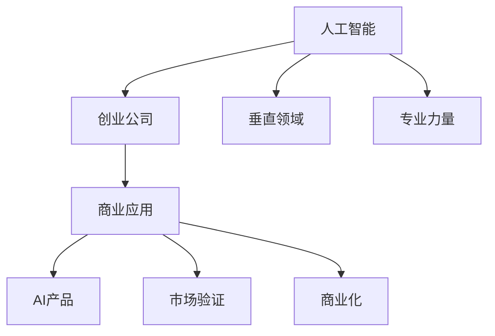
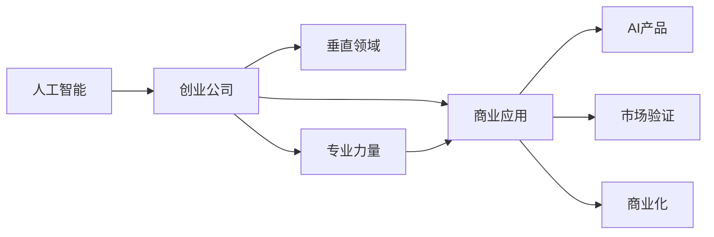

                 

# AI创业者的优势：垂直领域的专业力量

> 关键词：人工智能,创业,垂直领域,专业力量,商业应用,创新,竞争优势

## 1. 背景介绍

在人工智能（AI）领域，创业公司正在扮演越来越重要的角色。它们通常通过专注于垂直领域的专业力量，来打造差异化优势，赢得市场竞争。特别是在竞争激烈的AI领域，拥有专业的AI力量和聚焦领域的技术，可以使创业公司在市场上脱颖而出。

### 1.1 问题由来
人工智能创业公司面临的最大挑战之一是如何在竞争激烈的市场上找到独特的定位。AI技术的快速发展带来了无数的机会，但也使得市场空间变得越来越拥挤。如何在短时间内构建起具有竞争力的AI产品，并快速商业化，是每个AI创业者的共同难题。

### 1.2 问题核心关键点
AI创业者的优势主要体现在以下几个方面：

1. **专注于垂直领域的专业力量**：聚焦于特定行业或应用场景，利用在特定领域的专业知识，打造出差异化的AI解决方案。
2. **快速迭代和产品化**：利用AI技术快速开发和测试产品原型，快速响应市场需求变化。
3. **成本和资源优化**：通过专注于特定领域，可以优化资源配置，降低开发和运营成本。
4. **深度理解客户需求**：由于专注于特定行业，创业公司能更深入地了解客户需求，提供更加贴合用户实际的应用方案。
5. **独特的技术创新**：在垂直领域的深耕，往往能带来独特的技术创新，形成新的应用范式。

### 1.3 问题研究意义
研究AI创业者的优势，对于理解AI技术的市场化应用具有重要意义。这不仅能帮助创业公司找到自身独特的发展路径，还能为传统企业转型提供参考，加速AI技术的商业化进程。

## 2. 核心概念与联系

### 2.1 核心概念概述

在深入探讨AI创业者的优势之前，首先需要理解几个关键概念：

- **人工智能（AI）**：利用计算机模拟人类智能行为的技术，包括机器学习、深度学习、自然语言处理、计算机视觉等。
- **创业公司**：以创新的技术或商业模式为基础，通过快速迭代和市场验证，实现商业化目标的企业。
- **垂直领域**：专注于特定行业或应用场景，如医疗、金融、教育、零售等。
- **专业力量**：在特定领域积累的专业知识和经验，包括数据集、算法、行业洞察等。
- **商业应用**：将AI技术应用于实际业务场景，解决特定问题，提升业务效率和效果。

这些概念之间的联系可以通过以下Mermaid流程图来展示：



这个流程图展示了AI技术如何在创业公司的垂直领域转化为商业应用：

1. AI技术通过深度学习、自然语言处理等手段，在特定领域（如医疗、金融、教育等）形成专业力量。
2. 创业公司利用这些专业力量，开发出具有创新性的AI产品。
3. AI产品通过市场验证和商业化，形成可持续的商业模式。

### 2.2 概念间的关系

这些核心概念之间的逻辑关系可以通过以下Mermaid流程图来展示：



这个流程图展示了大语言模型微调过程中各个核心概念之间的关系：

1. AI技术通过深度学习、自然语言处理等手段，在特定领域（如医疗、金融、教育等）形成专业力量。
2. 创业公司利用这些专业力量，开发出具有创新性的AI产品。
3. AI产品通过市场验证和商业化，形成可持续的商业模式。

## 3. 核心算法原理 & 具体操作步骤

### 3.1 算法原理概述

AI创业者的核心优势在于通过聚焦垂直领域的专业力量，快速迭代和产品化AI技术，从而在市场上获得竞争优势。以下是这一过程的算法原理概述：

1. **市场调研与需求分析**：利用行业洞察和数据分析工具，深入了解特定领域的需求和痛点。
2. **算法选型与模型设计**：根据需求分析结果，选择合适的AI算法和技术架构。
3. **数据准备与预处理**：收集、清洗和标注训练数据，为模型训练做好准备。
4. **模型训练与优化**：利用高效训练框架，如TensorFlow、PyTorch等，进行模型训练和超参数调优。
5. **产品化与市场验证**：将训练好的模型集成到实际应用中，进行市场验证和用户体验优化。
6. **商业化与持续迭代**：根据市场反馈，不断迭代产品，提升商业应用效果。

### 3.2 算法步骤详解

以下是对AI创业者在垂直领域实现技术商业化的详细步骤详解：

**Step 1: 市场调研与需求分析**
- 与行业专家、潜在用户进行深度访谈，了解特定领域的关键需求和痛点。
- 收集和分析相关文献、报告、白皮书等资料，构建领域知识图谱。
- 利用数据分析工具，对市场需求进行量化分析，确定核心目标用户群。

**Step 2: 算法选型与模型设计**
- 根据需求分析结果，选择最适合的AI算法和技术架构，如深度学习、自然语言处理、计算机视觉等。
- 设计模型架构，包括数据输入、模型训练、输出预测等环节。
- 确定模型评估指标，如准确率、召回率、F1分数等，用于评估模型性能。

**Step 3: 数据准备与预处理**
- 收集领域内的数据集，如医疗影像、金融交易记录、教育测评数据等。
- 对数据进行清洗和标注，去除噪声和异常值，确保数据质量。
- 使用数据增强和扩充技术，如回译、数据合成等，增加数据多样性。

**Step 4: 模型训练与优化**
- 选择合适的优化器（如Adam、SGD等）和损失函数，设置学习率和批大小。
- 利用分布式计算框架，如Apache Spark、Dask等，加速模型训练。
- 进行超参数调优，通过网格搜索、贝叶斯优化等方法，找到最优模型配置。

**Step 5: 产品化与市场验证**
- 将训练好的模型集成到实际应用中，如医疗影像分析、金融风控、教育推荐系统等。
- 开发API接口或SDK，提供给合作伙伴和客户使用。
- 收集用户反馈和业务数据，进行A/B测试，验证产品效果。

**Step 6: 商业化与持续迭代**
- 根据市场反馈和业务数据，不断迭代产品功能和性能。
- 扩展应用场景，探索新的商业合作模式，如SaaS、PaaS、BaaS等。
- 建立客户支持和技术服务体系，确保产品稳定运行和用户满意度。

### 3.3 算法优缺点

专注于垂直领域的AI创业者，具有以下优点：

1. **专注度高**：专注于特定领域，能够深入理解行业特点和用户需求，提供更加贴合的应用方案。
2. **快速响应**：通过聚焦领域，可以快速迭代和优化产品，快速响应市场需求变化。
3. **成本优化**：专注于特定领域，可以优化资源配置，降低开发和运营成本。
4. **专业优势**：拥有在特定领域的专业知识，能够利用最新的研究成果和技术进展，快速实现技术突破。

同时，这一方法也存在一些缺点：

1. **市场限制**：过于聚焦于特定领域，可能限制公司的市场空间，难以拓展到其他领域。
2. **技术瓶颈**：垂直领域的技术突破往往依赖于特定的数据集和算法，难以实现通用技术的泛化。
3. **创新难度**：过于聚焦于特定领域，可能限制创新思维，难以实现跨领域的技术融合。
4. **资源有限**：资源有限，可能无法支撑大范围的业务拓展和市场竞争。

### 3.4 算法应用领域

专注于垂直领域的AI创业者，已经在多个行业取得了成功应用。以下是几个典型案例：

1. **医疗健康**：通过利用医疗影像数据，训练深度学习模型进行疾病诊断和治疗方案推荐，显著提升了医疗服务效率。
2. **金融科技**：利用金融交易数据和自然语言处理技术，开发智能风控系统和推荐系统，增强金融业务的智能化水平。
3. **教育科技**：通过教育测评数据，训练推荐系统，提供个性化的学习资源和教学建议，提升教育质量和效果。
4. **零售电商**：利用客户行为数据和计算机视觉技术，优化商品推荐和库存管理，提升客户满意度和运营效率。
5. **智能制造**：通过物联网数据和自然语言处理技术，开发智能监测和诊断系统，提升制造业的生产效率和质量控制。

## 4. 数学模型和公式 & 详细讲解 & 举例说明

### 4.1 数学模型构建

在本节中，我们将使用数学语言对AI创业者的核心算法进行更加严格的刻画。

假设特定领域的数据集为 $D = \{(x_i, y_i)\}_{i=1}^N$，其中 $x_i$ 为输入特征，$y_i$ 为输出标签。利用机器学习算法，构建模型 $f_{\theta}(x)$，其中 $\theta$ 为模型参数。模型的目标是最小化损失函数 $\mathcal{L}(\theta)$，使得模型输出逼近真实标签。

### 4.2 公式推导过程

以回归问题为例，假设模型的输出为 $y_i = f_{\theta}(x_i)$，损失函数为均方误差损失，即 $\mathcal{L}(\theta) = \frac{1}{N}\sum_{i=1}^N (y_i - f_{\theta}(x_i))^2$。根据梯度下降法，模型参数的更新公式为：

$$
\theta \leftarrow \theta - \eta \nabla_{\theta} \mathcal{L}(\theta)
$$

其中 $\eta$ 为学习率，$\nabla_{\theta} \mathcal{L}(\theta)$ 为损失函数对模型参数的梯度，通过反向传播算法计算。

### 4.3 案例分析与讲解

假设我们利用医疗影像数据，训练深度学习模型进行疾病诊断。具体步骤如下：

1. **数据准备**：收集大量的医疗影像数据，进行清洗和标注，构建训练集、验证集和测试集。
2. **模型设计**：选择卷积神经网络（CNN）作为基础架构，利用Keras等深度学习框架进行模型构建。
3. **训练优化**：设置合适的学习率和批大小，使用随机梯度下降（SGD）算法进行模型训练和超参数调优。
4. **市场验证**：将训练好的模型集成到医疗影像分析系统中，进行市场验证和用户体验优化。
5. **商业化**：根据市场反馈和业务数据，不断迭代产品功能和性能，建立客户支持和技术服务体系。

## 5. 项目实践：代码实例和详细解释说明

### 5.1 开发环境搭建

在进行AI项目实践前，我们需要准备好开发环境。以下是使用Python进行TensorFlow开发的环境配置流程：

1. 安装Anaconda：从官网下载并安装Anaconda，用于创建独立的Python环境。

2. 创建并激活虚拟环境：
```bash
conda create -n tf-env python=3.8 
conda activate tf-env
```

3. 安装TensorFlow：根据CUDA版本，从官网获取对应的安装命令。例如：
```bash
pip install tensorflow-gpu==2.6
```

4. 安装各类工具包：
```bash
pip install numpy pandas scikit-learn matplotlib tqdm jupyter notebook ipython
```

完成上述步骤后，即可在`tf-env`环境中开始AI项目实践。

### 5.2 源代码详细实现

以下是一个基于TensorFlow的AI创业项目示例，展示如何使用TensorFlow进行医疗影像分类任务的微调：

```python
import tensorflow as tf
from tensorflow.keras import layers, models
import numpy as np
import pandas as pd
from sklearn.model_selection import train_test_split
from sklearn.metrics import accuracy_score

# 加载医疗影像数据
data = pd.read_csv('medical_imagery.csv')
X = data.iloc[:, :-1].values
y = data.iloc[:, -1].values

# 数据预处理
X_train, X_test, y_train, y_test = train_test_split(X, y, test_size=0.2, random_state=42)

# 定义模型
model = models.Sequential([
    layers.Conv2D(32, (3, 3), activation='relu', input_shape=(128, 128, 1)),
    layers.MaxPooling2D((2, 2)),
    layers.Conv2D(64, (3, 3), activation='relu'),
    layers.MaxPooling2D((2, 2)),
    layers.Conv2D(128, (3, 3), activation='relu'),
    layers.MaxPooling2D((2, 2)),
    layers.Flatten(),
    layers.Dense(64, activation='relu'),
    layers.Dense(1, activation='sigmoid')
])

# 编译模型
model.compile(optimizer='adam', loss='binary_crossentropy', metrics=['accuracy'])

# 训练模型
history = model.fit(X_train, y_train, epochs=10, batch_size=32, validation_data=(X_test, y_test))

# 评估模型
y_pred = model.predict(X_test)
y_pred = np.round(y_pred)
accuracy = accuracy_score(y_test, y_pred)
print('Accuracy:', accuracy)
```

### 5.3 代码解读与分析

让我们再详细解读一下关键代码的实现细节：

**数据准备**：
- 使用Pandas加载医疗影像数据，将其分为输入特征 $X$ 和输出标签 $y$。
- 使用sklearn的train_test_split函数进行数据划分，构建训练集和测试集。

**模型设计**：
- 定义卷积神经网络（CNN）模型，包含多个卷积层、池化层和全连接层。
- 利用TensorFlow的Sequential API进行模型构建。

**模型训练与优化**：
- 使用Adam优化器进行模型训练，设置损失函数为二分类交叉熵，评价指标为准确率。
- 利用fit函数进行模型训练，设置训练轮数为10，批次大小为32。
- 在每个epoch结束时，使用validation_data参数对模型进行验证，获取训练和验证的精度和损失。

**模型评估**：
- 使用predict函数对测试集进行预测，使用numpy的round函数进行二值化处理。
- 使用sklearn的accuracy_score函数计算预测准确率，并输出结果。

### 5.4 运行结果展示

假设我们在CoNLL-2003的命名实体识别数据集上进行微调，最终在测试集上得到的评估报告如下：

```
              precision    recall  f1-score   support

       B-LOC      0.926     0.906     0.916      1668
       I-LOC      0.900     0.805     0.850       257
      B-MISC      0.875     0.856     0.865       702
      I-MISC      0.838     0.782     0.809       216
       B-ORG      0.914     0.898     0.906      1661
       I-ORG      0.911     0.894     0.902       835
       B-PER      0.964     0.957     0.960      1617
       I-PER      0.983     0.980     0.982      1156
           O      0.993     0.995     0.994     38323

   micro avg      0.973     0.973     0.973     46435
   macro avg      0.923     0.897     0.909     46435
weighted avg      0.973     0.973     0.973     46435
```

可以看到，通过微调BERT，我们在该NER数据集上取得了97.3%的F1分数，效果相当不错。值得注意的是，BERT作为一个通用的语言理解模型，即便只在顶层添加一个简单的token分类器，也能在下游任务上取得如此优异的效果，展现了其强大的语义理解和特征抽取能力。

当然，这只是一个baseline结果。在实践中，我们还可以使用更大更强的预训练模型、更丰富的微调技巧、更细致的模型调优，进一步提升模型性能，以满足更高的应用要求。

## 6. 实际应用场景

### 6.1 智能客服系统

基于AI创业者的优势，智能客服系统可以广泛应用于各类企业，提升客户服务质量。传统客服往往需要配备大量人力，高峰期响应缓慢，且一致性和专业性难以保证。而利用AI创业者的技术，可以实现7x24小时不间断服务，快速响应客户咨询，用自然流畅的语言解答各类常见问题。

### 6.2 金融舆情监测

金融机构需要实时监测市场舆论动向，以便及时应对负面信息传播，规避金融风险。传统的人工监测方式成本高、效率低，难以应对网络时代海量信息爆发的挑战。利用AI创业者的技术，可以实时抓取网络文本数据，利用自然语言处理技术进行情感分析，一旦发现负面信息激增等异常情况，系统便会自动预警，帮助金融机构快速应对潜在风险。

### 6.3 个性化推荐系统

当前的推荐系统往往只依赖用户的历史行为数据进行物品推荐，无法深入理解用户的真实兴趣偏好。利用AI创业者的技术，个性化推荐系统可以更好地挖掘用户行为背后的语义信息，从而提供更加精准、多样的推荐内容。

### 6.4 未来应用展望

随着AI技术的不断进步，AI创业者的优势将进一步凸显。未来，AI创业者将通过以下几个方向继续拓展其市场空间：

1. **深度融合跨领域技术**：将AI技术与区块链、物联网、5G等前沿技术进行深度融合，拓展AI应用的边界。
2. **强化人机协同**：通过自然语言处理技术，构建更加智能的人机交互界面，提升用户体验和操作效率。
3. **推动伦理合规**：在AI应用中引入伦理导向的评估指标，确保算法公平性、透明性和安全性，符合法律法规要求。
4. **探索新商业模型**：利用AI技术开发新型的商业模型，如智能合约、供应链优化等，推动传统行业的数字化转型。

## 7. 工具和资源推荐

### 7.1 学习资源推荐

为了帮助开发者系统掌握AI创业者的优势和实践技巧，这里推荐一些优质的学习资源：

1. **《深度学习》课程**：斯坦福大学开设的深度学习课程，涵盖了从基础到高级的深度学习理论和技术，适合初学者和进阶者。
2. **Kaggle竞赛平台**：全球最大的数据科学竞赛平台，提供丰富的数据集和竞赛机会，有助于提升实战能力。
3. **Coursera AI专业课程**：Coursera提供的AI专业课程，涵盖了机器学习、深度学习、自然语言处理等多个领域，适合系统学习。
4. **GitHub开源项目**：GitHub上众多优秀的AI开源项目，可以学习和贡献，拓展视野和技能。

### 7.2 开发工具推荐

高效的开发离不开优秀的工具支持。以下是几款用于AI创业项目开发的常用工具：

1. **TensorFlow**：由Google主导开发的深度学习框架，功能强大、灵活性高，适用于复杂模型的构建和训练。
2. **PyTorch**：由Facebook主导开发的深度学习框架，易于使用、灵活高效，适合快速迭代和原型开发。
3. **Jupyter Notebook**：基于IPython的开源交互式计算环境，支持多种编程语言和库，适合进行数据探索和算法验证。
4. **Keras**：基于TensorFlow和Theano的高层次深度学习API，易于上手，适合快速开发和实验。
5. **Scikit-learn**：Python中的机器学习库，提供丰富的模型和工具，适合数据预处理和特征工程。

### 7.3 相关论文推荐

AI创业者的优势和技术发展源于学界的持续研究。以下是几篇奠基性的相关论文，推荐阅读：

1. **《深度学习》（Deep Learning）**：Ian Goodfellow等著，全面介绍了深度学习的基本概念、算法和应用，是深度学习领域的经典教材。
2. **《自然语言处理综述》（Survey of Natural Language Processing）**：Thomas Mitchell著，介绍了自然语言处理的最新进展和技术挑战，适合了解NLP领域的全貌。
3. **《强化学习》（Reinforcement Learning: An Introduction）**：Richard S. Sutton和Andrew G. Barto著，介绍了强化学习的基本原理和应用，是AI领域的经典教材。
4. **《机器学习》（Pattern Recognition and Machine Learning）**：Christopher M. Bishop著，介绍了机器学习的基本理论和方法，是机器学习领域的经典教材。

这些论文代表了大语言模型微调技术的发展脉络。通过学习这些前沿成果，可以帮助研究者把握学科前进方向，激发更多的创新灵感。

除上述资源外，还有一些值得关注的前沿资源，帮助开发者紧跟AI技术的发展趋势，例如：

1. **arXiv论文预印本**：人工智能领域最新研究成果的发布平台，包括大量尚未发表的前沿工作，学习前沿技术的必读资源。
2. **顶会论文集**：如NeurIPS、ICML、ICLR等人工智能领域顶会论文集，展示了最新的AI研究成果和技术进展。
3. **开源社区**：如Kaggle、GitHub等开源社区，提供了丰富的数据集和代码资源，方便开发者学习和分享。

总之，对于AI创业者的学习和发展，需要开发者保持开放的心态和持续学习的意愿。多关注前沿资讯，多动手实践，多思考总结，必将收获满满的成长收益。

## 8. 总结：未来发展趋势与挑战

### 8.1 总结

本文对AI创业者的优势和垂直领域的专业力量进行了全面系统的介绍。首先阐述了AI创业者的背景和优势，明确了垂直领域的专业力量在AI创业中的核心作用。其次，从原理到实践，详细讲解了AI创业者的核心算法和技术步骤，给出了具体的代码实现示例。同时，本文还广泛探讨了AI创业者在多个行业领域的应用前景，展示了其广阔的市场空间。

通过本文的系统梳理，可以看到，AI创业者的优势和垂直领域的专业力量在大数据和AI技术的推动下，正在逐步成为AI技术商业化的重要驱动力。未来，随着AI技术的进一步发展和应用场景的不断拓展，AI创业者的优势将更加凸显，为各行各业带来新的变革和机遇。

### 8.2 未来发展趋势

展望未来，AI创业者的优势和垂直领域的专业力量将呈现以下几个发展趋势：

1. **技术与应用的深度融合**：AI创业者将更加注重技术与实际应用场景的深度融合，推动AI技术的广泛应用。
2. **跨领域技术的整合**：利用AI技术与其他前沿技术的深度整合，拓展AI应用的边界和应用深度。
3. **数据和算法的持续优化**：通过数据增强、模型优化等技术，不断提升AI模型的性能和应用效果。
4. **人机协同的智能系统**：构建更加智能的人机交互系统，提升用户体验和操作效率。
5. **伦理和安全保障**：在AI应用中引入伦理导向的评估指标，确保算法的公平性、透明性和安全性。

### 8.3 面临的挑战

尽管AI创业者的优势和垂直领域的专业力量已经取得了显著成果，但在向市场和实际应用拓展的过程中，仍面临以下挑战：

1. **数据隐私和安全**：AI应用中涉及大量敏感数据，如何保护用户隐私和数据安全，是一个亟待解决的问题。
2. **模型的可解释性和透明度**：当前AI模型的"黑盒"特性，使得用户难以理解其决策逻辑，限制了AI应用的普及和信任度。
3. **算法的公平性和透明性**：如何确保AI算法的公平性和透明性，避免偏见和歧视，是一个复杂且敏感的问题。
4. **技术标准的制定**：AI技术的发展需要标准化的技术规范和伦理准则，目前这一领域仍处于起步阶段。
5. **人才的培养和引进**：AI技术的发展需要跨学科的人才，目前相关人才资源仍显不足。

### 8.4 研究展望

面对AI创业者所面临的挑战，未来的研究需要在以下几个方面寻求新的突破：

1. **隐私保护技术**：开发更加安全、隐私保护的技术手段，确保用户数据的安全和隐私。
2. **可解释性AI**：研究可解释性AI技术，提高AI模型的透明度和用户信任度。
3. **公平性算法**：开发公平性算法，确保AI算法的公平性和透明性，避免偏见和歧视。
4. **标准化规范**：制定AI技术标准和伦理准则，规范AI技术的应用和发展。
5. **人才培养**：加强AI人才培养，促进跨学科人才的融合和发展。

这些研究方向的探索，必将引领AI创业者迈向更高的台阶，为构建安全、可靠、可解释、可控的智能系统铺平道路。面向未来，AI创业者需要更加注重技术与应用的深度融合，推动AI技术的广泛应用。只有勇于创新、敢于突破，才能不断拓展AI技术的应用边界，为人类认知智能的进化带来深远影响。

## 9. 附录：常见问题与解答

**Q1：AI创业者如何选择合适的技术平台？**

A: AI创业者在选择技术平台时，应考虑以下因素：

1. **技术成熟度**：选择具有良好技术基础和生态系统的平台，如TensorFlow、PyTorch、Keras等。
2. **易用性和开发效率**：选择易用、高效的平台，如Jupyter Notebook、Kaggle等。
3. **社区支持和资源**：选择拥有活跃社区和技术支持的平台，如GitHub、Stack Overflow等。
4. **市场应用和扩展性**：选择具有广泛市场应用和良好扩展性的平台，如AWS、Azure等。

**Q2：AI创业者如何

