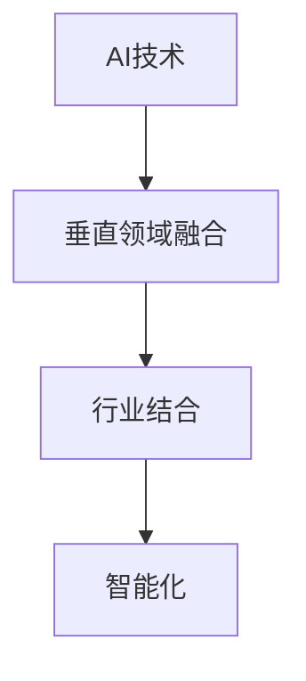

                 

# AI创业者的机遇：垂直领域的无限可能

## 1. 背景介绍

随着人工智能技术的快速发展和应用，AI创业正在成为全球创新创业的新热点。AI技术已经深入到各行各业，带来了前所未有的机遇和挑战。特别是在垂直领域，AI技术的应用已经开始改变传统行业的生产模式和运营方式，创造出新的商业模式和产业形态。本文将探讨AI创业者在垂直领域的无限可能，帮助创业者和开发者更好地把握机遇，构建成功的人工智能解决方案。

## 2. 核心概念与联系

### 2.1 核心概念概述

#### 2.1.1 AI与垂直领域的融合
AI技术在垂直领域的应用，是指将AI技术应用于特定的行业或领域，以提升生产效率、降低成本、增强决策能力等。垂直领域的AI应用，包括但不限于医疗、金融、教育、制造、物流、零售、安防等领域。

#### 2.1.2 人工智能与传统行业的结合
AI技术在传统行业的应用，意味着将传统行业的业务流程和数据进行数字化、智能化改造，提升行业的整体效率和竞争力。例如，通过机器学习进行需求预测、库存管理、供应链优化，通过计算机视觉进行质量检测、缺陷检测，通过自然语言处理进行客服对话、知识管理等。

### 2.2 核心概念的关系

AI与垂直领域的融合，可以理解为AI技术在特定行业的应用，这需要考虑行业特点、数据规模、技术需求等因素。人工智能与传统行业的结合，则是指AI技术在行业中的应用，提升行业的智能化水平，增强行业竞争力。两者相互促进，共同推动AI技术在垂直领域的应用。

以下是一个简化的Mermaid流程图，展示了AI技术在垂直领域融合与行业结合的基本关系：



这个流程图表明，AI技术是基础，通过在特定行业的应用，实现AI与垂直领域的融合，再通过智能化改造，实现AI与传统行业的结合。

## 3. 核心算法原理 & 具体操作步骤
### 3.1 算法原理概述

在垂直领域的AI应用中，常见的算法包括监督学习、无监督学习、强化学习等。其中，监督学习是最常用的AI算法，通过有标注的数据进行模型训练，以预测新数据。

以医疗行业为例，我们可以使用监督学习方法训练一个模型，以患者的年龄、性别、体重、血压等特征为输入，预测患者患某种疾病的概率。具体流程包括数据准备、模型选择、训练、验证、测试等步骤。

### 3.2 算法步骤详解

#### 3.2.1 数据准备
数据准备是AI应用的基础，包括数据收集、数据清洗、特征工程等步骤。以医疗为例，我们需要收集患者的历史数据，包括患者的健康记录、体检数据、医疗影像等，并进行数据清洗和特征提取。

#### 3.2.2 模型选择
根据任务需求，选择合适的模型。以预测患者患某种疾病的概率为例，可以使用随机森林、SVM、神经网络等模型。

#### 3.2.3 模型训练
使用训练数据训练模型，通过反向传播算法更新模型参数，以最小化预测误差。

#### 3.2.4 模型验证
使用验证集评估模型性能，调整模型参数，防止过拟合。

#### 3.2.5 模型测试
使用测试集评估模型泛化能力，确保模型在实际应用中的表现。

### 3.3 算法优缺点

#### 3.3.1 优点
1. 数据驱动：通过有标注的数据进行模型训练，模型预测准确率较高。
2. 可解释性：监督学习模型的决策过程可解释性强，便于理解。
3. 适用范围广：适用于分类、回归、聚类等多种任务。

#### 3.3.2 缺点
1. 数据依赖：需要大量的标注数据，数据获取成本高。
2. 泛化能力有限：模型性能依赖标注数据的质量和数量，标注数据不足时泛化能力较差。
3. 模型复杂度高：模型参数多，训练和推理速度较慢。

### 3.4 算法应用领域

#### 3.4.1 医疗
AI在医疗领域的应用非常广泛，包括疾病预测、医学影像分析、药物研发等。通过监督学习，我们可以训练模型预测患者的疾病风险，辅助医生进行诊断和治疗决策。

#### 3.4.2 金融
AI在金融领域的应用包括风险管理、信用评估、算法交易等。通过监督学习，我们可以训练模型预测客户的信用风险，辅助银行进行贷款审批和风险管理。

#### 3.4.3 教育
AI在教育领域的应用包括智能辅导、学习推荐、情感分析等。通过监督学习，我们可以训练模型分析学生的学习行为和情感状态，提供个性化的学习推荐和辅导。

## 4. 数学模型和公式 & 详细讲解

### 4.1 数学模型构建

以医疗行业为例，假设我们有一个包含N个样本的数据集，每个样本有K个特征，我们需要训练一个二分类模型，预测患者是否患有某种疾病。我们可以使用逻辑回归模型，其数学模型可以表示为：

$$y_i = \sigma(W^T \cdot x_i + b)$$

其中，$y_i$ 表示第i个样本的标签，$x_i$ 表示第i个样本的特征向量，$W$ 表示模型的权重，$b$ 表示偏置项，$\sigma$ 表示Sigmoid函数。

### 4.2 公式推导过程

以逻辑回归模型为例，其损失函数可以表示为：

$$L = -\frac{1}{N} \sum_{i=1}^N (y_i \log y_i + (1-y_i) \log (1-y_i))$$

其中，$L$ 表示模型的损失函数，$y_i$ 表示第i个样本的标签，$x_i$ 表示第i个样本的特征向量，$W$ 表示模型的权重，$b$ 表示偏置项。

通过梯度下降算法，我们可以最小化损失函数，更新模型的权重和偏置项，从而训练出最优的模型。

### 4.3 案例分析与讲解

以医疗行业为例，我们可以使用逻辑回归模型预测患者患某种疾病的概率。首先，我们需要收集患者的健康记录、体检数据、医疗影像等，进行数据清洗和特征提取。然后，我们选择一个合适的算法，如逻辑回归，使用训练数据进行模型训练，调整模型参数。最后，使用验证集和测试集评估模型性能，确保模型在实际应用中的表现。

## 5. 项目实践：代码实例和详细解释说明

### 5.1 开发环境搭建

在使用AI技术进行开发时，我们需要搭建合适的开发环境。以医疗行业为例，我们可以使用Python语言和TensorFlow框架进行开发。具体步骤如下：

1. 安装Python语言和相关的开发工具，如Anaconda、PyCharm等。
2. 安装TensorFlow框架，并创建虚拟环境。
3. 安装相关的数据处理和特征工程库，如NumPy、Pandas等。
4. 下载和准备数据集，并进行预处理。

### 5.2 源代码详细实现

以下是使用TensorFlow框架训练逻辑回归模型的代码实现：

```python
import tensorflow as tf
import numpy as np
import pandas as pd

# 加载数据集
data = pd.read_csv('data.csv')

# 数据预处理
features = data[['age', 'gender', 'weight', 'blood_pressure']]
labels = data['disease']

# 数据标准化
features = (features - features.mean()) / features.std()

# 定义逻辑回归模型
model = tf.keras.Sequential([
    tf.keras.layers.Dense(64, activation='relu', input_shape=(4,)),
    tf.keras.layers.Dense(1, activation='sigmoid')
])

# 编译模型
model.compile(optimizer='adam', loss='binary_crossentropy', metrics=['accuracy'])

# 训练模型
model.fit(features, labels, epochs=10, batch_size=32, validation_split=0.2)

# 评估模型
test_features = pd.read_csv('test_data.csv')
test_features = (test_features - test_features.mean()) / test_features.std()
loss, accuracy = model.evaluate(test_features, labels)
print(f'Test Loss: {loss}, Test Accuracy: {accuracy}')
```

### 5.3 代码解读与分析

#### 5.3.1 数据加载和预处理
我们使用Pandas库加载数据集，并进行数据预处理，包括数据标准化、特征选择等步骤。

#### 5.3.2 定义逻辑回归模型
我们使用TensorFlow框架定义一个简单的逻辑回归模型，包括两个全连接层，其中第二个全连接层输出一个sigmoid函数，用于进行二分类预测。

#### 5.3.3 模型训练和评估
我们使用训练数据训练模型，并使用验证集评估模型性能。在训练过程中，我们使用Adam优化器进行模型优化，并使用二分类交叉熵损失函数进行模型评估。

### 5.4 运行结果展示

在实际应用中，我们可以使用训练好的模型进行预测，例如：

```python
import pandas as pd
import numpy as np

# 加载测试数据集
test_data = pd.read_csv('test_data.csv')

# 数据标准化
test_features = (test_data - test_data.mean()) / test_data.std()

# 预测疾病风险
predictions = model.predict(test_features)

# 输出预测结果
for i, pred in enumerate(predictions):
    print(f'样本{i+1}: 患病的概率为{pred}')
```

## 6. 实际应用场景

### 6.1 医疗

AI在医疗领域的应用非常广泛，包括疾病预测、医学影像分析、药物研发等。通过监督学习，我们可以训练模型预测患者的疾病风险，辅助医生进行诊断和治疗决策。

### 6.2 金融

AI在金融领域的应用包括风险管理、信用评估、算法交易等。通过监督学习，我们可以训练模型预测客户的信用风险，辅助银行进行贷款审批和风险管理。

### 6.3 教育

AI在教育领域的应用包括智能辅导、学习推荐、情感分析等。通过监督学习，我们可以训练模型分析学生的学习行为和情感状态，提供个性化的学习推荐和辅导。

## 7. 工具和资源推荐

### 7.1 学习资源推荐

1. TensorFlow官方文档：TensorFlow是当前最流行的深度学习框架之一，其官方文档详细介绍了如何使用TensorFlow进行AI开发。
2. Coursera深度学习课程：由Andrew Ng教授主讲的深度学习课程，涵盖深度学习的基本概念和实践技能。
3. Udacity深度学习纳米学位：Udacity提供的深度学习纳米学位课程，涵盖深度学习的基本概念和实践技能。
4. DeepLearning.AI深度学习课程：由Andrew Ng教授主讲的深度学习课程，涵盖深度学习的基本概念和实践技能。
5. Kaggle数据科学竞赛：Kaggle是一个数据科学竞赛平台，涵盖各种AI应用场景，通过竞赛可以积累丰富的实践经验。

### 7.2 开发工具推荐

1. Python：Python是当前最流行的AI开发语言之一，其语法简洁，易于上手。
2. TensorFlow：TensorFlow是当前最流行的深度学习框架之一，支持分布式计算，适合大规模AI开发。
3. PyTorch：PyTorch是当前最流行的深度学习框架之一，其动态计算图设计，适合快速原型开发和实验。
4. Jupyter Notebook：Jupyter Notebook是一个交互式编程环境，支持代码编写、数据可视化等操作。
5. Google Colab：Google Colab是一个免费的在线Jupyter Notebook环境，适合云上开发和分享。

### 7.3 相关论文推荐

1. "ImageNet Classification with Deep Convolutional Neural Networks"：Alex Krizhevsky等人发表的深度学习论文，开创了深度卷积神经网络的先河。
2. "Deep Learning"：Ian Goodfellow等人编写的深度学习经典教材，涵盖了深度学习的基本概念和实践技能。
3. "Natural Language Processing with Transformers"：Jacob Devlin等人发表的Transformer论文，介绍了Transformer的结构和应用。
4. "Generative Adversarial Nets"：Ian Goodfellow等人发表的生成对抗网络论文，开创了生成对抗网络的新范式。
5. "A Survey of Recent Advances in Deep Learning-based Recommendation Systems"：Xian Zhao等人发表的深度学习推荐系统综述论文，介绍了深度学习在推荐系统中的应用。

## 8. 总结：未来发展趋势与挑战

### 8.1 研究成果总结

AI技术在垂直领域的应用已经取得显著进展，涵盖了医疗、金融、教育、制造等多个行业。在医疗领域，AI技术在疾病预测、医学影像分析、药物研发等方面表现优异，辅助医生进行诊断和治疗决策。在金融领域，AI技术在风险管理、信用评估、算法交易等方面表现优异，帮助银行进行贷款审批和风险管理。在教育领域，AI技术在智能辅导、学习推荐、情感分析等方面表现优异，提供个性化的学习推荐和辅导。

### 8.2 未来发展趋势

1. 数据驱动：AI技术在垂直领域的应用将越来越依赖于大规模数据，数据驱动的AI应用将越来越普遍。
2. 个性化：AI技术将越来越注重个性化应用，提供更精准、个性化的解决方案。
3. 跨领域融合：AI技术将在多个领域融合应用，形成更全面、多维度的解决方案。
4. 智能化：AI技术将越来越智能化，能够自主学习和优化，提供更高效、准确的解决方案。
5. 安全性：AI技术将越来越注重安全性，避免数据泄露、模型滥用等问题。

### 8.3 面临的挑战

1. 数据获取：垂直领域的数据获取成本较高，数据隐私和安全问题也需要引起重视。
2. 模型性能：垂直领域的AI模型需要更高的性能要求，训练和推理时间较长，模型效率有待提高。
3. 行业规范：垂直领域的应用需要符合行业规范和标准，避免技术滥用和风险。
4. 用户接受度：AI技术在垂直领域的应用需要得到用户的广泛接受和认可，用户体验需要不断提升。

### 8.4 研究展望

未来，AI技术在垂直领域的应用将迎来更多机遇和挑战。我们需要从多个方面进行研究和探索，以应对未来的挑战：

1. 数据获取：探索更多数据获取途径，如众包数据、合成数据等，降低数据获取成本。
2. 模型优化：优化模型结构和算法，提高模型的效率和性能，支持更多场景应用。
3. 行业标准：制定行业标准和规范，保障AI技术在垂直领域的应用安全、可靠。
4. 用户教育：加强用户教育和技术普及，提高用户对AI技术的接受度和认可度。

## 9. 附录：常见问题与解答

**Q1: 垂直领域的AI应用需要哪些关键技术？**

A: 垂直领域的AI应用需要以下关键技术：
1. 数据处理和特征工程：数据清洗、特征选择、数据标准化等。
2. 模型选择和训练：选择合适的模型，进行模型训练和优化。
3. 模型评估和验证：使用验证集评估模型性能，避免过拟合。
4. 模型部署和应用：将训练好的模型部署到实际应用场景中，进行模型推理和应用。

**Q2: 垂直领域的AI应用有哪些典型的应用场景？**

A: 垂直领域的AI应用有许多典型的应用场景，包括但不限于：
1. 医疗领域：疾病预测、医学影像分析、药物研发等。
2. 金融领域：风险管理、信用评估、算法交易等。
3. 教育领域：智能辅导、学习推荐、情感分析等。
4. 制造领域：质量检测、缺陷检测、供应链优化等。
5. 物流领域：路线优化、货物追踪、库存管理等。
6. 零售领域：需求预测、价格优化、客户推荐等。
7. 安防领域：人脸识别、行为分析、异常检测等。

**Q3: 垂直领域的AI应用需要注意哪些问题？**

A: 垂直领域的AI应用需要注意以下问题：
1. 数据隐私和安全：保护用户隐私数据，避免数据泄露和滥用。
2. 模型透明性和可解释性：提高模型的透明性和可解释性，让用户理解模型的决策过程。
3. 模型鲁棒性和泛化能力：提高模型的鲁棒性和泛化能力，避免模型在特定场景下表现不佳。
4. 模型效率和计算资源：提高模型的效率和计算资源利用率，支持更多场景应用。
5. 模型优化和更新：持续优化和更新模型，保持模型性能和适用性。

---

作者：禅与计算机程序设计艺术 / Zen and the Art of Computer Programming

