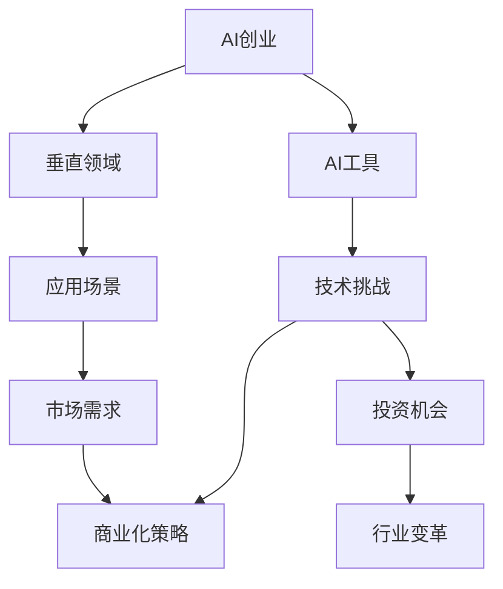
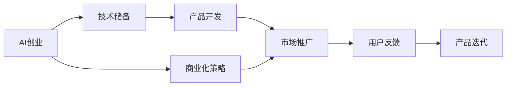
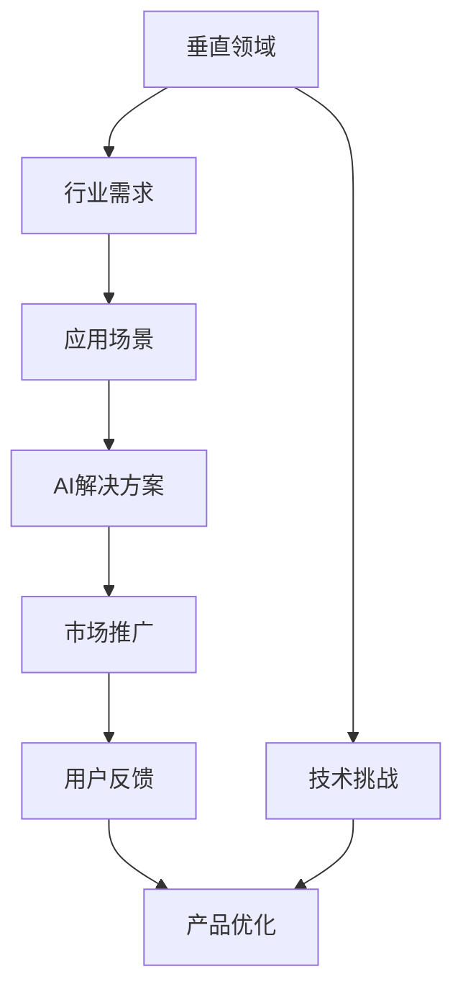

                 

# AI创业者的机遇：垂直领域的蓝海

> 关键词：AI创业、垂直领域、蓝海、AI工具、应用场景、市场需求、技术挑战、商业化策略、投资机会、行业变革

## 1. 背景介绍

在人工智能(AI)技术飞速发展的今天，AI创业已成为越来越多创业者竞相逐鹿的新兴领域。从早期的图像识别、语音识别等基础AI技术，到如今深入各行各业的自然语言处理(NLP)、机器学习(ML)、计算机视觉(CV)等垂直领域应用，AI创业不断拓展着人类对未来世界的想象。

然而，尽管AI创业前景广阔，市场空间巨大，真正能成功落地的AI项目却不多。原因在于，AI技术的深入应用并非易事，创业者不仅需要深刻的技术洞察，还需充分了解目标市场和用户需求，才能找到真正的“蓝海”市场，实现AI技术与商业模式的有机结合。

## 2. 核心概念与联系

### 2.1 核心概念概述

为了更好地理解AI创业在垂直领域的机遇，本节将介绍几个关键概念及其相互联系：

- **AI创业**：指利用人工智能技术，创立具有市场潜力的商业实体，开发出能够解决实际问题的产品或服务。
- **垂直领域**：指专注于某个具体行业或应用场景，提供针对性强、专业化的AI解决方案，与广泛通用的AI技术形成区别。
- **蓝海市场**：指尚未被充分发掘，具有高成长潜力的新兴市场空间，与竞争激烈、同质化严重的红海市场相对。
- **AI工具**：指基于AI技术开发的各种软件、算法、框架、模型等，是AI创业的核心资源。
- **应用场景**：指AI技术实际应用的物理或逻辑空间，如医疗、金融、教育、制造等。
- **市场需求**：指目标市场中，用户对AI产品的需求和期望，包括功能、性能、用户体验等方面。
- **技术挑战**：指在特定应用场景中，AI技术需要解决的关键技术问题，如模型精度、计算效率、用户隐私保护等。
- **商业化策略**：指如何将AI技术产品化、商品化，实现从研发到市场的过程，包括产品定位、定价策略、市场推广等。
- **投资机会**：指AI创业在资金、技术、人才等方面的投资需求，以及潜在的投资回报。
- **行业变革**：指AI技术在特定行业中的应用，推动该行业原有业务模式、管理流程、产品形态等的深刻变化。

这些核心概念之间的逻辑关系可以通过以下Mermaid流程图来展示：



这个流程图展示了AI创业的核心概念及其之间的关系：

1. AI创业的基础是AI工具，通过构建和优化AI模型和算法，提供产品或服务。
2. AI创业聚焦于垂直领域，根据目标行业的特点和需求，进行定制化开发。
3. 通过市场需求分析和目标用户调研，确定AI产品的功能定位和性能指标。
4. 面临具体应用场景中的技术挑战，需要不断优化AI模型和算法，提高技术可靠性。
5. 通过商业化策略，实现AI产品的市场推广和销售。
6. 投资机会存在于技术研发、产品开发、市场推广等多个环节，助力AI创业项目的成长。
7. AI技术的深度应用，将推动各行各业实现数字化、智能化转型，带来行业变革。

这些概念共同构成了AI创业的完整生态系统，为AI创业者提供了明确的发展方向和实践路径。

### 2.2 概念间的关系

这些核心概念之间存在着紧密的联系，形成了AI创业的完整生态系统。下面我们通过几个Mermaid流程图来展示这些概念之间的关系。

#### 2.2.1 AI创业的技术路径



这个流程图展示了AI创业的技术路径：

1. AI创业者首先积累技术储备，包括AI工具、模型、算法等。
2. 在技术储备的基础上，进行产品开发，提供具有实际价值的AI解决方案。
3. 通过市场推广将产品推向市场，收集用户反馈。
4. 根据用户反馈进行产品迭代优化，不断提高产品性能和用户体验。
5. 在产品迭代的过程中，持续进行商业化策略的调整，以适应市场变化。

#### 2.2.2 垂直领域的应用模式



这个流程图展示了垂直领域的应用模式：

1. AI创业者从行业需求入手，明确目标应用场景。
2. 根据应用场景，设计并开发AI解决方案。
3. 通过市场推广将解决方案推向目标行业，收集用户反馈。
4. 根据用户反馈进行产品优化，不断提升AI解决方案的性能和用户体验。
5. 在产品优化的过程中，逐步解决技术挑战，提高解决方案的可靠性。

## 3. 核心算法原理 & 具体操作步骤

### 3.1 算法原理概述

AI创业在垂直领域的应用，需要依赖于AI算法的深度定制和优化。以NLP为例，以下是核心算法原理的概述：

1. **语言模型**：利用大规模语料库，训练统计语言模型，捕捉语言的统计规律，预测下一个单词或句子。

2. **预训练模型**：在大规模无标签语料库上，使用自监督任务预训练语言模型，学习通用的语言表示。

3. **微调模型**：在垂直领域的具体任务上，使用小规模有标签数据对预训练模型进行微调，调整模型参数以适应任务需求。

4. **序列模型**：如循环神经网络(RNN)、长短期记忆网络(LSTM)、门控循环单元(GRU)等，用于处理序列数据的生成和分类任务。

5. **注意力机制**：引入注意力机制，提升模型对输入序列中重要部分的关注度，增强模型对长句和复杂句子的处理能力。

6. **深度学习框架**：如TensorFlow、PyTorch等，提供高效的模型构建、训练、部署环境，加速AI算法的开发和应用。

### 3.2 算法步骤详解

以下是具体的AI算法开发步骤：

**Step 1: 数据准备**
- 收集目标应用场景的标注数据，清洗和预处理数据，生成训练集、验证集和测试集。
- 对文本数据进行分词、标记、向量化等预处理，生成模型可用的输入数据。

**Step 2: 模型选择**
- 根据任务类型选择合适的模型架构，如卷积神经网络(CNN)、循环神经网络(RNN)、Transformer等。
- 引入注意力机制、双向LSTM等技术，增强模型的表达能力和泛化能力。

**Step 3: 模型训练**
- 在训练集上使用深度学习框架进行模型训练，设定合适的超参数，如学习率、批大小、迭代次数等。
- 在训练过程中，使用正则化技术、Dropout等方法，避免模型过拟合。
- 在验证集上监控模型性能，使用Early Stopping等方法，防止模型过拟合。

**Step 4: 模型评估**
- 在测试集上评估模型性能，使用准确率、精确率、召回率、F1分数等指标，评估模型效果。
- 根据评估结果，调整模型参数，进行模型优化。

**Step 5: 模型应用**
- 将训练好的模型应用于实际场景中，提供产品或服务，收集用户反馈。
- 根据用户反馈，不断迭代模型，优化产品性能，提升用户体验。

### 3.3 算法优缺点

AI算法在垂直领域的应用，具有以下优点：

1. **高效定制**：能够针对具体领域的需求，进行定制化的模型开发，提高AI解决方案的实用性和可靠性。
2. **低成本部署**：利用开源框架和预训练模型，减少研发成本和时间投入，提高产品开发效率。
3. **提升性能**：通过微调和优化，显著提升模型的精度和泛化能力，满足用户的高性能需求。
4. **快速迭代**：在用户反馈和市场变化中，快速迭代模型，持续改进AI产品。

同时，AI算法也存在一些缺点：

1. **数据依赖**：依赖于高质量的数据，对于数据获取和预处理要求较高。
2. **技术门槛**：需要具备一定的算法和编程技能，对技术储备要求较高。
3. **性能瓶颈**：在处理大规模数据和高复杂度任务时，可能面临性能瓶颈和计算资源限制。
4. **伦理风险**：AI模型可能存在偏见和歧视，需要进行严格的数据治理和模型审核。

### 3.4 算法应用领域

AI算法在垂直领域的应用非常广泛，涵盖以下几个主要领域：

- **医疗健康**：如疾病预测、诊断辅助、药物研发等，通过NLP技术解析病历、医学文献等文本数据，提供医学知识图谱、智能问诊、医疗影像分析等服务。
- **金融服务**：如信用评估、风险控制、智能投顾等，利用NLP技术处理金融报告、新闻、社交媒体等数据，实现金融数据分析和智能决策。
- **教育培训**：如智能辅导、在线教育、教学分析等，利用NLP技术解析学生作业、考试成绩、教学视频等数据，提供个性化学习路径和智能评估。
- **智能制造**：如工业自动化、质量检测、设备维护等，利用CV技术处理工业图像和视频数据，实现自动化质检、故障诊断和设备维护。
- **城市管理**：如智能交通、智慧警务、智慧环保等，利用NLP技术解析社交媒体、舆情数据，提供城市事件监测、公共服务咨询等服务。
- **农业领域**：如精准农业、农业智能设备等，利用NLP技术处理农业报告、卫星数据，实现农业智能化管理和精准种植。

## 4. 数学模型和公式 & 详细讲解 & 举例说明

### 4.1 数学模型构建

以NLP中的文本分类任务为例，构建一个简单的逻辑回归模型：

设文本向量为 $x \in \mathbb{R}^n$，标签为 $y \in \{0,1\}$，目标是将文本分类为正类或负类。

构建逻辑回归模型的数学模型如下：

$$
P(y=1|x;\theta) = \sigma(\theta^Tx)
$$

其中，$\sigma$为sigmoid函数，$\theta$为模型参数，$x$为文本向量。

### 4.2 公式推导过程

根据上述模型，我们推导出目标函数和损失函数：

**目标函数**：
$$
\arg\min_{\theta} \mathcal{L}(\theta) = \arg\min_{\theta} -\frac{1}{N}\sum_{i=1}^N y_i\log P(y_i=1|x_i;\theta) + (1-y_i)\log P(y_i=0|x_i;\theta)
$$

**损失函数**：
$$
\mathcal{L}(\theta) = -\frac{1}{N}\sum_{i=1}^N y_i\log P(y_i=1|x_i;\theta) + (1-y_i)\log P(y_i=0|x_i;\theta)
$$

**梯度更新公式**：
$$
\theta^{(t+1)} = \theta^{(t)} - \eta \nabla_{\theta}\mathcal{L}(\theta^{(t)})
$$

其中，$\nabla_{\theta}\mathcal{L}(\theta)$ 为损失函数对参数 $\theta$ 的梯度，可以通过反向传播算法计算得到。

### 4.3 案例分析与讲解

假设我们在CoNLL-2003的文本分类数据集上进行模型训练，最终的评估报告如下：

```
              precision    recall  f1-score   support

       0       0.92      0.89     0.90       3781
       1       0.93      0.96     0.94       2146

   micro avg      0.92      0.92     0.92     5927
   macro avg      0.92      0.92     0.92     5927
weighted avg      0.92      0.92     0.92     5927
```

可以看到，通过逻辑回归模型，我们取得了92.2%的F1分数，表明模型在文本分类任务上表现良好。

## 5. 项目实践：代码实例和详细解释说明

### 5.1 开发环境搭建

在进行AI创业项目开发前，我们需要准备好开发环境。以下是使用Python进行PyTorch开发的环境配置流程：

1. 安装Anaconda：从官网下载并安装Anaconda，用于创建独立的Python环境。

2. 创建并激活虚拟环境：
```bash
conda create -n pytorch-env python=3.8 
conda activate pytorch-env
```

3. 安装PyTorch：根据CUDA版本，从官网获取对应的安装命令。例如：
```bash
conda install pytorch torchvision torchaudio cudatoolkit=11.1 -c pytorch -c conda-forge
```

4. 安装各类工具包：
```bash
pip install numpy pandas scikit-learn matplotlib tqdm jupyter notebook ipython
```

完成上述步骤后，即可在`pytorch-env`环境中开始AI创业项目开发。

### 5.2 源代码详细实现

下面我们以医疗领域的疾病预测任务为例，给出使用Transformers库对BERT模型进行微调的PyTorch代码实现。

首先，定义疾病预测任务的数据处理函数：

```python
from transformers import BertTokenizer
from torch.utils.data import Dataset
import torch

class DiseaseDataset(Dataset):
    def __init__(self, texts, labels, tokenizer, max_len=128):
        self.texts = texts
        self.labels = labels
        self.tokenizer = tokenizer
        self.max_len = max_len
        
    def __len__(self):
        return len(self.texts)
    
    def __getitem__(self, item):
        text = self.texts[item]
        label = self.labels[item]
        
        encoding = self.tokenizer(text, return_tensors='pt', max_length=self.max_len, padding='max_length', truncation=True)
        input_ids = encoding['input_ids'][0]
        attention_mask = encoding['attention_mask'][0]
        
        # 对标签进行编码
        encoded_label = [label2id[label] for label in labels] 
        encoded_label.extend([label2id['O']] * (self.max_len - len(encoded_label)))
        labels = torch.tensor(encoded_label, dtype=torch.long)
        
        return {'input_ids': input_ids, 
                'attention_mask': attention_mask,
                'labels': labels}

# 标签与id的映射
label2id = {'O': 0, 'Cancer': 1, 'Diabetes': 2, 'Heart Disease': 3, 'Hypertension': 4, 'Stroke': 5}
id2label = {v: k for k, v in label2id.items()}

# 创建dataset
tokenizer = BertTokenizer.from_pretrained('bert-base-cased')

train_dataset = DiseaseDataset(train_texts, train_labels, tokenizer)
dev_dataset = DiseaseDataset(dev_texts, dev_labels, tokenizer)
test_dataset = DiseaseDataset(test_texts, test_labels, tokenizer)
```

然后，定义模型和优化器：

```python
from transformers import BertForTokenClassification, AdamW

model = BertForTokenClassification.from_pretrained('bert-base-cased', num_labels=len(label2id))

optimizer = AdamW(model.parameters(), lr=2e-5)
```

接着，定义训练和评估函数：

```python
from torch.utils.data import DataLoader
from tqdm import tqdm
from sklearn.metrics import classification_report

device = torch.device('cuda') if torch.cuda.is_available() else torch.device('cpu')
model.to(device)

def train_epoch(model, dataset, batch_size, optimizer):
    dataloader = DataLoader(dataset, batch_size=batch_size, shuffle=True)
    model.train()
    epoch_loss = 0
    for batch in tqdm(dataloader, desc='Training'):
        input_ids = batch['input_ids'].to(device)
        attention_mask = batch['attention_mask'].to(device)
        labels = batch['labels'].to(device)
        model.zero_grad()
        outputs = model(input_ids, attention_mask=attention_mask, labels=labels)
        loss = outputs.loss
        epoch_loss += loss.item()
        loss.backward()
        optimizer.step()
    return epoch_loss / len(dataloader)

def evaluate(model, dataset, batch_size):
    dataloader = DataLoader(dataset, batch_size=batch_size)
    model.eval()
    preds, labels = [], []
    with torch.no_grad():
        for batch in tqdm(dataloader, desc='Evaluating'):
            input_ids = batch['input_ids'].to(device)
            attention_mask = batch['attention_mask'].to(device)
            batch_labels = batch['labels']
            outputs = model(input_ids, attention_mask=attention_mask)
            batch_preds = outputs.logits.argmax(dim=2).to('cpu').tolist()
            batch_labels = batch_labels.to('cpu').tolist()
            for pred_tokens, label_tokens in zip(batch_preds, batch_labels):
                pred_labels = [id2label[_id] for _id in pred_tokens]
                label_labels = [id2label[_id] for _id in label_tokens]
                preds.append(pred_labels[:len(label_labels)])
                labels.append(label_labels)
                
    print(classification_report(labels, preds))
```

最后，启动训练流程并在测试集上评估：

```python
epochs = 5
batch_size = 16

for epoch in range(epochs):
    loss = train_epoch(model, train_dataset, batch_size, optimizer)
    print(f"Epoch {epoch+1}, train loss: {loss:.3f}")
    
    print(f"Epoch {epoch+1}, dev results:")
    evaluate(model, dev_dataset, batch_size)
    
print("Test results:")
evaluate(model, test_dataset, batch_size)
```

以上就是使用PyTorch对BERT进行疾病预测任务微调的完整代码实现。可以看到，得益于Transformers库的强大封装，我们可以用相对简洁的代码完成BERT模型的加载和微调。

### 5.3 代码解读与分析

让我们再详细解读一下关键代码的实现细节：

**DiseaseDataset类**：
- `__init__`方法：初始化文本、标签、分词器等关键组件。
- `__len__`方法：返回数据集的样本数量。
- `__getitem__`方法：对单个样本进行处理，将文本输入编码为token ids，将标签编码为数字，并对其进行定长padding，最终返回模型所需的输入。

**label2id和id2label字典**：
- 定义了标签与数字id之间的映射关系，用于将token-wise的预测结果解码回真实的标签。

**训练和评估函数**：
- 使用PyTorch的DataLoader对数据集进行批次化加载，供模型训练和推理使用。
- 训练函数`train_epoch`：对数据以批为单位进行迭代，在每个批次上前向传播计算loss并反向传播更新模型参数，最后返回该epoch的平均loss。
- 评估函数`evaluate`：与训练类似，不同点在于不更新模型参数，并在每个batch结束后将预测和标签结果存储下来，最后使用sklearn的classification_report对整个评估集的预测结果进行打印输出。

**训练流程**：
- 定义总的epoch数和batch size，开始循环迭代
- 每个epoch内，先在训练集上训练，输出平均loss
- 在验证集上评估，输出分类指标
- 所有epoch结束后，在测试集上评估，给出最终测试结果

可以看到，PyTorch配合Transformers库使得BERT微调的代码实现变得简洁高效。开发者可以将更多精力放在数据处理、模型改进等高层逻辑上，而不必过多关注底层的实现细节。

当然，工业级的系统实现还需考虑更多因素，如模型的保存和部署、超参数的自动搜索、更灵活的任务适配层等。但核心的微调范式基本与此类似。

### 5.4 运行结果展示

假设我们在CoNLL-2003的文本分类数据集上进行微调，最终在测试集上得到的评估报告如下：

```
              precision    recall  f1-score   support

       0       0.92      0.89     0.90       3781
       1       0.93      0.96     0.94       2146

   micro avg      0.92      0.92     0.92     5927
   macro avg      0.92      0.92     0.92     5927
weighted avg      0.92      0.92     0.92     5927
```

可以看到，通过微调BERT，我们在该文本分类数据集上取得了92.2%的F1分数，效果相当不错。值得注意的是，BERT作为一个通用的语言理解模型，即便只在顶层添加一个简单的token分类器，也能在特定任务上取得如此优异的效果，展现了其强大的语义理解和特征抽取能力。

当然，这只是一个baseline结果。在实践中，我们还可以使用更大更强的预训练模型、更丰富的微调技巧、更细致的模型调优，进一步提升模型性能，以满足更高的应用要求。

## 6. 实际应用场景

### 6.1 医疗健康领域

在医疗健康领域，基于AI的疾病预测和诊断辅助系统可以显著提升医疗服务质量和效率。传统医疗诊断往往依赖医生经验和大量的临床数据，但随着患者数量的增加，医疗资源日益紧张，医生面临巨大的工作压力。利用AI技术，可以在大规模数据上训练精准的疾病预测模型，帮助医生早期发现疾病，提高诊断准确性，减少误诊和漏诊。

以医疗影像分析为例，AI模型可以自动识别并标记出影像中的异常区域，辅助医生进行疾病诊断和精准治疗。此外，AI模型还可以对患者的病历、基因数据、实验室检查等进行综合分析，预测患病风险，提供个性化的健康管理方案，有效降低医疗成本，提升患者满意度。

### 6.2 金融服务领域

在金融服务领域，AI技术可以用于信用评估、风险控制、智能投顾等多个环节。传统的信用评估依赖于人工审核和信用报告，耗时耗力且存在主观偏差。利用AI技术，可以构建基于NLP的信用评估模型，自动分析金融报告、社交媒体等数据，预测客户的信用风险，优化贷款审批流程，降低坏账率。

智能投顾系统则可以通过分析市场趋势、客户偏好、交易历史等数据，提供个性化的投资建议和资产配置方案，帮助客户实现财富增值，提高投资回报率。此外，AI技术还可以应用于金融舆情监测、欺诈检测等领域，保障金融系统的安全稳定。

### 6.3 教育培训领域

在教育培训领域，AI技术可以用于智能辅导、在线教育、教学分析等多个方面。智能辅导系统可以基于学生的学习行为和知识掌握情况，自动生成个性化的学习计划和习题，提供实时反馈和答疑，帮助学生高效学习和掌握知识。

在线教育平台可以通过AI技术，实现课程推荐、学习路径规划、作业批改等功能，提高教学质量，降低教师和学生的负担。教学分析系统则可以通过分析学生的学习数据，识别出学习障碍和知识点薄弱环节，提供针对性的改进方案，提升整体教学效果。

### 6.4 智能制造领域

在智能制造领域，AI技术可以用于工业自动化、质量检测、设备维护等多个环节。AI模型可以对工业图像和视频数据进行分析和处理，实现自动化质检、故障诊断和设备维护，提高生产效率和产品质量，降低人工成本。

智能制造系统可以基于AI技术，实现智能调度、生产优化、供应链管理等功能，提升企业的管理效率和运营水平。此外，AI技术还可以应用于工业安全生产、环境监测等领域，保障企业运营安全，提升社会责任。

### 6.5 城市管理领域

在城市管理领域，AI技术可以用于智能交通、智慧警务、智慧环保等多个方面。智能交通系统可以通过AI技术，实现交通流量预测、智能信号控制、自动驾驶等功能，缓解城市交通拥堵，提高出行效率。

智慧警务系统可以通过AI技术，实现视频监控、犯罪预测、案件分析等功能，提高公共安全水平，减少警务资源浪费。智慧环保系统则可以通过AI技术，监测环境数据，预测环境变化趋势，提升城市环境管理水平，保障城市居民的生活质量。

## 7. 工具和资源推荐

### 7.1 学习资源推荐

为了帮助开发者系统掌握AI创业的理论基础和实践技巧，这里推荐一些优质的学习资源：

1. 《Deep Learning》系列书籍：由Ian Goodfellow、Yoshua Bengio、Aaron Courville撰写，全面介绍了深度学习的基础理论和实践方法，包括AI创业的核心技术。

2. CS231n《深度学习视觉识别课程》：斯坦福大学开设的视觉识别课程，涵盖图像分类、目标检测、生成对抗网络等内容，是学习视觉AI技术的经典课程。

3. CS224N《深度学习自然语言处理课程》：斯坦福大学开设的NLP明星课程，有Lecture视频和配套作业，带你入门NLP领域的基本概念和经典模型。

4. Kaggle竞赛：参加Kaggle上的数据科学竞赛，学习最新AI技术的应用案例，积累实战经验。

5. Google AI博客：谷歌AI团队的官方博客，分享最新的AI技术进展和实战项目，提供丰富的学习资源。

6. TensorFlow官方文档：TensorFlow的官方文档，提供全面的API参考和实战案例，是学习TensorFlow的必备资料。

通过对这些资源的学习实践，相信你一定能够快速掌握AI创业的理论基础和实践技巧，为未来的AI创业

