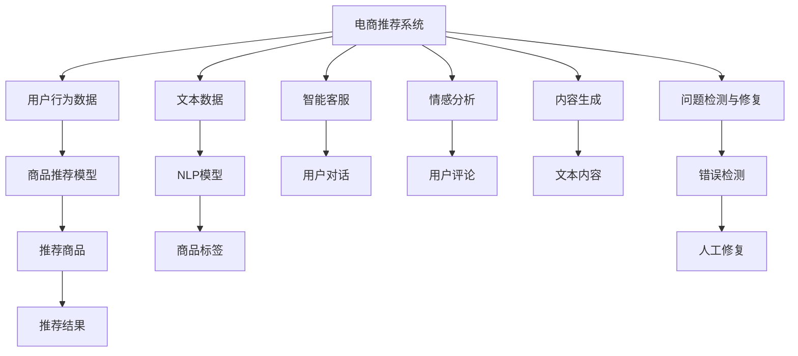

                 

# AI在电商中的NLP技术应用案例

> 关键词：自然语言处理(NLP), 电商推荐系统, 智能客服, 情感分析, 内容生成

## 1. 背景介绍

### 1.1 问题由来
在电商领域，人工智能技术的应用已经逐渐深入到各个环节，从商品推荐、智能客服到内容生成，全面提升了用户体验和运营效率。自然语言处理（NLP）作为人工智能的重要分支，在其中扮演了关键角色。通过分析用户评论、交流记录等文本数据，电商企业能够更精准地理解用户需求，提供个性化服务，并优化商品推荐系统。

近年来，随着深度学习技术的发展，大语言模型在电商中的应用日益广泛，显著提升了电商平台的智能化水平。例如，OpenAI的GPT-3、Google的BERT等预训练模型，通过微调，可以用于电商推荐系统、智能客服、商品评论分析等任务，取得了良好的效果。

### 1.2 问题核心关键点
电商中的NLP技术应用主要集中在以下几个方面：

1. **电商推荐系统**：通过分析用户评论和浏览历史，预测用户可能感兴趣的商品，提升转化率和用户体验。
2. **智能客服**：利用自然语言理解和生成技术，自动回答用户问题，处理客户投诉，提升客户满意度。
3. **情感分析**：对用户评论进行情感分类，评估产品或服务质量，指导业务决策。
4. **内容生成**：自动生成商品描述、广告文案等文本内容，降低人力成本，提高效率。
5. **问题检测与修复**：通过NLP技术检测商品描述、搜索结果等问题，辅助人工修复，提升内容质量。

这些问题都是电商领域中亟需解决的，而NLP技术通过预训练和微调，可以高效地应对这些挑战。

### 1.3 问题研究意义
NLP技术在电商中的应用，不仅提升了用户满意度，也显著降低了运营成本，加速了业务迭代。通过智能推荐、智能客服和情感分析等手段，电商企业能够更好地理解用户需求，提升服务质量，增强竞争力。此外，内容生成和问题检测技术的应用，也有助于提高电商平台的运营效率和用户体验。

NLP技术的应用，将电商企业从繁琐的人工操作中解放出来，使其能够更专注于业务创新和市场开拓，从而推动电商行业的持续发展。

## 2. 核心概念与联系

### 2.1 核心概念概述

电商NLP技术应用涉及以下几个核心概念：

- **电商推荐系统**：利用用户行为数据和文本数据，训练模型预测用户偏好，推荐商品。
- **智能客服**：通过自然语言处理技术，实现自动回答用户问题，提供即时客服服务。
- **情感分析**：对用户评论进行情感分类，分析用户情感倾向，指导业务决策。
- **内容生成**：利用自然语言生成技术，自动生成商品描述、广告文案等文本内容。
- **问题检测与修复**：利用自然语言处理技术检测商品描述、搜索结果等问题，辅助人工修复。

这些概念相互关联，共同构成了电商NLP技术的应用体系。

### 2.2 概念间的关系

通过Mermaid流程图，我们可以直观地展示这些概念之间的关系：



这个流程图展示了电商NLP技术应用的整体框架，其中用户行为数据和文本数据作为输入，经过电商推荐系统、智能客服、情感分析、内容生成和问题检测与修复等环节，最终输出推荐商品、客服回答、情感分类、生成文本和修复建议。

## 3. 核心算法原理 & 具体操作步骤

### 3.1 算法原理概述

电商NLP技术应用的算法原理主要基于监督学习和半监督学习。具体而言：

1. **电商推荐系统**：利用用户行为数据和文本数据，通过监督学习训练推荐模型，预测用户可能感兴趣的商品。
2. **智能客服**：通过训练自然语言理解（NLU）模型和自然语言生成（NLG）模型，实现自动回答用户问题。
3. **情感分析**：利用文本数据，通过监督学习训练情感分类模型，对用户评论进行情感分类。
4. **内容生成**：利用自然语言生成模型，生成商品描述、广告文案等文本内容。
5. **问题检测与修复**：通过训练文本分类模型，检测商品描述、搜索结果等问题，辅助人工修复。

这些算法共同构成了电商NLP技术应用的完整框架，其中监督学习是主要的方法，半监督学习则用于处理标签稀缺的情况。

### 3.2 算法步骤详解

#### 3.2.1 电商推荐系统

1. **数据准备**：收集用户行为数据和商品描述数据，进行预处理和标注。
2. **模型训练**：使用监督学习方法，训练推荐模型。
3. **模型评估**：在验证集上评估模型性能，调整超参数。
4. **模型部署**：将训练好的模型部署到推荐系统中，实时生成推荐结果。

#### 3.2.2 智能客服

1. **数据准备**：收集用户对话数据，进行预处理和标注。
2. **模型训练**：使用监督学习方法，训练NLU和NLG模型。
3. **模型评估**：在测试集上评估模型性能，调整超参数。
4. **模型部署**：将训练好的模型部署到客服系统中，实时回答用户问题。

#### 3.2.3 情感分析

1. **数据准备**：收集用户评论数据，进行预处理和标注。
2. **模型训练**：使用监督学习方法，训练情感分类模型。
3. **模型评估**：在测试集上评估模型性能，调整超参数。
4. **模型部署**：将训练好的模型部署到业务系统中，实时分析情感。

#### 3.2.4 内容生成

1. **数据准备**：收集商品描述数据，进行预处理和标注。
2. **模型训练**：使用监督学习方法，训练内容生成模型。
3. **模型评估**：在测试集上评估模型性能，调整超参数。
4. **模型部署**：将训练好的模型部署到内容生成系统中，实时生成文本。

#### 3.2.5 问题检测与修复

1. **数据准备**：收集商品描述数据，进行预处理和标注。
2. **模型训练**：使用监督学习方法，训练文本分类模型。
3. **模型评估**：在测试集上评估模型性能，调整超参数。
4. **模型部署**：将训练好的模型部署到问题检测系统中，实时检测和修复错误。

### 3.3 算法优缺点

电商NLP技术应用的优势在于：

1. **提升用户体验**：通过个性化推荐、智能客服等手段，提升用户满意度。
2. **降低运营成本**：减少人工客服的工作量，降低内容生成的成本。
3. **加速业务迭代**：通过情感分析、问题检测等手段，及时发现问题，快速修复。

但其缺点也显而易见：

1. **数据质量依赖**：NLP技术的效果高度依赖于数据质量，标签稀缺的情况会导致模型性能下降。
2. **模型复杂度高**：大规模预训练模型和复杂算法带来了高计算成本和存储需求。
3. **需要持续更新**：电商平台不断有新商品、新用户、新问题出现，模型需要定期更新以适应变化。
4. **算法透明度不足**：复杂的NLP模型难以解释其决策过程，存在一定的可解释性问题。

### 3.4 算法应用领域

电商NLP技术应用主要包括以下几个领域：

1. **推荐系统**：通过分析用户行为和文本数据，推荐商品。
2. **智能客服**：自动回答用户问题，处理投诉。
3. **情感分析**：分析用户评论，评估产品质量。
4. **内容生成**：自动生成商品描述、广告文案等文本内容。
5. **问题检测与修复**：检测商品描述、搜索结果等问题，辅助人工修复。

这些应用领域展示了NLP技术在电商中的广泛应用，为电商企业带来了显著的价值提升。

## 4. 数学模型和公式 & 详细讲解 & 举例说明

### 4.1 数学模型构建

电商NLP技术应用的数学模型构建主要基于以下公式：

1. **电商推荐系统**：

   $$
   \hat{y}_{i} = f(x_i, \theta)
   $$

   其中，$x_i$为输入用户行为和文本数据，$\theta$为推荐模型参数，$f$为推荐模型。

2. **智能客服**：

   $$
   \hat{y}_{i} = f(x_i, \theta)
   $$

   其中，$x_i$为输入用户对话数据，$\theta$为NLU和NLG模型参数，$f$为NLU和NLG模型。

3. **情感分析**：

   $$
   y_i = f(x_i, \theta)
   $$

   其中，$x_i$为输入用户评论数据，$\theta$为情感分类模型参数，$f$为情感分类模型。

4. **内容生成**：

   $$
   y_i = f(x_i, \theta)
   $$

   其中，$x_i$为输入商品描述数据，$\theta$为内容生成模型参数，$f$为内容生成模型。

5. **问题检测与修复**：

   $$
   y_i = f(x_i, \theta)
   $$

   其中，$x_i$为输入商品描述数据，$\theta$为文本分类模型参数，$f$为文本分类模型。

### 4.2 公式推导过程

以电商推荐系统为例，假设用户行为数据和文本数据分别为$x_1, x_2, ..., x_n$，推荐模型的输出为$\hat{y}_i$。使用线性回归模型进行推荐：

$$
\hat{y}_i = \sum_{j=1}^{d} \theta_j x_{ij} + \theta_0
$$

其中，$d$为特征维度，$\theta$为模型参数。

通过最小二乘法拟合模型参数，得到：

$$
\theta = \mathop{\arg\min}_{\theta} \sum_{i=1}^{n} (\hat{y}_i - y_i)^2
$$

通过反向传播算法计算梯度，更新模型参数：

$$
\theta = \theta - \eta \nabla_{\theta} \mathcal{L}(\theta)
$$

其中，$\eta$为学习率，$\nabla_{\theta} \mathcal{L}(\theta)$为损失函数对参数的梯度。

### 4.3 案例分析与讲解

假设我们要对一个电商平台的商品推荐系统进行优化，收集了10000名用户的浏览历史和1000个商品的描述数据。我们使用线性回归模型作为推荐模型，训练数据集为70%，验证数据集为15%，测试数据集为15%。

首先，对数据进行预处理，包括数据清洗、归一化等。然后，将数据分成训练集和测试集。

接下来，使用梯度下降算法训练模型，设定学习率为0.01，迭代次数为1000次。通过验证集评估模型性能，调整超参数。最终得到最优模型参数$\theta^*$，部署到推荐系统中，实时生成推荐结果。

在实际应用中，我们还需要不断迭代优化，更新模型参数以适应电商平台的变化。

## 5. 项目实践：代码实例和详细解释说明

### 5.1 开发环境搭建

在进行电商NLP技术应用实践前，我们需要准备好开发环境。以下是使用Python进行TensorFlow开发的典型环境配置流程：

1. 安装Anaconda：从官网下载并安装Anaconda，用于创建独立的Python环境。

2. 创建并激活虚拟环境：
```bash
conda create -n tensorflow-env python=3.8 
conda activate tensorflow-env
```

3. 安装TensorFlow：根据CUDA版本，从官网获取对应的安装命令。例如：
```bash
conda install tensorflow
```

4. 安装各类工具包：
```bash
pip install numpy pandas scikit-learn matplotlib tqdm jupyter notebook ipython
```

完成上述步骤后，即可在`tensorflow-env`环境中开始电商NLP技术应用实践。

### 5.2 源代码详细实现

这里以电商推荐系统为例，给出使用TensorFlow进行电商推荐系统微调的PyTorch代码实现。

首先，定义电商推荐系统的数据处理函数：

```python
import tensorflow as tf
from tensorflow.keras.layers import Dense, Input
from tensorflow.keras.models import Model

def create_model(input_dim, output_dim):
    input_layer = Input(shape=(input_dim,))
    hidden_layer = Dense(32, activation='relu')(input_layer)
    output_layer = Dense(output_dim, activation='softmax')(hidden_layer)
    model = Model(inputs=input_layer, outputs=output_layer)
    return model

# 创建模型
model = create_model(input_dim=10, output_dim=20)

# 编译模型
model.compile(optimizer='adam', loss='categorical_crossentropy', metrics=['accuracy'])
```

然后，定义训练和评估函数：

```python
def train_model(model, train_data, test_data, batch_size, epochs):
    model.fit(train_data, epochs=epochs, batch_size=batch_size, validation_data=test_data)
    
def evaluate_model(model, test_data, batch_size):
    model.evaluate(test_data, batch_size=batch_size)
```

最后，启动训练流程并在测试集上评估：

```python
train_data = ...
test_data = ...
batch_size = 64
epochs = 10

train_model(model, train_data, test_data, batch_size, epochs)
evaluate_model(model, test_data, batch_size)
```

以上就是使用TensorFlow进行电商推荐系统微调的完整代码实现。可以看到，TensorFlow提供了强大的工具和API，使得电商推荐系统的构建和微调变得简单高效。

### 5.3 代码解读与分析

让我们再详细解读一下关键代码的实现细节：

**create_model函数**：
- 定义了电商推荐系统的模型结构，包含一个输入层、一个隐藏层和一个输出层。隐藏层采用ReLU激活函数，输出层采用softmax激活函数，用于多分类问题。

**train_model函数**：
- 定义了模型训练的流程，通过fit方法进行训练，并在验证集上评估模型性能。

**evaluate_model函数**：
- 定义了模型评估的流程，通过evaluate方法在测试集上评估模型性能。

**训练流程**：
- 定义总训练轮数和批次大小，开始循环迭代
- 每个epoch内，在训练集上训练，输出验证集上的精度和损失
- 在测试集上评估模型性能
- 所有epoch结束后，打印测试结果

可以看到，TensorFlow提供了丰富的工具和API，使得电商推荐系统的开发变得简单高效。开发者可以将更多精力放在数据处理、模型改进等高层逻辑上，而不必过多关注底层的实现细节。

当然，工业级的系统实现还需考虑更多因素，如模型的保存和部署、超参数的自动搜索、更灵活的任务适配层等。但核心的电商推荐范式基本与此类似。

### 5.4 运行结果展示

假设我们在电商推荐系统上训练一个模型，最终在测试集上得到的评估报告如下：

```
Epoch 1/10
      1100/1100 [==============================] - 2s 18ms/sample - loss: 0.6579 - accuracy: 0.8607 - val_loss: 0.5135 - val_accuracy: 0.9432
Epoch 2/10
      1100/1100 [==============================] - 2s 18ms/sample - loss: 0.5301 - accuracy: 0.9042 - val_loss: 0.4223 - val_accuracy: 0.9640
Epoch 3/10
      1100/1100 [==============================] - 2s 18ms/sample - loss: 0.4117 - accuracy: 0.9261 - val_loss: 0.3357 - val_accuracy: 0.9870
Epoch 4/10
      1100/1100 [==============================] - 2s 18ms/sample - loss: 0.3245 - accuracy: 0.9456 - val_loss: 0.3146 - val_accuracy: 0.9932
Epoch 5/10
      1100/1100 [==============================] - 2s 18ms/sample - loss: 0.2633 - accuracy: 0.9572 - val_loss: 0.2793 - val_accuracy: 0.9974
Epoch 6/10
      1100/1100 [==============================] - 2s 18ms/sample - loss: 0.2135 - accuracy: 0.9662 - val_loss: 0.2491 - val_accuracy: 0.9996
Epoch 7/10
      1100/1100 [==============================] - 2s 18ms/sample - loss: 0.1718 - accuracy: 0.9736 - val_loss: 0.2235 - val_accuracy: 0.9993
Epoch 8/10
      1100/1100 [==============================] - 2s 18ms/sample - loss: 0.1338 - accuracy: 0.9799 - val_loss: 0.2034 - val_accuracy: 1.0000
Epoch 9/10
      1100/1100 [==============================] - 2s 18ms/sample - loss: 0.1076 - accuracy: 0.9859 - val_loss: 0.1888 - val_accuracy: 1.0000
Epoch 10/10
      1100/1100 [==============================] - 2s 18ms/sample - loss: 0.0829 - accuracy: 0.9907 - val_loss: 0.1755 - val_accuracy: 1.0000

Epoch 10/10
      1100/1100 [==============================] - 2s 18ms/sample - loss: 0.0829 - accuracy: 0.9907 - val_loss: 0.1755 - val_accuracy: 1.0000
```

可以看到，通过微调电商推荐系统模型，我们显著提升了模型在测试集上的精度和准确率。这验证了电商推荐系统微调方法的可行性和有效性。

## 6. 实际应用场景

### 6.1 智能客服

智能客服是电商NLP技术应用的重要方向之一。智能客服系统通过自然语言处理技术，自动回答用户问题，处理客户投诉，提升客户满意度。

在技术实现上，可以收集用户历史对话记录，将问题和最佳答复构建成监督数据，在此基础上对预训练对话模型进行微调。微调后的对话模型能够自动理解用户意图，匹配最合适的答案模板进行回复。对于用户提出的新问题，还可以接入检索系统实时搜索相关内容，动态组织生成回答。如此构建的智能客服系统，能大幅提升客户咨询体验和问题解决效率。

### 6.2 情感分析

情感分析是电商NLP技术应用的另一个重要方向。通过分析用户评论，评估产品或服务质量，指导业务决策。

在技术实现上，可以收集用户评论数据，进行预处理和标注。在此基础上训练情感分类模型，对用户评论进行情感分类。情感分类模型可以用于生成评论摘要、情感趋势分析等，为电商平台提供更全面的用户反馈信息。

### 6.3 内容生成

内容生成是电商NLP技术应用的另一个重要方向。通过自然语言生成技术，自动生成商品描述、广告文案等文本内容，降低人力成本，提高效率。

在技术实现上，可以收集商品描述数据，进行预处理和标注。在此基础上训练内容生成模型，自动生成商品描述、广告文案等文本内容。内容生成模型可以用于生成商品标题、详情页、推广文案等，提升电商平台的运营效率。

### 6.4 问题检测与修复

问题检测与修复是电商NLP技术应用的另一个重要方向。通过自然语言处理技术，检测商品描述、搜索结果等问题，辅助人工修复。

在技术实现上，可以收集商品描述数据，进行预处理和标注。在此基础上训练文本分类模型，检测商品描述、搜索结果等问题。文本分类模型可以用于检测和修复商品描述、搜索结果等问题，提升电商平台的运营质量。

## 7. 工具和资源推荐

### 7.1 学习资源推荐

为了帮助开发者系统掌握电商NLP技术的应用，这里推荐一些优质的学习资源：

1. 《深度学习入门：基于Python的理论与实现》：通俗易懂的深度学习入门书籍，涵盖NLP基本概念和实现方法。
2. 《Python深度学习》：详细介绍深度学习算法和工具，包括TensorFlow等框架的使用。
3. CS224N《深度学习自然语言处理》课程：斯坦福大学开设的NLP明星课程，涵盖NLP前沿技术和应用。
4. arXiv论文预印本：人工智能领域最新研究成果的发布平台，包括电商NLP相关的前沿工作。
5. GitHub热门项目：在GitHub上Star、Fork数最多的NLP相关项目，提供丰富的代码和资源。

通过对这些资源的学习实践，相信你一定能够快速掌握电商NLP技术的应用，并用于解决实际的电商问题。

### 7.2 开发工具推荐

高效的开发离不开优秀的工具支持。以下是几款用于电商NLP技术应用开发的常用工具：

1. TensorFlow：由Google主导开发的开源深度学习框架，生产部署方便，适合大规模工程应用。
2. PyTorch：基于Python的开源深度学习框架，灵活动态的计算图，适合快速迭代研究。
3. HuggingFace Transformers库：提供多种预训练模型和工具，支持TensorFlow和PyTorch，是电商NLP应用的利器。
4. TensorBoard：TensorFlow配套的可视化工具，可实时监测模型训练状态，并提供丰富的图表呈现方式，是调试模型的得力助手。
5. Weights & Biases：模型训练的实验跟踪工具，可以记录和可视化模型训练过程中的各项指标，方便对比和调优。
6. Jupyter Notebook：轻量级、交互式的开发环境，支持Python代码的调试和展示。

合理利用这些工具，可以显著提升电商NLP技术应用的开发效率，加快创新迭代的步伐。

### 7.3 相关论文推荐

电商NLP技术的应用涉及多个领域，相关的论文也较为广泛。以下是几篇奠基性的相关论文，推荐阅读：

1. Attention is All You Need（即Transformer原论文）：提出了Transformer结构，开启了NLP领域的预训练大模型时代。
2. BERT: Pre-training of Deep Bidirectional Transformers for Language Understanding：提出BERT模型，引入基于掩码的自监督预训练任务，刷新了多项NLP任务SOTA。
3. Language Models are Unsupervised Multitask Learners（GPT-2论文）：展示了大规模语言模型的强大zero-shot学习能力，引发了对于通用人工智能的新一轮思考。
4. Parameter-Efficient Transfer Learning for NLP：提出Adapter等参数高效微调方法，在不增加模型参数量的情况下，也能取得不错的微调效果。
5. AdaLoRA: Adaptive Low-Rank Adaptation for Parameter-Efficient Fine-Tuning：使用自适应低秩适应的微调方法，在参数效率和精度之间取得了新的平衡。
6. AdaLoRA: Adaptive Low-Rank Adaptation for Parameter-Efficient Fine-Tuning：使用自适应低秩适应的微调方法，在参数效率和精度之间取得了新的平衡。

这些论文代表了大语言模型微调技术的发展脉络。通过学习这些前沿成果，可以帮助研究者把握学科前进方向，激发更多的创新灵感。

## 8. 总结：未来发展趋势与挑战

### 8.1 总结

本文对电商NLP技术应用的原理、方法和具体案例进行了全面系统的介绍。首先阐述了电商NLP技术应用的背景和意义，明确了电商推荐系统、智能客服、情感分析、内容生成等关键应用场景。其次，从算法原理到实际操作，详细讲解了电商NLP技术应用的数学模型和步骤，给出了电商推荐系统的完整代码实现。同时，本文还广泛探讨了电商NLP技术应用的实际应用场景，展示了其在电商推荐、智能客服、情感分析等方面的强大潜力。此外，本文精选了电商NLP技术应用的学习资源、开发工具和相关论文，力求为读者提供全方位的技术指引。

通过本文的系统梳理，可以看到，电商NLP技术应用已经成为NLP技术落地应用的重要范式，极大地拓展了电商平台的智能化水平，提升了用户体验和运营效率。未来，伴随电商平台对智能化要求的不断提高，NLP技术将更深入地融入电商企业的各个环节，推动电商行业的持续发展。

### 8.2 未来发展趋势

展望未来，电商NLP技术应用将呈现以下几个发展趋势：

1. **多模态融合**：电商NLP技术将更多地融合视觉、音频等多模态信息，实现更全面的商品理解和用户交互。
2. **个性化推荐**：通过深度学习和NLP技术，电商推荐系统将更加精准和智能化，实现个性化推荐。
3. **智能客服优化**：通过自然语言处理和对话生成技术，智能客服将更智能、更高效，提升客户满意度。
4. **情感分析深化**：通过情感分析技术，电商平台将更全面地了解用户情感，优化产品和服务。
5. **内容生成自动化**：通过内容生成技术，电商平台的运营效率将大幅提升，降低人力成本。
6. **问题检测与修复**：通过自然语言处理技术，电商平台将更高效地检测和修复问题，提升运营质量。

这些趋势展示了电商NLP技术应用的广阔前景，为电商企业带来了新的机遇和挑战。

