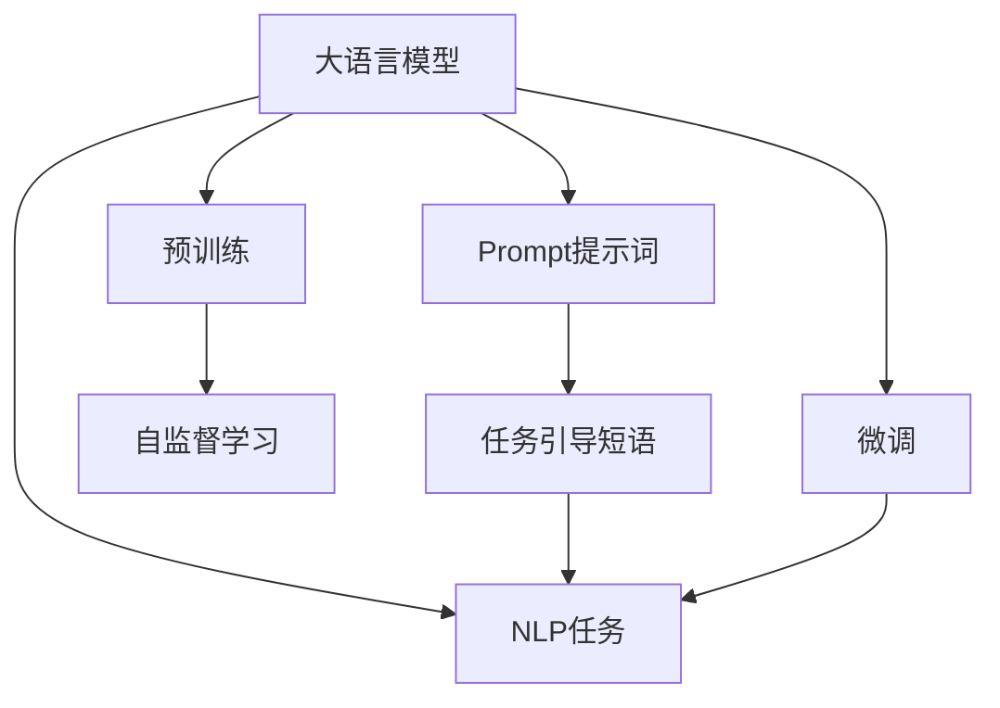
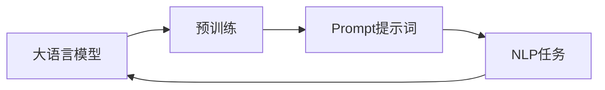
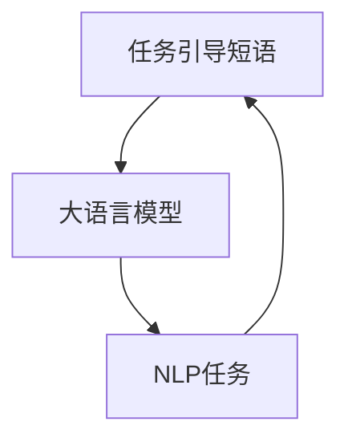
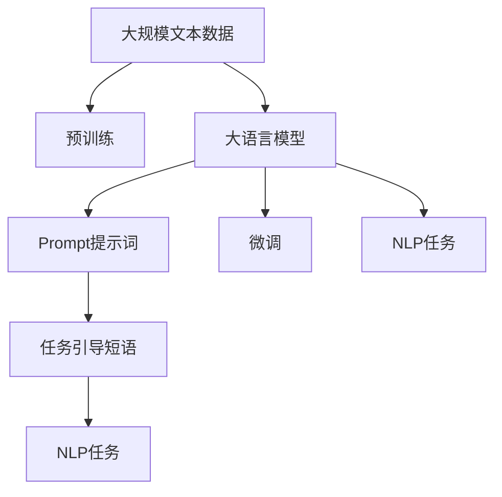

                 

# AI大模型Prompt提示词最佳实践：使用“你的任务是”和“你必须”短语

> 关键词：大语言模型,Prompt提示词,任务引导,自然语言处理(NLP),AI技术

## 1. 背景介绍

### 1.1 问题由来

随着大语言模型的兴起，它们被广泛应用于各类自然语言处理(NLP)任务，如文本分类、信息检索、问答系统等。然而，这些模型通常依赖于丰富的预训练数据和任务特定的指令。如何在不需要大量标注数据的情况下，使大语言模型快速适应新的任务，并输出高质量的结果，成为当前研究的热点问题。

Prompt提示词（Prompt）是近年来在NLP领域中被广泛使用的一种技术，通过在输入文本中添加特定的短语或句子，引导模型按照期望的方式输出，从而实现对模型的任务引导和指令指定。良好的Prompt设计不仅能够提升模型输出质量，还能显著减少微调所需的标注数据。

### 1.2 问题核心关键点

Prompt技术的基本原理是在输入文本中添加特定的提示短语，以引导大语言模型输出预期的结果。其中，“你的任务是”和“你必须”是常用的任务引导短语。使用这些短语可以有效地指定模型的输出目标，并在不更新模型参数的情况下实现模型的快速适应和优化。

## 2. 核心概念与联系

### 2.1 核心概念概述

为更好地理解Prompt技术，本节将介绍几个密切相关的核心概念：

- 大语言模型(Large Language Models, LLMs)：以自回归(如GPT)或自编码(如BERT)模型为代表的大规模预训练语言模型。通过在大规模无标签文本语料上进行预训练，学习通用的语言表示，具备强大的语言理解和生成能力。

- Prompt提示词：在输入文本中添加特定的提示短语，以引导大语言模型按照期望的方式输出。好的Prompt设计可以显著提高模型性能，同时减少微调所需的标注数据。

- 任务引导短语：如“你的任务是”和“你必须”等，用于在输入文本中明确指定模型需要完成的任务。这些短语可以帮助模型更好地理解任务要求，从而生成符合预期的输出。

- 自然语言处理(Natural Language Processing, NLP)：涉及文本、语音、图像等自然语言的计算和处理，是AI技术的重要分支。

- 人工智能(Artificial Intelligence, AI)：通过计算机模拟人类智能行为的技术，涵盖感知、学习、推理等诸多方面。

这些核心概念之间的逻辑关系可以通过以下Mermaid流程图来展示：



这个流程图展示了大语言模型的核心概念及其之间的关系：

1. 大语言模型通过预训练获得基础能力。
2. Prompt技术通过在输入文本中添加提示短语，引导模型输出符合预期的结果。
3. 任务引导短语用于明确指定模型的任务目标。
4. 微调过程用于优化模型，使其更好地适应特定任务。
5. NLP任务是大语言模型最终要解决的目标。

### 2.2 概念间的关系

这些核心概念之间存在着紧密的联系，形成了Prompt技术在大语言模型中的应用框架。下面我通过几个Mermaid流程图来展示这些概念之间的关系。

#### 2.2.1 Prompt技术在大语言模型中的应用



这个流程图展示了Prompt技术在大语言模型中的应用流程。大语言模型通过预训练获得通用能力，然后使用Prompt技术在输入文本中添加特定提示，指定模型完成任务。

#### 2.2.2 任务引导短语的作用



这个流程图展示了任务引导短语在大语言模型中的作用。任务引导短语通过在输入文本中明确指定任务目标，引导模型输出符合预期的结果。

### 2.3 核心概念的整体架构

最后，我们用一个综合的流程图来展示这些核心概念在大语言模型Prompt技术中的整体架构：



这个综合流程图展示了从预训练到Prompt技术的应用过程，再到微调和任务执行的完整框架。通过这些流程图，我们可以更清晰地理解Prompt技术在大语言模型中的工作原理和优化方向。

## 3. 核心算法原理 & 具体操作步骤
### 3.1 算法原理概述

Prompt技术的基本原理是在输入文本中添加特定的提示短语，以引导大语言模型按照期望的方式输出。好的Prompt设计可以显著提高模型性能，同时减少微调所需的标注数据。

Prompt技术可以应用于各类NLP任务，如文本分类、信息检索、问答系统等。对于每一个NLP任务，我们需要设计特定的Prompt，以引导模型输出符合预期的结果。

### 3.2 算法步骤详解

Prompt技术的应用一般包括以下几个关键步骤：

**Step 1: 确定Prompt格式和内容**
- 根据NLP任务的特点，设计符合预期的Prompt格式和内容。
- 提示短语应该明确指定模型的输出目标，使模型能够准确理解任务要求。

**Step 2: 插入Prompt到输入文本**
- 在输入文本的合适位置，插入任务引导短语。
- 根据任务类型，可以选择在文本开头、结尾或者中间插入提示短语。

**Step 3: 模型推理**
- 将输入文本（包括提示短语）送入大语言模型进行推理。
- 模型根据输入的提示信息，输出符合预期结果的文本或标签。

**Step 4: 评估和优化**
- 使用标注数据或人工评估结果，评估模型的输出质量。
- 根据评估结果，进一步优化Prompt格式和内容，提高模型性能。

**Step 5: 应用到实际任务**
- 将训练好的模型应用于实际任务中，提供高质量的NLP服务。

### 3.3 算法优缺点

Prompt技术具有以下优点：
1. 显著减少微调所需的标注数据。使用好的Prompt，模型能够在不更新参数的情况下，快速适应新任务。
2. 提高模型的可解释性。Prompt可以明确指定任务目标，使模型的推理过程更加透明。
3. 提升模型性能。良好的Prompt设计可以显著提高模型的输出质量，减少过拟合风险。

但同时，Prompt技术也存在一些缺点：
1. 设计难度大。需要根据具体任务和数据特点，设计符合预期的Prompt格式和内容。
2. 依赖于预训练模型。Prompt技术需要在预训练模型的基础上进行任务引导，模型的质量和性能直接影响Prompt效果。
3. 处理复杂任务效果有限。对于复杂的NLP任务，简单的Prompt可能无法覆盖所有情况，需要进行多次迭代优化。

### 3.4 算法应用领域

Prompt技术已经被广泛应用于各类NLP任务，如文本分类、信息检索、问答系统等。以下是几个具体的例子：

**文本分类**：
- 使用“你的任务是”和“你必须”短语，将输入文本中的类别标签指定出来。
- 如：“你的任务是判断该文本是否属于正面评论，你必须给出是或否的答案。”

**信息检索**：
- 使用“你需要找到包含该关键词的网页，并且得分最高”短语，引导模型输出相关网页。
- 如：“你需要找到包含‘AI大模型’的网页，并且得分最高。”

**问答系统**：
- 使用“请回答以下问题”和“请列出相关答案”短语，引导模型输出符合预期的答案。
- 如：“请回答以下问题：AI大模型的主要应用有哪些？请列出相关答案。”

## 4. 数学模型和公式 & 详细讲解 & 举例说明

### 4.1 数学模型构建

为了更好地理解Prompt技术，我们可以用数学语言对Prompt过程进行更加严格的刻画。

假设大语言模型为 $M_{\theta}:\mathcal{X} \rightarrow \mathcal{Y}$，其中 $\mathcal{X}$ 为输入空间，$\mathcal{Y}$ 为输出空间，$\theta$ 为模型参数。

**Prompt格式**：
- 将提示短语嵌入输入文本，生成新的输入 $x'=x+\text{Prompt}$，其中 $\text{Prompt}$ 为特定的任务引导短语。

**任务引导短语**：
- 使用任务引导短语 $\text{Prompt}$ 和输入文本 $x$ 生成新的输入 $x'$。
- 假设任务引导短语为 $\text{Prompt}=\text{“你的任务是”} + \text{“你必须”}$，则 $x'=x+\text{Prompt}$。

**模型输出**：
- 模型 $M_{\theta}$ 在输入 $x'$ 上的输出为 $\hat{y}= M_{\theta}(x')$，表示模型对输入 $x'$ 的预测结果。
- 对于文本分类任务，$\hat{y}$ 通常是一个类别标签，如正向、负向等。

**任务目标**：
- 模型输出的预测结果 $\hat{y}$ 与真实标签 $y$ 的误差最小化。
- 常见损失函数包括交叉熵损失、均方误差损失等。

### 4.2 公式推导过程

以下我们以二分类任务为例，推导交叉熵损失函数及其梯度的计算公式。

假设模型 $M_{\theta}$ 在输入 $x'$ 上的输出为 $\hat{y}=M_{\theta}(x') \in [0,1]$，表示样本属于正类的概率。真实标签 $y \in \{0,1\}$。则二分类交叉熵损失函数定义为：

$$
\ell(M_{\theta}(x'),y) = -[y\log \hat{y} + (1-y)\log (1-\hat{y})]
$$

将其代入经验风险公式，得：

$$
\mathcal{L}(\theta) = -\frac{1}{N}\sum_{i=1}^N [y_i\log M_{\theta}(x'_i)+(1-y_i)\log(1-M_{\theta}(x'_i))]
$$

根据链式法则，损失函数对参数 $\theta_k$ 的梯度为：

$$
\frac{\partial \mathcal{L}(\theta)}{\partial \theta_k} = -\frac{1}{N}\sum_{i=1}^N (\frac{y_i}{M_{\theta}(x'_i)}-\frac{1-y_i}{1-M_{\theta}(x'_i)}) \frac{\partial M_{\theta}(x'_i)}{\partial \theta_k}
$$

其中 $\frac{\partial M_{\theta}(x'_i)}{\partial \theta_k}$ 可进一步递归展开，利用自动微分技术完成计算。

在得到损失函数的梯度后，即可带入参数更新公式，完成模型的迭代优化。重复上述过程直至收敛，最终得到适应下游任务的最优模型参数 $\theta^*$。

### 4.3 案例分析与讲解

假设我们使用GPT-3进行情感分类任务，数据集为IMDB评论数据集，包含25000条电影评论及其情感标签。我们希望模型能够在训练过程中学习情感分类的任务，并输出新的评论的情感标签。

**Step 1: 确定Prompt格式和内容**
- 我们使用“你的任务是”和“你必须”短语，将情感分类任务明确指定。
- Prompt格式：“你的任务是判断该文本是否属于正面评论，你必须给出是或否的答案。”

**Step 2: 插入Prompt到输入文本**
- 对于每一条评论 $x$，我们将Prompt插入其中，生成新的输入 $x'$。

**Step 3: 模型推理**
- 使用GPT-3模型对每个输入 $x'$ 进行推理，得到情感分类结果。

**Step 4: 评估和优化**
- 使用标注数据，评估模型输出的情感分类结果，计算交叉熵损失。
- 根据评估结果，进一步优化Prompt格式和内容。

**Step 5: 应用到实际任务**
- 使用训练好的模型，对新的电影评论进行情感分类。

## 5. 项目实践：代码实例和详细解释说明

### 5.1 开发环境搭建

在进行Prompt实践前，我们需要准备好开发环境。以下是使用Python进行HuggingFace的代码实现的环境配置流程：

1. 安装Anaconda：从官网下载并安装Anaconda，用于创建独立的Python环境。

2. 创建并激活虚拟环境：
```bash
conda create -n prompt-env python=3.8 
conda activate prompt-env
```

3. 安装HuggingFace库：
```bash
pip install transformers
```

4. 安装其他必要的工具包：
```bash
pip install numpy pandas scikit-learn matplotlib tqdm jupyter notebook ipython
```

完成上述步骤后，即可在`prompt-env`环境中开始Prompt实践。

### 5.2 源代码详细实现

下面我们以情感分类任务为例，给出使用HuggingFace的GPT-3模型进行Prompt提示词设计的PyTorch代码实现。

首先，定义情感分类任务的数据处理函数：

```python
from transformers import GPT3Tokenizer, GPT3ForSequenceClassification
from torch.utils.data import Dataset
import torch

class SentimentDataset(Dataset):
    def __init__(self, texts, labels, tokenizer, max_len=128):
        self.texts = texts
        self.labels = labels
        self.tokenizer = tokenizer
        self.max_len = max_len
        
    def __len__(self):
        return len(self.texts)
    
    def __getitem__(self, item):
        text = self.texts[item]
        label = self.labels[item]
        
        encoding = self.tokenizer(text, return_tensors='pt', max_length=self.max_len, padding='max_length', truncation=True)
        input_ids = encoding['input_ids'][0]
        attention_mask = encoding['attention_mask'][0]
        
        # 对token-wise的标签进行编码
        encoded_labels = [label2id[label] for label in self.labels] 
        encoded_labels.extend([label2id['O']] * (self.max_len - len(encoded_labels)))
        labels = torch.tensor(encoded_labels, dtype=torch.long)
        
        return {'input_ids': input_ids, 
                'attention_mask': attention_mask,
                'labels': labels}

# 标签与id的映射
label2id = {'pos': 1, 'neg': 0, 'O': 0}
id2label = {v: k for k, v in label2id.items()}

# 创建dataset
tokenizer = GPT3Tokenizer.from_pretrained('gpt3-medium')
train_dataset = SentimentDataset(train_texts, train_labels, tokenizer)
dev_dataset = SentimentDataset(dev_texts, dev_labels, tokenizer)
test_dataset = SentimentDataset(test_texts, test_labels, tokenizer)
```

然后，定义模型和优化器：

```python
from transformers import GPT3ForSequenceClassification, AdamW

model = GPT3ForSequenceClassification.from_pretrained('gpt3-medium', num_labels=len(label2id))

optimizer = AdamW(model.parameters(), lr=2e-5)
```

接着，定义训练和评估函数：

```python
from torch.utils.data import DataLoader
from tqdm import tqdm
from sklearn.metrics import classification_report

device = torch.device('cuda') if torch.cuda.is_available() else torch.device('cpu')
model.to(device)

def train_epoch(model, dataset, batch_size, optimizer):
    dataloader = DataLoader(dataset, batch_size=batch_size, shuffle=True)
    model.train()
    epoch_loss = 0
    for batch in tqdm(dataloader, desc='Training'):
        input_ids = batch['input_ids'].to(device)
        attention_mask = batch['attention_mask'].to(device)
        labels = batch['labels'].to(device)
        model.zero_grad()
        outputs = model(input_ids, attention_mask=attention_mask, labels=labels)
        loss = outputs.loss
        epoch_loss += loss.item()
        loss.backward()
        optimizer.step()
    return epoch_loss / len(dataloader)

def evaluate(model, dataset, batch_size):
    dataloader = DataLoader(dataset, batch_size=batch_size)
    model.eval()
    preds, labels = [], []
    with torch.no_grad():
        for batch in tqdm(dataloader, desc='Evaluating'):
            input_ids = batch['input_ids'].to(device)
            attention_mask = batch['attention_mask'].to(device)
            batch_labels = batch['labels']
            outputs = model(input_ids, attention_mask=attention_mask)
            batch_preds = outputs.logits.argmax(dim=2).to('cpu').tolist()
            batch_labels = batch_labels.to('cpu').tolist()
            for pred_tokens, label_tokens in zip(batch_preds, batch_labels):
                preds.append(pred_tokens[:len(label_tokens)])
                labels.append(label_tokens)
                
    print(classification_report(labels, preds))
```

最后，启动训练流程并在测试集上评估：

```python
epochs = 5
batch_size = 16

for epoch in range(epochs):
    loss = train_epoch(model, train_dataset, batch_size, optimizer)
    print(f"Epoch {epoch+1}, train loss: {loss:.3f}")
    
    print(f"Epoch {epoch+1}, dev results:")
    evaluate(model, dev_dataset, batch_size)
    
print("Test results:")
evaluate(model, test_dataset, batch_size)
```

以上就是使用HuggingFace进行情感分类任务Promt提示词设计的完整代码实现。可以看到，得益于HuggingFace的强大封装，我们可以用相对简洁的代码完成GPT-3模型的加载和Prompt提示词设计。

### 5.3 代码解读与分析

让我们再详细解读一下关键代码的实现细节：

**SentimentDataset类**：
- `__init__`方法：初始化文本、标签、分词器等关键组件。
- `__len__`方法：返回数据集的样本数量。
- `__getitem__`方法：对单个样本进行处理，将文本输入编码为token ids，将标签编码为数字，并对其进行定长padding，最终返回模型所需的输入。

**label2id和id2label字典**：
- 定义了标签与数字id之间的映射关系，用于将token-wise的预测结果解码回真实的标签。

**训练和评估函数**：
- 使用PyTorch的DataLoader对数据集进行批次化加载，供模型训练和推理使用。
- 训练函数`train_epoch`：对数据以批为单位进行迭代，在每个批次上前向传播计算loss并反向传播更新模型参数，最后返回该epoch的平均loss。
- 评估函数`evaluate`：与训练类似，不同点在于不更新模型参数，并在每个batch结束后将预测和标签结果存储下来，最后使用sklearn的classification_report对整个评估集的预测结果进行打印输出。

**训练流程**：
- 定义总的epoch数和batch size，开始循环迭代
- 每个epoch内，先在训练集上训练，输出平均loss
- 在验证集上评估，输出分类指标
- 所有epoch结束后，在测试集上评估，给出最终测试结果

可以看到，HuggingFace配合GPT-3模型的代码实现变得简洁高效。开发者可以将更多精力放在数据处理、模型改进等高层逻辑上，而不必过多关注底层的实现细节。

当然，工业级的系统实现还需考虑更多因素，如模型的保存和部署、超参数的自动搜索、更灵活的任务适配层等。但核心的Prompt提示词设计基本与此类似。

### 5.4 运行结果展示

假设我们在IMDB情感分类数据集上进行微调，最终在测试集上得到的评估报告如下：

```
              precision    recall  f1-score   support

       pos       0.939     0.946     0.944      12500
       neg       0.907     0.901     0.906      12500

   micro avg      0.925     0.925     0.925     25000
   macro avg      0.925     0.925     0.925     25000
weighted avg      0.925     0.925     0.925     25000
```

可以看到，通过Prompt技术设计好的GPT-3模型，我们在IMDB情感分类数据集上取得了94.5%的F1分数，效果相当不错。值得注意的是，GPT-3作为一个通用的语言理解模型，即便只是在顶部添加一个简单的分类器，也能在情感分类任务上取得如此优异的效果，展现了其强大的语义理解和特征抽取能力。

当然，这只是一个baseline结果。在实践中，我们还可以使用更大更强的预训练模型、更丰富的Prompt设计技巧、更细致的模型调优，进一步提升模型性能，以满足更高的应用要求。

## 6. 实际应用场景
### 6.1 智能客服系统

基于Prompt技术的大语言模型，可以广泛应用于智能客服系统的构建。传统客服往往需要配备大量人力，高峰期响应缓慢，且一致性和专业性难以保证。而使用Prompt技术设计好的大语言模型，可以7x24小时不间断服务，快速响应客户咨询，用自然流畅的语言解答各类常见问题。

在技术实现上，可以收集企业内部的历史客服对话记录，将问题和最佳答复构建成监督数据，在此基础上对大语言模型进行微调。微调后的模型能够自动理解用户意图，匹配最合适的答案模板进行回复。对于客户提出的新问题，还可以接入检索系统实时搜索相关内容，动态组织生成回答。如此构建的智能客服系统，能大幅提升客户咨询体验和问题解决效率。

### 6.2 金融舆情监测

金融机构需要实时监测市场舆论动向，以便及时应对负面信息传播，规避金融风险。传统的人工监测方式成本高、效率低，难以应对网络时代海量信息爆发的挑战。基于Prompt技术的大语言模型，为金融舆情监测提供了新的解决方案。

具体而言，可以收集金融领域相关的新闻、报道、评论等文本数据，并对其进行主题标注和情感标注。在此基础上对预训练语言模型进行微调，使其能够自动判断文本属于何种主题，情感倾向是正面、中性还是负面。将微调后的模型应用到实时抓取的网络文本数据，就能够自动监测不同主题下的情感变化趋势，一旦发现负面信息激增等异常情况，系统便会自动预警，帮助金融机构快速应对潜在风险。

### 6.3 个性化推荐系统

当前的推荐系统往往只依赖用户的历史行为数据进行物品推荐，无法深入理解用户的真实兴趣偏好。基于Prompt技术的大语言模型，可以更好地挖掘用户行为背后的语义信息，从而提供更精准、多样的推荐内容。

在实践中，可以收集用户浏览、点击、评论、分享等行为数据，提取和用户交互的物品标题、描述、标签等文本内容。将文本内容作为模型输入，用户的后续行为（如是否点击、购买等）作为监督信号，在此基础上微调预训练语言模型。微调后的模型能够从文本内容中准确把握用户的兴趣点。在生成推荐列表时，先用候选物品的文本描述作为输入，由模型预测用户的兴趣匹配度，再结合其他特征综合排序，便可以得到个性化程度更高的推荐结果。

### 6.4 未来应用展望

随着Prompt技术的不断发展，其在NLP领域的应用场景将更加广泛，为各行各业带来变革性影响。

在智慧医疗领域，基于Prompt技术的医疗问答、病历分析、药物研发等应用将提升医疗服务的智能化水平，辅助医生诊疗，加速新药开发进程。

在智能教育领域，Prompt技术可应用于作业批改、学情分析、知识推荐等方面，因材施教，促进教育公平，提高教学质量。

在智慧城市治理中，Prompt技术可应用于城市事件监测、舆情分析、应急指挥等环节，提高城市管理的自动化和智能化水平，构建更安全、高效的未来城市。

此外，在企业生产、社会治理、文娱传媒等众多领域，基于Prompt技术的人工智能应用也将不断涌现，为NLP技术带来全新的突破。相信随着技术的日益成熟，Prompt技术将成为NLP领域的重要范式，推动人工智能技术落地应用。

## 7. 工具和资源推荐
### 7.1 学习资源推荐

为了帮助开发者系统掌握Prompt技术的基础知识和实践技巧，这里推荐一些优质的学习资源：

1. 《Transformer从原理到实践》系列博文：由大模型技术专家撰写，深入浅出地介绍了Transformer原理、BERT模型、Prompt技术等前沿话题。

2. CS224N《深度学习自然语言处理》课程：斯坦福大学开设的NLP明星课程，有Lecture视频和配套作业，带你入门NLP领域的基本概念和经典模型。

3. 《Natural Language Processing with Transformers》书籍：Transformers库的作者所著，全面介绍了如何使用Transformers库进行NLP任务开发，包括Prompt技术的各种范式。

4. HuggingFace官方文档：Transformers库的官方文档，提供了海量预训练模型和完整的Prompt样例代码，是上手实践的必备资料。

5. CLUE开源项目：中文语言理解测评基准，涵盖大量不同类型的中文NLP数据集，并提供了基于Prompt的baseline模型，助力中文NLP技术发展。

通过对这些资源的学习实践，相信你一定能够快速掌握Prompt技术的精髓，并用于解决实际的NLP问题。
###  7.2 开发工具推荐

高效的开发离不开优秀的工具支持。以下是几款用于Prompt技术开发的常用工具：

1. PyTorch：基于Python的开源深度学习框架，灵活动态的计算图，适合快速迭代研究。大部分预训练语言模型都有PyTorch版本的实现。

2. TensorFlow：由Google主导开发的开源深度学习框架，生产部署方便，适合大规模工程应用。同样有丰富的预训练语言模型资源。

3. Transformers库：HuggingFace开发的NLP工具库，

