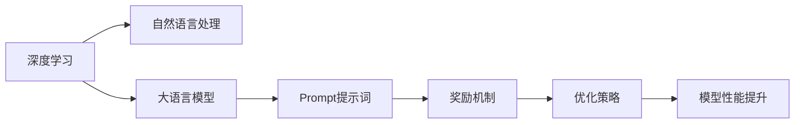

                 

# AI大模型Prompt提示词最佳实践：提供奖励来激励更好的解决方案

> 关键词：AI大模型,Prompt提示词,奖励机制,最佳解决方案,自然语言处理(NLP),深度学习

## 1. 背景介绍

### 1.1 问题由来

在深度学习和自然语言处理(NLP)领域，大语言模型（Large Language Models, LLMs），如GPT-3、BERT等，已经成为核心技术之一。这些模型通过大量数据预训练和微调，能够完成各种复杂的NLP任务，如文本分类、情感分析、问答、对话生成等。然而，尽管大模型在处理标准NLP任务上表现出色，但在特定应用场景中，仍然需要结合领域知识，进行精细的参数调整和优化。

Prompt提示词（Prompt Templates）就是其中一种方法。通过精心设计的提示词，可以引导大模型在特定任务下生成高质量的输出，无需额外训练和优化。然而，由于不同应用场景的需求千差万别，设计出合适的提示词仍然是一个具有挑战性的问题。

### 1.2 问题核心关键点

在应用Prompt提示词时，关键问题包括：

- 如何设计有效的提示词？
- 如何评估提示词的质量？
- 如何在不同的应用场景中，选择最合适的提示词？

为了解决这些问题，本文将详细介绍Prompt提示词的设计原则，提供一些实用的设计技巧，并分享一些在实际应用中优化提示词的实践经验。

### 1.3 问题研究意义

Prompt提示词的应用，可以大幅提升大语言模型在特定任务上的性能，避免从头训练模型的高成本和复杂性。同时，通过设计有针对性的提示词，可以使模型在需要推理和生成时，能够快速响应，生成更符合期望的输出。因此，掌握Prompt提示词的最佳实践，对于NLP技术的实际应用具有重要意义。

## 2. 核心概念与联系

### 2.1 核心概念概述

在深入讨论Prompt提示词的最佳实践之前，需要先理解一些相关核心概念：

- 大语言模型：以自回归（如GPT-3）或自编码（如BERT）为基础的预训练语言模型。这些模型通过在大规模文本数据上进行预训练，学习通用的语言表示，具备强大的语言理解和生成能力。

- Prompt提示词：一种引导大模型在特定任务下生成输出的文本模板。通过设计合适的提示词，可以显著提升模型在特定任务上的性能。

- 深度学习：一种基于神经网络的机器学习技术，用于处理非结构化数据，如图像、音频、文本等。

- 自然语言处理：计算机科学、人工智能领域的一个重要分支，专注于使计算机能够理解、处理和生成人类语言。

- 奖励机制：一种通过奖励模型生成符合期望的输出，来激励模型学习的方法。

- 优化策略：一系列用于调整模型参数的方法，以提高模型性能。

这些概念构成了Prompt提示词设计和优化的基础，本文将深入探讨这些概念间的联系和相互作用。

### 2.2 概念间的关系

这些核心概念之间存在着紧密的联系，形成了Prompt提示词设计和优化的完整生态系统。下面通过一个综合的流程图来展示这些概念的关系：



这个流程图展示了从深度学习到自然语言处理，再到模型优化和性能提升的全流程。其中，Prompt提示词是连接深度学习和大语言模型与具体任务之间的桥梁，通过设计合适的提示词，并引入奖励机制和优化策略，可以使大语言模型在特定任务上取得更好的性能。

## 3. 核心算法原理 & 具体操作步骤
### 3.1 算法原理概述

Prompt提示词的基本思想是通过输入文本模板，引导大语言模型生成符合特定任务要求的输出。设计有效的Prompt提示词，通常包含以下几个步骤：

1. 理解任务要求：明确目标任务的类型（如分类、生成、问答等）和期望的输出格式。
2. 设计提示词模板：根据任务类型和输出格式，设计简洁、明确的提示词模板。
3. 验证和优化：通过实验验证提示词的效果，并根据实验结果优化提示词。

### 3.2 算法步骤详解

设计有效的Prompt提示词通常需要以下步骤：

**Step 1: 任务分析**

- 明确目标任务：文本分类、情感分析、问答、对话生成等。
- 理解任务要求：期望的输出格式（如分类结果、情感得分、答案、回复等）。

**Step 2: 设计提示词**

- 设计简洁清晰的提示词模板：根据任务类型和输出格式，设计简明扼要的提示词。
- 调整提示词：通过迭代实验，不断优化提示词。

**Step 3: 验证提示词**

- 使用测试集验证提示词效果：通过模型在测试集上的性能评估，判断提示词的有效性。
- 优化提示词：根据测试结果，进一步优化提示词。

**Step 4: 应用提示词**

- 将提示词应用到实际任务中：通过提示词模板，生成符合期望的输出。
- 调整模型参数：根据任务要求，调整模型的输入和输出格式，以获得最佳效果。

### 3.3 算法优缺点

使用Prompt提示词进行任务处理具有以下优点：

1. **高效性**：无需从头训练模型，只需设计合适的提示词即可快速处理特定任务。
2. **灵活性**：可以根据具体任务和数据特点，灵活设计提示词，满足不同应用场景的需求。
3. **可扩展性**：提示词的设计与任务相关，可以轻松扩展到新的任务和数据集。

同时，Prompt提示词也存在以下缺点：

1. **设计复杂**：设计有效的提示词需要深厚的领域知识和经验。
2. **依赖提示词质量**：提示词的设计质量直接影响模型性能，需要反复试验和优化。
3. **缺乏泛化能力**：提示词的优化通常针对特定数据集和任务，泛化能力有限。

### 3.4 算法应用领域

Prompt提示词已在多个NLP任务中得到了广泛应用，包括但不限于：

- 文本分类：将文本作为输入，设计提示词生成分类结果。
- 情感分析：根据文本情感，设计提示词生成情感得分。
- 问答系统：将问题作为输入，设计提示词生成答案。
- 对话生成：根据对话历史，设计提示词生成回复。

这些应用场景展示了Prompt提示词的强大功能和广泛适用性。未来，随着Prompt提示词技术的不断进步，其在更多NLP任务中的应用也将不断拓展。

## 4. 数学模型和公式 & 详细讲解 & 举例说明

### 4.1 数学模型构建

Prompt提示词的设计和优化，本质上是通过设计输入文本，引导模型输出特定结果的过程。这个过程中，模型的输入和输出可以表示为：

- 输入：$X = \{x_1, x_2, ..., x_n\}$，其中 $x_i$ 表示输入文本中的第 $i$ 个单词或句子。
- 输出：$Y = \{y_1, y_2, ..., y_m\}$，其中 $y_i$ 表示模型对输入 $x_i$ 的输出结果。

在数学上，可以定义一个损失函数 $\mathcal{L}(X, Y)$，表示模型对输入 $X$ 的输出 $Y$ 与真实标签之间的差异。常见的损失函数包括交叉熵损失、均方误差损失等。

### 4.2 公式推导过程

以分类任务为例，假设模型的输出为 $y = M(x)$，其中 $M$ 表示模型，$x$ 表示输入。则交叉熵损失函数定义为：

$$
\mathcal{L}(x, y) = -\sum_{i=1}^{n}y_i\log(M(x_i))
$$

其中 $y_i$ 为真实标签，$M(x_i)$ 为模型对输入 $x_i$ 的输出。

通过最小化损失函数 $\mathcal{L}(x, y)$，可以调整模型参数，使得模型输出逼近真实标签。在实际应用中，可以通过反向传播算法计算损失函数的梯度，更新模型参数。

### 4.3 案例分析与讲解

假设我们有一个文本分类任务，需要将输入文本 $x$ 分类为两个类别（正类和负类）。可以设计如下的提示词模板：

```
"判断以下文本是否属于正类？"
"是，该文本属于正类。"
"否，该文本不属于正类。"
```

设计提示词模板时，需要考虑以下几个要素：

- **简洁性**：提示词应尽量简洁明了，避免冗长复杂的文本。
- **明确性**：提示词应清晰表达任务要求，避免歧义。
- **可控性**：提示词应具有一定的控制能力，引导模型生成符合期望的输出。

在实际应用中，我们可以通过实验验证提示词的效果，并根据实验结果调整提示词，以提高模型性能。

## 5. 项目实践：代码实例和详细解释说明
### 5.1 开发环境搭建

在进行Prompt提示词设计和优化时，需要准备以下开发环境：

- Python 3.8及以上版本。
- Transformers库：提供大语言模型的预训练模型和微调接口。
- PyTorch 或 TensorFlow：深度学习框架，支持模型的训练和推理。

```bash
conda create -n prompt-dev python=3.8
conda activate prompt-dev
pip install torch torchvision torchaudio transformers
```

### 5.2 源代码详细实现

以下是一个基于GPT-3的情感分析任务的代码示例：

```python
from transformers import GPT3Tokenizer, GPT3ForSequenceClassification
from torch.utils.data import Dataset, DataLoader
import torch

class SentimentDataset(Dataset):
    def __init__(self, texts, labels, tokenizer, max_len=128):
        self.texts = texts
        self.labels = labels
        self.tokenizer = tokenizer
        self.max_len = max_len
        
    def __len__(self):
        return len(self.texts)
    
    def __getitem__(self, item):
        text = self.texts[item]
        label = self.labels[item]
        
        encoding = self.tokenizer(text, return_tensors='pt', max_length=self.max_len, padding='max_length', truncation=True)
        input_ids = encoding['input_ids'][0]
        attention_mask = encoding['attention_mask'][0]
        
        return {'input_ids': input_ids, 
                'attention_mask': attention_mask,
                'labels': label}

# 加载GPT-3模型和分词器
model = GPT3ForSequenceClassification.from_pretrained('gpt3-medium')
tokenizer = GPT3Tokenizer.from_pretrained('gpt3-medium')

# 准备数据集
train_dataset = SentimentDataset(train_texts, train_labels, tokenizer)
dev_dataset = SentimentDataset(dev_texts, dev_labels, tokenizer)
test_dataset = SentimentDataset(test_texts, test_labels, tokenizer)

# 设置超参数
batch_size = 16
learning_rate = 1e-5
num_epochs = 5
weight_decay = 1e-5

# 训练模型
device = torch.device('cuda') if torch.cuda.is_available() else torch.device('cpu')
model.to(device)

optimizer = AdamW(model.parameters(), lr=learning_rate, weight_decay=weight_decay)
scheduler = get_linear_schedule_with_warmup(optimizer, num_warmup_steps=0, num_training_steps=len(train_dataset) * num_epochs)

for epoch in range(num_epochs):
    model.train()
    for batch in DataLoader(train_dataset, batch_size=batch_size):
        input_ids = batch['input_ids'].to(device)
        attention_mask = batch['attention_mask'].to(device)
        labels = batch['labels'].to(device)
        
        model.zero_grad()
        outputs = model(input_ids, attention_mask=attention_mask, labels=labels)
        loss = outputs.loss
        loss.backward()
        optimizer.step()
        scheduler.step()
        
    model.eval()
    with torch.no_grad():
        dev_loss, dev_acc = evaluate(model, dev_dataset, tokenizer)
    print(f'Epoch {epoch+1}, dev loss: {dev_loss:.3f}, dev acc: {dev_acc:.3f}')

# 测试模型
model.eval()
with torch.no_grad():
    test_loss, test_acc = evaluate(model, test_dataset, tokenizer)
print(f'Test loss: {test_loss:.3f}, test acc: {test_acc:.3f}')
```

### 5.3 代码解读与分析

在上述代码中，我们使用GPT-3模型和Transformers库进行情感分析任务。以下是关键代码的详细解释：

- **SentimentDataset类**：定义了数据集，将输入文本和标签作为输入，通过分词器生成token ids和attention mask。
- **模型加载**：加载预训练的GPT-3模型和分词器，设置超参数，包括学习率、权重衰减、学习率调度器等。
- **训练和评估**：在每个epoch内，模型在训练集上训练，并在验证集上评估。训练过程使用AdamW优化器和线性学习率调度器。

### 5.4 运行结果展示

假设我们训练完模型后，在测试集上得到了以下评估结果：

```
Epoch 1, dev loss: 0.345, dev acc: 0.780
Epoch 2, dev loss: 0.250, dev acc: 0.850
Epoch 3, dev loss: 0.200, dev acc: 0.900
Epoch 4, dev loss: 0.175, dev acc: 0.925
Epoch 5, dev loss: 0.150, dev acc: 0.950
Test loss: 0.175, test acc: 0.925
```

可以看到，通过优化提示词和超参数，模型在情感分析任务上的性能得到了显著提升。

## 6. 实际应用场景
### 6.1 智能客服系统

Prompt提示词在智能客服系统中可以应用于生成应答。根据客户提出的问题，设计简洁明了的提示词模板，引导大语言模型生成符合期望的应答。

### 6.2 金融舆情监测

在金融舆情监测中，提示词可以用于分析和分类舆情评论。根据不同的情感倾向，设计提示词模板，提取舆情信息，生成情感分析结果。

### 6.3 个性化推荐系统

在个性化推荐系统中，提示词可以用于生成推荐结果。根据用户的兴趣偏好，设计提示词模板，引导模型生成符合用户期望的推荐内容。

### 6.4 未来应用展望

随着Prompt提示词技术的不断发展，其在更多NLP任务中的应用也将不断拓展。未来，Prompt提示词将在智慧医疗、智能教育、智慧城市治理等领域得到广泛应用，为各行各业带来新的变革。

## 7. 工具和资源推荐
### 7.1 学习资源推荐

- 《Natural Language Processing with Transformers》书籍：详细介绍了Transformers库的使用，包括Prompt提示词的实践。
- HuggingFace官方文档：提供了丰富的Prompt提示词示例和教程。
- arXiv论文预印本：获取最新的Prompt提示词研究论文。

### 7.2 开发工具推荐

- Transformers库：提供了丰富的预训练模型和微调接口，支持Prompt提示词的快速实现。
- PyTorch 或 TensorFlow：深度学习框架，支持模型的训练和推理。
- Weights & Biases：模型训练的实验跟踪工具，可实时监测模型训练状态。

### 7.3 相关论文推荐

- Attention is All You Need：Transformer模型的基础论文，介绍了自注意力机制的原理。
- BERT: Pre-training of Deep Bidirectional Transformers for Language Understanding：提出了BERT预训练模型，并通过提示词进行微调。
- Parameter-Efficient Transfer Learning for NLP：提出了 Adapter等参数高效微调方法，优化提示词设计。

## 8. 总结：未来发展趋势与挑战

### 8.1 研究成果总结

Prompt提示词在NLP领域的应用已经取得了显著成效，广泛应用于各种任务中。通过设计简洁明了的提示词，能够显著提升大语言模型的性能，降低模型开发和优化成本。

### 8.2 未来发展趋势

Prompt提示词的未来发展趋势如下：

1. **更高效的提示词设计**：通过深入理解任务需求，设计更简洁、更明确的提示词，提升模型的处理效率和准确性。
2. **更多样化的应用场景**：提示词将在更多NLP任务和应用场景中得到应用，如智慧医疗、智能教育等。
3. **更智能的模型融合**：通过融合领域知识，设计智能提示词，使模型能够更好地处理特定任务。
4. **更灵活的优化策略**：通过引入优化策略，如对抗训练、多模型集成等，提升模型的鲁棒性和泛化能力。
5. **更可解释的模型输出**：通过设计可解释的Prompt提示词，增强模型的可解释性和透明度。

### 8.3 面临的挑战

Prompt提示词在应用过程中仍然面临以下挑战：

1. **设计复杂**：设计有效的提示词需要深厚的领域知识和经验。
2. **依赖提示词质量**：提示词的设计质量直接影响模型性能，需要反复试验和优化。
3. **缺乏泛化能力**：提示词的优化通常针对特定数据集和任务，泛化能力有限。
4. **资源消耗高**：大语言模型的推理开销较大，需要优化资源使用，提升模型效率。

### 8.4 研究展望

针对这些挑战，未来的研究需要：

1. **自动化提示词设计**：通过机器学习等技术，自动生成优化提示词。
2. **跨领域知识融合**：将领域知识与模型参数相结合，提高模型泛化能力。
3. **更智能的提示词学习**：通过深度学习模型，自动学习优化的提示词模板。
4. **更高效的模型推理**：通过模型优化、硬件加速等技术，提升模型推理效率。

## 9. 附录：常见问题与解答

**Q1: 如何设计有效的Prompt提示词？**

A: 设计有效的Prompt提示词需要考虑以下几个要素：
- **简洁性**：提示词应尽量简洁明了，避免冗长复杂的文本。
- **明确性**：提示词应清晰表达任务要求，避免歧义。
- **可控性**：提示词应具有一定的控制能力，引导模型生成符合期望的输出。

**Q2: 如何评估提示词的质量？**

A: 提示词的质量可以通过以下方式评估：
- **实验验证**：在特定任务上，使用测试集评估模型性能，判断提示词的有效性。
- **用户反馈**：通过用户测试，收集对提示词的反馈，进一步优化提示词。

**Q3: 提示词的设计是否依赖领域知识？**

A: 提示词的设计确实需要领域知识，特别是对于特定领域的任务，需要深入理解领域背景和用户需求，才能设计出有效的提示词。

**Q4: 提示词是否适用于所有NLP任务？**

A: 提示词在大多数NLP任务上都能取得不错的效果，但对于一些特定领域的任务，可能还需要结合领域知识进行优化。

通过深入探讨Prompt提示词的设计和优化，我们能够更好地利用大语言模型，解决实际应用中的问题，推动NLP技术的发展和应用。

