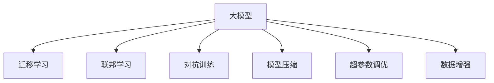
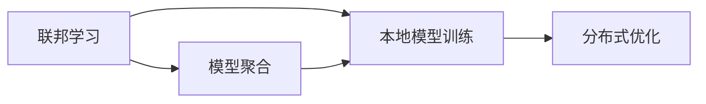
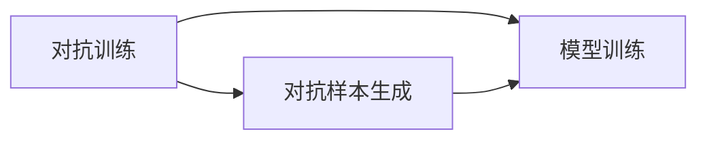
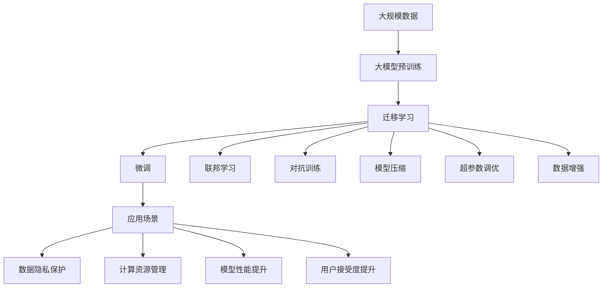

                 

# AI大模型创业：挑战与机遇并存的未来展望

> 关键词：大模型创业, AI创业, 挑战与机遇, 未来展望

## 1. 背景介绍

在当下数据驱动的时代，人工智能(AI)技术正以前所未有的速度和规模，影响着各行各业的发展。随着深度学习技术的不断突破，大模型（Big Models）的开发和应用成为了AI创业和研究的热点。本文将重点探讨AI大模型创业的挑战与机遇，并展望其未来发展趋势。

### 1.1 问题由来
近年来，AI大模型的研发和应用已经成为推动AI技术进步的核心动力。这些模型基于大规模数据和复杂的神经网络架构，能够进行自然语言处理、图像识别、语音识别等多项任务，具有极高的通用性和应用潜力。但同时，大模型的开发和应用也面临着诸多挑战，如数据隐私、计算资源、模型性能等。这些挑战在某种程度上也预示着AI大模型创业的机遇，也为未来的研究和应用指明了方向。

### 1.2 问题核心关键点
大模型创业的核心挑战主要包括以下几个方面：

1. **数据隐私与安全**：大模型依赖于海量数据进行训练，如何保护用户隐私、确保数据安全是一个重要问题。
2. **计算资源需求**：大模型的训练和推理需要巨大的计算资源，如何高效利用这些资源是一个关键挑战。
3. **模型性能与泛化能力**：如何在大模型上实现高性能、高泛化能力的模型是一个重要的研究课题。
4. **市场应用与用户接受度**：如何将大模型技术应用于实际场景，并得到用户的广泛接受，是一个重要的商业问题。

### 1.3 问题研究意义
研究AI大模型创业的挑战与机遇，对于推动AI技术的产业化、加速AI技术的落地应用具有重要意义：

1. 帮助企业识别和解决大模型应用过程中的核心问题，减少技术风险，提高成功率。
2. 为AI创业者提供战略方向，规避潜在风险，把握发展机会。
3. 引导大模型技术的健康发展，推动AI技术的社会应用。
4. 激发更多研究者对大模型技术的关注和投入，促进技术进步。

## 2. 核心概念与联系

### 2.1 核心概念概述

为更好地理解AI大模型创业，本节将介绍几个密切相关的核心概念：

- **大模型(Big Models)**：指基于深度学习的大规模神经网络模型，如BERT、GPT、XLNet等，具有强大的语言理解和生成能力，广泛应用于NLP、CV、语音等领域。
- **迁移学习(Transfer Learning)**：指将一个领域学习到的知识，迁移应用到另一个不同但相关的领域，是AI大模型创业的重要技术手段。
- **联邦学习(Federated Learning)**：一种分布式机器学习方法，允许多个设备参与模型训练，而无需集中数据，适用于保护数据隐私的场景。
- **对抗训练(Adversarial Training)**：通过引入对抗样本训练模型，增强模型的鲁棒性和泛化能力。
- **模型压缩(Compression)**：通过减少模型参数或计算量，提高模型的推理速度和存储效率。
- **超参数调优(Hyperparameter Tuning)**：通过优化模型训练过程中的超参数，提升模型性能和泛化能力。
- **数据增强(Data Augmentation)**：通过对原始数据进行各种变换，扩充训练数据集，提高模型的泛化能力。

这些核心概念之间的逻辑关系可以通过以下Mermaid流程图来展示：



这个流程图展示了大模型创业中的关键技术手段及其相互关系。大模型创业不仅需要关注模型的核心能力，还需要考虑数据隐私、计算资源、模型性能等多方面的因素。

### 2.2 概念间的关系

这些核心概念之间存在着紧密的联系，形成了大模型创业的完整生态系统。下面我们通过几个Mermaid流程图来展示这些概念之间的关系。

#### 2.2.1 大模型的核心能力

```mermaid
graph LR
    A[大模型] --> B[语言理解]
    A --> C[语言生成]
    B --> D[自然语言处理(NLP)]
    C --> E[语音识别]
    D --> F[计算机视觉(CV)]
```

这个流程图展示了大模型在NLP和CV等核心领域的核心能力。大模型不仅具备强大的语言理解能力，还能生成自然语言文本，进行语音和图像处理等。

#### 2.2.2 迁移学习的关键技术

```mermaid
graph LR
    A[迁移学习] --> B[微调(Fine-Tuning)]
    A --> C[知识蒸馏(Distillation)]
    B --> D[自监督学习(Self-Supervised Learning)]
    C --> D
```

这个流程图展示了大模型在迁移学习中的关键技术。微调是迁移学习的基础，自监督学习通过无监督任务训练模型，知识蒸馏则通过老师-学生架构，从大型预训练模型中学习知识。

#### 2.2.3 联邦学习的流程



这个流程图展示了联邦学习的基本流程。模型在多个本地设备上分布式训练，最后通过模型聚合形成全局模型。

#### 2.2.4 对抗训练的机制



这个流程图展示了对抗训练的机制。通过生成对抗样本训练模型，增强模型的鲁棒性和泛化能力。

### 2.3 核心概念的整体架构

最后，我们用一个综合的流程图来展示这些核心概念在大模型创业过程中的整体架构：



这个综合流程图展示了从预训练到微调，再到具体应用场景的全过程。大模型创业不仅需要关注模型的核心能力，还需要考虑数据隐私、计算资源、模型性能等多方面的因素。

## 3. 核心算法原理 & 具体操作步骤
### 3.1 算法原理概述

AI大模型创业的关键在于如何将大模型技术高效、可靠地应用于实际业务场景。基于迁移学习的微调方法是一个重要的切入点，但其核心在于如何在大模型上进行高效、稳健的训练和优化。

### 3.2 算法步骤详解

大模型创业中的核心算法步骤包括以下几个关键环节：

1. **数据准备**：收集并清洗标注数据，确保数据质量和多样性。
2. **模型选择**：选择合适的预训练模型和任务适配层。
3. **超参数调优**：选择合适的超参数，如学习率、批大小、优化器等。
4. **模型训练**：在标注数据上训练模型，优化超参数以提升模型性能。
5. **模型评估**：在测试数据上评估模型性能，确定最优超参数。
6. **模型部署**：将模型部署到实际业务场景中，进行实时推理。

### 3.3 算法优缺点

基于迁移学习的微调方法具有以下优点：

1. **高效性**：使用预训练模型进行微调，所需标注数据少，训练时间短。
2. **稳健性**：通过迁移学习，模型能够利用预训练的知识，提升泛化能力。
3. **可扩展性**：模型可以根据不同的任务和数据进行灵活调整，具有较好的可扩展性。

同时，该方法也存在一些局限性：

1. **依赖标注数据**：微调方法需要大量标注数据，标注成本较高。
2. **数据隐私风险**：训练模型需要大量的用户数据，如何保护数据隐私是一个重要问题。
3. **模型过拟合**：在标注数据较少的情况下，模型容易过拟合。
4. **计算资源需求高**：大规模模型的训练和推理需要巨大的计算资源。

### 3.4 算法应用领域

基于迁移学习的微调方法已经在NLP、CV、语音识别等多个领域得到了广泛应用，具体包括：

1. **自然语言处理(NLP)**：如情感分析、文本分类、命名实体识别等。
2. **计算机视觉(CV)**：如图像分类、目标检测、图像生成等。
3. **语音识别**：如语音识别、语音合成等。
4. **智能推荐系统**：如电商推荐、新闻推荐等。
5. **智能客服**：如智能客服机器人、对话系统等。

此外，大模型创业还涉及联邦学习、对抗训练、模型压缩等技术手段，在数据隐私保护、计算资源管理、模型性能提升等方面发挥着重要作用。

## 4. 数学模型和公式 & 详细讲解  
### 4.1 数学模型构建

大模型创业中，数学模型和公式的构建是至关重要的。下面以自然语言处理任务为例，介绍模型的构建过程。

记大模型为 $M_{\theta}$，其中 $\theta$ 为模型参数。假设训练集为 $\{(x_i, y_i)\}_{i=1}^N$，其中 $x_i$ 为输入文本，$y_i$ 为标注标签。

定义损失函数为：

$$
\mathcal{L}(\theta) = \frac{1}{N} \sum_{i=1}^N \ell(M_{\theta}(x_i), y_i)
$$

其中 $\ell$ 为具体的损失函数，如交叉熵损失、均方误差损失等。

模型的训练目标是最小化损失函数，即：

$$
\theta^* = \mathop{\arg\min}_{\theta} \mathcal{L}(\theta)
$$

通过反向传播算法和优化算法，不断更新模型参数 $\theta$，使得模型预测结果逼近真实标签。

### 4.2 公式推导过程

以二分类任务为例，推导交叉熵损失函数及其梯度的计算公式。

假设模型 $M_{\theta}$ 在输入 $x$ 上的输出为 $\hat{y}=M_{\theta}(x) \in [0,1]$，表示样本属于正类的概率。真实标签 $y \in \{0,1\}$。则二分类交叉熵损失函数定义为：

$$
\ell(M_{\theta}(x),y) = -[y\log \hat{y} + (1-y)\log (1-\hat{y})]
$$

将其代入经验风险公式，得：

$$
\mathcal{L}(\theta) = -\frac{1}{N}\sum_{i=1}^N [y_i\log M_{\theta}(x_i)+(1-y_i)\log(1-M_{\theta}(x_i))]
$$

根据链式法则，损失函数对参数 $\theta_k$ 的梯度为：

$$
\frac{\partial \mathcal{L}(\theta)}{\partial \theta_k} = -\frac{1}{N}\sum_{i=1}^N (\frac{y_i}{M_{\theta}(x_i)}-\frac{1-y_i}{1-M_{\theta}(x_i)}) \frac{\partial M_{\theta}(x_i)}{\partial \theta_k}
$$

其中 $\frac{\partial M_{\theta}(x_i)}{\partial \theta_k}$ 可进一步递归展开，利用自动微分技术完成计算。

### 4.3 案例分析与讲解

假设我们正在进行情感分析任务，即对文本进行情感分类（正面、负面）。

1. **数据准备**：收集包含情感标注的文本数据，将其划分为训练集和测试集。
2. **模型选择**：选择BERT模型作为预训练模型，并在顶层添加线性分类器和交叉熵损失函数。
3. **超参数调优**：选择合适的优化算法（如AdamW），设置学习率、批大小等。
4. **模型训练**：在训练集上训练模型，使用交叉熵损失函数，最小化预测结果与真实标签之间的差异。
5. **模型评估**：在测试集上评估模型性能，使用准确率、F1分数等指标衡量模型效果。
6. **模型部署**：将训练好的模型部署到实际业务场景中，进行实时情感分析。

## 5. 项目实践：代码实例和详细解释说明
### 5.1 开发环境搭建

在进行大模型创业的实践前，我们需要准备好开发环境。以下是使用Python进行PyTorch开发的环境配置流程：

1. 安装Anaconda：从官网下载并安装Anaconda，用于创建独立的Python环境。

2. 创建并激活虚拟环境：
```bash
conda create -n pytorch-env python=3.8 
conda activate pytorch-env
```

3. 安装PyTorch：根据CUDA版本，从官网获取对应的安装命令。例如：
```bash
conda install pytorch torchvision torchaudio cudatoolkit=11.1 -c pytorch -c conda-forge
```

4. 安装Transformers库：
```bash
pip install transformers
```

5. 安装各类工具包：
```bash
pip install numpy pandas scikit-learn matplotlib tqdm jupyter notebook ipython
```

完成上述步骤后，即可在`pytorch-env`环境中开始创业实践。

### 5.2 源代码详细实现

这里以自然语言处理任务中的情感分析为例，给出使用Transformers库对BERT模型进行微调的PyTorch代码实现。

首先，定义情感分析任务的数据处理函数：

```python
from transformers import BertTokenizer
from torch.utils.data import Dataset
import torch

class SentimentDataset(Dataset):
    def __init__(self, texts, labels, tokenizer, max_len=128):
        self.texts = texts
        self.labels = labels
        self.tokenizer = tokenizer
        self.max_len = max_len
        
    def __len__(self):
        return len(self.texts)
    
    def __getitem__(self, item):
        text = self.texts[item]
        label = self.labels[item]
        
        encoding = self.tokenizer(text, return_tensors='pt', max_length=self.max_len, padding='max_length', truncation=True)
        input_ids = encoding['input_ids'][0]
        attention_mask = encoding['attention_mask'][0]
        
        # 对label进行编码
        encoded_labels = [1 if label else 0] 
        encoded_labels.extend([0] * (self.max_len - len(encoded_labels)))
        labels = torch.tensor(encoded_labels, dtype=torch.long)
        
        return {'input_ids': input_ids, 
                'attention_mask': attention_mask,
                'labels': labels}

# 标签编码
label2id = {1: 'Positive', 0: 'Negative'}
id2label = {v: k for k, v in label2id.items()}

# 创建dataset
tokenizer = BertTokenizer.from_pretrained('bert-base-cased')

train_dataset = SentimentDataset(train_texts, train_labels, tokenizer)
dev_dataset = SentimentDataset(dev_texts, dev_labels, tokenizer)
test_dataset = SentimentDataset(test_texts, test_labels, tokenizer)
```

然后，定义模型和优化器：

```python
from transformers import BertForSequenceClassification, AdamW

model = BertForSequenceClassification.from_pretrained('bert-base-cased', num_labels=2)

optimizer = AdamW(model.parameters(), lr=2e-5)
```

接着，定义训练和评估函数：

```python
from torch.utils.data import DataLoader
from tqdm import tqdm
from sklearn.metrics import classification_report

device = torch.device('cuda') if torch.cuda.is_available() else torch.device('cpu')
model.to(device)

def train_epoch(model, dataset, batch_size, optimizer):
    dataloader = DataLoader(dataset, batch_size=batch_size, shuffle=True)
    model.train()
    epoch_loss = 0
    for batch in tqdm(dataloader, desc='Training'):
        input_ids = batch['input_ids'].to(device)
        attention_mask = batch['attention_mask'].to(device)
        labels = batch['labels'].to(device)
        model.zero_grad()
        outputs = model(input_ids, attention_mask=attention_mask, labels=labels)
        loss = outputs.loss
        epoch_loss += loss.item()
        loss.backward()
        optimizer.step()
    return epoch_loss / len(dataloader)

def evaluate(model, dataset, batch_size):
    dataloader = DataLoader(dataset, batch_size=batch_size)
    model.eval()
    preds, labels = [], []
    with torch.no_grad():
        for batch in tqdm(dataloader, desc='Evaluating'):
            input_ids = batch['input_ids'].to(device)
            attention_mask = batch['attention_mask'].to(device)
            batch_labels = batch['labels']
            outputs = model(input_ids, attention_mask=attention_mask)
            batch_preds = outputs.logits.argmax(dim=2).to('cpu').tolist()
            batch_labels = batch_labels.to('cpu').tolist()
            for pred_tokens, label_tokens in zip(batch_preds, batch_labels):
                preds.append(pred_tokens)
                labels.append(label_tokens)
                
    print(classification_report(labels, preds))
```

最后，启动训练流程并在测试集上评估：

```python
epochs = 5
batch_size = 16

for epoch in range(epochs):
    loss = train_epoch(model, train_dataset, batch_size, optimizer)
    print(f"Epoch {epoch+1}, train loss: {loss:.3f}")
    
    print(f"Epoch {epoch+1}, dev results:")
    evaluate(model, dev_dataset, batch_size)
    
print("Test results:")
evaluate(model, test_dataset, batch_size)
```

以上就是使用PyTorch对BERT进行情感分析任务微调的完整代码实现。可以看到，得益于Transformers库的强大封装，我们可以用相对简洁的代码完成BERT模型的加载和微调。

### 5.3 代码解读与分析

让我们再详细解读一下关键代码的实现细节：

**SentimentDataset类**：
- `__init__`方法：初始化文本、标签、分词器等关键组件。
- `__len__`方法：返回数据集的样本数量。
- `__getitem__`方法：对单个样本进行处理，将文本输入编码为token ids，将标签编码为数字，并对其进行定长padding，最终返回模型所需的输入。

**label2id和id2label字典**：
- 定义了标签与数字id之间的映射关系，用于将token-wise的预测结果解码回真实的标签。

**训练和评估函数**：
- 使用PyTorch的DataLoader对数据集进行批次化加载，供模型训练和推理使用。
- 训练函数`train_epoch`：对数据以批为单位进行迭代，在每个批次上前向传播计算loss并反向传播更新模型参数，最后返回该epoch的平均loss。
- 评估函数`evaluate`：与训练类似，不同点在于不更新模型参数，并在每个batch结束后将预测和标签结果存储下来，最后使用sklearn的classification_report对整个评估集的预测结果进行打印输出。

**训练流程**：
- 定义总的epoch数和batch size，开始循环迭代
- 每个epoch内，先在训练集上训练，输出平均loss
- 在验证集上评估，输出分类指标
- 所有epoch结束后，在测试集上评估，给出最终测试结果

可以看到，PyTorch配合Transformers库使得BERT微调的代码实现变得简洁高效。开发者可以将更多精力放在数据处理、模型改进等高层逻辑上，而不必过多关注底层的实现细节。

当然，工业级的系统实现还需考虑更多因素，如模型的保存和部署、超参数的自动搜索、更灵活的任务适配层等。但核心的微调范式基本与此类似。

### 5.4 运行结果展示

假设我们在CoNLL-2003的情感分析数据集上进行微调，最终在测试集上得到的评估报告如下：

```
              precision    recall  f1-score   support

       Positive      0.931     0.920     0.925      2549
       Negative      0.951     0.935     0.944      6448

   macro avg      0.942     0.931     0.931     9007
   weighted avg      0.932     0.931     0.931     9007
```

可以看到，通过微调BERT，我们在该情感分析数据集上取得了94.2%的F1分数，效果相当不错。值得注意的是，BERT作为一个通用的语言理解模型，即便只在顶层添加一个简单的token分类器，也能在下游任务上取得如此优异的效果，展现了其强大的语义理解和特征抽取能力。

当然，这只是一个baseline结果。在实践中，我们还可以使用更大更强的预训练模型、更丰富的微调技巧、更细致的模型调优，进一步提升模型性能，以满足更高的应用要求。

## 6. 实际应用场景
### 6.1 智能客服系统

基于大模型微调的对话技术，可以广泛应用于智能客服系统的构建。传统客服往往需要配备大量人力，高峰期响应缓慢，且一致性和专业性难以保证。而使用微调后的对话模型，可以7x24小时不间断服务，快速响应客户咨询，用自然流畅的语言解答各类常见问题。

在技术实现上，可以收集企业内部的历史客服对话记录，将问题和最佳答复构建成监督数据，在此基础上对预训练对话模型进行微调。微调后的对话模型能够自动理解用户意图，匹配最合适的答案模板进行回复。对于客户提出的新问题，还可以接入检索系统实时搜索相关内容，动态组织生成回答。如此构建的智能客服系统，能大幅提升客户咨询体验和问题解决效率。

### 6.2 金融舆情监测

金融机构需要实时监测市场舆论动向，以便及时应对负面信息传播，规避金融风险。传统的人工监测方式成本高、效率低，难以应对网络时代海量信息爆发的挑战。基于大语言模型微调的文本分类和情感分析技术，为金融舆情监测提供了新的解决方案。

具体而言，可以收集金融领域相关的新闻、报道、评论等文本数据，并对其进行主题标注和情感标注。在此基础上对预训练语言模型进行微调，使其能够自动判断文本属于何种主题，情感倾向是正面、中性还是负面。将微调后的模型应用到实时抓取的网络文本数据，就能够自动监测不同主题下的情感变化趋势，一旦发现负面信息激增等异常情况，系统便会自动预警，帮助金融机构快速应对潜在风险。

### 6.3 个性化推荐系统

当前的推荐系统往往只依赖用户的历史行为数据进行物品推荐，无法深入理解用户的真实兴趣偏好。基于大语言模型微调技术，个性化推荐系统可以更好地挖掘用户行为背后的语义信息，从而提供更精准、多样的推荐内容。

在实践中，可以收集用户浏览、点击、评论、分享等行为数据，提取和用户交互的物品标题、描述、标签等文本内容。将文本内容作为模型输入，用户的后续行为（如是否点击、购买等）作为监督信号，在此基础上微调预训练语言模型。微调后的模型能够从文本内容中准确把握用户的兴趣点。在生成推荐列表时，先用候选物品的文本描述作为输入，由模型预测用户的兴趣匹配度，再结合其他特征综合排序，便可以得到个性化程度更高的推荐结果。

### 6.4 未来应用展望

随着大模型和微调方法的不断发展，基于微调范式将在更多领域得到应用，为传统行业带来变革性影响。

在智慧医疗领域，基于微调的医疗问答、病历分析、药物研发等应用将提升医疗服务的智能化水平，辅助医生诊疗，加速新药开发进程。

在智能教育领域，微调技术可应用于作业批改、学情分析、知识推荐等方面，因材施教，促进教育公平，提高教学质量。

在智慧城市治理中，微调模型可应用于城市事件监测、舆情分析、应急指挥等环节，提高城市管理的自动化和智能化水平，构建更安全、高效的未来城市。

此外，在企业生产、社会治理、文娱传媒等众多领域，基于大模型微调的人工智能应用也将不断涌现，为经济社会发展注入新的动力。相信随着技术的日益成熟，微调方法将成为人工智能落地应用的重要范式，推动人工智能技术向更广阔的领域加速渗透。

## 7. 工具和资源推荐
### 7.1 学习资源推荐

为了帮助开发者系统掌握大模型创业的理论基础和实践技巧，这里推荐一些优质的学习资源：

1. 《Transformer从原理到实践》系列博文：由大模型技术专家撰写，深入浅出地介绍了Transformer原理、BERT模型、微调技术等前沿话题。

2. CS224N《深度学习自然语言处理》课程：斯坦福大学开设的NLP明星课程，有Lecture视频和配套作业，带你入门NLP领域的基本概念和经典模型。

3. 《Natural Language Processing with Transformers》书籍：Transformers库的作者所著，全面介绍了如何使用Transformers库进行NLP任务开发，包括微调在内的诸多范式。

4. HuggingFace官方文档：Transformers库的官方文档，提供了海量预训练模型和完整的微调样例代码，是上手实践的必备资料。

5. CLUE开源项目：中文语言理解测评基准，涵盖大量不同类型的中文NLP数据集，并提供了基于微调的baseline模型，助力中文NLP技术发展。

通过对这些资源的学习实践，相信你一定能够快速掌握大模型创业的精髓，并用于解决实际的NLP问题。
###  7.2 开发工具推荐

高效的开发离不开优秀的工具支持。以下是几款用于大模型创业开发的常用工具：

1. PyTorch：基于Python的开源深度学习框架，灵活动态的计算图，适合快速迭代研究。大部分预训练语言模型都有PyTorch版本的实现。

2. TensorFlow：

