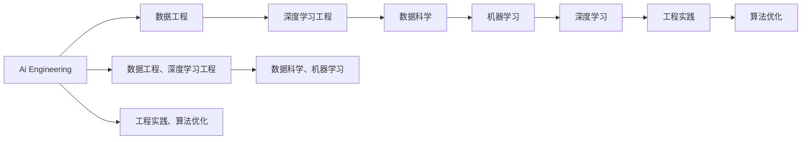
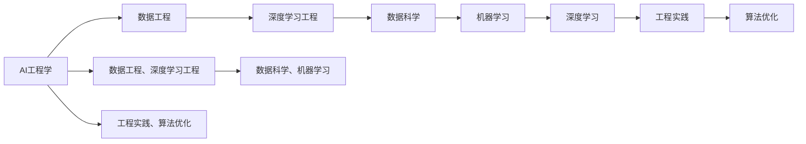
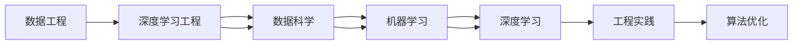
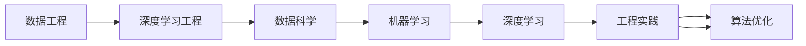
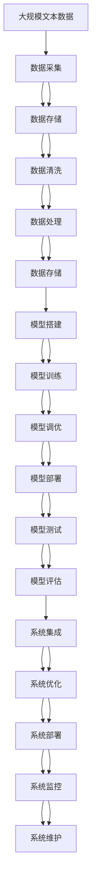

                 

# AI工程学：从理论到实战

> 关键词：AI工程学,理论到实践,数据工程,深度学习工程,数据科学,机器学习,深度学习,工程实践,算法优化

## 1. 背景介绍

### 1.1 问题由来
随着人工智能(AI)技术的迅猛发展，其应用范围已经从单一的科学研究延伸到各行各业。从自然语言处理、计算机视觉，到自动驾驶、智能推荐，AI正在重新定义我们生活的方方面面。然而，在AI应用从实验室走向实际场景的过程中，工程实践的挑战日益突出。

### 1.2 问题核心关键点
AI工程学，即如何从理论到实战，将先进的研究成果转化为可靠、高效、可扩展的工程系统，是当前AI研究与产业界共同关注的核心问题。核心挑战包括：

1. **数据工程**：如何高效获取、存储、清洗、处理大规模数据，以保证模型的训练质量和工程效率。
2. **深度学习工程**：如何高效搭建、训练、调优深度学习模型，以提升模型性能和工程稳定性。
3. **数据科学**：如何将统计学、机器学习、数据可视化等方法综合应用于数据分析和模型评估，以提取数据中的关键信息。
4. **机器学习**：如何在实际应用中合理选择算法，平衡模型的复杂度和泛化能力。
5. **深度学习**：如何在保证性能的同时，优化模型的计算图和推理效率，降低资源消耗。
6. **工程实践**：如何将算法、数据、系统、业务进行有效结合，构建稳定、可扩展的AI应用系统。
7. **算法优化**：如何设计优化算法，提升模型训练和推理速度，适应实时性要求。

这些问题不仅涉及技术层面的挑战，还涉及组织管理、团队协作、项目进度的综合管理。因此，AI工程学已经成为构建高效、可扩展AI系统的核心，对于AI技术的落地应用具有重要意义。

### 1.3 问题研究意义
研究AI工程学，对于推动AI技术的产业化进程，加速各行各业数字化转型，具有重要意义：

1. **降低研发成本**：通过工程化的方法，加速AI技术的迭代和落地，减少研发周期和成本。
2. **提升模型性能**：通过系统化的工程实践，优化模型结构，提升模型训练和推理效率，提高模型性能。
3. **增强应用可靠性**：通过工程管理，保证AI系统的稳定性、可扩展性和可维护性，减少系统故障和维护成本。
4. **加速产业升级**：AI工程学为传统行业带来了新的技术路径，推动行业向智能化、自动化升级。
5. **赋能创新发展**：工程化的方法有助于更好地应用AI技术，推动行业内的技术创新和商业模式创新。

本文将全面系统地介绍AI工程学的核心概念和实践方法，帮助读者从理论到实战，构建高效、可扩展的AI应用系统。

## 2. 核心概念与联系

### 2.1 核心概念概述

为更好地理解AI工程学的核心概念，本节将介绍几个密切相关的核心概念：

- **AI工程学(AI Engineering)**：涵盖了数据工程、深度学习工程、数据科学、机器学习、深度学习等多个方面，是将AI技术应用于工程实践的综合方法。
- **数据工程(Data Engineering)**：涉及数据的采集、存储、清洗、处理等环节，保证数据质量，支撑模型训练。
- **深度学习工程(Deep Learning Engineering)**：涉及深度学习模型的搭建、训练、调优、部署等环节，保证模型性能和稳定性。
- **数据科学(Data Science)**：涉及数据分析、数据可视化、机器学习模型评估等，提取数据中的关键信息。
- **机器学习(Machine Learning)**：涉及算法选择、特征工程、模型训练等，保证模型的泛化能力和性能。
- **深度学习(Deep Learning)**：涉及深度神经网络架构、优化算法、推理加速等，优化模型的计算图和推理效率。
- **工程实践(Engineering Practice)**：涉及系统设计、项目管理、团队协作等，保证AI系统的高效、可扩展和可维护。
- **算法优化(Algorithm Optimization)**：涉及优化算法的设计和应用，提升模型训练和推理速度，适应实时性要求。

这些核心概念之间的逻辑关系可以通过以下Mermaid流程图来展示：



这个流程图展示了大语言模型的核心概念及其之间的关系：

1. 数据工程是AI工程的基础，通过数据采集、处理和存储，保证数据质量，为后续的模型训练提供数据支撑。
2. 深度学习工程涉及模型的搭建、训练和调优，优化模型性能，增强模型的泛化能力。
3. 数据科学通过数据分析和模型评估，提取数据中的关键信息，指导模型设计和优化。
4. 机器学习涉及算法选择和特征工程，构建高性能的机器学习模型。
5. 深度学习涉及深度神经网络架构、优化算法等，优化模型的计算图和推理效率。
6. 工程实践涉及系统设计、项目管理、团队协作等，保证AI系统的稳定性和可扩展性。
7. 算法优化涉及优化算法的设计和应用，提升模型训练和推理速度，适应实时性要求。

这些概念共同构成了AI工程学的学习框架，使开发者能够更好地理解AI技术的工程实践过程，为构建高效、可扩展的AI应用系统奠定基础。

### 2.2 概念间的关系

这些核心概念之间存在着紧密的联系，形成了AI工程学的完整生态系统。下面我通过几个Mermaid流程图来展示这些概念之间的关系。

#### 2.2.1 AI工程学的核心架构



这个流程图展示了大语言模型的核心概念及其之间的关系：

1. AI工程学是一个综合性的工程实践框架，涵盖了数据工程、深度学习工程、数据科学、机器学习、深度学习、工程实践、算法优化等多个方面。
2. 数据工程是AI工程的基础，通过数据采集、处理和存储，保证数据质量，为后续的模型训练提供数据支撑。
3. 深度学习工程涉及模型的搭建、训练和调优，优化模型性能，增强模型的泛化能力。
4. 数据科学通过数据分析和模型评估，提取数据中的关键信息，指导模型设计和优化。
5. 机器学习涉及算法选择和特征工程，构建高性能的机器学习模型。
6. 深度学习涉及深度神经网络架构、优化算法等，优化模型的计算图和推理效率。
7. 工程实践涉及系统设计、项目管理、团队协作等，保证AI系统的稳定性和可扩展性。
8. 算法优化涉及优化算法的设计和应用，提升模型训练和推理速度，适应实时性要求。

#### 2.2.2 数据工程与深度学习工程的关系



这个流程图展示了大语言模型的核心概念及其之间的关系：

1. 数据工程是深度学习工程的基础，通过数据采集、处理和存储，保证数据质量，为后续的模型训练提供数据支撑。
2. 深度学习工程涉及模型的搭建、训练和调优，优化模型性能，增强模型的泛化能力。
3. 数据科学通过数据分析和模型评估，提取数据中的关键信息，指导模型设计和优化。
4. 机器学习涉及算法选择和特征工程，构建高性能的机器学习模型。
5. 深度学习涉及深度神经网络架构、优化算法等，优化模型的计算图和推理效率。
6. 工程实践涉及系统设计、项目管理、团队协作等，保证AI系统的稳定性和可扩展性。
7. 算法优化涉及优化算法的设计和应用，提升模型训练和推理速度，适应实时性要求。

#### 2.2.3 工程实践与算法优化的关系



这个流程图展示了大语言模型的核心概念及其之间的关系：

1. 数据工程是深度学习工程的基础，通过数据采集、处理和存储，保证数据质量，为后续的模型训练提供数据支撑。
2. 深度学习工程涉及模型的搭建、训练和调优，优化模型性能，增强模型的泛化能力。
3. 数据科学通过数据分析和模型评估，提取数据中的关键信息，指导模型设计和优化。
4. 机器学习涉及算法选择和特征工程，构建高性能的机器学习模型。
5. 深度学习涉及深度神经网络架构、优化算法等，优化模型的计算图和推理效率。
6. 工程实践涉及系统设计、项目管理、团队协作等，保证AI系统的稳定性和可扩展性。
7. 算法优化涉及优化算法的设计和应用，提升模型训练和推理速度，适应实时性要求。

### 2.3 核心概念的整体架构

最后，我们用一个综合的流程图来展示这些核心概念在大语言模型工程实践中的整体架构：



这个综合流程图展示了从数据工程到模型训练，再到系统部署的完整过程。数据工程通过数据采集、存储、清洗、处理等环节，保证数据质量，为后续的模型训练提供数据支撑。深度学习工程涉及模型的搭建、训练和调优，优化模型性能，增强模型的泛化能力。数据科学通过数据分析和模型评估，提取数据中的关键信息，指导模型设计和优化。机器学习涉及算法选择和特征工程，构建高性能的机器学习模型。深度学习涉及深度神经网络架构、优化算法等，优化模型的计算图和推理效率。工程实践涉及系统设计、项目管理、团队协作等，保证AI系统的稳定性和可扩展性。算法优化涉及优化算法的设计和应用，提升模型训练和推理速度，适应实时性要求。通过这些环节的协同工作，构建高效、可扩展的AI应用系统。

## 3. 核心算法原理 & 具体操作步骤
### 3.1 算法原理概述

AI工程学的核心算法原理涉及数据工程、深度学习工程、数据科学、机器学习、深度学习等多个方面。以下将系统地介绍这些核心算法原理，并详细讲解具体的操作步骤。

### 3.2 算法步骤详解

#### 3.2.1 数据工程

**数据采集**：
- 数据来源：通过爬虫、API接口、数据库导出等方式获取数据。
- 数据格式：处理不同格式的数据，如CSV、JSON、XML、数据库表等。
- 数据质量：数据清洗和去重，确保数据质量。

**数据存储**：
- 数据库：选择适合的数据库系统，如关系型数据库MySQL、NoSQL数据库MongoDB等。
- 数据分区：按照时间、主题等方式分区，提高查询效率。
- 数据备份：定期备份数据，确保数据安全。

**数据清洗**：
- 缺失值处理：填充缺失值，或删除含有缺失值的记录。
- 异常值检测：检测并处理异常值，确保数据准确性。
- 数据格式转换：将不同格式的数据转换为统一格式。

**数据处理**：
- 数据预处理：数据标准化、归一化、特征工程等。
- 数据增量处理：实时处理新数据，更新模型训练数据。
- 数据分布式处理：使用分布式计算框架（如Hadoop、Spark等），处理大规模数据。

#### 3.2.2 深度学习工程

**模型搭建**：
- 选择模型架构：根据任务选择合适的模型架构，如CNN、RNN、LSTM、Transformer等。
- 初始化参数：设置模型的初始参数，如权重、偏置等。
- 搭建网络结构：按照选择的模型架构搭建网络结构，定义各层的参数和计算图。

**模型训练**：
- 定义损失函数：根据任务选择适当的损失函数，如交叉熵、均方误差等。
- 优化器选择：选择适合的优化器，如SGD、Adam、Adagrad等。
- 学习率设置：设置合适的学习率，保证模型收敛。

**模型调优**：
- 超参数调整：调整模型的超参数，如学习率、批次大小、迭代轮数等。
- 正则化技术：使用L2正则、Dropout、Early Stopping等技术，防止过拟合。
- 数据增强：通过数据增强技术，提高模型泛化能力。

**模型评估**：
- 划分训练集和验证集：将数据划分为训练集和验证集，评估模型性能。
- 模型测试：在测试集上测试模型，评估模型泛化能力。
- 模型对比：比较不同模型的性能，选择最佳模型。

#### 3.2.3 数据科学

**数据分析**：
- 数据探索：通过统计分析、数据可视化等方法，探索数据特征。
- 数据建模：构建数据模型，提取关键信息。
- 数据可视化：使用图表、图形等方式，展示数据结果。

**模型评估**：
- 模型选择：根据任务选择合适的机器学习模型，如线性回归、逻辑回归、决策树等。
- 特征选择：选择关键特征，构建特征集合。
- 模型训练：使用训练集训练模型，优化模型参数。
- 模型测试：在测试集上测试模型，评估模型性能。
- 模型对比：比较不同模型的性能，选择最佳模型。

#### 3.2.4 机器学习

**算法选择**：
- 分类算法：选择适当的分类算法，如KNN、SVM、随机森林等。
- 回归算法：选择适当的回归算法，如线性回归、岭回归、Lasso回归等。
- 聚类算法：选择适当的聚类算法，如K-Means、DBSCAN等。

**特征工程**：
- 特征选择：选择关键特征，构建特征集合。
- 特征提取：通过文本分析、图像处理等方式，提取特征。
- 特征降维：使用PCA、LDA等方法，降维特征空间。

**模型训练**：
- 数据预处理：数据标准化、归一化、特征工程等。
- 模型训练：使用训练集训练模型，优化模型参数。
- 模型测试：在测试集上测试模型，评估模型性能。
- 模型调优：调整模型超参数，提高模型性能。

#### 3.2.5 深度学习

**网络架构**：
- 选择模型架构：根据任务选择合适的深度神经网络架构，如CNN、RNN、LSTM、Transformer等。
- 网络设计：设计网络的输入输出、隐藏层、激活函数等。

**优化算法**：
- 优化器选择：选择适合的优化器，如SGD、Adam、Adagrad等。
- 学习率设置：设置合适的学习率，保证模型收敛。
- 正则化技术：使用L2正则、Dropout、Early Stopping等技术，防止过拟合。

**推理加速**：
- 模型剪枝：通过剪枝技术，减少模型参数，提高推理速度。
- 量化加速：将浮点模型转为定点模型，压缩存储空间，提高计算效率。
- 模型并行：使用模型并行技术，提高计算效率。

#### 3.2.6 工程实践

**系统设计**：
- 设计系统架构：设计系统的各个组件，如数据源、模型训练、推理服务等。
- 定义API接口：定义系统API接口，提供服务调用。
- 系统集成：将各个组件集成在一起，形成完整的系统。

**项目管理**：
- 需求分析：明确项目需求，制定项目计划。
- 任务分配：将项目任务分配给团队成员。
- 进度跟踪：跟踪项目进度，及时调整计划。

**团队协作**：
- 代码版本管理：使用版本控制系统，管理代码变更。
- 文档管理：编写和维护系统文档，方便团队协作。
- 代码审查：进行代码审查，确保代码质量。

**系统优化**：
- 性能优化：优化系统性能，提升系统响应速度。
- 可扩展性：设计可扩展的系统架构，支持系统扩展。
- 安全性：保障系统的安全性，防止攻击和数据泄露。

#### 3.2.7 算法优化

**优化算法**：
- 梯度下降：使用梯度下降算法，优化模型参数。
- 正则化技术：使用L2正则、Dropout、Early Stopping等技术，防止过拟合。
- 随机梯度下降：使用随机梯度下降算法，加速模型训练。
- 自适应学习率：使用自适应学习率算法，提高模型收敛速度。

**推理加速**：
- 模型剪枝：通过剪枝技术，减少模型参数，提高推理速度。
- 量化加速：将浮点模型转为定点模型，压缩存储空间，提高计算效率。
- 模型并行：使用模型并行技术，提高计算效率。

## 4. 数学模型和公式 & 详细讲解 & 举例说明

### 4.1 数学模型构建

以下我们将使用数学语言对AI工程学的核心算法原理进行更加严格的刻画。

**数据采集**：
设数据集为 $D=\{(x_i,y_i)\}_{i=1}^N, x_i \in \mathcal{X}, y_i \in \mathcal{Y}$，其中 $\mathcal{X}$ 为输入空间，$\mathcal{Y}$ 为输出空间。通过数据采集系统，从原始数据集中获取数据 $x_i$ 和标签 $y_i$。

**数据存储**：
使用数据库系统存储数据，如关系型数据库MySQL、NoSQL数据库MongoDB等。设存储后的数据为 $\{x_i,y_i\}_{i=1}^N$。

**数据清洗**：
设数据清洗后的数据为 $\tilde{x_i},\tilde{y_i}$。数据清洗主要包括缺失值处理、异常值检测、数据格式转换等。

**数据处理**：
设数据处理后的数据为 $x_i,y_i$。数据处理主要包括数据标准化、归一化、特征工程等。

**模型搭建**：
设模型为 $M_{\theta}$，其中 $\theta$ 为模型参数。选择合适的模型架构，如CNN、RNN、LSTM、Transformer等。

**模型训练**：
设损失函数为 $\mathcal{L}(\theta)$，优化器为 $\mathcal{O}$。训练模型 $M_{\theta}$ 的过程为：
$$
\theta \leftarrow \mathcal{O}(\mathcal{L}(\theta))
$$

**模型调优**：
设模型调优后的模型为 $M_{\hat{\theta}}$。模型调优主要包括超参数调整、正则化技术、数据增强等。

**模型评估**：
设模型评估后的性能为 $P$。模型评估主要包括划分训练集和验证集、模型测试、模型对比等。

### 4.2 公式推导过程

以下我们以深度学习模型为例，推导其核心算法原理的公式。

**模型搭建**：
设模型为 $M_{\theta}$，其中 $\theta$ 为模型参数。选择的模型架构为 $M_{\theta} = f(\theta_1,\theta_2,\dots,\theta_n)$，其中 $\theta_i$ 为第 $i$ 层的参数。

**模型训练**：
设损失函数为 $\mathcal{L}(\theta)$，优化器为 $\mathcal{O}$。训练模型 $M_{\theta}$ 的过程为：
$$
\theta \leftarrow \mathcal{O}(\mathcal{L}(\theta))
$$
其中 $\mathcal{O}(\mathcal{L}(\theta))$ 为损失函数 $\mathcal{L}(\theta)$ 对模型参数 $\theta$ 的优化过程。

**模型调优**：
设模型调优后的模型为 $M_{\hat{\theta}}$。模型调优主要包括超参数调整、正则化技术、数据增强等。调优过程为：
$$
\hat{\theta} = \mathop{\arg\min}_{\theta} \mathcal{L}(M_{\theta},D)
$$

**模型评估**：
设模型评估后的性能为 $P$。模型评估主要包括划分训练集和验证集、模型测试、模型对比等。评估过程为：
$$
P = \mathcal{P}(D,M_{\hat{\theta}})
$$
其中 $\mathcal{P}(D,M_{\hat{\theta}})$ 为模型 $M_{\hat{\theta}}$ 在数据集 $D$ 上的性能评估。

### 4.3 案例分析与讲解

**数据工程案例**：
设数据采集系统从原始数据集中获取数据 $x_i,y_i$，存储在MySQL数据库中。数据清洗过程包括缺失值处理、异常值检测、数据格式转换等。数据处理过程包括数据标准化、归一化、特征工程等。

**深度学习工程案例**：
设选择的深度神经网络架构为CNN，模型参数为 $\theta$。训练过程包括定义损失函数 $\mathcal{L}(\theta)$、优化器 $\mathcal{O}$ 和超参数设置。调优过程包括正则化技术、数据增强等。

**数据科学案例**：
设选择的机器学习算法为线性回归，模型参数为 $\theta$。训练过程包括数据标准化、模型训练、模型测试等。评估过程包括模型选择、特征选择、模型对比等。

**机器学习案例**：
设选择的深度神经网络架构为CNN，模型参数为 $\theta$。训练过程包括模型搭建、模型训练、模型调优等。评估过程包括划分训练集和验证集、模型测试、模型对比等。

**深度学习案例**：
设选择的深度神经网络架构为CNN，模型参数为 $\theta$。训练过程包括模型搭建、模型训练、模型调优等。调优过程包括梯度下降、正则化技术、随机梯度下降等。推理加速过程包括模型剪枝、量化加速、模型并行等。

**工程实践案例**：
设系统架构设计包括数据源、模型训练、推理服务等。项目管理过程包括需求分析、任务分配、进度跟踪等。团队协作过程包括代码版本管理、文档管理、代码审查等。系统优化过程包括性能优化、可扩展性设计、安全性保障等。

**算法优化案例**：
设优化算法为梯度下降，正则化技术为L2正则。模型调优过程包括超参数调整、正则化技术、数据增强等。推理加速过程包括模型剪枝、量化加速、模型并行等。

## 5. 项目实践：代码实例和详细解释说明

### 5.1 开发环境搭建

在进行AI工程学实践前，我们需要准备好开发环境。以下是使用Python进行PyTorch开发的环境配置流程：

1. 安装Anaconda：从官网下载并安装Anaconda，用于创建独立的Python环境。

2. 创建并激活虚拟环境：
```bash
conda create -n pytorch-env python=3.8 
conda activate pytorch-env
```

3. 安装PyTorch：根据CUDA版本，从官网获取对应的安装命令。例如：
```bash
conda install pytorch torchvision torchaudio cudatoolkit=11.1 -c pytorch -c conda-forge
```

4. 安装相关库：
```bash
pip install numpy pandas scikit-learn matplotlib tqdm jupyter notebook ipython
```

完成上述步骤后，即可在`pytorch-env`环境中开始AI工程学实践。

### 5.2 源代码详细实现

下面我们以图像分类任务为例，给出使用PyTorch对ResNet模型进行工程实践的PyTorch代码实现。

首先，定义数据处理函数：

```python
from torchvision import datasets, transforms
from torch.utils.data import DataLoader

# 定义数据转换操作
data_transform = transforms.Compose([
    transforms.Resize(224),
    transforms.CenterCrop(224),
    transforms.ToTensor(),
    transforms.Normalize(mean=[0.485, 0.456, 0.406], std=[0.229, 0.224, 0.225])
])

# 加载数据集
train_dataset = datasets.CIFAR10(root='data', train=True, download=True, transform=data_transform)
test_dataset = datasets.CIFAR10(root='data', train=False, download=True, transform=data_transform)

# 创建数据加载器
train_loader = DataLoader(train_dataset, batch_size=128, shuffle=True, num_workers=4)
test_loader = DataLoader(test_dataset, batch_size=128, shuffle=False, num_workers=4)
```

然后，定义模型和优化器：

```python
from torchvision.models import

