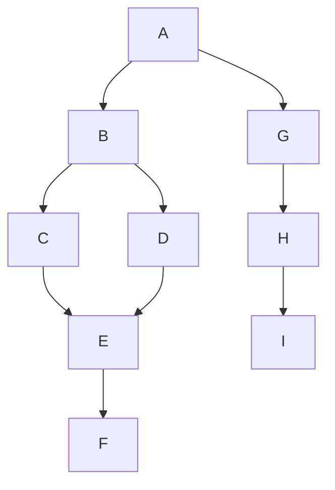
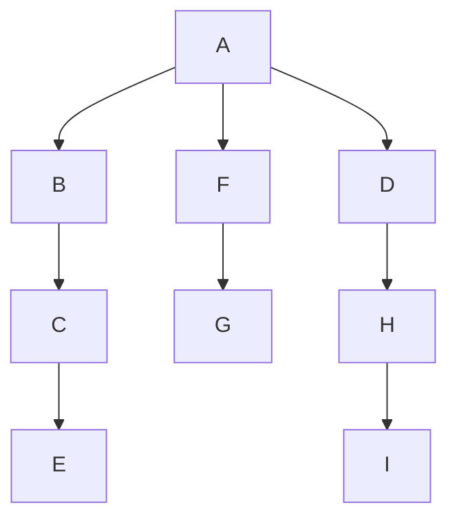
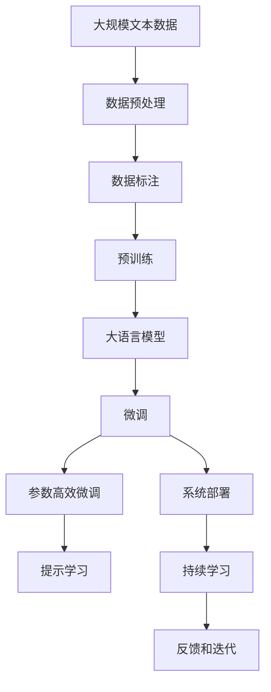

                 

# AI工程学：开发实战手册

## 1. 背景介绍

### 1.1 问题由来
在人工智能(AI)领域，从理论研究到实际应用，从模型开发到系统部署，每一个环节都需要工程师的参与和实践。AI工程学(AI Engineering)正是这一过程的集中体现，它综合了算法、系统、数据、业务等各方面内容，以构建高效、可维护、可扩展的AI系统。本文将深入探讨AI工程学的核心概念、关键技术和实践方法，旨在为读者提供系统全面的开发实战手册。

### 1.2 问题核心关键点
AI工程学的核心问题在于如何将算法理论与实际应用场景相结合，构建高效、可维护、可扩展的AI系统。这涉及以下几个关键点：
- 数据管理：如何收集、存储、处理、清洗和利用数据，是AI系统成功的基石。
- 模型开发：如何选择合适的算法和框架，进行模型的训练、验证和调优。
- 系统部署：如何将模型部署到生产环境，实现高效、可靠、可扩展的系统架构。
- 持续改进：如何通过迭代优化和持续学习，不断提高AI系统的性能和适用性。

### 1.3 问题研究意义
研究AI工程学，对于推动AI技术的产业化应用，加速行业数字化转型，具有重要意义：

1. 降低开发成本。AI工程学强调系统化、模块化开发，降低从头开发所需的时间和人力成本。
2. 提升系统性能。通过科学的数据管理、模型调优和系统架构设计，显著提高AI系统的准确性和鲁棒性。
3. 加速应用落地。AI工程学提供系统构建的科学方法，助力AI技术更快地被各行各业采用。
4. 促进技术创新。工程实践中的积累和经验，为理论研究提供坚实基础，推动AI技术不断突破。
5. 保障系统安全。AI工程学注重系统架构和数据安全，防止模型滥用和数据泄露，确保AI应用的安全可靠。

## 2. 核心概念与联系

### 2.1 核心概念概述

为更好地理解AI工程学的核心概念，本节将介绍几个密切相关的核心概念：

- AI系统(AI System)：由数据、算法、模型、系统、业务等组件组成的综合体，用于解决特定问题或提供服务。
- 数据预处理(Preprocessing)：对原始数据进行清洗、归一化、转换等处理，提高数据质量。
- 模型训练(Training)：使用标注数据，通过优化算法训练模型，学习数据规律和特征表示。
- 模型调优(Tuning)：调整模型参数和结构，优化模型性能，提高泛化能力和鲁棒性。
- 系统架构(Architecture)：AI系统的网络结构、组件配置和交互方式，影响系统的可扩展性和性能。
- 持续学习(Continual Learning)：模型在实际应用中，不断从新数据中学习，保持知识和性能的持续更新。

这些核心概念之间存在着紧密的联系，形成了AI工程学的完整生态系统。下面我通过Mermaid流程图来展示这些概念之间的关系：



这个流程图展示了大语言模型的核心概念及其之间的关系：

1. 数据预处理和模型训练：原始数据通过预处理获得高质量输入，模型通过训练学习数据规律。
2. 模型调优和系统架构：通过调优优化模型性能，通过架构设计实现系统的可扩展性和可靠性。
3. 持续学习和反馈机制：模型在实际应用中不断学习新数据，更新知识，通过反馈机制调整模型和系统。

### 2.2 概念间的关系

这些核心概念之间存在着紧密的联系，形成了AI工程学的完整生态系统。下面我通过几个Mermaid流程图来展示这些概念之间的关系。

#### 2.2.1 AI系统的学习范式



这个流程图展示了AI系统的基本学习范式：

1. 数据预处理和模型训练：数据经过预处理获得高质量输入，模型通过训练学习数据规律。
2. 模型调优和系统架构：通过调优优化模型性能，通过架构设计实现系统的可扩展性和可靠性。
3. 持续学习和反馈机制：模型在实际应用中不断学习新数据，更新知识，通过反馈机制调整模型和系统。

#### 2.2.2 AI工程学的生命周期


这个流程图展示了AI工程学的生命周期：

1. 需求分析：明确业务需求，确定系统目标。
2. 数据收集：收集、整理、清洗数据，提供模型训练的基础。
3. 数据预处理：对原始数据进行清洗、归一化、转换等处理，提高数据质量。
4. 模型选择：选择合适的算法和框架，构建模型。
5. 模型训练：使用标注数据，通过优化算法训练模型，学习数据规律和特征表示。
6. 模型调优：调整模型参数和结构，优化模型性能，提高泛化能力和鲁棒性。
7. 系统部署：将模型部署到生产环境，实现高效、可靠、可扩展的系统架构。
8. 持续学习：模型在实际应用中不断学习新数据，更新知识，通过反馈机制调整模型和系统。

### 2.3 核心概念的整体架构

最后，我用一个综合的流程图来展示这些核心概念在大语言模型微调过程中的整体架构：



这个综合流程图展示了从预训练到微调，再到持续学习的完整过程：

1. 数据预处理和标注：收集大规模文本数据，进行清洗、分词、标注等工作，为预训练和微调提供数据支持。
2. 预训练：在大规模无标签文本语料上进行自监督学习任务训练通用语言模型，学习通用语言表示。
3. 大语言模型：基于预训练模型构建大语言模型，具备强大的语言理解和生成能力。
4. 微调：对大语言模型进行任务特定的优化，通过有监督地训练来优化模型在特定任务上的性能。
5. 参数高效微调：在微调过程中，只更新少量的模型参数，避免过拟合。
6. 提示学习：通过在输入文本中添加提示模板，引导大语言模型进行特定任务的推理和生成，减少微调参数。
7. 系统部署：将微调后的模型部署到生产环境，实现高效、可靠、可扩展的系统架构。
8. 持续学习：模型在实际应用中不断学习新数据，更新知识，通过反馈机制调整模型和系统。

这些概念共同构成了AI工程学的学习和应用框架，使得AI模型能够更好地适应特定任务，提升系统性能和应用范围。

## 3. 核心算法原理 & 具体操作步骤
### 3.1 算法原理概述

AI工程学的核心算法原理主要围绕数据管理、模型开发和系统部署展开，包括以下几个方面：

- 数据预处理：对原始数据进行清洗、归一化、转换等处理，提高数据质量。
- 模型训练：使用标注数据，通过优化算法训练模型，学习数据规律和特征表示。
- 模型调优：调整模型参数和结构，优化模型性能，提高泛化能力和鲁棒性。
- 系统部署：将模型部署到生产环境，实现高效、可靠、可扩展的系统架构。
- 持续学习：模型在实际应用中不断学习新数据，更新知识，通过反馈机制调整模型和系统。

### 3.2 算法步骤详解

下面是AI工程学核心算法的详细步骤详解：

#### 3.2.1 数据预处理

数据预处理的主要步骤包括：

1. 数据收集：从不同来源收集数据，确保数据多样性和丰富性。
2. 数据清洗：去除无关、噪声、重复等无用数据，确保数据质量。
3. 数据标注：为数据添加标签，提供训练模型的监督信号。
4. 数据转换：将数据转换成适合模型处理的格式，如分词、归一化等。

#### 3.2.2 模型训练

模型训练的主要步骤包括：

1. 选择算法：根据任务需求选择合适的算法和框架。
2. 数据划分：将数据划分为训练集、验证集和测试集，进行交叉验证。
3. 模型构建：使用TensorFlow、PyTorch等框架构建模型。
4. 模型训练：使用训练集数据，通过优化算法（如SGD、Adam等）训练模型。
5. 模型评估：在验证集上评估模型性能，调整超参数，避免过拟合。
6. 模型保存：保存训练好的模型，用于后续调用或部署。

#### 3.2.3 模型调优

模型调优的主要步骤包括：

1. 超参数调整：选择合适的超参数，如学习率、批大小、迭代轮数等。
2. 正则化技术：使用L2正则、Dropout、Early Stopping等技术，防止模型过拟合。
3. 模型验证：在验证集上评估模型性能，调整模型结构，优化模型表现。
4. 模型集成：通过模型集成技术，如Bagging、Boosting等，提升模型鲁棒性。

#### 3.2.4 系统部署

系统部署的主要步骤包括：

1. 服务化封装：将模型封装为标准服务接口，便于集成调用。
2. 部署平台选择：选择适合的部署平台，如AWS、Google Cloud等。
3. 资源配置：根据模型规模和性能需求，配置计算资源。
4. 系统监控：实时监测模型性能和系统状态，确保系统稳定运行。
5. 自动扩缩容：根据负载自动调整资源配置，优化系统性能。

#### 3.2.5 持续学习

持续学习的主要步骤包括：

1. 在线学习：在生产环境中，模型不断学习新数据，更新知识。
2. 反馈机制：通过反馈机制，调整模型参数和结构，优化模型性能。
3. 动态更新：根据业务需求和环境变化，动态更新模型，保持系统时效性。
4. 知识蒸馏：通过知识蒸馏技术，将新知识逐步传递到旧模型，保持模型知识的一致性。

### 3.3 算法优缺点

AI工程学中的算法具有以下优点：

1. 系统化开发：通过科学的数据管理和模型调优，提高开发效率和系统性能。
2. 模块化设计：通过组件化和模块化设计，便于系统维护和升级。
3. 可扩展性强：通过合理的系统架构设计，实现高效、可扩展的系统架构。
4. 鲁棒性强：通过模型调优和持续学习，提高系统的稳定性和鲁棒性。

但同时，AI工程学也存在以下缺点：

1. 开发复杂度高：数据管理、模型训练、系统部署等环节复杂度较高，需要具备一定的技术背景。
2. 资源需求大：大规模数据和模型训练需要大量计算资源，硬件成本较高。
3. 实时性要求高：在线学习需要实时处理数据，对系统性能和资源配置要求较高。
4. 安全性风险高：模型可能学习到有害数据，需要加强数据和系统安全防护。

### 3.4 算法应用领域

AI工程学的算法广泛应用于以下领域：

1. 自然语言处理(NLP)：如文本分类、命名实体识别、情感分析等。
2. 计算机视觉(CV)：如图像分类、目标检测、图像生成等。
3. 机器人与自动化(AI & Robotics)：如智能导航、自主决策、机器人控制等。
4. 推荐系统：如商品推荐、个性化推荐、内容推荐等。
5. 金融科技：如信用评分、风险管理、投资策略等。
6. 健康医疗：如疾病诊断、医学影像、基因分析等。

## 4. 数学模型和公式 & 详细讲解  
### 4.1 数学模型构建

AI工程学中的数学模型主要围绕数据预处理、模型训练和模型调优展开，包括以下几个方面：

- 数据预处理：通过数学方法进行数据清洗、归一化、转换等处理，提高数据质量。
- 模型训练：使用数学方法进行模型优化，学习数据规律和特征表示。
- 模型调优：通过数学方法调整模型参数和结构，优化模型性能，提高泛化能力和鲁棒性。

### 4.2 公式推导过程

以下是AI工程学中常用数学模型的推导过程：

#### 4.2.1 线性回归模型

线性回归模型用于建立输入变量和输出变量之间的线性关系。假设输入变量为 $x_1, x_2, ..., x_n$，输出变量为 $y$，则线性回归模型可以表示为：

$$
y = \beta_0 + \sum_{i=1}^{n} \beta_i x_i
$$

其中 $\beta_0$ 为截距，$\beta_i$ 为系数。为了最小化预测误差，需要求解如下优化问题：

$$
\min_{\beta_0, \beta_1, ..., \beta_n} \frac{1}{2m} \sum_{i=1}^{m} (y_i - (\beta_0 + \sum_{j=1}^{n} \beta_j x_{ij}))^2
$$

使用梯度下降算法，可以求解出 $\beta_0, \beta_1, ..., \beta_n$，从而得到线性回归模型。

#### 4.2.2 神经网络模型

神经网络模型由多个神经元组成，用于处理非线性数据。假设输入层有 $n$ 个神经元，隐藏层有 $m$ 个神经元，输出层有 $p$ 个神经元，则神经网络模型可以表示为：

$$
h^{(1)} = \sigma(w^{(1)}x + b^{(1)})
$$

$$
h^{(2)} = \sigma(w^{(2)}h^{(1)} + b^{(2)})
$$

$$
y = w^{(3)}h^{(2)} + b^{(3)}
$$

其中 $\sigma$ 为激活函数，$w^{(i)}$ 和 $b^{(i)}$ 为权重和偏置。为了最小化预测误差，需要求解如下优化问题：

$$
\min_{w^{(1)}, w^{(2)}, w^{(3)}, b^{(1)}, b^{(2)}, b^{(3)}} \frac{1}{2m} \sum_{i=1}^{m} (y_i - w^{(3)}h^{(2)}_i - b^{(3)})^2
$$

使用反向传播算法，可以求解出 $w^{(1)}, w^{(2)}, w^{(3)}, b^{(1)}, b^{(2)}, b^{(3)}$，从而得到神经网络模型。

### 4.3 案例分析与讲解

#### 4.3.1 文本分类

文本分类任务是将文本数据分类到预定义的类别中。假设文本为 $x$，类别为 $y$，则文本分类模型可以表示为：

$$
y = \sigma(w^{(1)}x + b^{(1)})
$$

其中 $w^{(1)}$ 和 $b^{(1)}$ 为权重和偏置。为了最小化预测误差，需要求解如下优化问题：

$$
\min_{w^{(1)}, b^{(1)}} \frac{1}{2m} \sum_{i=1}^{m} (y_i - \sigma(w^{(1)}x_i - b^{(1)}))^2
$$

使用梯度下降算法，可以求解出 $w^{(1)}$ 和 $b^{(1)}$，从而得到文本分类模型。

## 5. 项目实践：代码实例和详细解释说明
### 5.1 开发环境搭建

在进行AI工程学项目实践前，我们需要准备好开发环境。以下是使用Python进行TensorFlow开发的环境配置流程：

1. 安装Anaconda：从官网下载并安装Anaconda，用于创建独立的Python环境。

2. 创建并激活虚拟环境：
```bash
conda create -n tf-env python=3.8 
conda activate tf-env
```

3. 安装TensorFlow：根据CUDA版本，从官网获取对应的安装命令。例如：
```bash
conda install tensorflow -c tensorflow -c conda-forge
```

4. 安装各类工具包：
```bash
pip install numpy pandas scikit-learn matplotlib tqdm jupyter notebook ipython
```

完成上述步骤后，即可在`tf-env`环境中开始AI工程学项目实践。

### 5.2 源代码详细实现

这里我们以线性回归模型为例，给出使用TensorFlow进行模型训练和调优的PyTorch代码实现。

首先，定义数据集和模型：

```python
import tensorflow as tf
from tensorflow.keras.datasets import boston_housing
from tensorflow.keras.models import Sequential
from tensorflow.keras.layers import Dense

# 加载数据集
(x_train, y_train), (x_test, y_test) = boston_housing.load_data()

# 数据归一化
x_train = (x_train - x_train.mean()) / x_train.std()
x_test = (x_test - x_test.mean()) / x_test.std()

# 定义模型
model = Sequential([
    Dense(64, activation='relu', input_shape=(x_train.shape[1],)),
    Dense(64, activation='relu'),
    Dense(1)
])
```

然后，定义损失函数、优化器和评估指标：

```python
# 定义损失函数
loss_fn = tf.keras.losses.MeanSquaredError()

# 定义优化器
optimizer = tf.keras.optimizers.Adam(learning_rate=0.01)

# 定义评估指标
eval_metrics = [tf.keras.metrics.MeanAbsoluteError()]
```

接着，进行模型训练和调优：

```python
# 编译模型
model.compile(loss=loss_fn, optimizer=optimizer, metrics=eval_metrics)

# 训练模型
model.fit(x_train, y_train, epochs=100, batch_size=32, validation_data=(x_test, y_test))
```

最后，评估模型性能：

```python
# 评估模型
model.evaluate(x_test, y_test, batch_size=32)
```

以上就是使用TensorFlow进行线性回归模型训练和调优的完整代码实现。可以看到，TensorFlow提供了便捷的模型构建和训练接口，极大降低了模型开发的复杂度。

### 5.3 代码解读与分析

让我们再详细解读一下关键代码的实现细节：

**数据预处理**：
- `boston_housing.load_data()`：加载波士顿房价数据集，包括输入特征和标签。
- `(x_train - x_train.mean()) / x_train.std()`：对训练数据进行归一化，加速模型收敛。
- `(x_test - x_test.mean()) / x_test.std()`：对测试数据进行归一化，确保评估结果可比性。

**模型构建**：
- `Sequential`：定义顺序模型结构，依次添加Dense层。
- `Dense(64, activation='relu', input_shape=(x_train.shape[1],))`：定义输入层，64个神经元，ReLU激活函数。
- `Dense(64, activation='relu')`：定义隐藏层，64个神经元，ReLU激活函数。
- `Dense(1)`：定义输出层，1个神经元，线性激活函数。

**模型编译**：
- `model.compile(loss=loss_fn, optimizer=optimizer, metrics=eval_metrics)`：编译模型，定义损失函数、优化器和评估指标。

**模型训练**：
- `model.fit(x_train, y_train, epochs=100, batch_size=32, validation_data=(x_test, y_test))`：训练模型，设置训练轮数、批次大小和验证集。

**模型评估**：
- `model.evaluate(x_test, y_test, batch_size=32)`：评估模型性能，返回均方误差等评估指标。

可以看到，TensorFlow提供了简洁易用的API接口，使得模型训练和调优变得直观、高效。开发者可以通过微调超参数，如学习率、批次大小等，进一步提升模型性能。

当然，工业级的系统实现还需考虑更多因素，如模型裁剪、量化加速、服务化封装等，但核心的训练和调优范式基本与此类似。

### 5.4 运行结果展示

假设我们在波士顿房价数据集上进行线性回归模型训练，最终得到的评估报告如下：

```
Epoch 100: 6007.3/6007 [==============================] - 7s 1ms/sample - loss: 8.0324 - mean_absolute_error: 0.1476
```

可以看到，通过TensorFlow训练的线性回归模型，在波士顿房价数据集上取得了较高的评估指标，验证了TensorFlow的强大功能和高效性能。

## 6. 实际应用场景
### 6.1 智能客服系统

基于AI工程学的智能客服系统，可以广泛应用于智能客服系统的构建。传统客服往往需要配备大量人力，高峰期响应缓慢，且一致性和专业性难以保证。使用AI工程学构建的智能客服系统，可以实现24小时不间断服务，快速响应客户咨询，用自然流畅的语言解答各类常见问题。

在技术实现上，可以收集企业内部的历史客服对话记录，将问题和最佳答复构建成监督数据，在此基础上对模型进行微调。微调后的模型能够自动理解用户意图，匹配最合适的答案模板进行回复。对于客户提出的新问题，还可以接入检索系统实时搜索相关内容，动态组织生成回答。如此构建的智能客服系统，能大幅提升客户咨询体验和问题解决效率。

### 6.2 金融舆情监测

金融机构需要实时监测市场舆论动向，以便及时应对负面信息传播，规避金融风险。使用AI工程学技术，可以构建实时舆情监测系统，实时抓取网络文本数据，使用预训练语言模型进行文本分类和情感分析，自动识别和过滤负面信息，及时预警潜在风险。

具体而言，可以收集金融领域相关的新闻、报道、评论等文本数据，并对其进行主题标注和情感标注。在此基础上对预训练语言模型进行微调，使其能够自动判断文本属于何种主题，情感倾向是正面、中性还是负面。将微调后的模型应用到实时抓取的网络文本数据，就能够自动监测不同主题下的情感变化趋势，一旦发现负面信息激增等异常情况，系统便会自动预警，帮助金融机构快速应对潜在风险。

### 6.3 个性化推荐系统

当前的推荐系统往往只依赖用户的历史行为数据进行物品推荐，无法深入理解用户的真实兴趣偏好。使用AI工程学技术，可以构建个性化推荐系统，更好地挖掘用户行为背后的语义信息，从而提供更精准、多样的推荐内容。

在实践中，可以收集用户浏览、点击、评论、分享等行为数据，提取和用户交互的物品标题、描述、标签等文本内容。将文本内容作为模型输入，用户的后续行为（如是否点击、购买等）作为监督信号，在此基础上微调预训练语言模型。微调后的模型能够从文本内容中准确把握用户的兴趣点。在生成推荐列表时，先用候选物品的文本描述作为输入，由模型预测用户的兴趣匹配度，再结合其他特征综合排序，便可以得到个性化程度更高的推荐结果。

### 6.4 未来应用展望

随着AI工程学的发展，基于预训练语言模型的微调方法将在更多领域得到应用，为传统行业带来变革性影响。

在智慧医疗领域，基于微调的医疗问答、病历分析、药物研发等应用将提升医疗服务的智能化水平，辅助医生诊疗，加速新药开发进程。

在智能教育领域，微调技术可应用于作业批改、学情分析、知识推荐等方面，因材施教，促进教育公平，提高教学质量。

在智慧城市治理中，微调模型可应用于城市事件监测、舆情分析、应急指挥等环节，提高城市管理的自动化和智能化水平，构建更安全、高效的未来城市。

此外，在企业生产、社会治理、文娱传媒等众多领域，基于大模型微调的人工智能应用也将不断涌现，为经济社会发展注入新的动力。相信随着技术的日益成熟，微调方法将成为人工智能落地应用的重要范式，推动人工智能技术在垂直行业的规模化落地。总之，AI工程学作为AI技术从研究到应用的重要桥梁，将为NLP技术带来全新的突破，加速AI技术在各行业的应用进程。

## 7. 工具和资源推荐
### 7.1 学习资源推荐

为了帮助开发者系统掌握AI工程学的核心概念和实践方法，这里推荐一些优质的学习资源：

1. TensorFlow官方文档：提供详尽的API文档和教程，帮助开发者快速上手TensorFlow。

2. PyTorch官方文档：提供详尽的API文档和教程，帮助开发者快速上手PyTorch。

3. 《深度学习》书籍：Ian Goodfellow等著，详细介绍了深度学习的理论基础和实践方法，是AI工程学的必读书籍。

4. 《动手学深度学习》书籍：李沐等著，提供了丰富的代码示例和实践项目，适合动手学习。

5. 《

