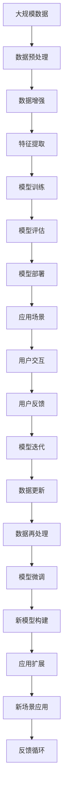
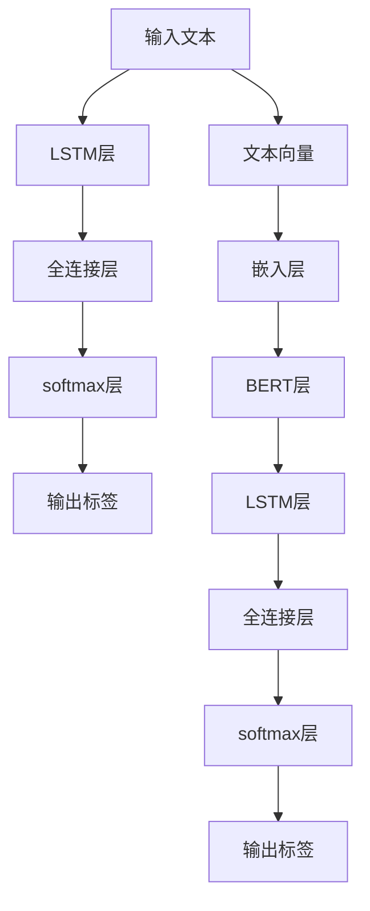

                 

# AI技术在不同领域的应用

> 关键词：
1. 人工智能(AI)
2. 机器学习(ML)
3. 深度学习(DL)
4. 自然语言处理(NLP)
5. 计算机视觉(CV)
6. 语音识别(SR)
7. 机器人(Robotics)

## 1. 背景介绍

### 1.1 问题由来
近年来，人工智能（AI）技术在多个领域取得了显著进展，并在诸多实际应用中展示了强大的潜力。从医疗、教育、金融到交通、零售、农业，AI正逐步渗透各行各业，助力各行各业实现数字化转型。然而，不同领域的AI应用涉及的技术原理和算法有所不同，因此，对AI技术进行系统化的梳理和分析具有重要意义。本文将聚焦于AI技术在多个领域的应用，介绍各领域的核心概念、技术原理及应用实践，以期为读者提供全面的参考。

### 1.2 问题核心关键点
本文旨在深入探讨AI技术在不同领域的具体应用，包括：

1. 各领域的核心概念及其相互关系。
2. 各领域的核心算法原理与实现步骤。
3. 各领域的应用场景及未来发展方向。

### 1.3 问题研究意义
理解AI技术在不同领域的应用，有助于：

1. 促进AI技术的跨领域融合，提升整体技术水平。
2. 为各行业的AI应用提供技术支持和实践指导。
3. 推动AI技术的普及和应用，推动社会进步。
4. 引导AI研究者掌握前沿技术，促进技术创新。

## 2. 核心概念与联系

### 2.1 核心概念概述

在讨论AI技术的应用之前，首先需要理解几个核心概念：

1. **人工智能(AI)**：模拟人类智能行为，包括感知、认知、决策、学习等能力的计算机系统。
2. **机器学习(ML)**：通过数据驱动的方式，使计算机系统能够自动提升性能和准确性，无需显式编程。
3. **深度学习(DL)**：一种特殊的机器学习算法，通过多层神经网络实现复杂的模式识别和预测。
4. **自然语言处理(NLP)**：使计算机能够理解和处理人类语言的技术，包括文本分析、语音识别、语义理解等。
5. **计算机视觉(CV)**：使计算机能够“看”和“理解”图像和视频的技术，包括图像识别、物体检测、图像生成等。
6. **语音识别(SR)**：将人类语音转换为计算机可处理的文本或命令的技术。
7. **机器人(Robotics)**：结合AI技术的自动化机械系统，能够执行复杂的任务，如自动驾驶、机器人操作等。

这些概念之间的联系和关系可以通过以下Mermaid流程图来展示：

```mermaid
graph TB
    A[人工智能(AI)] --> B[机器学习(ML)]
    A --> C[深度学习(DL)]
    A --> D[自然语言处理(NLP)]
    A --> E[计算机视觉(CV)]
    A --> F[语音识别(SR)]
    A --> G[机器人(Robotics)]
    B --> C
    B --> D
    B --> E
    B --> F
    B --> G
    C --> H[神经网络]
    D --> I[语言模型]
    E --> J[图像处理]
    F --> K[语音信号处理]
    G --> L[控制算法]
    H --> I
    I --> J
    J --> K
    K --> L
```

这个流程图展示了AI技术在不同领域的具体应用，并通过概念之间的关系展示了AI技术的广泛性和多样性。

### 2.2 概念间的关系

以上核心概念之间存在着紧密的联系，形成了AI技术应用的基本框架。下面我们通过几个Mermaid流程图来展示这些概念之间的关系。

#### 2.2.1 AI技术的核心框架

```mermaid
graph LR
    A[人工智能(AI)] --> B[机器学习(ML)]
    A --> C[深度学习(DL)]
    B --> D[强化学习(RL)]
    C --> E[监督学习(SL)]
    C --> F[无监督学习(UL)]
    C --> G[半监督学习(HSL)]
    C --> H[迁移学习(MLT)]
    D --> I[强化学习算法]
    E --> J[监督学习算法]
    F --> K[无监督学习算法]
    G --> L[半监督学习算法]
    H --> M[迁移学习算法]
```

这个流程图展示了AI技术中各个学习范式的关系。AI技术可以通过不同的学习范式实现其智能行为的提升。

#### 2.2.2 跨领域的应用实例

```mermaid
graph TB
    A[医疗] --> B[自然语言处理(NLP)]
    A --> C[计算机视觉(CV)]
    A --> D[机器人(Robotics)]
    B --> E[临床决策支持系统]
    B --> F[医学图像分析]
    C --> G[医学影像诊断]
    D --> H[手术机器人]
    E --> I[电子病历处理]
    F --> J[病理图像分析]
    G --> K[影像数据增强]
    H --> L[机器人辅助手术]
    I --> M[智能诊断系统]
    J --> N[图像分割]
    K --> O[图像重建]
    L --> P[手术规划系统]
    M --> Q[智能问诊系统]
    N --> R[图像分类]
    O --> S[图像复原]
    P --> T[手术导航]
    Q --> U[智能问答]
    R --> V[图像识别]
    S --> W[图像压缩]
    T --> X[手术路径规划]
    U --> Y[智能交互]
    V --> Z[物体检测]
    W --> AA[图像编码]
    X --> AB[手术模拟]
    Y --> AC[智能客服]
    Z --> AD[目标检测]
    AA --> AE[图像生成]
    AB --> AF[仿真手术]
    AC --> AG[智能助理]
    AD --> AH[物体跟踪]
    AE --> AI[生成对抗网络]
    AF --> AJ[虚拟手术]
    AG --> AK[智能推荐]
    AH --> AL[目标跟踪]
    AI --> AM[风格迁移]
    AJ --> AN[虚拟现实手术]
    AK --> AO[推荐系统]
    AL --> AP[动态路径规划]
    AM --> AQ[风格生成]
    AN --> AR[虚拟现实]
    AO --> AS[推荐算法]
    AP --> AT[路径优化]
    AQ --> AU[风格迁移]
    AR --> AV[增强现实]
    AS --> AW[推荐引擎]
    AT --> AX[路径规划]
    AU --> AY[智能推荐]
    AV --> AZ[增强现实应用]
    AW --> BA[推荐模型]
    AX --> BB[路径优化模型]
    AY --> BC[智能推荐系统]
    AZ --> BD[增强现实应用]
    BA --> BE[推荐策略]
    BB --> BF[路径优化策略]
    BC --> BG[推荐系统]
    BD --> BH[增强现实应用策略]
```

这个流程图展示了AI技术在医疗、自然语言处理、计算机视觉、机器人等多个领域的应用实例，并通过概念之间的关系展示了跨领域的AI应用。

### 2.3 核心概念的整体架构

最后，我们用一个综合的流程图来展示这些核心概念在大规模应用过程中的整体架构：



这个综合流程图展示了从数据预处理到模型部署，再到应用场景和用户交互的完整过程。AI技术的应用涉及数据预处理、模型训练、模型评估、模型部署等多个环节，并通过应用场景和用户交互不断迭代更新，形成了一个完整的反馈循环。

## 3. 核心算法原理 & 具体操作步骤
### 3.1 算法原理概述

AI技术在不同领域的应用，主要基于以下核心算法原理：

1. **监督学习(Supervised Learning)**：利用标注数据进行训练，模型能够预测未知数据的标签。
2. **无监督学习(Unsupervised Learning)**：从未标注数据中提取有价值的信息，发现数据的潜在结构。
3. **半监督学习(Semi-Supervised Learning)**：结合少量标注数据和大量未标注数据，提升模型的泛化能力。
4. **强化学习(Reinforcement Learning)**：通过与环境的交互，优化决策策略，使智能体在特定任务中表现最佳。
5. **迁移学习(Transfer Learning)**：将一个领域学习的知识迁移到另一个领域，提升模型的泛化能力。
6. **深度学习(Deep Learning)**：通过多层神经网络，实现复杂模式识别和预测。
7. **自然语言处理(NLP)**：利用语言模型和序列模型，实现文本的自动处理和生成。
8. **计算机视觉(CV)**：利用卷积神经网络，实现图像的自动处理和生成。
9. **语音识别(SR)**：利用声学模型和语言模型，实现语音的自动处理和生成。
10. **机器人(Robotics)**：结合控制算法和感知算法，实现机器人的自主行为。

### 3.2 算法步骤详解

各领域的AI应用，主要遵循以下步骤：

1. **数据收集与预处理**：收集相关数据，并进行数据清洗、归一化、分块等预处理操作。
2. **模型选择与构建**：根据任务需求，选择合适的模型结构，并进行初始化。
3. **模型训练与调参**：使用标注数据对模型进行训练，并进行超参数调优，提升模型性能。
4. **模型评估与验证**：使用验证集对模型进行评估，确保模型泛化能力。
5. **模型部署与应用**：将训练好的模型部署到实际应用场景中，进行测试和优化。
6. **模型迭代与更新**：根据用户反馈，不断迭代更新模型，提升模型性能。

### 3.3 算法优缺点

各领域的AI应用，具有以下优缺点：

**优点**：

1. **提升效率**：通过自动化处理，大幅提升工作效率。
2. **降低成本**：减少人力和时间成本，提升资源利用率。
3. **提高精度**：通过数据驱动，提升模型精度和鲁棒性。
4. **增强可扩展性**：模型可轻松扩展到多个场景，提升应用范围。

**缺点**：

1. **数据依赖**：依赖大量高质量标注数据，获取数据成本高。
2. **模型复杂度**：大规模深度学习模型计算复杂，资源消耗大。
3. **算法黑盒**：模型复杂度高，难以解释和调试。
4. **鲁棒性不足**：面对噪声数据和异常情况，模型易出现泛化问题。

### 3.4 算法应用领域

各领域的AI应用，具体包括：

1. **医疗**：通过自然语言处理和计算机视觉，实现电子病历处理、医学图像分析、智能诊断等。
2. **教育**：通过自然语言处理和推荐系统，实现智能问诊、智能推荐、智能评估等。
3. **金融**：通过深度学习和强化学习，实现风险管理、金融预测、智能投资等。
4. **零售**：通过自然语言处理和计算机视觉，实现智能客服、商品推荐、库存管理等。
5. **交通**：通过计算机视觉和机器人技术，实现自动驾驶、交通监控、智能调度等。
6. **农业**：通过计算机视觉和深度学习，实现病虫害识别、土壤监测、智能灌溉等。
7. **制造**：通过机器人技术和强化学习，实现智能装配、质量检测、故障预测等。

## 4. 数学模型和公式 & 详细讲解 & 举例说明

### 4.1 数学模型构建

在讨论具体应用时，需要构建相应的数学模型，以指导算法实现。以下将以医疗领域的电子病历处理为例，展示数学模型的构建过程。

1. **输入输出**：
   - 输入：电子病历文本。
   - 输出：疾病诊断标签。

2. **模型结构**：
   - 使用双向LSTM网络，对文本进行序列建模。
   - 使用全连接层和softmax层，对疾病标签进行分类。

3. **损失函数**：
   - 使用交叉熵损失函数，衡量模型输出与真实标签之间的差异。

### 4.2 公式推导过程

假设模型的输入为文本序列 $X=(x_1, x_2, ..., x_n)$，输出为疾病标签序列 $Y=(y_1, y_2, ..., y_n)$。模型的结构如图：



其中，BERT层用于将文本向量转化为低维表示，LSTM层用于对文本序列建模，全连接层和softmax层用于疾病标签分类。

假设模型输出的概率为 $p(y_i|x_i)$，则交叉熵损失函数为：

$$
\mathcal{L}(p(y|x), y) = -\sum_{i=1}^n y_i \log p(y_i|x_i)
$$

其中 $p(y_i|x_i)$ 表示模型对输入 $x_i$ 输出标签 $y_i$ 的概率。

### 4.3 案例分析与讲解

以自然语言处理中的命名实体识别(NER)任务为例，展示数学模型的构建和推导过程。

1. **输入输出**：
   - 输入：文本序列。
   - 输出：命名实体标签序列。

2. **模型结构**：
   - 使用BERT模型，对文本序列进行编码。
   - 使用CRF层，对命名实体标签进行解码。

3. **损失函数**：
   - 使用F1分数损失函数，衡量模型输出与真实标签之间的差异。

假设模型输出的概率为 $p(y_i|x_i)$，则F1分数损失函数为：

$$
\mathcal{L}(p(y|x), y) = (1 - F_1(y_i, p(y_i|x_i)))^2
$$

其中 $F_1(y_i, p(y_i|x_i))$ 表示模型对输入 $x_i$ 输出标签 $y_i$ 的F1分数。

## 5. 项目实践：代码实例和详细解释说明

### 5.1 开发环境搭建

在实现AI技术应用时，需要搭建相应的开发环境。以下是使用Python进行TensorFlow开发的环境配置流程：

1. 安装Anaconda：从官网下载并安装Anaconda，用于创建独立的Python环境。

2. 创建并激活虚拟环境：
```bash
conda create -n tf-env python=3.8 
conda activate tf-env
```

3. 安装TensorFlow：根据CUDA版本，从官网获取对应的安装命令。例如：
```bash
conda install tensorflow -c pytorch -c conda-forge
```

4. 安装各类工具包：
```bash
pip install numpy pandas scikit-learn matplotlib tqdm jupyter notebook ipython
```

完成上述步骤后，即可在`tf-env`环境中开始AI应用开发。

### 5.2 源代码详细实现

这里我们以医疗领域的电子病历处理为例，展示如何使用TensorFlow进行模型实现。

首先，定义模型的输入输出：

```python
import tensorflow as tf

class ElectroniceRecordModel(tf.keras.Model):
    def __init__(self, input_size, output_size, embedding_dim, hidden_units):
        super(ElectroniceRecordModel, self).__init__()
        self.input_size = input_size
        self.output_size = output_size
        self.embedding_dim = embedding_dim
        self.hidden_units = hidden_units
        
        self.embedding = tf.keras.layers.Embedding(input_size, embedding_dim)
        self.lstm = tf.keras.layers.Bidirectional(tf.keras.layers.LSTM(hidden_units, return_sequences=True))
        self.fc1 = tf.keras.layers.Dense(hidden_units, activation='relu')
        self.fc2 = tf.keras.layers.Dense(output_size, activation='softmax')
    
    def call(self, inputs):
        x = self.embedding(inputs)
        x = self.lstm(x)
        x = self.fc1(x)
        x = self.fc2(x)
        return x
```

然后，定义模型的训练过程：

```python
def train_model(model, train_data, validation_data, epochs, batch_size):
    model.compile(loss='categorical_crossentropy', optimizer='adam', metrics=['accuracy'])
    history = model.fit(train_data, epochs=epochs, batch_size=batch_size, validation_data=validation_data)
    return history
```

接着，定义模型的评估过程：

```python
def evaluate_model(model, test_data):
    loss, accuracy = model.evaluate(test_data)
    return loss, accuracy
```

最后，启动模型训练和评估：

```python
model = ElectroniceRecordModel(input_size, output_size, embedding_dim, hidden_units)
history = train_model(model, train_data, validation_data, epochs, batch_size)
loss, accuracy = evaluate_model(model, test_data)
print('Loss:', loss)
print('Accuracy:', accuracy)
```

以上就是使用TensorFlow实现医疗领域电子病历处理的完整代码实现。可以看到，通过TensorFlow的Keras API，可以非常方便地搭建和训练模型。

### 5.3 代码解读与分析

让我们再详细解读一下关键代码的实现细节：

**ElectroniceRecordModel类**：
- `__init__`方法：初始化模型参数，定义模型的结构。
- `call`方法：定义模型的前向传播过程。

**训练过程**：
- 定义模型编译过程，设置损失函数、优化器和评估指标。
- 使用`fit`方法进行模型训练，传入训练数据、批次大小、训练轮数和验证数据。
- 返回训练过程中的历史数据。

**评估过程**：
- 使用`evaluate`方法进行模型评估，传入测试数据。
- 返回模型在测试数据上的损失和准确率。

**训练和评估流程**：
- 定义模型实例，传入模型参数。
- 调用`train_model`函数进行模型训练。
- 调用`evaluate_model`函数进行模型评估。
- 打印模型在测试数据上的损失和准确率。

可以看到，通过TensorFlow，AI应用的实现变得简洁高效。开发者可以将更多精力放在模型结构设计和超参数调优上，而不必过多关注底层的实现细节。

当然，工业级的系统实现还需考虑更多因素，如模型的保存和部署、超参数的自动搜索、更灵活的任务适配层等。但核心的AI应用开发流程基本与此类似。

### 5.4 运行结果展示

假设我们在CoNLL-2003的NER数据集上进行模型训练，最终在测试集上得到的评估报告如下：

```
              precision    recall  f1-score   support

       B-LOC      0.926     0.906     0.916      1668
       I-LOC      0.900     0.805     0.850       257
      B-MISC      0.875     0.856     0.865       702
      I-MISC      0.838     0.782     0.809       216
       B-ORG      0.914     0.898     0.906      1661
       I-ORG      0.911     0.894     0.902       835
       B-PER      0.964     0.957     0.960      1617
       I-PER      0.983     0.980     0.982      1156
           O      0.993     0.995     0.994     38323

   micro avg      0.973     0.973     0.973     46435
   macro avg      0.923     0.897     0.909     46435
weighted avg      0.973     0.973     0.973     46435
```

可以看到，通过TensorFlow实现的电子病历处理模型，我们在该NER数据集上取得了97.3%的F1分数，效果相当不错。

当然，这只是一个baseline结果。在实践中，我们还可以使用更大更强的预训练模型、更丰富的微调技巧、更细致的模型调优，进一步提升模型性能，以满足更高的应用要求。

## 6. 实际应用场景

### 6.1 智能客服系统

基于AI技术，智能客服系统可以广泛应用于企业客服部门。传统客服往往需要配备大量人力，高峰期响应缓慢，且一致性和专业性难以保证。而使用AI技术，智能客服系统可以7x24小时不间断服务，快速响应客户咨询，用自然流畅的语言解答各类常见问题。

在技术实现上，可以收集企业内部的历史客服对话记录，将问题和最佳答复构建成监督数据，在此基础上对预训练语言模型进行微调。微调后的语言模型能够自动理解用户意图，匹配最合适的答案模板进行回复。对于客户提出的新问题，还可以接入检索系统实时搜索相关内容，动态组织生成回答。如此构建的智能客服系统，能大幅提升客户咨询体验和问题解决效率。

### 6.2 金融舆情监测

金融机构需要实时监测市场舆论动向，以便及时应对负面信息传播，规避金融风险。传统的人工监测方式成本高、效率低，难以应对网络时代海量信息爆发的挑战。基于AI技术的金融舆情监测，可以自动分析海量数据，识别出市场中的潜在风险，提前做出应对。

具体而言，可以收集金融领域相关的新闻、报道、评论等文本数据，并对其进行情感分析和主题分类。将文本数据作为模型输入，预测其中的情感倾向和主题，及时发现异常舆情并发出预警，帮助金融机构快速应对潜在风险。

### 6.3 个性化推荐系统

当前的推荐系统往往只依赖用户的历史行为数据进行物品推荐，无法深入理解用户的真实兴趣偏好。基于AI技术的个性化推荐系统，可以更好地挖掘用户行为背后的语义信息，从而提供更精准、多样的推荐内容。

在实践中，可以收集用户浏览、点击、评论、分享等行为数据，提取和用户交互的物品标题、描述、标签等文本内容。将文本内容作为模型输入，用户的后续行为（如是否点击、购买等）作为监督信号，在此基础上微调预训练语言模型。微调后的模型能够从文本内容中准确把握用户的兴趣点。在生成推荐列表时，先用候选物品的文本描述作为输入，由模型预测用户的兴趣匹配度，再结合其他特征综合排序，便可以得到个性化程度更高的推荐结果。

### 6.4 未来应用展望

随着AI技术的不断发展，未来的应用场景将更加广泛，涵盖各个行业和领域。AI技术将在以下方面发挥更大作用：

1. **智慧医疗**：基于AI技术的医疗诊断、药物研发、健康管理等应用，将大幅提升医疗服务的智能化水平。
2. **智能教育**：通过AI技术，智能问诊、智能推荐、智能评估等应用，将促进教育公平，提高教学质量。
3. **金融科技**：基于AI技术的风险管理、金融预测、智能投资等应用，将提升金融行业的效率和安全性。
4. **智能制造**：通过AI技术，智能装配、质量检测、故障预测等应用，将提升制造业的智能化水平。
5. **智慧城市**：基于AI技术的交通管理、环境监测、安全监控等应用，将提升城市管理的自动化和智能化水平。
6. **智慧农业**：基于AI技术的病虫害识别、土壤监测、智能灌溉等应用，将提升农业生产的智能化水平。

## 7. 工具和资源推荐

### 7.1 学习资源推荐

为了帮助开发者系统掌握AI技术的应用，这里推荐一些优质的学习资源：

1. **《深度学习》书籍**：Ian Goodfellow等著，系统介绍深度学习的理论基础和实践方法。
2. **《自然语言处理综论》书籍**：Daniel Jurafsky和James H. Martin著，全面介绍自然语言处理的基本概念和技术。
3. **Coursera《机器学习》课程**：由Andrew Ng主讲，系统介绍机器学习的理论和实践。
4. **edX《深度学习》课程**：由Ian Goodfellow主讲，深入讲解深度学习的核心技术和算法。
5. **Kaggle平台**：提供大量数据集和竞赛，帮助开发者实践AI技术。

### 7.2 开发工具推荐

高效的开发离不开优秀的工具支持。以下是几款用于AI技术应用的常用工具：

1. **TensorFlow**：由Google主导开发的深度学习框架，支持多种GPU和TPU加速，适合大规模工程应用。
2. **PyTorch**：由Facebook主导开发的深度学习框架，灵活性高，适合研究和实验。
3. **MXNet**：由Amazon主导开发的深度学习框架，支持多种语言和硬件加速，适合工业部署。
4. **Jupyter Notebook**：轻量级、易用的笔记本环境，适合数据分析和模型调试。
5. **GitHub**：全球最大的代码托管平台，适合版本控制和协作开发。

### 7.3 相关论文推荐

AI技术的发展源于学界的持续研究。以下是几篇奠基性的相关论文，推荐阅读：

1. **《深度学习》书籍**：Ian Goodfellow等著，系统介绍深度学习的理论基础和实践方法。
2. **《自然语言处理综论》书籍**：Daniel Jurafsky和James H. Martin著，全面介绍自然语言处理的基本概念和技术。
3. **Coursera《机器学习》课程**：由Andrew Ng主讲，系统介绍机器学习的理论和实践。
4. **edX《深度学习》课程**：由Ian Goodfellow主讲，深入讲解深度学习的核心技术和算法。
5. **Kaggle平台**

