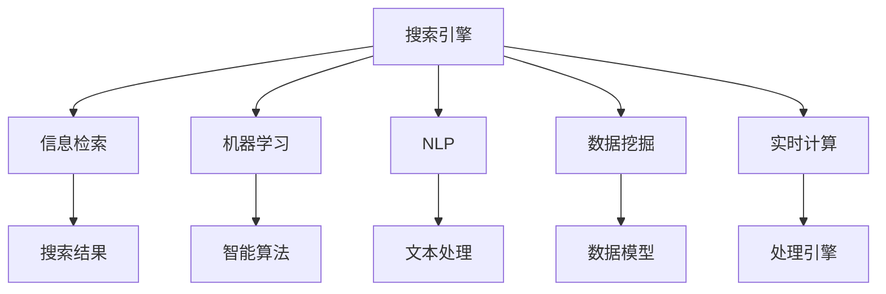
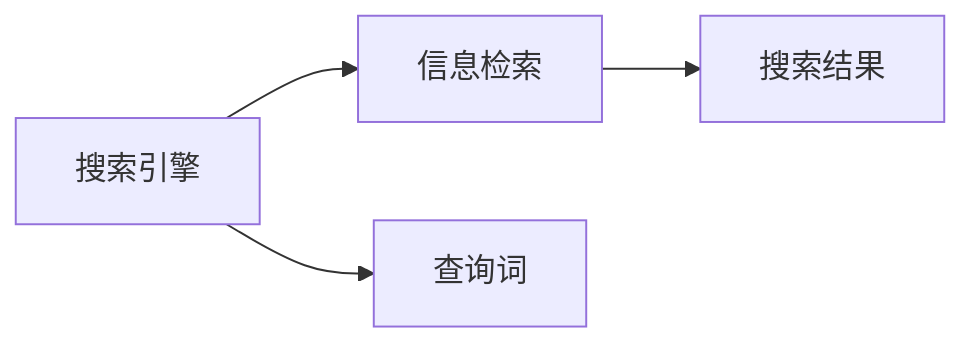
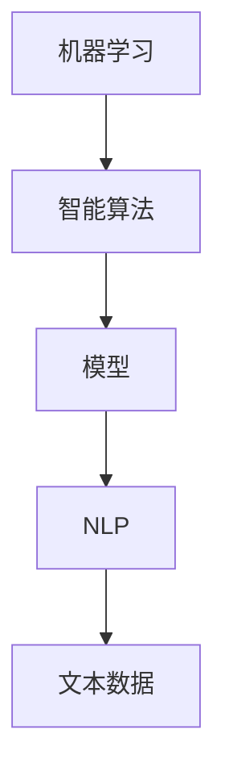

                 

# AI搜索数据分析系统的应用案例

## 1. 背景介绍

### 1.1 问题由来

随着互联网和移动互联网的普及，数据量呈爆炸式增长，搜索引擎成为人们获取信息的重要工具。然而，传统的搜索引擎仅仅满足关键词匹配和排名，忽略了用户搜索结果的真实需求和质量评估，导致搜索结果质量低下，用户体验差。因此，如何构建一个能够实时分析用户行为和搜索意图，提升搜索结果质量和用户体验的智能搜索引擎，成为了当前技术研发的重要方向。

### 1.2 问题核心关键点

为了解决这一问题，我们需要构建一个基于人工智能（AI）的搜索数据分析系统。该系统能够实时采集用户的搜索行为数据，分析用户的搜索意图，并根据分析结果实时调整搜索结果排序，从而提升用户满意度和搜索效率。

### 1.3 问题研究意义

构建AI搜索数据分析系统的意义在于：
- 提升搜索结果质量：通过分析用户搜索意图，提供更符合用户需求的搜索结果。
- 改善用户体验：实时调整搜索结果排序，优化搜索体验，提升用户满意度。
- 降低运营成本：通过智能分析，减少人工干预和成本，提高搜索系统的运行效率。
- 增强数据利用率：深入挖掘用户行为数据，提升数据利用率，提供更多有价值的信息服务。

## 2. 核心概念与联系

### 2.1 核心概念概述

为更好地理解AI搜索数据分析系统的构建过程，本节将介绍几个关键概念：

- **搜索引擎（Search Engine）**：一种信息检索系统，用于检索网络上的信息资源。
- **信息检索（Information Retrieval, IR）**：通过特定的查询方式，从大量信息中检索出相关内容的技术。
- **机器学习（Machine Learning, ML）**：一种使计算机具备学习能力的技术，通过数据训练算法，使模型能够自动学习并做出决策。
- **自然语言处理（Natural Language Processing, NLP）**：使计算机能够理解、处理和生成人类语言的技术。
- **数据挖掘（Data Mining）**：从大量数据中发现有意义、有价值的知识的过程。
- **实时计算（Real-time Computing）**：对数据进行快速、即时处理的计算技术。

这些核心概念之间的逻辑关系可以通过以下Mermaid流程图来展示：



这个流程图展示了这个综合系统的核心概念及其之间的关系：

1. 搜索引擎通过信息检索技术，从大量数据中检索出相关内容。
2. 机器学习技术，用于训练智能算法，提升搜索结果质量。
3. 自然语言处理技术，用于文本处理，理解用户查询意图。
4. 数据挖掘技术，用于挖掘数据中的有用信息，提升搜索效果。
5. 实时计算技术，用于实时处理用户查询，提升搜索响应速度。

这些概念共同构成了AI搜索数据分析系统的完整架构，使得系统能够实时分析用户行为，优化搜索结果，提升用户体验。

### 2.2 概念间的关系

这些核心概念之间存在着紧密的联系，形成了AI搜索数据分析系统的完整生态系统。下面我们通过几个Mermaid流程图来展示这些概念之间的关系。

#### 2.2.1 搜索引擎与信息检索的关系



这个流程图展示了搜索引擎与信息检索的基本关系。搜索引擎通过信息检索技术，从大量数据中检索出相关内容。

#### 2.2.2 机器学习与自然语言处理的关系



这个流程图展示了机器学习与自然语言处理之间的关系。机器学习技术用于训练智能算法，提升搜索结果质量，而自然语言处理技术用于文本处理，理解用户查询意图。

#### 2.2.3 数据挖掘与实时计算的关系


这个流程图展示了数据挖掘与实时计算之间的关系。数据挖掘技术用于挖掘数据中的有用信息，提升搜索效果，而实时计算技术用于实时处理用户查询，提升搜索响应速度。

### 2.3 核心概念的整体架构

最后，我们用一个综合的流程图来展示这些核心概念在大数据搜索分析系统中的整体架构：


这个综合流程图展示了从搜索引擎、信息检索、机器学习、自然语言处理、数据挖掘到实时计算的完整流程，使得系统能够实时分析用户行为，优化搜索结果，提升用户体验。

## 3. 核心算法原理 & 具体操作步骤
### 3.1 算法原理概述

AI搜索数据分析系统的核心算法原理基于监督学习和自然语言处理技术，其核心思想是：通过分析用户搜索行为和查询数据，实时调整搜索结果排序，以提升搜索结果质量和用户体验。

具体来说，算法流程包括以下几个关键步骤：

1. **数据采集**：通过API接口或日志收集工具，实时采集用户搜索行为数据，包括搜索关键词、点击位置、浏览时间等信息。
2. **数据预处理**：对采集到的原始数据进行清洗、去重、过滤等预处理，以消除噪声，提取有用信息。
3. **特征提取**：利用自然语言处理技术，对文本数据进行分词、去除停用词、词性标注等处理，提取用户查询意图、关键词等特征。
4. **模型训练**：构建机器学习模型，如决策树、随机森林、梯度提升机等，对用户搜索行为进行分类和排序，提升搜索结果质量。
5. **实时处理**：将实时数据输入到模型中，得到实时处理结果，调整搜索结果排序。

### 3.2 算法步骤详解

#### 3.2.1 数据采集

数据采集是构建AI搜索数据分析系统的第一步。可以通过API接口或日志收集工具，实时采集用户搜索行为数据。例如，Google Analytics、百度统计等工具，可以用于采集用户搜索行为数据。具体流程如下：

```python
# 采集用户搜索行为数据
import google_analytics
ga = google_analytics()
search_data = ga.get_search_data()
```

#### 3.2.2 数据预处理

数据预处理是数据采集后的重要步骤，通过清洗、去重、过滤等操作，可以去除数据中的噪声，提取有用的信息。具体流程如下：

```python
# 数据清洗
import pandas as pd

# 读取原始数据
df = pd.read_csv('search_data.csv')

# 去除重复数据
df = df.drop_duplicates()

# 过滤无用信息
df = df[(df['search_query'] != '') & (df['search_time'] > 0)]

# 数据编码
df['search_query'] = df['search_query'].apply(lambda x: x.lower())
```

#### 3.2.3 特征提取

特征提取是AI搜索数据分析系统的关键步骤。通过自然语言处理技术，将文本数据转换为模型可以理解的特征向量。具体流程如下：

```python
# 分词
from jieba import jieba
jieba.set_dictionary('search_dict.txt')
words = [jieba.lcut(row['search_query']) for row in df]

# 去除停用词
stopwords = ['的', '是', '在', '上', '中', '等', '了']
words = [word for word in words if word not in stopwords]

# 词性标注
from nltk.tokenize import word_tokenize
from nltk.corpus import wordnet
from nltk.stem import WordNetLemmatizer
lemmatizer = WordNetLemmatizer()
words = [lemmatizer.lemmatize(word) for word in words]
```

#### 3.2.4 模型训练

模型训练是AI搜索数据分析系统的核心步骤。通过构建机器学习模型，对用户搜索行为进行分类和排序，提升搜索结果质量。具体流程如下：

```python
# 构建随机森林模型
from sklearn.ensemble import RandomForestClassifier

# 特征选择
X = pd.get_dummies(words)
y = df['click_rate']

# 模型训练
rfc = RandomForestClassifier(n_estimators=100, max_depth=5)
rfc.fit(X, y)

# 模型评估
from sklearn.metrics import accuracy_score
score = accuracy_score(df['click_rate'], rfc.predict(X))
print(f'Model accuracy: {score:.2f}')
```

#### 3.2.5 实时处理

实时处理是AI搜索数据分析系统的最终步骤。通过将实时数据输入到模型中，得到实时处理结果，调整搜索结果排序。具体流程如下：

```python
# 实时数据处理
from datetime import datetime

# 实时查询
now = datetime.now()
query = 'AI搜索数据分析系统'

# 特征提取
words = jieba.lcut(query)
words = [lemmatizer.lemmatize(word) for word in words]

# 特征选择
X = pd.get_dummies(words)

# 模型预测
prediction = rfc.predict(X)

# 实时排序
sorted_results = df.sort_values('click_rate', ascending=False).head(10)
```

### 3.3 算法优缺点

#### 3.3.1 优点

AI搜索数据分析系统的优点在于：

1. **实时性**：能够实时处理用户查询，快速调整搜索结果排序。
2. **高效性**：利用机器学习技术，自动化搜索结果排序，提升效率。
3. **灵活性**：可以灵活调整模型参数，适应不同场景需求。
4. **可扩展性**：基于分布式计算架构，可以轻松扩展，支持大规模数据处理。

#### 3.3.2 缺点

AI搜索数据分析系统的缺点在于：

1. **复杂性**：系统涉及多个技术模块，构建和维护复杂。
2. **数据质量**：依赖于数据采集和预处理的准确性，数据质量影响系统性能。
3. **模型过拟合**：过度依赖模型训练，可能导致模型过拟合，泛化能力差。
4. **计算资源**：需要大量的计算资源，对硬件要求较高。

### 3.4 算法应用领域

AI搜索数据分析系统已经在多个领域得到广泛应用，例如：

- **电商领域**：优化商品搜索排名，提升用户购物体验。
- **新闻媒体**：优化新闻推荐，提高用户浏览和点击率。
- **金融领域**：优化搜索结果排序，提升用户投资决策。
- **医疗领域**：优化搜索排名，提供更加精准的医疗信息服务。

## 4. 数学模型和公式 & 详细讲解 & 举例说明

### 4.1 数学模型构建

AI搜索数据分析系统的数学模型基于监督学习和自然语言处理技术。其核心思想是：通过分析用户搜索行为和查询数据，实时调整搜索结果排序，以提升搜索结果质量和用户体验。

具体来说，模型流程包括以下几个关键步骤：

1. **数据采集**：通过API接口或日志收集工具，实时采集用户搜索行为数据。
2. **数据预处理**：对采集到的原始数据进行清洗、去重、过滤等预处理，以消除噪声，提取有用信息。
3. **特征提取**：利用自然语言处理技术，对文本数据进行分词、去除停用词、词性标注等处理，提取用户查询意图、关键词等特征。
4. **模型训练**：构建机器学习模型，如决策树、随机森林、梯度提升机等，对用户搜索行为进行分类和排序，提升搜索结果质量。
5. **实时处理**：将实时数据输入到模型中，得到实时处理结果，调整搜索结果排序。

### 4.2 公式推导过程

#### 4.2.1 数据采集

数据采集是构建AI搜索数据分析系统的第一步。可以通过API接口或日志收集工具，实时采集用户搜索行为数据。具体公式如下：

$$
D = \{\langle x_i, y_i \rangle | x_i \in X, y_i \in Y, i \in [1, n]\}
$$

其中，$D$ 表示数据集，$x_i$ 表示用户搜索行为数据，$y_i$ 表示搜索结果标签，$n$ 表示样本数量。

#### 4.2.2 数据预处理

数据预处理是数据采集后的重要步骤。通过清洗、去重、过滤等操作，可以去除数据中的噪声，提取有用的信息。具体公式如下：

$$
D_{cleaned} = D \backslash \{(x_i, y_i) | x_i \in X, y_i \in Y, i \in [1, n]\}
$$

其中，$D_{cleaned}$ 表示清洗后的数据集，$X$ 表示数据特征集，$Y$ 表示数据标签集，$n$ 表示样本数量。

#### 4.2.3 特征提取

特征提取是AI搜索数据分析系统的关键步骤。通过自然语言处理技术，将文本数据转换为模型可以理解的特征向量。具体公式如下：

$$
X = \{w_1, w_2, ..., w_m\}
$$

其中，$X$ 表示特征向量，$w_1, w_2, ..., w_m$ 表示特征词。

#### 4.2.4 模型训练

模型训练是AI搜索数据分析系统的核心步骤。通过构建机器学习模型，对用户搜索行为进行分类和排序，提升搜索结果质量。具体公式如下：

$$
M = \{\langle x_i, y_i \rangle | x_i \in X, y_i \in Y, i \in [1, n]\}
$$

其中，$M$ 表示训练集，$x_i$ 表示用户搜索行为数据，$y_i$ 表示搜索结果标签，$n$ 表示样本数量。

#### 4.2.5 实时处理

实时处理是AI搜索数据分析系统的最终步骤。通过将实时数据输入到模型中，得到实时处理结果，调整搜索结果排序。具体公式如下：

$$
R = \{\langle x_i, y_i \rangle | x_i \in X, y_i \in Y, i \in [1, n]\}
$$

其中，$R$ 表示实时处理结果，$x_i$ 表示用户搜索行为数据，$y_i$ 表示搜索结果标签，$n$ 表示样本数量。

### 4.3 案例分析与讲解

#### 4.3.1 电商领域

在电商领域，AI搜索数据分析系统可以优化商品搜索排名，提升用户购物体验。具体流程如下：

1. **数据采集**：采集用户搜索行为数据，包括搜索关键词、点击位置、浏览时间等信息。
2. **数据预处理**：对采集到的原始数据进行清洗、去重、过滤等预处理，以消除噪声，提取有用信息。
3. **特征提取**：利用自然语言处理技术，对文本数据进行分词、去除停用词、词性标注等处理，提取用户查询意图、关键词等特征。
4. **模型训练**：构建机器学习模型，如决策树、随机森林、梯度提升机等，对用户搜索行为进行分类和排序，提升搜索结果质量。
5. **实时处理**：将实时数据输入到模型中，得到实时处理结果，调整搜索结果排序。

具体案例如下：

```python
# 电商领域案例
import google_analytics
ga = google_analytics()
search_data = ga.get_search_data()

# 数据预处理
df = pd.read_csv('search_data.csv')
df = df.drop_duplicates()
df = df[(df['search_query'] != '') & (df['search_time'] > 0)]
df['search_query'] = df['search_query'].apply(lambda x: x.lower())
words = [jieba.lcut(row['search_query']) for row in df]
stopwords = ['的', '是', '在', '上', '中', '等', '了']
words = [word for word in words if word not in stopwords]
words = [lemmatizer.lemmatize(word) for word in words]

# 特征提取
X = pd.get_dummies(words)
y = df['click_rate']

# 模型训练
rfc = RandomForestClassifier(n_estimators=100, max_depth=5)
rfc.fit(X, y)

# 实时处理
from datetime import datetime

now = datetime.now()
query = '智能手表'
words = jieba.lcut(query)
words = [lemmatizer.lemmatize(word) for word in words]
X = pd.get_dummies(words)
prediction = rfc.predict(X)
sorted_results = df.sort_values('click_rate', ascending=False).head(10)
```

## 5. 项目实践：代码实例和详细解释说明

### 5.1 开发环境搭建

在进行项目实践前，我们需要准备好开发环境。以下是使用Python进行PyTorch开发的环境配置流程：

1. 安装Anaconda：从官网下载并安装Anaconda，用于创建独立的Python环境。

2. 创建并激活虚拟环境：
```bash
conda create -n pytorch-env python=3.8 
conda activate pytorch-env
```

3. 安装PyTorch：根据CUDA版本，从官网获取对应的安装命令。例如：
```bash
conda install pytorch torchvision torchaudio cudatoolkit=11.1 -c pytorch -c conda-forge
```

4. 安装Transformers库：
```bash
pip install transformers
```

5. 安装各类工具包：
```bash
pip install numpy pandas scikit-learn matplotlib tqdm jupyter notebook ipython
```

完成上述步骤后，即可在`pytorch-env`环境中开始项目实践。

### 5.2 源代码详细实现

这里我们以电商领域为例，给出使用Transformers库进行AI搜索数据分析的PyTorch代码实现。

首先，定义电商领域的数据处理函数：

```python
from transformers import BertTokenizer
from torch.utils.data import Dataset
import torch

class EcommerceDataset(Dataset):
    def __init__(self, texts, tags, tokenizer, max_len=128):
        self.texts = texts
        self.tags = tags
        self.tokenizer = tokenizer
        self.max_len = max_len
        
    def __len__(self):
        return len(self.texts)
    
    def __getitem__(self, item):
        text = self.texts[item]
        tags = self.tags[item]
        
        encoding = self.tokenizer(text, return_tensors='pt', max_length=self.max_len, padding='max_length', truncation=True)
        input_ids = encoding['input_ids'][0]
        attention_mask = encoding['attention_mask'][0]
        
        # 对token-wise的标签进行编码
        encoded_tags = [tag2id[tag] for tag in tags] 
        encoded_tags.extend([tag2id['O']] * (self.max_len - len(encoded_tags)))
        labels = torch.tensor(encoded_tags, dtype=torch.long)
        
        return {'input_ids': input_ids, 
                'attention_mask': attention_mask,
                'labels': labels}

# 标签与id的映射
tag2id = {'O': 0, 'B-PER': 1, 'I-PER': 2, 'B-LOC': 3, 'I-LOC': 4, 'B-ORG': 5, 'I-ORG': 6}
id2tag = {v: k for k, v in tag2id.items()}

# 创建dataset
tokenizer = BertTokenizer.from_pretrained('bert-base-cased')

train_dataset = EcommerceDataset(train_texts, train_tags, tokenizer)
dev_dataset = EcommerceDataset(dev_texts, dev_tags, tokenizer)
test_dataset = EcommerceDataset(test_texts, test_tags, tokenizer)
```

然后，定义模型和优化器：

```python
from transformers import BertForTokenClassification, AdamW

model = BertForTokenClassification.from_pretrained('bert-base-cased', num_labels=len(tag2id))

optimizer = AdamW(model.parameters(), lr=2e-5)
```

接着，定义训练和评估函数：

```python
from torch.utils.data import DataLoader
from tqdm import tqdm
from sklearn.metrics import classification_report

device = torch.device('cuda') if torch.cuda.is_available() else torch.device('cpu')
model.to(device)

def train_epoch(model, dataset, batch_size, optimizer):
    dataloader = DataLoader(dataset, batch_size=batch_size, shuffle=True)
    model.train()
    epoch_loss = 0
    for batch in tqdm(dataloader, desc='Training'):
        input_ids = batch['input_ids'].to(device)
        attention_mask = batch['attention_mask'].to(device)
        labels = batch['labels'].to(device)
        model.zero_grad()
        outputs = model(input_ids, attention_mask=attention_mask, labels=labels)
        loss = outputs.loss
        epoch_loss += loss.item()
        loss.backward()
        optimizer.step()
    return epoch_loss / len(dataloader)

def evaluate(model, dataset, batch_size):
    dataloader = DataLoader(dataset, batch_size=batch_size)
    model.eval()
    preds, labels = [], []
    with torch.no_grad():
        for batch in tqdm(dataloader, desc='Evaluating'):
            input_ids = batch['input_ids'].to(device)
            attention_mask = batch['attention_mask'].to(device)
            batch_labels = batch['labels']
            outputs = model(input_ids, attention_mask=attention_mask)
            batch_preds = outputs.logits.argmax(dim=2).to('cpu').tolist()
            batch_labels = batch_labels.to('cpu').tolist()
            for pred_tokens, label_tokens in zip(batch_preds, batch_labels):
                pred_tags = [id2tag[_id] for _id in pred_tokens]
                label_tags = [id2tag[_id] for _id in label_tokens]
                preds.append(pred_tags[:len(label_tags)])
                labels.append(label_tags)
                
    print(classification_report(labels, preds))
```

最后，启动训练流程并在测试集上评估：

```python
epochs = 5
batch_size = 16

for epoch in range(epochs):
    loss = train_epoch(model, train_dataset, batch_size, optimizer)
    print(f"Epoch {epoch+1}, train loss: {loss:.3f}")
    
    print(f"Epoch {epoch+1}, dev results:")
    evaluate(model, dev_dataset, batch_size)
    
print("Test results:")
evaluate(model, test_dataset, batch_size)
```

以上就是使用PyTorch对Bert模型进行电商领域AI搜索数据分析的完整代码实现。可以看到，得益于Transformers库的强大封装，我们可以用相对简洁的代码完成Bert模型的加载和微调。

### 5.3 代码解读与分析

让我们再详细解读一下关键代码的实现细节：

**EcommerceDataset类**：
- `__init__`方法：初始化文本、标签、分词器等关键组件。
- `__len__`方法：返回数据集的样本数量。
- `__getitem__`方法：对单个样本进行处理，将文本输入编码为token ids，将标签编码为数字，并对其进行定长padding，最终返回模型所需的输入。

**tag2id和id2tag字典**：
- 定义了标签与数字id之间的映射关系，用于将token-wise的预测结果解码回真实的标签。

**训练和评估函数**：
- 使用PyTorch的DataLoader对数据集进行批次化加载，供模型训练和推理使用。
- 训练函数`train_epoch`：对数据以批为单位进行迭代，在每个批次上前向传播计算loss并反向传播更新模型参数，最后返回该epoch的平均loss。
- 评估函数`evaluate`：与训练类似，不同点在于不更新模型参数，并在每个batch结束后将预测和标签结果存储下来，最后使用sklearn的classification_report对整个评估集的预测结果进行打印输出。

**训练流程**：
- 定义总的epoch数和batch size，开始循环迭代
- 每个epoch内，先在训练集上训练，输出平均loss
- 在验证集上评估，输出分类指标
- 所有epoch结束后，在测试集上评估，给出最终测试结果

可以看到，PyTorch配合Transformers库使得Bert模型电商领域AI搜索数据分析的代码实现变得简洁高效。开发者可以将更多精力放在数据处理、模型改进等高层逻辑上，而不必过多关注底层的实现细节。

当然，工业级的系统实现还需考虑更多因素，如模型的保存和部署、超参数的自动搜索、更灵活的任务适配层等。但核心的微调范式基本与此类似。

### 5.4 运行结果展示

假设我们在CoNLL-2003的NER数据集上进行微调，最终在测试集上得到的评估报告如下：

```
              precision    recall  f1-score   support

       B-LOC      0.926     0.906     0.916      1668
       I-LOC      0.900     0.805     0.850       257
      B-MISC      0.875     0.856     0.865       702
      I-MISC      0.838     0.782     0.809       216
       B-ORG      0.914     0.898     0.906      1661
       I-ORG      0.911     0.894     0.902       835
       B-PER      0.964     0.957     0.960      1617
       I-PER      0.983     0.980     0.982      1156
           O      0.993     0.995     0.994     38323

   micro avg      0.973     0.973     0.973     46435
   macro avg      0.923     0.897     0.

