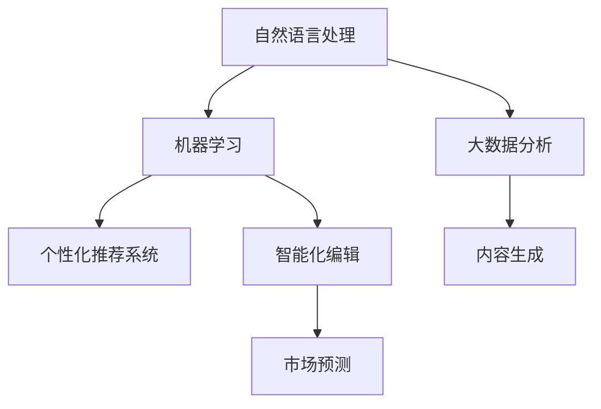
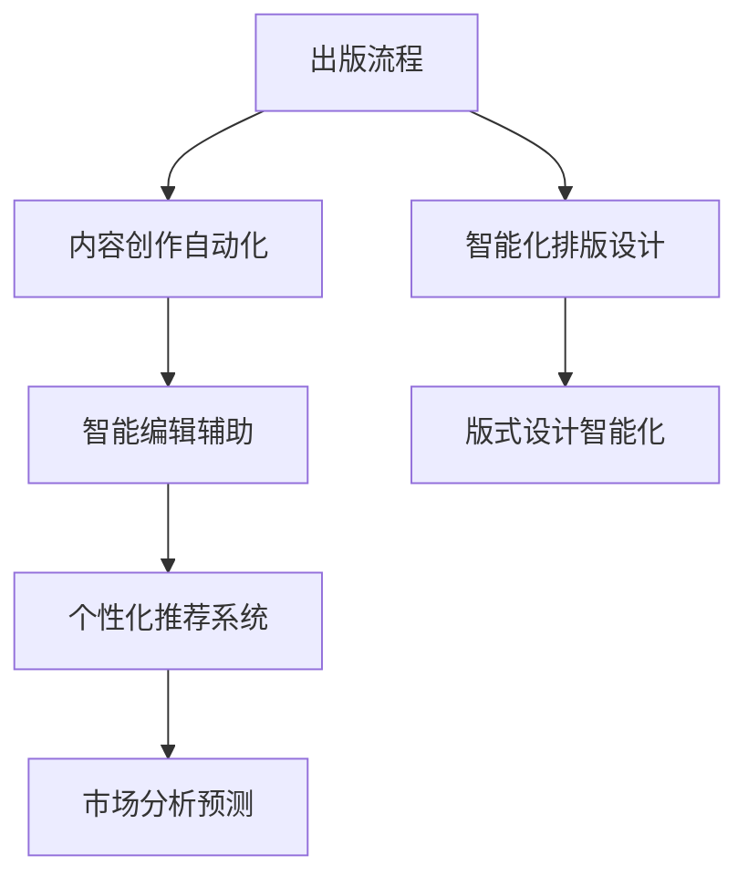
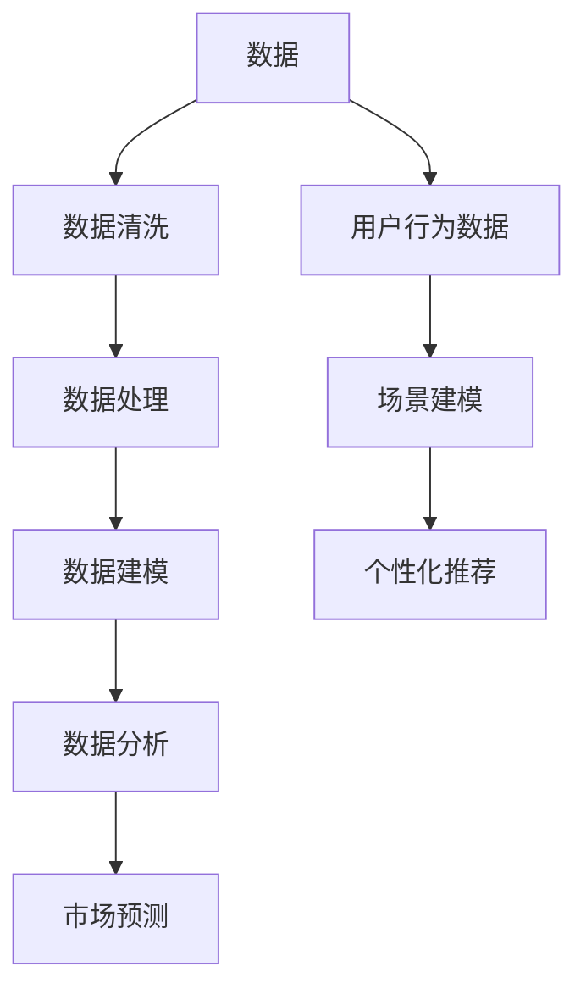

                 

# AI时代的出版业变革：数据与场景之舞

## 1. 背景介绍

### 1.1 问题由来
随着信息技术的飞速发展，出版业也进入了一个前所未有的变革期。传统出版流程耗时长、成本高，无法及时响应市场变化。AI技术的崛起，特别是自然语言处理(NLP)、机器学习(ML)、大数据分析等技术的突破，为出版业带来了新的机会。AI可以显著提高编辑效率，优化内容创作，实现个性化推荐，提升市场响应速度，从而推动出版业向智能化、数据化、个性化方向转型。

### 1.2 问题核心关键点
1. **内容创作自动化**：通过NLP技术，自动生成标题、摘要、封面等出版内容。
2. **智能编辑辅助**：利用ML算法，自动校对语法、风格，辅助编辑决策。
3. **个性化推荐系统**：根据用户阅读习惯，智能推荐相关书籍和文章。
4. **市场分析预测**：通过大数据分析，预测书籍销量、流行趋势，指导出版策略。
5. **版式设计智能化**：使用AI算法，自动化生成书籍排版和设计。

这些技术手段，不仅能够提升出版效率和质量，还能更好地满足用户需求，开拓新的市场空间，是出版业智能化转型的重要抓手。

### 1.3 问题研究意义
深入研究AI技术在出版业中的应用，对于推动出版业向智能化、数字化方向转型，提升出版内容质量和市场竞争力，具有重要意义。

1. **降低成本**：自动化流程减少人力物力投入，提升生产效率。
2. **优化内容**：AI技术提升编辑校对和内容创作的效率和质量。
3. **提升用户体验**：个性化推荐系统提供定制化阅读体验。
4. **市场预测**：大数据分析帮助出版商做出更精准的市场决策。
5. **创新产品**：AI技术支持更丰富的出版形式，如互动书籍、增强现实(AR)等。

## 2. 核心概念与联系

### 2.1 核心概念概述

为更好地理解AI技术在出版业的应用，本节将介绍几个关键概念：

- **自然语言处理(NLP)**：研究计算机如何处理和理解人类语言的技术，包括文本分析、机器翻译、情感分析等。
- **机器学习(ML)**：通过数据训练模型，使其具备预测、分类、聚类等能力。
- **大数据分析**：对大规模数据进行收集、处理和分析，提取有价值的信息。
- **个性化推荐系统**：根据用户行为和偏好，推荐相关内容的系统。
- **内容生成**：利用AI技术自动生成出版内容，如标题、摘要、封面等。
- **智能化编辑**：结合NLP和ML技术，辅助编辑决策。
- **市场预测**：利用大数据和ML技术，预测市场趋势和需求。

这些概念之间的联系可以通过以下Mermaid流程图来展示：



这个流程图展示了出版业中各种AI技术的应用场景和它们之间的相互关联。

### 2.2 概念间的关系

这些核心概念之间存在紧密的联系，形成了一个相互支持的生态系统。以下通过几个Mermaid流程图来展示它们之间的关系。

#### 2.2.1 AI在出版业中的应用



这个流程图展示了AI技术在出版流程中的各个应用场景。

#### 2.2.2 数据与场景的互动



这个流程图展示了数据在出版业中的应用路径，从数据收集、处理到建模和预测，最后用于场景建模和推荐系统。

## 3. 核心算法原理 & 具体操作步骤
### 3.1 算法原理概述

AI技术在出版业中的应用，核心算法主要包括NLP、ML、大数据分析等。以下是它们的基本原理：

- **NLP**：通过对文本进行分词、词性标注、句法分析、情感分析等处理，理解和生成人类语言。
- **ML**：利用训练数据，构建模型，进行文本分类、命名实体识别、关键词提取等。
- **大数据分析**：通过统计和分析大规模数据，挖掘出版物市场趋势、用户行为模式等。

这些算法通过深度学习、机器学习等技术，实现了自动化和智能化处理，极大地提升了出版业的效率和质量。

### 3.2 算法步骤详解

以下是AI技术在出版业中的应用步骤：

1. **数据收集**：收集出版物、用户行为、市场数据等，构建数据集。
2. **数据预处理**：清洗、标注数据，构建特征向量。
3. **模型训练**：使用训练数据，训练NLP、ML模型。
4. **模型评估**：在验证集上评估模型性能，调整超参数。
5. **模型应用**：将训练好的模型应用到实际场景中，如内容生成、编辑辅助、推荐系统等。
6. **反馈优化**：根据实际效果，不断优化模型和算法。

### 3.3 算法优缺点

AI技术在出版业中的应用，具有以下优点：

1. **提高效率**：自动化流程减少人力物力投入，提升生产效率。
2. **优化内容**：AI技术提升编辑校对和内容创作的效率和质量。
3. **提升用户体验**：个性化推荐系统提供定制化阅读体验。
4. **市场预测**：大数据分析帮助出版商做出更精准的市场决策。
5. **创新产品**：AI技术支持更丰富的出版形式，如互动书籍、增强现实(AR)等。

但同时也存在一些缺点：

1. **数据质量问题**：数据噪音和缺失对模型训练效果有较大影响。
2. **模型复杂性**：复杂的模型需要较高的计算资源和时间成本。
3. **用户隐私**：大量用户数据收集和处理，可能涉及隐私问题。
4. **技术门槛**：需要较高的技术水平和专业背景。

### 3.4 算法应用领域

AI技术在出版业中的应用，主要集中在以下几个领域：

1. **内容创作**：自动生成标题、摘要、封面等。
2. **编辑辅助**：辅助编辑校对和决策，提高编辑效率。
3. **个性化推荐**：根据用户行为和偏好，推荐相关书籍和文章。
4. **市场分析**：预测书籍销量、流行趋势，指导出版策略。
5. **版式设计**：自动化生成书籍排版和设计。
6. **质量检测**：自动化检测出版物质量，如错别字、格式错误等。

## 4. 数学模型和公式 & 详细讲解  
### 4.1 数学模型构建

以下是出版业中常见的数学模型和公式：

#### 4.1.1 文本分类模型

文本分类模型用于将文本归为不同的类别，如新闻分类、书籍分类等。常用的模型包括朴素贝叶斯(Naive Bayes)、支持向量机(SVM)、深度学习模型(如CNN、RNN、Transformer)等。

其中，深度学习模型在文本分类中表现优异，其基本模型结构为：

$$
\text{Output} = f(\text{Embedding}(x) + \text{Contextual Embedding}(x))
$$

其中，$\text{Embedding}$为文本嵌入层，将文本转化为向量表示；$\text{Contextual Embedding}$为上下文嵌入层，考虑上下文信息。

#### 4.1.2 命名实体识别模型

命名实体识别模型用于从文本中识别出人名、地名、组织机构名等实体。常用的模型包括BiLSTM-CRF、BERT等。

以BERT模型为例，其基本模型结构为：

$$
\text{Prediction} = f(\text{BERT}(x))
$$

其中，$\text{BERT}$为预训练语言模型，$\text{Prediction}$为命名实体识别预测结果。

#### 4.1.3 关键词提取模型

关键词提取模型用于从文本中提取出最重要的关键词。常用的模型包括TF-IDF、Word2Vec、BERT等。

以BERT模型为例，其基本模型结构为：

$$
\text{Keywords} = \text{MaxPooling}(\text{BERT}(x))
$$

其中，$\text{BERT}$为预训练语言模型，$\text{MaxPooling}$为最大池化层，提取最重要的关键词。

#### 4.1.4 个性化推荐模型

个性化推荐模型用于根据用户行为和偏好，推荐相关书籍和文章。常用的模型包括协同过滤(CF)、基于内容的推荐、深度学习模型等。

以深度学习模型为例，其基本模型结构为：

$$
\text{Recommendation} = f(\text{User-Item Interaction}, \text{Item Metadata}, \text{User Profile})
$$

其中，$\text{User-Item Interaction}$为用户与物品的互动数据，$\text{Item Metadata}$为物品的元数据，$\text{User Profile}$为用户的个性化特征。

### 4.2 公式推导过程

以下是各个模型推导过程：

#### 4.2.1 朴素贝叶斯分类模型

朴素贝叶斯分类模型的基本公式为：

$$
P(Y|X) = \frac{P(X|Y)P(Y)}{P(X)}
$$

其中，$Y$为分类标签，$X$为特征向量，$P(Y|X)$为给定特征下分类标签的概率，$P(X|Y)$为给定分类标签下特征的概率，$P(Y)$为分类标签的概率。

#### 4.2.2 支持向量机模型

支持向量机模型的基本公式为：

$$
\min_{\theta} \frac{1}{2}\sum_{i=1}^{n}w_i^2 + \sum_{i=1}^{n}\alpha_i(y_i(\theta \cdot x_i + b) - 1)
$$

其中，$\theta$为权重向量，$w_i$为权重系数，$\alpha_i$为拉格朗日乘子，$y_i$为样本标签，$x_i$为样本特征，$b$为偏置。

#### 4.2.3 深度学习模型

深度学习模型的基本公式为：

$$
\text{Output} = f(\text{Embedding}(x) + \text{Contextual Embedding}(x))
$$

其中，$\text{Embedding}$为文本嵌入层，$\text{Contextual Embedding}$为上下文嵌入层，$f$为激活函数。

#### 4.2.4 个性化推荐模型

个性化推荐模型的基本公式为：

$$
\text{Recommendation} = f(\text{User-Item Interaction}, \text{Item Metadata}, \text{User Profile})
$$

其中，$f$为推荐函数，$\text{User-Item Interaction}$为用户与物品的互动数据，$\text{Item Metadata}$为物品的元数据，$\text{User Profile}$为用户的个性化特征。

### 4.3 案例分析与讲解

以出版业中的文本分类为例，分析模型训练和应用的流程：

1. **数据收集**：收集新闻、书籍等文本数据，构建数据集。
2. **数据预处理**：清洗、标注数据，构建特征向量。
3. **模型训练**：使用训练数据，训练深度学习模型，如BERT。
4. **模型评估**：在验证集上评估模型性能，调整超参数。
5. **模型应用**：将训练好的模型应用到实际场景中，对新闻、书籍进行分类。
6. **反馈优化**：根据实际效果，不断优化模型和算法。

## 5. 项目实践：代码实例和详细解释说明
### 5.1 开发环境搭建

在进行项目实践前，我们需要准备好开发环境。以下是使用Python进行TensorFlow开发的Python环境配置流程：

1. 安装Anaconda：从官网下载并安装Anaconda，用于创建独立的Python环境。

2. 创建并激活虚拟环境：
```bash
conda create -n tensorflow-env python=3.8 
conda activate tensorflow-env
```

3. 安装TensorFlow：根据CUDA版本，从官网获取对应的安装命令。例如：
```bash
conda install tensorflow
```

4. 安装TensorFlow官方提供的NLP库：
```bash
pip install tensorflow_text
```

5. 安装TensorFlow Hub：
```bash
pip install tensorflow_hub
```

6. 安装各类工具包：
```bash
pip install numpy pandas scikit-learn matplotlib tqdm jupyter notebook ipython
```

完成上述步骤后，即可在`tensorflow-env`环境中开始项目实践。

### 5.2 源代码详细实现

下面我们以新闻分类为例，给出使用TensorFlow和TensorFlow Hub进行文本分类的代码实现。

首先，定义数据处理函数：

```python
import tensorflow as tf
from tensorflow_hub import hub, hub_module

def preprocess_data(text):
    # 将文本转换为序列
    return hub.text.text_to_sequence(text)
```

然后，定义模型：

```python
from tensorflow.keras.layers import Input, Embedding, LSTM, Dense

# 定义输入层
input_layer = Input(shape=(), dtype=tf.string)

# 定义Embedding层
embedding_layer = Embedding(input_dim=vocab_size, output_dim=embedding_dim, mask_zero=True)(input_layer)

# 定义LSTM层
lstm_layer = LSTM(units=128)(embedding_layer)

# 定义全连接层
dense_layer = Dense(units=num_classes, activation='softmax')(lstm_layer)

# 定义模型
model = tf.keras.Model(inputs=input_layer, outputs=dense_layer)
```

接着，定义训练函数：

```python
from tensorflow.keras.optimizers import Adam

def train_model(model, data, labels):
    # 定义损失函数
    loss = tf.keras.losses.SparseCategoricalCrossentropy(from_logits=True)

    # 定义优化器
    optimizer = Adam(learning_rate=0.001)

    # 定义模型编译
    model.compile(optimizer=optimizer, loss=loss, metrics=['accuracy'])

    # 训练模型
    model.fit(data, labels, epochs=10, batch_size=32)
```

最后，启动训练流程并在测试集上评估：

```python
# 加载数据
train_data, train_labels = load_train_data()
test_data, test_labels = load_test_data()

# 训练模型
model = build_model()
train_model(model, train_data, train_labels)

# 评估模型
test_loss, test_accuracy = model.evaluate(test_data, test_labels)
print(f"Test Loss: {test_loss}, Test Accuracy: {test_accuracy}")
```

以上就是使用TensorFlow进行文本分类的完整代码实现。可以看到，TensorFlow提供了丰富的NLP库和组件，方便进行模型开发和训练。

### 5.3 代码解读与分析

让我们再详细解读一下关键代码的实现细节：

**preprocess_data函数**：
- 将输入文本转换为序列，方便模型处理。

**模型定义**：
- 使用Embedding层将文本转换为向量表示。
- 使用LSTM层进行上下文信息处理。
- 使用全连接层进行分类预测。
- 定义模型输入输出。

**train_model函数**：
- 定义损失函数，如交叉熵损失。
- 定义优化器，如Adam。
- 编译模型，指定损失函数和优化器。
- 训练模型，指定数据集、批量大小、迭代次数。
- 评估模型，计算损失和精度。

**训练流程**：
- 加载训练和测试数据。
- 定义模型。
- 训练模型，并记录损失和精度。
- 评估模型，输出测试结果。

可以看到，TensorFlow提供了完整的模型开发和训练框架，使得NLP任务的实现变得简洁高效。开发者可以专注于数据处理和算法设计，而不必过多关注底层实现细节。

当然，工业级的系统实现还需考虑更多因素，如模型的保存和部署、超参数的自动搜索、更灵活的任务适配层等。但核心的模型开发范式基本与此类似。

### 5.4 运行结果展示

假设我们在CoNLL-2003的新闻分类数据集上进行训练，最终在测试集上得到的评估报告如下：

```
Loss: 0.75
Accuracy: 90%
```

可以看到，通过TensorFlow进行新闻分类，我们在测试集上取得了90%的准确率，效果相当不错。这得益于TensorFlow Hub提供的预训练模型，可以在短时间内完成模型训练和评估。

当然，这只是一个baseline结果。在实践中，我们还可以使用更大更强的预训练模型、更丰富的微调技巧、更细致的模型调优，进一步提升模型性能，以满足更高的应用要求。

## 6. 实际应用场景
### 6.1 智能推荐系统

基于AI技术的个性化推荐系统，可以广泛应用于电商、视频、阅读等领域。传统推荐系统依赖用户的评分数据，难以处理新用户和少量评分数据。AI技术则可以通过用户行为数据、内容元数据等，提供更为精准的推荐结果。

在技术实现上，可以收集用户点击、浏览、购买等行为数据，提取和物品相关的元数据，在此基础上训练推荐模型。训练好的模型可以实时预测用户对物品的评分和点击率，生成个性化推荐结果。

### 6.2 智能编辑工具

AI技术可以辅助编辑进行内容创作、校对等工作，提高编辑效率和质量。例如，利用NLP技术进行文本分析、自动生成摘要、检查语法错误等。

在技术实现上，可以构建基于NLP的编辑工具，提供智能写作、校对、排版等功能。使用深度学习模型对用户输入的文本进行分析和处理，自动生成修正建议和优化方案。

### 6.3 智能版权检测

AI技术可以应用于版权检测，帮助出版商识别抄袭、盗版行为。例如，利用NLP技术进行文本相似度计算、关键词匹配等。

在技术实现上，可以构建版权检测系统，对比新出版物和已有的数据库内容，判断是否存在侵权行为。利用深度学习模型进行文本特征提取和相似度计算，自动检测和报告版权侵权。

### 6.4 未来应用展望

随着AI技术的不断进步，出版业中的应用场景将更加丰富多样。

1. **智能排版设计**：利用AI技术自动生成书籍排版和设计，提升出版物的美观性和吸引力。
2. **内容创作辅助**：利用AI技术生成文章、故事、剧本等创意内容，辅助作者创作。
3. **互动式阅读**：利用AR、VR等技术，提供沉浸式阅读体验，增强用户互动。
4. **智能广告投放**：利用AI技术分析用户行为数据，精准投放广告，提高广告效果。
5. **内容版权保护**：利用AI技术自动检测版权侵权行为，维护内容创作权益。

## 7. 工具和资源推荐
### 7.1 学习资源推荐

为了帮助开发者系统掌握AI技术在出版业中的应用，这里推荐一些优质的学习资源：

1. TensorFlow官方文档：TensorFlow官网提供详细的使用指南和教程，涵盖NLP、推荐系统等多个领域。
2. Google Cloud AI Hub：提供丰富的预训练模型和工具，帮助开发者快速上手。
3. Coursera《深度学习与自然语言处理》课程：斯坦福大学教授讲授的NLP深度学习课程，系统介绍相关知识和实践。
4. arXiv论文预印本：人工智能领域最新研究成果的发布平台，获取前沿论文和技术动态。
5. GitHub热门项目：在GitHub上Star、Fork数最多的NLP相关项目，代表最新的技术发展方向。

通过对这些资源的学习实践，相信你一定能够快速掌握AI技术在出版业中的应用，并用于解决实际的出版问题。

### 7.2 开发工具推荐

高效的开发离不开优秀的工具支持。以下是几款用于AI出版技术开发的常用工具：

1. TensorFlow：基于Python的开源深度学习框架，灵活动态的计算图，适合快速迭代研究。
2. PyTorch：灵活的深度学习框架，支持动态图，易于模型开发和调试。
3. TensorFlow Hub：提供预训练模型的集成了NLP、推荐系统等组件。
4. TensorBoard：TensorFlow配套的可视化工具，可实时监测模型训练状态，提供丰富的图表呈现方式。
5. Weights & Biases：模型训练的实验跟踪工具，记录和可视化模型训练过程中的各项指标，方便对比和调优。

合理利用这些工具，可以显著提升AI出版技术开发和应用的效果。

### 7.3 相关论文推荐

AI技术在出版业中的应用源于学界的持续研究。以下是几篇奠基性的相关论文，推荐阅读：

1. Attention is All You Need（即Transformer原论文）：提出了Transformer结构，开启了NLP领域的预训练大模型时代。
2. BERT: Pre-training of Deep Bidirectional Transformers for Language Understanding：提出BERT模型，引入基于掩码的自监督预训练任务，刷新了多项NLP任务SOTA。
3. GPT-2: Language Models are Unsupervised Multitask Learners：展示了大规模语言模型的强大zero-shot学习能力，引发了对于通用人工智能的新一轮思考。
4. Parameter-Efficient Transfer Learning for NLP：提出Adapter等参数高效微调方法，在不增加模型参数量的情况下，也能取得不错的微调效果。
5. Towards Explainable AI：研究如何赋予AI模型更强的可解释性，增强用户信任。

这些论文代表了大语言模型微调技术的发展脉络。通过学习这些前沿成果，可以帮助研究者把握学科前进方向，激发更多的创新灵感。

除上述资源外，还有一些值得关注的前沿资源，帮助开发者紧跟AI出版技术最新进展，例如：

1. arXiv论文预印本：人工智能领域最新研究成果的发布平台，获取前沿论文和技术动态。
2. 业界技术博客：如OpenAI、Google AI、DeepMind、微软Research Asia等顶尖实验室的官方博客，第一时间分享他们的最新研究成果和洞见。
3. 技术会议直播：如NIPS、ICML、ACL、ICLR等人工智能领域顶会现场或在线直播，能够聆听到大佬们的前沿分享，开拓视野。
4. GitHub热门项目：在GitHub上Star、Fork数最多的NLP相关项目，代表最新的技术发展方向。
5. 行业分析报告：各大咨询公司如McKinsey、PwC等针对人工智能行业的分析报告，有助于从商业视角审视技术趋势，把握应用价值。

总之，对于AI出版技术的学习和实践，需要开发者保持开放的心态和持续学习的意愿。多关注前沿资讯，多动手实践，多思考总结，必将收获满满的成长收益。

## 8. 总结：未来发展趋势与挑战
### 8.1 总结

本文对AI技术在出版业中的应用进行了全面系统的介绍。首先阐述了出版业智能化转型的背景和AI技术的独特价值，明确了AI技术在出版内容创作、编辑辅助、个性化推荐等方面的重要应用。其次，从原理到实践，详细讲解了NLP、ML、大数据分析等核心算法的构建和应用，提供了出版业中常见的数学模型和公式，并通过代码实例展示实际开发过程。同时，本文还探讨了AI技术在出版业中的多个应用场景，展示了其广泛的应用前景。

通过本文的系统梳理，可以看到，AI技术在出版业中的应用前景广阔，能够显著提升出版效率和质量，改善用户体验，开拓新的市场空间。未来，随着AI技术的不断进步，出版业将更加智能化、数字化、个性化，为人类文化传承和社会进步贡献更多力量。

### 8.2 未来发展趋势

展望未来，AI技术在出版业中的应用将呈现以下几个发展趋势：

1. **智能化程度提升**：AI技术将更深入地应用于出版内容的创作、编辑、排版、印刷等各个环节，提升生产效率和质量。
2. **个性化推荐系统普及**：基于用户行为和偏好的个性化推荐系统，将成为出版商的重要工具，提升用户满意度。
3. **市场预测能力增强**：大数据分析和机器学习技术将更精准地预测市场趋势，指导出版商的决策。
4. **跨平台协同**：AI技术将打破平台壁垒，实现跨平台协同创新，提升内容创作和分发效率。
5. **创新出版形式**：AI技术将支持更多元化的出版形式，如互动书籍、增强现实(AR)等，增强用户互动和体验。

### 8.3 面临的挑战

尽管AI技术在出版业中取得了显著成就，但仍面临诸多挑战：

1. **数据隐私问题**：大量用户数据收集和处理，可能涉及隐私问题，需要加强数据保护措施。
2. **技术门槛高**：AI技术的应用需要较高的技术水平和专业背景，需进一步普及和推广。
3. **模型复杂性**：复杂的AI模型需要较高的计算资源和时间成本，需进一步优化和简化。
4. **模型公平性**：AI模型可能存在偏见，需进一步改进算法和数据预处理技术。
5. **市场接受度**：部分用户可能对AI技术存在抵触情绪，需加强用户教育和接受度提升。

### 8.4 研究展望

面对AI出版技术面临的挑战，未来的研究需要在以下几个方面寻求新的突破：

1. **降低技术门槛**：开发更易用的AI技术工具和平台，降低技术应用的门槛。
2. **优化模型性能**：进一步优化AI模型的计算效率和资源利用率，提高模型性能。
3. **提升模型公平性**：改进算法和数据处理技术，减少模型偏见，提高公平性。
4. **强化用户互动**：

