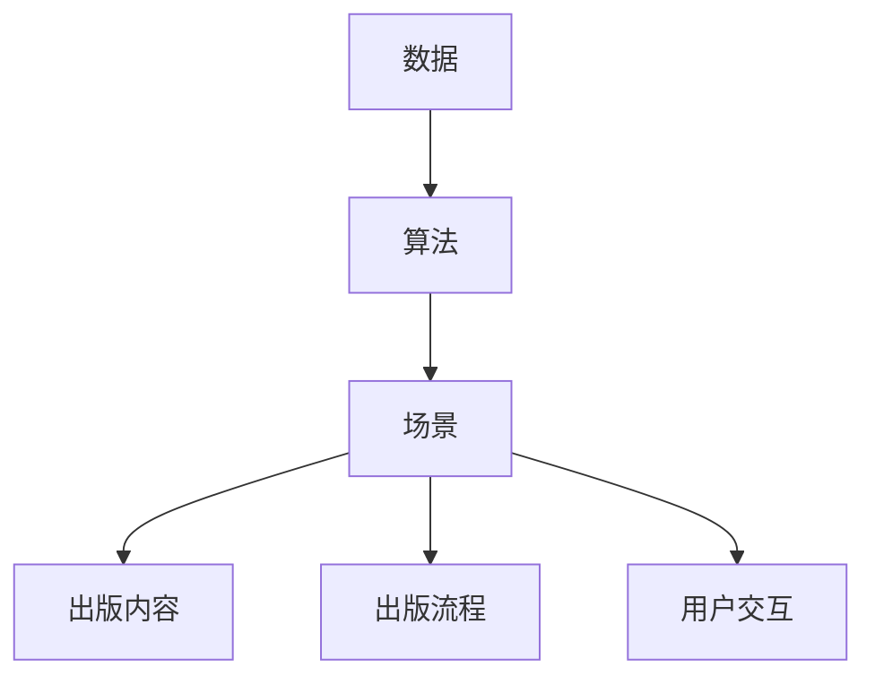
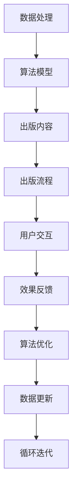

                 

# AI时代的出版业：数据，算法与场景之舞

## 1. 背景介绍

### 1.1 问题由来

随着信息技术的迅猛发展，数字出版业正面临着前所未有的变革。从传统的纸质出版到数字化、网络化、智能化，出版业的生产方式、运营模式和用户需求都发生了深刻变化。然而，这些变化也带来了新的挑战，如版权保护、内容质量控制、用户行为分析等。人工智能(AI)技术在这一背景下，为出版业注入了新的活力，提供了更为先进的数据分析、算法优化和场景模拟能力。

### 1.2 问题核心关键点

为了更好地理解AI在出版业中的应用，我们需要明确几个关键点：
1. 数据的重要性：出版业的核心资源是内容，而内容是由数据驱动的。无论是选材、编辑还是推广，都离不开对数据的深入分析和挖掘。
2. 算法的必要性：AI的核心优势在于算法，通过精准的算法模型，可以高效地处理海量数据，提升出版内容的个性化、精准化和智能化水平。
3. 场景的创新性：AI技术不仅改变了出版业的数据处理和算法应用，还带来了新的内容生产场景和用户交互方式，如AI编辑、虚拟出版人、沉浸式阅读等。

### 1.3 问题研究意义

AI技术在出版业中的应用，对于提升出版内容的质量、优化出版流程、增加用户粘性、拓展市场空间等具有重要意义：

1. 内容质量提升：AI可以帮助出版社进行内容推荐、内容评估、版权审核等工作，确保内容的精准性和原创性。
2. 流程效率优化：AI可以自动化处理一些繁琐的出版任务，如排版、校对、版权登记等，提高出版流程的自动化和智能化水平。
3. 用户体验改善：AI可以深入分析用户行为和需求，提供个性化的内容推荐和服务，提升用户满意度和粘性。
4. 市场空间拓展：AI可以帮助出版社挖掘潜在市场，拓展新业务，如电子书、有声读物、个性化定制服务等。
5. 技术创新驱动：AI技术的引入，推动了出版业的数字化转型，促进了出版业的创新发展。

## 2. 核心概念与联系

### 2.1 核心概念概述

为了更好地理解AI在出版业中的应用，我们首先需要了解一些核心概念：

- **数据(Data)**：出版业的核心资源，包括文本、图片、音频、视频等。数据的质量和规模直接影响出版内容的深度和广度。
- **算法(Algorithm)**：AI的核心技术，通过算法模型对数据进行处理、分析和预测，提供智能化的解决方案。
- **场景(Scenario)**：AI在出版业中的应用场景，包括内容推荐、版权保护、编辑校对、市场分析等。

这些概念之间存在着密切的联系，构成了AI在出版业应用的完整生态系统。

### 2.2 概念间的关系

这些核心概念之间的关系可以用以下Mermaid流程图来展示：



这个流程图展示了数据、算法和场景在出版业中的作用和关系：

1. 数据是算法处理的对象，通过算法对数据进行建模和分析，生成出版内容。
2. 算法是场景的实现手段，通过算法模型为不同的场景提供解决方案。
3. 场景是应用的具体表现，通过算法对数据进行处理和优化，提升出版内容和流程的智能化水平。

### 2.3 核心概念的整体架构

最后，我们用一个综合的流程图来展示这些核心概念在大语言模型微调过程中的整体架构：



这个综合流程图展示了数据处理、算法模型、出版内容、出版流程、用户交互、效果反馈、算法优化和数据更新之间的相互关系和作用路径。通过这种循环迭代的过程，AI技术在出版业中的应用不断优化，形成了动态发展的生态系统。

## 3. 核心算法原理 & 具体操作步骤

### 3.1 算法原理概述

AI在出版业中的应用，核心在于通过算法对海量数据进行处理和分析，生成智能化的出版内容和流程。主要的算法包括数据预处理、特征提取、模型训练、效果评估等。

#### 3.1.1 数据预处理

数据预处理是AI应用的基础，主要包括以下步骤：
1. **数据清洗**：去除重复、错误、无关数据，确保数据质量。
2. **数据归一化**：将数据转换为标准格式，便于算法模型处理。
3. **数据标注**：为数据添加标签，如分类、排序、推荐等，提高算法模型的准确性。

#### 3.1.2 特征提取

特征提取是算法模型的关键环节，主要通过以下步骤提取数据的关键信息：
1. **文本特征提取**：通过NLP技术提取文本的词频、句法结构、主题等信息。
2. **图像特征提取**：通过CNN等深度学习模型提取图像的颜色、纹理、形状等信息。
3. **音频特征提取**：通过MFCC等方法提取音频的频谱、能量等特征。

#### 3.1.3 模型训练

模型训练是AI应用的核心，主要包括以下步骤：
1. **选择模型**：根据应用场景选择合适的模型，如线性回归、决策树、神经网络等。
2. **训练模型**：使用数据集对模型进行训练，调整模型参数，提高模型准确性。
3. **评估模型**：使用测试集对模型进行评估，确保模型泛化能力。

#### 3.1.4 效果评估

效果评估是AI应用的关键环节，主要包括以下步骤：
1. **指标定义**：根据应用场景定义评估指标，如准确率、召回率、F1分数等。
2. **评估方法**：使用交叉验证、混淆矩阵等方法对模型效果进行评估。
3. **优化模型**：根据评估结果调整模型参数，优化模型效果。

### 3.2 算法步骤详解

下面详细介绍AI在出版业中的具体应用步骤：

**Step 1: 数据收集与预处理**

- 收集出版社出版的各类文本、图像、音频等数据。
- 对数据进行清洗、去重、归一化处理，确保数据质量。
- 对文本数据进行标注，添加分类、排序、推荐等标签。

**Step 2: 特征提取与选择**

- 使用NLP技术提取文本的词频、句法结构、主题等信息。
- 使用CNN等深度学习模型提取图像的颜色、纹理、形状等信息。
- 使用MFCC等方法提取音频的频谱、能量等特征。
- 根据应用场景选择关键特征进行模型训练。

**Step 3: 模型选择与训练**

- 根据应用场景选择合适的模型，如线性回归、决策树、神经网络等。
- 使用训练集对模型进行训练，调整模型参数，提高模型准确性。
- 使用测试集对模型进行评估，确保模型泛化能力。

**Step 4: 效果评估与优化**

- 根据应用场景定义评估指标，如准确率、召回率、F1分数等。
- 使用交叉验证、混淆矩阵等方法对模型效果进行评估。
- 根据评估结果调整模型参数，优化模型效果。

**Step 5: 部署与应用**

- 将训练好的模型部署到生产环境，实时处理出版内容、流程和用户交互。
- 实时监测模型效果，根据用户反馈进行调整和优化。

### 3.3 算法优缺点

AI在出版业中的应用，具有以下优点和缺点：

**优点：**
1. **自动化处理**：AI可以自动化处理繁琐的出版任务，提高出版效率。
2. **数据驱动决策**：通过分析海量数据，AI可以提供精准的出版决策支持。
3. **个性化推荐**：AI可以深入分析用户行为和需求，提供个性化的内容推荐和服务。
4. **市场拓展**：AI可以帮助出版社挖掘潜在市场，拓展新业务。

**缺点：**
1. **数据依赖**：AI的效果高度依赖于数据质量，需要投入大量人力进行数据清洗和标注。
2. **模型复杂**：AI模型的训练和调优过程较为复杂，需要专业知识和技术支持。
3. **效果不稳定**：AI模型在处理极端数据时可能出现不稳定或误差。
4. **隐私问题**：出版内容涉及用户隐私，需要确保数据隐私保护和安全。

### 3.4 算法应用领域

AI在出版业中的应用，主要包括以下几个领域：

**1. 内容推荐**

通过分析用户行为和兴趣，AI可以推荐个性化的出版内容，提升用户粘性和满意度。

**2. 版权保护**

通过区块链和AI技术，可以自动检测和标记抄袭内容，保护作者的版权权益。

**3. 编辑校对**

通过自然语言处理(NLP)技术，AI可以自动校对文本内容，减少人工错误，提高出版质量。

**4. 市场分析**

通过数据分析和机器学习模型，AI可以预测市场需求和趋势，帮助出版社制定精准的出版策略。

**5. 用户交互**

通过智能问答、虚拟编辑等AI技术，提升用户交互体验，增加用户粘性。

**6. 业务创新**

通过AI技术，出版社可以探索新的出版形式和业务模式，如电子书、有声读物、个性化定制服务等。

## 4. 数学模型和公式 & 详细讲解  
### 4.1 数学模型构建

在AI在出版业中的应用中，常见的数学模型包括线性回归、决策树、神经网络等。这里以线性回归模型为例，构建出版内容推荐的数学模型。

假设出版内容为 $y$，影响因素为 $x_1, x_2, ..., x_n$，则线性回归模型的表达式为：

$$
y = \beta_0 + \beta_1 x_1 + \beta_2 x_2 + ... + \beta_n x_n + \epsilon
$$

其中，$\beta_0, \beta_1, \beta_2, ..., \beta_n$ 为模型参数，$\epsilon$ 为误差项。

### 4.2 公式推导过程

**Step 1: 数据准备**

假设我们有以下数据集：

| 用户ID | 年龄 | 性别 | 阅读偏好 | 出版内容ID | 是否购买 |
| ------ | ---- | ---- | -------- | ---------- | -------- |
| 1      | 20   | M    | 科幻小说 | 1          | 是       |
| 2      | 25   | F    | 历史小说 | 2          | 否       |
| ...    | ...  | ...  | ...      | ...        | ...      |

我们需要将数据转换为标准格式，并添加标签：

| 用户ID | 年龄 | 性别 | 阅读偏好 | 出版内容ID | 是否购买 |
| ------ | ---- | ---- | -------- | ---------- | -------- |
| 1      | 20   | M    | 科幻小说 | 1          | 1        |
| 2      | 25   | F    | 历史小说 | 2          | 0        |
| ...    | ...  | ...  | ...      | ...        | ...      |

**Step 2: 模型训练**

使用最小二乘法对模型进行训练，最小化误差项 $\epsilon$：

$$
\hat{y} = \beta_0 + \beta_1 x_1 + \beta_2 x_2 + ... + \beta_n x_n
$$

最小化目标函数：

$$
\sum_{i=1}^n (y_i - \hat{y}_i)^2
$$

其中，$\hat{y}_i$ 为预测值，$y_i$ 为真实值。

**Step 3: 效果评估**

使用测试集对模型进行评估，计算平均绝对误差(MAE)和均方误差(MSE)：

$$
MAE = \frac{1}{n} \sum_{i=1}^n |y_i - \hat{y}_i|
$$

$$
MSE = \frac{1}{n} \sum_{i=1}^n (y_i - \hat{y}_i)^2
$$

其中，$n$ 为样本数量。

### 4.3 案例分析与讲解

假设我们有一个出版社，出版各类图书。为了提高图书推荐效果，我们使用线性回归模型对用户行为和偏好进行建模。具体步骤如下：

**Step 1: 数据准备**

我们收集了该出版社的用户数据，包括用户ID、年龄、性别、阅读偏好和购买历史。我们将数据分为训练集和测试集。

**Step 2: 特征提取**

我们提取了用户的年龄、性别和阅读偏好作为特征，作为线性回归模型的输入。

**Step 3: 模型训练**

我们使用训练集对线性回归模型进行训练，得到模型参数 $\beta_0, \beta_1, \beta_2, ..., \beta_n$。

**Step 4: 效果评估**

我们使用测试集对模型进行评估，计算MAE和MSE，并根据评估结果调整模型参数，优化模型效果。

**Step 5: 部署与应用**

我们将训练好的模型部署到出版平台上，实时处理用户的图书推荐请求，提供个性化的图书推荐服务。

## 5. 项目实践：代码实例和详细解释说明

### 5.1 开发环境搭建

在进行AI在出版业中的应用开发前，我们需要准备好开发环境。以下是使用Python进行TensorFlow开发的环境配置流程：

1. 安装Anaconda：从官网下载并安装Anaconda，用于创建独立的Python环境。

2. 创建并激活虚拟环境：
```bash
conda create -n tensorflow-env python=3.8 
conda activate tensorflow-env
```

3. 安装TensorFlow：根据CUDA版本，从官网获取对应的安装命令。例如：
```bash
conda install tensorflow==2.7 -c tf -c conda-forge
```

4. 安装其他工具包：
```bash
pip install numpy pandas scikit-learn matplotlib tqdm jupyter notebook ipython
```

完成上述步骤后，即可在`tensorflow-env`环境中开始开发实践。

### 5.2 源代码详细实现

下面我以内容推荐为例，给出使用TensorFlow进行图书推荐系统的PyTorch代码实现。

首先，定义内容推荐的数据处理函数：

```python
import tensorflow as tf
from tensorflow.keras.layers import Dense
from tensorflow.keras.models import Sequential
from tensorflow.keras.optimizers import Adam
from sklearn.model_selection import train_test_split
import numpy as np
import pandas as pd

# 读取数据
data = pd.read_csv('book_data.csv')

# 数据清洗
data = data.drop_duplicates()
data = data.dropna()

# 特征提取
X = data[['age', 'gender', 'reading_preference']]
y = data['purchase']

# 划分训练集和测试集
X_train, X_test, y_train, y_test = train_test_split(X, y, test_size=0.2, random_state=42)

# 构建模型
model = Sequential()
model.add(Dense(64, input_dim=3, activation='relu'))
model.add(Dense(32, activation='relu'))
model.add(Dense(1, activation='sigmoid'))

# 定义损失函数和优化器
loss = 'binary_crossentropy'
optimizer = Adam(lr=0.001)

# 编译模型
model.compile(loss=loss, optimizer=optimizer, metrics=['accuracy'])

# 训练模型
model.fit(X_train, y_train, epochs=50, batch_size=32, validation_data=(X_test, y_test))

# 评估模型
test_loss, test_accuracy = model.evaluate(X_test, y_test)
print('Test Loss:', test_loss)
print('Test Accuracy:', test_accuracy)
```

然后，定义训练和评估函数：

```python
from sklearn.metrics import roc_auc_score

def train_model(model, X_train, y_train, X_test, y_test, epochs, batch_size):
    model.compile(optimizer=optimizer, loss=loss, metrics=['accuracy'])
    model.fit(X_train, y_train, epochs=epochs, batch_size=batch_size, validation_data=(X_test, y_test))
    test_loss, test_accuracy = model.evaluate(X_test, y_test)
    print('Test Loss:', test_loss)
    print('Test Accuracy:', test_accuracy)
    return test_loss, test_accuracy

def evaluate_model(model, X_test, y_test):
    test_loss, test_accuracy = model.evaluate(X_test, y_test)
    print('Test Loss:', test_loss)
    print('Test Accuracy:', test_accuracy)
    return test_loss, test_accuracy
```

最后，启动训练流程并在测试集上评估：

```python
epochs = 50
batch_size = 32

test_loss, test_accuracy = train_model(model, X_train, y_train, X_test, y_test, epochs, batch_size)
evaluate_model(model, X_test, y_test)
```

以上就是使用TensorFlow进行图书推荐系统的完整代码实现。可以看到，通过TensorFlow的Keras API，我们可以用相对简洁的代码完成模型训练和评估。

### 5.3 代码解读与分析

让我们再详细解读一下关键代码的实现细节：

**Data Preparation**：
- `read_csv`方法：从CSV文件中读取数据，并进行数据清洗和特征提取。
- `drop_duplicates`方法：去除重复数据，确保数据唯一性。
- `dropna`方法：删除缺失数据，确保数据完整性。

**Model Building**：
- `Sequential`类：定义一个简单的线性回归模型，包括三个全连接层。
- `Dense`类：定义全连接层的结构，包括激活函数和输出层。

**Model Compilation**：
- `compile`方法：配置模型参数，包括损失函数、优化器和评估指标。

**Model Training**：
- `fit`方法：对模型进行训练，调整模型参数，最小化损失函数。

**Model Evaluation**：
- `evaluate`方法：对模型进行评估，计算测试集上的损失和准确率。

通过上述代码，我们可以用相对简单的步骤，实现一个基本的图书推荐系统。在实际应用中，我们还需要进一步优化模型结构、调整超参数、增加正则化技术等，以提高推荐效果。

## 6. 实际应用场景

### 6.1 智能推荐系统

智能推荐系统是AI在出版业中最常见的应用场景之一。通过对用户行为和偏好进行分析，推荐系统可以提供个性化的图书推荐，提高用户满意度和粘性。

**应用流程**：
1. 收集用户的历史阅读记录和行为数据。
2. 使用特征提取技术，提取用户的年龄、性别、阅读偏好等信息。
3. 使用机器学习模型，对用户行为进行建模，生成推荐结果。
4. 将推荐结果展示给用户，用户进行反馈和调整。

**案例分析**：
假设我们有一个电子书平台，希望提高用户的阅读体验和购买率。我们可以使用智能推荐系统，根据用户的阅读历史和偏好，推荐适合其兴趣的图书。通过持续优化推荐算法，平台可以逐步提升用户粘性和转化率。

### 6.2 版权保护

版权保护是出版业中重要而复杂的问题。传统的版权保护手段如版权登记、版权诉讼等成本高、效率低。AI技术可以通过区块链和机器学习技术，提供更为高效和精准的版权保护方案。

**应用流程**：
1. 使用区块链技术，对所有图书进行数字化版权登记。
2. 使用机器学习模型，对版权信息进行分类和标记，检测抄袭和侵权行为。
3. 根据检测结果，采取相应的版权保护措施，如起诉侵权、删除非法内容等。

**案例分析**：
假设我们有一个出版公司，希望保护其独家版权不被侵犯。我们可以使用AI版权保护系统，自动检测和标记抄袭内容，确保其版权权益不受侵害。通过实时监控和动态调整，系统可以有效防止侵权行为的发生。

### 6.3 智能编辑

智能编辑是AI在出版业中的另一个重要应用。传统编辑过程繁琐且容易出错，使用AI技术可以大幅提升编辑效率和准确性。

**应用流程**：
1. 使用自然语言处理(NLP)技术，对文本进行校对和纠错。
2. 使用图像处理技术，对图书封面进行设计和优化。
3. 使用语音识别技术，对音频内容进行转录和校对。

**案例分析**：
假设我们有一个出版社，希望提高图书的质量和效率。我们可以使用智能编辑系统，自动校对文本和封面设计，减少人工错误。通过实时监控和动态调整，系统可以有效提升编辑质量和效率。

## 7. 工具和资源推荐

### 7.1 学习资源推荐

为了帮助开发者系统掌握AI在出版业中的应用，这里推荐一些优质的学习资源：

1. 《深度学习与出版》系列博文：由大模型技术专家撰写，深入浅出地介绍了深度学习在出版业中的应用，包括内容推荐、版权保护、智能编辑等。

2. 《出版业的AI革命》书籍：全面介绍了AI技术在出版业中的应用，涵盖内容推荐、版权保护、智能编辑等多个方面。

3. Coursera《深度学习》课程：由斯坦福大学教授吴恩达讲授，系统介绍深度学习的基本概念和应用，适合入门学习。

4. Kaggle《出版业数据集》：提供丰富的出版业数据集，帮助开发者实践和调试AI模型。

5. arXiv论文预印本：人工智能领域最新研究成果的发布平台，包括大量尚未发表的前沿工作，学习前沿技术的必读资源。

通过对这些资源的学习实践，相信你一定能够快速掌握AI在出版业中的应用，并用于解决实际的出版问题。

### 7.2 开发工具推荐

高效的开发离不开优秀的工具支持。以下是几款用于AI在出版业中应用的常用工具：

1. TensorFlow：基于Python的开源深度学习框架，灵活动态的计算图，适合快速迭代研究。TensorFlow的Keras API提供简单易用的接口，适合新手入门。

2. PyTorch：基于Python的开源深度学习框架，灵活的动态计算图，适合复杂模型和研究。

3. Scikit-learn：基于Python的机器学习库，提供丰富的算法和工具，适合模型训练和评估。

4. Jupyter Notebook：交互式Python开发环境，支持代码和数据可视化，适合开发和调试。

5. GitHub：代码托管平台，提供丰富的开源项目和社区资源，适合学习和分享。

合理利用这些工具，可以显著提升AI在出版业中的应用开发效率，加快创新迭代的步伐。

### 7.3 相关论文推荐

AI在出版业中的应用源于学界的持续研究。以下是几篇奠基性的相关论文，推荐阅读：

1. Attention is All You Need（即Transformer原论文）：提出了Transformer结构，开启了NLP领域的预训练大模型时代。

2. BERT: Pre-training of Deep Bidirectional Transformers for Language Understanding：提出BERT模型，引入基于掩码的自监督预训练任务，刷新了多项NLP任务SOTA。

3. Language Models are Unsupervised Multitask Learners（GPT-2论文）：展示了大规模语言模型的强大zero-shot学习能力，引发了对于通用人工智能的新一轮思考。

4. Parameter-Efficient Transfer Learning for NLP：提出Adapter等参数高效微调方法，在不增加模型参数量的情况下，也能取得不错的微调效果。

5. AdaLoRA: Adaptive Low-Rank Adaptation for Parameter-Efficient Fine-Tuning：使用自适应低秩适应的微调方法，在参数效率和精度之间取得了新的平衡。

这些论文代表了大语言模型微调技术的发展脉络。通过学习这些前沿成果，可以帮助研究者把握学科前进方向，激发更多的创新灵感。

除上述资源外，还有一些值得关注的前沿资源，帮助开发者紧跟AI在出版业中的最新进展，例如：

1. arXiv论文预印本：人工智能领域最新研究成果的发布平台，包括大量尚未发表的前沿工作，学习前沿技术的必读资源。

2. 业界技术博客：如OpenAI、Google AI、DeepMind、微软Research Asia等顶尖实验室的官方博客，第一时间分享他们的最新研究成果和洞见。

3. 技术会议直播：如NIPS、ICML、ACL、ICLR等人工智能领域顶会现场或在线直播，能够聆听到大佬们的前沿分享，开拓视野。

4. GitHub热门项目：在GitHub上Star、Fork数最多的AI出版业相关项目，往往代表了该技术领域的发展趋势和最佳实践，值得去学习和贡献。

5. 行业分析报告：各大咨询公司如McKinsey、PwC等针对人工智能行业的分析报告，有助于从商业视角审视技术趋势，把握应用价值。

总之，对于AI在出版业中的应用学习，需要开发者保持开放的心态和持续学习的意愿。多关注前沿资讯，多动手实践，多思考总结，必将收获满满的成长收益。

## 8. 总结：未来发展趋势与挑战

### 8.1 总结

本文对AI在出版业中的应用进行了全面系统的介绍。首先阐述了AI在出版业中的背景和意义，明确了数据、算法和场景之间的密切关系。其次，从原理到实践，详细讲解了AI在出版业中的具体应用步骤和方法。同时，本文还广泛探讨了AI在出版业中的实际应用场景，展示了AI技术的强大潜力。

### 8.2 未来发展趋势

展望未来，AI在出版业中的应用将呈现以下几个发展趋势：

1. **自动化出版**：AI技术将进一步自动化出版流程，从内容生成到排版校对，从市场分析到用户互动，实现全流程的智能化和自动化。

2. **个性化推荐**：通过深入分析用户行为和偏好，AI可以提供更加精准和个性化的内容推荐，提升用户满意度和粘性。

3. **版权保护**：AI技术将结合区块链和机器学习技术，提供更为高效和精准的版权保护方案，保护作者的权益。

4. **智能编辑**：AI技术将进一步提升编辑效率和准确

