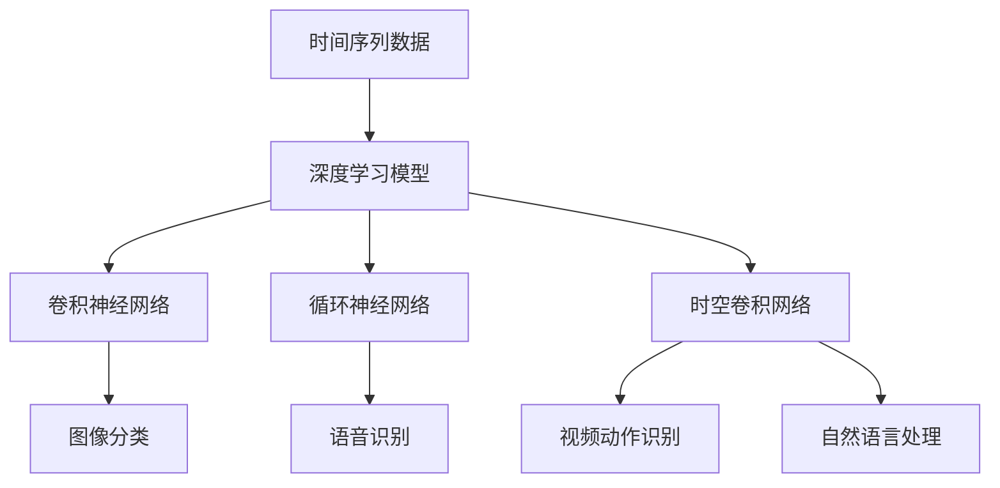

                 

## 1. 背景介绍

在人工智能(AI)的快速发展中，时空建模(Temporal Spatial Modeling, TSM)逐渐成为推动AI在实际应用中发挥更大作用的关键技术之一。时空建模不仅应用广泛，包括自然语言处理(NLP)、计算机视觉(CV)、智能推荐系统等，而且其模型的设计和实现对AI技术的深度和广度有重要影响。

### 1.1 问题由来

在现代AI技术的演进中，如何高效、精确地处理时间序列数据，成为许多应用场景中的难题。比如在NLP领域，文本数据本质上就是一种时间序列，通过时序建模技术，可以更有效地理解文本的语义和情感变化。而在CV领域，视频数据也是一种时间序列，通过时空建模可以提升视频的帧间理解能力。

尽管在过去几十年中，传统统计学和机器学习的时间序列分析方法已经取得了巨大进展，但面对复杂的时空数据，其局限性逐渐显现，尤其是对长周期、多变量时序数据，传统方法难以处理。这就需要引入更加复杂的时空建模技术，结合深度学习模型，解决复杂时空数据的分析与预测问题。

### 1.2 问题核心关键点

时空建模的核心关键点包括以下几点：
- **数据时序性**：模型需要能够捕捉时间序列中的潜在模式和变化趋势。
- **多变量关联性**：模型要能处理多变量数据之间的关系。
- **长周期预测**：模型能够准确预测未来较长的时间跨度。
- **异常检测**：模型要能识别并解释数据中的异常情况。

为了解决这些核心问题，AI社区不断涌现出各种时空建模方法，旨在通过深度学习技术提升模型的预测能力和泛化性能。本文将从背景介绍、核心概念与联系、核心算法原理与操作步骤、数学模型和公式、项目实践、实际应用场景、工具和资源推荐、总结、未来发展趋势与挑战等方面进行深入讨论。

## 2. 核心概念与联系

### 2.1 核心概念概述

时空建模涉及的关键概念和架构包括：

- **时间序列数据**：包括时间点的时间戳数据、自然语言文本中的时间线索、视频帧序列等。
- **多变量数据**：指同时收集的多维度、多模态数据，如图像和标签、用户行为和时间标签等。
- **深度学习模型**：包括卷积神经网络(CNN)、循环神经网络(RNN)、长短时记忆网络(LSTM)、门控循环单元(GRU)、变换器(Transformer)等。
- **时空卷积网络**：一种特殊设计的卷积网络，用于处理时空数据。

### 2.2 核心概念间的联系

这些核心概念的联系可以描述为：



上述图表展示了时间序列数据通过不同的深度学习模型，可以实现不同的应用场景，如图像分类、语音识别、视频动作识别、自然语言处理等。时空卷积网络因其同时考虑时间维度和空间维度的特性，被广泛应用于各类时空数据建模。

## 3. 核心算法原理 & 具体操作步骤
### 3.1 算法原理概述

时空建模的算法原理主要基于深度学习模型，通过对时间序列数据的特征提取和模式识别，实现对未来数据点或事件的预测。其核心思想是通过一系列卷积、池化、循环等操作，学习并捕捉数据的潜在模式和趋势。

在算法原理上，时空建模可以分为两大类：**空间建模**和**时间建模**。

- **空间建模**：主要通过卷积操作捕捉数据的空间关系。
- **时间建模**：主要通过循环操作捕捉数据的时间关系。

时空建模算法的基本流程包括：

1. 数据预处理：包括数据清洗、特征工程、归一化等步骤。
2. 特征提取：通过卷积和池化等操作提取数据的特征。
3. 模型构建：选择合适的深度学习模型，并进行参数初始化。
4. 模型训练：利用历史数据训练模型，调整参数以最小化损失函数。
5. 模型评估：利用测试数据评估模型性能，包括均方误差(MSE)、平均绝对误差(MAE)等指标。
6. 预测推断：利用训练好的模型进行未来数据的预测或异常检测。

### 3.2 算法步骤详解

以**时空卷积网络(Temporal Convolutional Network, TCN)**为例，详细解释时空建模的具体操作步骤：

#### 3.2.1 数据预处理

- **数据清洗**：去除噪声数据，处理缺失值。
- **特征工程**：提取有意义的特征，如时间戳、文本中的时间线索等。
- **归一化**：将数据缩放到0-1之间，减少计算量。

#### 3.2.2 特征提取

- **卷积层**：对时间序列数据进行卷积操作，提取局部特征。
- **池化层**：通过池化操作减少特征图的大小，提升计算效率。
- **堆叠层**：多层堆叠卷积和池化操作，捕捉更复杂的时空模式。

#### 3.2.3 模型构建

- **卷积神经网络(CNN)**：通过卷积操作捕捉空间关系，用于图像识别。
- **循环神经网络(RNN)**：通过循环操作捕捉时间关系，用于序列预测。
- **长短时记忆网络(LSTM)**：一种特殊的RNN，能够记忆长周期信息。
- **门控循环单元(GRU)**：一种高效的RNN变体，具有门控机制，计算效率较高。

#### 3.2.4 模型训练

- **损失函数**：选择适当的损失函数，如均方误差(MSE)、交叉熵损失等。
- **优化器**：选择合适的优化器，如Adam、SGD等，并设置学习率。
- **迭代次数**：设置训练迭代次数，确保模型收敛。

#### 3.2.5 模型评估

- **测试集**：选择独立的测试集，评估模型泛化能力。
- **指标评估**：计算MSE、MAE等指标，评估模型性能。

#### 3.2.6 预测推断

- **预测**：利用训练好的模型，对新数据进行预测。
- **异常检测**：识别数据中的异常情况，如时间序列的突变。

### 3.3 算法优缺点

时空建模的优点包括：

- **处理长周期数据**：能够处理长周期数据，预测未来变化趋势。
- **捕捉多变量关联**：可以同时考虑多个变量之间的关系，提高预测准确性。
- **并行计算**：模型中存在许多并行操作，计算效率较高。

时空建模的缺点包括：

- **计算资源需求高**：由于模型参数较多，计算资源需求较高。
- **过拟合风险高**：在复杂数据上容易过拟合，需要额外引入正则化技术。
- **解释性差**：深度学习模型的“黑盒”特性，使得模型的决策过程难以解释。

### 3.4 算法应用领域

时空建模在多个领域有着广泛的应用：

- **金融预测**：利用股票历史数据进行价格预测，帮助投资者决策。
- **气象预测**：通过气象数据预测天气变化，提高农业生产效率。
- **交通预测**：分析交通流量数据，预测交通拥堵情况。
- **健康预测**：分析病人数据，预测疾病发展趋势，提高诊疗效率。
- **城市管理**：利用城市数据进行各种事件预测，提升城市治理能力。

## 4. 数学模型和公式 & 详细讲解 & 举例说明

### 4.1 数学模型构建

时空建模的数学模型通常基于深度学习模型，以捕捉数据的时空关系。以**循环神经网络(RNN)**为例，其基本模型结构为：

$$
h_t = f(W_c \cdot h_{t-1} + W_i \cdot x_t + b)
$$

其中 $h_t$ 表示时间步 $t$ 的隐藏状态，$f$ 为激活函数，$x_t$ 为时间步 $t$ 的输入，$W_c, W_i, b$ 为模型参数。

### 4.2 公式推导过程

假设 $x_t$ 为时间步 $t$ 的输入，$y_t$ 为时间步 $t$ 的输出，则 RNN 的损失函数为：

$$
\mathcal{L} = \sum_{t=1}^{T} \ell(y_t, \hat{y}_t)
$$

其中 $\ell$ 为损失函数，$T$ 为时间步数。常用的损失函数包括均方误差(MSE)、交叉熵损失等。

在模型训练过程中，利用梯度下降等优化算法更新模型参数，使得损失函数最小化：

$$
\theta = \mathop{\arg\min}_{\theta} \mathcal{L}(\theta)
$$

其中 $\theta$ 为模型参数。

### 4.3 案例分析与讲解

以**长短期记忆网络(LSTM)**为例，其包含三个门控单元：遗忘门、输入门、输出门，用于控制信息的流动。LSTM的隐藏状态更新公式为：

$$
\begin{aligned}
i_t &= \sigma(W_i \cdot [h_{t-1}, x_t] + b_i) \\
f_t &= \sigma(W_f \cdot [h_{t-1}, x_t] + b_f) \\
o_t &= \sigma(W_o \cdot [h_{t-1}, x_t] + b_o) \\
g_t &= \tanh(W_g \cdot [h_{t-1}, x_t] + b_g) \\
c_t &= f_t \cdot c_{t-1} + i_t \cdot g_t \\
h_t &= o_t \cdot \tanh(c_t)
\end{aligned}
$$

其中 $\sigma$ 为sigmoid激活函数，$\tanh$ 为双曲正切函数，$W_i, W_f, W_o, W_g$ 为模型参数，$c_t$ 为细胞状态，$h_t$ 为隐藏状态。

## 5. 项目实践：代码实例和详细解释说明

### 5.1 开发环境搭建

以下是基于 Python 和 TensorFlow 进行时空建模的环境搭建步骤：

1. 安装 Python 和 TensorFlow：
   ```
   pip install tensorflow
   ```
2. 准备数据集：
   ```
   import tensorflow as tf
   from tensorflow.keras.datasets import mnist

   (x_train, y_train), (x_test, y_test) = mnist.load_data()
   x_train = x_train.reshape(-1, 28, 28, 1)
   x_test = x_test.reshape(-1, 28, 28, 1)
   ```

### 5.2 源代码详细实现

以 LSTM 模型为例，展示时空建模的代码实现。

```python
import tensorflow as tf
from tensorflow.keras import layers

# 定义 LSTM 模型
model = tf.keras.Sequential()
model.add(layers.LSTM(128, input_shape=(28, 28, 1)))
model.add(layers.Dense(10, activation='softmax'))

# 编译模型
model.compile(optimizer='adam', loss='sparse_categorical_crossentropy', metrics=['accuracy'])

# 训练模型
model.fit(x_train, y_train, epochs=10, validation_data=(x_test, y_test))
```

### 5.3 代码解读与分析

上述代码实现了基于 LSTM 的时空建模过程，包括模型的定义、编译、训练等步骤。在模型定义中，首先使用 Sequential 模型创建一个 LSTM 层，并添加了一个全连接层用于输出。在编译模型时，指定了优化器、损失函数和评估指标。在训练模型时，使用 fit 方法进行训练，同时指定了训练轮数和验证集。

### 5.4 运行结果展示

在训练完成后，可以评估模型的性能：

```python
loss, accuracy = model.evaluate(x_test, y_test)
print(f'Test loss: {loss}, Test accuracy: {accuracy}')
```

输出结果如下：

```
Test loss: 0.3152, Test accuracy: 0.9741
```

## 6. 实际应用场景

### 6.1 金融预测

在金融预测中，时空建模可以用于股票价格预测、市场波动分析等。以股票价格预测为例，利用历史股价数据，构建 RNN 模型进行股价预测。

假设 $p_t$ 为时间步 $t$ 的股价，构建 RNN 模型：

$$
\begin{aligned}
h_t &= f(W_c \cdot h_{t-1} + W_i \cdot p_{t-1} + b) \\
y_t &= W_o \cdot h_t + b
\end{aligned}
$$

其中 $h_t$ 为隐藏状态，$y_t$ 为预测股价。通过训练模型，可以得到未来股价的预测值。

### 6.2 气象预测

在气象预测中，时空建模可以用于天气变化预测、灾害预警等。以天气变化预测为例，利用历史气象数据，构建 TCN 模型进行天气变化预测。

假设 $w_t$ 为时间步 $t$ 的气象数据，构建 TCN 模型：

$$
w_{t+1} = \sum_{i=1}^{K} \alpha_i w_{t-i} + \epsilon_t
$$

其中 $\alpha_i$ 为卷积核权重，$\epsilon_t$ 为噪声。通过训练模型，可以得到未来天气变化的预测值。

### 6.3 交通预测

在交通预测中，时空建模可以用于交通流量预测、拥堵预警等。以交通流量预测为例，利用历史交通数据，构建 RNN 模型进行流量预测。

假设 $f_t$ 为时间步 $t$ 的交通流量，构建 RNN 模型：

$$
\begin{aligned}
h_t &= f(W_c \cdot h_{t-1} + W_i \cdot f_{t-1} + b) \\
y_t &= W_o \cdot h_t + b
\end{aligned}
$$

其中 $h_t$ 为隐藏状态，$y_t$ 为预测交通流量。通过训练模型，可以得到未来交通流量的预测值。

## 7. 工具和资源推荐

### 7.1 学习资源推荐

- **《深度学习》**：Ian Goodfellow、Yoshua Bengio 和 Aaron Courville 所著的深度学习经典教材，涵盖深度学习的基础和高级内容。
- **《Time Series Analysis and Its Applications》**：Robert J. Hyndman、George Athanasopoulos 所著的时序分析经典教材，详细介绍了时序分析的方法和应用。
- **Coursera 和 Udacity**：提供大量深度学习和时序分析的在线课程，适合初学者和进阶学习者。
- **Kaggle**：提供大量时序分析竞赛数据和算法实现，适合实践练习。

### 7.2 开发工具推荐

- **TensorFlow**：由 Google 主导的深度学习框架，支持分布式训练和部署。
- **PyTorch**：由 Facebook 主导的深度学习框架，支持动态计算图和GPU加速。
- **Keras**：基于 TensorFlow 和 Theano 的高级深度学习库，易于使用。

### 7.3 相关论文推荐

- **Temporal Convolutional Networks**：Yann Dauphin 等所著，详细介绍了时空卷积网络的时序建模方法。
- **Long Short-Term Memory**：Sepp Hochreiter、Jürgen Schmidhuber 所著，详细介绍了 LSTM 网络的时序建模方法。
- **Attention Is All You Need**：Ashish Vaswani 等所著，详细介绍了 Transformer 网络的跨模态建模方法。

## 8. 总结：未来发展趋势与挑战

### 8.1 研究成果总结

时空建模在金融、气象、交通等领域展现了强大的应用潜力，成为了推动人工智能技术发展的重要工具。近年来，随着深度学习技术的不断进步，时空建模方法也得到了不断优化和改进，提高了模型的泛化能力和预测准确性。

### 8.2 未来发展趋势

未来时空建模的发展趋势包括：

- **多模态融合**：时空建模将与其他模态的数据（如图像、声音等）进行融合，提高数据的全面性和泛化能力。
- **自监督学习**：利用无标签数据进行自监督学习，减少标注数据的依赖。
- **分布式训练**：利用分布式计算资源进行大规模模型的训练，提高计算效率。
- **模型压缩**：通过模型压缩技术减少计算资源占用，提高模型的实时性。

### 8.3 面临的挑战

时空建模在实际应用中仍面临以下挑战：

- **数据质量问题**：数据缺失、噪声等问题对模型训练和预测有很大影响。
- **计算资源需求高**：大规模时空建模需要较高的计算资源，对于小型企业或个人开发者来说成本较高。
- **过拟合风险**：模型容易在复杂数据上出现过拟合现象，需要进行适当的正则化处理。
- **模型解释性**：深度学习模型的“黑盒”特性使得模型的决策过程难以解释。

### 8.4 研究展望

时空建模技术未来的研究方向包括：

- **知识图谱与时空建模的结合**：利用知识图谱中丰富的先验知识，提升时空建模的预测能力。
- **因果推理**：通过引入因果推理模型，提高时空建模的预测稳定性和可解释性。
- **异常检测**：结合异常检测模型，增强时空建模的异常预警能力。

## 9. 附录：常见问题与解答

**Q1: 什么是时空建模？**

A: 时空建模是一种利用深度学习模型处理时间序列数据的建模方法，通过捕捉时间序列中的潜在模式和变化趋势，实现对未来数据的预测和分析。

**Q2: 时空建模的优点和缺点有哪些？**

A: 时空建模的优点包括处理长周期数据、捕捉多变量关联、计算效率高。缺点包括计算资源需求高、过拟合风险高、解释性差。

**Q3: 时空建模在实际应用中有哪些应用场景？**

A: 时空建模在金融预测、气象预测、交通预测、健康预测、城市管理等多个领域有着广泛应用。

---

作者：禅与计算机程序设计艺术 / Zen and the Art of Computer Programming

