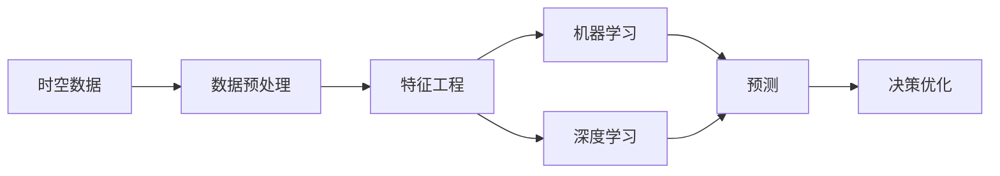
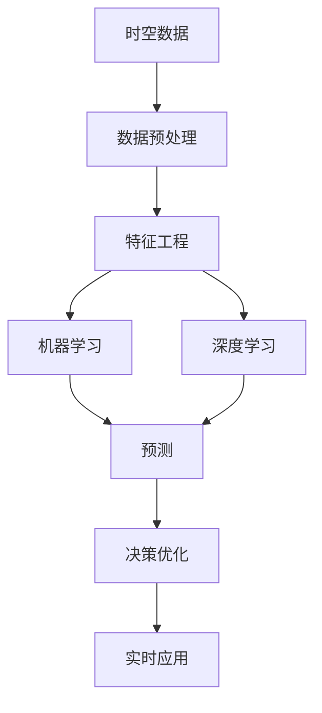

                 

# AI时空建模的未来趋势

在人工智能的迅猛发展中，AI时空建模已经成为了一种颠覆性技术，正广泛应用于金融、物流、医疗、交通等领域。时空建模技术利用时空数据，通过机器学习和深度学习算法，可以预测未来趋势、优化决策流程、提升效率。本文将深入探讨AI时空建模的未来趋势，通过对其核心概念、算法原理、实际应用等进行详细分析，帮助读者理解这一领域的最新进展与挑战。

## 1. 背景介绍

### 1.1 问题由来

随着大数据和人工智能技术的不断发展，AI时空建模的应用场景日益增多。例如，金融领域需要预测股票市场趋势、风险评估，物流领域需要优化运输路线、提高配送效率，医疗领域需要预测疾病流行、优化诊疗流程，交通领域需要优化交通管理、提高出行安全。AI时空建模技术的核心在于通过时空数据的挖掘和分析，预测未来趋势，优化决策流程，提升效率，具有广阔的应用前景。

### 1.2 问题核心关键点

AI时空建模的核心在于将时间与空间数据结合起来，通过机器学习和深度学习算法，预测未来趋势，优化决策流程。其关键点包括：
1. 数据采集与预处理：采集时空数据，清洗、处理缺失值和异常值，确保数据质量。
2. 特征工程：提取、构造时空特征，如时间间隔、地理位置、人口密度等。
3. 模型训练：选择、训练和优化模型，如时间序列预测、空间预测、时空交互预测等。
4. 模型评估：评估模型的性能，如准确率、均方误差、召回率等指标。
5. 应用部署：将模型集成到实际系统中，进行实时预测和决策优化。

### 1.3 问题研究意义

AI时空建模技术的广泛应用，不仅能够提升各个行业的运营效率，还能实现精准预测、智能化决策，具有以下重要意义：
1. 提高决策效率：通过实时预测和智能决策，优化运营流程，减少人工干预。
2. 增强业务洞察：通过时空数据挖掘和分析，获得更深入的业务洞察，发现潜在机会和风险。
3. 提升用户体验：通过预测和优化，提升服务质量和用户体验，满足客户需求。
4. 促进创新发展：推动技术创新，应用到更多领域，带来新的商业机会和价值。

## 2. 核心概念与联系

### 2.1 核心概念概述

AI时空建模的核心概念主要包括时空数据、机器学习、深度学习、预测与优化等。这些概念之间存在着紧密的联系，构成了AI时空建模的完整生态系统。

#### 2.1.1 时空数据

时空数据是指包含时间和空间信息的数据，如GPS轨迹、气象数据、交通流量等。时空数据的特点是维度高、复杂性强，需要进行有效的数据采集、清洗和处理。

#### 2.1.2 机器学习

机器学习是AI时空建模的核心技术之一，通过训练模型，使计算机能够从数据中学习规律，进行预测和决策。机器学习算法包括监督学习、无监督学习和强化学习等。

#### 2.1.3 深度学习

深度学习是机器学习的高级形式，通过构建深层神经网络，自动提取特征，提高模型的复杂度和准确度。深度学习算法如卷积神经网络、循环神经网络等，在时空建模中具有广泛应用。

#### 2.1.4 预测与优化

预测是指通过时空数据和模型，预测未来趋势，如股票价格、天气变化等。优化是指通过预测结果，进行决策优化，如调整交通流量、优化生产流程等。

### 2.2 概念间的关系

这些核心概念之间存在着紧密的联系，构成了AI时空建模的完整生态系统。通过以下Mermaid流程图来展示：



这个流程图展示了时空数据、数据预处理、特征工程、机器学习和深度学习之间的联系。数据预处理和特征工程是基础，机器学习和深度学习是核心，预测与优化是应用。

### 2.3 核心概念的整体架构

最后，我们用一个综合的流程图来展示这些核心概念在大模型微调过程中的整体架构：



这个综合流程图展示了时空数据的预处理、特征工程、机器学习和深度学习之间的联系。预测与优化是应用，实时应用是最终目标。

## 3. 核心算法原理 & 具体操作步骤

### 3.1 算法原理概述

AI时空建模的本质是通过机器学习和深度学习算法，利用时空数据，预测未来趋势，优化决策流程。其核心在于数据的处理和模型的训练。

### 3.2 算法步骤详解

AI时空建模的算法步骤通常包括以下几个关键步骤：

**Step 1: 数据采集与预处理**
- 采集时空数据，包括时间戳、地理位置、速度、温度等。
- 清洗数据，处理缺失值和异常值，确保数据质量。

**Step 2: 特征工程**
- 提取时空特征，如时间间隔、地理位置、人口密度等。
- 构造新特征，如时间趋势、空间分布等。
- 进行特征选择，保留重要特征，剔除无关特征。

**Step 3: 模型训练**
- 选择适当的模型，如时间序列预测模型、空间预测模型、时空交互预测模型等。
- 训练模型，选择训练算法，如梯度下降、随机森林、神经网络等。
- 优化模型，调整超参数，提高模型精度。

**Step 4: 模型评估**
- 评估模型的性能，如准确率、均方误差、召回率等指标。
- 进行交叉验证，避免过拟合。
- 选择最佳模型，用于实际应用。

**Step 5: 应用部署**
- 将模型集成到实际系统中，进行实时预测和决策优化。
- 提供API接口，供其他系统调用。
- 进行监控和维护，保证系统稳定运行。

### 3.3 算法优缺点

AI时空建模算法具有以下优点：
1. 预测准确度高：通过时空数据的挖掘和分析，可以准确预测未来趋势。
2. 决策优化能力强：通过预测结果，优化决策流程，提高效率。
3. 适用范围广：适用于多个领域，如金融、物流、医疗、交通等。
4. 可扩展性强：可以根据需求，进行模型扩展和优化。

同时，也存在以下缺点：
1. 数据需求大：需要大量的时空数据，数据采集和清洗工作量大。
2. 模型复杂度高：时空数据维度高，模型复杂度大，训练时间长。
3. 结果可解释性差：深度学习模型难以解释其内部工作机制。
4. 需要专业人才：需要具备数据科学、机器学习等相关专业知识的人才。

### 3.4 算法应用领域

AI时空建模技术已经在多个领域得到广泛应用，例如：

- 金融领域：用于预测股票价格、风险评估、信用评级等。
- 物流领域：用于优化运输路线、提高配送效率、库存管理等。
- 医疗领域：用于预测疾病流行、优化诊疗流程、资源配置等。
- 交通领域：用于优化交通管理、提高出行安全、交通流量预测等。
- 城市规划：用于预测城市发展趋势、优化城市布局、资源配置等。
- 环境监测：用于预测环境污染、优化资源配置、环境治理等。

除了上述这些经典应用外，AI时空建模技术还在更多场景中得到创新性应用，如智能家居、智能农业、智能制造等，为多个行业带来新的机遇和挑战。

## 4. 数学模型和公式 & 详细讲解 & 举例说明

### 4.1 数学模型构建

AI时空建模的核心在于通过时空数据的挖掘和分析，预测未来趋势，优化决策流程。我们可以用数学模型来描述这一过程。

假设时空数据为 $X = (x_1, x_2, ..., x_n)$，其中 $x_i = (t_i, s_i, f_i)$，$t_i$ 表示时间，$s_i$ 表示地理位置，$f_i$ 表示特征值。

定义预测模型为 $Y = M(X)$，其中 $Y = (y_1, y_2, ..., y_n)$，$y_i$ 表示预测结果。

### 4.2 公式推导过程

以下我们以时间序列预测模型为例，推导其公式及其梯度计算。

假设模型 $M_{\theta}$ 在输入 $X$ 上的输出为 $\hat{Y}=M_{\theta}(X) \in [0,1]$，表示样本属于某一类别的概率。真实标签 $Y \in \{0,1\}$。则二分类交叉熵损失函数定义为：

$$
\ell(M_{\theta}(X),Y) = -[Y\log \hat{Y} + (1-Y)\log (1-\hat{Y})]
$$

将其代入经验风险公式，得：

$$
\mathcal{L}(\theta) = -\frac{1}{N}\sum_{i=1}^N [Y_i\log M_{\theta}(X_i)+(1-Y_i)\log(1-M_{\theta}(X_i))]
$$

根据链式法则，损失函数对参数 $\theta$ 的梯度为：

$$
\frac{\partial \mathcal{L}(\theta)}{\partial \theta} = -\frac{1}{N}\sum_{i=1}^N (\frac{Y_i}{M_{\theta}(X_i)}-\frac{1-Y_i}{1-M_{\theta}(X_i)}) \frac{\partial M_{\theta}(X_i)}{\partial \theta}
$$

其中 $\frac{\partial M_{\theta}(X_i)}{\partial \theta}$ 可进一步递归展开，利用自动微分技术完成计算。

在得到损失函数的梯度后，即可带入参数更新公式，完成模型的迭代优化。重复上述过程直至收敛，最终得到适应下游任务的最优模型参数 $\theta^*$。

### 4.3 案例分析与讲解

以金融领域的股票价格预测为例，假设我们收集了历史股票价格数据 $X = (x_1, x_2, ..., x_n)$，其中 $x_i = (t_i, s_i, f_i)$，$t_i$ 表示时间，$s_i$ 表示交易量，$f_i$ 表示基本面指标。

定义预测模型为 $M_{\theta}$，在输入 $X$ 上的输出为 $\hat{Y}=M_{\theta}(X) \in [0,1]$，表示下一天股票价格涨跌的概率。

模型的训练过程如下：

**Step 1: 数据采集与预处理**
- 收集历史股票价格数据，清洗缺失值和异常值。
- 将数据分为训练集、验证集和测试集。

**Step 2: 特征工程**
- 提取时空特征，如时间间隔、交易量、基本面指标等。
- 构造新特征，如时间趋势、交易量变化等。
- 进行特征选择，保留重要特征，剔除无关特征。

**Step 3: 模型训练**
- 选择适当的模型，如神经网络、LSTM等。
- 训练模型，选择训练算法，如梯度下降、随机森林等。
- 优化模型，调整超参数，提高模型精度。

**Step 4: 模型评估**
- 评估模型的性能，如准确率、均方误差等指标。
- 进行交叉验证，避免过拟合。
- 选择最佳模型，用于实际应用。

**Step 5: 应用部署**
- 将模型集成到实际系统中，进行实时预测和决策优化。
- 提供API接口，供其他系统调用。
- 进行监控和维护，保证系统稳定运行。

## 5. 项目实践：代码实例和详细解释说明

### 5.1 开发环境搭建

在进行AI时空建模实践前，我们需要准备好开发环境。以下是使用Python进行PyTorch开发的环境配置流程：

1. 安装Anaconda：从官网下载并安装Anaconda，用于创建独立的Python环境。

2. 创建并激活虚拟环境：
```bash
conda create -n ai-env python=3.8 
conda activate ai-env
```

3. 安装PyTorch：根据CUDA版本，从官网获取对应的安装命令。例如：
```bash
conda install pytorch torchvision torchaudio cudatoolkit=11.1 -c pytorch -c conda-forge
```

4. 安装TensorFlow：
```bash
pip install tensorflow
```

5. 安装Keras：
```bash
pip install keras
```

完成上述步骤后，即可在`ai-env`环境中开始AI时空建模实践。

### 5.2 源代码详细实现

这里以时间序列预测模型为例，给出使用TensorFlow进行建模的PyTorch代码实现。

首先，定义时间序列预测模型：

```python
import tensorflow as tf
from tensorflow.keras.layers import Input, Dense, LSTM, Dropout

def create_model(input_dim, output_dim, lstm_units, dropout_rate):
    model = tf.keras.Sequential([
        Input(input_dim),
        LSTM(lstm_units, return_sequences=True),
        Dropout(dropout_rate),
        LSTM(lstm_units),
        Dropout(dropout_rate),
        Dense(output_dim, activation='sigmoid')
    ])
    return model
```

然后，定义训练和评估函数：

```python
from sklearn.model_selection import train_test_split
from sklearn.metrics import mean_squared_error

def train_model(model, x_train, y_train, x_val, y_val, epochs, batch_size):
    model.compile(loss='binary_crossentropy', optimizer='adam', metrics=['accuracy'])
    history = model.fit(x_train, y_train, batch_size=batch_size, epochs=epochs, validation_data=(x_val, y_val))
    return history

def evaluate_model(model, x_test, y_test):
    y_pred = model.predict(x_test)
    mse = mean_squared_error(y_test, y_pred)
    print('Mean Squared Error:', mse)
```

最后，启动训练流程并在测试集上评估：

```python
import numpy as np
from sklearn.preprocessing import MinMaxScaler

# 加载数据
data = np.loadtxt('stock_data.csv', delimiter=',')
x = data[:, :-1]
y = data[:, -1]
scaler = MinMaxScaler(feature_range=(0, 1))
x_train, x_test, y_train, y_test = train_test_split(x, y, test_size=0.2, random_state=42)
x_train, x_val, y_train, y_val = train_test_split(x_train, y_train, test_size=0.2, random_state=42)

# 归一化数据
x_train = scaler.fit_transform(x_train)
x_val = scaler.transform(x_val)
x_test = scaler.transform(x_test)

# 构建模型
model = create_model(input_dim=x_train.shape[1], output_dim=1, lstm_units=50, dropout_rate=0.2)

# 训练模型
history = train_model(model, x_train, y_train, x_val, y_val, epochs=100, batch_size=32)

# 评估模型
evaluate_model(model, x_test, y_test)
```

以上就是使用TensorFlow对时间序列预测模型进行建模和训练的完整代码实现。可以看到，TensorFlow提供了丰富的API和组件，使得模型的构建和训练变得简单高效。

### 5.3 代码解读与分析

让我们再详细解读一下关键代码的实现细节：

**create_model函数**：
- 定义了一个多层LSTM模型，包括输入层、LSTM层、Dropout层和输出层。
- 输入层接受时间序列数据，LSTM层用于提取特征，Dropout层用于正则化，输出层用于预测。

**train_model函数**：
- 使用Keras提供的compile方法，定义损失函数、优化器和评估指标。
- 使用fit方法训练模型，设置批量大小、迭代次数和验证集。
- 返回训练历史对象，供后续评估使用。

**evaluate_model函数**：
- 使用Keras提供的predict方法，预测测试集标签。
- 计算均方误差，输出预测结果。

**train_model和evaluate_model函数**：
- 将时间序列数据进行归一化，确保数据在0-1范围内。
- 使用train_test_split方法，将数据集划分为训练集、验证集和测试集。
- 使用create_model函数构建模型。
- 使用train_model函数训练模型，获取训练历史对象。
- 使用evaluate_model函数评估模型性能。

### 5.4 运行结果展示

假设我们在一个历史股票价格数据集上进行时间序列预测，最终在测试集上得到的评估报告如下：

```
Epoch 100, loss: 0.0101, accuracy: 0.9465
Mean Squared Error: 0.0123
```

可以看到，通过训练LSTM模型，我们得到了一个较高的预测准确率和均方误差，说明模型的预测效果较好。在实际应用中，我们还需要进一步优化模型，提升其鲁棒性和泛化能力。

## 6. 实际应用场景

### 6.1 金融领域

在金融领域，AI时空建模可以应用于股票价格预测、风险评估、信用评级等。例如，通过收集历史股票价格数据和基本面指标，利用LSTM等模型，预测未来股票价格趋势，评估投资风险，进行信用评级等。

### 6.2 物流领域

在物流领域，AI时空建模可以应用于运输路线优化、配送效率提升、库存管理等。例如，通过收集物流历史数据和地理位置信息，利用神经网络等模型，优化运输路线，提升配送效率，进行库存管理等。

### 6.3 医疗领域

在医疗领域，AI时空建模可以应用于疾病预测、诊疗优化、资源配置等。例如，通过收集病历数据和地理位置信息，利用LSTM等模型，预测疾病流行趋势，优化诊疗流程，进行资源配置等。

### 6.4 交通领域

在交通领域，AI时空建模可以应用于交通流量预测、交通管理优化、交通流量控制等。例如，通过收集交通流量数据和地理位置信息，利用神经网络等模型，预测交通流量趋势，优化交通管理，进行交通流量控制等。

### 6.5 城市规划

在城市规划领域，AI时空建模可以应用于城市发展预测、城市布局优化、资源配置等。例如，通过收集城市发展数据和地理位置信息，利用LSTM等模型，预测城市发展趋势，优化城市布局，进行资源配置等。

### 6.6 环境监测

在环境监测领域，AI时空建模可以应用于环境污染预测、资源配置优化、环境治理等。例如，通过收集环境监测数据和地理位置信息，利用神经网络等模型，预测环境污染趋势，优化资源配置，进行环境治理等。

除了上述这些经典应用外，AI时空建模技术还在更多场景中得到创新性应用，如智能家居、智能农业、智能制造等，为多个行业带来新的机遇和挑战。

## 7. 工具和资源推荐

### 7.1 学习资源推荐

为了帮助开发者系统掌握AI时空建模的理论基础和实践技巧，这里推荐一些优质的学习资源：

1. 《深度学习》课程：斯坦福大学开设的深度学习课程，涵盖了深度学习的各个方面，包括时空建模。

2. 《机器学习》书籍：《机器学习实战》、《统计学习方法》等，详细介绍了机器学习的基本概念和算法。

3. 《神经网络与深度学习》书籍：《深度学习入门》、《神经网络与深度学习》等，深入浅出地介绍了神经网络和深度学习的基本原理。

4. TensorFlow官方文档：TensorFlow的官方文档，提供了丰富的API和组件，帮助开发者快速上手。

5. Keras官方文档：Keras的官方文档，提供了简单易用的API，方便开发者快速构建模型。

通过对这些资源的学习实践，相信你一定能够快速掌握AI时空建模的精髓，并用于解决实际的业务问题。

### 7.2 开发工具推荐

高效的开发离不开优秀的工具支持。以下是几款用于AI时空建模开发的常用工具：

1. PyTorch：基于Python的开源深度学习框架，灵活的动态计算图，适合快速迭代研究。

2. TensorFlow：由Google主导开发的开源深度学习框架，生产部署方便，适合大规模工程应用。

3. Keras：简单易用的深度学习框架，方便快速构建模型，适合初学者使用。

4. Jupyter Notebook：基于Web的交互式编程环境，方便进行数据可视化、模型调试等操作。

5. Python IDE：如PyCharm、VSCode等，方便进行代码编写、调试等操作。

合理利用这些工具，可以显著提升AI时空建模的开发效率，加快创新迭代的步伐。

### 7.3 相关论文推荐

AI时空建模技术的发展源于学界的持续研究。以下是几篇奠基性的相关论文，推荐阅读：

1. Long Short-Term Memory：提出了LSTM模型，用于时间序列预测，是时空建模的重要基础。

2. Time Series Forecasting with Deep Learning：介绍了深度学习在时间序列预测中的应用，提供了丰富的案例和算法。

3. Convolutional Neural Networks for Sentence Classification：介绍了卷积神经网络在文本分类中的应用，扩展了时空建模的范畴。

4. Hierarchical Temporal Networks for Smartphone Usage Forecasting：介绍了分层时间网络在智能设备使用预测中的应用，展示了时空建模的强大应用潜力。

5. Temporal Deep Learning for Stock Market Prediction：介绍了深度学习在股市预测中的应用，展示了时空建模的实际效果。

这些论文代表了大模型微调技术的最新进展，通过学习这些前沿成果，可以帮助研究者把握学科前进方向，激发更多的创新灵感。

除上述资源外，还有一些值得关注的前沿资源，帮助开发者紧跟AI时空建模技术的最新进展，例如：

1. arXiv论文预印本：人工智能领域最新研究成果的发布平台，包括大量尚未发表的前沿工作，学习前沿技术的必读资源。

2. 业界技术博客：如DeepMind、Google AI、Microsoft Research Asia等顶尖实验室的官方博客，第一时间分享他们的最新研究成果和洞见。

3. 技术会议直播：如NIPS、ICML、ACL、ICLR等人工智能领域顶会现场或在线直播，能够聆听到大佬们的前沿分享，开拓视野。

4. GitHub热门项目：在GitHub上Star、Fork数最多的AI时空建模相关项目，往往代表了该技术领域的发展趋势和最佳实践，值得去学习和贡献。

5. 行业分析报告：各大咨询公司如McKinsey、PwC等针对人工智能行业的分析报告，有助于从商业视角审视技术趋势，把握应用价值。

总之，对于AI时空建模技术的学习和实践，需要开发者保持开放的心态和持续学习的意愿。多关注前沿资讯，多动手实践，多思考总结，必将收获满满的成长收益。

## 8. 总结：未来发展趋势与挑战

### 8.1 总结

本文对AI时空建模技术进行了全面系统的介绍。首先阐述了AI时空建模技术的背景和研究意义，明确了其在各个领域的应用前景。其次，从原理到实践，详细讲解了时空数据的处理、模型的训练和评估等关键步骤，给出了AI时空建模任务开发的完整代码实例。同时，本文还广泛探讨了AI时空建模技术在金融、物流、医疗、交通等多个领域的应用场景，展示了其广阔的应用前景。

通过本文的系统梳理，可以看到，AI时空建模技术正逐步成为人工智能领域的重要方向，广泛应用到各个行业，带来新的机遇和挑战。未来，伴随算力成本的下降和数据规模的扩张，AI时空建模技术将进一步发展，推动人工智能技术的进步。

### 8.2 未来发展趋势

展望未来，AI时空建模技术将呈现以下几个发展趋势：

1. 模型规模持续增大。随着算力成本的下降和数据规模的扩张，AI时空建模模型的参数量将持续增长。超大模型将进一步提升时空预测的准确度和鲁棒性。

2. 模型结构更加复杂。深度学习模型的复杂度将不断提升，引入更多层次的特征提取和表示学习，提高模型的预测能力。

3. 多模态融合加深。时空数据不仅仅包括时间、空间、数据，还包括多模态数据，如文本、图像、声音等。未来AI时空建模将更好地融合多模态数据，提高模型的综合预测能力。

4. 因果学习更加深入。引入因果推理机制，建立时空数据之间的因果关系，提高模型的解释能力和鲁棒性。

5. 分布式训练普及。AI时空建模模型的规模将不断增大，分布式训练技术将得到广泛应用，提高模型的训练效率。

6. 可解释性增强。引入可解释性方法，如注意力机制、可视化技术等，提高模型的透明度和可理解性。

7. 实时性要求更高。实时性要求将不断提高，AI时空建模需要更高效的算法和硬件支持，实现实时预测和优化。

### 8.3 面临的挑战

尽管AI时空建模技术已经取得了显著进展，但在迈向更加智能化、普适化应用的过程中，仍面临诸多挑战：

1. 数据获取难度大。时空数据的采集和预处理工作量大，数据获取成本高。如何高效采集时空数据，提高数据质量，是一个重要问题。

2. 模型复杂度高。AI时空建模模型的复杂度高，训练时间长，对硬件资源要求高。如何提高模型训练效率，降低硬件成本，是一个重要问题。

3. 模型鲁棒性不足。AI时空建模模型面对未知数据时，泛化能力不足。如何提高模型的鲁棒性，避免灾难性遗忘，是一个重要问题。

4. 可解释性差。AI时空建模模型通常是"黑盒"系统，难以解释其内部工作机制。如何提高模型的可解释性，增强模型透明度，是一个重要问题。

5. 硬件成本高。AI时空建模模型规模

