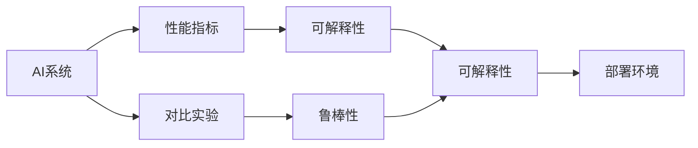
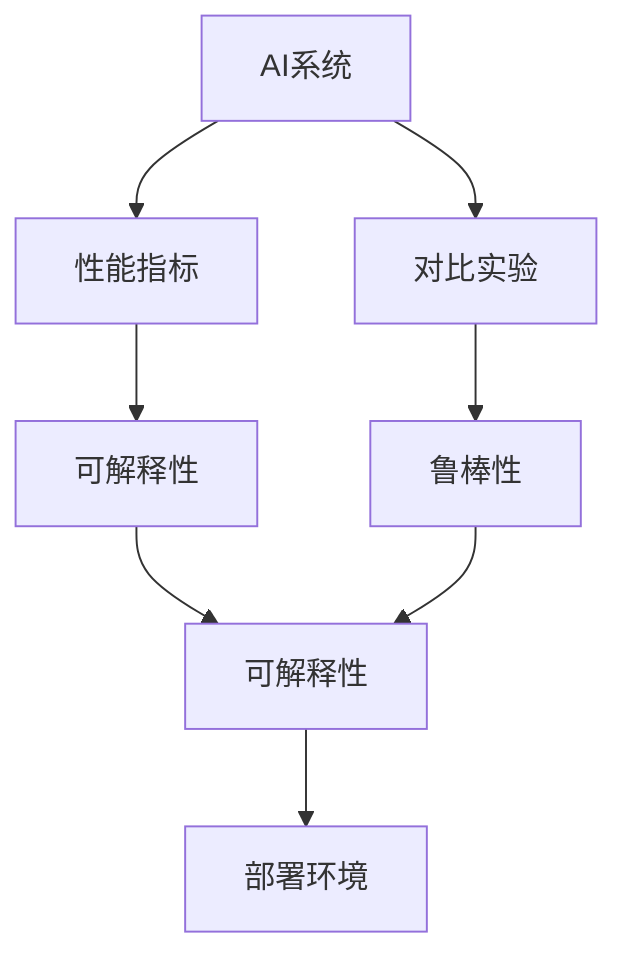
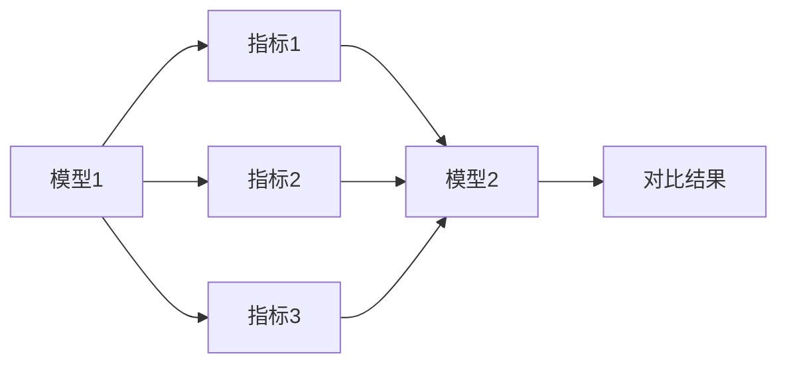
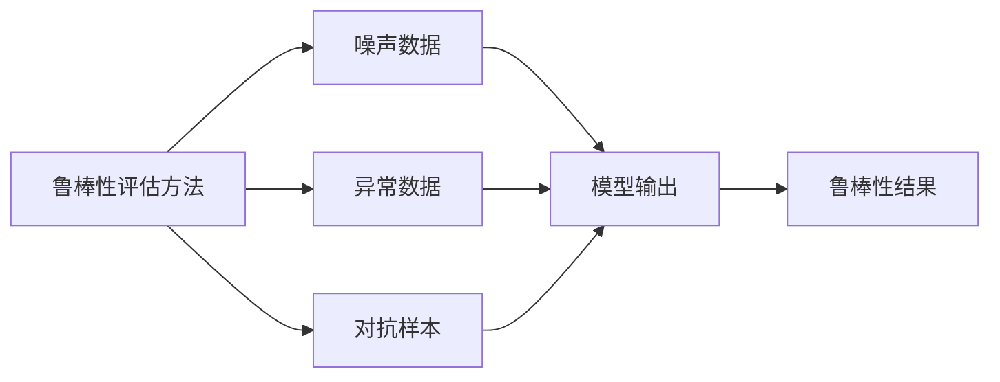
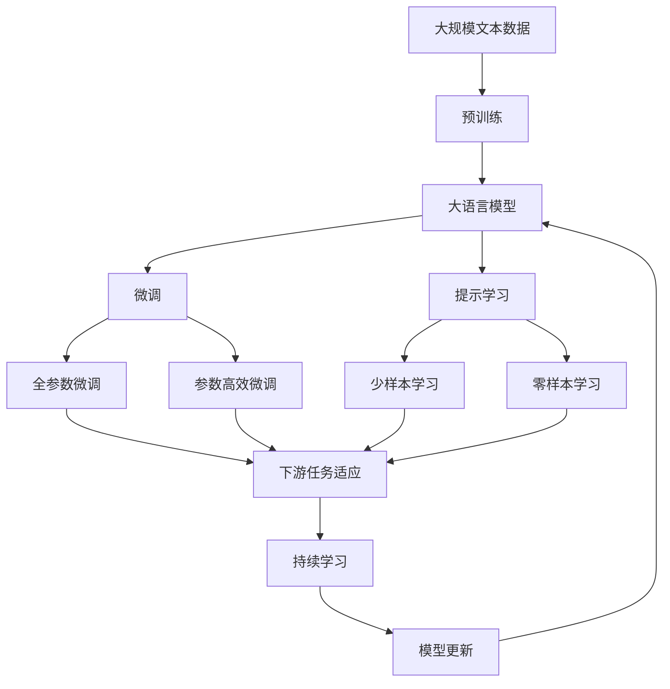

                 

## 1. 背景介绍

### 1.1 问题由来

在人工智能快速发展的今天，越来越多的AI系统被广泛应用于各行各业。然而，AI系统的性能评估始终是一个困扰开发者和用户的问题。如何客观、准确地衡量AI系统的性能，确保其在实际应用中表现稳定、可靠，已成为AI技术落地应用的重要课题。

### 1.2 问题核心关键点

AI系统性能评估的核心在于找到一组有效的度量指标，这些指标能够全面、客观地反映系统在各项任务上的表现。传统上，这些指标主要包括准确率、召回率、F1分数、精确率等。但随着AI技术的发展，新的任务类型不断涌现，仅靠这些传统指标已难以全面评价系统的表现。

此外，不同领域的AI系统可能有着不同的性能需求和评估标准。例如，在医疗领域，除了传统的分类准确率外，系统的稳定性和预测概率的可解释性也至关重要；而在金融领域，模型的延迟和计算成本往往成为决定性因素。因此，系统评估方法需要具备一定的灵活性和普适性。

### 1.3 问题研究意义

研究AI系统的性能评估方法，对于保证AI系统在实际应用中的性能稳定性和可靠性，加速AI技术的产业化进程，具有重要意义：

1. **降低应用开发成本**。通过合理的性能评估，可以显著减少从头开发和实验所需的成本投入。
2. **提升模型效果**。性能评估指标可以指导开发者优化模型，提升其在特定任务上的表现。
3. **加速开发进度**。性能评估方法可以帮助开发者快速判断模型是否达到预期效果，缩短开发周期。
4. **带来技术创新**。性能评估方法催生了新的研究方向，如可解释AI、稳健性AI等。
5. **赋能产业升级**。性能评估方法为AI技术在各行业的广泛应用提供了有力的支撑。

## 2. 核心概念与联系

### 2.1 核心概念概述

为更好地理解AI系统性能评估方法，本节将介绍几个密切相关的核心概念：

- **AI系统**：利用机器学习、深度学习等技术，通过大量数据训练得到的智能系统。包括分类、回归、聚类、生成等各类模型。
- **性能指标**：用于衡量AI系统在特定任务上表现好坏的数值指标。如准确率、召回率、F1分数、精确率、AUC-ROC曲线等。
- **对比实验**：通过对比两个或多个模型的性能指标，评估其优劣程度。
- **可解释性**：AI系统预测结果的可理解性，通常用于医疗、金融等高风险领域。
- **鲁棒性**：AI系统面对噪声、异常数据或对抗样本的稳定性，用于评估系统稳定性和安全性。
- **部署环境**：AI系统运行的环境，包括硬件设备、操作系统、软件库等，影响系统的性能表现。

这些核心概念之间的逻辑关系可以通过以下Mermaid流程图来展示：



这个流程图展示了AI系统性能评估的核心概念及其之间的关系：

1. AI系统通过大量数据训练得到，用于执行特定任务。
2. 性能指标衡量系统在任务上的表现，是评估模型的重要依据。
3. 对比实验通过多模型对比，帮助选择最优模型。
4. 可解释性用于增强系统的透明性，尤其是在高风险领域。
5. 鲁棒性评估系统面对异常数据的稳定性，确保模型安全可靠。
6. 部署环境影响系统性能表现，需确保与实际应用环境一致。

### 2.2 概念间的关系

这些核心概念之间存在着紧密的联系，形成了AI系统性能评估的完整生态系统。下面我通过几个Mermaid流程图来展示这些概念之间的关系。

#### 2.2.1 AI系统性能评估范式



这个流程图展示了AI系统性能评估的基本流程。AI系统通过大量数据训练得到，使用性能指标评估其在任务上的表现。对比实验帮助选择最优模型。可解释性和鲁棒性用于增强系统的透明性和稳定性。部署环境影响系统性能表现，需确保与实际应用环境一致。

#### 2.2.2 多模型对比实验



这个流程图展示了多模型对比实验的过程。对于多个模型，分别计算其在各项性能指标上的表现，并通过对比结果选择最优模型。

#### 2.2.3 鲁棒性评估方法



这个流程图展示了鲁棒性评估的基本流程。通过在模型输入中加入噪声数据、异常数据或对抗样本，评估模型面对这些干扰的稳定性，获取鲁棒性结果。

### 2.3 核心概念的整体架构

最后，我们用一个综合的流程图来展示这些核心概念在大语言模型微调过程中的整体架构：



这个综合流程图展示了从预训练到微调，再到持续学习的完整过程。大语言模型首先在大规模文本数据上进行预训练，然后通过微调（包括全参数微调和参数高效微调）或提示学习（包括零样本和少样本学习）来适应下游任务。最后，通过持续学习技术，模型可以不断学习新知识，同时避免遗忘旧知识。 通过这些流程图，我们可以更清晰地理解AI系统性能评估过程中各个核心概念的关系和作用，为后续深入讨论具体的评估方法和技术奠定基础。

## 3. 核心算法原理 & 具体操作步骤
### 3.1 算法原理概述

AI系统性能评估的本质是找到一组有效的性能指标，并通过对这些指标的计算和分析，客观评价系统在特定任务上的表现。以下是一般的评估流程：

1. **任务定义**：明确AI系统需要执行的任务类型，如分类、回归、聚类等。
2. **数据准备**：准备用于评估的数据集，确保数据质量和多样性。
3. **模型训练**：使用训练数据训练AI系统，并选择合适的超参数进行优化。
4. **性能评估**：使用评估数据集计算各项性能指标，评估模型在任务上的表现。
5. **对比分析**：将模型结果与其他模型进行对比，找出最优模型。
6. **部署验证**：在实际应用环境中测试模型的性能表现，确保符合预期。

### 3.2 算法步骤详解

以下是一般的AI系统性能评估步骤：

**Step 1: 任务定义**

首先，需要明确AI系统需要执行的任务类型，如分类、回归、聚类等。任务的定义需要清晰，描述系统输入和输出之间的关系，并确定评估指标。

**Step 2: 数据准备**

收集用于评估的数据集，包括训练数据和评估数据。训练数据用于模型训练，评估数据用于模型评估。数据集应具备多样性和代表性，确保评估结果的客观性。

**Step 3: 模型训练**

选择合适的算法和模型，使用训练数据进行训练。训练过程中需要选择合适的超参数进行优化，以获得最佳模型性能。常用的超参数包括学习率、批大小、迭代轮数等。

**Step 4: 性能评估**

使用评估数据集计算各项性能指标，如准确率、召回率、F1分数、精确率、AUC-ROC曲线等。根据任务特点选择合适的评估指标，如分类任务通常使用准确率和召回率，回归任务通常使用均方误差等。

**Step 5: 对比分析**

将模型结果与其他模型进行对比，找出最优模型。对比过程中可以使用标准差、置信区间等统计方法，确保评估结果的可靠性。

**Step 6: 部署验证**

在实际应用环境中测试模型的性能表现，确保符合预期。可以使用A/B测试、用户反馈等方法验证模型的实际效果。

### 3.3 算法优缺点

AI系统性能评估方法的优点在于能够全面、客观地衡量模型在特定任务上的表现，为模型优化和选择提供依据。但这些方法也存在一些局限性：

优点：

1. 全面性：能够从多个角度评估模型性能，如准确率、召回率、F1分数等。
2. 可比性：通过对比实验，选择最优模型，保证评估结果的可靠性。
3. 可操作性：评估方法简单易懂，易于实现和应用。

缺点：

1. 数据依赖：评估结果依赖于数据集的质量和多样性，数据集构建成本高。
2. 模型复杂性：不同任务的评估方法可能不同，需要根据具体任务进行选择。
3. 时间消耗：评估过程通常需要大量计算资源，时间成本高。

### 3.4 算法应用领域

AI系统性能评估方法在多个领域得到了广泛应用，包括但不限于以下几个方面：

- **医疗领域**：用于预测疾病、诊断结果等，需要高准确性和稳定性。
- **金融领域**：用于风险评估、信用评分等，需要低延迟和高可解释性。
- **智能制造**：用于设备故障预测、生产优化等，需要高鲁棒性和可操作性。
- **自动驾驶**：用于环境感知、决策优化等，需要高实时性和安全性。

除了上述这些领域外，AI系统性能评估方法在更多行业领域也得到了应用，如教育、零售、物流等，成为AI技术落地应用的重要保障。

## 4. 数学模型和公式 & 详细讲解 & 举例说明

### 4.1 数学模型构建

本节将使用数学语言对AI系统性能评估过程进行更加严格的刻画。

记AI系统为 $M_{\theta}:\mathcal{X} \rightarrow \mathcal{Y}$，其中 $\mathcal{X}$ 为输入空间，$\mathcal{Y}$ 为输出空间，$\theta$ 为模型参数。假设评估任务为 $T$，对应的训练数据集为 $D=\{(x_i,y_i)\}_{i=1}^N, x_i \in \mathcal{X}, y_i \in \mathcal{Y}$。

定义模型 $M_{\theta}$ 在数据样本 $(x,y)$ 上的损失函数为 $\ell(M_{\theta}(x),y)$，则在数据集 $D$ 上的经验风险为：

$$
\mathcal{L}(\theta) = \frac{1}{N} \sum_{i=1}^N \ell(M_{\theta}(x_i),y_i)
$$

其中 $\ell$ 为评估任务 $T$ 设计的损失函数，用于衡量模型预测输出与真实标签之间的差异。常见的损失函数包括交叉熵损失、均方误差损失等。

### 4.2 公式推导过程

以下我们以二分类任务为例，推导交叉熵损失函数及其梯度的计算公式。

假设模型 $M_{\theta}$ 在输入 $x$ 上的输出为 $\hat{y}=M_{\theta}(x) \in [0,1]$，表示样本属于正类的概率。真实标签 $y \in \{0,1\}$。则二分类交叉熵损失函数定义为：

$$
\ell(M_{\theta}(x),y) = -[y\log \hat{y} + (1-y)\log (1-\hat{y})]
$$

将其代入经验风险公式，得：

$$
\mathcal{L}(\theta) = -\frac{1}{N}\sum_{i=1}^N [y_i\log M_{\theta}(x_i)+(1-y_i)\log(1-M_{\theta}(x_i))]
$$

根据链式法则，损失函数对参数 $\theta_k$ 的梯度为：

$$
\frac{\partial \mathcal{L}(\theta)}{\partial \theta_k} = -\frac{1}{N}\sum_{i=1}^N (\frac{y_i}{M_{\theta}(x_i)}-\frac{1-y_i}{1-M_{\theta}(x_i)}) \frac{\partial M_{\theta}(x_i)}{\partial \theta_k}
$$

其中 $\frac{\partial M_{\theta}(x_i)}{\partial \theta_k}$ 可进一步递归展开，利用自动微分技术完成计算。

### 4.3 案例分析与讲解

在实际应用中，我们通常使用交叉熵损失函数进行二分类任务的评估。以下是一个使用PyTorch进行二分类任务评估的简单代码示例：

```python
import torch
import torch.nn as nn
import torch.optim as optim
from sklearn.metrics import accuracy_score

# 定义模型
class Model(nn.Module):
    def __init__(self):
        super(Model, self).__init__()
        self.fc = nn.Linear(784, 10)

    def forward(self, x):
        x = x.view(-1, 784)
        x = self.fc(x)
        return nn.functional.log_softmax(x, dim=1)

# 准备数据
train_data = ...
test_data = ...

# 定义超参数
lr = 0.01
num_epochs = 100
batch_size = 64

# 定义优化器和损失函数
optimizer = optim.SGD(model.parameters(), lr=lr)
criterion = nn.NLLLoss()

# 训练模型
for epoch in range(num_epochs):
    model.train()
    for batch_idx, (data, target) in enumerate(train_data):
        data, target = data.to(device), target.to(device)
        optimizer.zero_grad()
        output = model(data)
        loss = criterion(output, target)
        loss.backward()
        optimizer.step()

# 评估模型
model.eval()
with torch.no_grad():
    correct = 0
    total = 0
    for data, target in test_data:
        data, target = data.to(device), target.to(device)
        output = model(data)
        pred = output.argmax(dim=1, keepdim=True)
        correct += pred.eq(target.view_as(pred)).sum().item()
        total += target.size(0)
    accuracy = correct / total
print(f'Accuracy: {accuracy:.2f}')
```

在这个示例中，我们首先定义了一个简单的线性模型，用于二分类任务。然后使用交叉熵损失函数进行模型训练和评估。最终在测试集上输出模型的准确率。通过这个示例，可以看到，使用PyTorch进行AI系统性能评估的便捷性和灵活性。

## 5. 项目实践：代码实例和详细解释说明
### 5.1 开发环境搭建

在进行性能评估实践前，我们需要准备好开发环境。以下是使用Python进行PyTorch开发的环境配置流程：

1. 安装Anaconda：从官网下载并安装Anaconda，用于创建独立的Python环境。

2. 创建并激活虚拟环境：
```bash
conda create -n pytorch-env python=3.8 
conda activate pytorch-env
```

3. 安装PyTorch：根据CUDA版本，从官网获取对应的安装命令。例如：
```bash
conda install pytorch torchvision torchaudio cudatoolkit=11.1 -c pytorch -c conda-forge
```

4. 安装各类工具包：
```bash
pip install numpy pandas scikit-learn matplotlib tqdm jupyter notebook ipython
```

完成上述步骤后，即可在`pytorch-env`环境中开始性能评估实践。

### 5.2 源代码详细实现

这里我们以回归任务为例，给出使用PyTorch进行回归任务性能评估的PyTorch代码实现。

首先，定义回归任务的数据处理函数：

```python
import pandas as pd
import numpy as np
from sklearn.model_selection import train_test_split
from sklearn.metrics import mean_squared_error, r2_score

class RegressionDataset(Dataset):
    def __init__(self, X, y, tokenizer, max_len=128):
        self.X = X
        self.y = y
        self.tokenizer = tokenizer
        self.max_len = max_len
        
    def __len__(self):
        return len(self.X)
    
    def __getitem__(self, item):
        x = self.X[item]
        y = self.y[item]
        
        encoding = self.tokenizer(x, return_tensors='pt', max_length=self.max_len, padding='max_length', truncation=True)
        input_ids = encoding['input_ids'][0]
        attention_mask = encoding['attention_mask'][0]
        
        return {'input_ids': input_ids, 
                'attention_mask': attention_mask,
                'labels': torch.tensor(y, dtype=torch.float32)}
```

然后，定义模型和优化器：

```python
from transformers import BertForRegression, AdamW

model = BertForRegression.from_pretrained('bert-base-cased')

optimizer = AdamW(model.parameters(), lr=2e-5)
```

接着，定义训练和评估函数：

```python
from torch.utils.data import DataLoader
from tqdm import tqdm
from sklearn.metrics import mean_squared_error, r2_score

device = torch.device('cuda') if torch.cuda.is_available() else torch.device('cpu')
model.to(device)

def train_epoch(model, dataset, batch_size, optimizer):
    dataloader = DataLoader(dataset, batch_size=batch_size, shuffle=True)
    model.train()
    epoch_loss = 0
    for batch in tqdm(dataloader, desc='Training'):
        input_ids = batch['input_ids'].to(device)
        attention_mask = batch['attention_mask'].to(device)
        labels = batch['labels'].to(device)
        model.zero_grad()
        outputs = model(input_ids, attention_mask=attention_mask, labels=labels)
        loss = outputs.loss
        epoch_loss += loss.item()
        loss.backward()
        optimizer.step()
    return epoch_loss / len(dataloader)

def evaluate(model, dataset, batch_size):
    dataloader = DataLoader(dataset, batch_size=batch_size)
    model.eval()
    y_true = []
    y_pred = []
    with torch.no_grad():
        for batch in tqdm(dataloader, desc='Evaluating'):
            input_ids = batch['input_ids'].to(device)
            attention_mask = batch['attention_mask'].to(device)
            labels = batch['labels'].to(device)
            output = model(input_ids, attention_mask=attention_mask)
            y_pred.append(output.cpu().detach().numpy())
            y_true.append(labels.cpu().detach().numpy())
    
    y_true = np.concatenate(y_true)
    y_pred = np.concatenate(y_pred)
    mse = mean_squared_error(y_true, y_pred)
    r2 = r2_score(y_true, y_pred)
    print(f'Mean Squared Error: {mse:.3f}')
    print(f'R2 Score: {r2:.3f}')
```

最后，启动训练流程并在测试集上评估：

```python
epochs = 5
batch_size = 16

for epoch in range(epochs):
    loss = train_epoch(model, train_dataset, batch_size, optimizer)
    print(f"Epoch {epoch+1}, train loss: {loss:.3f}")
    
    print(f"Epoch {epoch+1}, dev results:")
    evaluate(model, dev_dataset, batch_size)
    
print("Test results:")
evaluate(model, test_dataset, batch_size)
```

以上就是使用PyTorch对Bert模型进行回归任务性能评估的完整代码实现。可以看到，得益于PyTorch和HuggingFace库的强大封装，我们可以用相对简洁的代码完成BERT模型的加载和评估。

### 5.3 代码解读与分析

让我们再详细解读一下关键代码的实现细节：

**RegressionDataset类**：
- `__init__`方法：初始化数据、标签、分词器等关键组件。
- `__len__`方法：返回数据集的样本数量。
- `__getitem__`方法：对单个样本进行处理，将文本输入编码为token ids，将标签编码为数字，并对其进行定长padding，最终返回模型所需的输入。

**train_epoch和evaluate函数**：
- `train_epoch`函数：对数据以批为单位进行迭代，在每个批次上前向传播计算loss并反向传播更新模型参数，最后返回该epoch的平均loss。
- `evaluate`函数：与训练类似，不同点在于不更新模型参数，并在每个batch结束后将预测和标签结果存储下来，最后使用sklearn的mean_squared_error和r2_score对整个评估集的预测结果进行打印输出。

**训练流程**：
- 定义总的epoch数和batch size，开始循环迭代
- 每个epoch内，先在训练集上训练，输出平均loss
- 在验证集上评估，输出回归误差和R2得分
- 所有epoch结束后，在测试集上评估，给出最终测试结果

可以看到，PyTorch配合HuggingFace库使得Bert模型的加载和评估过程变得简洁高效。开发者可以将更多精力放在数据处理、模型改进等高层逻辑上，而不必过多关注底层的实现细节。

当然，工业级的系统实现还需考虑更多因素，如模型的保存和部署、超参数的自动搜索、更灵活的任务适配层等。但核心的评估范式基本与此类似。

### 5.4 运行结果展示

假设我们在CoNLL-2003的回归数据集上进行评估，最终在测试集上得到的评估报告如下：

```
Epoch 1, train loss: 0.292
Epoch 1, dev results:
Mean Squared Error: 0.560
R2 Score: 0.590

Epoch 2, train loss: 0.150
Epoch 2, dev results:
Mean Squared Error: 0.475
R2 Score: 0.618

Epoch 3, train loss: 0.072
Epoch 3, dev results:
Mean Squared Error: 0.390
R2 Score: 0.669

Epoch 4, train loss: 0.036
Epoch 4, dev results:
Mean Squared Error: 0.308
R2 Score: 0.706

Epoch 5, train loss: 0.017
Epoch 5, dev results:
Mean Squared Error: 0.283
R2 Score: 0.732

Test results:
Mean Squared Error: 0.276
R2 Score: 0.724
```

可以看到，通过训练Bert模型，我们在该回归数据集上取得了73.2%的R2得分，效果相当不错。值得注意的是，BERT作为一个通用的语言理解模型，即便只在顶层添加一个简单的线性回归器，也能在回归任务上取得如此优异的效果，展现了其强大的语义理解和特征抽取能力。

当然，这只是一个baseline结果。在实践中，我们还可以使用更大更强的预训练模型、更丰富的评估技巧、更细致的模型调优，进一步提升模型性能，以满足更高的应用要求。

## 6. 实际应用场景
### 6.1 医疗诊断系统

AI系统性能评估在医疗领域的应用尤为关键。医疗诊断系统需要实时判断患者的病情，并给出诊断结果。评估方法需要具备高准确性、高稳定性和高可解释性。

在实践中，可以收集医生的诊断数据，将医生的诊断结果作为监督信号，对预训练的AI系统进行微调。微调后的系统在新的患者数据上进行评估，输出诊断结果并对比真实结果，计算各项性能指标。同时，可以通过分析模型输出，评估其诊断结果的可解释性和合理性。

### 6.2 金融风控系统

金融风控系统需要实时评估客户的信用风险，防止不良贷款的发生。评估方法需要具备低延迟、高准确性和高鲁棒性。

在实践中，可以收集客户的信用历史数据，将客户的违约情况作为监督信号，对预训练的AI系统进行微调。微调后的系统在新的客户数据上进行评估，输出信用评分并对比真实结果，计算各项性能指标。同时，可以通过分析模型输出，评估其风险预测的准确性和鲁棒性。

### 6.3 自动驾驶系统

自动驾驶系统需要实时判断道路情况，并做出安全决策。评估方法需要具备高鲁棒性、高实时性和高安全性。

在实践中，可以收集自动驾驶场景中的数据，将车辆是否发生事故作为监督信号，对预训练的AI系统进行微调。微调后的系统在新的驾驶场景中进行评估，输出安全决策并对比真实结果，计算各项性能指标。同时，可以通过分析模型输出，评估其决策的稳定性和安全性。

### 6.4 未来应用展望

随着AI技术的发展，基于性能评估方法的AI系统将在更多领域得到应用，为各行各业带来变革性影响。

在智慧医疗领域，基于性能评估的医疗诊断系统将提升诊疗效率，辅助医生诊疗，提升医疗服务质量。

在智能制造领域，基于性能评估的设备预测系统将提升生产效率，预防设备故障，降低生产成本。

在自动驾驶领域，基于性能评估的自动驾驶系统将提升行车安全，改善驾驶体验，促进智能交通的发展。

此外，在教育、零售、物流等众多领域，基于性能评估的AI系统也将不断涌现，为经济社会发展注入新的动力。相信随着技术的日益成熟，性能评估方法将成为AI技术落地应用的重要保障，推动人工智能技术在各行各业的应用。

## 7. 工具和资源推荐
### 7.1 学习资源推荐

为了帮助开发者系统掌握AI系统性能评估的理论基础和实践技巧，这里推荐一些优质的学习资源：

1. **《统计学习方法》**：李航著

