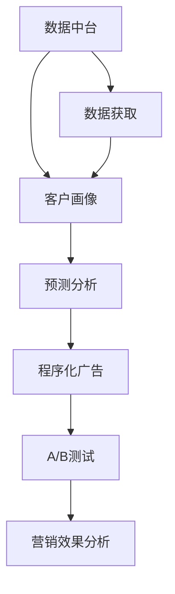

                 

## 1. 背景介绍

### 1.1 问题由来
在数字营销的今天，传统的手工营销方式已无法满足快速变化的业务需求。为提升营销效率和精确度，企业亟需智能化的营销自动化解决方案。这其中，AI驱动的营销自动化策略成为行业热点，借助机器学习和大数据技术，能够自动生成营销方案、优化广告投放、跟踪效果分析，大幅提升营销效果，降低人力成本。

### 1.2 问题核心关键点
AI驱动的营销自动化主要包含以下几个关键点：
- **数据获取**：通过大数据技术，从各渠道抓取客户行为数据，形成客户画像。
- **目标识别**：利用机器学习算法，识别潜在客户群体，定制精准营销策略。
- **效果预测**：预测营销活动效果，评估营销策略的ROI，并迭代优化。
- **广告投放**：通过程序化广告平台，自动化调整广告位和广告内容，实现精准投放。
- **效果监测**：通过追踪客户转化行为，实时分析营销效果，迭代营销策略。

### 1.3 问题研究意义
实现AI驱动的营销自动化，对于提升企业营销效率、降低成本、优化客户体验具有重要意义：
- **提高效率**：自动化流程大幅减少人力投入，提升营销响应速度。
- **增强精准**：通过数据分析，精准定位客户需求，提升转化率。
- **优化成本**：有效控制广告预算，减少资源浪费。
- **提升效果**：通过迭代优化，不断提升营销策略的效果和ROI。

## 2. 核心概念与联系

### 2.1 核心概念概述
为更好地理解AI驱动的营销自动化策略，本节将介绍几个关键概念：

- **数据中台**：企业内部数据的汇聚中心，通过ETL技术清洗、整合来自不同渠道的数据，实现数据的高效治理和统一管理。
- **客户画像**：通过收集和分析客户的多种行为数据，构建详尽的客户画像，形成个性化的营销策略。
- **预测分析**：利用机器学习算法，对客户行为和广告效果进行预测，优化营销决策。
- **程序化广告**：利用程序化广告技术，自动化执行广告投放和管理，提高广告投放的精准度和效率。
- **A/B测试**：通过对比实验，测试不同广告方案的效果，评估营销策略的优劣，快速迭代优化。

这些概念间通过数据分析、算法优化、技术支撑形成完整的营销自动化框架，有助于实现智能、高效、精准的营销效果。

### 2.2 概念间的关系

这些关键概念之间的逻辑关系可以通过以下Mermaid流程图来展示：



这个流程图展示了大数据技术、客户画像构建、预测分析、程序化广告和A/B测试等关键概念在大数据营销自动化中的作用和关系：

1. 数据中台作为数据汇聚中心，支撑客户画像的构建和预测分析的算法训练。
2. 客户画像通过数据分析生成，为预测分析和程序化广告提供基础。
3. 预测分析通过模型训练，实现对客户行为和广告效果的预测，提供数据支持。
4. 程序化广告利用算法和数据进行广告投放和管理，提升投放精准度。
5. A/B测试通过对比实验，不断优化营销策略，提升效果。
6. 营销效果分析对整个营销过程进行跟踪和评估，形成闭环反馈。

这些概念共同构成了AI驱动营销自动化的完整生态系统，支撑着智能营销的全过程。

## 3. 核心算法原理 & 具体操作步骤

### 3.1 算法原理概述

AI驱动的营销自动化策略主要基于机器学习和数据分析技术，其核心算法包括回归分析、聚类算法、决策树、神经网络等。以客户行为预测为例，其基本流程如下：

1. **数据收集**：从各渠道抓取客户行为数据，如浏览历史、购买记录、社交媒体互动等。
2. **特征提取**：通过特征工程技术，对原始数据进行清洗、归一化、降维等处理，提取关键特征。
3. **模型训练**：利用机器学习算法，对特征数据进行建模，生成客户行为预测模型。
4. **效果评估**：在验证集上评估模型预测准确率，调整模型参数，提升预测效果。
5. **策略优化**：根据预测结果，定制个性化的营销策略，并自动生成广告内容。

### 3.2 算法步骤详解

#### 3.2.1 数据预处理

数据预处理是整个营销自动化策略的关键步骤，具体步骤如下：

1. **数据清洗**：处理缺失值、异常值、重复记录等数据质量问题，确保数据完整性和准确性。
2. **数据归一化**：对特征数据进行归一化处理，如标准化、最小-最大归一化等，提高算法性能。
3. **特征选择**：通过特征选择算法（如LASSO、RFE等），选择对目标变量有显著影响的特征，减少数据维度。
4. **降维处理**：使用PCA、t-SNE等降维算法，减少特征数量，提高模型训练效率。

#### 3.2.2 模型训练与评估

模型训练与评估是营销自动化策略的核心环节，具体步骤如下：

1. **选择合适的算法**：根据数据特性和预测任务，选择合适的算法模型（如线性回归、随机森林、神经网络等）。
2. **模型训练**：利用训练集数据，进行模型训练，优化模型参数。
3. **效果评估**：在验证集上评估模型预测准确率和性能指标，如均方误差、R平方等，选择最优模型。
4. **模型优化**：根据评估结果，调整模型超参数，提高模型预测效果。

#### 3.2.3 策略生成与优化

策略生成与优化是营销自动化的应用环节，具体步骤如下：

1. **生成策略**：根据预测模型，生成个性化营销策略，包括广告内容、投放渠道等。
2. **效果追踪**：通过追踪客户转化行为，实时评估广告投放效果。
3. **策略优化**：根据效果评估结果，迭代优化广告投放策略，提高广告ROI。

### 3.3 算法优缺点

AI驱动的营销自动化策略具有以下优点：
- **高效性**：自动化流程大幅减少人工操作，提高响应速度和执行效率。
- **精准性**：通过数据分析和预测算法，能够精准定位客户需求，提升转化率。
- **优化性**：通过实时效果监测和迭代优化，不断提升营销策略的效果和ROI。
- **灵活性**：通过算法和模型的灵活调整，能够适应不同市场和产品需求。

同时，该策略也存在以下缺点：
- **数据依赖性**：预测和优化效果依赖于高质量的数据，数据质量问题可能影响策略效果。
- **模型复杂性**：构建复杂的预测模型可能带来较高的计算资源消耗，增加技术门槛。
- **策略迭代难度**：模型和策略的迭代优化需要时间和成本，过程复杂。
- **结果可解释性**：模型决策过程复杂，难以解释，可能导致不透明的营销策略。

### 3.4 算法应用领域

AI驱动的营销自动化策略已广泛应用于多个领域：

- **电商营销**：通过数据分析和预测模型，优化产品推荐、广告投放和客户细分策略。
- **品牌推广**：自动生成创意广告内容，实时监测广告效果，优化投放策略。
- **精准营销**：根据客户行为预测，定制个性化营销方案，提高广告转化率。
- **社交媒体营销**：自动分析社交媒体数据，生成有针对性的内容策略，提升互动率。
- **搜索引擎优化**：利用机器学习算法，优化网站SEO策略，提升搜索引擎排名和点击率。

## 4. 数学模型和公式 & 详细讲解 & 举例说明

### 4.1 数学模型构建

AI驱动的营销自动化策略主要涉及以下数学模型：

- **回归分析模型**：用于客户行为预测，形式化表达为：$y = f(x; \theta)$，其中 $y$ 为目标变量，$x$ 为特征变量，$\theta$ 为模型参数。
- **聚类算法模型**：用于客户群体划分，如K-means算法，将客户分为不同类别，提升个性化营销效果。
- **决策树模型**：用于客户行为分类，通过构建决策树模型，自动生成分类规则。
- **神经网络模型**：用于客户行为预测和广告效果预测，形式化表达为：$y = \sigma(Wx + b)$，其中 $y$ 为目标变量，$x$ 为输入向量，$W$ 和 $b$ 为模型参数，$\sigma$ 为激活函数。

### 4.2 公式推导过程

以线性回归模型为例，其目标是最小化预测误差，常用的损失函数为均方误差：

$$
L(y,\hat{y}) = \frac{1}{N}\sum_{i=1}^N (y_i - \hat{y}_i)^2
$$

其中 $y_i$ 为实际值，$\hat{y}_i$ 为预测值。通过梯度下降法，模型参数 $\theta$ 的更新公式为：

$$
\theta \leftarrow \theta - \eta \nabla_{\theta}L(y,\hat{y})
$$

其中 $\eta$ 为学习率，$\nabla_{\theta}L(y,\hat{y})$ 为损失函数对模型参数的梯度。

### 4.3 案例分析与讲解

假设某电商网站进行个性化推荐优化，以下是具体步骤：

1. **数据获取**：从网站后台抓取用户浏览、点击、购买等行为数据。
2. **特征提取**：对行为数据进行归一化、降维等处理，提取用户兴趣、购买历史等特征。
3. **模型训练**：构建线性回归模型，预测用户购买概率，选择最佳特征组合。
4. **效果评估**：在验证集上评估模型预测准确率，调整特征选择和模型参数。
5. **策略生成**：根据预测模型，生成个性化推荐方案，通过A/B测试不断优化。
6. **效果监测**：追踪用户点击、购买等转化行为，实时调整推荐策略，提升ROI。

## 5. 项目实践：代码实例和详细解释说明

### 5.1 开发环境搭建

在进行AI驱动营销自动化策略的开发实践前，需要准备以下开发环境：

1. **Python**：Python作为数据科学和机器学习的主流语言，具有丰富的科学计算库和机器学习库。
2. **Pandas**：用于数据处理和分析，支持大规模数据集的读取和操作。
3. **NumPy**：用于科学计算，提供高效的数组操作和数学函数。
4. **Scikit-learn**：提供多种机器学习算法和模型，支持数据预处理和特征工程。
5. **TensorFlow/Keras**：用于构建和训练深度学习模型，支持多种神经网络架构。

### 5.2 源代码详细实现

以下是一个电商网站个性化推荐优化的具体实现：

```python
import pandas as pd
from sklearn.linear_model import LinearRegression
from sklearn.model_selection import train_test_split
from sklearn.metrics import mean_squared_error

# 读取用户行为数据
data = pd.read_csv('user_browsing_data.csv')

# 特征选择和预处理
X = data[['browsed_products', 'added_to_cart', 'purchase_history']]
y = data['purchased']  # 购买行为为1表示购买，为0表示未购买
X_train, X_val, y_train, y_val = train_test_split(X, y, test_size=0.2, random_state=42)

# 模型训练
model = LinearRegression()
model.fit(X_train, y_train)

# 效果评估
y_pred = model.predict(X_val)
mse = mean_squared_error(y_val, y_pred)
print(f'Mean Squared Error: {mse:.2f}')

# 策略生成
recommendation_list = model.predict(X[['browsed_products', 'added_to_cart']])
print(f'推荐商品列表: {recommendation_list}')

# 策略优化
# 根据预测结果，生成个性化推荐方案，并进行A/B测试，实时调整策略
```

### 5.3 代码解读与分析

以下是关键代码的解读和分析：

1. **数据读取与预处理**：使用Pandas库读取用户行为数据，并构建特征集 $X$ 和目标变量 $y$。
2. **模型训练**：使用线性回归模型对特征数据进行训练，生成预测模型。
3. **效果评估**：在验证集上计算均方误差，评估模型预测准确率。
4. **策略生成**：根据训练好的模型，生成个性化推荐列表。
5. **策略优化**：通过A/B测试不断优化推荐策略，提升广告ROI。

### 5.4 运行结果展示

假设模型在验证集上的均方误差为0.5，说明预测模型的平均误差在0.5次购买概率单位，推荐效果较好。根据预测结果，可以生成个性化推荐方案，提升客户购买转化率。

## 6. 实际应用场景

### 6.1 电商营销优化

AI驱动的营销自动化策略在电商营销中具有广泛应用。通过分析用户行为数据，自动生成个性化推荐，优化广告投放策略，提升广告点击率和转化率。

**具体流程**：
1. **数据收集**：从电商平台抓取用户浏览、点击、购买等行为数据。
2. **特征提取**：对行为数据进行清洗和归一化，提取用户兴趣、购买历史等特征。
3. **模型训练**：利用机器学习算法，对用户行为进行建模，生成推荐模型。
4. **效果评估**：在验证集上评估推荐效果，优化模型参数。
5. **策略生成**：根据预测模型，生成个性化推荐方案，并通过A/B测试不断优化。
6. **效果监测**：追踪用户点击、购买等转化行为，实时调整推荐策略，提升广告ROI。

### 6.2 品牌推广效果预测

AI驱动的营销自动化策略可以应用于品牌推广效果预测，通过数据分析和模型训练，预测不同广告方案的效果，优化广告投放策略。

**具体流程**：
1. **数据收集**：从社交媒体、广告平台抓取广告投放数据和用户互动数据。
2. **特征提取**：对数据进行清洗和归一化，提取广告特征、用户特征等。
3. **模型训练**：利用机器学习算法，对广告效果进行建模，生成预测模型。
4. **效果评估**：在验证集上评估广告效果，优化模型参数。
5. **策略生成**：根据预测模型，生成广告创意和投放策略，并进行A/B测试。
6. **效果监测**：实时追踪广告点击率、转化率等关键指标，优化广告投放效果。

### 6.3 精准营销策略优化

AI驱动的营销自动化策略还可以应用于精准营销，通过数据分析和模型训练，生成个性化营销策略，提升广告投放精准度。

**具体流程**：
1. **数据收集**：从各种渠道抓取客户行为数据，如浏览、点击、互动等。
2. **特征提取**：对数据进行清洗和归一化，提取客户特征、行为特征等。
3. **模型训练**：利用机器学习算法，对客户行为进行建模，生成预测模型。
4. **效果评估**：在验证集上评估预测效果，优化模型参数。
5. **策略生成**：根据预测模型，生成个性化营销策略，并进行A/B测试。
6. **效果监测**：实时追踪客户转化行为，调整营销策略，提升广告ROI。

## 7. 工具和资源推荐

### 7.1 学习资源推荐

为了帮助开发者掌握AI驱动营销自动化策略的理论基础和实践技巧，推荐以下学习资源：

1. **《Python数据科学手册》**：涵盖数据处理、机器学习、深度学习等知识，适合初学者入门。
2. **《TensorFlow实战》**：TensorFlow的实战教程，提供大量案例和代码实现。
3. **Coursera《数据科学专业》**：由约翰霍普金斯大学开设的在线课程，涵盖数据分析、机器学习等知识。
4. **Kaggle竞赛平台**：提供大量数据分析和机器学习竞赛，帮助开发者实战提升。
5. **GitHub开源项目**：搜索相关的开源项目，学习其中的代码实现和设计思路。

通过这些资源的学习，可以系统掌握AI驱动营销自动化策略的理论基础和实践技巧，应用于实际业务场景中。

### 7.2 开发工具推荐

以下是几个用于AI驱动营销自动化策略开发的常用工具：

1. **Jupyter Notebook**：用于编写和运行Python代码，支持代码块注释、输出展示等功能。
2. **SciPy**：用于科学计算和数据分析，提供高效的数学函数和统计方法。
3. **Plotly**：用于数据可视化，支持交互式图表和动态展示。
4. **Numpy**：用于数组和矩阵运算，支持高效的数值计算。
5. **Scikit-learn**：提供多种机器学习算法和模型，支持数据预处理和特征工程。

合理利用这些工具，可以提升开发效率和代码质量，快速迭代和优化AI驱动营销自动化策略。

### 7.3 相关论文推荐

以下几篇前沿论文奠定了AI驱动营销自动化策略的理论基础：

1. **《Adaptive Internet Advertising: The Social Media Revolution》**：Google的研究论文，介绍了程序化广告技术的发展和应用。
2. **《Machine Learning in Marketing》**：斯坦福大学的综述文章，涵盖机器学习在市场营销中的应用。
3. **《Predictive Analytics for Customer Lifetime Value》**：IBM的研究报告，探讨了预测分析在客户生命周期价值评估中的应用。
4. **《A/B Testing and the Science of Small Bets》**：Facebook的技术文章，介绍了A/B测试在产品优化中的应用。
5. **《Personalized Recommendation Systems: Active User Modeling and Preference Prediction》**：京东的研究报告，介绍了个性化推荐系统的构建和优化。

这些论文代表了AI驱动营销自动化策略的前沿研究方向，阅读这些文献可以帮助研究者了解最新的理论进展和应用实践。

## 8. 总结：未来发展趋势与挑战

### 8.1 研究成果总结

AI驱动的营销自动化策略已取得显著成果，广泛应用于电商、品牌推广、精准营销等领域。通过数据分析和模型训练，优化营销策略，提高广告投放精准度和效果，减少人力成本，提升ROI。

### 8.2 未来发展趋势

AI驱动的营销自动化策略的未来发展趋势主要包括以下几个方面：

1. **多模态数据融合**：融合视觉、语音、文本等多种数据源，提升客户行为预测的准确性和全面性。
2. **实时效果监控**：利用大数据技术，实时监控广告效果，快速调整策略，提高广告ROI。
3. **个性化推荐优化**：结合推荐算法和深度学习，生成更精准的个性化推荐方案，提升用户满意度。
4. **自动化流程优化**：引入自动化工具和流程优化技术，提升营销自动化策略的执行效率和效果。
5. **算法模型创新**：引入前沿算法和模型，如强化学习、生成对抗网络等，提升策略效果和模型性能。

### 8.3 面临的挑战

尽管AI驱动的营销自动化策略取得了显著成效，但仍面临以下挑战：

1. **数据质量问题**：数据源的多样性和噪声可能导致数据质量问题，影响模型预测效果。
2. **模型复杂性**：构建复杂的算法模型可能带来较高的技术门槛，增加了开发难度。
3. **策略迭代难度**：算法和策略的迭代优化需要时间和成本，过程复杂。
4. **结果可解释性**：复杂算法和模型可能导致结果不透明，难以解释和调试。
5. **隐私保护问题**：客户数据隐私保护问题，需要在模型设计和应用中加以考虑。

### 8.4 研究展望

未来的AI驱动营销自动化策略需要在数据、算法、工程等方面进行综合优化，提升策略效果和执行效率，同时确保数据安全和隐私保护。只有从技术、业务、伦理等多个维度协同发力，才能实现智能、高效、精准的营销自动化。

## 9. 附录：常见问题与解答

### Q1：如何处理数据质量问题？

A: 数据质量问题可以通过以下方法解决：
1. 数据清洗：处理缺失值、异常值、重复记录等数据质量问题，确保数据完整性和准确性。
2. 数据标注：对数据进行标注，建立标准化的数据格式，提高数据一致性。
3. 数据增强：通过数据增强技术，生成更多的样本数据，减少过拟合风险。
4. 数据验证：利用数据验证技术，检测数据质量，确保数据质量稳定。

### Q2：如何选择适合的数据模型？

A: 选择适合的数据模型需要考虑以下因素：
1. 数据类型：根据数据类型选择合适的模型，如分类问题可以选择决策树、神经网络等。
2. 数据量：数据量较大的情况可以选择复杂模型，如深度学习模型；数据量较小的情况可以选择简单模型，如线性回归。
3. 问题类型：根据问题类型选择合适的模型，如回归问题可以选择线性回归、随机森林等。
4. 计算资源：根据计算资源选择模型，如资源充足可以选择复杂模型，资源有限可以选择简单模型。

### Q3：如何提高模型效果？

A: 提高模型效果可以通过以下方法：
1. 特征工程：通过特征工程技术，提取关键特征，减少数据维度，提升模型性能。
2. 模型优化：利用超参数调优、正则化技术等方法，优化模型参数，提高模型准确率。
3. 算法创新：引入前沿算法和模型，如深度学习、强化学习等，提升模型性能。
4. 数据增强：通过数据增强技术，生成更多的样本数据，减少过拟合风险。
5. 模型集成：通过模型集成技术，组合多个模型，提升预测效果。

### Q4：如何处理模型复杂性？

A: 处理模型复杂性可以通过以下方法：
1. 简化模型：选择合适的模型结构，简化模型复杂度，提高模型执行效率。
2. 特征选择：通过特征选择算法，选择对目标变量有显著影响的特征，减少模型复杂度。
3. 模型剪枝：通过剪枝技术，去除冗余特征和参数，减少模型复杂度。
4. 模型压缩：通过模型压缩技术，将浮点模型转为定点模型，减少存储空间和计算资源消耗。

### Q5：如何确保模型可解释性？

A: 确保模型可解释性可以通过以下方法：
1. 可解释模型：选择可解释性较好的模型，如决策树、线性回归等。
2. 特征重要性：通过特征重要性分析，解释模型预测结果。
3. 可视化工具：利用可视化工具，展示模型决策过程，提高结果可解释性。
4. 解释性评估：通过解释性评估方法，评估模型预测结果的合理性。
5. 人工干预：通过人工干预，确保模型输出符合人类价值观和伦理道德。

通过以上资源和技巧，可以更好地理解和应用AI驱动的营销自动化策略，提升营销效果和效率。

---

作者：禅与计算机程序设计艺术 / Zen and the Art of Computer Programming

