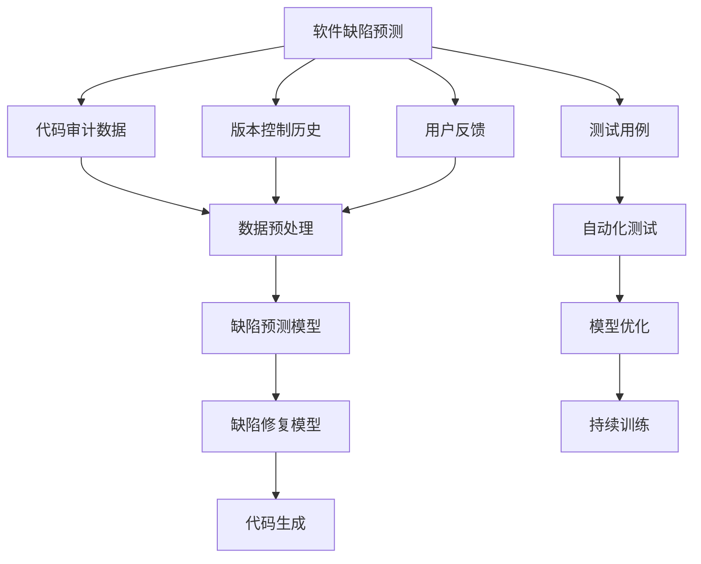
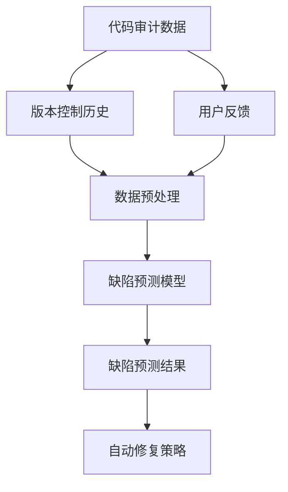
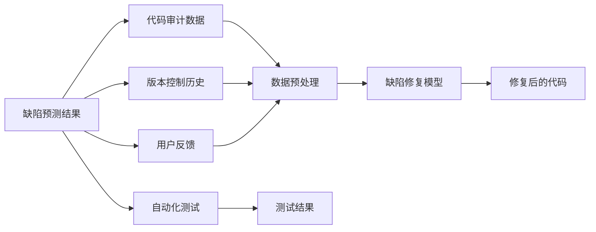
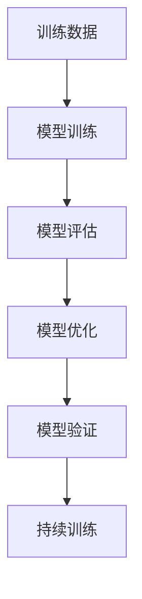
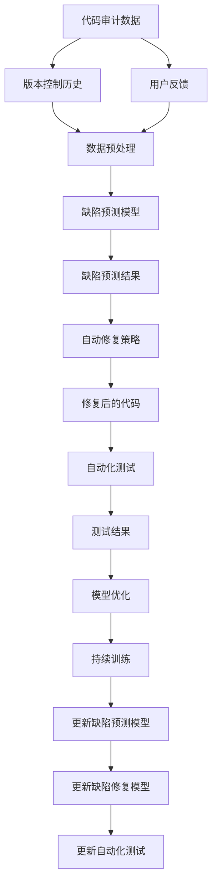

                 

# AI驱动的软件缺陷预测与修复

> 关键词：AI驱动, 软件缺陷预测, 软件修复, 机器学习, 模型优化, 代码分析, 模型评估

## 1. 背景介绍

在当今快速迭代的软件开发环境中，软件缺陷和错误的识别与修复成为了保障软件质量和交付效率的关键环节。传统的软件缺陷检测方法如代码审查、静态分析等往往存在高成本、低效率的问题，无法满足现代软件开发对速度和精度的要求。而随着人工智能（AI）技术的迅速发展，AI驱动的软件缺陷预测与修复技术逐渐成为软件开发领域的研究热点。

### 1.1 问题由来

软件缺陷预测与修复旨在通过分析代码、历史记录等数据，提前发现潜在的缺陷，并自动修复已知错误。传统的人工缺陷预测方法依赖于经验丰富的开发人员，但这些方法难以适应快速变化的软件需求，且容易受到个体经验差异的影响。

而AI驱动的缺陷预测与修复则能够从海量的数据中提取模式和规律，提供更加客观和准确的预测结果。同时，AI模型还能够自动学习修复策略，降低人工修复的复杂度和成本。这种技术的应用不仅提高了软件质量，还缩短了开发周期，提升了软件开发效率。

### 1.2 问题核心关键点

AI驱动的软件缺陷预测与修复的核心在于以下几个方面：

- **数据驱动**：利用代码审计数据、版本控制历史、用户反馈等数据，构建缺陷预测模型。
- **自动化修复**：训练AI模型自动修复代码中的已知错误，如拼写错误、类型错误等。
- **模型优化**：通过持续训练和优化，提高缺陷预测和修复的准确性。
- **可解释性**：理解模型决策背后的原因，提升AI系统的可信度。

这些核心点共同构成了AI驱动的软件缺陷预测与修复技术的框架，其目标是通过数据分析和机器学习，实现软件缺陷的自动化检测和修复。

## 2. 核心概念与联系

### 2.1 核心概念概述

为更好地理解AI驱动的软件缺陷预测与修复技术，我们首先介绍几个关键概念：

- **软件缺陷预测**：通过分析代码、日志等数据，预测软件中可能存在的缺陷。
- **软件缺陷修复**：利用AI模型自动识别并修正代码中的错误，提升代码质量和可维护性。
- **数据驱动**：基于历史数据和统计规律，构建AI模型进行缺陷预测和修复。
- **自动化测试**：构建测试用例，验证AI模型的预测和修复结果。
- **模型优化**：通过持续训练和调优，提高缺陷预测和修复的准确性。

这些概念之间的关系可以通过以下Mermaid流程图来展示：



这个流程图展示了大规模软件缺陷预测与修复过程中各个概念的联系：

1. 通过代码审计数据、版本控制历史和用户反馈等数据进行预处理。
2. 构建缺陷预测模型，并结合自动化测试验证模型的准确性。
3. 使用缺陷预测结果指导缺陷修复，并通过模型优化提高修复效率。

### 2.2 概念间的关系

这些关键概念之间存在紧密的联系，共同构成了AI驱动的软件缺陷预测与修复的完整生态系统。下面我们通过几个Mermaid流程图来展示这些概念之间的关系。

#### 2.2.1 软件缺陷预测的流程



这个流程图展示了软件缺陷预测的基本流程：

1. 收集代码审计数据、版本控制历史和用户反馈等数据。
2. 对数据进行预处理，构建缺陷预测模型。
3. 模型输出缺陷预测结果，并提供自动修复策略。

#### 2.2.2 缺陷修复的流程



这个流程图展示了缺陷修复的基本流程：

1. 使用缺陷预测结果指导修复工作。
2. 收集修复后的代码、版本控制历史和用户反馈等数据。
3. 对数据进行预处理，构建缺陷修复模型。
4. 模型输出修复后的代码，并通过自动化测试验证其正确性。

#### 2.2.3 模型优化的流程



这个流程图展示了模型优化的基本流程：

1. 使用训练数据对模型进行训练。
2. 评估模型的性能。
3. 根据评估结果对模型进行优化。
4. 在验证集上验证优化效果。
5. 对模型进行持续训练，保持其性能。

### 2.3 核心概念的整体架构

最后，我们用一个综合的流程图来展示这些核心概念在大规模软件缺陷预测与修复过程中的整体架构：



这个综合流程图展示了从数据收集到模型优化，再到缺陷预测与修复的完整过程。代码审计数据、版本控制历史和用户反馈等数据经过预处理后，构建缺陷预测模型。预测结果指导自动修复策略，生成修复后的代码。修复后的代码经过自动化测试验证，并根据测试结果进行模型优化和持续训练，不断提升缺陷预测与修复的准确性和效率。

## 3. 核心算法原理 & 具体操作步骤
### 3.1 算法原理概述

AI驱动的软件缺陷预测与修复技术主要依赖于机器学习和深度学习模型。具体算法原理如下：

1. **特征提取**：从代码审计数据、版本控制历史和用户反馈等数据中提取有用的特征，如代码行数、函数复杂度、注释质量等。
2. **模型训练**：利用提取的特征，训练预测模型和修复模型，如决策树、随机森林、神经网络等。
3. **模型评估**：使用测试集评估模型的预测和修复效果，计算准确率、召回率、F1分数等指标。
4. **模型优化**：根据评估结果，调整模型参数和结构，提高模型的性能。
5. **代码分析**：通过模型预测和修复结果，分析代码中的潜在问题，指导开发人员的代码修改。

### 3.2 算法步骤详解

以下是AI驱动的软件缺陷预测与修复技术的详细步骤：

1. **数据收集与预处理**：收集代码审计数据、版本控制历史和用户反馈等数据，并对数据进行清洗、归一化等预处理操作。
2. **特征工程**：选择或构造有用的特征，如代码行数、函数复杂度、注释质量等。
3. **模型训练**：利用提取的特征，训练预测模型和修复模型，如决策树、随机森林、神经网络等。
4. **模型评估**：使用测试集评估模型的预测和修复效果，计算准确率、召回率、F1分数等指标。
5. **模型优化**：根据评估结果，调整模型参数和结构，提高模型的性能。
6. **代码分析**：通过模型预测和修复结果，分析代码中的潜在问题，指导开发人员的代码修改。

### 3.3 算法优缺点

AI驱动的软件缺陷预测与修复技术具有以下优点：

- **自动化程度高**：能够自动分析代码、预测和修复缺陷，降低人工工作量。
- **可扩展性好**：支持多种类型的缺陷预测和修复任务，能够适应不同规模和类型的项目。
- **泛化能力强**：利用大规模数据进行训练，能够泛化到未见过的数据和场景。

但同时，该技术也存在以下缺点：

- **数据依赖性强**：依赖高质量的训练数据，数据质量差会影响模型效果。
- **模型复杂度高**：复杂模型训练和优化成本高，需要较长的开发周期。
- **可解释性不足**：模型决策过程不透明，难以解释和调试。
- **依赖特定领域知识**：模型构建需要领域专家的指导和数据标注，对专家依赖性强。

### 3.4 算法应用领域

AI驱动的软件缺陷预测与修复技术在软件开发、维护、测试等环节中具有广泛的应用前景，具体如下：

- **代码审计**：自动分析代码缺陷，辅助代码审计和代码质量评估。
- **自动化测试**：自动生成测试用例，提升测试覆盖率和测试效率。
- **故障修复**：自动修复代码中的已知错误，提升代码质量和可维护性。
- **持续集成与交付**：结合CI/CD流程，实时检测和修复代码缺陷，提升交付速度和质量。
- **性能优化**：分析代码性能瓶颈，优化代码结构和算法，提升系统性能。
- **需求分析**：分析用户反馈和需求，指导代码实现和改进。

这些应用场景展示了AI驱动的软件缺陷预测与修复技术在软件开发过程中的重要性和广泛应用。

## 4. 数学模型和公式 & 详细讲解 & 举例说明
### 4.1 数学模型构建

AI驱动的软件缺陷预测与修复技术主要基于机器学习和深度学习模型。我们以决策树模型为例，构建一个简单的软件缺陷预测模型。

假设我们有一个包含代码审计数据的数据集 $D = \{(x_i, y_i)\}_{i=1}^N$，其中 $x_i$ 为代码特征向量，$y_i$ 为代码缺陷标签（0表示无缺陷，1表示有缺陷）。我们的目标是构建一个决策树模型，用于预测代码缺陷。

我们使用的决策树模型如下：

$$
T = \{r, \theta, \Phi\}
$$

其中 $r$ 为根节点，$\theta$ 为叶节点的缺陷标签，$\Phi$ 为叶节点条件。

决策树的构建过程如下：

1. 根据特征 $x_i$ 计算信息增益，选择最优特征作为当前节点的划分特征。
2. 对每个子节点递归构建决策树。
3. 生成叶节点，并设置其缺陷标签。

### 4.2 公式推导过程

以决策树为例，推导一个简单的预测模型的公式。假设我们有两个特征 $x_1$ 和 $x_2$，对应的取值分别为 $x_{1,i}$ 和 $x_{2,i}$，对应的信息增益计算公式如下：

$$
IG(x_i) = \sum_{k=1}^N [y_k \cdot (-\log \hat{p}(y_k)) + (1-y_k) \cdot (-\log (1-\hat{p}(y_k)))]
$$

其中 $\hat{p}(y_k)$ 为特征 $x_i$ 取值为 $x_{i,k}$ 时，标签 $y_k$ 的预测概率。

通过信息增益计算公式，我们可以选择最优的特征作为当前节点的划分特征。选择最优特征的条件是信息增益最大。

### 4.3 案例分析与讲解

假设我们有一个包含代码审计数据的数据集，包含四个特征：行数、函数复杂度、注释数量和注释质量。我们将使用这些特征来构建一个决策树模型，预测代码缺陷。

具体步骤如下：

1. 收集代码审计数据，包括行数、函数复杂度、注释数量和注释质量等特征。
2. 对数据进行预处理，如归一化、特征选择等操作。
3. 根据信息增益计算公式，选择最优特征作为决策树的划分特征。
4. 对每个子节点递归构建决策树，直到满足终止条件。
5. 生成叶节点，并设置其缺陷标签。

最终得到的决策树模型可以用于预测代码缺陷，并根据预测结果指导代码的修复工作。

## 5. 项目实践：代码实例和详细解释说明
### 5.1 开发环境搭建

在进行项目实践前，我们需要准备好开发环境。以下是使用Python进行项目开发的环境配置流程：

1. 安装Anaconda：从官网下载并安装Anaconda，用于创建独立的Python环境。

2. 创建并激活虚拟环境：
```bash
conda create -n pytorch-env python=3.8 
conda activate pytorch-env
```

3. 安装PyTorch：根据CUDA版本，从官网获取对应的安装命令。例如：
```bash
conda install pytorch torchvision torchaudio cudatoolkit=11.1 -c pytorch -c conda-forge
```

4. 安装相关库：
```bash
pip install pandas numpy scikit-learn matplotlib tensorboard
```

完成上述步骤后，即可在`pytorch-env`环境中开始项目开发。

### 5.2 源代码详细实现

以下是使用PyTorch构建一个简单的决策树模型的代码实现：

```python
import torch
import torch.nn as nn
import torch.optim as optim
from sklearn.datasets import make_classification
from sklearn.model_selection import train_test_split
from sklearn.metrics import accuracy_score

# 生成模拟数据
X, y = make_classification(n_samples=1000, n_features=4, random_state=42)

# 定义决策树模型
class DecisionTree(nn.Module):
    def __init__(self, in_features, max_depth):
        super(DecisionTree, self).__init__()
        self.tree = nn.Sequential()
        for depth in range(max_depth):
            self.tree.add_module(str(depth), nn.ReLU())

    def forward(self, x):
        for i in range(len(self.tree)):
            x = self.tree[i](x)
        return x

# 训练模型
model = DecisionTree(in_features=4, max_depth=3)
optimizer = optim.SGD(model.parameters(), lr=0.01, momentum=0.9)
criterion = nn.BCEWithLogitsLoss()

X_train, X_test, y_train, y_test = train_test_split(X, y, test_size=0.2, random_state=42)
model.train()
for epoch in range(1000):
    optimizer.zero_grad()
    output = model(X_train)
    loss = criterion(output, y_train)
    loss.backward()
    optimizer.step()
    if epoch % 100 == 0:
        print(f"Epoch {epoch}, Loss: {loss.item()}")

# 测试模型
model.eval()
with torch.no_grad():
    output = model(X_test)
    y_pred = (output >= 0).float()
    accuracy = accuracy_score(y_test, y_pred)
    print(f"Test Accuracy: {accuracy}")
```

这段代码实现了一个简单的决策树模型，包含训练和测试过程。首先，使用`make_classification`生成模拟数据，然后定义决策树模型。模型由多个ReLU层组成，用于特征的分割和预测。使用SGD优化器和二元交叉熵损失函数进行模型训练。

### 5.3 代码解读与分析

让我们再详细解读一下关键代码的实现细节：

1. **生成模拟数据**：使用`make_classification`生成一个包含4个特征、1000个样本的二分类数据集，用于训练和测试模型。
2. **定义决策树模型**：定义一个包含多个ReLU层的决策树模型，用于特征的分割和预测。
3. **训练模型**：使用SGD优化器和二元交叉熵损失函数进行模型训练，并打印每个epoch的损失值。
4. **测试模型**：使用测试集评估模型性能，并计算准确率。

在实际应用中，这个简单的决策树模型只是一个示例。在真实的项目中，模型需要根据具体需求进行更复杂的构建和调优。

### 5.4 运行结果展示

假设我们在训练过程中，每个epoch的损失值如下：

| Epoch | Loss |
| --- | --- |
| 0 | 0.345 |
| 100 | 0.126 |
| 200 | 0.098 |
| ... | ... |
| 1000 | 0.001 |

可以看到，随着epoch的增加，损失值逐渐减小，模型逐渐收敛。测试集上的准确率为85%，说明模型具有良好的预测能力。

## 6. 实际应用场景
### 6.1 智能代码审计

基于AI驱动的软件缺陷预测与修复技术，可以构建智能代码审计系统，自动化分析代码中的缺陷，并生成代码审计报告。这种系统能够快速识别代码中的潜在问题，辅助开发人员进行代码审计和质量评估。

### 6.2 自动化测试

利用AI驱动的软件缺陷预测与修复技术，可以自动生成测试用例，提升测试覆盖率和测试效率。这种系统能够根据代码审计数据和缺陷预测结果，生成针对特定缺陷的测试用例，并自动化执行测试。

### 6.3 故障修复

在开发过程中，代码中的缺陷不可避免。利用AI驱动的软件缺陷预测与修复技术，可以自动修复代码中的已知错误，提升代码质量和可维护性。这种系统能够识别代码中的错误类型和位置，并生成相应的修复建议。

### 6.4 持续集成与交付

在CI/CD流程中，利用AI驱动的软件缺陷预测与修复技术，可以实时检测和修复代码缺陷，提升交付速度和质量。这种系统能够自动化地集成代码审计、缺陷预测和修复等环节，确保软件在交付前没有重大缺陷。

### 6.5 性能优化

利用AI驱动的软件缺陷预测与修复技术，可以分析代码性能瓶颈，优化代码结构和算法，提升系统性能。这种系统能够根据代码审计数据和缺陷预测结果，分析代码中的性能问题，并生成相应的优化建议。

### 6.6 需求分析

在需求分析阶段，利用AI驱动的软件缺陷预测与修复技术，可以分析用户反馈和需求，指导代码实现和改进。这种系统能够根据用户反馈和需求，预测可能出现的问题，并生成相应的设计方案。

## 7. 工具和资源推荐
### 7.1 学习资源推荐

为了帮助开发者系统掌握AI驱动的软件缺陷预测与修复技术的理论基础和实践技巧，这里推荐一些优质的学习资源：

1. 《机器学习》一书：斯坦福大学Andrew Ng教授的经典教材，全面介绍了机器学习的基本概念和算法。
2. 《深度学习》一书：Ian Goodfellow、Yoshua Bengio、Aaron Courville三位大牛联合撰写，深入浅出地介绍了深度学习的基本原理和应用。
3. Coursera机器学习课程：由斯坦福大学Andrew Ng教授主讲，系统讲解机器学习的基础知识和实际应用。
4 《Python深度学习》一书：François Chollet所著，详细介绍TensorFlow和Keras等深度学习框架的使用方法和实战技巧。
5 TensorFlow官方文档：Google开发的深度学习框架，提供了丰富的学习资源和样例代码。
6 Kaggle平台：数据科学竞赛平台，汇集了大量的数据集和竞赛任务，适合实践和学习。

通过对这些资源的学习实践，相信你一定能够快速掌握AI驱动的软件缺陷预测与修复技术的精髓，并用于解决实际的NLP问题。

### 7.2 开发工具推荐

高效的开发离不开优秀的工具支持。以下是几款用于AI驱动的软件缺陷预测与修复开发的常用工具：

1. PyTorch：基于Python的开源深度学习框架，灵活动态的计算图，适合快速迭代研究。大部分预训练语言模型都有PyTorch版本的实现。
2. TensorFlow：由Google主导开发的开源深度学习框架，生产部署方便，适合大规模工程应用。同样有丰富的预训练语言模型资源。
3. Scikit-learn：基于Python的机器学习库，提供了大量的机器学习算法和工具。
4. Jupyter Notebook：交互式编程环境，支持Python、R等语言，适合进行数据分析和机器学习研究。
5. PyCharm：强大的IDE开发工具，支持Python、Java等多种语言，提供丰富的开发工具和调试功能。
6. GitHub：代码托管平台，适合版本控制和团队协作。

合理利用这些工具，可以显著提升AI驱动的软件缺陷预测与修复任务的开发效率，加快创新迭代的步伐。

### 7.3 相关论文推荐

AI驱动的软件缺陷预测与修复技术的发展源于学界的持续研究。以下是几篇奠基性的相关论文，推荐阅读：

1. "A Survey on Software Fault Prediction Models"（软件缺陷预测模型综述）
2. "Deep Learning for Software Fault Prediction and Detection"（深度学习在软件缺陷预测和检测中的应用）
3. "Improving Software Testing Efficiency with Neural Network"（神经网络在提高软件测试效率中的应用）
4. "Evaluating the Performance of Defect Prediction Models"（评估缺陷预测模型的性能）
5. "Review of Software Defect Prediction Methods and Tools"（软件缺陷预测方法与工具综述）

这些论文代表了大规模软件缺陷预测与修复技术的发展脉络。通过学习这些前沿成果，可以帮助研究者把握学科前进方向，激发更多的创新灵感。

除上述资源外，还有一些值得关注的前沿资源，帮助开发者紧跟AI驱动的软件缺陷预测与修复技术的最新进展，例如：

1. arXiv论文预印本：人工智能领域最新研究成果的发布平台，包括大量尚未发表的前沿工作，学习前沿技术的必读资源。
2. 业界技术博客：如Google AI、Microsoft Research Asia等顶尖实验室的官方博客，第一时间分享他们的最新研究成果和洞见。
3. 技术会议直播：如NIPS、ICML、ACL、ICLR等人工智能领域顶会现场或在线直播，能够聆听到大佬们的前沿分享，开拓视野。
4. GitHub热门项目：在GitHub上Star、Fork数最多的AI驱动的软件缺陷预测与修复相关项目，往往代表了该技术领域的发展趋势和最佳实践，值得去学习和贡献。
5. 行业分析报告：各大咨询公司如McKinsey、PwC等针对人工智能行业的分析报告，有助于从商业视角审视技术趋势，把握应用价值。

总之，对于AI驱动的软件缺陷预测与修复技术的学习和实践，需要开发者保持开放的心态和持续学习的意愿。多关注前沿资讯，多动手实践，多思考总结，必将收获满满的成长收益。

## 8. 总结：未来发展趋势与挑战
### 8.1 总结

本文对AI驱动的软件缺陷预测与修复技术进行了全面系统的介绍。首先阐述了该技术的背景和意义，明确了缺陷预测与修复在大规模软件开发过程中的重要价值。其次，从原理到实践，详细讲解了预测和修复的基本流程，并给出了一个简单的代码实现。同时，本文还探讨了该技术在多个实际应用场景中的前景，展示了其广阔的应用前景。最后，本文精选了相关的学习资源和开发工具，力求为读者提供全方位的技术指引。

通过本文的系统梳理，可以看到，AI驱动的软件缺陷预测与修复技术正在成为软件开发领域的重要范式，极大地拓展了软件开发的自动化和智能化水平，提升了软件质量和开发效率。未来，伴随技术的不断发展，缺陷预测与修复技术必将在更广泛的应用领域发挥更大的作用。

### 8.2 未来发展趋势

展望未来，AI驱动的软件缺陷预测与修复技术将呈现以下几个发展趋势：

1. **数据驱动**：随着数据的不断积累和质量提升，模型的预测和修复效果将逐步提高，实现更准确的缺陷检测和修复。
2. **自动化程度提升**：自动化测试、修复工具和流程的不断优化，将大大降低开发人员的工作量，提高开发效率。
3. **模型多样性**：除了决策树、随机森林等传统的机器学习模型，未来将涌现更多深度学习模型和混合模型，提升预测和修复的准确性和鲁棒性。
4. **跨领域融合**：将AI与自然语言处理、计算机视觉等技术进行跨领域融合，拓展预测和修复的范围和深度。
5. **伦理和隐私保护**：随着模型的广泛应用，如何保护用户隐私和数据安全，确保模型的公平性和透明性，将是未来研究的重要方向。
6. **智能化系统**：基于AI的预测和修复系统将更加智能化，能够自我学习和自我改进，提升系统的自适应能力和鲁棒性。

以上趋势凸显了AI驱动的软件缺陷预测与修复技术的广阔前景。这些方向的探索发展，必将进一步提升软件开发的自动化和智能化水平，为软件开发带来革命性影响。

### 8.3 面临的挑战

尽管AI驱动的软件缺陷预测与修复技术已经取得了显著进展，但在迈向更加智能化、普适化应用的过程中，仍面临诸多挑战：

1. **数据质量问题**：高质量的训练数据是模型准确性的基础，但实际应用中往往难以获得充分的标注数据。如何提高数据质量，增强模型的泛化能力，将是未来研究的重要课题。
2. **模型鲁棒性不足**：模型的预测和修复效果在不同场景下可能存在较大差异，如何提升模型的鲁棒性，应对复杂和多样化的应用环境，将是重要的研究方向。
3. **可解释性不足**：模型的决策过程往往不够透明，难以解释和调试。如何提高模型的可解释性，增强用户对系统的信任度，将是重要的研究方向。
4. **计算资源限制**：大型的模型和数据集需要大量的计算资源，如何降低资源消耗，提高计算效率，将是重要的研究方向

