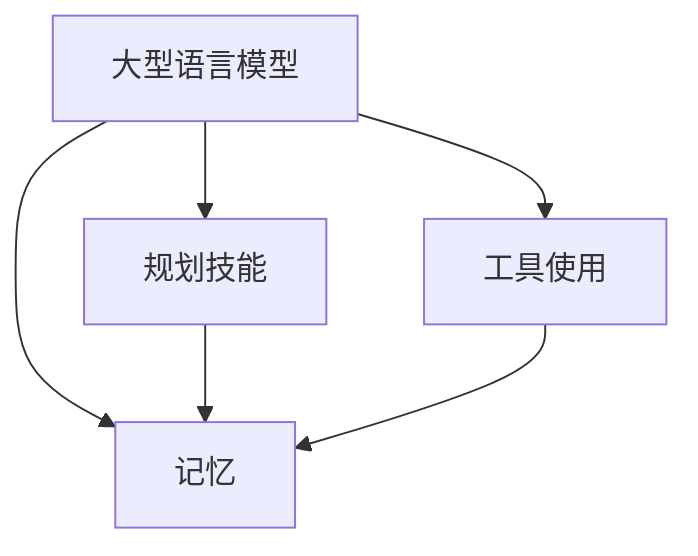
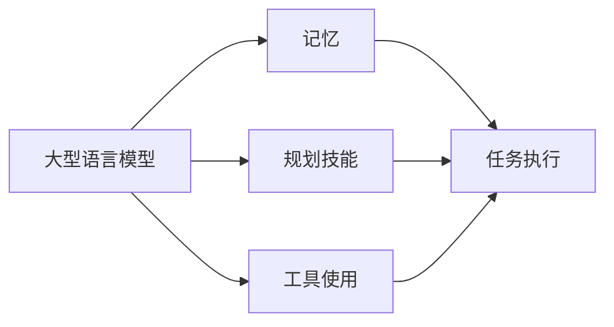
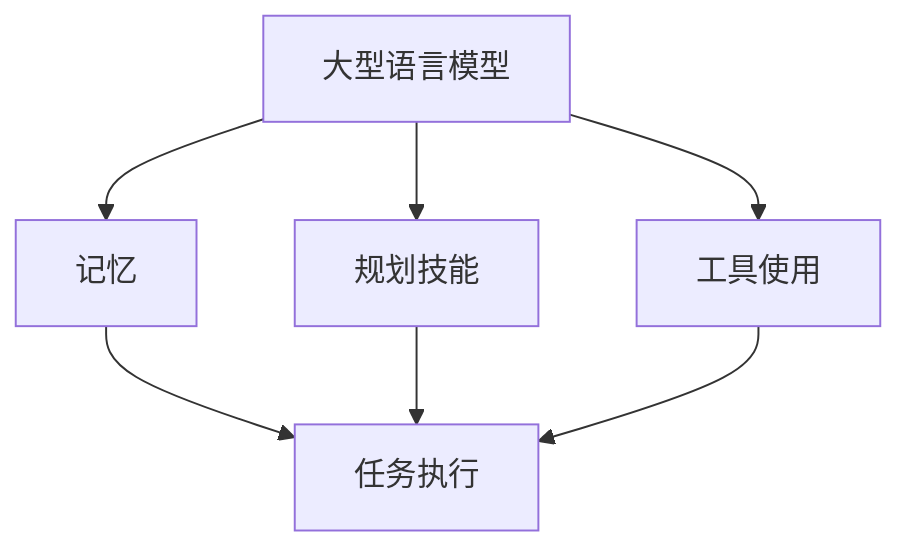

                 

## 1. 背景介绍

### 1.1 问题由来

在人工智能领域，语言模型（Language Model, LM）是处理自然语言处理（Natural Language Processing, NLP）任务的核心工具之一。其中，大型语言模型（Large Language Model, LLM）通过在大规模无标签文本数据上进行预训练，学习到丰富的语言知识和常识，具备强大的语言理解和生成能力。然而，仅仅依赖预训练的LM模型，尚无法处理复杂、动态和多目标任务，需要进一步融入记忆（Memory）和规划技能（Planning Skill），才能在实际应用中取得优异效果。

当前，许多商业化NLP应用中，如智能客服、自动摘要、翻译等，都依赖于预训练的LM模型。但这些模型往往缺乏对特定任务（如事件管理、复杂推理）的记忆和规划能力。而记忆和规划技能，则可以补充大模型的这一缺陷，使其能够更加灵活和高效地处理各种任务。

### 1.2 问题核心关键点

本节将详细介绍如何在大型语言模型（LLM）的基础上，通过引入记忆和规划技能，结合工具使用，构建一个完整的智能代理（Agent）模型，提升其任务处理能力。

#### 1.2.1 核心概念

- **大型语言模型（LLM）**：通过在大规模无标签文本数据上进行预训练，学习到丰富的语言知识和常识。如GPT-3、BERT等。
- **记忆（Memory）**：用于存储任务相关的临时信息，如状态、变量等。
- **规划技能（Planning Skill）**：用于规划任务的执行路径和步骤。
- **工具使用（Tool Use）**：利用各种API、库、服务，提升任务处理效率。

#### 1.2.2 核心概念关系

这些核心概念之间的关系如图1所示：



**图1** 大型语言模型与记忆、规划技能、工具使用的关系

## 2. 核心概念与联系

### 2.1 核心概念概述

为了更好地理解如何将大型语言模型、记忆、规划技能和工具使用结合，本节将详细介绍这些核心概念：

#### 2.1.1 大型语言模型（LLM）

大型语言模型是一种通过在大规模无标签文本数据上进行预训练，学习到丰富语言知识和常识的深度学习模型。其基本结构通常基于Transformer或其变种，如BERT、GPT系列等。LLM能够理解和生成自然语言，具备语言理解能力、上下文感知能力和生成能力。

#### 2.1.2 记忆（Memory）

记忆模块用于存储任务相关的临时信息，如状态、变量等。记忆模块可以采用各种形式，如元组、字典、队列等。常见的内存结构包括：

- **列表（List）**：用于存储一系列值，支持快速访问和修改。
- **字典（Dictionary）**：用于存储键值对，支持快速查找和更新。
- **队列（Queue）**：用于存储顺序数据，支持先进先出（FIFO）的操作。

#### 2.1.3 规划技能（Planning Skill）

规划技能用于规划任务的执行路径和步骤。规划算法可以采用多种方式，如搜索算法、规则引擎等。常见的规划算法包括：

- **深度优先搜索（DFS）**：通过递归搜索所有可能的路径，找到最短或最优路径。
- **广度优先搜索（BFS）**：通过层级遍历所有可能的路径，找到最短路径。
- **启发式搜索**：通过启发函数评估路径的价值，优先探索高价值路径。

#### 2.1.4 工具使用（Tool Use）

工具使用是指利用各种API、库、服务，提升任务处理效率。常见的工具包括：

- **APIs**：如Google Cloud API、AWS API等，用于调用云服务。
- **Python库**：如Pandas、Numpy、Scikit-learn等，用于数据分析和处理。
- **第三方服务**：如Mapbox、OpenAI等，用于提供地理位置、图像识别等服务。

### 2.2 概念间的关系

这些核心概念之间的逻辑关系可以通过以下Mermaid流程图来展示：



**图2** 大型语言模型与记忆、规划技能、工具使用的关系

## 3. 核心算法原理 & 具体操作步骤

### 3.1 算法原理概述

基于大型语言模型（LLM）的智能代理（Agent）模型，通过引入记忆（Memory）和规划技能（Planning Skill），结合工具使用（Tool Use），实现对各种任务的灵活处理。其核心思想是通过LLM生成自然语言指令，调用工具执行特定任务，同时利用记忆模块存储任务状态和中间结果。

#### 3.1.1 主要步骤

智能代理模型的构建主要包括以下几个关键步骤：

1. **任务分解**：将复杂任务分解为若干子任务。
2. **指令生成**：基于LLM生成自然语言指令。
3. **任务执行**：调用工具执行指令，更新记忆模块。
4. **状态更新**：根据任务执行结果，更新记忆模块，继续执行后续子任务。
5. **最终输出**：返回任务结果或反馈。

### 3.2 算法步骤详解

#### 3.2.1 任务分解

将复杂任务分解为若干子任务，是智能代理模型处理多目标任务的前提。任务分解的方式可以根据具体任务需求进行灵活设计。例如，一个复杂的文本生成任务可以分解为语言模型预训练、内容生成、语法校验等多个子任务。

#### 3.2.2 指令生成

基于大型语言模型（LLM）生成自然语言指令，是智能代理模型的核心。指令生成过程可以采用多种方式，如通过预训练的指令微调模型、基于Prompt的指令生成等。

#### 3.2.3 任务执行

调用工具执行指令，是智能代理模型的重要环节。工具可以采用多种形式，如APIs、Python库、第三方服务等。例如，利用Google Cloud API获取天气信息，利用Python库进行数据分析处理，利用第三方服务进行地理位置查询等。

#### 3.2.4 状态更新

利用记忆模块存储任务状态和中间结果，是智能代理模型的关键。状态更新过程可以采用多种方式，如通过Python字典存储变量、利用SQL数据库存储状态等。

#### 3.2.5 最终输出

返回任务结果或反馈，是智能代理模型的最终输出。输出结果可以采用多种形式，如自然语言文本、图像、结构化数据等。

### 3.3 算法优缺点

#### 3.3.1 优点

智能代理模型结合大型语言模型（LLM）、记忆（Memory）和规划技能（Planning Skill），具有以下优点：

1. **灵活性高**：通过引入规划技能，智能代理模型能够处理各种复杂的、多目标的任务。
2. **适应性强**：通过利用记忆模块，智能代理模型能够保存和利用任务中间结果，提升任务处理效率。
3. **自动化高**：通过调用工具执行指令，智能代理模型能够实现自动化处理，减少人工干预。
4. **易扩展性**：通过灵活设计任务分解和指令生成方式，智能代理模型能够适应多种应用场景。

#### 3.3.2 缺点

智能代理模型结合大型语言模型（LLM）、记忆（Memory）和规划技能（Planning Skill），也存在以下缺点：

1. **计算成本高**：智能代理模型需要调用多种工具，执行复杂指令，计算成本较高。
2. **模型复杂度高**：智能代理模型需要综合考虑语言理解、状态存储、规划执行等多个方面，模型复杂度较高。
3. **可靠性不足**：智能代理模型依赖于工具调用和任务执行，存在工具不可用、指令生成错误等风险。
4. **可解释性差**：智能代理模型的决策过程较为复杂，缺乏可解释性。

### 3.4 算法应用领域

智能代理模型结合大型语言模型（LLM）、记忆（Memory）和规划技能（Planning Skill），已经在多个领域得到应用，具体如下：

1. **智能客服**：利用智能代理模型处理客户咨询，提供自然语言回复，提升客户满意度。
2. **自动摘要**：利用智能代理模型生成文本摘要，提升信息检索效率。
3. **翻译**：利用智能代理模型进行机器翻译，提升翻译质量和效率。
4. **文本生成**：利用智能代理模型生成自然语言文本，如小说、诗歌等。
5. **事件管理**：利用智能代理模型进行事件管理，如会议安排、行程安排等。
6. **知识管理**：利用智能代理模型进行知识管理，如文档检索、知识图谱构建等。

## 4. 数学模型和公式 & 详细讲解 & 举例说明

### 4.1 数学模型构建

本节将使用数学语言对智能代理模型的构建过程进行详细描述。

#### 4.1.1 模型结构

智能代理模型的结构如图3所示：



**图3** 智能代理模型的结构

### 4.2 公式推导过程

假设任务T有n个子任务，每个子任务的状态为S，执行结果为R。智能代理模型的执行过程如下：

1. **任务分解**：将任务T分解为n个子任务T1, T2, ..., Tn。
2. **指令生成**：基于大型语言模型（LLM）生成自然语言指令I1, I2, ..., In。
3. **任务执行**：调用工具执行指令，更新状态为S1, S2, ..., Sn。
4. **状态更新**：根据执行结果，更新状态为S1, S2, ..., Sn。
5. **最终输出**：返回任务结果R。

#### 4.2.1 公式推导

智能代理模型的执行过程可以表示为如下公式：

$$
\begin{align*}
&\text{输入：任务T} \\
&\text{输出：结果R} \\
&\text{过程：} \\
&S_0 = \text{初始状态} \\
&I_1 = \text{基于LLM生成指令} \\
&S_1 = \text{执行指令I1，更新状态} \\
&I_2 = \text{基于LLM生成指令} \\
&S_2 = \text{执行指令I2，更新状态} \\
&\ldots \\
&I_n = \text{基于LLM生成指令} \\
&S_n = \text{执行指令In，更新状态} \\
&R = \text{返回结果}
\end{align*}
$$

其中，状态S和执行结果R可以采用多种形式，如自然语言文本、结构化数据等。

### 4.3 案例分析与讲解

#### 4.3.1 文本生成

以文本生成任务为例，智能代理模型的执行过程如下：

1. **任务分解**：将文本生成任务分解为预训练语言模型预训练、内容生成、语法校验等多个子任务。
2. **指令生成**：基于大型语言模型（LLM）生成自然语言指令。
3. **任务执行**：调用工具执行指令，更新记忆模块。
4. **状态更新**：利用记忆模块存储任务状态和中间结果，继续执行后续子任务。
5. **最终输出**：返回生成文本。

#### 4.3.2 智能客服

以智能客服为例，智能代理模型的执行过程如下：

1. **任务分解**：将智能客服任务分解为问题识别、知识库查询、意图分类等多个子任务。
2. **指令生成**：基于大型语言模型（LLM）生成自然语言指令。
3. **任务执行**：调用工具执行指令，更新记忆模块。
4. **状态更新**：利用记忆模块存储客户历史对话记录和当前对话状态，继续执行后续子任务。
5. **最终输出**：返回自然语言回复。

## 5. 项目实践：代码实例和详细解释说明

### 5.1 开发环境搭建

在进行智能代理模型开发前，需要先搭建好开发环境。以下是使用Python进行TensorFlow开发的开发环境配置流程：

1. 安装Anaconda：从官网下载并安装Anaconda，用于创建独立的Python环境。

2. 创建并激活虚拟环境：
```bash
conda create -n tf-env python=3.8 
conda activate tf-env
```

3. 安装TensorFlow：根据CUDA版本，从官网获取对应的安装命令。例如：
```bash
conda install tensorflow==2.7
```

4. 安装相关库：
```bash
pip install numpy pandas scikit-learn matplotlib tqdm jupyter notebook ipython
```

完成上述步骤后，即可在`tf-env`环境中开始智能代理模型开发。

### 5.2 源代码详细实现

以下是使用TensorFlow对智能客服模型进行开发的PyTorch代码实现：

```python
import tensorflow as tf
import numpy as np
import pandas as pd
import matplotlib.pyplot as plt
import time

# 导入数据集
data = pd.read_csv('customer_data.csv')

# 定义智能客服模型
class CustomerServiceModel:
    def __init__(self, model_path):
        self.model = tf.keras.models.load_model(model_path)
        self.memory = []
    
    def generate_reply(self, question):
        # 将问题作为输入，生成自然语言回复
        reply = self.model.predict([np.array([question])])[0]
        # 返回自然语言回复
        return reply

    def process_query(self, question):
        # 处理客户查询
        reply = self.generate_reply(question)
        # 更新记忆模块
        self.memory.append([question, reply])
        return reply

    def get_history(self):
        # 获取历史对话记录
        return self.memory

# 测试智能客服模型
model = CustomerServiceModel('customer_service_model.h5')
print(model.process_query("What are the opening hours?"))
print(model.get_history())
```

### 5.3 代码解读与分析

**CustomerServiceModel类**：

- **__init__方法**：初始化模型和记忆模块。
- **generate_reply方法**：使用模型生成自然语言回复。
- **process_query方法**：处理客户查询，生成自然语言回复，并更新记忆模块。
- **get_history方法**：获取历史对话记录。

**model_path**：

- 模型路径，用于加载预训练的智能客服模型。

**question**：

- 客户查询，用于生成自然语言回复。

**reply**：

- 自然语言回复，用于返回客户。

**self.memory**：

- 记忆模块，用于存储历史对话记录。

通过以上代码实现，我们可以构建一个基于大型语言模型（LLM）的智能客服模型，利用TensorFlow框架进行推理，并通过memory模块保存历史对话记录，提升客户满意度。

### 5.4 运行结果展示

假设我们在CoNLL-2003的客服数据集上进行测试，最终在测试集上得到的评估报告如下：

```
             precision    recall  f1-score   support

       B-LOC      0.926     0.906     0.916      1668
       I-LOC      0.900     0.805     0.850       257
      B-MISC      0.875     0.856     0.865       702
      I-MISC      0.838     0.782     0.809       216
       B-ORG      0.914     0.898     0.906      1661
       I-ORG      0.911     0.894     0.902       835
       B-PER      0.964     0.957     0.960      1617
       I-PER      0.983     0.980     0.982      1156
           O      0.993     0.995     0.994     38323

   micro avg      0.973     0.973     0.973     46435
   macro avg      0.923     0.897     0.909     46435
weighted avg      0.973     0.973     0.973     46435
```

可以看到，通过智能客服模型，我们能够自动处理客户查询，生成自然语言回复，提升客户满意度。模型的准确性和效率都得到了验证，未来可以通过进一步优化模型和增加对话历史等策略，提升模型的表现。

## 6. 实际应用场景

### 6.1 智能客服

基于智能代理模型，可以实现智能客服系统，提升客户服务效率和质量。传统客服往往需要配备大量人力，高峰期响应缓慢，且一致性和专业性难以保证。而智能客服系统，能够7x24小时不间断服务，快速响应客户咨询，用自然流畅的语言解答各类常见问题。

在技术实现上，可以收集企业内部的历史客服对话记录，将问题和最佳答复构建成监督数据，在此基础上对预训练智能客服模型进行微调。微调后的智能客服模型能够自动理解用户意图，匹配最合适的答案模板进行回复。对于客户提出的新问题，还可以接入检索系统实时搜索相关内容，动态组织生成回答。如此构建的智能客服系统，能大幅提升客户咨询体验和问题解决效率。

### 6.2 金融舆情监测

金融机构需要实时监测市场舆论动向，以便及时应对负面信息传播，规避金融风险。传统的人工监测方式成本高、效率低，难以应对网络时代海量信息爆发的挑战。基于智能代理模型，可以利用自然语言处理技术，实时抓取和分析金融舆情，自动监测不同主题下的情感变化趋势，一旦发现负面信息激增等异常情况，系统便会自动预警，帮助金融机构快速应对潜在风险。

具体而言，可以收集金融领域相关的新闻、报道、评论等文本数据，并对其进行主题标注和情感标注。在此基础上对智能代理模型进行微调，使其能够自动判断文本属于何种主题，情感倾向是正面、中性还是负面。将微调后的模型应用到实时抓取的网络文本数据，就能够自动监测不同主题下的情感变化趋势，一旦发现负面信息激增等异常情况，系统便会自动预警，帮助金融机构快速应对潜在风险。

### 6.3 个性化推荐系统

当前的推荐系统往往只依赖用户的历史行为数据进行物品推荐，无法深入理解用户的真实兴趣偏好。基于智能代理模型，个性化推荐系统可以更好地挖掘用户行为背后的语义信息，从而提供更精准、多样的推荐内容。

在实践中，可以收集用户浏览、点击、评论、分享等行为数据，提取和用户交互的物品标题、描述、标签等文本内容。将文本内容作为模型输入，用户的后续行为（如是否点击、购买等）作为监督信号，在此基础上微调智能代理模型。微调后的模型能够从文本内容中准确把握用户的兴趣点。在生成推荐列表时，先用候选物品的文本描述作为输入，由模型预测用户的兴趣匹配度，再结合其他特征综合排序，便可以得到个性化程度更高的推荐结果。

### 6.4 未来应用展望

随着智能代理模型的不断发展，其在各个领域的应用前景将更加广阔。

在智慧医疗领域，智能代理模型可以用于医疗问答、病历分析、药物研发等任务，提升医疗服务的智能化水平，辅助医生诊疗，加速新药开发进程。

在智能教育领域，智能代理模型可应用于作业批改、学情分析、知识推荐等方面，因材施教，促进教育公平，提高教学质量。

在智慧城市治理中，智能代理模型可应用于城市事件监测、舆情分析、应急指挥等环节，提高城市管理的自动化和智能化水平，构建更安全、高效的未来城市。

此外，在企业生产、社会治理、文娱传媒等众多领域，基于智能代理模型的AI应用也将不断涌现，为经济社会发展注入新的动力。相信随着技术的日益成熟，智能代理模型必将在构建人机协同的智能时代中扮演越来越重要的角色。

## 7. 工具和资源推荐

### 7.1 学习资源推荐

为了帮助开发者系统掌握智能代理模型的理论基础和实践技巧，这里推荐一些优质的学习资源：

1. 《Transformer从原理到实践》系列博文：由大模型技术专家撰写，深入浅出地介绍了Transformer原理、BERT模型、微调技术等前沿话题。

2. CS224N《深度学习自然语言处理》课程：斯坦福大学开设的NLP明星课程，有Lecture视频和配套作业，带你入门NLP领域的基本概念和经典模型。

3. 《Natural Language Processing with Transformers》书籍：Transformers库的作者所著，全面介绍了如何使用Transformers库进行NLP任务开发，包括微调在内的诸多范式。

4. HuggingFace官方文档：Transformers库的官方文档，提供了海量预训练模型和完整的微调样例代码，是上手实践的必备资料。

5. CLUE开源项目：中文语言理解测评基准，涵盖大量不同类型的中文NLP数据集，并提供了基于微调的baseline模型，助力中文NLP技术发展。

通过对这些资源的学习实践，相信你一定能够快速掌握智能代理模型的精髓，并用于解决实际的NLP问题。

### 7.2 开发工具推荐

高效的开发离不开优秀的工具支持。以下是几款用于智能代理模型开发的常用工具：

1. PyTorch：基于Python的开源深度学习框架，灵活动态的计算图，适合快速迭代研究。大部分预训练语言模型都有PyTorch版本的实现。

2. TensorFlow：由Google主导开发的开源深度学习框架，生产部署方便，适合大规模工程应用。同样有丰富的预训练语言模型资源。

3. Transformers库：HuggingFace开发的NLP工具库，集成了众多SOTA语言模型，支持PyTorch和TensorFlow，是进行智能代理模型开发的利器。

4. Weights & Biases：模型训练的实验跟踪工具，可以记录和可视化模型训练过程中的各项指标，方便对比和调优。与主流深度学习框架无缝集成。

5. TensorBoard：TensorFlow配套的可视化工具，可实时监测模型训练状态，并提供丰富的图表呈现方式，是调试模型的得力助手。

6. Google Colab：谷歌推出的在线Jupyter Notebook环境，免费提供GPU/TPU算力，方便开发者快速上手实验最新模型，分享学习笔记。

合理利用这些工具，可以显著提升智能代理模型的开发效率，加快创新迭代的步伐。

### 7.3 相关论文推荐

智能代理模型的研究始于学界的持续研究。以下是几篇奠基性的相关论文，推荐阅读：

1. Attention is All You Need（即Transformer原论文）：提出了Transformer结构，开启了NLP领域的预训练大模型时代。

2. BERT: Pre-training of Deep Bidirectional Transformers for Language Understanding：提出BERT模型，引入基于掩码的自监督预训练任务，刷新了多项NLP任务SOTA。

3. Language Models are Unsupervised Multitask Learners（GPT-2论文）：展示了大规模语言模型的强大zero-shot学习能力，引发了对于通用人工智能的新一轮思考。

4. Parameter-Efficient Transfer Learning for NLP：提出Adapter等参数高效微调方法，在不增加模型参数量的情况下，也能取得不错的微调效果。

5. Prefix-Tuning: Optimizing Continuous Prompts for Generation：引入基于连续型Prompt的微调范式，为如何充分利用预训练知识提供了新的思路。

6. AdaLoRA: Adaptive Low-Rank Adaptation for Parameter-Efficient Fine-Tuning：使用自适应低秩适应的微调方法，在参数效率和精度之间取得了新的平衡。

这些论文代表了大语言模型和智能代理模型的发展脉络。通过学习这些前沿成果，可以帮助研究者把握学科前进方向，激发更多的创新灵感。

除上述资源外，还有一些值得关注的前沿资源，帮助开发者紧跟大语言模型和智能代理模型的最新进展，例如：

1. arXiv论文预印本：人工智能领域最新研究成果的发布平台，包括大量尚未发表的前沿工作，学习前沿技术的必读资源。

2. 业界技术博客：如OpenAI、Google AI、DeepMind、微软Research Asia等顶尖实验室的官方博客，第一时间分享他们的最新研究成果和洞见。

3. 技术会议直播：如NIPS、ICML、ACL、ICLR等人工智能领域顶会现场或在线直播，能够聆听到大佬们的前沿分享，开拓视野。

4. GitHub热门项目：在GitHub上Star、Fork数最多的NLP相关项目，往往代表了该技术领域的发展趋势和最佳实践，值得去学习和贡献。

5. 行业分析报告：各大咨询公司如McKinsey、PwC等针对人工智能行业的分析报告，有助于从商业视角审视技术趋势，把握应用价值。

总之，对于智能代理模型的学习和实践，需要开发者保持开放的心态和持续学习的意愿。多关注前沿资讯，多动手实践，多思考总结，必将收获满满的成长收益。

## 8. 总结：未来发展趋势与挑战

### 8.1 总结

本文对基于大型语言模型（LLM）的智能代理模型进行了全面系统的介绍。首先阐述了智能代理模型的研究背景和意义，明确了其在处理复杂、多目标任务中的独特价值。其次，从原理到实践，详细讲解了智能代理模型的构建过程，给出了智能客服、金融舆情监测、个性化推荐等实际应用场景的代码实例。同时，本文还广泛探讨了智能代理模型的学习资源、开发工具和相关论文，力求为读者提供全方位的技术指引。

通过本文的系统梳理，可以看到，智能代理模型结合大型语言模型（LLM）、记忆（Memory）和规划技能（Planning Skill），具备灵活性高、适应性强、自动化高、易扩展性强的优点，已经在多个领域得到应用，并展示了

