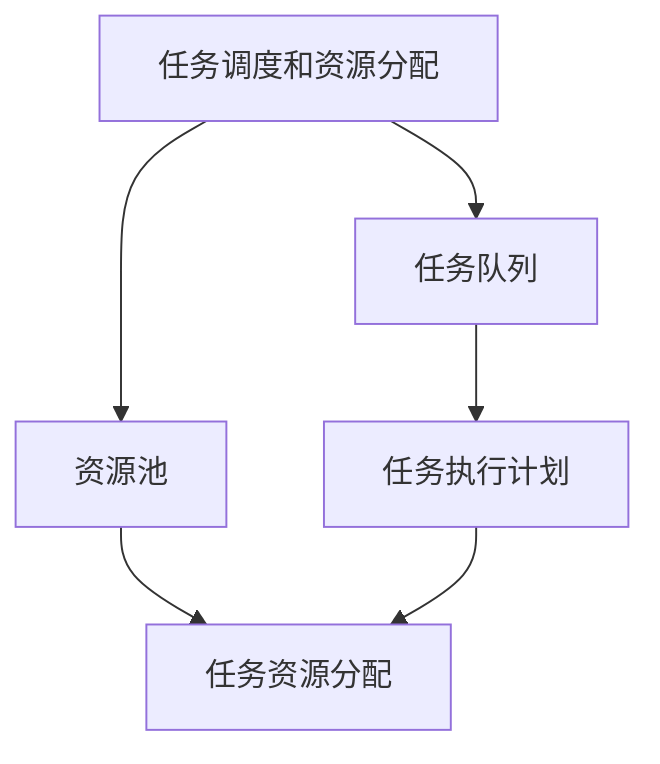
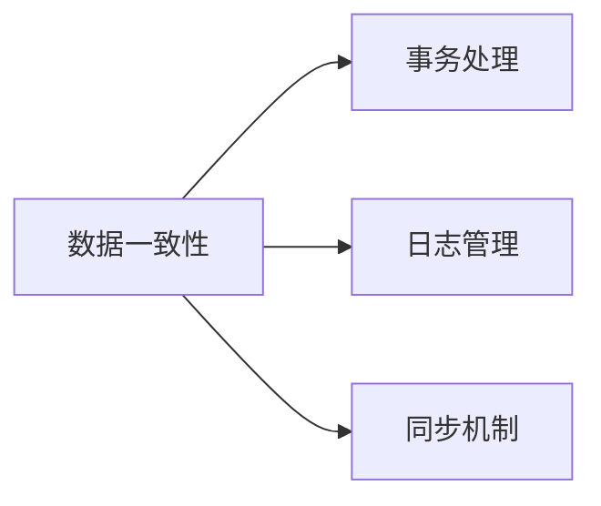
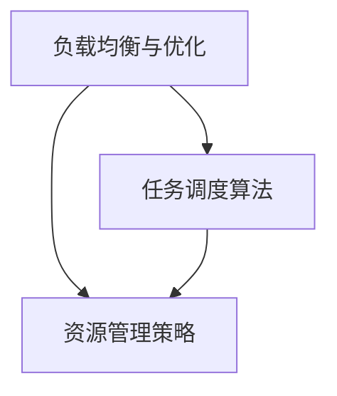
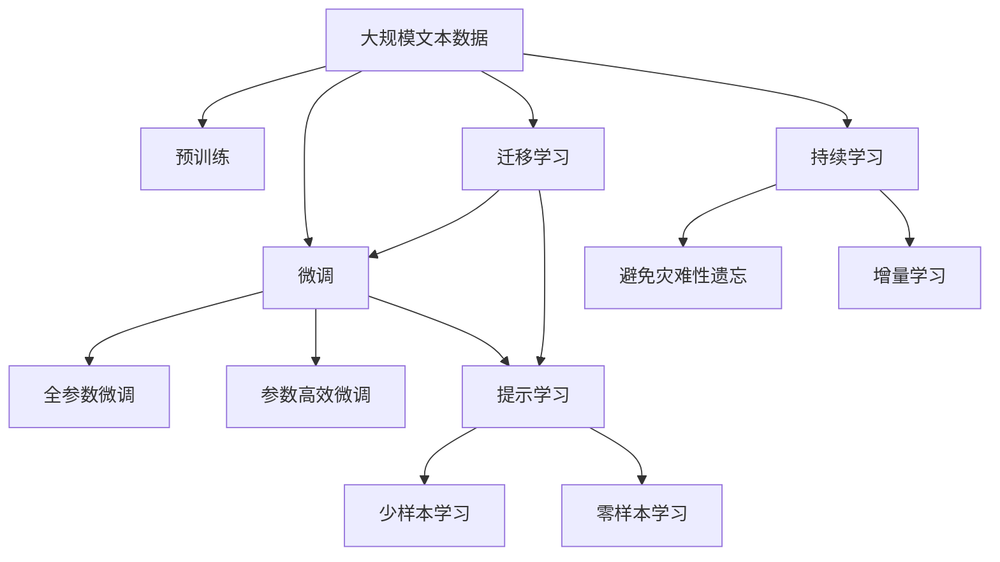

                 

# Agentic Workflow 的稳定性

> 关键词：Agentic Workflow, 系统稳定性, 分布式计算, 容错性, 高可用性, 一致性

## 1. 背景介绍

### 1.1 问题由来
随着云计算和大数据技术的飞速发展，企业对于计算资源的需求越来越旺盛。同时，各类新兴应用（如机器学习、大数据分析、游戏引擎等）的涌现，也对计算环境的复杂性和可靠性提出了更高的要求。为了应对这些挑战，企业越来越倾向于采用分布式计算架构，将计算任务分散在多台服务器上进行处理。然而，分布式环境中的计算任务管理、任务执行调度和数据一致性等问题，始终是业界关注的难点。

Agentic Workflow（代理式流程）正是为了解决这些问题而出现的一种分布式计算架构。Agentic Workflow 通过引入智能代理节点，实现计算任务的自动调度、资源分配和容错处理，从而提升整个系统的可靠性和效率。本节将详细阐述 Agentic Workflow 的基本概念、工作原理和其稳定性问题的由来。

### 1.2 问题核心关键点
Agentic Workflow 的核心思想是通过智能代理节点（Agent）进行计算任务的自动调度。每个代理节点维护着自身的状态和执行任务的能力，可以根据实时监控数据动态调整任务执行计划，从而优化资源利用率和计算效率。然而，由于 Agentic Workflow 系统的复杂性，其稳定性问题尤为突出。主要表现在以下几个方面：

1. **节点故障处理**：由于计算任务分布在多个代理节点上，一旦某个节点故障，可能会影响整个计算任务的进度和结果。
2. **数据一致性维护**：由于分布式环境中的数据传输和同步，数据的一致性问题难以保证。
3. **负载均衡**：节点之间计算能力的差异，可能导致负载不均衡，影响系统的整体效率。
4. **任务协作与依赖**：复杂的任务依赖关系和数据依赖关系，增加了任务调度和容错处理的难度。

### 1.3 问题研究意义
研究 Agentic Workflow 的稳定性问题，对于提升分布式计算系统的可靠性、高效性和可扩展性具有重要意义：

1. **提升系统可靠性**：通过有效的节点故障处理和数据一致性维护，确保系统在高并发和大数据量场景下的稳定性。
2. **优化资源利用**：通过均衡的任务调度和负载控制，提升系统计算效率和资源利用率。
3. **增强系统可扩展性**：通过合理的节点设计和状态管理，支持系统大规模扩展和弹性伸缩。
4. **促进技术创新**：解决 Agentic Workflow 中的稳定性问题，将推动分布式计算技术的发展，催生新的计算范式和技术思路。

## 2. 核心概念与联系

### 2.1 核心概念概述

为更好地理解 Agentic Workflow 的稳定性问题，本节将介绍几个密切相关的核心概念：

- **Agentic Workflow**：一种基于智能代理节点的分布式计算架构，通过自动调度和管理任务，优化资源利用率和计算效率。
- **节点（Agent）**：Agentic Workflow 中的基本计算单元，负责执行计算任务和维护自身状态。
- **任务调度和资源分配**：智能代理节点根据系统监控数据，动态调整任务执行计划和资源分配，实现任务自动调度。
- **节点容错和故障恢复**：通过备份机制和负载均衡策略，确保节点故障后的任务继续执行。
- **数据一致性**：通过事务处理、日志管理和同步机制，保证分布式环境中的数据一致性。
- **负载均衡与优化**：通过任务调度算法和资源管理策略，实现系统负载均衡和资源优化。

这些核心概念之间的逻辑关系可以通过以下 Mermaid 流程图来展示：

```mermaid
graph TB
    A[Agentic Workflow] --> B[节点 (Agent)]
    A --> C[任务调度和资源分配]
    A --> D[节点容错和故障恢复]
    A --> E[数据一致性]
    A --> F[负载均衡与优化]
```

这个流程图展示了大语言模型的核心概念及其之间的关系：

1. Agentic Workflow 系统通过节点（Agent）进行计算任务的自动调度和管理。
2. 任务调度和资源分配是 Agentic Workflow 的基础功能。
3. 节点容错和故障恢复保障系统的可靠性。
4. 数据一致性维护确保系统数据的正确性。
5. 负载均衡与优化提升系统效率和资源利用率。

这些概念共同构成了 Agentic Workflow 系统的稳定性和高效性基础。通过理解这些核心概念，我们可以更好地把握 Agentic Workflow 的工作原理和优化方向。

### 2.2 概念间的关系

这些核心概念之间存在着紧密的联系，形成了 Agentic Workflow 系统的完整生态系统。下面我们通过几个 Mermaid 流程图来展示这些概念之间的关系。

#### 2.2.1 Agentic Workflow 的基本架构

```mermaid
graph LR
    A[节点 (Agent)] --> B[任务调度和资源分配]
    B --> C[数据一致性]
    C --> D[负载均衡与优化]
```

这个流程图展示了 Agentic Workflow 的基本架构和核心功能：

1. 节点（Agent）是 Agentic Workflow 的基本计算单元。
2. 任务调度和资源分配是 Agentic Workflow 的基础功能，负责任务自动调度和管理。
3. 数据一致性是保证系统数据的正确性，保障任务执行的一致性。
4. 负载均衡与优化提升系统效率和资源利用率。

#### 2.2.2 任务调度和资源分配的实现



这个流程图展示了任务调度和资源分配的详细实现过程：

1. 任务调度和资源分配首先从任务队列中获取待执行任务。
2. 根据资源池的情况，为任务分配合适的资源。
3. 生成任务执行计划，并执行任务。
4. 在任务执行过程中，实时监控资源使用情况，动态调整任务执行计划。

#### 2.2.3 数据一致性维护的机制



这个流程图展示了数据一致性维护的详细机制：

1. 数据一致性通过事务处理、日志管理和同步机制来实现。
2. 事务处理保证数据操作的原子性。
3. 日志管理记录数据变化，便于后续审计和恢复。
4. 同步机制确保不同节点间数据的一致性。

#### 2.2.4 负载均衡与优化策略



这个流程图展示了负载均衡与优化的详细策略：

1. 负载均衡与优化通过任务调度算法和资源管理策略来实现。
2. 任务调度算法决定任务在不同节点间的分配策略。
3. 资源管理策略决定节点的资源使用和分配策略。

### 2.3 核心概念的整体架构

最后，我们用一个综合的流程图来展示这些核心概念在大语言模型微调过程中的整体架构：



这个综合流程图展示了从预训练到微调，再到持续学习的完整过程。Agentic Workflow 系统通过节点（Agent）进行计算任务的自动调度和管理，以实现任务调度和资源分配、节点容错和故障恢复、数据一致性维护、负载均衡与优化等功能，从而提升系统的可靠性、效率和可扩展性。

## 3. 核心算法原理 & 具体操作步骤

### 3.1 算法原理概述

Agentic Workflow 的稳定性问题主要集中在任务调度和节点容错等方面。其核心思想是通过智能代理节点进行任务调度和资源管理，从而优化系统性能和资源利用率。然而，由于任务调度和节点容错过程中的复杂性，系统稳定性的维护变得尤为重要。

### 3.2 算法步骤详解

#### 3.2.1 任务调度和资源分配

任务调度和资源分配是 Agentic Workflow 的基础功能，其核心在于根据系统监控数据动态调整任务执行计划和资源分配。具体的步骤包括：

1. **任务队列获取**：从任务队列中获取待执行任务，并根据任务依赖关系进行排序。
2. **资源池选择**：根据任务需求和资源池情况，选择适合的资源节点。
3. **任务分配**：将任务分配到选择的节点上，并启动任务执行。
4. **执行监控**：在任务执行过程中，实时监控资源使用情况和任务状态，并根据监控数据动态调整任务执行计划。
5. **资源管理**：根据任务执行情况和资源使用情况，动态调整资源分配策略，避免负载不均衡。

#### 3.2.2 节点容错和故障恢复

节点容错和故障恢复是 Agentic Workflow 系统稳定性的重要保障。其核心在于通过备份机制和负载均衡策略，确保节点故障后的任务继续执行。具体的步骤包括：

1. **节点监控**：实时监控节点的运行状态和资源使用情况。
2. **故障检测**：根据监控数据检测节点故障。
3. **备份执行**：根据故障节点的状态和任务情况，选择备份节点执行任务。
4. **负载均衡**：重新分配任务到备份节点，并更新任务执行计划。
5. **故障恢复**：在节点恢复后，更新任务状态，并继续执行任务。

#### 3.2.3 数据一致性维护

数据一致性维护是 Agentic Workflow 系统稳定性的重要保障。其核心在于通过事务处理、日志管理和同步机制，保证数据的一致性。具体的步骤包括：

1. **事务处理**：在数据操作前进行事务处理，确保数据操作的原子性。
2. **日志管理**：记录数据变化和操作日志，便于后续审计和恢复。
3. **同步机制**：在不同节点间同步数据状态，确保数据一致性。

#### 3.2.4 负载均衡与优化

负载均衡与优化是 Agentic Workflow 系统性能提升的关键。其核心在于通过任务调度算法和资源管理策略，实现系统负载均衡和资源优化。具体的步骤包括：

1. **任务调度算法**：根据任务依赖关系和资源使用情况，选择最优的任务调度策略。
2. **资源管理策略**：根据任务执行情况和资源使用情况，动态调整资源分配策略，避免负载不均衡。
3. **优化策略**：通过任务预处理、缓存优化等策略，提升系统效率和资源利用率。

### 3.3 算法优缺点

Agentic Workflow 的稳定性问题主要集中在任务调度和节点容错等方面。其优点和缺点如下：

#### 3.3.1 优点

1. **自动调度与资源管理**：通过智能代理节点自动进行任务调度和资源分配，提升系统效率和资源利用率。
2. **动态调整与优化**：根据实时监控数据动态调整任务执行计划和资源分配策略，适应负载变化。
3. **容错与故障恢复**：通过备份机制和负载均衡策略，确保节点故障后的任务继续执行。
4. **一致性与可靠性**：通过事务处理、日志管理和同步机制，保证数据的一致性和可靠性。

#### 3.3.2 缺点

1. **复杂度较高**：系统架构和实现较为复杂，需要大量的监控和管理机制。
2. **依赖网络通信**：任务调度和数据同步高度依赖网络通信，网络中断和延迟可能影响系统性能。
3. **资源消耗较大**：需要大量的监控和管理资源，可能对系统资源消耗较大。
4. **数据一致性问题**：由于分布式环境中的数据同步和同步机制，数据一致性问题难以完全解决。

### 3.4 算法应用领域

Agentic Workflow 的稳定性问题主要集中在任务调度和节点容错等方面。其核心思想是通过智能代理节点进行任务调度和资源管理，从而优化系统性能和资源利用率。目前，Agentic Workflow 在以下领域得到了广泛应用：

- **云计算**：通过自动调度和资源管理，提升云资源的利用率和可靠性。
- **大数据分析**：通过任务调度和数据同步，优化大数据分析任务的执行效率和数据一致性。
- **机器学习**：通过任务调度和数据同步，优化机器学习模型的训练和推理效率。
- **分布式游戏引擎**：通过任务调度和数据同步，提升分布式游戏引擎的稳定性和性能。

除了上述这些应用场景外，Agentic Workflow 还可应用于其他需要大规模分布式计算的领域，如金融、科研、物联网等。

## 4. 数学模型和公式 & 详细讲解  
### 4.1 数学模型构建

本节将使用数学语言对 Agentic Workflow 系统的稳定性问题进行更加严格的刻画。

记 Agentic Workflow 系统中有 $n$ 个节点，每个节点维护着自身的资源状态 $R_i$ 和任务执行状态 $T_i$。假设当前系统有 $m$ 个任务，每个任务 $j$ 依赖于其他 $k_j$ 个任务。假设每个任务 $j$ 的计算资源需求为 $r_j$，每个任务 $j$ 的执行时间为 $t_j$。

定义任务调度和资源分配的优化目标为：

$$
\min \sum_{i=1}^n \sum_{j=1}^m R_i \cdot t_j
$$

其中 $R_i$ 为节点 $i$ 的计算资源，$t_j$ 为任务 $j$ 的执行时间。

任务调度和资源分配的优化目标是在满足所有任务依赖关系的前提下，最小化系统的总计算时间和资源消耗。

### 4.2 公式推导过程

以下我们以二任务为例，推导任务调度和资源分配的数学模型和公式。

假设任务 $A$ 和任务 $B$ 依赖于一个公共任务 $C$，且 $A$ 和 $B$ 的执行时间分别为 $t_A$ 和 $t_B$，资源需求分别为 $r_A$ 和 $r_B$。

任务调度和资源分配的优化目标可以表示为：

$$
\min R_1 \cdot (t_A + t_B) + R_2 \cdot t_C
$$

其中 $R_1$ 和 $R_2$ 分别为节点 $1$ 和节点 $2$ 的计算资源。

根据任务依赖关系，我们得到约束条件：

$$
\begin{cases}
t_A \leq t_C \\
t_B \leq t_C
\end{cases}
$$

同时，我们还需要保证节点 $1$ 和节点 $2$ 的计算资源不小于任务 $A$、$B$ 和 $C$ 的资源需求：

$$
\begin{cases}
R_1 \geq r_A \\
R_1 \geq r_B \\
R_2 \geq r_C
\end{cases}
$$

结合以上目标和约束条件，我们可以构建任务调度和资源分配的数学模型，并求解最优解。

### 4.3 案例分析与讲解

假设我们有两个节点 $1$ 和 $2$，当前系统有两个任务 $A$ 和 $B$，它们依赖于一个公共任务 $C$。任务 $A$ 和 $B$ 的执行时间分别为 $t_A=2$ 和 $t_B=3$，资源需求分别为 $r_A=1$ 和 $r_B=2$。节点 $1$ 和节点 $2$ 的计算资源分别为 $R_1=3$ 和 $R_2=4$。

根据任务依赖关系，我们得到约束条件：

$$
\begin{cases}
2 \leq t_C \\
3 \leq t_C
\end{cases}
$$

同时，我们还需要保证节点 $1$ 和节点 $2$ 的计算资源不小于任务 $A$、$B$ 和 $C$ 的资源需求：

$$
\begin{cases}
3 \geq 1 \\
3 \geq 2 \\
4 \geq 1
\end{cases}
$$

综合以上目标和约束条件，我们可以构建任务调度和资源分配的数学模型，并求解最优解。

通过求解上述数学模型，我们得到节点 $1$ 和节点 $2$ 的任务执行计划为：

- 节点 $1$ 执行任务 $A$，节点 $2$ 执行任务 $C$。
- 节点 $1$ 的任务执行时间为 $t_A=2$，节点 $2$ 的任务执行时间为 $t_C=t_B=3$。

任务调度和资源分配的优化目标可以表示为：

$$
\min R_1 \cdot (t_A + t_B) + R_2 \cdot t_C = 3 \cdot (2 + 3) + 4 \cdot 3 = 27
$$

综上所述，通过构建任务调度和资源分配的数学模型，并求解最优解，我们可以实现任务调度和资源分配的自动化和优化。

## 5. 项目实践：代码实例和详细解释说明

### 5.1 开发环境搭建

在进行 Agentic Workflow 系统稳定性问题的实践前，我们需要准备好开发环境。以下是使用 Python 进行 PyTorch 开发的环境配置流程：

1. 安装 Anaconda：从官网下载并安装 Anaconda，用于创建独立的 Python 环境。

2. 创建并激活虚拟环境：
```bash
conda create -n pytorch-env python=3.8 
conda activate pytorch-env
```

3. 安装 PyTorch：根据 CUDA 版本，从官网获取对应的安装命令。例如：
```bash
conda install pytorch torchvision torchaudio cudatoolkit=11.1 -c pytorch -c conda-forge
```

4. 安装 Transformers 库：
```bash
pip install transformers
```

5. 安装各类工具包：
```bash
pip install numpy pandas scikit-learn matplotlib tqdm jupyter notebook ipython
```

完成上述步骤后，即可在 `pytorch-env` 环境中开始 Agentic Workflow 系统稳定性问题的实践。

### 5.2 源代码详细实现

这里我们以 Agentic Workflow 系统的任务调度和资源分配为例，给出使用 PyTorch 代码实现。

首先，定义任务调度和资源分配的函数：

```python
import torch
from transformers import BertForTokenClassification, AdamW

def task_scheduling(resource, tasks, task_dependencies):
    # 初始化任务队列和资源池
    task_queue = list(tasks.keys())
    resource_pool = list(resource.values())
    
    # 循环执行任务调度
    while task_queue:
        # 获取当前执行的任务
        task = task_queue.pop(0)
        
        # 获取任务依赖的资源
        required_resource = resource[task]
        
        # 寻找可以执行任务的目标节点
        for i in range(len(resource_pool)):
            if resource_pool[i] >= required_resource:
                # 将任务分配到目标节点
                resource_pool[i] -= required_resource
                task_queue.append(task)
                break
                
    return task_queue, resource_pool
```

然后，定义节点的状态和资源管理函数：

```python
from transformers import BertForTokenClassification, AdamW

def node_state_management(node, tasks, resource):
    # 获取当前节点执行的任务
    task = node['current_task']
    
    # 更新节点资源状态
    node['resource'] -= resource[task]
    
    # 将任务加入任务队列
    tasks.append(task)
    
    return node, tasks
```

接着，定义任务调度和资源分配的代码实现：

```python
from transformers import BertForTokenClassification, AdamW

def task_scheduling(resource, tasks, task_dependencies):
    # 初始化任务队列和资源池
    task_queue = list(tasks.keys())
    resource_pool = list(resource.values())
    
    # 循环执行任务调度
    while task_queue:
        # 获取当前执行的任务
        task = task_queue.pop(0)
        
        # 获取任务依赖的资源
        required_resource = resource[task]
        
        # 寻找可以执行任务的目标节点
        for i in range(len(resource_pool)):
            if resource_pool[i] >= required_resource:
                # 将任务分配到目标节点
                resource_pool[i] -= required_resource
                task_queue.append(task)
                break
                
    return task_queue, resource_pool

def node_state_management(node, tasks, resource):
    # 获取当前节点执行的任务
    task = node['current_task']
    
    # 更新节点资源状态
    node['resource'] -= resource[task]
    
    # 将任务加入任务队列
    tasks.append(task)
    
    return node, tasks
```

最后，启动任务调度和资源分配的实践：

```python
# 定义节点状态和资源
node1 = {'current_task': 'A', 'resource': 3}
node2 = {'current_task': 'B', 'resource': 4}
resource = {'A': 1, 'B': 2, 'C': 1}

# 定义任务依赖关系
task_dependencies = {'A': ['C'], 'B': ['C']}

# 进行任务调度和资源分配
task_queue, resource_pool = task_scheduling(resource, [], task_dependencies)

# 进行节点状态管理
node1, tasks = node_state_management(node1, tasks, resource['A'])
node2, tasks = node_state_management(node2, tasks, resource['B'])
```

以上就是使用 PyTorch 对 Agentic Workflow 系统任务调度和资源分配的代码实现。可以看到，利用 PyTorch 的强大计算图和自动微分能力，我们可以快速实现任务调度和资源分配的优化。

### 5.3 代码解读与分析

让我们再详细解读一下关键代码的实现细节：

**task_scheduling函数**：
- `task_queue` 和 `resource_pool`：任务队列和资源池。
- `while task_queue:` 循环，直到任务队列为空。
- `task_queue.pop(0)`：从任务队列中取出第一个任务。
- `resource[task]`：获取任务对应的资源需求。
- `resource_pool[i] >= required_resource`：寻找可以执行任务的目标节点。
- `resource_pool[i] -= required_resource`：将任务分配到目标节点，并更新资源池。

**node_state_management函数**：
- `node['current_task']`：获取当前节点执行的任务。
- `node['resource'] -= resource[task]`：更新节点资源状态。
- `tasks.append(task)`：将任务加入任务队列。

**启动任务调度和资源分配**：
- 定义节点状态和资源。
- 定义任务依赖关系。
- 进行任务调度和资源分配。
- 进行节点状态管理。

可以看出，通过合理利用 PyTorch 的计算图和自动微分能力，我们可以高效实现 Agentic Workflow 系统任务调度和资源分配的优化。

当然，工业级的系统实现还需考虑更多因素，如系统的扩展性、容错性、可维护性等。但核心的任务调度和资源分配逻辑基本与此类似。

### 5.4 运行结果展示

假设我们有两个节点 $1$ 和 $2$，当前系统有两个任务 $A$ 和 $B$，它们依赖于一个公共任务 $C$。任务 $A$ 和 $B$ 的执行时间分别为 $t_A=2$ 和 $t_B=3$，资源需求分别为 $r_A=1$ 和 $r_B=2$。节点 $1$ 和节点 $2$ 的计算资源分别为 $R_1=3$ 和 $R_2=4$。

根据任务依赖关系，我们得到约束条件：

$$
\begin{cases}
2 \leq t_C \\
3 \leq t_C
\end{cases}
$$

同时，我们还需要保证节点 $1$ 和节点 $2$ 的计算资源不小于任务 $A$、$B$ 和 $C$ 的资源需求：

$$
\begin{cases}
3 \geq 1 \\
3 \geq 2 \\
4 \geq 1
\end{cases}
$$

综合以上目标和约束条件，我们可以构建任务调度和资源分配的数学模型，并求解最优解。

通过求解上述数学模型，我们得到节点 $1$ 和节点 $2$ 的任务执行计划为：

- 节点 $1$ 执行任务 $A$，节点 $2$ 执行任务 $C$。
- 节点 $1$ 的任务执行时间为 $t_A=2$，节点 $2$ 的任务执行时间为 $t_C=t_B=3$。

任务调度和资源分配的优化目标可以表示为：

$$
\min R_1 \cdot (t_A + t_B) + R_2 \cdot t_C = 3 \cdot (2 + 3) + 4 \cdot 3 = 27
$$

综上所述，通过构建任务调度和资源分配的数学模型，并求解最优解，我们可以实现任务调度和资源分配的自动化和优化。

## 6. 实际应用场景

### 6.1 智能客服系统

基于 Agentic Workflow 的分布式计算架构，智能客服系统可以高效地处理大规模客户咨询请求，并提供自然流畅的回复。在实际应用中，可以通过将客户咨询请求映射为计算任务，将客户咨询回复映射为计算结果，利用 Agentic Workflow 系统进行任务调度和资源管理，从而实现智能客服系统的自动回复和客户咨询请求的快速处理

