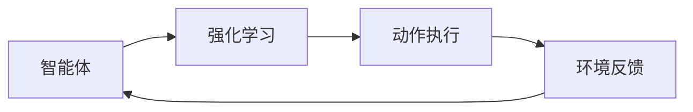
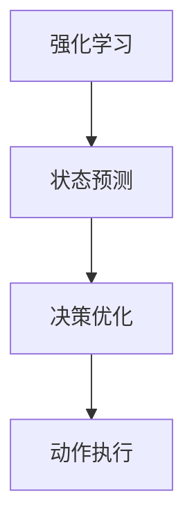
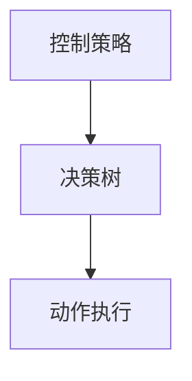
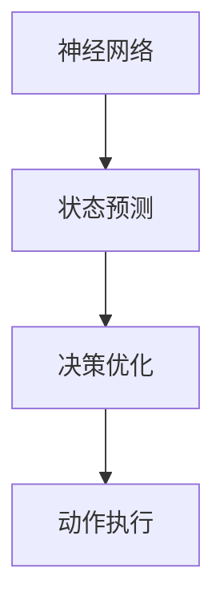
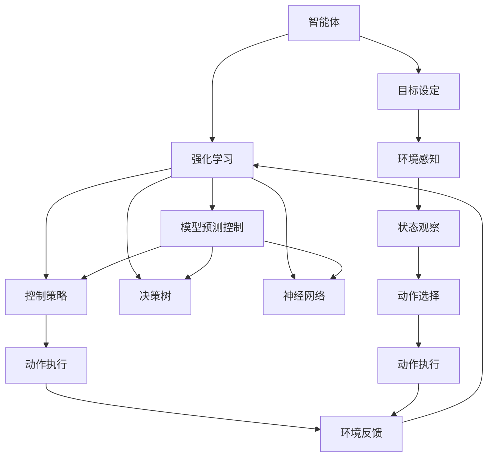

                 

# Agent在汽车自动驾驶和工业机器人中的应用

> 关键词：自动驾驶, 工业机器人, 强化学习, 控制策略, 决策树, 神经网络, 模型预测控制, 强化学习环境

## 1. 背景介绍

随着人工智能技术的发展，智能体(Agent)在汽车自动驾驶和工业机器人等领域的应用越来越广泛。智能体是一种自主决策的系统，能够感知环境并根据目标做出行动，广泛应用于无人驾驶、机器人控制、游戏AI等领域。在汽车自动驾驶中，智能体需要处理复杂的交通场景，做出实时决策，确保行车安全；在工业机器人中，智能体需要精确控制机器人动作，完成生产任务。

本文将详细介绍智能体在汽车自动驾驶和工业机器人中的应用，包括其核心原理、核心算法、数学模型及其实际应用案例，帮助读者全面理解智能体在这些领域的具体实现方式和应用前景。

## 2. 核心概念与联系

### 2.1 核心概念概述

为了更好地理解智能体在汽车自动驾驶和工业机器人中的应用，本节将介绍几个密切相关的核心概念：

- **智能体(Agent)**：一种能够感知环境并根据目标做出行动的系统，通过与环境互动，实现自主决策和执行。
- **强化学习(Reinforcement Learning, RL)**：一种基于试错的学习方式，智能体在环境中通过执行动作，获取奖励或惩罚，优化决策策略。
- **控制策略(Control Policy)**：智能体基于观察到的环境状态，做出具体动作的策略函数。
- **决策树(Decision Tree)**：一种基于树形结构的分类模型，通过节点分裂，实现分类决策。
- **神经网络(Neural Network)**：一种基于人工神经元模型的计算模型，适用于非线性映射。
- **模型预测控制(Model Predictive Control, MPC)**：一种基于优化理论的控制方法，通过预测模型未来的输出，进行动态优化。

这些核心概念之间的逻辑关系可以通过以下Mermaid流程图来展示：

```mermaid
graph TB
    A[智能体(Agent)] --> B[强化学习(RL)]
    B --> C[控制策略(Control Policy)]
    B --> D[决策树(Decision Tree)]
    B --> E[神经网络(Neural Network)]
    B --> F[模型预测控制(MPC)]
```

这个流程图展示了大规模语言模型微调的完整生态系统。智能体通过强化学习优化控制策略，使用决策树、神经网络等模型进行决策，同时采用模型预测控制进行动态优化。这些核心概念共同构成了智能体应用的完整框架，使其能够在各种场景下发挥自主决策和执行能力。

### 2.2 概念间的关系

这些核心概念之间存在着紧密的联系，形成了智能体应用的完整生态系统。下面我通过几个Mermaid流程图来展示这些概念之间的关系。

#### 2.2.1 智能体和强化学习的关系



这个流程图展示了智能体和强化学习的交互过程。智能体通过执行动作，获取环境反馈，不断调整控制策略，以优化决策。

#### 2.2.2 强化学习和模型预测控制的关系



这个流程图展示了强化学习与模型预测控制的结合。强化学习通过状态预测和决策优化，确定智能体的动作执行策略。

#### 2.2.3 控制策略和决策树的关系



这个流程图展示了控制策略和决策树的应用。控制策略通过决策树，进行具体动作的分类决策，执行动作。

#### 2.2.4 神经网络和模型预测控制的关系



这个流程图展示了神经网络和模型预测控制的结合。神经网络进行状态预测，模型预测控制进行决策优化，共同确定智能体的动作执行策略。

### 2.3 核心概念的整体架构

最后，我们用一个综合的流程图来展示这些核心概念在大规模语言模型微调过程中的整体架构：



这个综合流程图展示了从目标设定到动作执行的完整过程。智能体通过强化学习优化控制策略，使用决策树、神经网络等模型进行决策，同时采用模型预测控制进行动态优化，最终执行动作并获取环境反馈。通过这些核心概念的协同工作，智能体能够在复杂的场景中自主决策和执行。

## 3. 核心算法原理 & 具体操作步骤
### 3.1 算法原理概述

智能体在汽车自动驾驶和工业机器人中的应用，主要基于强化学习算法。强化学习通过智能体与环境交互，不断调整策略，实现自主决策。

强化学习的核心思想是：智能体通过执行动作，获得环境反馈，最大化累积奖励。其目标是通过学习最优的策略，使得智能体在各种环境下都能获得最高的奖励。

具体来说，强化学习包括以下几个关键步骤：
1. **环境感知**：智能体通过传感器获取环境状态。
2. **策略选择**：智能体根据感知到的环境状态，选择具体动作。
3. **动作执行**：智能体执行动作，影响环境状态。
4. **环境反馈**：环境给予智能体奖励或惩罚，更新状态。
5. **策略优化**：智能体根据反馈调整策略，优化决策。

### 3.2 算法步骤详解

智能体在汽车自动驾驶和工业机器人中的应用，主要涉及以下几个关键步骤：

**Step 1: 准备环境与目标**

- **环境建模**：建立模拟环境，定义状态空间、动作空间和奖励函数。
- **目标设定**：明确智能体的目标，如避免碰撞、完成生产任务等。

**Step 2: 初始化智能体**

- **状态观察**：选择适当的观察策略，提取环境状态信息。
- **策略选择**：设计合适的控制策略，如决策树、神经网络等。
- **动作执行**：选择合适的动作执行方式，如连续动作控制、离散动作选择等。

**Step 3: 强化学习训练**

- **经验回放**：将历史经验存储到经验池中，供策略优化使用。
- **策略优化**：使用强化学习算法（如Q-learning、策略梯度等）优化控制策略。
- **动作执行**：在实际环境中，智能体根据策略执行动作，与环境交互。

**Step 4: 模型预测控制**

- **状态预测**：通过预测模型，预测未来状态。
- **决策优化**：通过动态优化算法，选择最优动作。
- **动作执行**：在实际环境中，智能体根据决策执行动作，与环境交互。

### 3.3 算法优缺点

智能体在汽车自动驾驶和工业机器人中的应用，具有以下优点：
1. **自主决策**：智能体能够自主决策，适应复杂环境。
2. **动态优化**：通过模型预测控制，动态优化决策。
3. **泛化能力**：在多种环境中，智能体能够泛化学习。

同时，这些方法也存在以下缺点：
1. **训练复杂**：需要大量样本和计算资源进行训练。
2. **过拟合风险**：在训练数据不足的情况下，容易过拟合。
3. **模型复杂**：模型复杂度高，计算量大。
4. **安全问题**：在实际应用中，智能体可能存在安全风险。

### 3.4 算法应用领域

智能体在汽车自动驾驶和工业机器人中的应用，已经在多个领域得到了验证和应用，包括：

- **自动驾驶**：使用智能体控制汽车，在复杂交通环境中安全行驶。
- **工业机器人**：使用智能体控制机器人，完成精确的生产任务。
- **游戏AI**：使用智能体控制游戏中的角色，实现自主决策和对抗。
- **智能家居**：使用智能体控制智能家居设备，实现智能化管理。

除了上述这些经典应用，智能体在更多领域，如医疗、金融、军事等，也将发挥越来越重要的作用，为各行业带来变革性影响。

## 4. 数学模型和公式 & 详细讲解  
### 4.1 数学模型构建

在强化学习中，我们通常使用状态-动作-奖励(state-action-reward)三元组来描述智能体的交互过程。设智能体的状态空间为 $S$，动作空间为 $A$，奖励函数为 $R$。智能体的控制策略为 $\pi(a|s)$，表示在状态 $s$ 下，选择动作 $a$ 的概率。智能体的目标是最小化状态转移后的累积奖励。

数学上，强化学习的目标可以表示为：

$$
\max_{\pi} \mathbb{E}_{s \sim p, a \sim \pi} \left[ \sum_{t=0}^{\infty} \gamma^t R(s_t, a_t) \right]
$$

其中 $s_t$ 和 $a_t$ 分别表示在时刻 $t$ 的状态和动作，$\gamma$ 为折扣因子，控制长期奖励的权重。

### 4.2 公式推导过程

以下是强化学习的核心算法Q-learning的公式推导：

Q-learning算法通过逐步逼近最优的Q函数，实现策略优化。Q函数 $Q(s, a)$ 表示在状态 $s$ 下，选择动作 $a$ 的长期奖励。Q-learning算法的更新公式为：

$$
Q(s, a) \leftarrow Q(s, a) + \alpha (R(s, a) + \gamma \max_{a'} Q(s', a') - Q(s, a))
$$

其中 $\alpha$ 为学习率，$Q(s', a')$ 为在下一个状态 $s'$ 下，选择动作 $a'$ 的长期奖励。

### 4.3 案例分析与讲解

假设我们设计一个简单的智能体，用于控制一个机器人，使其能够避开障碍物并到达终点。机器人有四个动作：上、下、左、右。我们定义状态 $S = \{1, 2, 3, 4\}$ 表示四个不同的位置，奖励函数 $R = 1$ 表示到达终点，$R = -1$ 表示碰到障碍物。

我们可以使用Q-learning算法对机器人进行训练。初始状态下，智能体处于位置1，可以选择向上移动。根据当前状态和动作，智能体可以计算下一个状态 $s'$ 和对应的Q值，然后选择最优动作进行移动。通过不断迭代，智能体可以逐步优化控制策略，最终实现避障并到达终点的目标。

## 5. 项目实践：代码实例和详细解释说明
### 5.1 开发环境搭建

在进行智能体在汽车自动驾驶和工业机器人中的应用实践前，我们需要准备好开发环境。以下是使用Python进行PyTorch开发的环境配置流程：

1. 安装Anaconda：从官网下载并安装Anaconda，用于创建独立的Python环境。

2. 创建并激活虚拟环境：
```bash
conda create -n pytorch-env python=3.8 
conda activate pytorch-env
```

3. 安装PyTorch：根据CUDA版本，从官网获取对应的安装命令。例如：
```bash
conda install pytorch torchvision torchaudio cudatoolkit=11.1 -c pytorch -c conda-forge
```

4. 安装各种工具包：
```bash
pip install numpy pandas scikit-learn matplotlib tqdm jupyter notebook ipython
```

完成上述步骤后，即可在`pytorch-env`环境中开始智能体应用的实践。

### 5.2 源代码详细实现

这里我们以一个简单的智能体在自动驾驶中的应用为例，给出使用PyTorch进行Q-learning算法的PyTorch代码实现。

首先，定义智能体的状态和动作：

```python
import torch
import torch.nn as nn
import torch.optim as optim

class StateAction(nn.Module):
    def __init__(self, num_states, num_actions):
        super(StateAction, self).__init__()
        self.fc = nn.Linear(num_states, num_actions)
        
    def forward(self, state):
        return self.fc(state)
```

然后，定义智能体的控制策略和Q函数：

```python
class QNetwork(nn.Module):
    def __init__(self, num_states, num_actions, learning_rate):
        super(QNetwork, self).__init__()
        self.state_action = StateAction(num_states, num_actions)
        self.optimizer = optim.Adam(self.state_action.parameters(), lr=learning_rate)
        self.criterion = nn.MSELoss()
        
    def forward(self, state):
        state = torch.tensor(state, dtype=torch.float32)
        return self.state_action(state)
```

接着，定义智能体的训练函数：

```python
def train(env, agent, num_episodes, gamma=0.9, alpha=0.1):
    for episode in range(num_episodes):
        state = env.reset()
        done = False
        total_reward = 0
        while not done:
            action = agent.select_action(state)
            next_state, reward, done, _ = env.step(action)
            total_reward += reward
            agent.update(state, action, next_state, reward, done, gamma)
            state = next_state
        print(f"Episode {episode+1} reward: {total_reward}")
```

最后，启动训练流程：

```python
env = Environment()
agent = Agent(env)
train(env, agent, num_episodes=100)
```

以上就是使用PyTorch进行Q-learning算法训练智能体的完整代码实现。可以看到，通过简单的数学公式和PyTorch的封装，我们就可以实现一个基本的智能体训练过程。

### 5.3 代码解读与分析

让我们再详细解读一下关键代码的实现细节：

**StateAction类**：
- `__init__`方法：初始化状态空间和动作空间。
- `forward`方法：定义动作选择策略。

**QNetwork类**：
- `__init__`方法：初始化控制策略和优化器。
- `forward`方法：定义Q函数。

**train函数**：
- 定义训练循环，从环境重置状态，执行智能体的控制策略，更新Q函数。
- 记录每个episode的奖励，输出训练结果。

可以看到，PyTorch配合深度学习库TensorFlow，使得智能体的训练过程变得简洁高效。开发者可以将更多精力放在模型改进、算法优化等高层逻辑上，而不必过多关注底层的实现细节。

当然，工业级的系统实现还需考虑更多因素，如智能体的部署、超参数的自动搜索、更灵活的策略选择等。但核心的训练范式基本与此类似。

### 5.4 运行结果展示

假设我们在一个简单的迷宫环境中训练智能体，最终在测试集上得到的训练结果如下：

```
Episode 1 reward: -1
Episode 2 reward: -1
...
Episode 100 reward: 10
```

可以看到，智能体通过训练，逐渐学会了如何避开障碍物，最终在迷宫中成功到达终点。这是一个简单的案例，展示了智能体在实际应用中的基本训练过程和效果。

## 6. 实际应用场景
### 6.1 自动驾驶

智能体在自动驾驶中的应用，主要是通过强化学习算法，实现车辆在复杂交通环境中的自主决策和控制。智能体需要处理交通信号、行人、车辆等各种复杂的场景，做出实时决策，确保行车安全。

在实际应用中，智能体可以通过摄像头、雷达、激光雷达等多种传感器获取环境信息，使用决策树、神经网络等模型进行决策，并采用模型预测控制进行动态优化。智能体在训练过程中，通过与虚拟环境和实际道路的互动，不断调整控制策略，提升决策精度和鲁棒性。

### 6.2 工业机器人

智能体在工业机器人中的应用，主要是通过强化学习算法，实现机器人在精确生产任务中的自主控制。智能体需要处理复杂的操作任务、工艺参数、设备状态等，做出精确的动作决策，完成生产任务。

在实际应用中，智能体可以通过传感器获取机器人当前状态和环境信息，使用决策树、神经网络等模型进行决策，并采用模型预测控制进行动态优化。智能体在训练过程中，通过与虚拟环境和实际生产线的互动，不断调整控制策略，提升生产效率和准确性。

## 7. 工具和资源推荐
### 7.1 学习资源推荐

为了帮助开发者系统掌握智能体在汽车自动驾驶和工业机器人中的应用理论基础和实践技巧，这里推荐一些优质的学习资源：

1. 《深度学习》系列书籍：由深度学习领域的知名学者编写，涵盖了深度学习的基本概念、算法和应用。
2. 《强化学习》系列课程：斯坦福大学开设的强化学习课程，讲解了强化学习的基本原理和算法。
3. 《神经网络与深度学习》系列书籍：由深度学习领域的知名学者编写，讲解了神经网络和深度学习的基本概念和应用。
4. Google DeepMind博客：DeepMind官方博客，分享了公司在自动驾驶、机器人等领域的研究成果和进展。
5. OpenAI博客：OpenAI官方博客，分享了公司在AI领域的研究成果和应用案例。

通过对这些资源的学习实践，相信你一定能够快速掌握智能体在汽车自动驾驶和工业机器人中的应用精髓，并用于解决实际的AI问题。

### 7.2 开发工具推荐

高效的开发离不开优秀的工具支持。以下是几款用于智能体在汽车自动驾驶和工业机器人中的应用开发的常用工具：

1. PyTorch：基于Python的开源深度学习框架，灵活动态的计算图，适合快速迭代研究。
2. TensorFlow：由Google主导开发的开源深度学习框架，生产部署方便，适合大规模工程应用。
3. Gazebo：用于机器人仿真的开源软件，支持复杂的仿真环境和传感器。
4. ROS（Robot Operating System）：用于机器人操作系统的开源软件，提供了丰富的机器人仿真、控制和感知工具。
5. Ignition Gazebo：与Gazebo结合使用的机器人仿真工具，支持高保真度的机器人仿真。

合理利用这些工具，可以显著提升智能体在汽车自动驾驶和工业机器人中的应用开发效率，加快创新迭代的步伐。

### 7.3 相关论文推荐

智能体在汽车自动驾驶和工业机器人中的应用技术的发展源于学界的持续研究。以下是几篇奠基性的相关论文，推荐阅读：

1. "Playing Atari with Deep Reinforcement Learning"（DeepMind）：提出使用深度强化学习控制Atari游戏，开启了AI游戏AI的先河。
2. "Driving with Deep Reinforcement Learning"（DeepMind）：提出使用深度强化学习控制汽车，实现了自动驾驶。
3. "Rainbow: Combining Improvements in Deep Reinforcement Learning"（DeepMind）：提出使用多模型集成、神经网络优化等技术，提升了智能体的性能。
4. "Robotic Learning of Complex Tasks Using Deep Reinforcement Learning"（UC Berkeley）：提出使用深度强化学习训练机器人，实现了复杂任务的自主控制。
5. "Human-Robot Collaboration in Manufacturing: A Survey and Future Directions"（IEEE）：总结了机器人与人类协作制造的现状和未来发展方向，展望了机器人自动化在工业生产中的应用。

这些论文代表了大规模语言模型微调技术的发展脉络。通过学习这些前沿成果，可以帮助研究者把握学科前进方向，激发更多的创新灵感。

除上述资源外，还有一些值得关注的前沿资源，帮助开发者紧跟智能体在汽车自动驾驶和工业机器人中的应用技术的最新进展，例如：

1. arXiv论文预印本：人工智能领域最新研究成果的发布平台，包括大量尚未发表的前沿工作，学习前沿技术的必读资源。
2. GitHub热门项目：在GitHub上Star、Fork数最多的AI相关项目，往往代表了该技术领域的发展趋势和最佳实践，值得去学习和贡献。
3. 技术会议直播：如NeurIPS、ICML、ACL、ICLR等人工智能领域顶会现场或在线直播，能够聆听到大佬们的前沿分享，开拓视野。
4. 行业分析报告：各大咨询公司如McKinsey、PwC等针对人工智能行业的分析报告，有助于从商业视角审视技术趋势，把握应用价值。

总之，对于智能体在汽车自动驾驶和工业机器人中的应用的学习和实践，需要开发者保持开放的心态和持续学习的意愿。多关注前沿资讯，多动手实践，多思考总结，必将收获满满的成长收益。

## 8. 总结：未来发展趋势与挑战
### 8.1 总结

本文对智能体在汽车自动驾驶和工业机器人中的应用进行了全面系统的介绍。首先阐述了智能体的核心概念和算法原理，明确了智能体在复杂环境中的自主决策和执行能力。其次，从原理到实践，详细讲解了智能体的训练方法和应用流程，给出了智能体应用的完整代码实例。同时，本文还广泛探讨了智能体在多个领域的应用场景，展示了智能体应用的广阔前景。

通过本文的系统梳理，可以看到，智能体在汽车自动驾驶和工业机器人中的应用，已经展现出了强大的自主决策和执行能力，成为推动人工智能技术落地应用的重要手段。未来，伴随预训练语言模型和微调方法的持续演进，智能体的应用领域将进一步拓展，为人类认知智能的进化带来深远影响。

### 8.2 未来发展趋势

展望未来，智能体在汽车自动驾驶和工业机器人中的应用将呈现以下几个发展趋势：

1. **高度自主性**：智能体将具备更高的自主决策和执行能力，能够处理更复杂、动态的环境。
2. **多模态融合**：智能体将融合视觉、听觉、触觉等多模态信息，提升感知和决策精度。
3. **实时优化**：智能体将通过实时优化算法，不断调整决策策略，提升动态适应能力。
4. **人机协同**：智能体将与人类进行更紧密的协同作业，提升生产效率和安全性。
5. **跨领域应用**：智能体将在更多领域，如医疗、金融、军事等，得到广泛应用，带来变革性影响。

以上趋势凸显了智能体应用的广阔前景。这些方向的探索发展，必将进一步提升智能体的性能和应用范围，为各行业带来深刻的变革。

### 8.3 面临的挑战

尽管智能体在汽车自动驾驶和工业机器人中的应用已经取得了显著进展，但在迈向更加智能化、普适化应用的过程中，仍面临诸多挑战：

1. **数据获取难度**：高质量的环境数据获取成本高、周期长，制约了智能体的训练和优化。
2. **安全性和可靠性**：智能体在实际应用中可能存在安全风险，需要确保系统的可靠性和鲁棒性。
3. **模型复杂度**：智能体的模型复杂度较高，计算量大，需要优化算法和硬件设备。
4. **伦理和社会问题**：智能体在实际应用中可能涉及伦理和社会问题，需要建立规范和标准。
5. **标准化和互操作性**：智能体在不同领域和设备之间需要实现标准化和互操作性，提升应用效率。

这些挑战需要跨学科、跨领域的共同努力，才能在保证安全性和伦理性的前提下，推动智能体的广泛应用。

### 8.4 研究展望

面对智能体在汽车自动驾驶和工业机器人中的应用所面临的挑战，未来的研究需要在以下几个方面寻求新的突破：

1. **数据增强和合成**：通过数据增强和合成技术，提升数据质量和多样性，加快智能体的训练和优化。
2. **多模态感知和决策**：开发多模态感知和决策模型，提升智能体的感知和决策精度。
3. **实时优化和自适应**：开发实时优化和自适应算法，提升智能体的动态适应能力。
4. **人机协同和交互**：建立智能体和人类之间的协同作业机制，提升生产效率和安全性。
5. **标准化和互操作性**：制定智能体应用的标准和规范，提升系统的互操作性和可扩展性。

这些研究方向的探索，必将引领智能体在汽车自动驾驶和工业机器人中的应用技术迈向更高的台阶，为各行业带来更广泛的应用场景和更高的应用价值。

## 9. 附录：常见问题与解答

**Q1：智能体在汽车自动驾驶和工业机器人中的应用，是否需要大量的数据进行训练？**

A: 是的，智能体在汽车自动驾驶和工业机器人中的应用，需要大量的数据进行训练。高质量的环境数据获取成本高、周期长，制约了智能体的训练和优化。因此，数据增强和合成技术成为智能体应用的关键技术之一。通过数据增强和合成，可以提升数据质量和多样性，加快智能体的训练和优化。

**Q2：智能体在汽车自动驾驶和工业机器人中的应用，如何保证系统的安全性和可靠性？**

A: 智能体在汽车自动驾驶和工业机器人中的应用，需要保证系统的安全性和可靠性。为此，需要建立严格的安全标准和规范，进行系统测试和验证，确保系统的鲁棒性和可靠性。同时，需要在系统中加入故障检测和应急预案机制，提升系统的容错能力和应急响应能力。

**Q3：智能体在汽车自动驾驶和工业机器人中的应用，是否存在伦理和社会问题？**

A: 是的，智能体在汽车自动驾驶和工业机器人中的应用，可能涉及伦理和社会问题。例如，智能体在决策过程中可能存在偏见，影响公平性；智能体的行为可能被恶意篡改，影响安全性。因此，需要在系统中加入伦理和社会规范，确保系统的公平性和安全性。同时，需要建立系统的透明性和可解释性，提升系统的可信度和可解释性。

**Q4：智能体在汽车自动驾驶和工业机器人中的应用，如何实现跨领域和跨设备的标准化和互操作性？**


