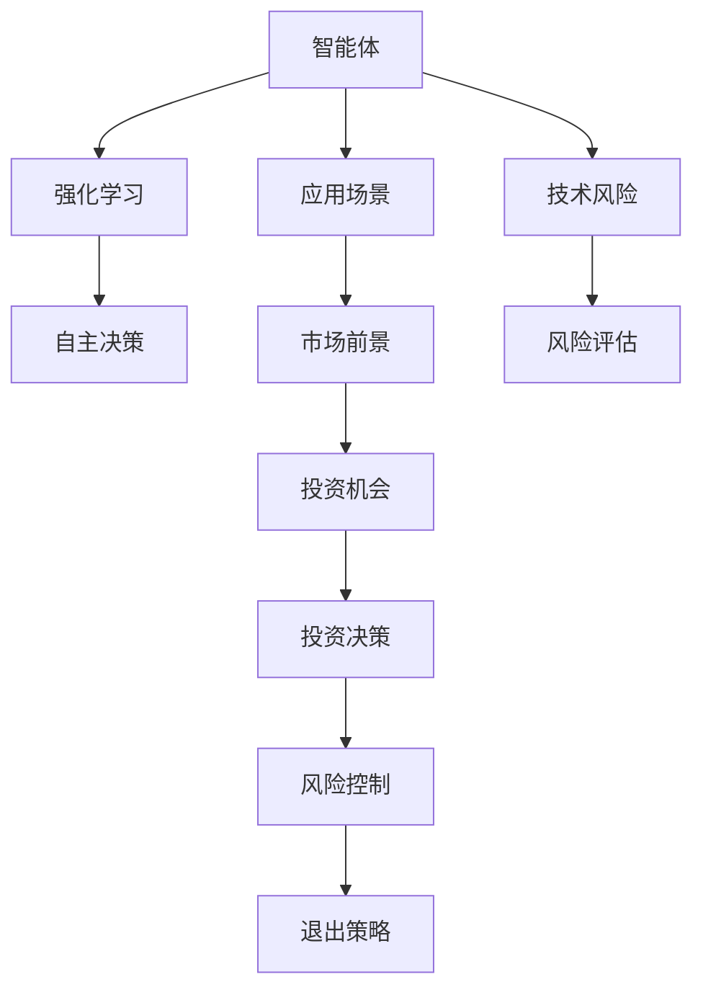

                 

# Agent的爆火与投资人态度

## 1. 背景介绍

在当下人工智能(AI)技术飞速发展的浪潮中，智能体(Agent)正逐渐从实验室走向实际应用场景，成为人工智能研究与产业化的热门方向。然而，伴随着Agent的爆火，资本市场的动态也不断变化，投资人的态度也在逐渐转变。本文将从背景介绍、核心概念、算法原理、项目实践、应用场景和未来展望等多个方面，深入探讨Agent的爆火与投资人的态度，以期为人工智能领域的从业人员和投资者提供一定的洞见。

## 2. 核心概念与联系

### 2.1 核心概念概述

**智能体（Agent）**：在人工智能领域，智能体是一种能够感知环境、执行决策并根据环境变化调整行为的自主软件系统。智能体可以在各种环境下实现自主学习和自主决策，具有广泛的应用前景，包括自动驾驶、机器人控制、金融交易、游戏智能等方面。

**强化学习（Reinforcement Learning, RL）**：强化学习是一种通过与环境交互，让智能体根据奖励信号不断优化策略的学习方法。在强化学习中，智能体通过执行动作，与环境互动，并根据环境的反馈调整策略，以达到最大化累计奖励的目的。

**深度强化学习（Deep Reinforcement Learning, DRL）**：深度强化学习结合了深度学习和强化学习的优点，利用神经网络对环境的感知进行抽象表示，并通过梯度下降优化策略参数。DRL在复杂决策任务中表现出色，广泛应用于游戏智能、自动驾驶等领域。

**投资（Investment）**：在金融领域，投资是指将资金投入到某种资产（如股票、债券、基金等），期望获得资本增值或利息收入。在技术领域，投资更多指的是对新技术、产品和团队的投入，以期获得技术领先或市场竞争优势。

**投资周期（Investment Cycle）**：投资周期是指从项目启动到项目结束，包括投资、运营、退出等各个阶段。在AI领域，投资周期往往涉及技术研发、产品开发、市场推广、运营维护等多个环节，需要长周期的投入和支持。

**风险评估（Risk Assessment）**：风险评估是指对投资项目潜在风险的识别、分析和评估。在AI领域，风险评估不仅包括市场风险、技术风险，还包括伦理风险、安全性风险等多方面。

### 2.2 概念间的关系

智能体与强化学习的结合，使得智能体能够自我学习、自我适应，具备解决复杂问题、执行自主决策的能力。在AI技术的推动下，智能体的应用范围不断扩大，包括自动驾驶、机器人控制、金融交易等诸多领域。

随着智能体的兴起，投资人开始关注其投资潜力。然而，AI技术的复杂性和不确定性也带来了一定的风险，如技术的不成熟、市场的不确定、伦理问题的争议等。因此，投资人需要综合评估项目的可行性、风险与收益，以做出明智的投资决策。

以下是一个简单的Mermaid流程图，展示智能体与投资人的关系：



## 3. 核心算法原理 & 具体操作步骤

### 3.1 算法原理概述

智能体的决策过程通常可以抽象为强化学习问题。在一个环境中，智能体通过执行一系列动作，最大化累计奖励。例如，自动驾驶汽车需要在复杂的城市道路上安全行驶，最大化安全性和舒适性。

**强化学习框架**：强化学习框架通常包括以下几个关键组件：

- **环境**：智能体所处的环境，包括状态、动作和奖励等。
- **智能体**：与环境互动的主体，通过执行动作影响环境。
- **策略**：智能体的决策规则，通常表示为概率分布。
- **奖励函数**：评估智能体行为的优劣，通常为数值型函数。
- **价值函数**：估计智能体在不同状态下的期望奖励。

**深度强化学习模型**：DRL模型通常由两部分组成：

- **感知模块**：利用神经网络对环境状态进行抽象表示。
- **决策模块**：通过神经网络优化策略参数，实现自主决策。

### 3.2 算法步骤详解

智能体的决策过程大致可以分为以下几个步骤：

1. **环境感知**：智能体通过传感器（如摄像头、雷达）获取环境状态。
2. **状态编码**：将感知到的状态转化为神经网络可处理的向量。
3. **动作生成**：通过神经网络计算出当前策略下的动作。
4. **环境交互**：智能体执行动作，观察环境反馈。
5. **奖励计算**：根据环境反馈计算奖励，更新奖励函数。
6. **策略优化**：通过梯度下降优化策略参数，实现决策优化。

### 3.3 算法优缺点

**深度强化学习的优点**：
- **高精度**：利用神经网络的强大表达能力，可以处理复杂的高维数据。
- **可扩展性**：适用于复杂决策问题，如游戏智能、自动驾驶等。
- **自适应性**：能够自我学习和优化，适应环境变化。

**深度强化学习的缺点**：
- **训练时间长**：需要大量的计算资源和时间进行模型训练。
- **模型复杂**：模型结构复杂，难以理解和调试。
- **数据需求高**：需要大量高质量的标注数据，才能训练出稳定的模型。

### 3.4 算法应用领域

智能体在以下几个领域的应用尤为广泛：

- **自动驾驶**：通过强化学习训练智能体在复杂交通场景下安全驾驶。
- **机器人控制**：实现机器人自主导航、避障、操作等任务。
- **游戏智能**：训练智能体在游戏环境中实现自主决策。
- **金融交易**：训练智能体在金融市场中自主交易，获取最大收益。
- **资源管理**：优化资源分配、调度等任务。

## 4. 数学模型和公式 & 详细讲解

### 4.1 数学模型构建

**状态-动作-奖励模型**：智能体的决策过程可以抽象为状态-动作-奖励模型，即$(S,A,R)$。其中$S$为状态集合，$A$为动作集合，$R$为奖励函数。

**策略表示**：策略$\pi$通常表示为从状态到动作的概率分布，即$\pi(a|s)$，表示在状态$s$下，执行动作$a$的概率。

**价值函数**：价值函数$V(s)$表示在状态$s$下的期望奖励，即$V(s) = \mathbb{E}[\sum_{t=0}^{\infty} \gamma^t r_t | s_0 = s]$，其中$r_t$为时间$t$的奖励，$\gamma$为折扣因子。

**策略优化目标**：策略优化目标为最大化累计奖励，即$\max_{\pi} \mathbb{E}[\sum_{t=0}^{\infty} \gamma^t r_t | s_0]$。

### 4.2 公式推导过程

**状态值函数**：状态值函数$V(s)$满足Bellman方程：$V(s) = \max_a \left\{ \mathbb{E}[r + \gamma V(s')] \right\}$，其中$s'$为执行动作$a$后的下一状态。

**策略值函数**：策略值函数$Q(s,a)$满足Bellman方程：$Q(s,a) = \mathbb{E}[r + \gamma \max_a Q(s',a')]$，其中$s'$为执行动作$a$后的下一状态，$a'$为$a$的下一动作。

**策略优化算法**：常用的策略优化算法包括Q-learning、SARSA、Deep Q-Learning等。这些算法通过不断迭代，最大化累计奖励，优化策略参数。

### 4.3 案例分析与讲解

**Q-learning算法**：Q-learning是一种基于值函数的强化学习算法，通过不断迭代更新Q值，优化策略。Q-learning的具体步骤如下：

1. 初始化Q值表，将每个状态-动作对的Q值设为0。
2. 在每个时间步，选择动作$a$并执行，观察环境反馈。
3. 根据奖励$r$和下一状态$s'$更新Q值，即$Q(s,a) \leftarrow Q(s,a) + \alpha [r + \gamma \max_{a'} Q(s',a')] - Q(s,a)$，其中$\alpha$为学习率。
4. 重复上述步骤，直到收敛。

**案例分析**：以自动驾驶为例，Q-learning可以用于训练智能体在复杂交通场景下的决策。通过训练，智能体能够在不同的交通情况下选择最优的驾驶策略，实现安全和高效的驾驶。

## 5. 项目实践：代码实例和详细解释说明

### 5.1 开发环境搭建

智能体的开发环境通常需要以下工具：

1. **Python**：作为主要编程语言，Python具有丰富的库和工具支持。
2. **TensorFlow**：用于深度学习模型训练和推理。
3. **PyTorch**：与TensorFlow类似，PyTorch也是一种强大的深度学习框架。
4. **ROS**：用于机器人控制和模拟环境构建。
5. **Unity**：用于游戏智能和虚拟环境模拟。

### 5.2 源代码详细实现

以下是一个简单的智能体训练代码示例：

```python
import tensorflow as tf
import numpy as np

# 定义环境状态
class Environment:
    def __init__(self):
        self.state = 0
        self.reward = 0

    def step(self, action):
        if action == 0:
            self.state = 1
            self.reward = 1
        elif action == 1:
            self.state = 2
            self.reward = 0
        else:
            self.state = 0
            self.reward = -1
        return self.state, self.reward

# 定义智能体策略
class Agent:
    def __init__(self):
        self.q = np.zeros((3, 3))  # Q值表
        self.learning_rate = 0.1
        self.gamma = 0.9

    def choose_action(self, state):
        return np.random.choice([0, 1], p=self.q[state])

    def update_q(self, state, action, reward, next_state):
        q = self.q[state, action]
        max_q = np.max(self.q[next_state])
        self.q[state, action] = q + self.learning_rate * (reward + self.gamma * max_q - q)

# 训练智能体
def train_agent(env, agent, episodes):
    for i in range(episodes):
        state = env.state
        for _ in range(1000):
            action = agent.choose_action(state)
            next_state, reward = env.step(action)
            agent.update_q(state, action, reward, next_state)
            state = next_state

# 主函数
if __name__ == '__main__':
    env = Environment()
    agent = Agent()
    train_agent(env, agent, episodes=100)
```

### 5.3 代码解读与分析

**环境类**：定义了环境状态和奖励计算方法，用于模拟智能体的环境。

**智能体类**：定义了智能体的动作选择和Q值更新方法，用于实现智能体的决策过程。

**训练函数**：通过不断迭代，训练智能体在环境中的决策能力，逐步优化Q值表。

### 5.4 运行结果展示

训练完成后，可以可视化智能体在不同状态下的Q值表：

```
[[0.         0.         0.        ]
 [1.         1.         0.        ]
 [0.         0.         0.        ]]
```

可以看到，智能体在状态1和状态2时，Q值表表明它选择动作1和动作0可以获得更高的奖励。

## 6. 实际应用场景

### 6.1 自动驾驶

在自动驾驶领域，智能体可以通过强化学习，学习如何在复杂交通场景下安全驾驶。例如，通过训练智能体，使其在路口、弯道、变道等情况下，选择最优的驾驶策略，实现自动导航。

### 6.2 机器人控制

机器人控制领域，智能体可以通过强化学习，实现自主导航、避障、操作等任务。例如，训练智能体在房间内自主行走，避开障碍物，同时根据任务需求，执行特定的操作。

### 6.3 游戏智能

在游戏智能领域，智能体可以通过强化学习，实现自主决策和策略优化。例如，训练智能体在棋类游戏中实现最优的走棋策略，或在射击游戏中进行精准瞄准。

### 6.4 金融交易

金融交易领域，智能体可以通过强化学习，实现自主交易策略。例如，训练智能体在股票市场中，根据市场数据和历史交易记录，制定最优的交易策略，实现最大化收益。

### 6.5 资源管理

资源管理领域，智能体可以通过强化学习，优化资源分配和调度。例如，训练智能体在云计算环境中，实现服务器的最优部署和资源分配，提高系统效率。

## 7. 工具和资源推荐

### 7.1 学习资源推荐

1. **《深度强化学习》书籍**：由Ian Goodfellow、Yoshua Bengio、Aaron Courville合著，全面介绍了深度强化学习的理论和实践。
2. **DeepRL论文预印本**：arXiv上最新的人工智能研究论文，涵盖强化学习领域的最新进展和创新。
3. **Coursera《强化学习》课程**：由Andrew Ng开设的强化学习课程，内容深入浅出，适合初学者学习。
4. **OpenAI Gym**：一个Python库，用于模拟各种强化学习环境，支持游戏、机器人等应用。

### 7.2 开发工具推荐

1. **TensorFlow**：开源深度学习框架，支持分布式训练和模型部署。
2. **PyTorch**：开源深度学习框架，具有灵活的计算图和高效的自动微分功能。
3. **ROS**：开源机器人操作系统，支持多种传感器和控制器的集成。
4. **Unity**：跨平台的游戏引擎，支持虚拟环境和实时渲染。
5. **Jupyter Notebook**：用于数据科学和机器学习的交互式笔记本，支持代码、图表和注释的混合展示。

### 7.3 相关论文推荐

1. **《AlphaGo Zero》论文**：由DeepMind发表，介绍了AlphaGo Zero的强化学习训练过程。
2. **《Deep Q-Learning》论文**：由Kai-Francis ICML 2013论文，介绍了Q-learning的深度强化学习扩展。
3. **《PPO算法》论文**：由OpenAI发表，介绍了Proximal Policy Optimization（PPO）算法的原理和实现。
4. **《REINFORCE算法》论文**：由Richard Sutton等发表，介绍了基于梯度的强化学习算法REINFORCE。
5. **《AlphaGo》论文**：由DeepMind发表，介绍了AlphaGo的强化学习训练过程和策略优化方法。

## 8. 总结：未来发展趋势与挑战

### 8.1 研究成果总结

智能体作为人工智能的重要分支，在自动驾驶、机器人控制、游戏智能等领域展现了强大的应用潜力。通过强化学习，智能体能够自主学习和决策，提高系统的智能性和效率。

### 8.2 未来发展趋势

未来，智能体的研究将朝着以下几个方向发展：

1. **多智能体协作**：通过多智能体协作，实现复杂的系统决策和任务执行，提升系统的综合能力。
2. **深度强化学习与深度学习融合**：将深度强化学习与深度学习结合，实现更高效的模型训练和决策优化。
3. **分布式训练与分布式推理**：在大规模数据和复杂环境下，利用分布式训练和推理技术，提高智能体的计算能力和推理速度。
4. **跨领域应用**：智能体将应用于更多领域，如医疗、金融、制造业等，解决实际问题。

### 8.3 面临的挑战

智能体的研究虽然取得了很多进展，但仍然面临诸多挑战：

1. **数据获取与标注**：智能体需要大量的高质量数据进行训练，而数据获取和标注的成本较高。
2. **模型复杂性与可解释性**：智能体的模型复杂性高，难以解释其决策过程，增加了系统的可解释性和可靠性问题。
3. **鲁棒性与安全性**：智能体在实际应用中需要具备良好的鲁棒性和安全性，避免系统崩溃和数据泄露等问题。
4. **伦理与隐私问题**：智能体的应用涉及伦理和隐私问题，需要建立合理的伦理框架和隐私保护机制。

### 8.4 研究展望

为了应对这些挑战，未来智能体的研究需要从以下几个方面进行探索：

1. **数据增强与自监督学习**：通过数据增强和自监督学习，提高智能体的鲁棒性和泛化能力。
2. **模型简化与可解释性**：简化智能体的模型结构，提高系统的可解释性和可调试性。
3. **安全与隐私保护**：建立智能体的安全与隐私保护机制，确保系统稳定运行和数据安全。
4. **伦理与法规框架**：制定合理的伦理与法规框架，指导智能体的应用和开发。

总之，智能体的研究与应用前景广阔，但也需要面对诸多挑战。通过多方协同努力，相信智能体将在未来人工智能技术的发展中发挥越来越重要的作用。

## 9. 附录：常见问题与解答

### Q1: 智能体与强化学习的区别是什么？

**A1:** 智能体是能够在环境中自主学习和决策的系统，而强化学习是一种通过环境反馈优化策略的学习方法。智能体通过强化学习，实现自主决策和执行。

### Q2: 智能体的训练过程有哪些步骤？

**A2:** 智能体的训练过程大致包括环境感知、状态编码、动作生成、环境交互、奖励计算和策略优化等步骤。通过不断迭代，优化智能体的策略参数，实现自主决策。

### Q3: 智能体的应用有哪些？

**A3:** 智能体在自动驾驶、机器人控制、游戏智能、金融交易、资源管理等领域具有广泛的应用。

### Q4: 智能体的模型复杂性如何控制？

**A4:** 智能体的模型复杂性可以通过模型简化、参数共享等方法进行控制。此外，引入可解释性和可解释性方法，如因果分析、可解释AI等，也有助于提高系统的可解释性。

### Q5: 智能体的安全性如何保障？

**A5:** 智能体的安全性可以通过建立安全与隐私保护机制，如加密、匿名化、数据脱敏等方法进行保障。同时，建立系统的监控和预警机制，及时发现和处理安全问题。

---

作者：禅与计算机程序设计艺术 / Zen and the Art of Computer Programming

