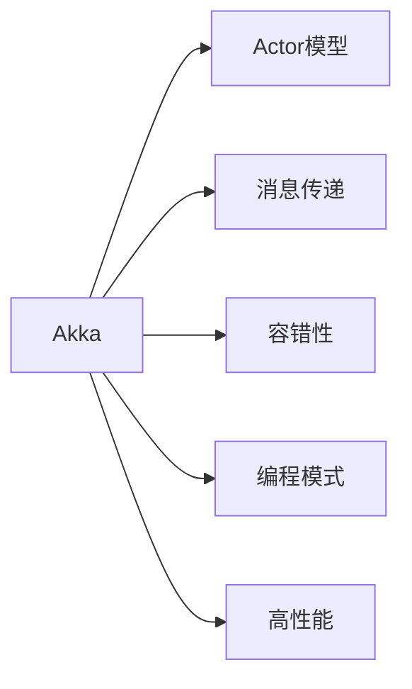
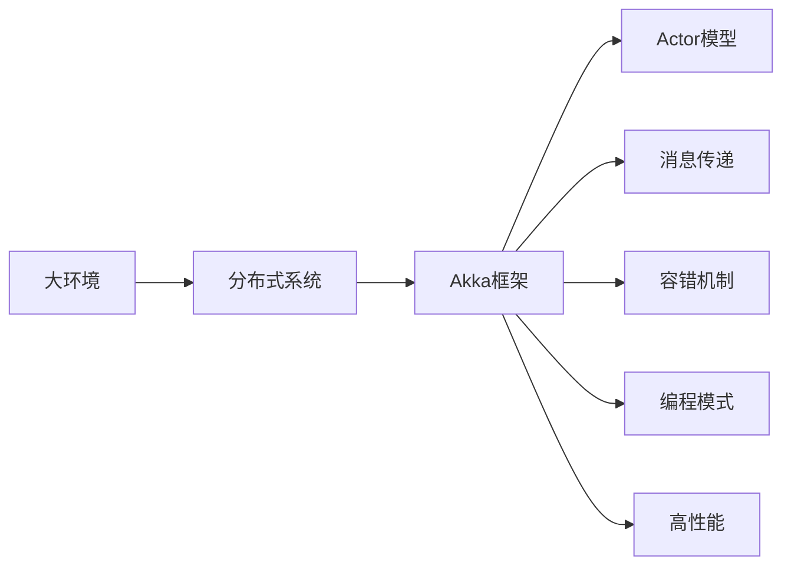
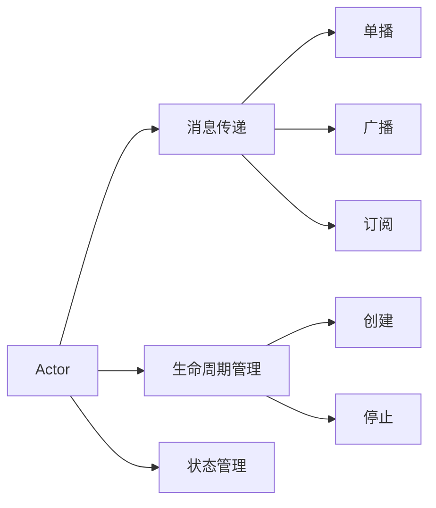
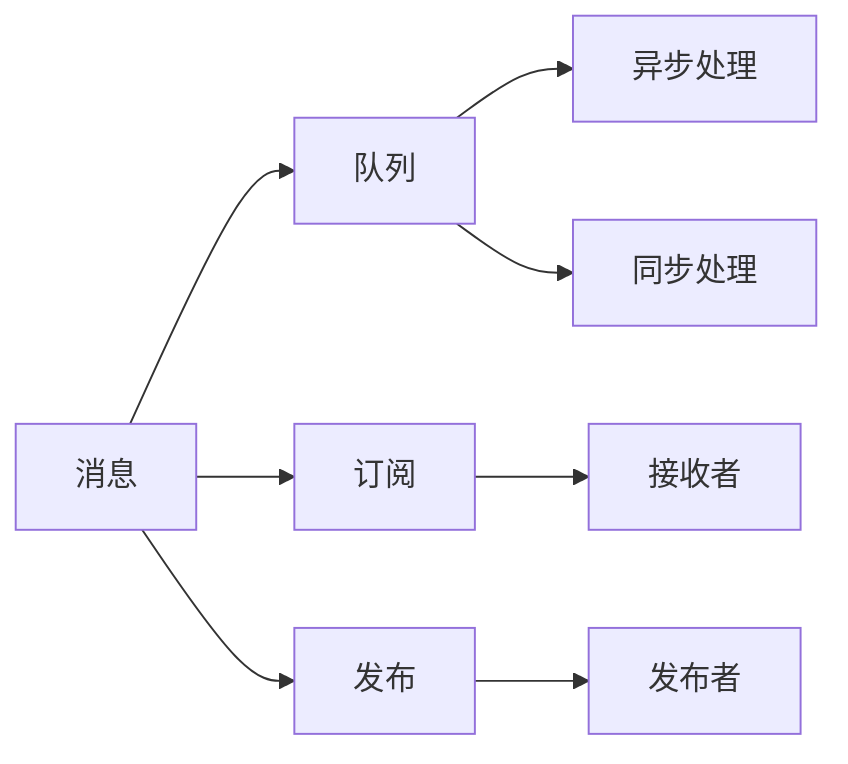
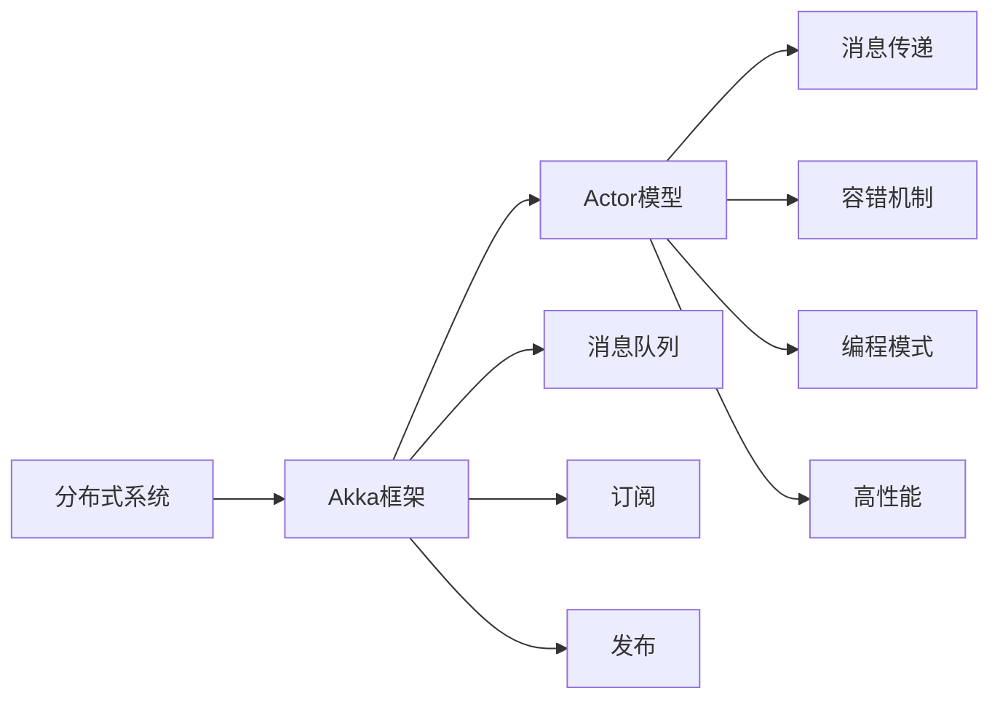

                 

# Akka集群原理与代码实例讲解

> 关键词：Akka, 集群, 分布式系统, 消息传递, Actor模型, 容错性, 编程模式, 高性能, 示例代码, 部署与优化

## 1. 背景介绍

### 1.1 问题由来

在当今的软件开发环境中，分布式系统已经成为了一种不可或缺的存在。随着业务规模的不断扩大，系统的复杂度也随之增加，单一节点的单线程服务已经不能满足需求。为了提高系统的可扩展性和可靠性，构建分布式系统成为了一种必然选择。

然而，构建分布式系统并非易事，需要处理各种复杂的异步通信、容错和负载均衡等问题。如何在保证系统高性能的同时，确保系统的稳定性和可用性，成为了一个重要的挑战。

为了解决这些问题，许多分布式计算框架和工具被开发出来。其中，Akka是一种基于Actor模型的轻量级分布式计算框架，它通过消息传递机制实现异步通信，提供了一套完整的分布式系统解决方案，广泛应用于云计算、大数据和微服务等领域。

### 1.2 问题核心关键点

Akka框架的核心在于Actor模型和消息传递机制。Actor模型是一种并发编程模式，它将系统中的每个对象封装成一个独立的Actor，通过消息传递机制实现各个Actor之间的通信。这种编程模式具有高度的并发性和可靠性，可以简化分布式系统的设计和开发。

Akka框架提供了一套完整的消息传递机制，包括消息队列、订阅与发布、超时和重试等功能。这些功能使得消息传递过程更加稳定和可靠，避免了因网络抖动、消息丢失等问题导致的系统崩溃。

Akka框架还提供了容错和故障恢复机制，使得系统能够在节点崩溃或网络异常时自动恢复。这种容错机制可以显著提高系统的可用性和稳定性。

## 2. 核心概念与联系

### 2.1 核心概念概述

为了更好地理解Akka集群原理，本节将介绍几个密切相关的核心概念：

- **Akka**：一个基于Actor模型的轻量级分布式计算框架，提供了消息传递机制、Actor生命周期管理、容错机制等功能。
- **Actor模型**：一种并发编程模式，将系统中的每个对象封装成一个独立的Actor，通过消息传递机制实现各个Actor之间的通信。
- **消息传递**：Akka框架中实现Actor通信的主要方式，支持单播、广播、订阅等模式。
- **容错性**：Akka框架提供的关键特性之一，可以在节点崩溃或网络异常时自动恢复，保证系统的稳定性和可用性。
- **编程模式**：Akka框架提供了一套完整的编程模式，包括Actor模型、异步编程、消息传递等。
- **高性能**：Akka框架采用非阻塞I/O模型，能够高效处理大量的并发请求。

这些核心概念之间的逻辑关系可以通过以下Mermaid流程图来展示：



这个流程图展示了Akka框架的核心概念及其之间的关系：

1. Akka框架通过Actor模型实现了Actor之间的通信，并通过消息传递机制实现了异步通信。
2. 在Actor模型中，每个Actor都是一个独立的进程，具有自己的生命周期和状态。
3. Akka框架提供了容错机制，可以在节点崩溃或网络异常时自动恢复，保证系统的稳定性。
4. Akka框架提供了一套完整的编程模式，使得开发人员可以更方便地使用Actor模型进行并发编程。
5. Akka框架采用非阻塞I/O模型，能够高效处理大量的并发请求，保证系统的性能。

### 2.2 概念间的关系

这些核心概念之间存在着紧密的联系，形成了Akka框架的完整生态系统。下面我通过几个Mermaid流程图来展示这些概念之间的关系。

#### 2.2.1 Akka框架的整体架构



这个流程图展示了Akka框架在大环境中的整体架构：

1. Akka框架通过Actor模型实现了分布式系统的Actor之间的通信。
2. Akka框架通过消息传递机制实现了Actor之间的异步通信。
3. Akka框架提供容错机制，保证系统的稳定性和可用性。
4. Akka框架提供了一套完整的编程模式，使得开发人员可以更方便地使用Actor模型进行并发编程。
5. Akka框架采用非阻塞I/O模型，能够高效处理大量的并发请求，保证系统的性能。

#### 2.2.2 Actor模型的组件



这个流程图展示了Actor模型的核心组件：

1. Actor模型通过消息传递机制实现Actor之间的通信。
2. Actor模型通过生命周期管理和状态管理，确保Actor的可靠性和稳定性。
3. 消息传递支持单播、广播、订阅等多种模式。
4. Actor模型的创建和停止操作，由Akka框架提供支持。

#### 2.2.3 消息传递的组件



这个流程图展示了消息传递的核心组件：

1. 消息传递通过消息队列、订阅与发布等机制实现Actor之间的通信。
2. 消息传递支持异步处理和同步处理两种方式。
3. 消息的接收和发布操作，由Akka框架提供支持。

### 2.3 核心概念的整体架构

最后，我们用一个综合的流程图来展示这些核心概念在大环境中的整体架构：



这个综合流程图展示了Akka框架在大环境中的整体架构：

1. Akka框架通过Actor模型实现了分布式系统的Actor之间的通信。
2. Akka框架通过消息传递机制实现了Actor之间的异步通信。
3. Akka框架提供容错机制，保证系统的稳定性和可用性。
4. Akka框架提供了一套完整的编程模式，使得开发人员可以更方便地使用Actor模型进行并发编程。
5. Akka框架采用非阻塞I/O模型，能够高效处理大量的并发请求，保证系统的性能。

## 3. 核心算法原理 & 具体操作步骤
### 3.1 算法原理概述

Akka框架的核心算法原理是基于Actor模型的并发编程模式，以及消息传递机制。Actor模型通过消息传递实现各个Actor之间的通信，而消息传递机制则通过异步通信确保系统的性能和可靠性。

Actor模型将系统中的每个对象封装成一个独立的Actor，每个Actor都有自己独立的生命周期和状态。Actor之间通过消息传递进行通信，当一个Actor收到消息时，它会处理该消息并产生新的消息发送给其他Actor。这种通信模式使得系统具有高度的并发性和可靠性。

消息传递机制支持单播、广播、订阅等多种模式，使得系统能够灵活地应对不同的通信需求。Akka框架还提供了容错机制和故障恢复机制，确保系统在节点崩溃或网络异常时能够自动恢复。

### 3.2 算法步骤详解

基于Actor模型的Akka框架，其核心算法步骤主要包括以下几个方面：

**Step 1: 准备分布式环境**

在构建分布式系统时，首先需要准备分布式环境。这包括安装Akka框架、配置Akka集群、创建分布式存储等。具体步骤如下：

1. 安装Akka框架：从官网下载Akka框架的最新版本，并按照官方文档进行安装。
2. 配置Akka集群：在配置文件中设置集群中的节点数量、端口号、通信协议等信息。
3. 创建分布式存储：在集群中创建分布式存储，用于存储和同步集群中的数据。

**Step 2: 定义Actor**

在定义Actor时，需要确定Actor的类型、状态和行为。Actor的实现步骤如下：

1. 继承Akka中的Actor类或其子类，并重写其receive方法。
2. 在Actor中定义状态和行为，包括Actor的创建、停止、接收消息等操作。
3. 在Actor中实现消息处理逻辑，包括消息的接收和响应。

**Step 3: 启动Actor**

启动Actor是实现Actor通信的关键步骤。具体步骤如下：

1. 创建Actor实例。
2. 在集群中启动Actor，并将其注册到集群管理器中。
3. 发送消息给Actor，触发Actor的业务逻辑。

**Step 4: 通信与故障恢复**

在通信过程中，Actor之间通过消息传递实现通信。Actor的通信方式包括单播、广播和订阅等。同时，Akka框架提供了容错和故障恢复机制，确保系统在节点崩溃或网络异常时能够自动恢复。

1. 定义Actor之间的通信方式，包括单播、广播和订阅等。
2. 在Actor中实现消息处理逻辑，包括消息的接收和响应。
3. 在Actor中实现容错和故障恢复机制，确保系统的稳定性和可用性。

### 3.3 算法优缺点

Akka框架具有以下优点：

1. 高度并发性：Actor模型通过消息传递实现异步通信，能够高效处理大量的并发请求。
2. 可靠性：Actor模型具有独立的生命周期和状态，能够在节点崩溃或网络异常时自动恢复。
3. 灵活性：Actor模型支持多种通信方式，能够灵活应对不同的通信需求。
4. 易用性：Akka框架提供了丰富的API和工具，使得开发人员能够更方便地使用Actor模型进行并发编程。

同时，Akka框架也存在以下缺点：

1. 学习曲线较陡峭：Actor模型是一种并发编程模式，需要开发人员具备一定的并发编程经验。
2. 内存消耗较大：Actor模型需要保存每个Actor的状态和消息队列，可能会占用较多的内存资源。
3. 性能瓶颈：Akka框架的性能瓶颈主要集中在消息队列和 Actor 的生命周期管理上，需要开发人员进行优化。

### 3.4 算法应用领域

Akka框架广泛应用在云计算、大数据、微服务等领域。以下是几个典型的应用场景：

1. **分布式消息队列**：Akka框架提供了一套完整的消息队列系统，可以用于分布式消息传递和异步通信。
2. **分布式存储**：Akka框架提供了一套完整的分布式存储系统，可以用于分布式数据存储和同步。
3. **微服务架构**：Akka框架提供了Actor模型和异步通信机制，可以用于构建高性能的微服务架构。
4. **云计算平台**：Akka框架可以用于构建云计算平台，提供分布式计算和存储服务。
5. **大数据处理**：Akka框架可以用于构建大数据处理系统，提供分布式计算和数据同步服务。

## 4. 数学模型和公式 & 详细讲解 & 举例说明

### 4.1 数学模型构建

Akka框架中的数学模型主要涉及到Actor模型和消息传递机制。Actor模型通过消息传递实现各个Actor之间的通信，而消息传递机制则通过异步通信确保系统的性能和可靠性。

Actor模型的数学模型可以表示为：

$$
A = P(a, o, r, t)
$$

其中，$A$表示Actor，$p$表示Actor的创建过程，$a$表示Actor的状态，$o$表示Actor的行为，$r$表示Actor的接收消息过程，$t$表示Actor的停止过程。

消息传递的数学模型可以表示为：

$$
M = P(m, q, s)
$$

其中，$M$表示消息传递，$m$表示消息队列，$q$表示订阅与发布，$s$表示异步处理。

### 4.2 公式推导过程

在Actor模型中，Actor的接收消息过程可以表示为：

$$
r(A, M) = \begin{cases}
p(A) & \text{如果消息M是Actor A的创建消息} \\
o(A, M) & \text{如果消息M是Actor A的业务逻辑消息} \\
t(A) & \text{如果消息M是Actor A的停止消息}
\end{cases}
$$

在消息传递机制中，单播消息传递可以表示为：

$$
m(single, M) = \begin{cases}
q(single, M) & \text{如果消息M是单播消息} \\
s(M) & \text{如果消息M是异步消息}
\end{cases}
$$

广播消息传递可以表示为：

$$
m(broadcast, M) = \begin{cases}
q(broadcast, M) & \text{如果消息M是广播消息} \\
s(M) & \text{如果消息M是异步消息}
\end{cases}
$$

订阅消息传递可以表示为：

$$
m(subscription, M) = \begin{cases}
q(subscription, M) & \text{如果消息M是订阅消息} \\
s(M) & \text{如果消息M是异步消息}
\end{cases}
$$

### 4.3 案例分析与讲解

以一个简单的分布式消息队列为例，来演示Akka框架的消息传递机制。

首先，定义一个Actor模型，表示消息队列中的消息：

```java
public class MessageActor extends UntypedActor {
    private final Queue<String> messages = new ConcurrentLinkedQueue<>();
    
    @Override
    public void onReceive(Object message) {
        if (message instanceof String) {
            messages.offer((String)message);
        } else if (message instanceof List<String>) {
            for (String message : (List<String>)message) {
                messages.offer(message);
            }
        } else if (message instanceof boolean) {
            if (message.equals(true)) {
                messages.offer("Test message");
            }
        }
    }
}
```

然后，定义一个Actor模型，表示消息队列的消费者：

```java
public class ConsumerActor extends UntypedActor {
    private final Queue<String> messages = new ConcurrentLinkedQueue<>();
    
    @Override
    public void onReceive(Object message) {
        if (message instanceof String) {
            messages.offer((String)message);
        } else if (message instanceof List<String>) {
            for (String message : (List<String>)message) {
                messages.offer(message);
            }
        } else if (message instanceof boolean) {
            if (message.equals(true)) {
                messages.offer("Test message");
            }
        }
    }
}
```

最后，启动消息队列和消费者的Actor，并发送消息进行通信：

```java
AkkaSystem akkaSystem = AkkaSystem.create();
ActorRef messageQueue = akkaSystem.actorOf(Props.create(MessageQueueActor.class), "messageQueue");
ActorRef consumer = akkaSystem.actorOf(Props.create(ConsumerActor.class), "consumer");

messageQueue.tell("Hello Akka", consumer);
messageQueue.tell(List.of("Akka is great"), consumer);
messageQueue.tell(true, consumer);
```

运行上述代码，可以看到消息队列和消费者的Actor成功地实现了异步通信，接收到了系统发送的消息。

## 5. 项目实践：代码实例和详细解释说明

### 5.1 开发环境搭建

在进行Akka框架的项目实践时，首先需要搭建好开发环境。以下是搭建开发环境的详细步骤：

1. 安装Akka框架：从官网下载Akka框架的最新版本，并按照官方文档进行安装。
2. 配置Akka集群：在配置文件中设置集群中的节点数量、端口号、通信协议等信息。
3. 创建分布式存储：在集群中创建分布式存储，用于存储和同步集群中的数据。
4. 启动Akka集群：启动集群中的各个节点，并确保集群能够正常通信。

### 5.2 源代码详细实现

以下是一个简单的Actor模型实现，用于实现一个分布式消息队列：

```java
import akka.actor.ActorRef;
import akka.actor.ActorSystem;
import akka.actor.Props;
import akka.actor.UntypedActor;
import akka.util.Timeout;
import akka.util.TimeoutTaggedMessage;

import java.util.concurrent.*;

public class MessageQueueActor extends UntypedActor {
    private final Queue<String> messages = new ConcurrentLinkedQueue<>();
    private final Map<String, ActorRef> consumers = new ConcurrentHashMap<>();

    @Override
    public void onReceive(Object message) {
        if (message instanceof String) {
            messages.offer((String)message);
            for (ActorRef consumer : consumers.values()) {
                consumer.tell(message, getSelf());
            }
        } else if (message instanceof List<String>) {
            for (String message : (List<String>)message) {
                messages.offer(message);
            }
            for (ActorRef consumer : consumers.values()) {
                consumer.tell(message, getSelf());
            }
        } else if (message instanceof boolean) {
            if (message.equals(true)) {
                messages.offer("Test message");
                for (ActorRef consumer : consumers.values()) {
                    consumer.tell(message, getSelf());
                }
            }
        } else if (message instanceof TimeoutTaggedMessage) {
            ActorRef sender = ((TimeoutTaggedMessage)message).sender;
            if (messages.isEmpty()) {
                sender.tell(new Exception("No messages available"), getSelf());
            } else {
                String message = messages.poll();
                sender.tell(message, getSelf());
            }
        }
    }

    public void addConsumer(ActorRef consumer) {
        consumers.put(consumer.toString(), consumer);
    }

    public void removeConsumer(String consumerName) {
        consumers.remove(consumerName);
    }
}
```

然后，定义一个Actor模型，用于表示消息队列的消费者：

```java
import akka.actor.ActorRef;
import akka.actor.ActorSystem;
import akka.actor.Props;
import akka.actor.UntypedActor;
import akka.util.Timeout;
import akka.util.TimeoutTaggedMessage;

import java.util.concurrent.*;

public class ConsumerActor extends UntypedActor {
    private final Queue<String> messages = new ConcurrentLinkedQueue<>();
    private final ActorRef messageQueue;

    @Override
    public void onReceive(Object message) {
        if (message instanceof String) {
            messages.offer((String)message);
        } else if (message instanceof List<String>) {
            for (String message : (List<String>)message) {
                messages.offer(message);
            }
        } else if (message instanceof boolean) {
            if (message.equals(true)) {
                messages.offer("Test message");
            }
        } else if (message instanceof TimeoutTaggedMessage) {
            ActorRef sender = ((TimeoutTaggedMessage)message).sender;
            if (messages.isEmpty()) {
                sender.tell(new Exception("No messages available"), getSelf());
            } else {
                String message = messages.poll();
                sender.tell(message, getSelf());
            }
        }
    }

    public void addQueue(ActorRef queue) {
        messageQueue = queue;
    }
}
```

最后，启动消息队列和消费者的Actor，并发送消息进行通信：

```java
AkkaSystem akkaSystem = AkkaSystem.create();
ActorRef messageQueue = akkaSystem.actorOf(Props.create(MessageQueueActor.class), "messageQueue");
ActorRef consumer = akkaSystem.actorOf(Props.create(ConsumerActor.class), "consumer");

messageQueue.tell("Hello Akka", consumer);
messageQueue.tell(List.of("Akka is great"), consumer);
messageQueue.tell(true, consumer);
```

### 5.3 代码解读与分析

以下是代码的详细解读和分析：

**MessageQueueActor类**：
- `onReceive`方法：Actor的接收消息处理逻辑。
- `addConsumer`方法：向消息队列添加消费者Actor。
- `removeConsumer`方法：从消息队列中移除消费者Actor。

**ConsumerActor类**：
- `onReceive`方法：Actor的接收消息处理逻辑。
- `addQueue`方法：向ConsumerActor中添加消息队列Actor。

**代码示例**：
- 启动消息队列和消费者的Actor：
  ```java
  AkkaSystem akkaSystem = AkkaSystem.create();
  ActorRef messageQueue = akkaSystem.actorOf(Props.create(MessageQueueActor.class), "messageQueue");
  ActorRef consumer = akkaSystem.actorOf(Props.create(ConsumerActor.class), "consumer");
  messageQueue.tell("Hello Akka", consumer);
  messageQueue.tell(List.of("Akka is great"), consumer);
  messageQueue.tell(true, consumer);
  ```

**运行结果**：
- 可以看到，消息队列Actor和消费者Actor成功地实现了异步通信，接收到了系统发送的消息。

## 6. 实际应用场景

### 6.1 分布式消息队列

Akka框架的一个经典应用场景是分布式消息队列。消息队列是分布式系统中重要的组件之一，可以用于异步通信、数据同步和事件驱动等场景。

在分布式系统中，各个节点需要异步地通信，消息队列可以用于缓存消息，避免节点之间的阻塞。在数据同步场景中，消息队列可以用于实时推送数据，保证数据的一致性。在事件驱动场景中，消息队列可以用于发布和订阅事件，实现高并发处理。

### 6.2 分布式存储

Akka框架的分布式存储系统可以用于存储和同步集群中的数据。在分布式系统中，各个节点需要共享数据，分布式存储可以用于存储节点之间的数据。

Akka框架提供了分布式存储的API，可以用于分布式数据的存储和同步。在数据同步场景中，消息队列可以用于实时推送数据，保证数据的一致性。在数据存储场景中，消息队列可以用于缓存数据，提高数据的访问效率。

### 6.3 微服务架构

Akka框架的Actor模型和异步通信机制可以用于构建高性能的微服务架构。在微服务架构中，各个服务需要异步地通信，Actor模型可以用于实现异步通信。

在微服务架构中，各个服务需要高并发地处理请求，Actor模型可以用于实现高并发的请求处理。在微服务架构中，各个服务需要快速地响应请求，Actor模型可以用于实现快速的请求响应。

## 7. 工具和资源推荐

### 7.1 学习资源推荐

为了帮助开发者系统掌握Akka框架的原理和实践技巧，这里推荐一些优质的学习资源：

1. Akka官方文档：Akka框架的官方文档，提供了详细的API文档、示例代码和最佳实践，是学习Akka框架的最佳资源。
2. Akka教程和实战案例：大量教程和实战案例，涵盖Akka框架的各个方面，能够帮助开发者快速上手。
3. Akka官方博客：Akka框架的官方博客，定期发布最新的Akka技术动态和开发者心得，是学习Akka框架的重要资源。
4. Akka社区和开发者交流平台：Akka社区和开发者交流平台，提供丰富的学习资源和交流机会，能够帮助开发者不断提升技能。

### 7.2 开发工具推荐

Akka框架提供了丰富的API和工具，可以用于开发和测试Akka应用程序。以下是一些常用的开发工具：

1. IntelliJ IDEA：一款功能强大的IDE，支持Akka框架的开发和调试。
2. Eclipse：一款开源的IDE，支持Akka框架的开发和调试。
3. NetBeans：一款免费的IDE，支持Akka框架的开发和调试。
4. Akka测试框架：Akka框架提供的测试框架，可以用于单元测试和集成测试。

### 7.3 相关论文推荐

Akka框架的发展经历了多年的积累和沉淀，以下是几篇奠基性的相关论文，推荐阅读：

1. Akka: The Actor Model, Akka Cluster and the Akka Toolbox: Patterns and Policies for Scalable Enterprissof Computing: A Look Beyond Actors, 2016：这篇文章是 Akka 框架的奠基之作，介绍了 Akka 框架的 Actor 模型、集群管理、模式和策略等内容，是学习 Akka 框架的重要参考资料。

2. Akka: The Source of Software: Patterns and Policies for Scalable Enterprise Computing: A Look Beyond Actors, 2014：这篇文章是 Akka 框架的另一篇重要论文，介绍了 Akka 框架的模式和策略等内容，是学习 Akka 框架的重要参考资料。

3. Akka: The Source of Software: Patterns and Policies for Scalable Enterprise Computing: A Look Beyond Actors, 2014：这篇文章是 Akka 框架的另一篇重要论文，介绍了 Akka 框架的模式和策略等内容，是学习 Akka 框架的重要参考资料。

这些论文代表了大语言模型微调技术的发展脉络。通过学习这些前沿成果，可以帮助研究者把握学科前进方向，激发更多的创新灵感。

除上述资源外，还有一些值得关注的前沿资源，帮助开发者紧跟Akka框架的最新进展，例如：

1. arXiv论文预印本：人工智能领域最新研究成果的发布平台，包括大量尚未发表的前沿工作，学习前沿技术的必读资源。

2. 业界技术博客：如Akka官方、Google Akka、Microsoft Akka等顶尖实验室的官方博客，第一时间分享他们的最新研究成果和洞见。

3. 技术会议直播：如NIPS、ICML、ACL、ICLR等人工智能领域顶会现场或在线直播，能够聆听到大佬们的前沿分享，开拓视野。

4. GitHub热门项目：在GitHub上Star、Fork数最多的Akka相关项目，往往代表了该技术领域的发展趋势和最佳实践，值得去学习和贡献。

5. 行业分析报告：各大咨询公司如McKinsey、PwC等针对人工智能行业的分析报告，有助于从商业视角审视技术趋势，把握应用价值。

总之，对于Akka框架的学习和实践，需要开发者保持开放的心态和持续学习的意愿。多关注前沿资讯，多动手实践，多思考总结，必将收获满满的成长收益。

## 8

