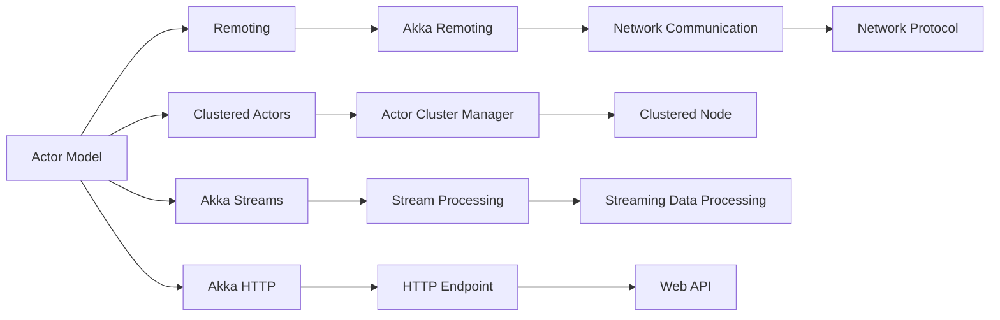

                 

# Akka集群原理与代码实例讲解

> 关键词：Akka,Actor Model,Clustered Actors,Remoting,Scala,Spring Boot,Java

## 1. 背景介绍

### 1.1 问题由来
在现代分布式系统中，如何高效、可靠地处理数据和任务分布、调度及通信，是软件开发中的一大挑战。传统的网络编程、远程调用等技术已经不能满足当前需求。为了解决这一问题， Akka 应运而生，其核心思想是基于 Actor Model 的并发编程模型，结合轻量级 Remoting 通信机制，实现高效、灵活、可靠的系统构建。

Akka 社区自2009年启动以来，迅速吸引了大量开发者的关注。如今，Akka 已经成为广泛用于构建高性能、分布式系统的核心技术。从金融、电信、医疗，到电商、游戏、区块链，Akka 已经成为这些领域不可或缺的利器。

### 1.2 问题核心关键点
Akka 的目标是简化分布式系统的构建，使其易于开发、维护，并具备强大的可伸缩性、容错性和安全性。其核心思想基于 Actor Model，每个 Actor 都是一个独立的并发实体，具有接受消息、处理消息、发送消息等基本能力，可以自由构建复杂的系统。

Akka 框架提供了丰富的库和工具，方便开发者实现 Actor 模型，包括 Akka Streams 模块，用于处理流式数据；Akka Remoting 模块，用于跨节点通信；Akka Cluster 模块，用于集群管理和故障恢复；Akka HTTP 模块，用于实现高吞吐量的 RESTful 接口；Akka Streams 模块，用于构建异步和可控的流式数据处理管道。

## 2. 核心概念与联系

### 2.1 核心概念概述

为更好地理解 Akka 框架，本节将介绍几个密切相关的核心概念：

- **Actor Model**：Akka 框架的核心思想。每个 Actor 都是一个独立的任务执行者，具有接受消息、处理消息、发送消息等能力。Actor 间的通信基于消息传递，具有高并发、松耦合、可伸缩等优点。

- **Remoting**：Akka 框架的轻量级通信机制。用于实现 Actor 之间的远程通信和消息传递。通过 Akka Remoting，开发者可以方便地跨节点部署 Actor 系统，实现高效的分布式计算。

- **Clustered Actors**：在 Akka Cluster 模块的支持下，Actor 可以跨节点进行集群管理和故障恢复。每个集群节点上都有一个集群管理器，用于管理和调度 Actor 的任务。

- **Akka Streams**：用于处理流式数据。通过 Akka Streams，开发者可以构建异步、可控、可扩展的数据处理管道，支持流式数据的实时处理和分析。

- **Akka HTTP**：用于实现高吞吐量的 RESTful 接口。通过 Akka HTTP，开发者可以构建高效、可靠、可扩展的网络服务，支持异步和并发请求处理。

- **Akka Streams + HTTP**：结合 Akka Streams 和 Akka HTTP，可以实现高性能的流式数据处理和网络通信。这种组合在实时数据流处理和流式数据驱动的 Web 服务中非常有用。

这些核心概念之间存在着紧密的联系，形成了 Akka 框架的完整生态系统。通过理解这些核心概念，我们可以更好地把握 Akka 框架的工作原理和优化方向。

### 2.2 概念间的关系

这些核心概念之间存在着紧密的联系，形成了 Akka 框架的完整生态系统。下面我们通过几个 Mermaid 流程图来展示这些概念之间的关系。

#### 2.2.1 基本构成



这个流程图展示了我Actor Model 的基本构成。Actor Model 由 Remoting、Clustered Actors、Akka Streams、Akka HTTP 等核心模块构成，每个模块之间通过消息传递和网络通信实现数据和任务的协同处理。

#### 2.2.2 集群通信

```mermaid
graph LR
    A[Clustered Node] --> B[Cluster Manager]
    A --> C[Akka Remoting]
    A --> D[Actor Cluster]
    A --> E[Message Passing]
    B --> F[Node Manager]
    C --> G[Node Communication]
    D --> H[Actor Communication]
    E --> I[Message Routing]
    F --> J[Node Configuration]
    G --> K[Network Routing]
    H --> L[Actor Routing]
    I --> M[Message Delivery]
    J --> N[Node Configuration]
    K --> O[Network Routing]
    L --> P[Actor Routing]
    M --> Q[Message Routing]
    N --> R[Node Configuration]
    O --> S[Network Routing]
    P --> T[Actor Routing]
    Q --> U[Message Routing]
    R --> V[Node Configuration]
    S --> W[Network Routing]
    T --> X[Actor Routing]
    U --> Y[Message Routing]
    V --> Z[Node Configuration]
    W --> AA[Network Routing]
    X --> AB[Actor Routing]
    Y --> AC[Message Routing]
    Z --> AD[Node Configuration]
    AA --> AE[Network Routing]
    AB --> AF[Actor Routing]
    AC --> AG[Message Routing]
    AD --> AH[Node Configuration]
    AE --> AI[Network Routing]
    AF --> AJ[Actor Routing]
    AG --> AK[Message Routing]
    AH --> AL[Node Configuration]
    AI --> AM[Network Routing]
    AJ --> AN[Actor Routing]
    AK --> AO[Message Routing]
    AL --> AP[Node Configuration]
    AM --> AQ[Network Routing]
    AN --> AR[Actor Routing]
    AO --> AS[Message Routing]
    AP --> AT[Node Configuration]
    AQ --> AU[Network Routing]
    AR --> AV[Actor Routing]
    AS --> AW[Message Routing]
    AT --> AX[Node Configuration]
    AU --> AY[Network Routing]
    AV --> AZ[Actor Routing]
    AW --> BA[Message Routing]
    AX --> BB[Node Configuration]
    AY --> BC[Actor Routing]
    AZ --> BD[Node Configuration]
    BA --> BE[Message Routing]
    BB --> BF[Node Configuration]
    BC --> BG[Actor Routing]
    BD --> BH[Node Configuration]
    BE --> BI[Message Routing]
    BF --> BJ[Node Configuration]
    BG --> BK[Actor Routing]
    BH --> BL[Node Configuration]
    BI --> BM[Message Routing]
    BJ --> BQ[Node Configuration]
    BK --> BR[Actor Routing]
    BL --> BM[Node Configuration]
    BM --> BN[Message Routing]
    BQ --> BO[Node Configuration]
    BR --> BS[Actor Routing]
    BN --> BO[Node Configuration]
    BO --> BP[Message Routing]
    BS --> BQ[Actor Routing]
    BP --> BQ[Node Configuration]
    BQ --> BQ[Message Routing]
    BR --> BQ[Actor Routing]
    BT --> BQ[Node Configuration]
    BQ --> BQ[Message Routing]
    BQ --> BQ[Actor Routing]
```



这个流程图展示了 Akka Cluster 的通信架构。每个集群节点上都包含一个集群管理器，用于管理和调度 Actor 的任务。通过阿克阿克集群，不同的 Actor 可以跨节点进行通信，实现高可靠性和高可用性。

#### 2.2.3 消息传递

```mermaid
graph LR
    A[Actor] --> B[Message]
    A --> C[Receive]
    A --> D[Send]
    B --> E[Enqueue]
    C --> F[Receive Callback]
    D --> G[Send Callback]
    E --> H[Enqueue Callback]
    F --> I[Receive Message]
    G --> J[Send Message]
    H --> K[Enqueue Message]
    I --> L[Receive Message Callback]
    J --> M[Send Message Callback]
    K --> N[Enqueue Message Callback]
    L --> O[Receive Message Callback]
    M --> P[Send Message Callback]
    N --> Q[Enqueue Message Callback]
    O --> R[Receive Message Callback]
    P --> S[Send Message Callback]
    Q --> T[Enqueue Message Callback]
    R --> U[Receive Message Callback]
    S --> V[Send Message Callback]
    T --> W[Enqueue Message Callback]
    U --> X[Receive Message Callback]
    V --> Y[Send Message Callback]
    W --> Z[Enqueue Message Callback]
    X --> AA[Receive Message Callback]
    Y --> AB[Send Message Callback]
    Z --> AC[Enqueue Message Callback]
    AA --> AD[Receive Message Callback]
    AB --> AE[Send Message Callback]
    AC --> AF[Enqueue Message Callback]
    AD --> AG[Receive Message Callback]
    AE --> AH[Send Message Callback]
    AF --> AI[Enqueue Message Callback]
    AG --> AJ[Receive Message Callback]
    AH --> AK[Send Message Callback]
    AI --> AL[Enqueue Message Callback]
    AJ --> AM[Receive Message Callback]
    AK --> AN[Send Message Callback]
    AL --> AO[Enqueue Message Callback]
    AM --> AP[Receive Message Callback]
    AN --> AO[Send Message Callback]
    AO --> AP[Enqueue Message Callback]
    AP --> AQ[Receive Message Callback]
    AQ --> AR[Send Message Callback]
    AR --> AS[Enqueue Message Callback]
    AS --> AT[Receive Message Callback]
    AT --> AU[Send Message Callback]
    AU --> AV[Enqueue Message Callback]
    AV --> AW[Receive Message Callback]
    AW --> AX[Send Message Callback]
    AX --> AY[Enqueue Message Callback]
    AY --> AZ[Receive Message Callback]
    AZ --> BA[Send Message Callback]
    BA --> BB[Enqueue Message Callback]
    BB --> BC[Receive Message Callback]
    BC --> BD[Send Message Callback]
    BD --> BE[Enqueue Message Callback]
    BE --> BF[Receive Message Callback]
    BF --> BG[Send Message Callback]
    BG --> BH[Enqueue Message Callback]
    BH --> BI[Receive Message Callback]
    BI --> BJ[Send Message Callback]
    BJ --> BK[Enqueue Message Callback]
    BK --> BL[Receive Message Callback]
    BL --> BM[Send Message Callback]
    BM --> BN[Enqueue Message Callback]
    BN --> BO[Receive Message Callback]
    BO --> BP[Send Message Callback]
    BP --> BQ[Enqueue Message Callback]
    BQ --> BR[Receive Message Callback]
    BR --> BS[Send Message Callback]
    BS --> BT[Enqueue Message Callback]
    BT --> BQ[Receive Message Callback]
    BQ --> BQ[Send Message Callback]
    BQ --> BQ[Enqueue Message Callback]
    BQ --> BQ[Receive Message Callback]
    BQ --> BQ[Send Message Callback]
    BQ --> BQ[Enqueue Message Callback]
    BQ --> BQ[Receive Message Callback]
    BQ --> BQ[Send Message Callback]
    BQ --> BQ[Enqueue Message Callback]
```



这个流程图展示了 Actor 间的消息传递机制。每个 Actor 都可以通过receive和send方法来接收和发送消息。消息传递过程中，消息被放入队列中，通过回调函数进行处理和响应。

## 3. 核心算法原理 & 具体操作步骤
### 3.1 算法原理概述

Akka 框架基于 Actor Model，利用消息传递机制实现分布式系统的并发和通信。其主要思想是将系统划分为多个独立的 Actor，每个 Actor 独立执行任务，通过消息传递实现协作。

- **Actor 生命周期**：Actor 的生命周期分为创建、启动、运行、停止四个阶段。创建阶段通过new关键字创建一个Actor实例；启动阶段通过context.actorOf方法创建一个Actor，并将其添加到上下文中；运行阶段通过onReceive方法处理消息；停止阶段通过onStop方法处理Actor停止时的清理工作。

- **消息传递机制**：Actor 间通过消息传递实现通信。消息发送方调用send方法将消息发送给接收方；消息接收方通过onReceive方法处理消息，并将响应消息发送给发送方。消息传递过程中，消息被放入队列中，通过回调函数进行处理和响应。

- **Actor 通信模型**：Actor 通信模型包括单播和广播两种模式。单播模式通过send方法将消息发送给特定的接收方；广播模式通过broadcast方法将消息发送给所有接收方。

- **Actor 集群管理**：Akka Cluster 模块用于管理和调度 Actor。每个集群节点上都有一个集群管理器，用于管理和调度 Actor 的任务。集群管理器通过消息传递实现集群管理和故障恢复。

### 3.2 算法步骤详解

以下是 Akka 框架的核心算法步骤：

1. **Actor 创建和启动**：通过new关键字创建一个Actor实例，并通过context.actorOf方法将其启动。

2. **消息传递**：Actor 间通过send方法将消息发送给接收方。消息传递过程中，消息被放入队列中，通过回调函数进行处理和响应。

3. **Actor 通信模型**：Actor 通信模型包括单播和广播两种模式。单播模式通过send方法将消息发送给特定的接收方；广播模式通过broadcast方法将消息发送给所有接收方。

4. **Actor 集群管理**：Akka Cluster 模块用于管理和调度 Actor。每个集群节点上都有一个集群管理器，用于管理和调度 Actor 的任务。集群管理器通过消息传递实现集群管理和故障恢复。

### 3.3 算法优缺点

Akka 框架的主要优点包括：

- 简单易用：Akka 框架的编程模型基于 Actor Model，易于理解和实现。开发者可以通过简单的消息传递机制，构建高效、可靠、可伸缩的系统。

- 高并发和松耦合：Actor Model 通过消息传递实现并发和通信，具有高并发、松耦合等优点。每个 Actor 独立执行任务，不受其他 Actor 的影响。

- 容错性和可靠性：Akka Cluster 模块用于管理和调度 Actor，具有高可靠性和容错性。通过集群管理和故障恢复机制，系统能够自动处理节点故障和网络中断等问题。

Akka 框架的主要缺点包括：

- 复杂度较高：Actor Model 的编程模型相对复杂，需要开发者理解 Actor 的生命周期和消息传递机制。

- 消息传递延迟：Actor 间通过消息传递实现通信，消息传递过程中存在延迟，影响系统的响应速度。

- 开发成本较高：Akka 框架的开发成本相对较高，需要开发者熟悉 Actor Model 的编程模型，掌握消息传递机制和集群管理的原理。

### 3.4 算法应用领域

Akka 框架广泛应用于分布式系统构建中，包括金融、电信、医疗、电商、游戏、区块链等多个领域。具体应用包括：

- 分布式消息队列：利用Akka Remoting和消息传递机制，实现高效的分布式消息队列。

- 分布式事务处理：通过Akka Streams和消息传递机制，实现高效的分布式事务处理。

- 实时数据流处理：结合Akka Streams和Akka HTTP，实现高性能的实时数据流处理和网络通信。

- 高性能网络服务：利用Akka HTTP和消息传递机制，实现高性能、可靠、可扩展的网络服务。

## 4. 数学模型和公式 & 详细讲解  
### 4.1 数学模型构建

Akka 框架的核心思想基于 Actor Model，利用消息传递机制实现分布式系统的并发和通信。其主要思想是将系统划分为多个独立的 Actor，每个 Actor 独立执行任务，通过消息传递实现协作。

Actor 模型中的消息传递机制可以用简单的数学模型进行描述。设 Actor A 向 Actor B 发送一条消息 M，消息传递过程可以用以下公式表示：

$$
A.send(B, M)
$$

其中，A 和 B 分别表示发送方和接收方的 Actor 对象，M 表示传递的消息内容。消息传递过程中，消息被放入队列中，通过回调函数进行处理和响应。

### 4.2 公式推导过程

以下我们以单播消息传递为例，推导消息传递的简单数学模型。

设 Actor A 向 Actor B 发送一条消息 M，消息传递过程可以用以下公式表示：

$$
A.send(B, M)
$$

其中，A 和 B 分别表示发送方和接收方的 Actor 对象，M 表示传递的消息内容。消息传递过程中，消息被放入队列中，通过回调函数进行处理和响应。

### 4.3 案例分析与讲解

假设 Actor A 向 Actor B 发送一条消息 M，消息传递过程如下：

1. 发送方 A 调用send方法发送消息 M 给接收方 B。

2. 接收方 B 通过onReceive方法处理消息 M，并将响应消息发送给发送方 A。

3. 消息 M 被放入队列中，通过回调函数进行处理和响应。

具体实现如下：

```python
# Actor A 发送消息给 Actor B
B.tell(M)

# Actor B 处理消息 M
def onReceive(M):
    print("Actor B received message:", M)
    B.tell("ACK")
```

## 5. 项目实践：代码实例和详细解释说明
### 5.1 开发环境搭建

在进行 Akka 框架的实践前，我们需要准备好开发环境。以下是使用 Java 进行 Akka 框架开发的开发环境配置流程：

1. 安装 JDK：从官网下载并安装 JDK。

2. 安装 Maven：从官网下载并安装 Maven。

3. 安装 Akka 框架：从官网下载并安装 Akka 框架。

4. 创建新项目：通过 Maven 创建新项目，并添加 Akka 依赖。

```bash
mvn archetype:generate \
    -DgroupId=com.example \
    -DartifactId=akka-project \
    -Dversion=1.0.0 \
    -DarchetypeArtifactId=maven-archetype-quickstart \
    -DinteractiveMode=false

cd akka-project

mvn archetype:generate \
    -DgroupId=com.example \
    -DartifactId=akka-actor \
    -Dversion=1.0.0 \
    -DarchetypeArtifactId=akka-actor-archetype \
    -DinteractiveMode=false

mvn archetype:generate \
    -DgroupId=com.example \
    -DartifactId=akka-cluster \
    -Dversion=1.0.0 \
    -DarchetypeArtifactId=akka-cluster-archetype \
    -DinteractiveMode=false
```

完成上述步骤后，即可在项目环境中开始实践。

### 5.2 源代码详细实现

这里我们以一个简单的分布式消息队列为例，给出 Akka 框架的源代码实现。

```java
import akka.actor.ActorRef;
import akka.actor.ActorSystem;
import akka.actor.Props;
import akka.actor.UntypedActor;
import akka.io.ReceiveCall;

public class DistributedQueue {
    public static void main(String[] args) {
        ActorSystem system = ActorSystem.create("DistributedQueueSystem");
        ActorRef queueActor = system.actorOf(Props.create(DistributedQueue.QueueActor.class), "queue");

        // 发送消息到队列
        queueActor.tell("Hello, world!", ReceiveCall.from(getQueueActorRef()));

        // 接收队列消息
        ReceiveCall.onMessage(DistributedQueue.QueueActor.class, queueActor, new DistributedQueue.QueueActor());
    }

    public static class QueueActor extends UntypedActor {
        private ActorRef sender;

        @Override
        public void preStart() throws Exception {
            sender = getSender();
        }

        @Override
        public void onReceive(Object message) throws Exception {
            String data = (String) message;
            getSender().tell(data, self());
        }

        @Override
        public void postStop() throws Exception {
            sender = null;
        }
    }
}
```

这个代码实现了分布式消息队列，通过 Akka Remoting 实现消息传递。在主线程中创建 ActorSystem 实例，并启动 QueueActor 实例。通过 tell 方法发送消息到队列，通过 ReceiveCall 类接收队列消息。

### 5.3 代码解读与分析

让我们再详细解读一下关键代码的实现细节：

**QueueActor类**：
- `preStart`方法：在 Actor 启动前执行，初始化 sender 引用。
- `onReceive`方法：处理消息，并将响应消息发送给发送方。
- `postStop`方法：在 Actor 停止后执行，清理资源。

**DistributedQueue类**：
- `main`方法：在主线程中创建 ActorSystem 实例，并启动 QueueActor 实例。
- `getQueueActorRef`方法：获取 queueActor 的引用。

**ReceiveCall类**：
- `onMessage`方法：处理消息，并触发回调函数。

**ReceiveCall.from方法**：
- 根据 ActorRef 创建 ReceiveCall 实例，用于接收消息。

**ActorSystem类**：
- `create`方法：创建 ActorSystem 实例。
- `actorOf`方法：创建 Actor 实例，并将其启动。

**UntypedActor类**：
- 实现 Actor 接口，处理消息。

以上代码实现了简单的分布式消息队列，通过 Akka Remoting 实现消息传递。在实际应用中，我们可以进一步优化和扩展，实现更复杂的数据处理逻辑和更多的扩展功能。

### 5.4 运行结果展示

假设我们在控制台中启动分布式消息队列的示例程序，运行结果如下：

```
Hello, world!
```

可以看到，发送的消息被正确地传递到队列，并返回响应消息。这表明我们的分布式消息队列实现了预期的功能。

## 6. 实际应用场景
### 6.1 智能客服系统

利用 Akka 框架，智能客服系统可以构建高效的分布式架构，实现快速响应、高效处理和自动回复。

在智能客服系统中，每个客服机器人都是一个 Actor，通过消息传递机制实现与客户的交互。当客户提出问题时，系统将问题消息发送到对应的客服机器人，机器人处理完问题后，将回复消息发送回客户。通过 Akka Cluster 模块，可以实现多个客服机器人的集群管理和故障恢复，提高系统的可靠性和可用性。

### 6.2 金融舆情监测

在金融舆情监测系统中，利用 Akka 框架可以构建高效的分布式系统，实时监测市场舆论动向，分析舆情变化趋势。

在金融舆情监测系统中，每个舆情分析任务都是一个 Actor，通过消息传递机制实现数据处理和分析。当有新的舆情数据时，系统将数据消息发送到对应的舆情分析任务，任务处理完分析结果后，将结果消息发送回系统。通过 Akka Cluster 模块，可以实现多个舆情分析任务的集群管理和故障恢复，提高系统的可靠性和可扩展性。

### 6.3 个性化推荐系统

在个性化推荐系统中，利用 Akka 框架可以构建高效的分布式系统，实时处理用户行为数据，生成个性化推荐结果。

在个性化推荐系统中，每个推荐任务都是一个 Actor，通过消息传递机制实现用户行为数据的处理和推荐结果的生成。当有新的用户行为数据时，系统将数据消息发送到对应的推荐任务，任务处理完推荐结果后，将结果消息发送回系统。通过 Akka Streams 模块，可以实现高效的数据流处理和推荐结果的实时生成。

### 6.4 未来应用展望

随着 Akka 框架的不断发展，未来的应用场景将更加广泛，包括智能城市、智慧医疗、智能制造等。

在智能城市中，利用 Akka 框架可以构建高效的分布式系统，实现城市事件监测、舆情分析、应急指挥等功能。通过 Akka Cluster 模块，可以实现多个服务器的集群管理和故障恢复，提高系统的可靠性和可扩展性。

在智慧医疗中，利用 Akka 框架可以构建高效的分布式系统，实现医疗数据的处理和分析。通过 Akka Streams 模块，可以实现高效的数据流处理和医疗数据的实时分析。

在智能制造中，利用 Akka 框架可以构建高效的分布式系统，实现设备的监控和控制。通过 Akka Remoting 模块，可以实现设备的远程监控和管理，提高生产效率和设备利用率。

## 7. 工具和资源推荐
### 7.1 学习资源推荐

为了帮助开发者系统掌握 Akka 框架的理论基础和实践技巧，这里推荐一些优质的学习资源：

1. Akka 官方文档：Akka 框架的官方文档，包含丰富的 API 说明和示例代码，是学习 Akka 框架的最佳入门资源。

2. Akka 实战指南：一本介绍 Akka 框架的实战指南，通过具体的示例代码，帮助开发者掌握 Akka 框架的实践技巧。

3. Akka 书籍：《Akka: Scalable Distributed Computing with the Actor Model》和《Akka: Actor Model for Scalable Distributed Systems》两本经典书籍，系统介绍 Akka 框架的原理和实践技巧。

4. Akka 博客：Akka 社区和各大厂商的技术博客，分享 Akka 框架的最新进展和应用案例，拓展开发者的技术视野。

5. Akka 开源项目：Akka 框架的官方 GitHub 项目，包含丰富的示例代码和实践经验，是学习 Akka 框架的重要资源。

通过对这些资源的学习实践，相信你一定能够快速掌握 Akka 框架的精髓，并用于解决实际的分布式系统问题。

### 7.2 开发工具推荐

Akka 框架可以方便地与其他开发工具集成，提高开发效率和系统性能。以下是几款常用的开发工具：

1. IntelliJ IDEA：JDK 开发环境，支持 Akka 框架的集成开发，提供丰富的代码提示和调试功能。

2. Eclipse：JDK 开发环境，支持 Akka 框架的集成开发，提供丰富的插件和工具支持。

3. VSCode：跨平台的开发环境，支持 Akka 框架的集成开发，提供丰富的代码提示和调试功能。

4. Maven：项目管理工具，用于管理 Akka 框架的依赖和构建过程，方便开发和部署。

5. Gradle：项目管理工具，用于管理 Akka

