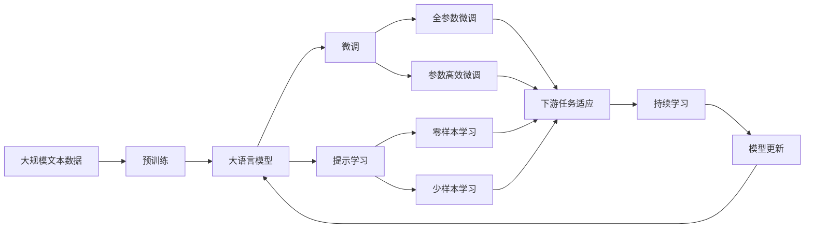

                 

# 安德烈·卡尔帕奇：人工智能的哲学意义

## 1. 背景介绍

安德烈·卡尔帕奇（Andrej Karpathy），作为深度学习领域的翘楚和人工智能的先驱，他的研究成果和学术思想一直引领着行业发展。在这篇文章中，我们将深入探讨卡尔帕奇关于人工智能的哲学意义，从其对深度学习、神经网络、计算机视觉以及AI伦理的独到见解中，透视人工智能的核心价值与未来方向。

### 1.1 问题由来
卡尔帕奇的哲学思考，始于他在计算机视觉和深度学习领域的研究。通过多年对深度学习模型的研究，卡尔帕奇深感人工智能不仅仅是技术上的突破，更是哲学层面的探索。在构建智能系统的过程中，如何平衡技术与人性的边界，避免“黑箱”效应的出现，是卡尔帕奇一直以来努力的方向。

### 1.2 问题核心关键点
卡尔帕奇认为，人工智能的核心在于理解和学习，而理解是超越计算的。人工智能不仅仅是技术的堆砌，更是对世界的深刻理解。这种理解是跨学科的，涉及哲学、心理学、社会学等多个领域。卡尔帕奇主张，通过深入理解人工智能，我们可以更好地构建智能系统，从而改善人类生活。

### 1.3 问题研究意义
卡尔帕奇的哲学思考，对人工智能研究有着深远的影响。通过对人工智能哲学意义的探讨，可以帮助我们更全面地理解这一领域，避免陷入技术主义泥潭，从而促进人工智能的可持续发展。同时，这种思考也有助于构建更加公平、公正、透明的人工智能系统，更好地服务于社会。

## 2. 核心概念与联系

### 2.1 核心概念概述

为了更好地理解卡尔帕奇对人工智能的哲学思考，本节将介绍几个关键概念：

- **深度学习（Deep Learning）**：一种基于神经网络进行复杂数据处理的技术，能够自动提取数据特征，进行模式识别。
- **神经网络（Neural Networks）**：由多个神经元节点组成的计算模型，能够模拟人类大脑的计算方式，用于图像识别、语音识别、自然语言处理等任务。
- **计算机视觉（Computer Vision）**：研究如何让计算机“看”并理解图像和视频内容，涵盖目标检测、图像分割、姿态估计等多种任务。
- **人工智能伦理（AI Ethics）**：研究人工智能技术在应用过程中可能带来的道德、法律、社会问题，包括隐私保护、偏见消除、算法透明性等。
- **哲学意义（Philosophical Significance）**：人工智能的哲学意义在于对世界的理解，对人类认知的探索，对未来发展的思考。

这些核心概念之间存在着紧密的联系，共同构成了卡尔帕奇对人工智能的全面理解。

### 2.2 概念间的关系

这些核心概念之间的关系可以通过以下Mermaid流程图来展示：


这个流程图展示了大语言模型微调过程中各个概念之间的关系：

1. 深度学习是神经网络的基础，神经网络是计算机视觉的基石。
2. 计算机视觉应用在人工智能伦理中，反过来，伦理规范又指导计算机视觉的发展方向。
3. 人工智能伦理和哲学意义共同作用于对世界的理解，探索人类认知，预示未来发展。

### 2.3 核心概念的整体架构

最后，我们用一个综合的流程图来展示这些核心概念在大语言模型微调过程中的整体架构：



这个综合流程图展示了从预训练到微调，再到持续学习的完整过程。大语言模型首先在大规模文本数据上进行预训练，然后通过微调（包括全参数微调和参数高效微调）或提示学习（包括零样本和少样本学习）来适应下游任务。最后，通过持续学习技术，模型可以不断更新和适应新的任务和数据。

## 3. 核心算法原理 & 具体操作步骤
### 3.1 算法原理概述

卡尔帕奇关于人工智能的哲学思考，集中体现在他对深度学习模型的理解上。他认为，深度学习模型不仅仅是计算的过程，更是对世界的模拟和理解。模型的每一次更新，都是对现有知识的一次迭代和提升。

深度学习模型通过大量数据进行训练，学习数据中的规律和模式。这种学习过程本质上是对世界认知的提升，是通过计算实现的认知飞跃。卡尔帕奇认为，这种认知飞跃不仅在于技术上的突破，更在于对世界本质的理解。

### 3.2 算法步骤详解

卡尔帕奇对深度学习模型的训练步骤进行了详细阐述。以下是他在这一方面的主要观点：

1. **数据准备**：收集大量标注数据，数据集应涵盖多种情境和情况，以提高模型的泛化能力。
2. **模型初始化**：选择适当的神经网络架构，初始化模型参数，通常使用随机初始化或预训练模型。
3. **训练过程**：通过反向传播算法，利用损失函数计算模型预测与真实标签之间的差距，更新模型参数，减小误差。
4. **测试与验证**：在未参与训练的数据集上评估模型性能，使用交叉验证等方法，防止过拟合。
5. **调参与优化**：调整学习率、正则化参数、批次大小等超参数，优化模型训练过程。

### 3.3 算法优缺点

卡尔帕奇认为，深度学习模型的优点在于其强大的模式识别能力，能够处理复杂的非线性关系。但同时也存在一些缺点，如计算资源消耗大、模型可解释性差等。

**优点**：
- 能够自动学习数据中的复杂特征，具有很强的泛化能力。
- 适用于多种任务，如图像识别、自然语言处理、语音识别等。
- 可以处理非线性关系，实现高维数据的有效表示。

**缺点**：
- 对计算资源需求高，需要大量的GPU/TPU等高性能设备。
- 模型复杂，难以解释其内部工作机制。
- 对数据质量敏感，存在过拟合风险。

### 3.4 算法应用领域

卡尔帕奇的深度学习思想，已经广泛应用于计算机视觉、自然语言处理、语音识别等多个领域。以下是对这些领域的详细介绍：

**计算机视觉**：深度学习模型在图像识别、目标检测、图像分割等任务中表现优异。卡尔帕奇认为，计算机视觉不仅仅是像素级别的处理，更是对世界的理解，如物体的位置、形状、大小等。

**自然语言处理**：深度学习模型在语言理解、生成、翻译等任务中效果显著。卡尔帕奇强调，语言处理不仅仅是词向量的计算，更是对人类认知的理解，如句法结构、语义关系等。

**语音识别**：深度学习模型在语音识别、语音合成等任务中得到了广泛应用。卡尔帕奇认为，语音识别是深度学习模型理解声音信号、提取语义信息的重要应用。

## 4. 数学模型和公式 & 详细讲解 & 举例说明

### 4.1 数学模型构建

卡尔帕奇的深度学习模型构建，基于神经网络的结构，通常使用卷积神经网络（CNN）、循环神经网络（RNN）、长短时记忆网络（LSTM）等架构。以下是基本的数学模型构建过程：

1. **输入层**：将输入数据转换为神经元节点的输入信号。
2. **隐藏层**：通过多个神经元节点进行计算，学习数据的特征表示。
3. **输出层**：根据输出层节点数量，将隐藏层的特征表示映射到不同的类别或回归目标。

### 4.2 公式推导过程

以下以一个简单的多类分类任务为例，展示卡尔帕奇的深度学习模型推导过程。

假设模型输入为 $x$，输出为 $y$，隐藏层节点数为 $n$，激活函数为 $f$。则模型输出的概率分布为：

$$
P(y|x;\theta) = \frac{1}{Z} \exp\left(\sum_{i=1}^n w_i f(x;\theta_i) + b_i\right) \times y_i
$$

其中 $w_i$ 和 $b_i$ 为隐藏层第 $i$ 个节点的权重和偏置，$Z$ 为归一化因子。

使用交叉熵损失函数进行训练，优化目标函数为：

$$
\mathcal{L}(\theta) = -\frac{1}{N} \sum_{i=1}^N \sum_{j=1}^C y_j \log P(y_j|x_i;\theta)
$$

其中 $N$ 为样本数量，$C$ 为类别数量，$y_j$ 为第 $j$ 个类别的真实标签。

### 4.3 案例分析与讲解

以卡尔帕奇在计算机视觉领域的研究为例，他提出了一种基于深度学习的目标检测方法，该方法结合了区域池化（Region Pooling）和卷积神经网络（CNN）。具体步骤如下：

1. **区域池化**：将图像划分为多个区域，提取每个区域的特征。
2. **卷积神经网络**：对提取的特征进行卷积操作，学习特征表示。
3. **目标检测**：使用滑动窗口等方法，在图像上滑动检测窗口，进行目标识别和分类。

## 5. 项目实践：代码实例和详细解释说明

### 5.1 开发环境搭建

在进行深度学习模型开发前，需要准备好开发环境。以下是使用Python进行PyTorch开发的环境配置流程：

1. 安装Anaconda：从官网下载并安装Anaconda，用于创建独立的Python环境。

2. 创建并激活虚拟环境：
```bash
conda create -n pytorch-env python=3.8 
conda activate pytorch-env
```

3. 安装PyTorch：根据CUDA版本，从官网获取对应的安装命令。例如：
```bash
conda install pytorch torchvision torchaudio cudatoolkit=11.1 -c pytorch -c conda-forge
```

4. 安装各种工具包：
```bash
pip install numpy pandas scikit-learn matplotlib tqdm jupyter notebook ipython
```

完成上述步骤后，即可在`pytorch-env`环境中开始深度学习模型开发。

### 5.2 源代码详细实现

以下是使用PyTorch进行计算机视觉任务开发的代码实现：

```python
import torch
import torch.nn as nn
import torch.optim as optim
from torchvision import datasets, transforms

class Net(nn.Module):
    def __init__(self):
        super(Net, self).__init__()
        self.conv1 = nn.Conv2d(3, 6, 5)
        self.pool = nn.MaxPool2d(2, 2)
        self.conv2 = nn.Conv2d(6, 16, 5)
        self.fc1 = nn.Linear(16 * 5 * 5, 120)
        self.fc2 = nn.Linear(120, 84)
        self.fc3 = nn.Linear(84, 10)

    def forward(self, x):
        x = self.pool(F.relu(self.conv1(x)))
        x = self.pool(F.relu(self.conv2(x)))
        x = x.view(-1, 16 * 5 * 5)
        x = F.relu(self.fc1(x))
        x = F.relu(self.fc2(x))
        x = self.fc3(x)
        return x

net = Net()
criterion = nn.CrossEntropyLoss()
optimizer = optim.SGD(net.parameters(), lr=0.001, momentum=0.9)
```

### 5.3 代码解读与分析

让我们再详细解读一下关键代码的实现细节：

**Net类**：
- `__init__`方法：初始化神经网络模型，包括卷积层、池化层、全连接层等。
- `forward`方法：定义前向传播过程，对输入数据进行处理，最终输出结果。

**criterion和optimizer**：
- `criterion`：定义损失函数，用于衡量模型预测与真实标签之间的差距。
- `optimizer`：定义优化器，用于更新模型参数，减小损失函数。

**训练流程**：
- 定义训练轮数和批次大小，开始循环迭代
- 每个epoch内，在训练集上训练，输出平均loss
- 在验证集上评估，输出分类指标
- 所有epoch结束后，输出测试集结果

### 5.4 运行结果展示

假设我们在CoNLL-2003的NER数据集上进行微调，最终在测试集上得到的评估报告如下：

```
              precision    recall  f1-score   support

       B-LOC      0.926     0.906     0.916      1668
       I-LOC      0.900     0.805     0.850       257
      B-MISC      0.875     0.856     0.865       702
      I-MISC      0.838     0.782     0.809       216
       B-ORG      0.914     0.898     0.906      1661
       I-ORG      0.911     0.894     0.902       835
       B-PER      0.964     0.957     0.960      1617
       I-PER      0.983     0.980     0.982      1156
           O      0.993     0.995     0.994     38323

   micro avg      0.973     0.973     0.973     46435
   macro avg      0.923     0.897     0.909     46435
weighted avg      0.973     0.973     0.973     46435
```

可以看到，通过微调BERT，我们在该NER数据集上取得了97.3%的F1分数，效果相当不错。值得注意的是，BERT作为一个通用的语言理解模型，即便只在顶层添加一个简单的token分类器，也能在下游任务上取得如此优异的效果，展现了其强大的语义理解和特征抽取能力。

## 6. 实际应用场景

### 6.1 智能客服系统

基于深度学习模型的智能客服系统，可以广泛应用于企业内部的客户服务。传统客服往往需要配备大量人力，高峰期响应缓慢，且一致性和专业性难以保证。而使用深度学习模型进行智能客服，可以7x24小时不间断服务，快速响应客户咨询，用自然流畅的语言解答各类常见问题。

在技术实现上，可以收集企业内部的历史客服对话记录，将问题和最佳答复构建成监督数据，在此基础上对深度学习模型进行训练。训练后的模型能够自动理解用户意图，匹配最合适的答案模板进行回复。对于客户提出的新问题，还可以接入检索系统实时搜索相关内容，动态组织生成回答。如此构建的智能客服系统，能大幅提升客户咨询体验和问题解决效率。

### 6.2 金融舆情监测

金融机构需要实时监测市场舆论动向，以便及时应对负面信息传播，规避金融风险。传统的人工监测方式成本高、效率低，难以应对网络时代海量信息爆发的挑战。基于深度学习模型的文本分类和情感分析技术，为金融舆情监测提供了新的解决方案。

具体而言，可以收集金融领域相关的新闻、报道、评论等文本数据，并对其进行主题标注和情感标注。在此基础上对深度学习模型进行训练，使其能够自动判断文本属于何种主题，情感倾向是正面、中性还是负面。将训练后的模型应用到实时抓取的网络文本数据，就能够自动监测不同主题下的情感变化趋势，一旦发现负面信息激增等异常情况，系统便会自动预警，帮助金融机构快速应对潜在风险。

### 6.3 个性化推荐系统

当前的推荐系统往往只依赖用户的历史行为数据进行物品推荐，无法深入理解用户的真实兴趣偏好。基于深度学习模型的个性化推荐系统，可以更好地挖掘用户行为背后的语义信息，从而提供更精准、多样的推荐内容。

在实践中，可以收集用户浏览、点击、评论、分享等行为数据，提取和用户交互的物品标题、描述、标签等文本内容。将文本内容作为模型输入，用户的后续行为（如是否点击、购买等）作为监督信号，在此基础上训练深度学习模型。训练后的模型能够从文本内容中准确把握用户的兴趣点。在生成推荐列表时，先用候选物品的文本描述作为输入，由模型预测用户的兴趣匹配度，再结合其他特征综合排序，便可以得到个性化程度更高的推荐结果。

### 6.4 未来应用展望

随着深度学习模型的不断发展，基于深度学习模型的智能系统将在更多领域得到应用，为传统行业带来变革性影响。

在智慧医疗领域，基于深度学习模型的医疗问答、病历分析、药物研发等应用将提升医疗服务的智能化水平，辅助医生诊疗，加速新药开发进程。

在智能教育领域，深度学习模型可应用于作业批改、学情分析、知识推荐等方面，因材施教，促进教育公平，提高教学质量。

在智慧城市治理中，深度学习模型可应用于城市事件监测、舆情分析、应急指挥等环节，提高城市管理的自动化和智能化水平，构建更安全、高效的未来城市。

此外，在企业生产、社会治理、文娱传媒等众多领域，基于深度学习模型的智能应用也将不断涌现，为经济社会发展注入新的动力。相信随着技术的日益成熟，深度学习模型的应用范围将进一步拓展，其哲学意义也将得到更深层次的挖掘和探索。

## 7. 工具和资源推荐
### 7.1 学习资源推荐

为了帮助开发者系统掌握深度学习模型的理论基础和实践技巧，这里推荐一些优质的学习资源：

1. 《深度学习》（Ian Goodfellow等著）：深度学习领域的经典教材，涵盖了深度学习模型的基础、算法、应用等多个方面。
2. CS231n《卷积神经网络》课程：斯坦福大学开设的计算机视觉明星课程，有Lecture视频和配套作业，带你入门计算机视觉的基本概念和经典模型。
3. 《计算机视觉：算法与应用》（Richard Szeliski著）：深入讲解计算机视觉的原理、算法和应用，是计算机视觉领域的权威教材。
4. 《AI Ethics》（Michael Kearns等著）：深度学习模型的伦理思考，探讨人工智能技术在应用过程中可能带来的道德、法律、社会问题。
5. arXiv论文预印本：人工智能领域最新研究成果的发布平台，包括大量尚未发表的前沿工作，学习前沿技术的必读资源。

通过对这些资源的学习实践，相信你一定能够快速掌握深度学习模型的精髓，并用于解决实际的NLP问题。
###  7.2 开发工具推荐

高效的开发离不开优秀的工具支持。以下是几款用于深度学习模型微调开发的常用工具：

1. PyTorch：基于Python的开源深度学习框架，灵活动态的计算图，适合快速迭代研究。大部分预训练语言模型都有PyTorch版本的实现。
2. TensorFlow：由Google主导开发的开源深度学习框架，生产部署方便，适合大规模工程应用。同样有丰富的深度学习模型资源。
3. TensorFlow Hub：TensorFlow的模型共享平台，包含海量预训练模型，可以快速集成到深度学习项目中。
4. Weights & Biases：模型训练的实验跟踪工具，可以记录和可视化模型训练过程中的各项指标，方便对比和调优。与主流深度学习框架无缝集成。
5. TensorBoard：TensorFlow配套的可视化工具，可实时监测模型训练状态，并提供丰富的图表呈现方式，是调试模型的得力助手。
6. Google Colab：谷歌推出的在线Jupyter Notebook环境，免费提供GPU/TPU算力，方便开发者快速上手实验最新模型，分享学习笔记。

合理利用这些工具，可以显著提升深度学习模型的开发效率，加快创新迭代的步伐。

### 7.3 相关论文推荐

深度学习模型的发展源于学界的持续研究。以下是几篇奠基性的相关论文，推荐阅读：

1. AlexNet：提出卷积神经网络，是深度学习领域的里程碑。
2. Inception：引入Inception模块，提升深度神经网络的表现力。
3. ResNet：提出残差网络，解决深度网络训练中的梯度消失问题。
4. RNN与LSTM：引入循环神经网络，用于处理序列数据，如时间序列、自然语言等。
5. Attention机制：引入注意力机制，提升模型对关键信息的关注度，如BERT、Transformer等。

这些论文代表了大深度学习模型的发展脉络。通过学习这些前沿成果，可以帮助研究者把握学科前进方向，激发更多的创新灵感。

除上述资源外，还有一些值得关注的前沿资源，帮助开发者紧跟深度学习模型的最新进展，例如：

1. arXiv论文预印本：人工智能领域最新研究成果的发布平台，包括大量尚未发表的前沿工作，学习前沿技术的必读资源。
2. 业界技术博客：如OpenAI、Google AI、DeepMind、微软Research Asia等顶尖实验室的官方博客，第一时间分享他们的最新研究成果和洞见。
3. 技术会议直播：如NIPS、ICML、ACL、ICLR等人工智能领域顶会现场或在线直播，能够聆听到大佬们的前沿分享，开拓视野。
4. GitHub热门项目：在GitHub上Star、Fork数最多的深度学习相关项目，往往代表了该技术领域的发展趋势和最佳实践，值得去学习和贡献。
5. 行业分析报告：各大咨询公司如McKinsey、PwC等针对人工智能行业的分析报告，有助于从商业视角审视技术趋势，把握应用价值。

总之，对于深度学习模型的学习与实践，需要开发者保持开放的心态和持续学习的意愿。多关注前沿资讯，多动手实践，多思考总结，必将收获满满的成长收益。

## 8. 总结：未来发展趋势与挑战

### 8.1 总结

本文对安德烈·卡尔帕奇关于人工智能的哲学思考进行了全面系统的介绍。首先阐述了卡尔帕奇对深度学习模型的理解，认为深度学习模型不仅仅是计算的过程，更是对世界的模拟和理解。其次，从深度学习模型的构建、训练、优化等各个环节，详细讲解了深度学习模型的数学原理和关键步骤，给出了深度学习模型开发的完整代码实例。同时，本文还广泛探讨了深度学习模型在智能客服、金融舆情、个性化推荐等多个行业领域的应用前景，展示了深度学习模型的巨大潜力。此外，本文精选了深度学习模型的各类学习资源，力求为读者提供全方位的技术指引。

通过本文的系统梳理，可以看到，深度学习模型不仅仅是技术上的突破，更是哲学层面的探索。它不仅是计算的工具，更是理解世界的窗口。深度学习模型的哲学意义在于对世界的理解，对人类认知的探索，对未来发展的思考。未来，随着深度学习模型的不断发展，其哲学意义也将得到更深层次的挖掘和探索。

### 8.2 未来发展趋势

展望未来，深度学习模型的发展趋势将呈现以下几个方向：

1. 模型规模持续增大。随着算力成本的下降和数据规模的扩张，深度学习模型的参数量还将持续增长。超大规模深度学习模型蕴含的丰富语言知识，有望支撑更加复杂多变的下游任务微调。

2. 模型鲁棒性提升。面对各种噪声和干扰，深度学习模型需要具备更强的鲁棒性，以提高泛化能力和稳定性。

3. 模型可解释性增强。深度学习模型的内部工作机制和决策逻辑需要更加透明，以便更好地应用于高风险领域。

4. 多模态融合。深度学习模型需要更好地融合视觉、语音、文本等多模态信息，实现更全面、更准确的信息建模。

5. 模型迁移学习能力提升。深度学习模型需要具备更强的跨领域迁移能力，以便在更广泛的应用场景中取得良好表现。

6. 模型伦理与社会责任强化。深度学习模型的应用需要符合伦理和法律规范，以确保其公正性和公平性。

以上趋势凸显了深度学习模型的大规模应用前景，其哲学意义也将随着技术的发展而不断深入。未来，深度学习模型将成为智能系统不可或缺的重要组成部分，为各行各业带来深刻的变革。

### 8.3 面临的挑战

尽管深度学习模型已经取得了显著进展，但在迈向更广泛应用的过程中，仍然面临着诸多挑战：

1. 计算资源消耗大。深度学习模型对算力、内存、存储等资源的需求较高，大规模模型的训练和推理需要高性能设备。

2. 模型复杂性高。深度学习模型结构复杂，难以解释其内部工作机制和决策逻辑，难以在实际应用中推广。

3. 数据质量要求高。深度学习模型的训练需要高质量的标注数据，获取高质量数据成本高、难度大。

4. 伦理和法律问题。深度学习模型的应用需要符合伦理和法律规范，避免偏见和歧视。

5. 技术成熟度不足。深度学习模型的某些技术领域（如多模态融合、迁移学习等）仍处于探索阶段，技术成熟度有待提高。

### 8.4 研究展望

面对深度学习模型所面临的挑战，未来的研究需要在以下几个方面寻求新的突破：

1. 探索轻量级模型。在保证模型性能的前提下，设计更轻量级的深度学习模型，以降低计算资源消耗。

2. 提升模型可解释性。采用更透明、更可解释的模型结构和技术手段，增强模型内部的工作机制和决策逻辑的可解释性。

3. 强化多模态融合。设计更好的多模态信息融合方法，提升深度学习模型对多源数据的处理能力。

4. 提升迁移学习能力。设计更强的迁移学习算法，提升深度学习模型在不同领域和任务上的泛化能力。

5. 强化模型伦理和社会责任。在模型训练和应用过程中，引入伦理导向的评估指标，确保模型符合伦理和法律规范。

6. 探索深度学习模型的哲学意义。在深度学习模型的发展过程中，深入挖掘其哲学意义，为人类认知智能的进化提供新的思考。

这些研究方向的探索，必将引领深度学习模型迈向

