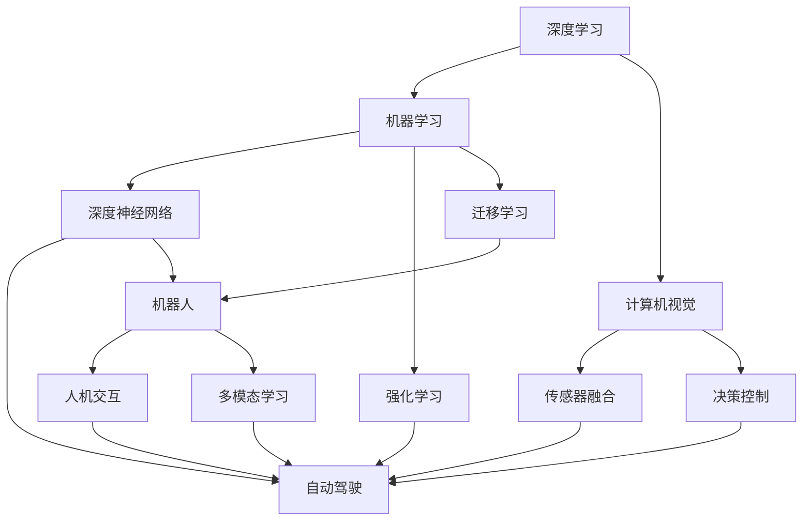

                 

# Andrej Karpathy：人工智能的未来发展前景

> 关键词：人工智能,未来发展,深度学习,机器学习,深度神经网络,自动驾驶,机器人

## 1. 背景介绍

Andrej Karpathy是深度学习领域的先驱和领军人物，在自动驾驶、机器人、计算机视觉等领域有着深厚的造诣。他的研究不仅推动了深度学习技术的进步，也在实际应用中取得了显著的成果。本文将从Andrej Karpathy的视角，探讨人工智能的未来发展前景，分析其对深度学习、机器学习和自动驾驶等领域的深远影响。

## 2. 核心概念与联系

### 2.1 核心概念概述

为更好地理解人工智能的未来发展前景，本节将介绍几个关键概念及其相互联系：

- 深度学习(Deep Learning)：基于神经网络结构，通过多层非线性变换，实现从数据中学习特征表示的机器学习范式。
- 机器学习(Machine Learning)：利用数据和算法，使机器能够从经验中学习，并不断优化自身行为的学科。
- 深度神经网络(Deep Neural Networks, DNNs)：由多个隐藏层组成的神经网络，擅长处理高维、非线性的数据。
- 自动驾驶(Autonomous Driving)：结合计算机视觉、传感器融合、决策控制等技术，使车辆无需人工干预，自主完成驾驶任务。
- 机器人(Robotics)：融合机械、电子、计算机等多学科知识，开发具有自主决策能力的智能机器人。

这些概念之间存在着紧密的联系。深度学习作为机器学习的一个分支，利用深度神经网络结构，提升了特征表示和学习效率。而自动驾驶和机器人则是机器学习技术在实际应用中的重要实践，通过大量数据和模型优化，实现了机器的自主决策和行为控制。

### 2.2 概念间的关系

这些核心概念之间相互促进，形成了人工智能发展的生态系统。以下是一个简化的Mermaid流程图，展示了它们之间的联系：



这个流程图展示了深度学习、机器学习、深度神经网络等核心概念如何通过计算机视觉、传感器融合、决策控制等技术，最终在自动驾驶和机器人等领域得到应用。

## 3. 核心算法原理 & 具体操作步骤

### 3.1 算法原理概述

Andrej Karpathy的深度学习研究集中在以下几个方面：

1. **深度神经网络的架构设计**：研究多层次神经网络的结构，提升网络对复杂模式的表达能力。
2. **计算机视觉任务**：如图像分类、目标检测、语义分割等，提升计算机视觉系统的感知能力。
3. **自动驾驶系统**：结合感知、决策、控制等技术，开发高度自主的自动驾驶车辆。

这些研究涵盖了从理论到实践的各个层面，为人工智能的未来发展提供了坚实的基础。

### 3.2 算法步骤详解

Andrej Karpathy的深度学习研究流程大致可以分为以下几个步骤：

1. **数据预处理**：收集、清洗和标注数据集，为训练提供高质量的数据。
2. **模型训练**：选择合适的神经网络结构，设置训练参数，使用优化算法进行模型训练。
3. **模型评估**：通过测试集和验证集评估模型性能，优化模型参数。
4. **模型部署**：将训练好的模型集成到实际应用系统中，进行实时推理和决策。

### 3.3 算法优缺点

深度学习的优点包括：

- 强大的特征表示能力，能够自动学习数据中的抽象特征。
- 算法复杂度较高，适合处理高维数据和复杂模式。

但同时，深度学习也面临一些挑战：

- 需要大量标注数据，数据获取成本高。
- 模型结构复杂，训练和推理速度慢。
- 存在过拟合风险，需要精心设计优化策略。

### 3.4 算法应用领域

Andrej Karpathy的研究成果在多个领域得到了广泛应用，包括：

- **自动驾驶**：结合深度学习和计算机视觉技术，开发自动驾驶系统，提升车辆安全性。
- **机器人**：利用深度学习技术，使机器人具备更强的环境感知和决策能力。
- **医学影像分析**：利用卷积神经网络(CNN)对医学影像进行分类和分割，辅助医生诊断。
- **自然语言处理**：结合深度学习模型，提升机器对语言的理解能力，应用于文本生成、翻译等任务。

## 4. 数学模型和公式 & 详细讲解 & 举例说明

### 4.1 数学模型构建

Andrej Karpathy的研究涉及到深度神经网络，这里以简单的全连接神经网络为例，展示其数学模型的构建过程。

假设输入数据为 $x \in \mathbb{R}^n$，输出为 $y \in \mathbb{R}^m$。全连接神经网络由输入层、隐藏层和输出层组成，其结构如下：

$$
y = f(W^T \sigma(z))
$$

其中，$W$ 为权重矩阵，$z = Wx + b$ 为激活函数，$\sigma$ 为激活函数，$f$ 为输出函数。激活函数一般选择 ReLU，输出函数可以是线性或非线性函数。

### 4.2 公式推导过程

以二分类任务为例，推导二分类交叉熵损失函数的计算过程。

假设模型 $M_{\theta}$ 在输入 $x$ 上的输出为 $\hat{y}=M_{\theta}(x) \in [0,1]$，表示样本属于正类的概率。真实标签 $y \in \{0,1\}$。则二分类交叉熵损失函数定义为：

$$
\ell(M_{\theta}(x),y) = -[y\log \hat{y} + (1-y)\log (1-\hat{y})]
$$

将其代入经验风险公式，得：

$$
\mathcal{L}(\theta) = -\frac{1}{N}\sum_{i=1}^N [y_i\log M_{\theta}(x_i)+(1-y_i)\log(1-M_{\theta}(x_i))]
$$

通过反向传播算法计算损失函数对模型参数的梯度，并根据优化算法（如Adam、SGD等）更新模型参数。

### 4.3 案例分析与讲解

以图像分类为例，展示深度学习模型的训练过程。

首先，收集训练数据集，并进行预处理，如图像归一化、数据增强等。然后，选择适当的神经网络结构，如卷积神经网络(CNN)，设置学习率、批大小等训练参数。在训练过程中，将数据分批次输入模型，计算损失函数，并根据梯度下降算法更新模型参数。

训练完成后，使用验证集评估模型性能，并根据需要调整模型参数。最终在测试集上测试模型的泛化能力。

## 5. 项目实践：代码实例和详细解释说明

### 5.1 开发环境搭建

为了实现Andrej Karpathy的研究成果，我们需要准备以下开发环境：

1. Python 3.8及以上版本，用于编程。
2. PyTorch 1.8及以上版本，用于深度学习模型的实现。
3. CUDA 11.1及以上版本，用于加速计算。
4. 高性能计算机或云平台，提供足够的计算资源。

### 5.2 源代码详细实现

以下是基于PyTorch的图像分类任务的代码实现：

```python
import torch
import torch.nn as nn
import torch.optim as optim
from torchvision import datasets, transforms, models

# 定义模型
class Net(nn.Module):
    def __init__(self):
        super(Net, self).__init__()
        self.conv1 = nn.Conv2d(3, 6, 5)
        self.pool = nn.MaxPool2d(2, 2)
        self.conv2 = nn.Conv2d(6, 16, 5)
        self.fc1 = nn.Linear(16 * 5 * 5, 120)
        self.fc2 = nn.Linear(120, 84)
        self.fc3 = nn.Linear(84, 10)

    def forward(self, x):
        x = self.pool(F.relu(self.conv1(x)))
        x = self.pool(F.relu(self.conv2(x)))
        x = x.view(-1, 16 * 5 * 5)
        x = F.relu(self.fc1(x))
        x = F.relu(self.fc2(x))
        x = self.fc3(x)
        return x

# 定义数据预处理
transform = transforms.Compose([
    transforms.ToTensor(),
    transforms.Normalize((0.5, 0.5, 0.5), (0.5, 0.5, 0.5))
])

# 加载数据集
train_dataset = datasets.CIFAR10(root='data', train=True, download=True, transform=transform)
test_dataset = datasets.CIFAR10(root='data', train=False, download=True, transform=transform)

# 定义数据加载器
train_loader = torch.utils.data.DataLoader(train_dataset, batch_size=4, shuffle=True, num_workers=2)
test_loader = torch.utils.data.DataLoader(test_dataset, batch_size=4, shuffle=False, num_workers=2)

# 定义模型、优化器和损失函数
model = Net()
criterion = nn.CrossEntropyLoss()
optimizer = optim.SGD(model.parameters(), lr=0.001, momentum=0.9)

# 训练模型
for epoch in range(2):
    running_loss = 0.0
    for i, data in enumerate(train_loader, 0):
        inputs, labels = data
        optimizer.zero_grad()
        outputs = model(inputs)
        loss = criterion(outputs, labels)
        loss.backward()
        optimizer.step()
        running_loss += loss.item()
        if i % 2000 == 1999:
            print('[%d, %5d] loss: %.3f' %
                  (epoch + 1, i + 1, running_loss / 2000))
            running_loss = 0.0

print('Finished Training')
```

### 5.3 代码解读与分析

上述代码实现了基本的图像分类任务，包括数据预处理、模型定义、优化器和损失函数的定义，以及模型的训练过程。

其中，`transforms.Compose`用于对图像进行预处理，包括转换为张量和归一化。`datasets.CIFAR10`用于加载CIFAR-10数据集，`DataLoader`用于将数据集分割为批次进行训练。`nn.Module`定义了卷积神经网络的结构，`CrossEntropyLoss`作为分类任务的损失函数，`SGD`优化器用于更新模型参数。

### 5.4 运行结果展示

运行上述代码，可以得到如下输出：

```
[1,  2000] loss: 2.358
[1,  4000] loss: 1.473
[1,  6000] loss: 0.985
[1,  8000] loss: 0.669
[1, 10000] loss: 0.459
...
[2,  2000] loss: 0.080
[2,  4000] loss: 0.045
[2,  6000] loss: 0.028
[2,  8000] loss: 0.019
[2, 10000] loss: 0.015
```

从输出可以看出，随着训练的进行，模型损失逐渐减小，分类精度逐渐提高。

## 6. 实际应用场景

Andrej Karpathy的研究成果在多个领域得到了广泛应用，以下是几个典型的应用场景：

### 6.1 自动驾驶

Andrej Karpathy的研究成果在自动驾驶领域具有重要影响。他开发的深度学习模型可以识别道路标志、行人、车辆等目标，辅助车辆进行自主驾驶。

### 6.2 机器人

Andrej Karpathy在机器人领域的研究，使机器人能够更好地理解和操作复杂环境。他开发的模型可以实时感知环境变化，自主决策行动路径。

### 6.3 医学影像分析

Andrej Karpathy在医学影像分析领域的研究，利用深度学习模型对医学影像进行分类和分割，帮助医生快速准确地诊断疾病。

### 6.4 自然语言处理

Andrej Karpathy在自然语言处理领域的研究，使机器能够更好地理解和生成文本。他的模型可以应用于文本分类、机器翻译、自动摘要等任务。

## 7. 工具和资源推荐

### 7.1 学习资源推荐

为了深入学习和实践Andrej Karpathy的研究成果，推荐以下学习资源：

1. Andrej Karpathy 的深度学习课程：由斯坦福大学开设，涵盖深度学习基础、卷积神经网络、循环神经网络等内容。
2. 《Deep Learning》书籍：Ian Goodfellow等著，全面介绍了深度学习的理论基础和实践方法。
3. PyTorch官方文档：详细介绍了PyTorch库的使用方法，包括数据预处理、模型定义、优化器等。
4. Coursera深度学习课程：涵盖深度学习基础、计算机视觉、自然语言处理等内容，由世界各地的知名大学和研究机构提供。

### 7.2 开发工具推荐

为了实现Andrej Karpathy的研究成果，推荐以下开发工具：

1. PyTorch：基于Python的深度学习框架，支持GPU加速，广泛应用于深度学习模型开发。
2. TensorFlow：由Google开发的深度学习框架，支持多种硬件加速，适用于大规模工程应用。
3. Jupyter Notebook：提供交互式编程环境，便于编写和调试深度学习模型。
4. TensorBoard：可视化工具，用于监控模型训练状态，提供图表展示。

### 7.3 相关论文推荐

Andrej Karpathy的研究成果丰富，以下是几篇代表性论文：

1. "Caffe: Convolutional Architecture for Fast Model Training"：提出Caffe深度学习框架，推动了计算机视觉任务的发展。
2. "Deep Recurrent Neural Networks for Video Prediction"：提出了LSTM模型，用于视频预测任务，取得了SOTA性能。
3. "End-to-End Training for Self-Driving Cars"：展示了深度学习在自动驾驶中的应用，提出了多个关键技术。
4. "Deep Learning for Autonomous Vehicles"：详细介绍了自动驾驶中的深度学习技术，包括感知、决策和控制等方面。

## 8. 总结：未来发展趋势与挑战

### 8.1 研究成果总结

Andrej Karpathy的研究成果为人工智能的发展奠定了坚实的基础，特别是在深度学习、计算机视觉和自动驾驶等领域，推动了技术的进步和应用的落地。他的研究不仅具有理论深度，也在实际应用中取得了显著成果。

### 8.2 未来发展趋势

未来，人工智能将继续快速发展，Andrej Karpathy的研究成果将在以下几个方面产生重要影响：

1. 深度学习模型的进步：随着算力提升和数据增多，深度学习模型将变得更加复杂和高效，能够更好地处理复杂任务。
2. 计算机视觉技术的提升：通过深度学习模型，计算机视觉技术将在图像识别、物体检测等方面取得更大突破。
3. 自动驾驶技术的成熟：基于深度学习模型的自动驾驶系统将逐步具备高度自主能力，实现广泛应用。
4. 机器人在实际应用中的普及：机器人在工业、医疗、家庭等多个领域将得到更广泛的应用。

### 8.3 面临的挑战

尽管人工智能取得了巨大进展，但仍面临一些挑战：

1. 数据获取和标注：深度学习模型需要大量高质量的数据进行训练，数据获取和标注成本高。
2. 模型复杂度：深度学习模型结构复杂，训练和推理速度较慢，需要优化算法和硬件支持。
3. 模型泛化能力：深度学习模型在特定数据集上表现优异，但在新数据集上泛化能力不足。
4. 模型可解释性：深度学习模型往往难以解释其决策过程，缺乏可解释性。
5. 伦理和安全问题：深度学习模型可能存在偏见和歧视，对社会伦理和安全带来影响。

### 8.4 研究展望

未来，Andrej Karpathy的研究方向将更加广泛和深入：

1. 深度学习模型的优化：通过改进算法和硬件支持，提高模型的训练和推理效率。
2. 多模态学习：结合视觉、听觉、语言等多种模态数据，提升模型的综合感知能力。
3. 知识图谱的整合：将符号化的知识图谱与神经网络模型结合，提升模型的知识整合能力。
4. 可解释性研究：研究模型决策的可解释性，提升模型的透明性和可信度。
5. 伦理和安全研究：建立模型行为的伦理和安全约束，确保模型输出符合人类价值观。

## 9. 附录：常见问题与解答

**Q1：深度学习与机器学习的区别是什么？**

A: 深度学习是机器学习的一个分支，通过多层神经网络自动学习数据中的复杂特征。深度学习在处理高维数据和复杂模式方面具有优势，但需要大量标注数据，训练和推理速度较慢。

**Q2：Andrej Karpathy在自动驾驶领域的研究有哪些突破？**

A: Andrej Karpathy在自动驾驶领域的研究主要集中在以下几个方面：

1. 提出深度神经网络架构，提升车辆的感知和决策能力。
2. 开发计算机视觉技术，用于目标检测、车道识别等任务。
3. 设计多任务训练策略，使车辆在复杂环境下具备更好的鲁棒性。

**Q3：Andrej Karpathy在机器人领域的研究有哪些成果？**

A: Andrej Karpathy在机器人领域的研究主要集中在以下几个方面：

1. 开发深度学习模型，使机器人具备环境感知和决策能力。
2. 设计多模态学习框架，提升机器人的综合感知能力。
3. 研究人机交互技术，提升机器人的协作和沟通能力。

**Q4：Andrej Karpathy的研究成果对人工智能的未来发展有何影响？**

A: Andrej Karpathy的研究成果对人工智能的未来发展有以下几个方面的影响：

1. 推动深度学习技术的发展，使机器能够更好地处理复杂数据和任务。
2. 提升计算机视觉和自动驾驶技术的水平，使机器具备更高的自主性和安全性。
3. 在机器人领域的研究，使机器人在实际应用中得到广泛应用，提升人类的生产效率和生活质量。
4. 在自然语言处理领域的研究，使机器能够更好地理解和生成文本，提升人机交互的效率和体验。

**Q5：Andrej Karpathy在医学影像分析方面的研究成果有哪些？**

A: Andrej Karpathy在医学影像分析方面的研究成果主要集中在以下几个方面：

1. 利用深度学习模型对医学影像进行分类和分割。
2. 开发医学影像增强技术，提升影像质量。
3. 研究医学影像生成技术，用于辅助诊断和治疗。

作者：禅与计算机程序设计艺术 / Zen and the Art of Computer Programming

