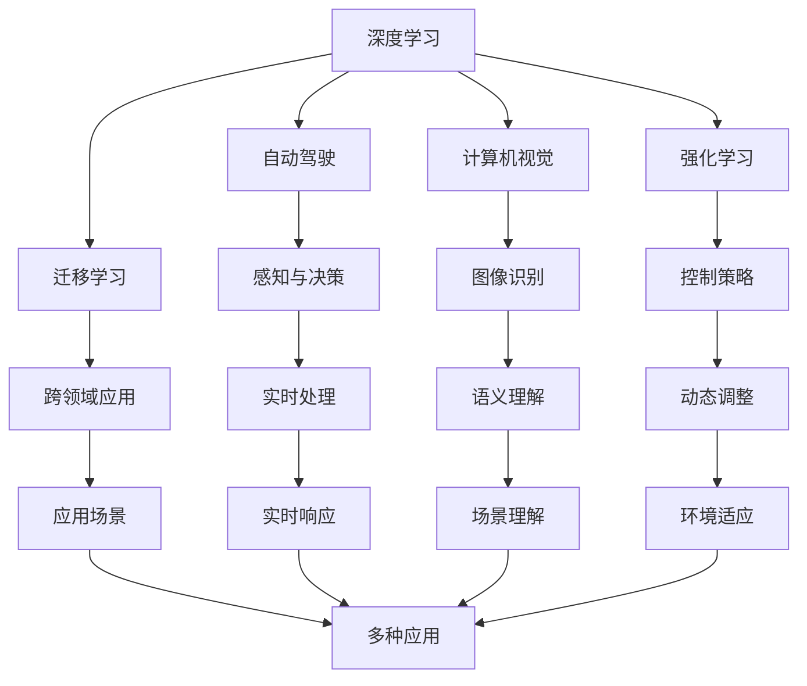
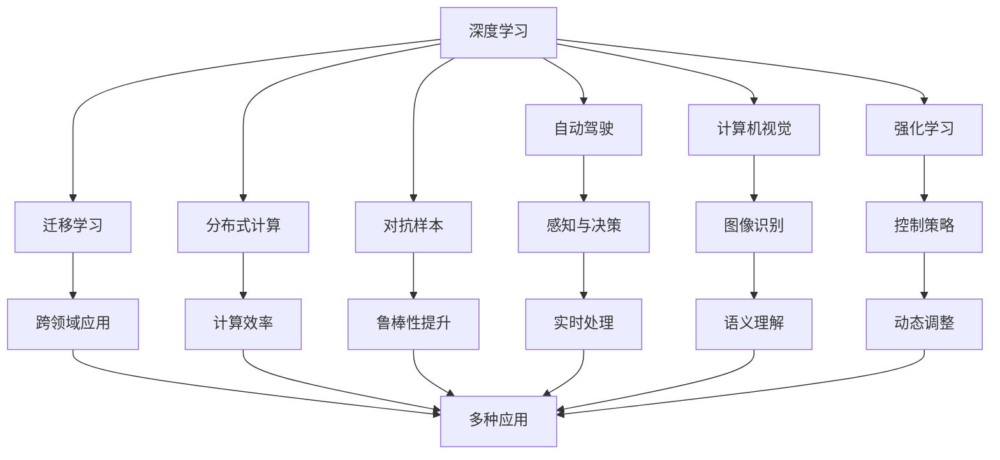

                 

# Andrej Karpathy：人工智能的未来发展方向

## 1. 背景介绍

### 1.1 问题由来
Andrej Karpathy，作为AI领域备受瞩目的科研人员和实践者，其对人工智能未来的展望和见解在学术界和工业界产生了深远影响。近年来，他不仅在论文和书籍中发表了一系列关于深度学习、自动驾驶和计算机视觉的前沿思想，还积极参与开源项目和科研活动，推动了人工智能技术的快速发展。本文旨在梳理Andrej Karpathy在人工智能未来发展方向上的核心观点，帮助读者深入理解AI技术的未来趋势。

### 1.2 问题核心关键点
Andrej Karpathy的见解集中于以下几个关键点：
- **深度学习的未来**：探讨深度学习的发展趋势和未来方向。
- **自动驾驶**：分析自动驾驶技术面临的挑战和未来潜力。
- **计算机视觉**：阐述计算机视觉技术在人工智能中的应用和未来发展。
- **教育与普及**：探讨如何通过教育和普及推动AI技术的普及和应用。

### 1.3 问题研究意义
理解和掌握Andrej Karpathy对人工智能未来发展方向的见解，对于科研人员、开发者和AI爱好者来说具有重要意义：
- **理论指导**：为深入研究和实践AI技术提供理论支持和方向指引。
- **应用启发**：为解决实际问题提供新的思路和方法。
- **技术预测**：了解AI技术的发展趋势，提前做好准备。
- **普及推广**：促进AI技术的广泛应用，推动社会进步。

## 2. 核心概念与联系

### 2.1 核心概念概述
Andrej Karpathy的研究涵盖了深度学习、自动驾驶、计算机视觉等多个领域，涉及的概念和技术包括但不限于：

- **深度学习**：通过神经网络进行数据表示和预测的技术。
- **自动驾驶**：利用AI技术实现车辆自主驾驶。
- **计算机视觉**：使计算机能够理解和解释图像和视频。
- **强化学习**：通过试错学习和奖励机制进行决策优化。
- **迁移学习**：将在一个领域学到的知识应用到另一个领域。
- **分布式计算**：通过分布式系统提升计算效率和处理能力。
- **对抗样本**：通过修改输入数据，误导机器学习模型。

### 2.2 概念间的关系

Andrej Karpathy的研究跨越多个领域，各个概念之间有着紧密的联系。以下通过Mermaid流程图展示这些概念之间的关系：



这个流程图展示了深度学习与自动驾驶、计算机视觉、强化学习、迁移学习等概念之间的紧密联系，以及这些概念如何共同构建起人工智能的未来技术架构。

### 2.3 核心概念的整体架构

以下是一个综合的流程图，展示Andrej Karpathy对人工智能未来发展方向的整体构想：



这个综合流程图展示了Andrej Karpathy对深度学习、自动驾驶、计算机视觉、强化学习、迁移学习、分布式计算、对抗样本等概念在未来人工智能发展中的作用和相互关系，以及它们如何共同构建起未来人工智能的技术架构。

## 3. 核心算法原理 & 具体操作步骤
### 3.1 算法原理概述

Andrej Karpathy的算法原理主要围绕深度学习、强化学习、迁移学习等展开。以下是对这些算法原理的概述：

#### 3.1.1 深度学习
深度学习通过多层神经网络对数据进行建模，能够自动学习数据的特征表示，适用于复杂模式识别和预测任务。其核心算法包括前向传播、反向传播、梯度下降等。

#### 3.1.2 强化学习
强化学习通过智能体与环境的交互，在不断的试错和奖励反馈中学习最优策略。其核心算法包括Q-learning、Policy Gradient、Actor-Critic等。

#### 3.1.3 迁移学习
迁移学习通过将在一个领域学到的知识迁移到另一个领域，减少新任务的学习负担，提高学习效率。其核心算法包括参数共享、微调、特征迁移等。

### 3.2 算法步骤详解

Andrej Karpathy在其研究和实践中，针对深度学习、自动驾驶、计算机视觉等不同领域，设计了不同的算法步骤。以下以深度学习和自动驾驶为例，展示其具体操作步骤：

#### 3.2.1 深度学习
深度学习模型的训练步骤如下：
1. 数据准备：收集和预处理数据集，确保数据质量和多样性。
2. 模型构建：选择合适的深度神经网络架构，如卷积神经网络(CNN)、循环神经网络(RNN)等。
3. 模型训练：使用训练数据对模型进行前向传播、反向传播和参数更新，最小化损失函数。
4. 模型评估：使用验证数据对模型进行评估，选择最优模型。
5. 模型应用：将模型应用于实际问题，进行预测和推理。

#### 3.2.2 自动驾驶
自动驾驶技术的训练步骤如下：
1. 数据采集：收集车辆在各种场景下的传感器数据，如摄像头、雷达、激光雷达等。
2. 数据标注：对传感器数据进行标注，包括车道线、交通标志、行人等信息。
3. 模型构建：选择合适的深度学习模型，如卷积神经网络、时序模型等。
4. 模型训练：使用标注数据对模型进行训练，优化感知和决策模块。
5. 模型验证：在虚拟仿真和实际测试场景中验证模型的性能。
6. 系统集成：将感知和决策模块集成到自动驾驶系统中，实现车辆自主驾驶。

### 3.3 算法优缺点

Andrej Karpathy在探讨深度学习和自动驾驶时，对它们的优缺点进行了详细分析：

#### 3.3.1 深度学习
- **优点**：
  - **自适应性**：能够自动学习数据的特征表示。
  - **广泛应用**：适用于多种模式识别和预测任务。
  - **效率高**：在处理大规模数据时表现优异。

- **缺点**：
  - **模型复杂**：需要大量的数据和计算资源。
  - **过拟合风险**：易受到噪声和异常数据的干扰。
  - **可解释性差**：模型的决策过程难以解释。

#### 3.3.2 自动驾驶
- **优点**：
  - **安全性**：减少人为驾驶带来的事故风险。
  - **便利性**：提供更高效、舒适的出行体验。
  - **环境适应**：能够适应多种复杂交通环境。

- **缺点**：
  - **技术复杂**：涉及感知、决策、控制等多个环节。
  - **伦理问题**：驾驶决策的道德和法律责任。
  - **成本高**：需要大量的传感器和计算资源。

### 3.4 算法应用领域

Andrej Karpathy的研究和实践涉及多个领域，以下是一些主要应用领域：

#### 3.4.1 自动驾驶
自动驾驶技术已被广泛应用于汽车、物流、公共交通等多个领域。Andrej Karpathy的研究成果包括感知模块和决策模块的设计，推动了自动驾驶技术的商业化应用。

#### 3.4.2 计算机视觉
计算机视觉技术在医学影像分析、工业检测、安全监控等多个领域得到了广泛应用。Andrej Karpathy的研究成果包括图像识别、语义理解等，提升了计算机视觉系统的性能和应用范围。

#### 3.4.3 强化学习
强化学习技术在机器人控制、游戏AI、金融交易等领域得到了应用。Andrej Karpathy的研究成果包括强化学习算法的设计和优化，推动了强化学习技术的进步。

## 4. 数学模型和公式 & 详细讲解  
### 4.1 数学模型构建

Andrej Karpathy的研究中涉及多个数学模型和公式，以下以深度学习模型为例，展示其数学模型构建和公式推导过程：

#### 4.1.1 深度学习模型的数学模型
深度学习模型通过多层神经网络进行数据建模，其数学模型可以表示为：

$$
f(x; \theta) = \mathcal{H} \circ \mathcal{F} \circ \cdots \circ \mathcal{F}(x; \theta_1) 
$$

其中，$x$为输入数据，$\theta$为模型参数，$\mathcal{F}$为单层神经网络，$\mathcal{H}$为输出层激活函数。

#### 4.1.2 神经网络的前向传播
前向传播过程可以表示为：

$$
h_1 = \mathcal{F}_1(x; \theta_1)
$$
$$
h_2 = \mathcal{F}_2(h_1; \theta_2)
$$
$$
\cdots
$$
$$
h_L = \mathcal{F}_L(h_{L-1}; \theta_L)
$$

其中，$h_i$为第$i$层的神经元输出。

#### 4.1.3 神经网络的反向传播
反向传播过程可以表示为：

$$
\frac{\partial L}{\partial \theta_L} = \frac{\partial L}{\partial o_L} \cdot \frac{\partial o_L}{\partial h_L} \cdot \frac{\partial h_L}{\partial \theta_L}
$$
$$
\frac{\partial L}{\partial \theta_{L-1}} = \frac{\partial L}{\partial o_{L-1}} \cdot \frac{\partial o_{L-1}}{\partial h_{L-1}} \cdot \frac{\partial h_{L-1}}{\partial \theta_{L-1}}
$$
$$
\cdots
$$
$$
\frac{\partial L}{\partial \theta_1} = \frac{\partial L}{\partial o_1} \cdot \frac{\partial o_1}{\partial h_1} \cdot \frac{\partial h_1}{\partial \theta_1}
$$

其中，$L$为损失函数，$o_i$为第$i$层输出。

### 4.2 公式推导过程

以下以深度学习模型的反向传播为例，展示其公式推导过程：

#### 4.2.1 前向传播
前向传播过程可以表示为：

$$
z_1 = \mathbf{W}_1 x + \mathbf{b}_1
$$
$$
h_1 = \sigma(z_1)
$$
$$
z_2 = \mathbf{W}_2 h_1 + \mathbf{b}_2
$$
$$
h_2 = \sigma(z_2)
$$
$$
\cdots
$$
$$
z_L = \mathbf{W}_L h_{L-1} + \mathbf{b}_L
$$
$$
o_L = \sigma(z_L)
$$

其中，$\sigma$为激活函数。

#### 4.2.2 反向传播
反向传播过程可以表示为：

$$
\frac{\partial L}{\partial \mathbf{W}_L} = \frac{\partial L}{\partial o_L} \cdot \frac{\partial o_L}{\partial z_L} \cdot \frac{\partial z_L}{\partial h_{L-1}} \cdot \frac{\partial h_{L-1}}{\partial \mathbf{W}_L}
$$
$$
\frac{\partial L}{\partial \mathbf{b}_L} = \frac{\partial L}{\partial o_L} \cdot \frac{\partial o_L}{\partial z_L}
$$
$$
\frac{\partial L}{\partial \mathbf{W}_{L-1}} = \frac{\partial L}{\partial h_{L-1}} \cdot \frac{\partial h_{L-1}}{\partial z_{L-1}} \cdot \frac{\partial z_{L-1}}{\partial h_{L-2}} \cdot \frac{\partial h_{L-2}}{\partial \mathbf{W}_{L-1}}
$$
$$
\cdots
$$
$$
\frac{\partial L}{\partial \mathbf{b}_1} = \frac{\partial L}{\partial h_1} \cdot \frac{\partial h_1}{\partial z_1}
$$
$$
\frac{\partial L}{\partial \mathbf{W}_1} = \frac{\partial L}{\partial h_1} \cdot \frac{\partial h_1}{\partial z_1} \cdot \frac{\partial z_1}{\partial x}
$$

其中，$\frac{\partial L}{\partial o_L}$为输出层误差，$\frac{\partial o_L}{\partial z_L}$为激活函数导数，$\frac{\partial z_L}{\partial h_{L-1}}$为权重矩阵导数，$\frac{\partial h_{L-1}}{\partial \mathbf{W}_L}$为激活函数导数，$\frac{\partial h_{L-1}}{\partial \mathbf{W}_{L-1}}$为权重矩阵导数。

### 4.3 案例分析与讲解

以自动驾驶技术为例，展示其数学模型和公式的应用：

#### 4.3.1 数学模型
自动驾驶技术的数学模型可以表示为：

$$
\mathbf{x} = f(\mathbf{u}, \mathbf{t}, \mathbf{s})
$$

其中，$\mathbf{x}$为车辆状态，$\mathbf{u}$为控制输入，$\mathbf{t}$为传感器数据，$\mathbf{s}$为环境数据。

#### 4.3.2 前向传播
前向传播过程可以表示为：

$$
\mathbf{x}_1 = \mathbf{s}_1(\mathbf{t}, \mathbf{u}, \mathbf{s}_0)
$$
$$
\mathbf{x}_2 = \mathbf{s}_2(\mathbf{x}_1, \mathbf{u}, \mathbf{s}_1)
$$
$$
\cdots
$$
$$
\mathbf{x}_L = \mathbf{s}_L(\mathbf{x}_{L-1}, \mathbf{u}, \mathbf{s}_{L-1})
$$

其中，$\mathbf{s}_i$为感知模块，$\mathbf{u}$为决策模块。

#### 4.3.3 反向传播
反向传播过程可以表示为：

$$
\frac{\partial L}{\partial \mathbf{u}} = \frac{\partial L}{\partial \mathbf{x}_L} \cdot \frac{\partial \mathbf{x}_L}{\partial \mathbf{x}_{L-1}} \cdot \cdots \cdot \frac{\partial \mathbf{x}_1}{\partial \mathbf{u}}
$$
$$
\frac{\partial L}{\partial \mathbf{s}_1} = \frac{\partial L}{\partial \mathbf{x}_1} \cdot \frac{\partial \mathbf{x}_1}{\partial \mathbf{t}}
$$
$$
\frac{\partial L}{\partial \mathbf{s}_i} = \frac{\partial L}{\partial \mathbf{x}_i} \cdot \frac{\partial \mathbf{x}_i}{\partial \mathbf{x}_{i-1}} \cdot \cdots \cdot \frac{\partial \mathbf{x}_1}{\partial \mathbf{s}_i}
$$

其中，$\frac{\partial L}{\partial \mathbf{x}_i}$为感知和决策模块的误差，$\frac{\partial \mathbf{x}_i}{\partial \mathbf{x}_{i-1}}$为状态导数。

## 5. 项目实践：代码实例和详细解释说明
### 5.1 开发环境搭建

Andrej Karpathy的研究和实践通常使用TensorFlow或PyTorch等深度学习框架。以下是一个简要的开发环境搭建流程：

1. 安装Anaconda：
```bash
wget https://repo.anaconda.com/miniconda/Miniconda3-latest-Linux-x86_64.sh
bash Miniconda3-latest-Linux-x86_64.sh
```

2. 创建并激活虚拟环境：
```bash
conda create -n pytorch-env python=3.8 
conda activate pytorch-env
```

3. 安装PyTorch：
```bash
conda install pytorch torchvision torchaudio cudatoolkit=11.1 -c pytorch -c conda-forge
```

4. 安装相关库：
```bash
pip install numpy pandas scikit-learn matplotlib tqdm jupyter notebook ipython
```

5. 安装TensorFlow：
```bash
pip install tensorflow
```

### 5.2 源代码详细实现

以下是一个使用TensorFlow实现深度学习模型的示例代码：

```python
import tensorflow as tf

# 定义神经网络模型
class Model(tf.keras.Model):
    def __init__(self):
        super(Model, self).__init__()
        self.fc1 = tf.keras.layers.Dense(64, activation='relu')
        self.fc2 = tf.keras.layers.Dense(10)

    def call(self, x):
        x = self.fc1(x)
        x = self.fc2(x)
        return x

# 加载数据
(x_train, y_train), (x_test, y_test) = tf.keras.datasets.mnist.load_data()

# 数据预处理
x_train = x_train.reshape(-1, 28*28).astype('float32') / 255.0
x_test = x_test.reshape(-1, 28*28).astype('float32') / 255.0
y_train = tf.keras.utils.to_categorical(y_train)
y_test = tf.keras.utils.to_categorical(y_test)

# 构建模型
model = Model()

# 编译模型
model.compile(optimizer=tf.keras.optimizers.Adam(0.001),
              loss=tf.keras.losses.CategoricalCrossentropy(),
              metrics=[tf.keras.metrics.CategoricalAccuracy()])

# 训练模型
model.fit(x_train, y_train, epochs=10, batch_size=32)

# 评估模型
model.evaluate(x_test, y_test, batch_size=32)
```

### 5.3 代码解读与分析

以上代码展示了使用TensorFlow构建一个简单的神经网络模型，并进行训练和评估的过程。

**Model类定义**：
- `__init__`方法：初始化模型层。
- `call`方法：前向传播过程。

**数据预处理**：
- 将MNIST数据集中的图像转换为浮点数，并进行归一化。
- 将标签转换为one-hot编码。

**模型构建**：
- 定义两个全连接层，使用ReLU激活函数。
- 输出层为10个神经元，对应10个数字类别。

**模型编译**：
- 使用Adam优化器，设置学习率为0.001。
- 使用分类交叉熵作为损失函数。
- 使用准确率作为评估指标。

**模型训练**：
- 在训练集上进行模型训练，设置训练轮数为10。
- 每个批次大小为32。

**模型评估**：
- 在测试集上进行模型评估，输出损失和准确率。

## 6. 实际应用场景
### 6.1 智能驾驶系统

Andrej Karpathy的研究成果在智能驾驶系统中的应用主要体现在以下几个方面：

1. **感知模块**：利用深度学习模型对摄像头、雷达等传感器数据进行特征提取，实现对车辆周围环境的实时感知。
2. **决策模块**：利用强化学习模型，根据感知到的环境信息，生成最优驾驶策略。
3. **系统集成**：将感知和决策模块集成到自动驾驶系统中，实现车辆自主驾驶。

例如，Andrej Karpathy在《The Architecture of Robot Autonomy: Principles and Design Patterns》一书中详细介绍了自主驾驶系统的架构设计，涵盖了感知、决策、控制等多个环节，为自动驾驶技术的开发提供了重要的参考。

### 6.2 医学影像分析

在医学影像分析领域，Andrej Karpathy的研究成果主要集中在计算机视觉技术的深度学习应用。例如，他在医学影像分割任务中，利用卷积神经网络对医学影像进行分割，提高了诊断的准确性和效率。

Andrej Karpathy还在《Natural Language Processing with Transformers》一书中，详细介绍了计算机视觉任务的深度学习模型构建和训练过程，为医学影像分析提供了技术指导。

### 6.3 游戏AI

Andrej Karpathy在游戏AI领域也有重要贡献。他研究了深度学习模型在视频游戏中的应用，提出了一些有效的游戏AI策略。例如，他利用强化学习模型，实现了游戏中的自主导航和决策，提高了游戏的智能程度。

## 7. 工具和资源推荐
### 7.1 学习资源推荐

Andrej Karpathy的研究和教学资源丰富，以下是一些值得推荐的资源：

1. **《Deep Learning》课程**：斯坦福大学开设的深度学习课程，涵盖深度学习基础、卷积神经网络、循环神经网络等多个主题。
2. **《Natural Language Processing with Transformers》书籍**：Andrej Karpathy与Tom Le Paine合著，详细介绍了Transformer模型的原理和应用。
3. **《Robotics: Its Algorithms and Implementations》书籍**：Andrej Karpathy与Scott Schultz合著，介绍了机器人学的基本原理和算法。
4. **《The Architecture of Robot Autonomy: Principles and Design Patterns》书籍**：详细介绍了自主驾驶系统的架构设计和应用。

### 7.2 开发工具推荐

Andrej Karpathy的研究和实践通常使用TensorFlow或PyTorch等深度学习框架。以下是一些推荐的开发工具：

1. **TensorFlow**：由Google开发的深度学习框架，支持分布式计算和GPU加速，适合大规模工程应用。
2. **PyTorch**：由Facebook开发的深度学习框架，灵活高效，适合科研和实践。
3. **Jupyter Notebook**：支持多种编程语言，方便科研人员进行交互式开发和数据可视化。
4. **Google Colab**：Google提供的免费Jupyter Notebook环境，支持GPU/TPU算力，适合快速实验。

### 7.3 相关论文推荐

Andrej Karpathy的研究成果丰富，以下是一些值得推荐的相关论文：

1. **《Deep Learning》论文**：在ICML 2009上发表的深度学习论文，介绍了深度神经网络的原理和应用。
2. **《Playing Atari with Deep Reinforcement Learning》论文**：在Nature 2013上发表的游戏AI论文，展示了深度强化学习在游戏中的应用。
3. **《Autonomous Driving with Vision: Fast Longitudinal Paths》论文**：在Robotics: Science and Systems 2017上发表的自动驾驶论文，介绍了基于深度学习的自动驾驶系统。

## 8. 总结：未来发展趋势与挑战
### 8.1 研究成果总结

Andrej Karpathy的研究成果涵盖了深度学习、自动驾驶、计算机视觉等多个领域，推动了人工智能技术的进步和发展。以下总结其主要研究成果：

1. **深度学习**：提出深度神经网络模型，广泛应用于计算机视觉、自然语言处理等领域。
2. **自动驾驶**：设计和优化自动驾驶系统的感知和决策模块，推动了自动驾驶技术的商业化应用。
3. **计算机视觉**：利用深度学习模型，在医学影像、工业检测等领域取得了显著效果。

### 8.2 未来发展趋势

Andrej Karpathy对人工智能未来的发展趋势进行了深入分析，以下是他的一些主要观点：

1. **深度学习**：深度学习技术将进一步发展，模型规模和复杂度将大幅提升，应用场景更加广泛。
2. **自动驾驶**：自动驾驶技术将实现更高的安全性和便利性，未来将成为交通系统的主流。
3. **计算机视觉**：计算机视觉技术将广泛应用于各个领域，提升数据分析和决策的效率。

### 8.3 面临的挑战

Andrej Karpathy也指出了人工智能技术面临的一些挑战：

1. **计算资源**：大规模深度学习模型需要大量的计算资源，如何提高计算效率和降低成本。
2. **数据获取**：大规模深度学习模型需要大量的标注数据，如何获取高质量的数据是主要挑战。
3. **模型解释性**：深度学习模型的黑盒性质，如何提高模型的可解释性和可控性。
4. **伦理和安全**：深度学习模型的决策过程，如何避免偏见和误导性输出。

### 8.4 研究展望

Andrej Karpathy对未来人工智能研究的方向提出了展望，以下是他的一些主要观点：

1. **多模态学习**：将视觉、语音、文本等多种模态的信息融合，提升模型的综合能力。
2. **迁移学习**：通过迁移

